# 第 5 课：怎样确认比较的是同一个测试对象

## 本课在学习链中的位置

- 上一层已经能从同一条历史推导自动检测状态，但此前假定所有 Observation 都属于同一测试对象。
- 本课只解决：测试定义相同而参数不同的两个 Invocation，能不能混进同一条历史。
- 本课输出稳定的 Case 身份和参数身份，下一课会在此基础上加入环境与执行画像。
- 本课无新增外部前置。

## 学完本课，你能够做到

1. 从 pytest nodeid 中区分稳定测试定义和参数实例。
2. 解释 `case_id` 与 `param_hash` 各自回答什么问题。
3. 判断两个 Observation 是否代表同一个测试对象，避免把不同参数的结果合并。

## 开始前自检

1. 第 4 课的状态机为什么需要“同一条历史”作为输入？
2. `pass → fail:A` 的签名能否代替测试对象身份？
3. 缺失身份字段时，应该把样本并入默认历史还是暂停比较？

<details>
<summary>查看自检答案</summary>

1. 状态机的证据和状态变化依赖可比较样本；不同对象混入会制造虚假切换。
2. 不能。签名只描述结果表现，不说明样本来自哪个测试对象。
3. 应暂停或拒绝比较，不能猜测默认身份。

如果第 1 题不清楚，请复习[第 4 课](04-四态检测机.md)；如果第 2 题不清楚，请复习[第 2 课](02-结果签名.md)。

</details>

## 核心问题

> 两个参数实例都叫 `test_async_generation`，为什么不能直接共享一条 Flaky 历史？

## 从统一案例中的一个现象开始

Case C 现在有两个参数实例：

```text
R1：test_async_generation[landscape] → PASS
R2：test_async_generation[portrait]  → FAIL+A
```

如果只看函数名，历史会被写成：

```text
PASS → FAIL+A
```

但 `landscape` 和 `portrait` 可能调用不同提示词、尺寸或模型参数；将它们合并会把“参数差异”误报成同一个 Case 的波动。

## 先做判断

1. 上面两个 nodeid 是否表示同一个稳定测试定义？
2. 它们是否表示同一个参数实例？
3. 为了安全比较，至少要把哪两个身份层次分开保存？

## 为什么已有解释不够

第 2～4 课只处理结果签名和历史规则，默认输入已经属于同一对象。实际 pytest nodeid 既包含稳定测试定义，也可能包含方括号中的参数展示名。若直接把完整 nodeid 当 Case 身份，参数每次变化会产生许多“新测试”；若只取函数名，又会把不同参数混成一条历史。

当前实现采取两层身份：

- `case_id` 表示去掉参数部分后的稳定测试定义。
- `param_hash` 表示当前参数值的稳定、脱敏摘要。

两者合在一起，才能表达“哪个测试定义的哪个参数实例”。

## 核心概念

### 1. Case 身份（Case ID）

`case_id` 是稳定测试定义的 nodeid，不包含参数方括号：

```text
module/smoke/test_demo.py::test_case[user-123]
→ module/smoke/test_demo.py::test_case
```

它回答“哪一条测试定义”，不回答“本次用了什么参数”。路径分隔符会被规范化，Windows 与 Unix 写法可以得到同一个稳定定义。

### 2. 参数身份（Parameter Hash）

`param_hash` 是参数值经过规范化、脱敏和 SHA-256 截断后的摘要。它回答“这条测试定义的哪一个参数实例”，不直接暴露参数原文：

```text
参数值
→ canonicalize_for_hash()
→ 脱敏后的规范文本
→ SHA-256 前 16 位
→ param_hash
```

相同参数结构得到相同摘要；有意义的参数变化应得到不同摘要。哈希长度和脱敏细节属于当前实现合同，本课不要求手算摘要。

## 本课知识关系图

```mermaid
flowchart LR
    PREV["第 4 课出口<br/>状态机需要同一条可比较历史"]
    ENTRY["本课入口<br/>带参数方括号的 pytest nodeid"]

    subgraph LESSON["本课：从执行标识拆出测试对象身份"]
        direction LR
        NODE["原始 nodeid<br/>定义 + 参数展示"]
        NORMALIZE["nodeid 规范化<br/>统一路径与空白"]
        CASE["Case ID<br/>移除参数后的稳定定义"]
        PARAM["参数值<br/>规范化并脱敏"]
        HASH["Parameter Hash<br/>参数实例摘要"]
        JOIN["可比较测试对象<br/>case_id + param_hash"]
        DECIDE{"两条记录的<br/>两层身份都相同？"}
        SAME["允许进入同一历史"]
        SPLIT["分开积累历史"]

        NODE -->|提取稳定部分| NORMALIZE
        NORMALIZE -->|保存定义| CASE
        NODE -->|读取调用参数| PARAM
        PARAM -->|生成稳定摘要| HASH
        CASE -->|与参数身份组合| JOIN
        HASH -->|与测试定义组合| JOIN
        JOIN -->|逐字段比较| DECIDE
        DECIDE -->|是| SAME
        DECIDE -->|否| SPLIT
    end

    EXIT["本课出口<br/>能用 case_id 与 param_hash 判断对象是否相同"]
    NEXT["第 6 课入口<br/>相同对象还要在哪个环境/画像范围内比较？"]

    PREV -->|提供比较需求| ENTRY
    ENTRY -->|交给身份拆分| NODE
    SAME -->|形成可比较样本集合| EXIT
    SPLIT -->|阻止错误合并| EXIT
    EXIT -->|继续限定比较范围| NEXT
```



## 最小规则

| 输入 | `case_id` | `param_hash` | 比较结论 |
| --- | --- | --- | --- |
| 同一 nodeid、同一参数值 | 相同 | 相同 | 可视为同一测试对象 |
| 同一测试定义、参数值不同 | 相同 | 不同 | 分开积累 |
| 测试定义不同、参数可能相同 | 不同 | 可能相同 | 分开积累 |
| nodeid 仅路径分隔符不同 | 规范化后相同 | 视参数而定 | 不因平台路径拆分 |

当前 Flaky Key 的完整组合还会加入 environment、execution_profile 和 state_epoch；本课先只建立其中的两层对象身份。

## 完整运行过程

```text
读取 pytest nodeid 与参数值
→ 规范化 nodeid，得到稳定测试定义
→ 规范化并脱敏参数值，得到 param_hash
→ 组合 case_id + param_hash
→ 与已有样本逐字段比较
→ 相同则可进入同一对象历史，不同则分开积累
```

## 正常路径

比较两个完全相同的参数实例：

```text
R1：module/smoke/test_demo.py::test_case[landscape]
R2：module\smoke\test_demo.py::test_case[landscape]
```

推导：

1. 反斜杠被规范化为斜杠。
2. 两条 nodeid 的稳定部分都得到 `module/smoke/test_demo.py::test_case`。
3. 参数值相同，规范化后的参数摘要相同。
4. `case_id` 和 `param_hash` 都相同，因此可以进入同一条对象历史。

## 复杂路径

只改变一个变量：将 R2 参数改为 `portrait`。

```text
R1：...::test_case[landscape]
R2：...::test_case[portrait]
```

稳定 `case_id` 仍然相同，但 `param_hash` 不同。因此两条样本必须分开；不能因为函数名相同就把结果写成同一条 `pass → fail` 历史。

## 对应的框架实现

### 先看测试断言

[质量标识测试](../../../tests/quality/test_quality_identifiers.py)验证参数被从稳定 Case 定义中移除，同时保留参数身份：

```python
windows = r"module\smoke\test_demo.py::TestDemo::test_case[user-123-token]"
unix = "module/smoke/test_demo.py::TestDemo::test_case[other-param]"

assert normalize_nodeid(windows).parameter_id == "user-123-token"
assert build_case_id(windows) == "module/smoke/test_demo.py::TestDemo::test_case"
assert build_case_id(unix) == build_case_id(windows)
```

另一组测试验证参数值变化会改变摘要，而字典顺序变化不会改变同一摘要。

### 再看生产代码

[normalize_nodeid()](../../../quality/identifiers.py)先分离稳定 nodeid 和参数部分：

```python
normalized = _WHITESPACE_PATTERN.sub(" ", nodeid.replace("\\", "/")).strip()
parameter_id = normalized[parameter_start + 1 : -1]
stable_nodeid = normalized[:parameter_start].rstrip()
```

[pytest_plugin_runtime.py](../../../quality/pytest_plugin_runtime.py)再把调用参数交给摘要函数，并生成调用上下文：

```python
param_hash = build_param_hash(parameter_value)
case_id = build_case_id(item.nodeid)
invocation_id = build_invocation_id(run_id, case_id, param_hash)
```

本课只追踪 `case_id` 和 `param_hash` 如何形成；`invocation_id` 如何跨 Run 区分一次执行，属于后续 Phase/Observation 课程的实现细节。

## 能够保证什么

- 相同稳定测试定义的参数实例可以被分别识别。
- 参数值不同通常产生不同 `param_hash`，不会因为函数名相同而自动合并。
- Windows/Unix 路径分隔符差异不会单独制造不同 `case_id`。
- 参数摘要不直接保存原始参数文本，并使用当前实现的规范化哈希合同。

## 保证成立的前提

- nodeid 能被解析出非空稳定测试定义。
- 参数值可以被规范化为可哈希表示；脱敏规则仍由当前实现负责。
- 比较双方使用相同的身份规则版本。
- environment、execution_profile 和 state_epoch 尚未纳入本课判断，不能据此宣称跨环境可比较。

## 不能保证什么

- `case_id` 相同不代表参数实例相同；还必须比较 `param_hash`。
- `param_hash` 相同不证明两个测试业务语义完全相同，只表示当前摘要规则认为参数表示相同。
- 身份相同不等于样本已经可信或能形成 Observation；Phase 和 P0 门禁在后续课程学习。
- 本课尚未生成完整 `flaky_key`，不能用它判断跨环境或跨 Epoch 的比较范围。

## 本课小结

可比较历史的第一步是先确认测试对象。`case_id` 保留稳定测试定义，`param_hash` 区分该定义的参数实例；两者共同决定本课的对象身份。函数名相同但参数不同的 Invocation 必须分开积累，路径分隔符差异则应在规范化后消失。

```text
nodeid + 参数值
→ case_id + param_hash
→ 判断对象是否相同
→ 允许合并或分开历史
```

## 课末自测

请先独立作答，再查看解析。

1. **拆分题**：`module/test.py::test_case[a]` 的 `case_id` 应包含 `[a]` 吗？
2. **判断题**：同一 `case_id`、不同 `param_hash` 的两条 Observation 可以共用一条历史。
3. **解释题**：为什么参数摘要需要规范化和脱敏，而不是直接把参数原文写入身份？
4. **边界题**：`case_id` 和 `param_hash` 都相同，是否已经证明两条样本可以跨所有环境合并？

<details>
<summary>查看答案与解析</summary>

1. 不应包含。`case_id` 是移除参数部分后的稳定测试定义，`[a]` 的信息由参数身份保留。
2. **不可以。** 参数实例不同，必须分开积累；否则会制造跨参数的虚假波动。
3. 规范化让等价表示得到稳定摘要，脱敏避免把敏感参数原文暴露在长期身份和日志中。
4. **不能。** 本课只覆盖测试定义和参数身份；环境、执行画像、Epoch 等比较作用域留到第 6 课。

常见错误是把完整 nodeid 当作唯一身份，或只看函数名而忽略参数实例。

</details>

## 本课完成标准

进入第 6 课前，你应能：

- 从带参数 nodeid 中写出稳定 `case_id` 和参数身份的职责。
- 对两组参数相同/不同的样本作出是否合并的判断。
- 说出身份相同仍不足以证明跨环境可比较。

若把参数放进 `case_id`，请复习“核心概念”；若想直接跨环境合并，请复习“不能保证什么”。

## 与下一课的关系

本课确认了“哪个测试定义的哪个参数实例”。下一课继续增加比较作用域：即使对象身份相同，`china` 与 `overseas`、`serial` 与 `parallel` 的结果是否应该共用一条历史？
