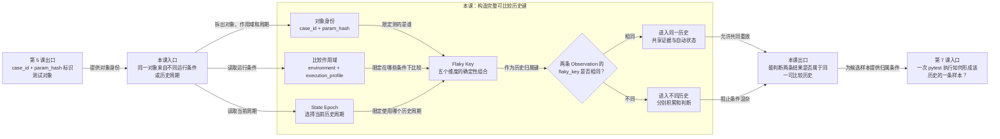

# 第 6 课：同一测试对象在什么范围内才可比较

## 本课在学习链中的位置

- 上一课已经用 `case_id + param_hash` 确认“哪个测试定义的哪个参数实例”。
- 本课继续限定：同一对象只有处在相同环境、执行画像和历史周期中，结果才进入同一条 Flaky 历史。
- 本课形成完整 `flaky_key`；第 7 课会在这个身份下把 pytest Phase 折叠为候选样本。
- 本课无新增前置知识卡。

## 学完本课，你能够做到

1. 判断环境或执行方式发生变化时，两条 Observation 是否仍可比较。
2. 解释 Epoch 为什么能开启新历史而不删除旧历史。
3. 根据五个身份维度判断两次构造会得到相同还是不同的 `flaky_key`。

## 开始前自检

1. `case_id` 和 `param_hash` 分别表示什么？
2. 同一 `case_id`、不同 `param_hash` 的样本能否合并？
3. 结果签名是否能代替测试对象身份？

<details>
<summary>查看自检答案</summary>

1. `case_id` 表示稳定测试定义，`param_hash` 表示参数实例。
2. 不能，必须分开积累历史。
3. 不能。签名描述结果表现，身份描述结果属于谁。

如果无法回答，请先复习[第 5 课](05-测试对象身份.md)。

</details>

## 核心问题

> 同一个参数实例在 `overseas/serial` 与 `china/parallel` 中执行，结果能直接放进同一条历史吗？

## 从统一案例中的一个现象开始

Case C 的测试对象身份保持不变：

```text
case_id   = module/smoke/test_image_generation.py::test_async_generation
param_hash = param-demo-v1
```

现在只改变环境：

```text
R1：overseas + serial → PASS
R2：china    + serial → FAIL+A
```

如果直接合并，会得到 `pass → fail:A`。但这个变化可能来自网络、区域服务或配置差异，而不是同一条件下的波动。

## 先做判断

1. 对象身份相同，是否足以让 R1 与 R2 可比较？
2. 如果系统从 serial 改为 parallel，应该沿用旧历史还是分开观察？
3. 测试断言语义发生有意变更时，如何保留旧记录又避免污染新判断？

## 为什么已有解释不够

`case_id + param_hash` 只回答“测的是谁”，没有回答“在什么条件下测”。环境和执行方式可能系统性改变结果分布。即使这些条件都没变，测试语义或身份规则发生明确变更时，也需要从新的历史周期开始。

因此完整比较身份还需要：

- 用比较作用域隔离环境和执行画像。
- 用 Epoch 隔离同一作用域内前后两个历史周期。
- 将五个维度确定性地组合成 `flaky_key`，作为一条状态历史的键。

## 核心概念

### 1. 比较作用域（Comparison Scope）

比较作用域由两个条件组成：

| 维度 | 回答的问题 | 当前典型值 |
| --- | --- | --- |
| `environment` | 在哪个受支持环境执行？ | `china`、`overseas` |
| `execution_profile` | 以哪类执行方式运行？ | `serial`、`parallel`、`manual-serial`、`manual-parallel` |

原始 worker 编号不会直接进入画像。例如 `parallel-pool/gw0` 与 `parallel-pool/gw17` 都规范为 `parallel`，避免每个 worker 被拆成独立历史。

比较作用域回答“在什么条件下比较”，不替代上一课的测试对象身份。

### 2. 历史周期（State Epoch）

`state_epoch` 是从 1 开始递增的历史周期编号：

```text
Epoch 1：旧规则或旧语义下的历史
显式 reset：1 → 2
Epoch 2：后续新样本组成的新历史
```

重置不会删除 Epoch 1 的 Observation。它只让同一 Case、环境和执行画像下的后续样本使用新编号，因而形成不同 `flaky_key`。重置需要明确的操作者和原因；本课只理解隔离效果，不展开治理命令。

### 3. Flaky Key（可比较历史键）

当前 `flaky_key` 由五个字段确定性生成：

```text
case_id
+ param_hash
+ environment
+ execution_profile
+ state_epoch
→ flaky-v1-<完整哈希>
```

五个输入完全相同，输出键相同；任一输入不同，应该得到不同键。状态机只在同一个 `flaky_key` 内重放历史。

## 本课知识关系图



## 最小规则

| 比较变化 | `flaky_key` | 历史处理 |
| --- | --- | --- |
| 五个字段完全相同 | 相同 | 进入同一条历史 |
| 只改变 `param_hash` | 不同 | 分开参数历史 |
| 只改变 `environment` | 不同 | 分开环境历史 |
| 只改变 `execution_profile` | 不同 | 分开执行画像历史 |
| 只将 `state_epoch` 从 1 改为 2 | 不同 | 保留旧历史，开启新周期 |

`flaky_key` 的哈希用于稳定编码这些字段，并不会证明字段值在业务上正确。

## 完整运行过程

```text
取得 case_id 与 param_hash
→ 规范化 environment
→ 从 execution_id 与 worker_id 归一化 execution_profile
→ 读取该 Case/环境/画像的当前 state_epoch
→ 将五个维度确定性编码为 flaky_key
→ 按 flaky_key 归属 Observation、历史与自动状态
```

## 正常路径

两次执行的五个维度完全相同：

```text
R1：Case C + param-demo-v1 + overseas + serial + Epoch 1
R2：Case C + param-demo-v1 + overseas + serial + Epoch 1
```

两次调用 `build_flaky_key()` 得到同一个字符串，因此 R1 和 R2 可以进入同一条可比较历史。它们的 PASS/FAIL 可以不同；结果不同是状态机要分析的事实，不是身份不同。

## 复杂路径

只改变一个变量：R2 的环境从 `overseas` 改为 `china`。

```text
R1：Case C + param-demo-v1 + overseas + serial + Epoch 1
R2：Case C + param-demo-v1 + china    + serial + Epoch 1
```

环境不同使 `flaky_key` 不同。即使 R1 PASS、R2 FAIL，也不能将它们拼成同一条 `pass → fail` 证据；两个作用域分别只有自己的样本。

执行画像或 Epoch 改变时使用同一原则，但本课不同时增加第二条复杂路径。

## 对应的框架实现

### 先看测试断言

[Flaky 模型测试](../../../tests/quality/test_flaky_models.py)逐个改变比较维度：

```python
base = build_flaky_key("case", "param", "overseas", "serial", 1)

assert base == build_flaky_key("case", "param", "overseas", "serial", 1)
assert base != build_flaky_key("case", "other", "overseas", "serial", 1)
assert base != build_flaky_key("case", "param", "china", "serial", 1)
assert base != build_flaky_key("case", "param", "overseas", "parallel", 1)
assert base != build_flaky_key("case", "param", "overseas", "serial", 2)
```

另一个测试证明 worker 编号不会拆分并行画像：

```python
assert normalize_execution_profile("parallel-pool", "gw0") == "parallel"
assert normalize_execution_profile("parallel-pool", "gw17") == "parallel"
```

### 再看生产代码

[build_flaky_key()](../../../quality/flaky_importer.py)将五个字段放入规范 payload：

```python
payload = {
    "case_id": case_id,
    "param_hash": param_hash,
    "environment": normalize_flaky_environment(environment),
    "execution_profile": normalize_stored_execution_profile(execution_profile),
    "state_epoch": state_epoch,
}
return f"flaky-v1-{_full_hash(payload)}"
```

Epoch 的作用域键只使用 `case_id + environment + execution_profile`，因此一次显式重置会为该作用域中的参数实例选择新周期；具体存储与审计到第 11～14 课再看。

## 能够保证什么

- 五个比较字段完全相同会稳定地产生相同 `flaky_key`。
- 参数、环境、执行画像或 Epoch 任一变化都会分离历史。
- 支持的环境和执行画像会先规范化，worker 编号不会无意义地拆分并行画像。
- Epoch 重置后旧 Observation 仍保留，后续样本使用新键。

## 保证成立的前提

- `case_id` 和 `param_hash` 已按上一课规则形成。
- 环境值属于当前支持集合，执行画像能被当前规则规范化。
- `state_epoch` 是大于等于 1 的当前有效编号。
- 比较双方使用相同版本的身份、环境和画像规则。

## 不能保证什么

- 相同 `flaky_key` 不代表 Observation 一定完整或可信；第 7～9 课才检查这些条件。
- 不同 `flaky_key` 不能直接合并状态，即使结果签名相同。
- Epoch 不是删除历史，也不是自动检测状态。
- 哈希相同只表达当前五个输入相同，不证明测试业务语义永远不变。

## 本课小结

对象身份回答“测的是谁”，比较作用域回答“在哪些条件下测”，Epoch 回答“属于哪个历史周期”。当前实现把这五个维度编码成 `flaky_key`；只有键相同的 Observation 才共享证据和自动状态。

```text
case_id + param_hash
+ environment + execution_profile
+ state_epoch
→ flaky_key
→ 同键共同重放，异键分别积累
```

## 课末自测

以基准输入 `case-C / param-1 / overseas / serial / Epoch 1` 为参照：

1. **判断题**：只将 worker 从 `gw0` 换成 `gw17`，两者都来自 `parallel-pool`，会因 worker 编号产生不同画像吗？
2. **复算题**：只把 environment 改为 `china`，`flaky_key` 应相同还是不同？
3. **解释题**：Epoch 1 重置为 Epoch 2 后，为什么不应删除 Epoch 1 的 Observation？
4. **边界题**：两条记录 `flaky_key` 相同，是否足以断言它们都能进入可信历史？

<details>
<summary>查看答案与解析</summary>

1. 不会。两者都规范为 `parallel`；worker 编号不是最终比较维度。
2. 不同。environment 是 `flaky_key` 的输入之一，变化后应分开历史。
3. Epoch 用于开启新判断周期，不用于改写事实。旧 Observation 仍是已发生历史，应保留供查询和审计。
4. 不足。身份相同只解决归属；Phase 完整性、失败证据和 P0 可信门禁尚未检查。

常见错误是把 Epoch 当清空数据库，或认为对象身份相同就能跨任何环境比较。

</details>

## 本课完成标准

- 能逐项比较五个字段并判断 `flaky_key` 是否应变化。
- 能解释比较作用域、Epoch 和自动检测状态三者职责不同。
- 能说明同键只是形成可比较历史的必要条件，不是可信样本的充分条件。

若仍混合环境，请复习“复杂路径”；若把 Epoch 当删除，请复习“核心概念”和“不能保证什么”。

## 与下一课的关系

现在已经知道一条 Observation 应归入哪条历史，但 pytest 一次 Invocation 通常产生 setup、call、teardown 多条 Phase 事实。第 7 课将学习如何把完整正常生命周期折叠为一条 `CaseObservationCandidate`。
