# 第 7 课：完整的 pytest Phase 怎样形成一条候选样本

## 本课在学习链中的位置

- 上一课已经能用完整比较身份判断一条历史的归属。
- 开始本课前，请先阅读[第 0 单元知识卡 B](../00-前置知识.md#知识卡-b一次-invocation-怎样留下事实)，认识 CaseResult、FailureRecord 和 P0 输入包。
- 本课只处理两条完整生命周期：全部通过，以及 call 失败且存在唯一失败证据。
- 本课输出 `CaseObservationCandidate`；第 8 课再学习事实不完整或不可唯一解释时为何排除。

## 学完本课，你能够做到

1. 将同一 Invocation 的 setup、call、teardown 三条 CaseResult 归并到一起。
2. 在完整 PASS 和 call FAIL 两条路径中找出决定性 Phase。
3. 写出折叠后 Candidate 的关键结果字段，并解释它为什么还不是持久化 Observation。

## 开始前自检

请先回答：

1. 一次普通 pytest Invocation 通常经历哪三个 Phase？
2. CaseResult 和 FailureRecord 分别记录什么？
3. `flaky_key` 回答的是结果内容，还是历史归属？

<details>
<summary>查看自检答案</summary>

1. `setup → call → teardown`。
2. CaseResult 记录某个 Phase 的执行事实；FailureRecord 记录与失败 Phase 关联的规范化失败证据。
3. `flaky_key` 回答历史归属，不直接描述 PASS/FAIL。

第 1～2 题答不出来时，请回到[知识卡 B](../00-前置知识.md#知识卡-b一次-invocation-怎样留下事实)；第 3 题不清楚时复习[第 6 课](06-可比较作用域.md)。

</details>

## 核心问题

> pytest 为一次 Invocation 留下三条 Phase 事实，Flaky 怎样把它们变成恰好一条单轮候选样本？

## 从统一案例中的一个现象开始

Case C 的一次完整通过留下：

```text
同一 invocation-C-R1
setup    PASSED
call     PASSED
teardown PASSED
```

如果直接把三行都写进长期历史，一次测试执行会被误当成三个样本。状态机看到的样本数、连续长度和切换次数都会被放大。

另一轮执行留下：

```text
同一 invocation-C-R2
setup    PASSED
call     FAILED，failure_id=A
teardown PASSED
FailureRecord(A) 与该 call Phase 唯一匹配
```

这也只能形成一个 Invocation 级结果，而不是“两个 PASS 加一个 FAIL”。

## 先做判断

请先写下答案和理由：

1. 第一组的决定性结果应该取 setup、call，还是三条各算一次？
2. 第二组最终应该形成 PASS 还是 FAIL？Failure ID 从哪里取得？
3. 折叠完成后能否立刻改变长期状态？

## 为什么已有解释不够

前六课把每个 PASS/FAIL 当作已经形成的 Observation，是为了先建立检测主线。真实输入却是 Phase 级 CaseResult：

- 三条记录属于同一次 Invocation，不能分别成为历史样本。
- PASS 需要完整生命周期支持，不能只看到一条成功 Phase 就下结论。
- FAIL 不仅要找到失败 Phase，还要关联唯一 FailureRecord，才能保留可比较的 Failure ID。

因此需要一次从 Phase 事实到 Invocation 级候选样本的折叠。

## 核心概念

### 1. Phase 折叠（Phase Folding）

Phase 折叠先按 `(run_id, invocation_id)` 将属于同一次执行的 CaseResult 分组，再把一组 Phase 事实归纳成至多一个结果：

```text
同一 Invocation 的多条 CaseResult
→ 校验共同身份和生命周期
→ 归纳为 0 或 1 条 Candidate
```

本课只看会产生 1 条 Candidate 的完整路径；产生 0 条的排除路径留到第 8 课。

### 2. 决定性 Phase（Decisive Phase）

决定性 Phase 是最终 Candidate 用来表达本轮结果和观察时间的那个 Phase：

| 生命周期 | 决定性 Phase | 原因 |
| --- | --- | --- |
| setup/call/teardown 全部 PASSED | call | 测试主体给出成功结论 |
| call FAILED，且证据唯一 | call | 失败事实与 FailureRecord 在 call 上匹配 |

“决定性”不代表其他 Phase 可以缺失；完整 PASS 仍需要 setup、call、teardown 三条事实共同满足接受条件。

### 3. Observation Candidate（候选观察样本）

`CaseObservationCandidate` 是折叠成功后的 Invocation 级事实，关键字段包括：

```text
run_id / invocation_id
case_id / param_hash / environment / execution_profile
decisive_phase
raw_status / final_status
observation_outcome
failure_id（FAIL 时必须有）
observed_at
```

它还不是持久化 Observation：此时尚未选择当前 Epoch、生成 `flaky_key` 和 `observation_id`，也没有写入数据库。

## 本课知识关系图

```mermaid
flowchart LR
    PREV["第 6 课出口<br/>知道候选样本应属于哪个比较作用域"]
    ENTRY["本课入口<br/>同一 Invocation 的 Phase 级 CaseResult"]

    subgraph LESSON["本课：从多条 Phase 事实折叠为一个候选样本"]
        direction LR
        GROUP["Phase 折叠<br/>按 run_id + invocation_id 分组"]
        LIFE["完整生命周期<br/>setup + call + teardown"]
        FAILURE["唯一 FailureRecord<br/>按失败 ID、Invocation、Case、Phase 匹配"]
        DECIDE{"是否存在失败/错误 Phase？"}
        PASS["PASS 路径<br/>call 是决定性 Phase"]
        FAIL["FAIL 路径<br/>匹配证据的失败 Phase是决定性 Phase"]
        CANDIDATE["CaseObservationCandidate<br/>一个 Invocation 只产生一条结果"]

        GROUP -->|得到同一次执行的 Phase 集合| LIFE
        LIFE -->|提供完整执行事实| DECIDE
        DECIDE -->|否，且 call PASSED| PASS
        DECIDE -->|是| FAILURE
        FAILURE -->|证据唯一可关联| FAIL
        PASS -->|写入 PASS 结果字段| CANDIDATE
        FAIL -->|写入 FAIL 与 failure_id| CANDIDATE
    end

    EXIT["本课出口<br/>能从完整生命周期构造一条 Candidate"]
    NEXT["第 8 课入口<br/>事实不足或互相冲突时为何不生成 Candidate？"]

    PREV -->|提供 Case、参数、环境和画像| ENTRY
    ENTRY -->|按一次执行聚合| GROUP
    CANDIDATE -->|形成尚未持久化的单轮事实| EXIT
    EXIT -->|留下候选是否可信的问题| NEXT
```



## 最小规则

本课只使用两个接受分支：

| Phase 事实 | 证据 | Candidate 输出 |
| --- | --- | --- |
| setup/call/teardown 均 PASSED | 不需要 FailureRecord | `outcome=PASS`，`decisive_phase=call`，`failure_id=None` |
| setup、teardown PASSED；call FAILED 且带 A | 唯一匹配 FailureRecord(A) | `outcome=FAIL`，`decisive_phase=call`，`failure_id=A` |

共同约束：

1. Phase 必须属于同一 `(run_id, invocation_id)`，且关键身份字段一致。
2. 一组 Invocation 事实至多产生一条 Candidate。
3. FAIL Candidate 必须保留唯一可匹配的 Failure ID；PASS Candidate 不得携带 Failure ID。

## 完整运行过程

```text
读取本轮所有 CaseResult
→ 按 run_id + invocation_id 分组
→ 校验组内身份一致并识别 Phase 集合
→ 判断是否存在 FAILED/ERROR
→ PASS：选择 call
→ FAIL：用 failure_id 匹配唯一 FailureRecord，再选择对应失败 Phase
→ 复制身份、结果和观察时间
→ 形成一条 CaseObservationCandidate
```

本课到 Candidate 为止，不进行 P0 整包可信校验、不写 SQLite，也不运行状态机。

## 正常路径

### 路径一：完整通过

输入：

```text
setup    PASSED
call     PASSED
teardown PASSED
```

推导：

1. 三条记录的 `run_id`、`invocation_id`、Case 和参数身份相同，被分到一组。
2. Phase 集合正好是 setup、call、teardown。
3. 没有 FAILED/ERROR，且 call 的 `raw_status` 和 `final_status` 都是 PASSED。
4. call 成为决定性 Phase。
5. 输出一条 `observation_outcome=PASS`、`failure_id=None` 的 Candidate。

三条 PASSED 不是三个 PASS Observation；它们共同证明一个 Invocation 级 PASS。

### 路径二：call 失败且证据唯一

输入：

```text
setup    PASSED
call     FAILED，failure_id=A
teardown PASSED
FailureRecord(A)：同一 invocation、同一 case、phase=call
```

推导：

1. Phase 生命周期完整，组内身份一致。
2. call 是 FAILED，候选进入失败分支。
3. 使用 `(A, invocation_id, case_id, call)` 查找 FailureRecord，得到恰好一条匹配。
4. call 成为决定性 Phase。
5. 输出一条 `outcome=FAIL`、`final_status=FAILED`、`failure_id=A` 的 Candidate。

## 复杂路径

本课的唯一复杂变量是“call 从 PASSED 变为 FAILED，并新增唯一 FailureRecord”。与 PASS 路径相比：

- 分组方式、身份校验和完整生命周期不变。
- 决定性 Phase 仍是 call。
- 输出从 PASS 变成 FAIL，并携带 Failure ID 与 Failure Category。
- Candidate 数量仍然是 1。

FailureRecord 缺失、重复或冲突时不能沿用这条路径；这些排除原因统一留到第 8 课。

## 对应的框架实现

### 先看测试断言

[导入器测试](../../../tests/quality/test_flaky_importer.py)分别固定 PASS 与 FAIL Candidate 的关键事实：

```python
assert prepared.metadata.eligible_count == 1
assert prepared.candidates[0].observation_outcome is ObservationOutcome.PASS
assert prepared.candidates[0].decisive_phase is CasePhase.CALL
```

失败路径继续验证上游 Failure ID 被保留：

```python
candidate = prepared.candidates[0]
assert candidate.observation_outcome is ObservationOutcome.FAIL
assert candidate.failure_id == artifacts.failures[0].failure_id
```

这些测试通过完整导入准备入口得到 Candidate；本课只关注其中的折叠结果，第 9 课再解释入口前后的 P0 门禁。

### 再看生产代码

[fold_case_observations()](../../../quality/flaky_importer.py)先分组，然后每组只追加一次结果：

```python
grouped[(case.run_id, case.invocation_id)].append(case)

candidate = _fold_invocation(phases, failure_lookup, ...)
candidates.append(candidate)
```

`_fold_invocation()` 在完整 PASS 路径中选择 call：

```python
if call is not None and call.final_status is CaseStatus.PASSED:
    decisive = call
    outcome = ObservationOutcome.PASS
    failure_id = None
```

失败路径使用 Failure ID、Invocation、Case 和 Phase 四项定位唯一 FailureRecord，之后构造一条 `CaseObservationCandidate`。本课跳过其他排除分支。

## 能够保证什么

- 同一次 Invocation 的正常三 Phase 不会各自成为长期样本。
- 完整通过路径由 call 表达 PASS 结果，并且不携带 Failure ID。
- call 失败路径只有在失败证据唯一匹配时才保留对应 Failure ID。
- 折叠产物保留后续构造历史键所需的 Case、参数、环境和执行画像。

## 保证成立的前提

- 输入已经是 P0 归并后的 CaseResult 和 FailureRecord 模型。
- 普通路径包含 setup、call、teardown，且组内身份字段一致。
- 失败 Phase 给出的 Failure ID 能唯一匹配同一 Invocation、Case 和 Phase 的 FailureRecord。
- 本课暂不判断整个 P0 输入包是否可信；那是第 9 课的职责。

## 不能保证什么

- 看到 call PASSED 不能在 teardown 尚未产生时提前写入 PASS。
- Candidate 尚未持久化，不等于数据库中已有 Observation。
- Candidate 不包含 Metrics、Token、成本或轮询耗时，它们不参与当前 Flaky 判定。
- Candidate 本身不会运行状态机或改变 pytest 结果。

## 本课小结

pytest 的 setup、call、teardown 是一次 Invocation 的阶段事实，不是三个长期样本。Phase 折叠按 Invocation 分组，完整 PASS 选择 call 作为决定性 Phase；call FAIL 则要求唯一 FailureRecord，并保留 Failure ID。两条路径最终都只形成一条尚未持久化的 `CaseObservationCandidate`。

```text
多条 Phase CaseResult + 必要的 FailureRecord
→ 按 Invocation 折叠
→ 选择决定性 Phase
→ 一条 CaseObservationCandidate
```

## 课末自测

请先独立作答，再查看答案。

1. **归并题**：setup/call/teardown 三条 PASSED 应形成几条 Candidate？决定性 Phase 是什么？
2. **复算题**：call FAILED 且唯一 FailureRecord 的 `failure_id=B`，Candidate 的 outcome 和 failure_id 是什么？
3. **解释题**：为什么不能把 setup PASSED 和 teardown PASSED 分别记成 PASS Observation？
4. **边界题**：Candidate 已形成，是否说明它已经有 `flaky_key` 并写入长期数据库？

<details>
<summary>查看答案与解析</summary>

1. 形成 1 条 Candidate，决定性 Phase 是 call。三条 Phase 共同描述一次 Invocation。
2. `observation_outcome=FAIL`，`failure_id=B`；决定性 Phase 是匹配该证据的 call。
3. setup 和 teardown 只描述准备与清理。分别记样本会重复计算一次执行，并可能掩盖 call 或其他 Phase 的失败。
4. 不是。Candidate 只是折叠产物；当前 Epoch、`flaky_key`、`observation_id` 和数据库写入都尚未发生。

常见错误是把 Phase 数量当成样本数量，或认为 FAIL 字符串本身足以替代唯一 FailureRecord。

</details>

## 本课完成标准

- 能把两组正常 Phase 数据各自完整推导为一条 Candidate。
- 能指出 PASS/FAIL 路径的决定性 Phase，以及 FAIL 路径为何需要唯一 FailureRecord。
- 能准确说明 Candidate 与持久化 Observation 的区别。

若把三个 Phase 当三个样本，请复习“Phase 折叠”；若认为 Candidate 已入库，请复习“Observation Candidate”和“不能保证什么”。

## 与下一课的关系

本课输入都是足以形成唯一结论的完整事实。下一课只改变一个前提：让生命周期缺失、身份冲突或失败证据不足，观察系统为什么选择排除，而不是猜出一条 PASS/FAIL Candidate。
