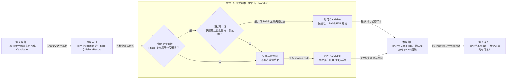

# 第 8 课：哪些事实不足以形成可信样本

## 本课在学习链中的位置

- 上一课已经学会把完整 PASS 或带唯一失败证据的 call FAIL 折叠为一条 Candidate。
- 本课只追问：当生命周期或失败证据不足以唯一说明本轮结果时，为什么必须排除而不能猜测。
- 本课输出“Candidate 或明确排除原因”；第 9 课会从单个 Invocation 提升到整个 P0 来源的可信门禁。
- 本课继续使用[知识卡 B](../00-前置知识.md#知识卡-b一次-invocation-怎样留下事实)，无新增知识卡。

## 学完本课，你能够做到

1. 用生命周期完整性和证据唯一性判断一组 Phase 是否可形成 Candidate。
2. 解释 FAIL Phase 缺少匹配 FailureRecord 时为何必须排除。
3. 区分“没有 Candidate”“产生 PASS Candidate”和“产生 FAIL Candidate”。

## 开始前自检

1. 三条正常 PASSED Phase 应形成几条 Candidate？
2. call FAILED 时，FailureRecord 至少要在哪些身份上与失败 Phase 对应？
3. Candidate 是否已经是数据库 Observation？

<details>
<summary>查看自检答案</summary>

1. 一条。
2. Failure ID、Invocation、Case 和 Phase 必须对应，并且匹配结果唯一。
3. 不是。Candidate 尚未选择 Epoch、生成历史键或写入数据库。

答不出来时，请复习[第 7 课](07-正常Invocation折叠.md)。

</details>

## 核心问题

> call 明明标记为 FAILED，但对应 FailureRecord 不存在时，为什么不能仍然写一条通用 FAIL？

## 从统一案例中的一个现象开始

Case C 留下：

```text
setup    PASSED
call     FAILED，failure_id=A
teardown PASSED
```

但 `failures.jsonl` 中没有与 A 对应的 FailureRecord。

如果强行生成 `fail:A`，系统无法证明 A 是一条真实、唯一、属于这个 Phase 的规范化失败证据；如果改成 PASS，更是篡改执行事实；如果写成 `fail:unknown`，又会人为制造一个当前规则不存在的失败身份。

## 先做判断

请先写下你的选择和理由：

1. 这组 Phase 应生成 PASS、FAIL，还是零个 Candidate？
2. “没有 Candidate”是否等于“本轮通过”？
3. 系统是否应该留下一个可查询的排除原因？

## 为什么已有解释不够

第 7 课只展示事实足够的成功路径，因此“看到 FAILED 就生成 FAIL”似乎可行。但长期 Flaky 历史要求签名可比较；一个没有唯一证据的失败无法形成可信签名。

当前实现采用保守规则：

- 生命周期必须是当前折叠器明确接受的形状。
- 失败必须能归属到唯一的规范化证据。
- 不满足时不生成 Candidate，同时记录排除原因。

因此本例输出零个 Candidate，原因是 `missing_failure_fingerprint`。这表示“本轮没有可用 Flaky 样本”，不是 PASS。

## 核心概念

### 1. 生命周期完整性（Lifecycle Completeness）

生命周期完整性判断 Phase 集合是否符合当前接受形状：

```text
普通执行：setup + call + teardown
setup 提前终止：setup(ERROR/SKIPPED) + teardown
```

缺少普通执行所需的 teardown、出现重复 Phase 或只有 collection Phase，都不能按正常 Invocation 解释。完整性只判断“事实结构够不够”，不决定 PASS/FAIL。

### 2. 证据唯一性（Evidence Uniqueness）

对于 FAILED/ERROR Invocation，当前折叠器要求：

1. 失败 Phase 至少给出一个 Failure ID。
2. 一次 Invocation 不能出现多个相互竞争的 Failure ID。
3. 决定性失败 Phase 必须恰好匹配一条 FailureRecord。

“恰好一条”同时排除零条和多条匹配。只有这样，`failure_id` 才能安全进入 Candidate 和后续结果签名。

### 3. 排除原因（Exclusion Reason）

排除原因是折叠失败时记录的稳定代码，例如：

| 原因代码 | 表示什么 |
| --- | --- |
| `incomplete_phase` | Phase 集合不符合接受生命周期 |
| `identity_conflict` | 同组 Phase 的关键身份不一致 |
| `missing_failure_fingerprint` | 没有唯一匹配的失败证据 |
| `multiple_failure_fingerprints` | 一次 Invocation 出现多个失败身份 |
| `expected_outcome_excluded` | skip/xfail/xpass 不进入当前 Flaky 历史 |

排除原因描述为什么没有样本，不是 Case 状态，也不是 pytest 结果。

## 本课知识关系图



## 最小规则

```text
Phase 形状不被接受
→ 零 Candidate + 生命周期排除原因

Phase 形状被接受，但失败证据不唯一
→ 零 Candidate + 证据排除原因

Phase 形状被接受，结果可唯一解释
→ 一条 PASS 或 FAIL Candidate
```

关键语义：

- 零 Candidate ≠ PASS Candidate。
- 排除只影响 Flaky 历史样本，不改写 pytest 原始结果。
- setup/teardown ERROR 不是一律排除；生命周期被接受且失败证据唯一时，它们会形成 FAIL Candidate。

## 完整运行过程

```text
按 Invocation 分组 Phase
→ 校验组内身份与 Phase 唯一性
→ 判断生命周期形状是否被接受
→ 查找 FAILED/ERROR Phase 的 Failure ID
→ 匹配同一 Failure ID、Invocation、Case、Phase 的 FailureRecord
→ 可唯一解释：形成一条 Candidate
→ 不可唯一解释：记录原因并跳过该 Invocation
```

## 正常路径

沿用第 7 课的 call FAIL：

```text
call FAILED，failure_id=A
FailureRecord(A) 唯一存在，且 invocation/case/phase 全部对应
```

生命周期完整，Failure ID 只有一个，FailureRecord 匹配数恰好为 1。因此生成一条 FAIL Candidate，保留 A。

## 复杂路径

只改变一个变量：删除 FailureRecord(A)。

```text
call FAILED，failure_id=A
FailureRecord(A) 匹配数 = 0
```

逐步判断：

1. setup/call/teardown 仍完整。
2. call 的 FAILED 事实仍存在，pytest 原始结果没有被改写。
3. 但 A 没有唯一规范化证据，无法安全进入长期签名。
4. 折叠器捕获 `missing_failure_fingerprint`。
5. `candidates=()`，`excluded_reasons={"missing_failure_fingerprint": 1}`。

系统宁可少一个样本，也不制造 `fail:unknown` 或虚假 PASS。

## 巩固对照：同一原则处理其他事实

这些不是新的主推导，只用“结构是否完整、结果是否唯一”复核：

| 输入变化 | 处理 | 原因 |
| --- | --- | --- |
| 普通执行缺 teardown | 排除 | `incomplete_phase` |
| call 的 worker_id 与 setup/teardown 不同 | 排除 | `identity_conflict` |
| call 为 SKIPPED/XFAILED/XPASSED，且无失败错误 | 排除 | `expected_outcome_excluded` |
| setup ERROR + teardown，且证据唯一 | FAIL Candidate | setup 为决定性 Phase |
| call PASSED、teardown ERROR，且证据唯一 | FAIL Candidate | teardown 错误不能被 call PASS 掩盖 |
| 同一 Invocation 出现两个 Failure ID | 排除 | `multiple_failure_fingerprints` |

## 对应的框架实现

### 先看核心测试断言

[导入器测试](../../../tests/quality/test_flaky_importer.py)删除全部 FailureRecord 后验证：

```python
folded = fold_case_observations(artifacts.cases, (), ...)

assert folded.candidates == ()
assert folded.excluded_reasons == {"missing_failure_fingerprint": 1}
```

这两个断言分别证明“没有猜测 Candidate”和“没有静默丢弃原因”。同文件还覆盖生命周期缺失、skip 系列、身份冲突、setup/teardown error 和多个失败身份。

### 再看生产代码

[flaky_importer.py](../../../quality/flaky_importer.py)要求 Failure ID 存在且只有一个：

```python
if not failure_ids:
    raise FlakyImportError("missing_failure_fingerprint", ...)
if len(failure_ids) != 1:
    raise FlakyImportError("multiple_failure_fingerprints", ...)
```

随后匹配 FailureRecord：

```python
matching_failures = failure_lookup.get(
    (failure_id, first.invocation_id, first.case_id, decisive.phase),
    [],
)
if len(matching_failures) != 1:
    raise FlakyImportError("missing_failure_fingerprint", ...)
```

外层 `fold_case_observations()` 捕获该错误，增加排除计数并继续处理其他 Invocation。因此一个坏样本不会被猜测，也不会阻止同一来源中其他可用 Invocation 完成折叠。

## 能够保证什么

- 不完整生命周期不会被补成 PASS。
- 失败证据为零条、多条或相互冲突时，不会生成猜测的 FAIL Candidate。
- 每个被排除 Invocation 都增加对应原因计数并形成告警 issue。
- 合法的 setup 或 teardown ERROR 能在唯一证据支持下形成 FAIL，而不是被 call 结果掩盖。

## 保证成立的前提

- 输入已经解析为 CaseResult 和 FailureRecord。
- 分组键与身份字段采用当前规则。
- 本课判断发生在 Invocation 折叠阶段；来源级完整性尚未经过第 9 课门禁。
- 排除代码的具体名字属于当前实现版本。

## 不能保证什么

- 排除不表示原始 pytest 执行通过，也不消除原始失败。
- 没有 Candidate 不等于零个问题；它可能意味着诊断事实不足。
- 有 Candidate 也不证明整个 P0 文件来源未被篡改。
- Flaky 折叠器不会根据异常文本自行重建缺失 Failure ID。

## 本课小结

长期历史只接受能够被完整、唯一解释的 Invocation。生命周期完整性检查事实形状，证据唯一性检查失败能否归属到恰好一条规范化证据；任一失败都会产生明确排除原因和零个 Candidate。缺失样本保留“未知”语义，绝不补成 PASS。

```text
Phase + FailureRecord
→ 生命周期检查
→ 失败证据唯一性检查
→ 一条 Candidate，或零 Candidate + 排除原因
```

## 课末自测

请先独立判断，再查看解析。

1. **复算题**：完整三 Phase 中 call FAILED+A，但匹配 FailureRecord 为 0 条，输出什么？
2. **解释题**：为什么不能用 `fail:unknown` 代替缺失证据？
3. **判断题**：call PASSED，所以即使 teardown ERROR，最终也应形成 PASS Candidate。
4. **边界题**：某 Invocation 被排除，能否在报表中把它计为一个 PASS 样本？

<details>
<summary>查看答案与解析</summary>

1. 零个 Candidate，并记录 `missing_failure_fingerprint`。
2. `unknown` 不是上游提供的规范化失败身份，会人为制造可比较签名，污染历史证据。
3. **错误。** teardown ERROR 在证据唯一时形成 FAIL Candidate，决定性 Phase 是 teardown。
4. 不能。排除表示没有可用 Flaky 样本；原始 pytest 结果仍由 pytest/P0 持有，缺失不能变成 PASS。

常见错误是把排除当作忽略失败，或认为所有 setup/teardown 异常都排除。真正判断依据是生命周期形状和证据能否唯一归属。

</details>

## 本课完成标准

- 能对核心缺失证据案例推导出零 Candidate 和准确原因。
- 能解释 PASS Candidate、FAIL Candidate、零 Candidate 三者语义不同。
- 能用同一原则判断 teardown error、skip 和身份冲突对照案例。

若仍把零 Candidate 当 PASS，请复习“复杂路径”和“不能保证什么”；若一见 ERROR 就排除，请复习巩固对照表。

## 与下一课的关系

前两课解决了单个 Invocation 的形成与排除。但即使每个 Candidate 单独看来合法，如果输入文件被改写、Run 尚未完成或存在阻断完整性问题，整包数据仍不可信。第 9 课将建立来源级 P0 门禁。
