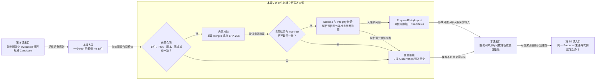

# 第 9 课：上游产物为什么仍要经过可信门禁

## 本课在学习链中的位置

- 第 7～8 课已经能对单个 Invocation 形成 Candidate 或记录排除原因。
- 本课把视角提升到整个 P0 输入包：即使某组 Phase 看起来合法，也必须先证明来源完整、内容与声明一致。
- 本课输出一份 `PreparedFlakyImport`，或拒绝整个来源；第 10 课将判断同一可信来源重复到达时该怎么办。
- 本课继续使用[知识卡 B](../00-前置知识.md#知识卡-b一次-invocation-怎样留下事实)，无新增知识卡。

## 学完本课，你能够做到

1. 说出 Flaky 导入所需的五份 P0 文件及它们在门禁中的作用。
2. 根据 manifest 声明哈希与实际文件哈希判断来源是否被改动。
3. 解释为什么任一阻断校验失败时要拒绝整包，而不能导入看起来正常的部分。

## 开始前自检

1. Phase 折叠成功后得到 Candidate 还是持久化 Observation？
2. 失败证据缺失时，能否生成 `fail:unknown`？
3. 零 Candidate 是否等于 PASS？

<details>
<summary>查看自检答案</summary>

1. 得到 `CaseObservationCandidate`，尚未持久化。
2. 不能；折叠器会排除并记录原因。
3. 不等于。它表示本轮没有可用 Flaky 样本。

若答案不清楚，请先复习[第 7 课](07-正常Invocation折叠.md)和[第 8 课](08-样本排除规则.md)。

</details>

## 核心问题

> `case-results.jsonl` 中的每行都能解析，为什么 Flaky 仍不能直接把它们导入历史？

## 从统一案例中的一个现象开始

P0 完成归并时，manifest 记录了 `case-results.jsonl` 的 SHA-256：

```text
manifest 声明：case-results SHA256 = H1
当前文件计算：case-results SHA256 = H1
```

随后有人在 manifest 写完后修改了 `case-results.jsonl`，但没有更新 manifest：

```text
manifest 声明：case-results SHA256 = H1
当前文件计算：case-results SHA256 = H2
```

新增内容甚至可能仍是合法 JSON。问题不在“能不能解析”，而在于它已经不是 manifest 声明完成的那份输出。

## 先做判断

请先写下答案和理由：

1. H1 与 H2 不同时，应继续读取并只导入合法行吗？
2. 这一轮其他文件哈希都正确，是否可以忽略 `case-results` 的差异？
3. SHA-256 相等是否能证明文件中的业务事实一定真实？

## 为什么已有解释不够

第 8 课只验证一组已解析 Phase 是否能形成唯一结果，没有证明：

- 文件集合属于请求的同一个 Run。
- Run 和 manifest 已完成且版本受支持。
- merged 文件仍是 manifest 完成时声明的内容。
- JSONL 每行符合模型，Integrity 问题没有破坏 Case 事实可信性。

因此 Candidate 折叠之前还需要来源级门禁。哈希不一致时，当前实现拒绝整个来源，并且不会创建历史数据库；它不会从已失去整体一致性的包中挑行导入。

## 核心概念

### 1. 来源合同（Source Contract）

来源合同规定 Flaky 接受一个 P0 Run 所需的文件与关键声明。五份必需文件是：

```text
reports/quality/run.json
reports/quality/merged/manifest.json
reports/quality/merged/case-results.jsonl
reports/quality/merged/failures.jsonl
reports/quality/merged/integrity-issues.jsonl
```

合同至少核对：文件存在、请求/run/manifest 的 `run_id` 一致、Run 已 `FINISHED`、manifest 为 `complete`、版本受支持、环境受支持、Run 与 manifest 的 Integrity 状态一致。

这里的合同是机器可验证的输入约定，不是对外部服务真实性的承诺。

### 2. 内容校验（Content Validation）

内容校验回答“当前读取的字节是否仍与 manifest 声明一致”。当前实现为三份 merged 输出计算 SHA-256，并与 manifest 对比：

```text
case-results
failures
integrity-issues
```

哈希相等证明当前字节与声明的摘要一致；哈希不相等证明内容发生差异。它不能证明测试事实在现实世界中一定正确，也不能取代 Schema 和 Integrity 校验。

### 3. 整包拒绝（Whole-source Rejection）

整包拒绝表示：来源级阻断条件出现时，这个 Run 的所有 Candidate 都不进入长期历史。

```text
一个必需文件或阻断校验失败
→ prepare 失败
→ 本 Run 插入 0 条 Observation
→ 已有数据库历史不被该来源改写
```

这与第 8 课的单 Invocation 排除不同：单个 Invocation 折叠失败时，其他 Invocation 可以继续；来源合同或内容可信性失败时，整包停止。

## 本课知识关系图



## 最小规则

按当前入口顺序理解门禁：

1. 五份必需文件全部存在，否则拒绝。
2. `run.json` 与 manifest 的 Run 身份、版本、状态和 Integrity 声明满足合同，否则拒绝。
3. manifest 中三份 merged 输出哈希必须等于当前文件哈希，否则整包拒绝。
4. JSON/JSONL 必须能解析为当前 Schema，记录必须属于当前 Run；Integrity ERROR 或影响 Case 可信性的 WARN 会阻断。
5. 通过后才折叠 Candidate 并形成 `PreparedFlakyImport`；安全警告可以使后续结果为 `DEGRADED`，但不必阻断 Case 历史。

本课核心只改变第 3 条的哈希是否相等；其他条件作为来源合同检查表使用。

## 完整运行过程

```text
定位五份 P0 文件
→ 计算当前文件摘要
→ 读取 run.json 与 manifest
→ 校验 Run 身份、版本、完成状态和 Integrity 声明
→ 比较 manifest 声明哈希与 merged 文件实际哈希
→ 解析 CaseResult、FailureRecord、IntegrityIssue
→ 校验记录归属与阻断完整性问题
→ 折叠 Invocation
→ 形成 PreparedFlakyImport，或在任一阻断点整包拒绝
```

## 正常路径

输入包满足：

```text
五份文件存在
Run FINISHED / manifest complete
run_id 和版本一致
三份 merged 文件实际 SHA-256 = manifest 声明
JSONL 符合 Schema
没有影响 Case 可信性的阻断 Integrity 问题
```

门禁通过后，`prepare_flaky_import()` 才调用第 7～8 课的折叠器，并输出：

- 可信 Run 元数据。
- 可用 Candidate 列表。
- 单 Invocation 排除原因。
- 实际来源哈希和来源摘要所需信息。

这一步仍没有向 SQLite 写入 Observation。

## 复杂路径

只改变一个变量：在 manifest 完成后向 `case-results.jsonl` 追加内容，保留旧 manifest。

```text
期望哈希 H1
实际哈希 H2
H1 != H2
```

逐步结果：

1. 文件仍存在，Run/manifest 基本字段也可能正确。
2. `_validate_output_hashes()` 在 `case-results` 上发现差异。
3. 抛出 `artifact_hash_mismatch`。
4. Candidate 折叠和数据库导入均不执行。
5. 导入报告状态为 `FAILED`，数据库文件不会因本次来源被创建。

不能因为追加行恰好是合法 JSON 就绕过门禁；哈希验证的是“是否仍为声明完成的整包”。

## 对应的框架实现

### 先看测试断言

[导入器测试](../../../tests/quality/test_flaky_importer.py)在 manifest 生成后修改 CaseResult 文件：

```python
with (artifacts.merged / "case-results.jsonl").open("a", encoding="utf-8") as handle:
    handle.write("{}\n")

result = import_flaky_history(...)

assert result.status is FlakyImportStatus.FAILED
assert result.issues[0].code == "artifact_hash_mismatch"
assert not database.exists()
```

测试最后一行证明来源在进入数据库之前被拒绝。

### 再看生产代码

[prepare_flaky_import()](../../../quality/flaky_importer.py)先验证声明，再解析 JSONL：

```python
source_hashes = {name: _file_sha256(path) for name, path in paths.items()}
run_record = _read_model(paths["run_record"], RunRecord)
manifest = _read_json_object(paths["manifest"])
_validate_run_and_manifest(request.run_id, run_record, manifest)
_validate_output_hashes(manifest, source_hashes)

case_results = _read_jsonl_models(paths["case_results"], CaseResult, request.run_id)
```

哈希不一致在 `_validate_output_hashes()` 中立即成为 `FlakyImportError("artifact_hash_mismatch", ...)`。调用层将它写入失败报告，不会用局部数据继续导入。

## 能够保证什么

- 当前导入只接受文件齐全、Run/manifest 合同受支持的 P0 包。
- 三份 merged 输出在解析前会与 manifest 声明哈希比较。
- 来源级阻断失败不会插入该 Run 的部分 Observation。
- 安全 warning 与影响 Case 可信性的 warning 会被区别处理，而不是所有 `DEGRADED` 一律拒绝。

## 保证成立的前提

- Flaky 通过 `prepare_flaky_import()` 入口读取当前基准约定的 P0 目录。
- manifest 是受信任工作流中的完成声明；哈希算法只比较内容与声明。
- Schema、版本和安全 warning 白名单均采用当前实现规则。
- 文件在哈希计算和后续读取之间没有被外部并发改写；当前代码没有跨文件系统读取锁。

## 不能保证什么

- SHA-256 相等不能证明业务事实真实，只能证明读取内容与声明摘要一致。
- 来源通过门禁不代表每个 Invocation 都会形成 Candidate；单样本排除规则仍然生效。
- `DEGRADED` 不等于零问题，也不必然等于整包拒绝，必须看 warning 是否影响 Case 信任。
- 门禁不会修复或猜测损坏数据。

## 本课小结

单个 Invocation 可折叠，不代表整个来源可信。Flaky 先验证五份 P0 文件的来源合同，再比较 manifest 声明与实际 merged 内容，最后解析 Schema 和 Integrity。任一来源级阻断失败都会拒绝整包；只有通过后才产生 `PreparedFlakyImport`。

```text
P0 文件包
→ 来源合同
→ 内容哈希
→ Schema / Integrity
→ PreparedFlakyImport 或整包拒绝
```

## 课末自测

请先独立作答，再查看解析。

1. **复算题**：manifest 声明 `case-results=H1`，实际文件为 H2，其他文件正常；结果是什么？
2. **解释题**：为什么追加一行合法 JSON 仍会触发整包拒绝？
3. **判断题**：SHA-256 相等足以证明外部 LLM 服务确实返回了文件记录的结果。
4. **边界题**：P0 来源通过门禁后，是否保证每个 Invocation 都会形成 Candidate？

<details>
<summary>查看答案与解析</summary>

1. 来源以 `artifact_hash_mismatch` 失败，0 条 Observation 进入数据库。
2. manifest 声明的是完成时的整包内容；追加后实际字节已变，即使格式合法，也不再是被声明的那份输出。
3. **错误。** 哈希验证字节一致性，不验证现实业务事实或外部服务承诺。
4. 不保证。单个 Invocation 仍可能因生命周期、身份或失败证据问题被第 8 课规则排除。

常见错误是把“能解析”当成“可信”，或者认为一个文件失败时可以导入其他文件中的局部结果。

</details>

## 本课完成标准

- 能按正确顺序说明来源合同、内容校验与整包拒绝的关系。
- 能完整推导哈希不一致为什么发生在数据库写入前。
- 能区分来源级拒绝与单 Invocation 排除。

若仍把哈希当真实性证明，请复习“内容校验”和“不能保证什么”；若混淆两类拒绝，请复习“整包拒绝”。

## 与下一课的关系

来源通过门禁后会形成同一组稳定来源哈希。如果同一个 Run 被重复提交，系统不能重复增加 Observation；第 10 课将用 Source Digest 区分安全重试与来源冲突。
