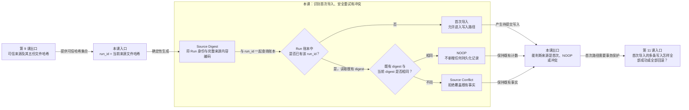

# 第 10 课：同一个来源再次到达时怎样处理

## 本课在学习链中的位置

- 上一课已经将通过 P0 门禁的来源准备为稳定的元数据与 Candidate 集合。
- 本课只解决同一个 Run 被重试导入时，怎样区分“完全相同的安全重试”和“同名但内容变化的冲突”。
- 本课输出首次导入、NOOP 或来源冲突；第 11 课会解释首次导入的多条数据库写入怎样保持原子性。
- 本课无新增前置知识卡。

## 学完本课，你能够做到

1. 说明 Source Digest 由哪些来源事实决定。
2. 根据 `run_id + source_digest` 判断重试是 NOOP 还是冲突。
3. 解释 NOOP 为什么必须保持 Run 与 Observation 数量不变。

## 开始前自检

1. P0 内容校验比较的是哪两份哈希？
2. 通过门禁后得到的 Candidate 是否已经写入数据库？
3. 哈希相等能否证明外部业务事实真实？

<details>
<summary>查看自检答案</summary>

1. manifest 声明的 merged 输出哈希与当前文件重新计算的哈希。
2. 没有；它仍属于 `PreparedFlakyImport`。
3. 不能，只能证明内容与声明摘要一致。

答不出来时，请先复习[第 9 课](09-P0可信门禁.md)。

</details>

## 核心问题

> CI 重试把同一个 Run 的 P0 包再次提交，怎样避免把同一次执行写成两份历史样本？

## 从统一案例中的一个现象开始

R3 第一次导入后，数据库中已有：

```text
Run 账本：R3 1 条
Observation：Case C / R3 1 条
```

网络重试让完全相同的 R3 再次到达。如果第二次又插入一条 Observation，历史会从真实的一次执行变成两次相同执行，样本数和连续长度都会被虚增。

另一个情况是：仍声称自己是 R3，但 `run.json` 的 branch 等来源内容已经改变。这不能当作普通重试覆盖旧记录，否则同一个 Run 身份会代表两份不同事实。

## 先做判断

1. R3 内容完全相同地再次导入，应该新增、跳过还是报错？
2. R3 的来源内容改变后再次导入，应该覆盖第一次记录吗？
3. 只比较 `run_id`，能否区分上述两种情况？

## 为什么已有解释不够

`run_id` 只能说明来源自称属于哪一轮，不能说明两次到达的文件是否完全相同。单独比较某一份文件哈希也不足以代表整个来源包。

当前实现为通过门禁的完整来源构造 Source Digest，再与 Run 账本中的既有值共同判断：

- 相同身份、相同内容是安全重试，返回 NOOP。
- 相同身份、不同内容是不可覆盖的来源冲突。
- 尚不存在该 Run 才进入首次导入路径。

## 核心概念

### 1. 来源摘要（Source Digest）

Source Digest 是对一个完整 P0 来源身份的确定性摘要，输入包括：

```text
run_id
+ run.json SHA-256
+ manifest.json SHA-256
+ case-results.jsonl SHA-256
+ failures.jsonl SHA-256
+ integrity-issues.jsonl SHA-256
→ source_digest
```

任一来源文件内容改变都会改变相应文件哈希，进而改变 Source Digest。`importer_version` 不属于来源事实，因此仅升级导入器版本不会把同一包变成冲突。

### 2. 幂等空操作（Idempotent NOOP）

幂等表示同一操作安全重试后，持久化结果与只执行一次相同。当前导入的 NOOP 条件是：

```text
数据库已有相同 run_id
且既有 source_digest == 本次 source_digest
```

NOOP 不插入 Run、不插入 Observation，也不重新解释来源；它明确返回“已经处理过相同事实”。

### 3. 来源冲突（Source Conflict）

来源冲突表示身份与内容声明互相矛盾：

```text
数据库已有相同 run_id
但既有 source_digest != 本次 source_digest
→ run_source_conflict
```

冲突不会覆盖第一次已提交的 Run 和 Observation。当前存储还防御“不同 run_id 却复用同一 digest”，但由于标准 digest 本身包含 `run_id`，这主要是持久化唯一约束的防御分支，不是本课主路径。

## 本课知识关系图



## 最小规则

| 账本查询 | Digest 比较 | 结果 | 数据变化 |
| --- | --- | --- | --- |
| 无相同 `run_id` | 无需比较 | 首次导入 | 进入写入路径 |
| 有相同 `run_id` | 相同 | `NOOP` | Run 和 Observation 均不增加 |
| 有相同 `run_id` | 不同 | `run_source_conflict` | 不覆盖、不增加 |

课末参考约束：若存储层收到不同 `run_id` 却使用已被占用的相同 digest，会报 `source_digest_conflict`。本课不把它与核心重试路径混合推导。

## 完整运行过程

```text
P0 门禁通过
→ 用 run_id 和五份文件哈希计算 source_digest
→ 按 run_id 查询导入账本
→ 无记录：检查 digest 未被其他 Run 占用，进入首次写入
→ 有记录：比较既有 digest
→ 相同返回 NOOP；不同返回冲突
```

## 正常路径

R3 第一次导入：

```text
run_id = R3
source_digest = D3
账本中没有 R3
```

服务确认 D3 也未被其他 Run 占用后，进入首次导入路径，最终写入一条 R3 账本记录和一条 Case C Observation。

同一包再次到达：

```text
run_id = R3
source_digest = D3
账本已有 R3 → 既有 digest 也是 D3
```

返回 `NOOP`，`inserted_count=0`。数据库仍是 1 条 Run、1 条 Observation。

## 复杂路径

只改变一个变量：保留 `run_id=R3`，修改 `run.json` 的 branch，因此本次 Source Digest 变为 D4。

```text
账本：R3 → D3
本次：R3 → D4
D3 != D4
```

服务返回 `run_source_conflict`。第一次提交的 R3/D3 与 Observation 保持不变；D4 不覆盖、不追加。

## 对应的框架实现

### 先看测试断言

[存储测试](../../../tests/quality/test_flaky_store.py)连续导入同一包：

```python
first = import_flaky_history(request)
second = import_flaky_history(request)

assert first.status is FlakyImportStatus.IMPORTED
assert second.status is FlakyImportStatus.NOOP
assert second.inserted_count == 0
assert check.run_count == 1
assert check.observation_count == 1
```

同文件修改 `run.json` 后验证冲突不会覆盖：

```python
assert second.status is FlakyImportStatus.FAILED
assert second.issues[0].code == "run_source_conflict"
assert check.run_count == 1
assert check.observation_count == 1
```

### 再看生产代码

[flaky_importer.py](../../../quality/flaky_importer.py)的 `_source_digest()` 编码 Run 与五份文件哈希。随后 [import_service.py](../../../quality/flaky_store/import_service.py)先查账本：

```python
existing_digest = repository.source_digest_for_run(connection, metadata.run_id)
if existing_digest is not None:
    if existing_digest == metadata.source_digest:
        return StoreImportOutcome(imported=False, inserted_count=0, ...)
    raise FlakyStoreError("run_source_conflict", ...)
```

这段判断发生在 Observation 物化和 Run 插入之前，因此 NOOP 与冲突都不会先写一部分数据。

## 能够保证什么

- 相同 Run、相同来源内容可安全重复提交，持久化数量不会增长。
- 相同 Run、不同来源内容不会覆盖第一次已提交事实。
- 仅改变 importer 版本不会改变 Source Digest，也不会把相同来源误判为冲突。
- 导入结果明确区分首次 `IMPORTED`、重复 `NOOP` 和冲突失败。

## 保证成立的前提

- 来源已经通过第 9 课的 P0 门禁，文件哈希来自当前读取内容。
- Source Digest 使用当前固定的字段集合和确定性编码。
- 查询与后续首次写入处在存储层事务中；具体边界在第 11 课展开。
- Run 账本没有被外部绕过约束直接篡改。

## 不能保证什么

- NOOP 不表示来源内容“没有问题”，只表示同一事实已按相同 digest 处理过。
- Source Digest 不是业务真实性证明，也不是 Failure ID。
- 冲突不会自动选择哪个版本正确，只会拒绝覆盖并要求调查。
- 幂等不会保护首次写入中途失败；这需要下一课的事务原子性。

## 本课小结

Source Digest 把 Run 身份与整个 P0 来源内容组合成稳定摘要。存储先按 `run_id` 查询账本：未见过则首次导入，见过且 digest 相同则 NOOP，见过但 digest 不同则冲突。这样安全重试不会虚增样本，矛盾来源也不会覆盖既有事实。

```text
run_id + 来源文件哈希
→ source_digest
→ 查询 Run 账本并比较
→ 首次导入 / NOOP / 来源冲突
```

## 课末自测

请先独立作答，再查看答案。

1. **复算题**：账本已有 `R3→D3`，本次为 `R3→D3`，结果与插入数是什么？
2. **复算题**：账本已有 `R3→D3`，本次为 `R3→D4`，是否覆盖？
3. **解释题**：为什么 Source Digest 要包含整个来源的多个文件哈希，而不是只含 `case-results`？
4. **边界题**：只把 importer 版本从 A 升到 B、P0 文件未变，应该制造新 digest 吗？

<details>
<summary>查看答案与解析</summary>

1. 返回 `NOOP`，插入数为 0；既有 Run 和 Observation 数量不变。
2. 返回 `run_source_conflict`，不覆盖 D3，也不追加 D4 的 Observation。
3. Candidate 的意义还依赖 Run、manifest、Failure 和 Integrity 事实；只摘要 CaseResult 无法代表完整来源身份。
4. 不应该。importer 版本不是 P0 来源事实，当前测试验证仅改变它仍得到 NOOP。

常见错误是认为“同 run_id 一律 NOOP”或“后到内容覆盖先到内容”。正确判断必须同时比较身份和摘要。

</details>

## 本课完成标准

- 能根据三种账本情况准确给出首次、NOOP 或冲突结果。
- 能说明 NOOP 后 Run/Observation 计数为何不变。
- 能区分 Source Digest、内容哈希和业务真实性。

若只看 `run_id`，请复习“来源摘要”和“最小规则”；若想覆盖冲突，请复习“复杂路径”。

## 与下一课的关系

本课已经决定哪些来源应该首次写入，但一次首次导入需要创建或读取 Epoch、物化 Observation、写 Run 账本和样本。第 11 课将解释其中一步失败时为什么不能留下半成品。
