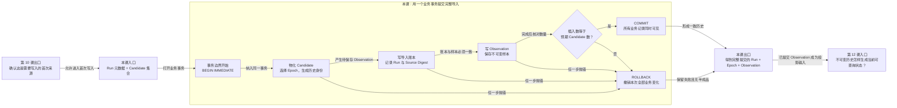

# 第 11 课：多条写入怎样避免留下半成品

## 本课在学习链中的位置

- 上一课已经把来源分为首次导入、幂等 NOOP 和来源冲突；只有首次导入进入本课的写入路径。
- 开始本课前，请阅读[第 0 单元知识卡 C](../00-前置知识.md#知识卡-c持久化只需要三个词)，掌握表、唯一约束和事务的最小含义。
- 本课只解释一次业务导入的原子性，不展开 Schema migration 与备份。
- 本课输出已提交的不可变 Observation 历史；第 12 课会从这些历史事实生成当前状态投影。

## 学完本课，你能够做到

1. 说明首次导入需要共同提交哪些业务记录。
2. 画出当前业务事务的开始、提交和回滚边界。
3. 根据中途故障推导 Run 账本、Epoch 作用域和 Observation 的最终数量。

## 开始前自检

1. 同一 `run_id + source_digest` 已存在时，首次写入还是 NOOP？
2. 事务承诺的“原子性”是什么意思？
3. Candidate 和持久化 Observation 的区别是什么？

<details>
<summary>查看自检答案</summary>

1. 返回 NOOP，不进入首次写入。
2. 一组写入要么全部提交，要么在失败时全部撤销。
3. Candidate 是准备阶段的 Invocation 级事实；持久化时还要选择当前 Epoch、生成 `flaky_key` 和 `observation_id`，然后写入数据库。

第 1 题不清楚时复习[第 10 课](10-幂等导入.md)；第 2 题答不出时回到[知识卡 C](../00-前置知识.md#知识卡-c持久化只需要三个词)。

</details>

## 核心问题

> 已经写入 Run 账本后，插入 Observation 突然失败，数据库会不会留下“Run 已导入但没有样本”的半成品？

## 从统一案例中的一个现象开始

R3 首次导入需要处理：

```text
当前 Epoch 作用域
Run 导入账本 R3
Case C 的 Observation
```

假设程序已经创建新的 Epoch 作用域并写入 R3 账本，随后在插入 Observation 时抛出异常。如果前两步仍留在数据库，下次重试会发现 R3 已存在，可能误判成 NOOP，却永远没有真正的样本。

## 先做判断

请先写下答案：

1. Observation 插入失败后，Run 账本应该保留还是撤销？
2. 本次首次创建的 Epoch 作用域应该保留吗？
3. Schema 表已经初始化完成，业务事务失败时这些空表也必须删除吗？

## 为什么已有解释不够

第 10 课只决定“是否应该首次写”，没有保证多条 SQL 能作为一个整体完成。唯一约束可以阻止重复键，却不能自动撤销其他已经成功的写入。

当前实现用一条业务事务包住首次导入：

- 事务开始后才执行幂等查询、Epoch 物化、Run 账本和 Observation 写入。
- 任一业务步骤抛出异常，连接执行 ROLLBACK。
- 全部成功且数量校验通过，连接才执行 COMMIT。

Schema 初始化在这条业务事务之前完成，它有独立的迁移边界；业务回滚清空本次数据记录，不要求删除已正确建立的空表。

## 核心概念

### 1. 导入账本（Import Ledger）

`flaky_import_run` 是 Run 导入账本。它保存 `run_id`、Source Digest、来源元数据和预期/排除数量，承担第 10 课的幂等查询依据。

账本中的“R3 已导入”必须与 R3 的 Observation 同时成立，因此它不能先独立提交。

### 2. 事务边界（Transaction Boundary）

事务边界明确哪些操作共享一次 COMMIT 或 ROLLBACK。当前一次 `FlakyStore.import_run()` 的业务事务覆盖：

```text
幂等与冲突查询
→ 读取/创建 Epoch 作用域
→ Candidate 物化为 Observation
→ 插入 Run 账本
→ 插入所有 Observation
→ 校验实际插入数
```

连接以 `BEGIN IMMEDIATE` 开始事务。初始化 Schema 的 migration 不属于这条业务事务，留到进阶 A 学习。

### 3. 回滚（Rollback）

回滚在事务内任一异常发生时撤销尚未提交的业务变化：

```text
本次新增 Epoch 作用域 → 撤销
本次 Run 账本          → 撤销
本次已插入 Observation → 撤销
```

异常仍会向调用者传播或被上层转换为失败报告；回滚不是把失败隐藏为成功。

## 本课知识关系图



## 最小规则

| 事务内结果 | Run 账本 | 新 Epoch 作用域 | Observation | 对外结果 |
| --- | ---: | ---: | ---: | --- |
| 全部步骤及数量校验成功 | 提交 | 提交或沿用 | 全部提交 | imported |
| 物化、账本或任一 Observation 写入失败 | 0 条新增 | 0 条新增 | 0 条新增 | 异常/失败 |
| 最终插入数与预期不一致 | 0 条新增 | 0 条新增 | 0 条新增 | `observation_count_mismatch` |

“0 条新增”只针对本次事务；此前已经提交的其他 Run 历史不受影响。正确初始化的 Schema 表可能仍存在且为空。

## 完整运行过程

```text
校验 Candidate 数与元数据预期一致
→ 打开数据库连接并完成 Schema 初始化
→ BEGIN IMMEDIATE
→ 再次执行账本幂等/冲突判断
→ 为每个 Candidate 读取或创建 Epoch，生成 Observation
→ 写 Run 账本
→ 写全部 Observation
→ 查询本 Run 的实际 Observation 数并与预期比较
→ 全部成功则 COMMIT
→ 任一异常则 ROLLBACK 并继续抛出异常
```

## 正常路径

R3 有一条 Candidate，数据库尚无相应 Epoch 作用域：

1. Schema 初始化完成后进入业务事务。
2. Candidate 物化时创建 Epoch 1 作用域，并生成 `flaky_key`、`observation_id`。
3. 插入 R3 导入账本。
4. 插入一条 Observation。
5. 查询 R3 的 Observation 数为 1，与预期 Candidate 数相等。
6. COMMIT。

事务结束后，Run 账本 1 条、Epoch 作用域 1 条、Observation 1 条同时可见。

## 复杂路径

只改变一个变量：让 `insert_observation()` 在执行时抛出异常。

故障可能发生在 Epoch 作用域和 Run 账本已经执行 INSERT 之后，但尚未 COMMIT：

```text
创建 Epoch 作用域
→ 写 Run 账本
→ 插入 Observation 抛错
→ ROLLBACK
```

最终计数：

```text
flaky_case_epoch = 0
flaky_import_run = 0
case_observation = 0
```

下次重试不会被残留账本误判为 NOOP。Schema 表仍可以存在，因为它们是在业务事务之前正确初始化的结构，而不是本次 Run 数据。

## 对应的框架实现

### 先看测试断言

[事务边界测试](../../../tests/quality/test_flaky_store_transaction_boundaries.py)注入 Observation 写入故障：

```python
monkeypatch.setattr(
    store.repository,
    "insert_observation",
    lambda connection, observation: (_ for _ in ()).throw(
        RuntimeError("injected observation failure")
    ),
)

with pytest.raises(RuntimeError):
    store.import_run(prepared.metadata, prepared.candidates)

assert counts["flaky_import_run"] == 0
assert counts["flaky_case_epoch"] == 0
assert counts["case_observation"] == 0
```

[存储测试](../../../tests/quality/test_flaky_store.py)还通过唯一约束触发 Observation 插入失败，得到相同的三类零计数。

### 再看生产代码

[facade.py](../../../quality/flaky_store/facade.py)将业务服务调用放在事务上下文内：

```python
with self.repository.connection(require_existing=False) as connection:
    initialization = initialize_store(connection, self.repository, ...)
    with self.repository.transaction(connection):
        return import_service.import_run(connection, self.repository, ...)
```

[repository.py](../../../quality/flaky_store/repository.py)定义边界：

```python
connection.execute("BEGIN IMMEDIATE")
try:
    yield connection
except Exception:
    connection.execute("ROLLBACK")
    raise
else:
    connection.execute("COMMIT")
```

`import_service.import_run()` 在同一连接中物化 Observation、写账本、写样本并核对数量，没有为每一步单独提交。

## 能够保证什么

- 当前公共 `import_run()` 的业务写入使用同一主连接和同一事务。
- 任一业务写入或数量校验失败时，本次 Run、Epoch 与 Observation 新增记录共同回滚。
- 已提交的其他 Run 历史不因本次失败被清除。
- 异常不会被事务层吞掉，调用者仍能得到失败。

## 保证成立的前提

- 写入通过 `FlakyStore.import_run()` 公共入口，而不是绕过它直接调用 Repository。
- SQLite 连接与事务上下文保持有效。
- Schema 初始化已成功；migration 自身的原子性属于进阶 A。
- 外部代码没有在事务外直接修改相同数据库。

## 不能保证什么

- 业务回滚不删除已经正确初始化的空 Schema 表。
- 事务不能让不可信 P0 变可信；来源门禁必须先通过。
- 原子提交不等于自动计算状态；状态投影是下一课的独立事务。
- 唯一约束只阻止冲突记录，不会替代事务对多条写入的一致性保护。

## 本课小结

首次导入不只写一张表：Epoch 归属、Run 账本和所有 Observation 必须形成一个业务整体。事务边界从 `BEGIN IMMEDIATE` 开始，成功完成全部写入与数量校验后 COMMIT；任何异常都 ROLLBACK。因此数据库不会留下“Run 已导入但样本没写完”的半成品。

```text
首次来源
→ 一个事务内物化 Epoch/Observation、写账本和样本
→ 全部成功：COMMIT
→ 任一步失败：ROLLBACK
```

## 课末自测

请先独立作答，再查看解析。

1. **复算题**：新 Epoch 已执行 INSERT、Run 账本已执行 INSERT，但第一条 Observation 写入失败；事务后这三类新增计数各是多少？
2. **解释题**：为什么只给 Observation 表加唯一约束仍不能保证 Run 账本与样本一致？
3. **判断题**：业务事务失败后，必须删除已经成功初始化的所有空表才算回滚。
4. **边界题**：Observation 已提交是否表示对应自动状态也一定已计算成功？

<details>
<summary>查看答案与解析</summary>

1. 新 Epoch、Run 账本、Observation 新增数都为 0，因为它们处在同一未提交业务事务内。
2. 唯一约束只能让冲突 INSERT 失败；如果账本已单独提交，它不会自动撤销账本。事务才把多表操作绑定为一个整体。
3. **错误。** Schema 初始化有独立边界；业务回滚撤销本次数据记录，正确的空表可以保留。
4. 不表示。Observation 导入与状态评估是相邻但独立的阶段和事务，第 12 课再学习投影。

常见错误是把“SQL 已执行”当作“数据已提交”。COMMIT 前的写入仍可由 ROLLBACK 共同撤销。

</details>

## 本课完成标准

- 能准确画出 Schema 初始化与业务事务的边界。
- 能对任一中途故障推导三类业务记录是否提交。
- 能说明已提交 Observation 与当前状态投影不是同一件事。

若把 SQL 执行当作提交，请复习“事务边界”和“复杂路径”；若想让状态随导入一起提交，请复习“不能保证什么”。

## 与下一课的关系

现在数据库拥有不可变 Observation 历史，但查询每个 Case 时不能每次只看一条记录就知道当前状态。第 12 课将解释如何从已提交历史生成 State 投影，并用 Transition 审计状态变化。
