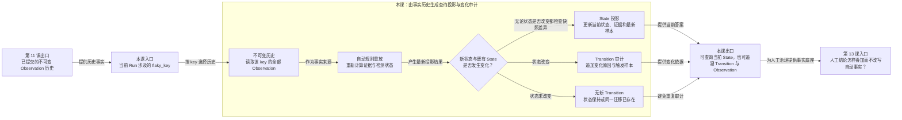

# 第 12 课：为什么既保存历史又保存当前状态

## 本课在学习链中的位置

- 上一课已经将 Run、Epoch 和 Observation 作为一个完整业务事务提交。
- 本课只讨论 Observation 按正常顺序到达时，怎样生成当前可查询状态和状态变化审计。
- 晚到数据、规则版本变化和全量 rebuild 统一留到进阶 B，不在本课展开。
- 本课输出 `State + Transition`；第 13 课会解释人工判断为什么不能改写 Observation 或冒充自动检测。

## 学完本课，你能够做到

1. 区分不可变 Observation 历史、当前 State 投影和 Transition 审计。
2. 根据 R1～R3 的正常到达过程推导 State 如何更新、Transition 何时新增。
3. 解释为什么重复评估相同历史可以是 NOOP，而不能重复写迁移记录。

## 开始前自检

1. 一条 Candidate 在什么时候才成为持久化 Observation？
2. `pass → pass → pass` 的自动状态依次是什么？
3. R2 到达后状态仍为 `OBSERVING`，是否发生状态迁移？

<details>
<summary>查看自检答案</summary>

1. 首次导入事务选择 Epoch、生成历史身份并提交后。
2. `OBSERVING → OBSERVING → STABLE`。
3. 没有。证据更新了，但状态没有改变。

第 1 题不清楚时复习[第 11 课](11-原子持久化.md)；第 2～3 题不清楚时复习[第 4 课](04-四态检测机.md)。

</details>

## 核心问题

> Observation 已经完整保存，为什么还要单独保存一条当前 State 和若干 Transition？

## 从统一案例中的一个现象开始

Case C 已按顺序导入：

```text
R1 pass
R2 pass
R3 pass
```

如果每次查询当前状态都让使用者自行读取全部历史、计算证据并重放状态机，查询方会重复实现同一规则。反过来，如果数据库只保留最终 `STABLE`，又无法回答这个结论由哪些真实样本产生，也无法审计它何时从 `OBSERVING` 改变。

因此系统同时需要“事实来源”“当前答案”和“变化记录”。

## 先做判断

请先写下答案：

1. R3 评估完成后，三条 Observation 应被压缩删除吗？
2. R1、R2、R3 每次都要新增 Transition 吗？
3. 再次评估没有任何新 Observation 的 R3，应该追加相同 Transition 吗？

## 为什么已有解释不够

第 4 课的纯状态机能从内存历史得到结果，却没有处理长期查询和审计：

- Observation 应保留为已发生事实，不能因当前结论变化而被覆盖。
- 当前状态需要一条直接可查询的快照，不应要求每个消费者现场重算。
- 只有状态真正改变时才需要追加 Transition；证据更新但状态保持不等于发生迁移。

当前实现把这三种职责分开存储。

## 核心概念

### 1. 不可变历史（Immutable History）

`case_observation` 中的 Observation 是某个 Run 已提交的历史事实。新的 Run 追加新 Observation，不覆盖旧样本；状态评估也不修改其 PASS/FAIL、Failure ID 或发生时间。

不可变指正常系统写入合同，不表示数据库文件在物理上绝不可能被外部工具篡改。

### 2. 状态投影（State Projection）

State 投影是从同一 `flaky_key` 的 Observation 历史按当前规则重放后，保存的最新查询快照。它包含：

```text
current_state / detected_state
当前证据计数
latest_observation_id / latest_run_id
rule_version / projection_version
projection_status
```

同一个 `flaky_key` 只有一条当前 State；新证据到达时可以更新这条投影。投影可重新计算，Observation 才是事实来源。

### 3. Transition 审计（State-transition Audit）

Transition 记录一次真实状态变化：

```text
from_state → to_state
+ reason_code
+ trigger_observation_id
+ 当时的证据
```

状态保持时不追加 Transition。相同迁移拥有确定性 `transition_id`，重复评估不会复制同一审计记录。

## 本课知识关系图



## 最小规则

| 输入情况 | State | Transition |
| --- | --- | --- |
| 首次评估一个有 Observation 的 key | 创建当前投影 | 写入纯状态机重放产生的迁移，触发类型为 bootstrap |
| 新 Observation 到达且状态改变 | 更新投影 | 追加一条状态变化审计 |
| 新 Observation 到达但状态保持 | 更新证据/最新样本等投影字段 | 不新增状态 Transition |
| 相同 Run、相同历史再次评估 | 无有效变化 | 不新增，评估结果为 NOOP |
| 已导入 Run 没有任何可用 Observation | 不创建虚假 State | 返回 NO_DATA |

本课只使用按时间正常到达的 Observation；乱序重投影属于进阶 B。

## 完整运行过程

```text
确认 run_id 已导入
→ 查询该 Run 涉及的 flaky_key
→ 对每个 key 读取全部 Observation
→ 调用纯状态机重放自动结果
→ 与已有 State 比较
→ 生成新的 State 快照和必要 Transition
→ 在一个评估事务中写 State 与 Transition
→ 返回本轮评估摘要
```

导入 Observation 与评估 State 是相邻但独立的事务。投影失败不会把已经提交的历史事实抹掉。

## 正常路径

按 R1、R2、R3 导入后分别评估：

### R1

```text
历史：pass
自动结果：OBSERVING
```

- 尚无 State，创建一条投影。
- 记录 `None → OBSERVING` 的 bootstrap Transition。

### R2

```text
历史：pass → pass
自动结果：OBSERVING
```

- State 的样本数、最新 Run 等证据字段更新。
- 状态仍为 `OBSERVING`，不追加 Transition。

### R3

```text
历史：pass → pass → pass
自动结果：STABLE
```

- State 更新为 `STABLE`，`sample_size=3`。
- 追加 `OBSERVING → STABLE` Transition。

最终数据库概念数量为：

```text
Observation = 3
State       = 1
Transition  = 2
```

## 复杂路径

只改变一个变量：不导入新 Observation，直接再次评估 R3。

1. 读取到的历史与此前完全相同。
2. 重放仍得到同一 State payload。
3. 已存在的 Transition ID 不会重复插入。
4. `transitioned_count=0`，评估状态为 `NOOP`。
5. 数据库仍是 1 条 State、2 条 Transition。

NOOP 表示投影没有新变化，不表示 Case PASS，也不表示数据库没有历史。

## 对应的框架实现

### 先看测试断言

[状态存储测试](../../../tests/quality/test_flaky_state_store.py)按顺序导入并评估三个 PASS：

```python
assert first.transitioned_count == 1
assert second.transitioned_count == 0
assert third.transitioned_count == 1
assert state.current_state is FlakyState.STABLE
assert state.sample_size == 3
assert check.state_count == 1
assert check.transition_count == 2
```

同文件再次评估同一 Run，验证结果为 NOOP 且 Transition 数仍为 1（该测试只建立了 R1）。

### 再看生产代码

[projection.py](../../../quality/flaky_store/projection.py)先读取历史并调用已学过的纯状态机：

```python
observations = repository.observations_for_key(connection, flaky_key)
automatic = replay_observations(observations, config)
```

随后构建 State，并只保留尚不存在的 Transition：

```python
transitions = [
    transition
    for transition in transitions
    if not repository.transition_exists(connection, transition.transition_id)
]
```

写入计划时，State 有变化才 upsert，Transition 则逐条 append。晚到判断、Governance 覆盖和 rebuild 分支现在跳过。

## 能够保证什么

- 当前 State 可追溯到同一 key 的不可变 Observation 历史和规则版本。
- 正常顺序下，状态保持不会制造虚假 Transition。
- 相同历史重复评估不会重复同一确定性迁移记录。
- State 与本次 Transition 在同一评估事务中写入，避免两者只成功一半。

## 保证成立的前提

- Run 已经导入，且至少有一个可用 Observation。
- Observation 属于同一 `flaky_key`，数据库与规则版本兼容。
- 本课只讨论自动投影，尚未应用人工 Override 或开放 Governance。
- Observation 按正常时间顺序到达；乱序情况在进阶 B 单独学习。

## 不能保证什么

- State 不是新的执行事实，不能替代或改写 Observation。
- Transition 数不等于 Observation 数；只有状态变化才产生审计记录。
- 投影 NOOP 不等于零个 Flaky 问题。
- 投影失败不会回滚此前独立提交的 Observation；历史可能存在而当前投影暂时缺失。

## 本课小结

Observation 保存发生过什么，State 保存根据全部历史重放后的当前答案，Transition 保存答案何时以及为何改变。R1～R3 有三条事实、一个当前投影，却只有两次状态迁移。三者分开后，既能快速查询，又能从当前结论追溯回真实历史。

```text
不可变 Observation
→ 自动重放
→ 可更新 State
+ 仅在状态变化时追加 Transition
```

## 课末自测

请先独立作答，再查看解析。

1. **复算题**：依次评估 `pass → pass → pass`，最终有几条 State、几条自动 Transition？
2. **解释题**：R2 为什么更新证据却不新增 Transition？
3. **判断题**：State 已保存，因此旧 Observation 可以删除而不影响可重建性。
4. **边界题**：相同历史重复评估返回 NOOP，能否解释为“当前没有 Flaky 状态”？

<details>
<summary>查看答案与解析</summary>

1. 同一 key 有 1 条 State、2 条 Transition：首次 `None→OBSERVING`，R3 `OBSERVING→STABLE`。
2. Transition 记录状态改变；R2 只让样本数和最新记录等投影字段变化，状态仍是 `OBSERVING`。
3. **错误。** State 是可重算投影，Observation 是事实来源；删除事实会失去审计和重建基础。
4. 不能。NOOP 只说明这次评估没有新增变化，当前 State 仍然存在并可能是任一检测状态。

常见错误是把 State 当事实表，或认为每个 Run 都必须对应一条 Transition。

</details>

## 本课完成标准

- 能用一句话分别说明 Observation、State、Transition 的职责。
- 能复算 R1～R3 的三类记录数量，并解释 R2 为什么无迁移。
- 能说明重复评估 NOOP 与“没有数据/没有问题”不同。

若混淆事实与投影，请复习“核心概念”；若 Transition 数总等于 Run 数，请复习“正常路径”。

## 与下一课的关系

当前 State 完全来自自动规则。但自动证据达到 `SUSPECTED` 后，人可能根据外部调查确认或纠正结论。第 13 课将学习人工动作怎样实际更新两个 State 字段、怎样留下 Transition/Override 审计，以及为什么 Observation 始终不被改写。
