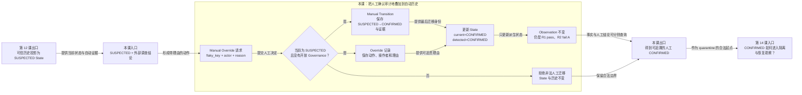

# 第 13 课：自动怀疑为什么还需要人工确认

## 本课在学习链中的位置

- 上一课已经把可信 Observation 重放为当前 State，并用 Transition 审计状态变化。
- 本课只完整追踪一次 `SUSPECTED → 人工确认 → CONFIRMED`，解释人工决定怎样叠加到历史之上。
- “标记非 Flaky”只作为动作对照，不展开其后续锚点规则。
- 本课输出经过审计的 `CONFIRMED`；第 14 课将在此前提下登记隔离和恢复生命周期。

## 学完本课，你能够做到

1. 解释自动 `SUSPECTED` 为什么不是人工处置决定。
2. 追踪人工确认对 Observation、State、Transition 和 Override 的实际影响。
3. 准确说明当前实现中 `detected_state` 与 `current_state` 在人工确认后的取值。

## 开始前自检

1. Observation、State、Transition 分别保存什么？
2. `pass → fail:A` 在默认规则下得到什么自动状态？
3. State 改变时，是否应该改写已有 Observation？

<details>
<summary>查看自检答案</summary>

1. Observation 保存历史事实，State 保存当前投影，Transition 审计状态变化。
2. `SUSPECTED`。
3. 不应该。State 是派生投影，Observation 是事实来源。

答不出来时，请复习[第 12 课](12-历史与当前投影.md)和[第 4 课](04-四态检测机.md)。

</details>

## 核心问题

> 自动规则已经发现签名变化，为什么还要由人确认，并另外保存人工动作记录？

## 从统一案例中的一个现象开始

Case C 已有可信历史：

```text
R1 pass → R2 fail:A
自动状态：SUSPECTED
```

默认规则只说明“已出现变化，但确认门槛还不够”。此时评审者通过外部调查确认：相同条件下确实存在非预期波动，并提交：

```text
action = confirm_flaky
actor  = reviewer
reason = trusted runs show nondeterministic behavior
```

这条外部调查不是 Observation，也不能伪装成新的一次 PASS/FAIL。

## 先做判断

请先写下答案和理由：

1. 人工确认后，R1 和 R2 的 Observation 是否需要修改？
2. 只把 State 改成 `CONFIRMED`，却不保存操作者与原因，是否足以审计？
3. 当前实现会让 `current_state=CONFIRMED`、`detected_state=SUSPECTED` 吗？

## 为什么已有解释不够

自动规则只使用系统内的 Observation 和阈值，不知道发布窗口、受控故障或人工复现结果等外部调查事实。人可以据此提前确认或纠正，但这个决定必须满足三条约束：

- 不改写已经发生的 Observation。
- 明确记录谁、为什么、从什么状态改到什么状态。
- 只允许合法状态执行相应动作，避免任意跳转。

当前实现通过 Manual Override、manual Transition 和 State 更新共同完成。需要特别注意：直接人工确认会把 `current_state` 与 `detected_state` 都更新为 `CONFIRMED`；确认前的 `SUSPECTED` 由 Transition 和 Override 的 `from_state` 保留，而不是继续留在 `detected_state` 字段中。

## 核心概念

### 1. 人工覆盖（Manual Override）

人工覆盖是有明确操作者和理由的状态动作。本课的 `confirm_flaky`：

```text
允许起点：current_state = SUSPECTED
目标状态：CONFIRMED
必需输入：flaky_key + actor + reason
```

如果当前状态不是 `SUSPECTED`，或该 key 已有开放的隔离/恢复治理记录，动作会被拒绝。

### 2. 双状态字段（Detected State / Current State）

State 记录同时有：

| 字段 | 当前模型约束 | 本课人工确认后的值 |
| --- | --- | --- |
| `detected_state` | 必须属于四种自动状态，不能是 `QUARANTINED/RECOVERING` | `CONFIRMED` |
| `current_state` | 对外当前状态，可进入治理阶段 | `CONFIRMED` |

直接人工确认和“标记非 Flaky”都会将两个字段更新到目标自动状态。因此，`detected_state` 在当前版本中不是“永远不受人工动作影响的纯重放快照”。两个字段主要在隔离或恢复时分开：届时 `current_state` 可为治理状态，而 `detected_state` 仍留在自动状态域。

### 3. 人工动作审计（Manual-action Audit）

同一次人工确认会保存两类互补记录：

- manual Transition：记录 `from_state → to_state`、触发类型、证据引用和 actor。
- Override：记录动作名、前后状态、触发 Observation、actor 和更完整的 reason。

Transition 回答“状态怎样变”；Override 回答“人执行了什么命令、理由是什么”。它们与 State 更新处在同一事务中。

## 本课知识关系图



## 最小规则

| 动作 | 合法起点 | 目标 | 必写审计 | Observation |
| --- | --- | --- | --- | --- |
| `confirm_flaky` | `SUSPECTED` | `CONFIRMED` | manual Transition + Override | 不变 |
| `mark_not_flaky`（对照） | `SUSPECTED` 或 `CONFIRMED` | `STABLE` | manual Transition + Override | 不变 |

人工确认成功后：

```text
current_state  = CONFIRMED
detected_state = CONFIRMED
```

不要为了形成“自动与人工分离”的漂亮模型而把源码实际不存在的 `detected_state=SUSPECTED` 写进课程。

## 完整运行过程

```text
读取当前 State
→ 校验投影为 CURRENT 且版本兼容
→ 校验 current_state 是 SUSPECTED
→ 校验没有开放 Governance
→ 重新读取当前 Observation 证据
→ 写 manual Transition
→ 写 Override（actor/reason）
→ 将 current_state 和 detected_state 更新为 CONFIRMED
→ 在同一治理写事务中提交
```

## 正常路径

1. R1 PASS、R2 FAIL 经自动投影得到 `SUSPECTED`。
2. reviewer 以 Case 的 `flaky_key`、非空 actor 和 reason 提交 `confirm_flaky`。
3. 状态合法，且没有开放 Governance。
4. 系统用当前 Observation 生成证据，写入一条 manual Transition：

   ```text
   from_state  = SUSPECTED
   to_state    = CONFIRMED
   trigger_type = manual
   reason_code = manual_confirm_flaky
   actor       = reviewer
   ```

5. 系统写 Override，保存 `action=confirm_flaky` 和完整 reason。
6. State 的 `current_state`、`detected_state` 都变为 `CONFIRMED`。
7. R1/R2 Observation 数量和内容完全不变。

## 复杂路径

只改变一个变量：在当前状态已经是 `STABLE` 时提交 `confirm_flaky`。

```text
允许起点要求 SUSPECTED
实际起点为 STABLE
→ invalid_state_transition
```

动作失败，State、Transition、Override 均不应发生本次新增。系统不会为了满足命令而伪造一次 `STABLE → CONFIRMED`。

### 动作对照：标记非 Flaky

如果调查认定变化来自受控部署，可从 `SUSPECTED/CONFIRMED` 执行 `mark_not_flaky`：目标为 `STABLE`，并以最新 Observation 建立后续评估锚点。这个对照只说明人工结论可以双向纠正；锚点后的评估规则不在本课展开。

## 对应的框架实现

### 先看测试行为

[治理测试](../../../tests/quality/test_flaky_governance.py)先用一 PASS、一 FAIL 得到 `SUSPECTED`，再调用：

```python
state = store.confirm_flaky(
    FlakyManualActionRequest(
        flaky_key=state.flaky_key,
        actor="reviewer",
        reason="confirmed by trusted history",
    )
)
```

[状态存储测试](../../../tests/quality/test_flaky_state_store.py)断言返回的 `current_state is CONFIRMED`，随后才能进入 quarantine。事务边界测试还验证 Override 插入失败会同时回滚 manual Transition。

### 再看生产代码

[governance.py](../../../quality/flaky_store/governance.py)定义人工确认的允许起点和目标：

```python
return manual_override(
    connection,
    repository,
    request,
    action="confirm_flaky",
    allowed_states=(FlakyState.SUSPECTED,),
    target_state=FlakyState.CONFIRMED,
)
```

`manual_override()` 依次创建 Transition、插入 Override，再更新 State。[repository.py](../../../quality/flaky_store/repository.py)的更新 SQL 明确设置：

```sql
SET current_state = ?, detected_state = ?, ...
```

两个占位值都传入 `target_state.value`。这就是为什么本课不能声称人工确认后仍保留 `detected_state=SUSPECTED`。

## 能够保证什么

- `confirm_flaky` 只能从当前 `SUSPECTED` 执行。
- 成功动作同时保存 manual Transition、Override 和 State 更新，Observation 不被改写。
- actor、reason、前后状态和触发 Observation 可从审计记录追溯。
- 治理写入中的任一步失败，会回滚本次 Transition、Override 和 State 变化。

## 保证成立的前提

- `flaky_key` 对应一条存在、CURRENT 且版本兼容的 State。
- 当前没有开放的隔离或恢复 Governance。
- actor 与 reason 非空，并满足长度约束。
- 调用通过 `FlakyStore` 公共治理入口执行。

## 不能保证什么

- 人工确认不会新增执行证据，也不能证明外部调查一定正确。
- 当前 `detected_state` 不是一个永远保留纯算法前态的字段；直接 Override 会更新它。
- `CONFIRMED` 不会改变 pytest 原始结果，也不会自动跳过 Case。
- Override 不等于 quarantine；隔离需要下一课的独立 Governance 记录。

## 本课小结

自动 `SUSPECTED` 表示已有变化但默认确认门槛不足。人工调查可以通过受约束的 Override 将它确认为 `CONFIRMED`，同时写 manual Transition 和 Override 审计，而不改写 Observation。当前实现会把两个状态字段都更新为目标自动状态；原先状态由审计记录保留。

```text
SUSPECTED State + 外部调查
→ 合法 Manual Override
→ Transition + Override
→ current_state / detected_state = CONFIRMED
→ Observation 保持不变
```

## 课末自测

请先独立作答，再查看解析。

1. **复算题**：`SUSPECTED` 人工确认后，当前实现的两个状态字段分别是什么？
2. **解释题**：为什么既要 Transition 又要 Override？
3. **判断题**：人工确认应把 R1/R2 Observation 改成能支持 `CONFIRMED` 的新结果。
4. **边界题**：当前状态为 `STABLE` 时直接调用 `confirm_flaky` 会发生什么？
5. **辨析题**：人工 `CONFIRMED` 是否已经创建隔离 owner 与 expiry？

<details>
<summary>查看答案与解析</summary>

1. `current_state=CONFIRMED`，`detected_state=CONFIRMED`。
2. Transition 审计状态怎样变化及当时证据；Override 保存具体人工动作、操作者和理由。两者侧重点不同。
3. **错误。** Observation 是不可变执行事实，人工决定只更新派生状态与审计。
4. 返回 `invalid_state_transition`，不会新增合法人工记录或改变 State。
5. 没有。确认只建立人工状态结论；owner、expiry 和恢复生命周期属于 quarantine Governance。

常见错误是虚构 `detected_state=SUSPECTED/current_state=CONFIRMED` 的持久化结果，或把人工确认直接等同于隔离。

</details>

## 本课完成标准

- 能逐项说出人工确认对四类记录的影响：Observation 不变，State 更新，Transition 与 Override 新增。
- 能准确给出确认后的两个状态字段，不用理想化模型替代源码事实。
- 能说明 `CONFIRMED` 与 `QUARANTINED` 是两个不同动作阶段。

若混淆字段值，请复习“双状态字段”；若把确认当隔离，请复习“不能保证什么”。

## 与下一课的关系

本课得到可审计的 `CONFIRMED`，但尚未指定谁负责、隔离到何时或如何验证修复。第 14 课会创建 Governance 生命周期，并首次让 `current_state` 进入 `QUARANTINED/RECOVERING`，与自动状态域分开。
