# 第 14 课：隔离对象怎样证明重新稳定

## 本课在学习链中的位置

- 上一课已经得到一条可审计的 `CONFIRMED` State，但尚未指定负责人、期限和修复验证过程。
- 本课完整追踪 `CONFIRMED → QUARANTINED → RECOVERING → recovered/regressed`。
- 取消隔离只作为动作对照；当前实现不会因为 `QUARANTINED` 自动跳过 pytest Case。
- 本课输出一条已关闭或仍开放的 Governance 生命周期；第 15 课会把这些状态放回完整测试框架，确认 Flaky 拥有和不拥有的权力。

## 学完本课，你能够做到

1. 说明 quarantine 为什么需要 owner、reason 和未来 expiry。
2. 使用 Recovery Anchor 只选择恢复开始后的新 Observation。
3. 根据恢复签名序列判断 `recovered` 或 `regressed`，并推导 State 与 Governance 的最终值。

## 开始前自检

请先回答：

1. `confirm_flaky` 的合法起点和目标状态分别是什么？
2. 人工确认会修改旧 Observation 吗？
3. `current_state` 与 `detected_state` 是否永远相同？

<details>
<summary>查看自检答案</summary>

1. 合法起点是 `SUSPECTED`，目标是 `CONFIRMED`。
2. 不会。人工动作只更新派生状态并增加审计记录。
3. 不一定。上一课的直接确认会让两者都为 `CONFIRMED`，但本课进入 `QUARANTINED/RECOVERING` 后，`current_state` 可以是治理状态，而 `detected_state` 仍必须属于自动状态域。

如果答案不清楚，请先复习[第 13 课](13-自动检测与人工确认.md)。

</details>

## 核心问题

> 一个已确认 Flaky 的 Case 在修复部署后，怎样只用修复后的新证据判断它已经稳定，或再次退化？

## 从统一案例中的一个现象开始

Case C 当前已经人工确认：

```text
current_state  = CONFIRMED
detected_state = CONFIRMED
latest Observation = R2 fail:A
```

负责人准备调查并部署修复。若直接用全部旧历史重新判断，修复前的 `pass → fail:A` 会一直参与恢复证据，无法回答“从修复开始以后是否稳定”。系统需要记录一条清晰分界线。

## 先做判断

请先写下答案和理由：

1. 隔离记录是否只需要把 State 改成 `QUARANTINED`，而不记录 owner 和期限？
2. 开始恢复时，应把哪一条 Observation 作为新证据的分界？
3. Anchor 后出现 `pass → fail:A`，还需要等待 5 个样本才知道恢复失败吗？

## 为什么已有解释不够

`CONFIRMED` 只表达检测与人工判断结论，不描述处置生命周期。恢复判断还需要回答：

- 谁负责、为何隔离、何时到期。
- 哪一条 Observation 之前属于修复前历史。
- 恢复中的新证据达到什么条件时关闭处置记录。

当前实现用 Governance 保存处置生命周期，用 Recovery Anchor 切开旧/新证据，再用 Resolution 明确关闭原因。

## 核心概念

### 1. 隔离治理（Quarantine Governance）

quarantine 只能从 `current_state=CONFIRMED` 开始，并创建一条开放 Governance：

```text
status     = ACTIVE
owner      = case-owner
reason     = isolate while the cause is fixed
created_by = reviewer
expires_at = 未来时间
```

同时写 manual Transition，并把 `current_state` 改为 `QUARANTINED`。`detected_state` 仍为自动状态域中的 `CONFIRMED`。

“隔离”在当前模块中是登记治理事实，不是 pytest 执行过滤器。到期也只会使记录可被 overdue 查询，不会自动关闭或跳过 Case。

### 2. 恢复锚点（Recovery Anchor）

从 `QUARANTINED` 执行 `start_recovery` 时，系统把当时 State 的 `latest_observation_id` 保存为 Recovery Anchor：

```text
修复前历史 …… [Anchor]
                    │
                    └─ 只读取此后新 Observation 作为恢复证据
```

Governance 状态改为 `RECOVERING`，State 的 `current_state` 也改为 `RECOVERING`；`detected_state` 继续保留在自动状态域。Anchor 自身不进入恢复窗口。

### 3. 治理结论（Governance Resolution）

恢复期间，新证据产生两种关闭结果：

| Anchor 后的证据 | State 结果 | Governance Resolution |
| --- | --- | --- |
| 没有签名切换，且尾部连续相同签名达到 5 | `STABLE` | `RECOVERED` |
| 出现任意 Signature Switch | `CONFIRMED` | `REGRESSED` |
| 尚无切换且不足 5 个 | 保持 `RECOVERING` | Governance 仍为 `RECOVERING`，未关闭 |

恢复稳定性不额外要求签名必须是 `pass`。连续 5 个 `fail:A` 也满足当前一致性算法；这表示表现重新稳定，不表示业务健康。

## 本课知识关系图

```mermaid
flowchart LR
    PREV["第 13 课出口<br/>可审计的 CONFIRMED State"]
    ENTRY["本课入口<br/>已确认对象需要负责人和修复验证"]

    subgraph LESSON["本课：以治理生命周期约束恢复证据"]
        direction LR
        QUARANTINE["Quarantine Governance<br/>登记 owner、reason、expiry"]
        QSTATE["治理中 State<br/>current=QUARANTINED<br/>detected=CONFIRMED"]
        ANCHOR["Recovery Anchor<br/>固定恢复开始前的最新 Observation"]
        NEW["Anchor 后新样本<br/>形成独立恢复证据序列"]
        RULE{"新签名序列<br/>发生切换或连续达到 5？"}
        PENDING["尚不足<br/>保持 RECOVERING"]
        RECOVERED["连续 5 个相同签名<br/>State=STABLE<br/>Resolution=RECOVERED"]
        REGRESSED["出现签名切换<br/>State=CONFIRMED<br/>Resolution=REGRESSED"]

        QUARANTINE -->|创建 ACTIVE Governance| QSTATE
        QSTATE -->|开始恢复时保存最新样本| ANCHOR
        ANCHOR -->|排除修复前及锚点样本| NEW
        NEW -->|计算恢复证据| RULE
        RULE -->|无切换且不足 5| PENDING
        RULE -->|无切换且连续数至少 5| RECOVERED
        RULE -->|出现任意签名切换| REGRESSED
    end

    EXIT["本课出口<br/>能追踪开放 Governance 到 recovered/regressed"]
    NEXT["第 15 课入口<br/>这些治理状态是否拥有测试执行权？"]

    PREV -->|作为 quarantine 合法起点| ENTRY
    ENTRY -->|提交隔离责任信息| QUARANTINE
    PENDING -->|治理仍开放| EXIT
    RECOVERED -->|关闭 Governance| EXIT
    REGRESSED -->|关闭 Governance| EXIT
    EXIT -->|需要放回框架确认权力边界| NEXT
```



## 最小规则

按当前实现顺序：

1. `quarantine` 只接受 `CONFIRMED`，要求 owner、actor、reason 和未来 expiry；创建 `ACTIVE` Governance，并令 `current_state=QUARANTINED`。
2. `start_recovery` 只接受 `QUARANTINED + ACTIVE Governance`；保存最新 Observation 为 Anchor，令 Governance 与 `current_state` 均为 `RECOVERING`。
3. 只对 Anchor 后的新 Observation 调用恢复算法。
4. Signature Switch 优先判断：一旦大于 0，立即 `CONFIRMED/REGRESSED`。
5. 无切换且尾部相同签名达到默认 5 个时，得到 `STABLE/RECOVERED`；否则保持 `RECOVERING`。

## 完整运行过程

```text
CONFIRMED
→ quarantine：保存 owner/reason/expiry
→ Governance=ACTIVE，current_state=QUARANTINED
→ start_recovery：保存 latest_observation_id 为 Anchor
→ Governance/current_state=RECOVERING
→ 每个新 Run 导入 Observation 并评估
→ 只截取 Anchor 后样本
→ 有签名切换：CONFIRMED + REGRESSED
→ 无切换且连续 5 个：STABLE + RECOVERED
→ 证据不足：继续 RECOVERING
```

## 正常路径

从 R2 之后开始治理：

1. Case C 已为 `CONFIRMED`。
2. reviewer 创建 quarantine，owner 为 `case-owner`，expiry 为未来 7 天。
3. Governance 变为 `ACTIVE`，State 为 `QUARANTINED`。
4. owner 部署修复并开始 recovery；R2 的 Observation 成为 Anchor。
5. R3～R7 依次产生 5 个 `pass`。

逐步结果：

| 新样本数 | 恢复证据 | 当前状态 |
| ---: | --- | --- |
| 1～4 | 无切换，但连续数不足 5 | `RECOVERING` |
| 5 | 无切换，连续 `pass` 达到 5 | `STABLE` |

完成时：

```text
Governance.status     = CLOSED
Governance.resolution = RECOVERED
current_state         = STABLE
detected_state        = STABLE
evaluation_anchor     = R7 Observation
```

旧的 R1、R2 Observation 仍在历史中，只是不进入这次恢复证据。

## 复杂路径

只改变 Anchor 后的第二个结果：

```text
R3 pass
R4 fail:A
```

R4 到达后，恢复序列出现一次 Signature Switch。系统不等待第 5 个样本：

```text
current_state         = CONFIRMED
detected_state        = CONFIRMED
Governance.status     = CLOSED
Governance.resolution = REGRESSED
```

若要再次恢复，必须重新从 `CONFIRMED` 创建新的 quarantine；已关闭的 Governance 不能直接第二次 `start_recovery`。

### 动作对照：取消隔离

如果 quarantine 命令本身针对错误部署，可在 `QUARANTINED + ACTIVE Governance` 时执行 `cancel_quarantine`：Governance 以 `CANCELLED` 关闭，State 回到 `CONFIRMED`，不会宣称已经稳定。

## 对应的框架实现

### 先看测试行为

[状态存储测试](../../../tests/quality/test_flaky_state_store.py)完整执行确认、隔离、开始恢复和五次新 PASS：

```python
for index in range(3, 8):
    result = _import_and_evaluate(..., f"run-{index}", "pass")

assert result.recovered
assert recovered_state.current_state is FlakyState.STABLE
assert closed.resolution is GovernanceResolution.RECOVERED
```

[治理测试](../../../tests/quality/test_flaky_governance.py)验证 `pass → fail` 的恢复序列立即回退：

```python
assert state.current_state is FlakyState.CONFIRMED
assert closed.resolution is GovernanceResolution.REGRESSED
```

同文件还验证取消隔离返回 `CONFIRMED/CANCELLED`，不会错误宣布 `STABLE`。

### 再看生产代码

[governance.py](../../../quality/flaky_store/governance.py)开始恢复时保存当前最新样本：

```python
repository.start_governance_recovery(
    ...,
    anchor_observation_id=state.latest_observation_id,
)
```

[projection.py](../../../quality/flaky_store/projection.py)只截取 Anchor 后样本，再调用 [evaluate_recovery()](../../../quality/flaky.py)：

```python
if evidence.signature_switch_count > 0:
    return RecoveryEvaluation(FlakyState.CONFIRMED, "recovery_regressed", evidence)
if evidence.trailing_same_signature_count >= config.recovery_signature_streak:
    return RecoveryEvaluation(FlakyState.STABLE, "recovery_stable_streak_met", evidence, ...)
```

切换判断在连续门槛之前，因此存在切换时不会因为末尾后来又连续而在同一 Governance 中恢复。

## 能够保证什么

- quarantine 记录负责人、理由、创建者和未来到期时间，并要求当前为 `CONFIRMED`。
- Recovery Anchor 将修复前历史与恢复证据明确分开，Anchor 本身不计入新样本。
- 默认连续 5 个相同签名会关闭为 `RECOVERED`；任一签名切换会关闭为 `REGRESSED`。
- State、Transition 和 Governance 收口处在同一评估事务中。

## 保证成立的前提

- State 存在、为 CURRENT、版本兼容，并处于动作要求的合法状态。
- 同一 `flaky_key` 没有第二条开放 Governance。
- Anchor 后 Observation 已可信导入并成功评估。
- 使用当前默认恢复连续门槛 5；配置变化会改变所需样本数。

## 不能保证什么

- `QUARANTINED` 当前不会自动跳过、筛除或标记 pytest Case 为通过。
- `expires_at` 到期不会自动关闭 Governance，只会支持 overdue 查询。
- `RECOVERED` 不保证结果为 PASS；当前算法只保证签名连续一致。
- 隔离与恢复不会删除旧 Observation，也不会修改外部执行器行为。

## 本课小结

Quarantine Governance 给 `CONFIRMED` 增加负责人、理由和期限；开始恢复时，Recovery Anchor 固定修复前的最后一条样本。之后只看新证据：无切换且连续 5 个相同签名则 `STABLE/RECOVERED`，任意签名切换则 `CONFIRMED/REGRESSED`，不足时保持 `RECOVERING`。

```text
CONFIRMED
→ ACTIVE Quarantine
→ Anchor + RECOVERING
→ Anchor 后新签名
→ pending / RECOVERED / REGRESSED
```

## 课末自测

请先独立作答，再查看解析。

1. **复算题**：Anchor 后依次出现 4 个 `pass`，当前 State 和 Governance status 是什么？
2. **复算题**：第 5 个仍为 `pass`，最终 State 与 Resolution 是什么？
3. **复算题**：Anchor 后出现 `fail:A → fail:A → fail:B`，何时结束恢复，结果是什么？
4. **解释题**：为什么 Anchor 之前的 Observation 仍保留，却不进入本轮恢复证据？
5. **边界题**：连续 5 个 `fail:A` 被当前算法收口为 recovered，是否代表 Case 业务健康？

<details>
<summary>查看答案与解析</summary>

1. `current_state=RECOVERING`，Governance status 仍为 `RECOVERING`；连续数不足 5。
2. State 变为 `STABLE`，Governance 关闭，Resolution 为 `RECOVERED`。
3. 第三个新样本 `fail:B` 到达时出现 Signature Switch，立即收口为 `CONFIRMED/REGRESSED`。
4. 旧 Observation 是不可变事实，不能删除；Anchor 只定义“修复以后”的证据范围，避免旧波动污染恢复判断。
5. 不代表。它只表示失败签名稳定，`STABLE` 与 `RECOVERED` 在当前算法中都不等于 PASS。

常见错误是把 Anchor 本身算作第一个恢复样本，或者认为必须等待 5 个样本后才能发现 regression。

</details>

## 本课完成标准

- 能从任意 Anchor 后短序列计算 pending、recovered 或 regressed。
- 能说清 `current_state`、`detected_state` 与 Governance status/resolution 在各阶段的值。
- 能明确说明 quarantine 是治理记录，不拥有 pytest Skip 权力。

若恢复计数总多 1，请复习“恢复锚点”；若把 recovered 当 PASS，请复习“治理结论”和“不能保证什么”。

## 与下一课的关系

我们已经完成检测、持久化、投影和治理，但这些能力只有被完整 Quality 收尾链调用时才会发生。第 15 课将检查功能开关、执行顺序、fail-open 和报告语义，并最终回答 Flaky 在框架中拥有什么权力。
