# 第 01 天：项目边界与 Module 用例主线

> **课程定位**：从 module 用例作者视角建立项目地图，理解一条业务用例如何进入公共能力、pytest 和报告链路  
> **讲解重点**：module 层、Test/Task/Request/Assertions、稳定入口、收集身份、责任边界  
> **课程形式**：纯讲解，不设置实操、练习、作业、小测或命令执行要求  
> **事实依据**：`FRAMEWORK_TEST_SPEC.md`、`module/`、`module/conftest.py`、`run_master.py`  
> **本课边界**：不深入 Runner 调度算法，不展开离线 service 实现，不逐行分析组合用例

---

## 0. 为什么第一天必须从 Module 开始

初学者进入一个测试框架时，最容易先看见目录数量、基类数量和运行脚本。

但用例作者真正面对的问题不是“框架有多少文件”，而是：

> 一个新的接口需求，应该怎样被组织成可收集、可执行、可断言、可清理的 module 用例？


因此，本课程的观察起点固定为 `module/test_*.py`。

公共能力和执行器只在 module 用例需要理解使用边界时进入视野。

---

## 1. 第一性原理：接口测试的最小目标

接口测试的本质不是“发出一个 HTTP 请求”。

最小目标是建立一条可解释的因果链：

```text
给定业务输入
→ 执行业务动作
→ 获得可观察结果
→ 与稳定契约比较
→ 形成可追踪证据
```

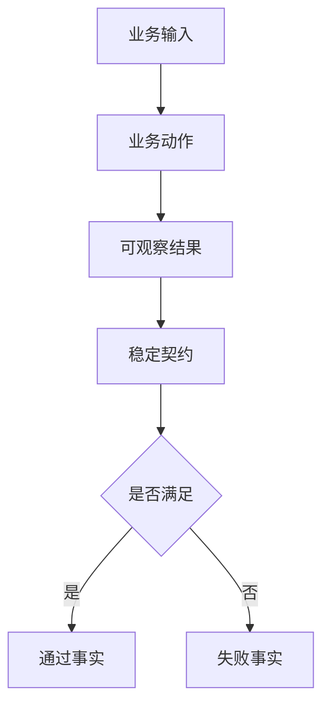

如果只会调用接口，却不知道结果由谁解释、资源由谁关闭、用例由谁收集，那么测试仍然不可维护。

---

## 2. TOC：初学者的核心约束是责任混淆

表面上，初学者的问题像是不会 pytest、不会 requests 或不会 Allure。

更深一层的因果链是：

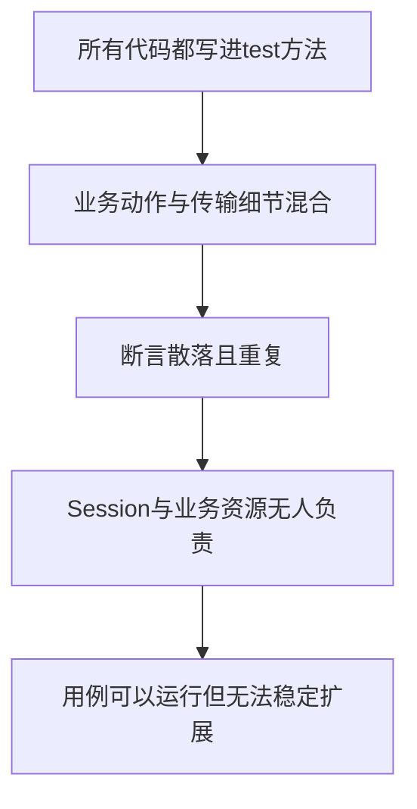

系统约束不是语法，而是**没有把变化交给正确所有者**。

课程的解约束方式是先固定四个 module 角色：

| 角色 | 回答的问题 |
| --- | --- |
| Test | 这个场景验证什么业务结论？ |
| Task | 这个业务动作由哪些步骤组成？ |
| Request | 这个接口怎样传输？ |
| Assertions | 哪些结果才算满足稳定契约？ |

---

## 3. 项目的五层地图

当前项目可以用五层理解，但 module 用例层是课程起点。

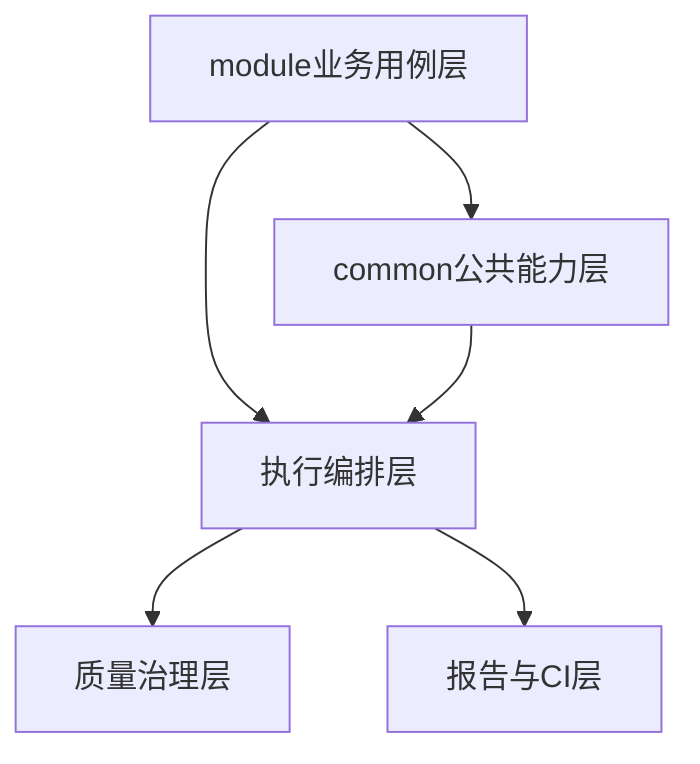

### 3.1 Module 业务用例层

`module/` 保存真实业务用例和模块领域对象。

这一层决定：

- 场景名称。
- payload 组织。
- 业务路径。
- 模块级断言。
- 资源登记。
- 串行或并发约束。

### 3.2 Common 公共能力层

`common/` 提供多个模块共同使用的能力，例如：

- BaseRequest。
- BaseTask 与领域能力。
- BaseAssertions。
- Retry、Polling、SSE。
- TestContext。
- Capture 与运行时上下文。

module 用例应调用这些公开能力，不复制其算法。

### 3.3 执行编排层

`run_master.py` 与 `run_orchestration/` 负责：

- 接收运行目标。
- 交给 pytest 收集。
- 根据 marker 形成执行计划。
- 管理报告和最终执行状态。

本周只需要知道它如何接住 module 用例，不需要记忆内部状态机。

### 3.4 质量与报告层

业务用例不直接调用质量聚合器。

只要遵守标准入口和 module 编写规范，pytest、Allure、JUnit 与可选质量能力会在外层形成证据。

---

## 4. 一条 Module 用例怎样进入系统

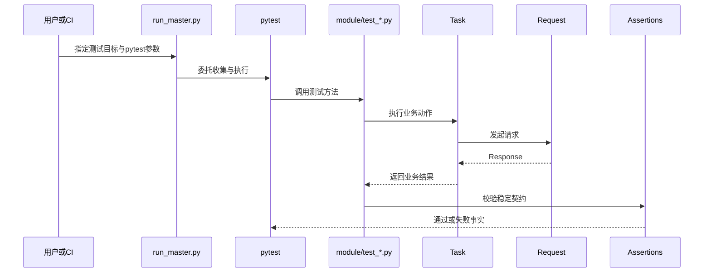

这里有三条不同的责任链：

| 责任链 | 起点 | 终点 |
| --- | --- | --- |
| 业务链 | Test | Assertions |
| 传输链 | Task/Request | Response |
| 执行链 | 稳定入口 | pytest report |

三条链会在一次测试中相遇，但不能混成同一层代码。

---

## 5. Module 用例的标准入口形态

一个典型 module 至少包含：

```text
module/example_model/
├─ __init__.py
├─ request.py
├─ task.py
├─ assertions.py
├─ decorators.py
└─ test_generation.py
```

按需增加：

```text
payloads.py
response_schemas.py
conftest.py
```

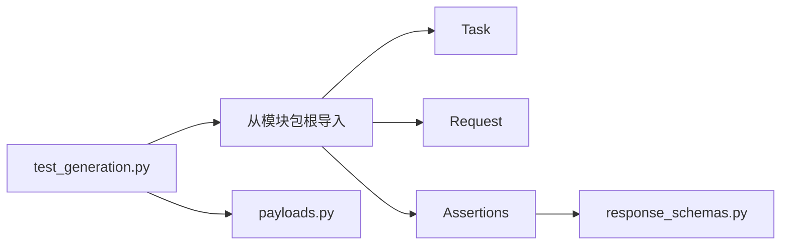

测试优先从模块包根导入公开类，避免依赖内部文件路径。

---

## 6. Test 文件只负责编排场景

测试方法应读起来像业务描述：

```python
def test_create_generation_returns_valid_contract(self):
    payload = self.example_task.build_generation_payload()
    response = self.example_task.create_example_generation(
        self.example_request,
        payload,
    )
    self.example_assertions.assert_generation_succeeded(response)
```

这段结构包含三个动作：

1. 准备业务输入。
2. 执行业务动作。
3. 判断业务结果。

测试方法不应展开：

- Session 如何发送请求。
- Retry 循环如何实现。
- Polling 的 while 循环。
- service 内部如何保存状态。
- 报告聚合器如何生成最终页面。

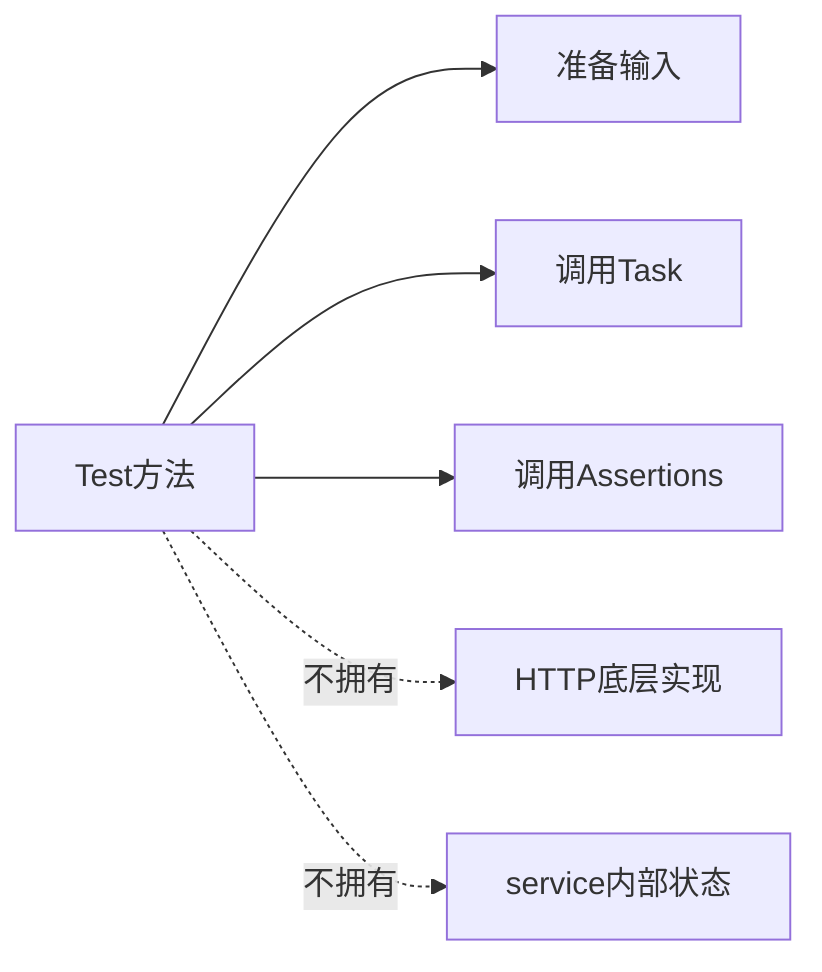

---

## 7. 稳定入口与可收集性

### 7.1 稳定入口解决什么

稳定入口让本地和 CI 使用相同的运行边界。

module 作者只需要知道：

- 测试目标可以指向目录、文件或 nodeid。
- pytest 参数仍由 pytest 解释。
- collect-only 只形成收集事实，不代表业务调用成功。

### 7.2 pytest 怎样识别测试

用例通常依赖以下可收集形态：

- 文件名符合 `test_*.py`。
- 测试类以 `Test` 开头。
- 测试方法以 `test_` 开头。
- 测试类不定义 `__init__`。

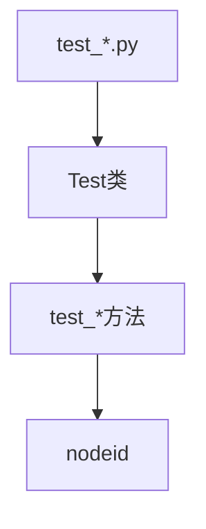

`nodeid` 是 pytest 对测试对象的稳定描述，例如：

```text
module/example_model/test_generation.py::TestExampleGeneration::test_create_generation_returns_valid_contract
```

本课只要求理解它是“测试身份”，不展开调度器怎样拆分集合。

---

## 8. 四类边界必须分开

### 8.1 Module 与 Common

module 拥有业务语义，common 拥有可复用机制。

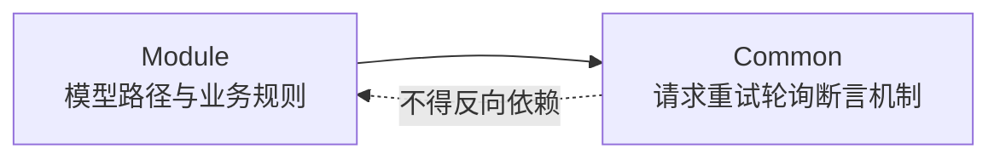

### 8.2 Test 与外部接口边界

对用例作者而言，service 是外部边界。

Test 只观察：

- 请求输入。
- 状态码。
- Header。
- 响应体。
- SSE 事件。
- 可见状态变化。

service 的内部存储、线程和路由实现不属于 module 用例主线。

### 8.3 业务事实与执行事实

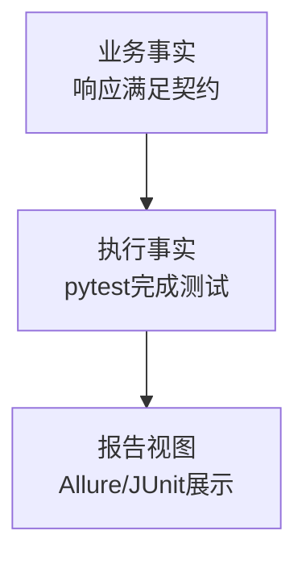

报告页面展示通过，不等于 service 的所有分支都被验证。

### 8.4 公开合同与内部实现

module 作者依赖公开方法、参数和异常语义。

内部实现可以变化，只要公开合同保持稳定。

---

## 9. 课程阅读顺序

后续阅读代码时，遵循“从用例进入”的顺序：

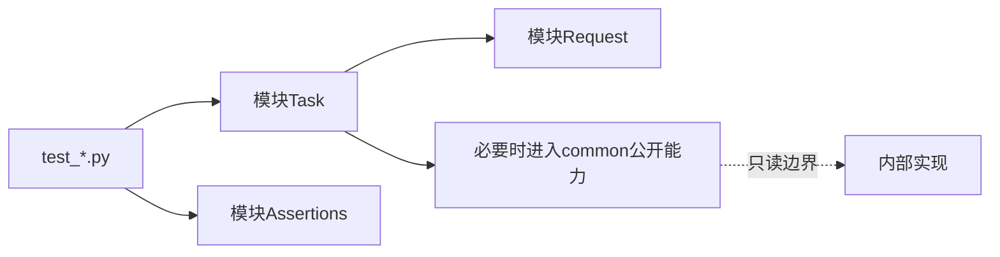

不要按目录从头背到尾，也不要先从 service 路由或 Runner 状态机开始。

---

## 10. 证据边界

| 观察到的事实 | 可以说明 | 不能说明 |
| --- | --- | --- |
| 测试被 collect | 命名和导入基本有效 | 业务接口调用成功 |
| Test 调用 Task | 场景通过模块动作编排 | Task 内部所有分支正确 |
| Response 状态码正确 | HTTP 层满足该断言 | 全部业务字段正确 |
| Schema 断言通过 | 稳定结构满足契约 | 未约束字段永远正确 |
| teardown 完成 | 已登记资源完成当前清理路径 | 外部系统不存在任何残留 |

证据结论不能超过断言和观察范围。

---

## 11. 本课结论

Day 1 建立五个基础判断：

1. 课程从 module 用例作者视角出发。
2. Test、Task、Request、Assertions 拥有不同责任。
3. common 提供机制，module 提供业务语义。
4. service 是可观察边界，不是本课程要展开的内部实现。
5. Runner 负责接住测试，但第一周不深入其调度算法。

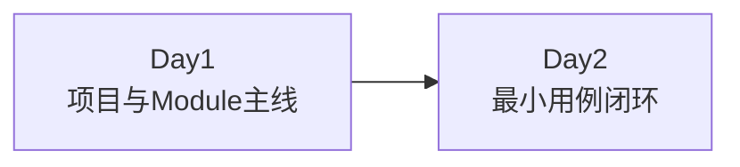

Day 2 将进入一个标准 module 测试方法，解释四个角色怎样共同完成一次业务验证。
