# 第 02 天：Module 用例最小闭环与四角色

> **课程定位**：从一个标准 module 测试方法出发，解释 Test、Task、Request、Assertions 如何完成一次可维护的业务验证  
> **讲解重点**：四角色职责、payload、Response、输入输出、对象所有权、测试可读性  
> **课程形式**：纯讲解，不设置实操、练习、作业、小测或运行要求  
> **事实依据**：`FRAMEWORK_TEST_SPEC.md` 与 `module/video_model/`、`module/image_model/` 中的真实用例结构  
> **本课边界**：可以引用黄金用例中的 Test、Task、Request、Assertions 和资源所有权，但不解释其 service 内部实现，也不展开 Retry、Polling 和 SSE 算法

---

## 0. 从 Day 1 接过来的模型

Day 1 已经确定：

```text
module 是课程起点
Test 负责场景
Task 负责业务动作
Request 负责传输
Assertions 负责稳定结论
```

Day 2 要把这些名词放进同一条最小闭环。

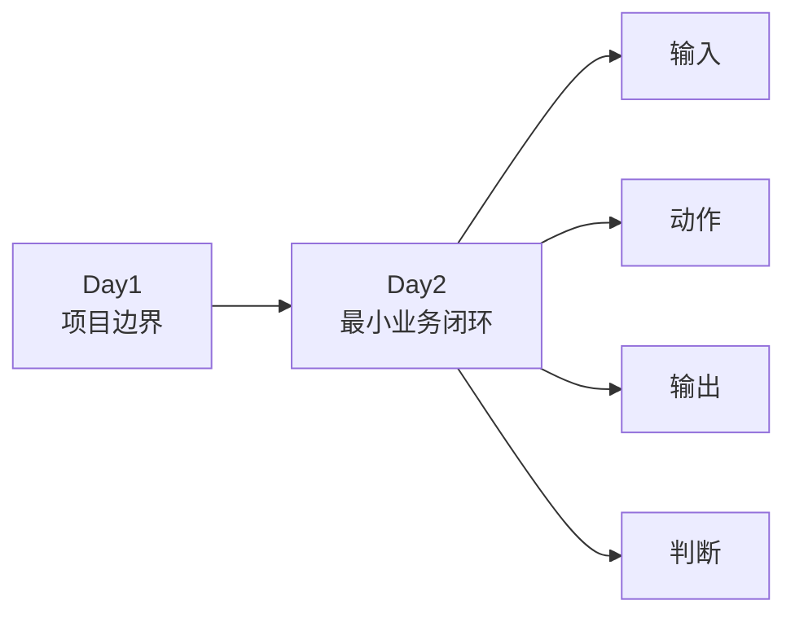

---

## 1. 第一性原理：一次用例最少需要什么

不考虑框架名称，一次业务验证至少需要四件事：

1. 一个明确场景。
2. 一个可执行动作。
3. 一个可观察结果。
4. 一个稳定判断标准。

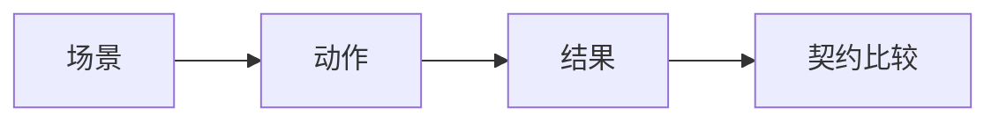

在当前框架中，这四件事分别由以下角色承接：

| 最小要素 | Module 角色 |
| --- | --- |
| 场景 | Test |
| 动作 | Task |
| 传输 | Request |
| 判断 | Assertions |

Response 不主动承担角色，它是传输结果对象，是 Request 与 Assertions 之间的事实载体。

---

## 2. TOC：为什么不能把所有逻辑写进 Test

最短代码不等于最低维护成本。

如果 Test 同时拼 payload、写路径、发请求、重试、解析字段和清理资源，会形成以下因果链：

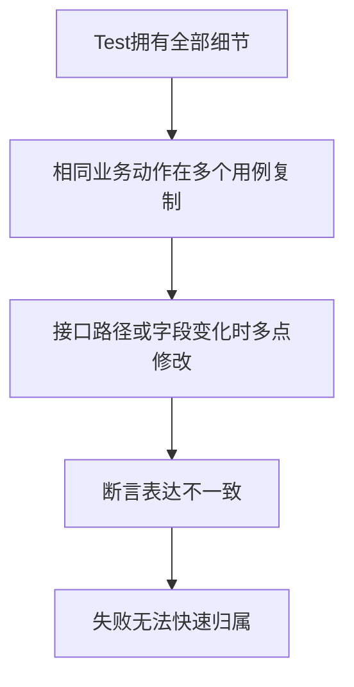

真正的约束是变化没有被隔离。

四角色分层的目的不是增加文件，而是让每类变化只有一个主要所有者。

---

## 3. 标准测试方法的外观

一个推荐的 module 用例可以读成三段：

```python
def test_create_generation_returns_valid_contract(self):
    payload = self.example_task.build_generation_payload()

    response = self.example_task.create_example_generation(
        self.example_request,
        payload,
    )

    self.example_assertions.assert_generation_succeeded(response)
```

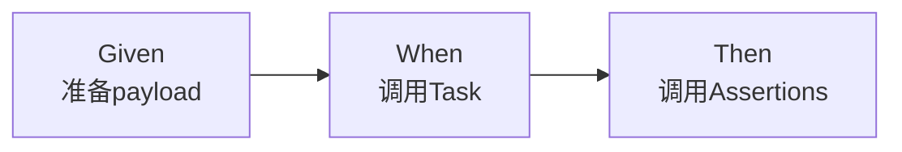

这不是要求所有测试必须使用固定注释或 DSL。

它表达的是阅读顺序：

```text
先看输入是什么
再看业务动作是什么
最后看通过条件是什么
```

---

## 4. Test：拥有场景，不拥有机制

### 4.1 Test 应该表达什么

测试方法负责把业务意图变成场景：

- 选择场景数据。
- 调用合适的 Task 方法。
- 调用合适的 Assertions 方法。
- 登记场景产生的业务资源。
- 通过 marker 表达串行等执行约束。

### 4.2 Test 不应该表达什么

- 直接拼接公共 base URL。
- 重复写 HTTP Retry 循环。
- 重复写 Polling while 循环。
- 直接操作 service 内部状态。
- 直接调用质量聚合器。
- 把多个无关业务结论塞进同一个方法。

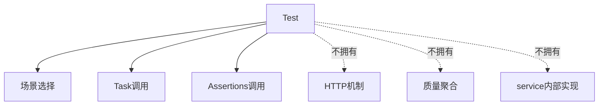

### 4.3 一个测试方法对应一个核心结论

“一个结论”不是“只能有一个 assert”。

一个业务结论可能需要多个互补断言：

```text
生成任务创建成功
→ 状态码正确
→ 响应结构正确
→ 任务ID存在
```

这些断言共同证明同一个业务结论。

---

## 5. Task：把业务语言连接到框架能力

### 5.1 Task 的本质

Task 把“创建图片”“创建并等待视频”“查询账单”等业务动作封装成方法。

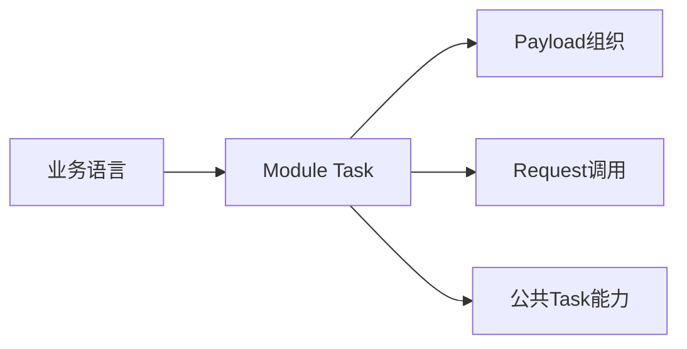

### 5.2 Task 可以拥有的内容

- 业务动作名称。
- 模型默认值。
- payload builder。
- 多请求业务流程。
- 模块使用的 PollingPolicy 或 RetryPolicy。
- 对公共 Task 能力的组合调用。

### 5.3 Task 不拥有 Session

Task 接收 Request Client，而不是自己长期持有 Session。

```python
response = self.video_task.create_doubao_seedance_2_5_generation(
    self.video_request,
    payload,
    scenario_name=scenario_name,
)
```

这让 Session 的创建与关闭保持在明确生命周期中。

### 5.4 Payload builder 返回新对象

payload builder 每次应返回新的字典或数据对象。

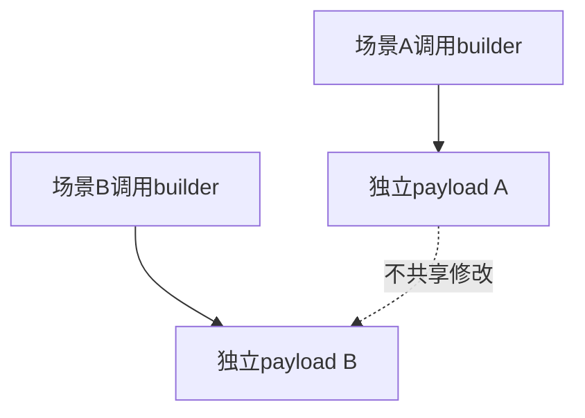

不要复用并原地修改模块级可变字典，否则场景之间会产生隐式状态。

---

## 6. Request：拥有 HTTP 合同

### 6.1 Request 负责什么

- HTTP 方法。
- 相对路径。
- Header 和请求级选项。
- `json`、`params`、`files` 等传输参数。
- stream、timeout 和 runtime metadata。
- 调用 BaseRequest 的公开方法。

### 6.2 Request 不判断业务成功

Request 可以返回状态码为 400 或 500 的 Response。

这并不表示 Request 自己失败；负向用例可能正需要验证该响应。

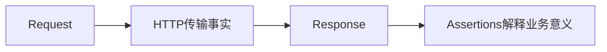

### 6.3 Module Request 可以很薄

真实模块中，某些 Request 类当前只继承 `BaseRequest`：

```python
class VideoRequest(BaseRequest):
    pass
```

“薄”不表示没有价值。

它保留了模块身份，并为未来增加模块路径、Header 或请求方法提供稳定位置。

---

## 7. Response：可观察事实载体

Response 常见的可观察事实包括：

| 事实 | 示例 |
| --- | --- |
| 状态码 | 200、400、429 |
| Header | request id、content type |
| JSON 结构 | id、status、error |
| 文本或二进制 | 错误文本、媒体内容 |
| 流式数据 | SSE 行和终止事件 |

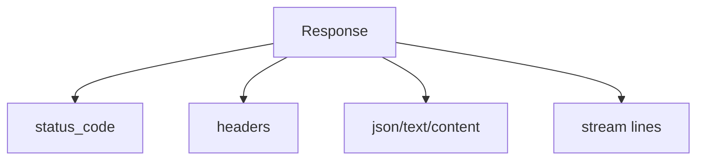

Response 不等于业务成功。

业务成功由 Assertions 根据场景契约解释。

---

## 8. Assertions：把技术事实翻译成业务结论

### 8.1 三层断言

module 用例通常按三层建立结论：

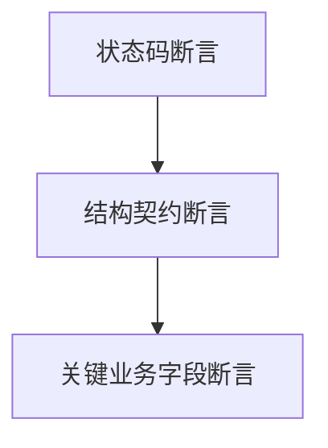

| 层级 | 回答的问题 |
| --- | --- |
| 状态码 | HTTP 结果是否符合场景预期？ |
| Schema | 响应结构是否满足稳定契约？ |
| 业务字段 | 任务ID、状态或结果字段是否满足业务规则？ |

### 8.2 领域断言提高可读性

与其让每个测试重复：

```python
assert response.status_code == 200
assert response.json()["id"]
```

更稳定的写法是由模块 Assertions 表达：

```python
self.video_assertions.assert_generation_succeeded(response)
```

这让字段变化集中在一个所有者中。

### 8.3 Assertions 不发请求

断言方法只读取和比较事实，不应改变服务端状态。

---

## 9. 四角色的输入输出

| 角色 | 主要输入 | 主要输出 |
| --- | --- | --- |
| Test | 场景参数、fixture、测试数据 | pytest 通过或失败事实 |
| Task | Request Client、payload、业务参数 | Response 或业务结果 |
| Request | 路径、Header、传输参数 | Response |
| Assertions | Response、期望值、Schema | 通过或 AssertionError |

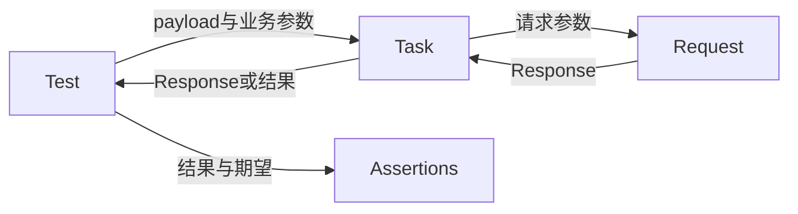

输入输出链不等于资源所有权链。

Task 可以使用 Request，但不因此拥有 Request 的 Session。

---

## 10. 对象与资源所有权

### 10.1 setup_method 模式

```python
def setup_method(self):
    self.example_request = ExampleRequest()
    self.example_task = ExampleTask()
    self.example_assertions = ExampleAssertions()

def teardown_method(self):
    self.example_request.close()
```

创建 Request 的测试类负责关闭它。

### 10.2 fixture 模式

如果 Request 由 fixture 创建，则同一 fixture 应在 `yield` 后关闭。

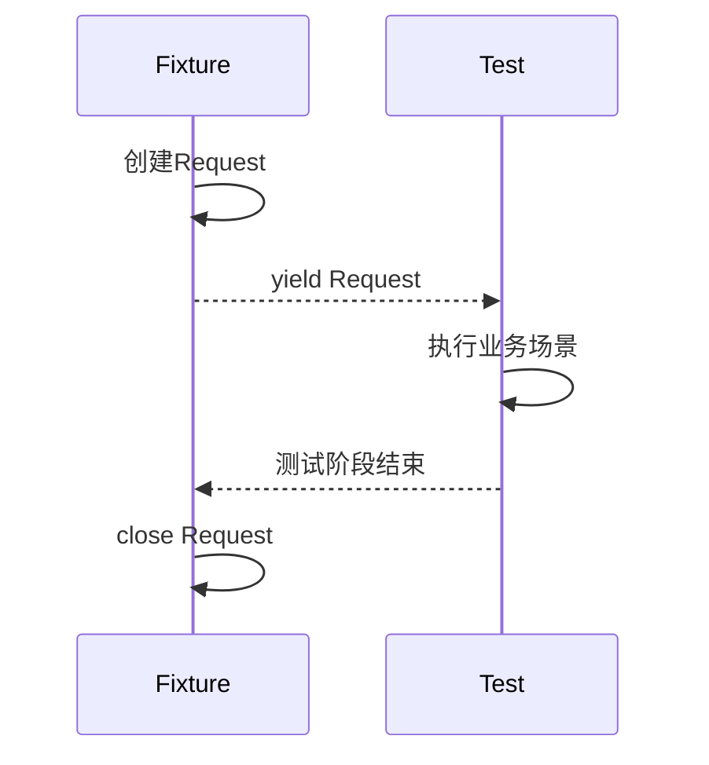

### 10.3 轻量对象与外部资源

Task 和 Assertions 通常是轻量对象。

Request 持有 Session，因此必须有明确关闭责任。

业务侧创建的远端资源将在 Day 4 通过 `test_context.add_cleanup()` 解释。

---

## 11. 外部系统的可观察边界

module 用例把 service 视为边界对端：

```text
请求进入
响应返回
```

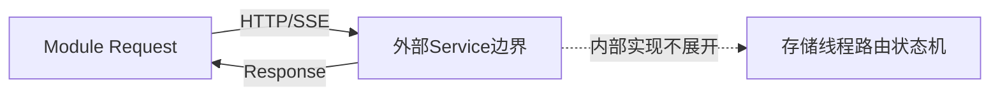

课程不通过读取 service 内部变量来证明业务成功。

断言应基于公开可观察结果。

---

## 12. 常见错误与正确归属

| 常见写法 | 问题 | 正确归属 |
| --- | --- | --- |
| Test 中硬编码完整 URL | 传输配置散落 | Request/配置 |
| Test 中手写 while 轮询 | 重复公共算法 | Task + PollingPolicy |
| Test 中直接访问 service 状态 | 越过公开契约 | Response + Assertions |
| Task 长期持有 Session | 生命周期不清 | Test/fixture 创建 Request |
| Assertions 发删除请求 | 判断与副作用混合 | Task 负责删除动作 |
| 修改共享 payload 字典 | 场景相互污染 | builder 返回新对象 |

---

## 13. 证据边界

一个标准测试方法可以证明：

- 当前输入经过当前业务动作后，满足已写出的断言。
- Test、Task、Request 和 Assertions 在该路径上可以协作。
- 当前资源生命周期路径完成了已定义的关闭或清理。

它不能自动证明：

- service 的所有内部实现正确。
- 所有模型和所有参数组合正确。
- 未被断言的字段永远稳定。
- Runner、报告和质量系统的所有分支正确。

---

## 14. 本课结论与 Day 3

Day 2 形成一条最小闭环：

```text
Test 选择场景
→ Task 表达业务动作
→ Request 完成传输
→ Response 携带事实
→ Assertions 形成结论
```

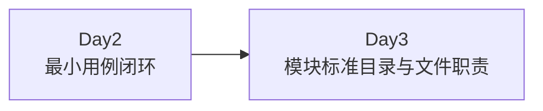

Day 3 将回答：这些角色为什么分别放在不同文件中，新 module 应怎样建立稳定目录和公开导出。
