# 第 03 天：Module 标准结构与文件职责

> **课程定位**：把 Day 2 的四角色闭环放入标准 module 目录，解释每类变化应由哪个文件拥有  
> **讲解重点**：最小目录、按需文件、公开导出、Task/Request/Assertions/Decorators、payload 与 Schema  
> **课程形式**：纯讲解，不设置实操、练习、作业、小测或命令执行要求  
> **事实依据**：`FRAMEWORK_TEST_SPEC.md` 与 `module/video_model/`、`module/image_model/`、`module/protocol_testing/`  
> **本课边界**：不深入 BaseTask 内部委托、MRO、Capability 工厂或 service 支持代码

---

## 0. 从 Day 2 接过来的问题

Day 2 已经形成最小调用链：

```text
Test → Task → Request → Response → Assertions
```

今天要解决的是：

> 为什么这些角色需要稳定文件位置，新 module 应怎样组织，才能让业务变化不扩散？

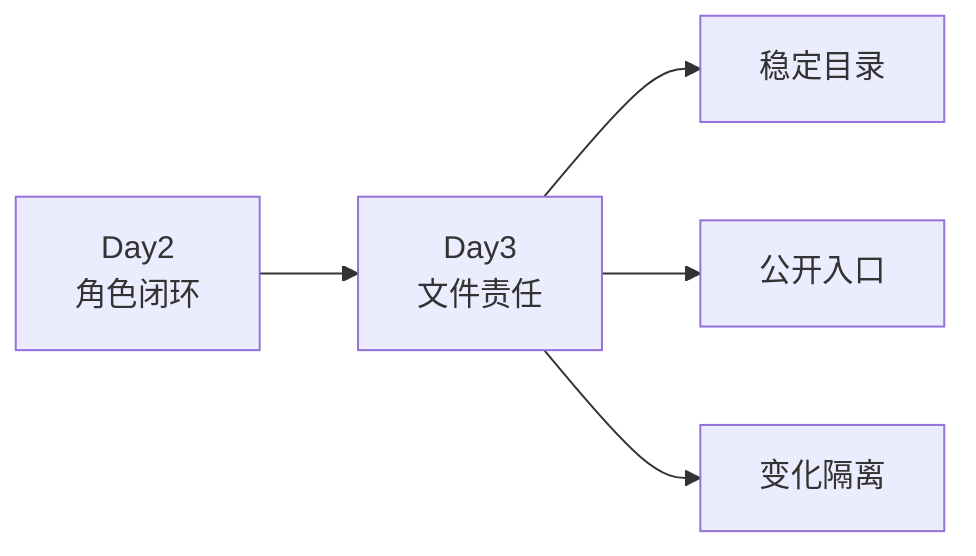

---

## 1. 第一性原理：文件是变化的所有者

目录结构的价值不是“看起来整齐”，而是把不同变化隔离开。

| 变化 | 应优先修改 |
| --- | --- |
| 接口路径或 Header | `request.py` |
| 业务动作或流程 | `task.py` |
| 成功条件或字段规则 | `assertions.py` |
| 稳定响应结构 | `response_schemas.py` |
| 场景数据组合 | `payloads.py` 或 Task builder |
| 用例场景和优先级 | `test_*.py` |

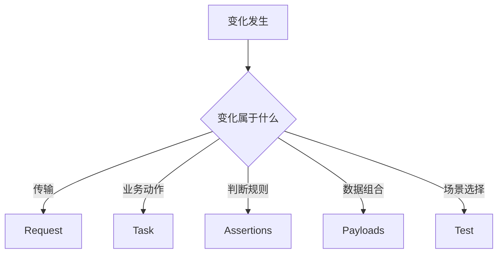

如果一个字段变化需要同时修改五个测试文件，说明责任没有被集中。

---

## 2. TOC：真正约束是修改扩散

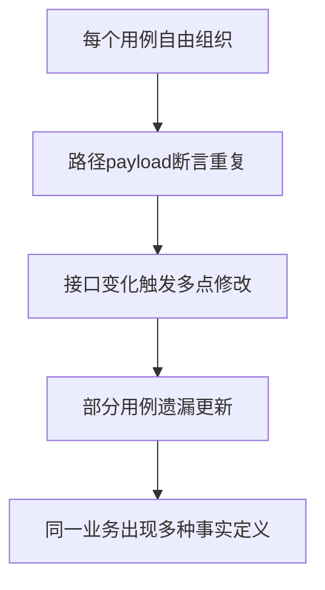

标准目录不是形式要求，而是降低修改扩散的约束设计。

---

## 3. 新 Module 的最小结构

```text
module/example_model/
├─ __init__.py
├─ request.py
├─ task.py
├─ assertions.py
├─ decorators.py
└─ test_generation.py
```

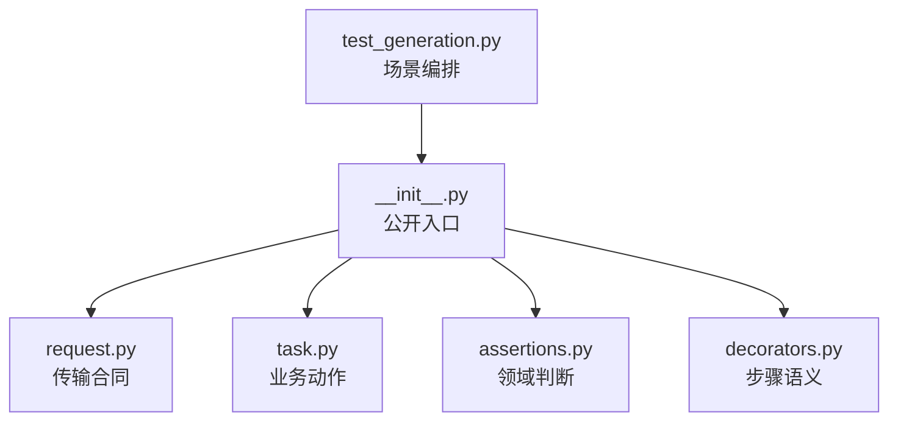

“最小”表示这些职责应有稳定位置，不表示每个文件都必须很复杂。

---

## 4. 按需增加的文件

| 文件 | 适用条件 |
| --- | --- |
| `payloads.py` | 场景较多、payload 组合复杂或需要数据驱动 |
| `response_schemas.py` | 接口存在可维护的稳定响应契约 |
| `conftest.py` | 当前 module 有专用 fixture 或数据准备 |
| `model_cases.py` | 模型清单和参数化数据需要独立维护 |
| `*.csv` | 协议兼容矩阵由外部表格维护，但加载逻辑仍在 Python 中 |

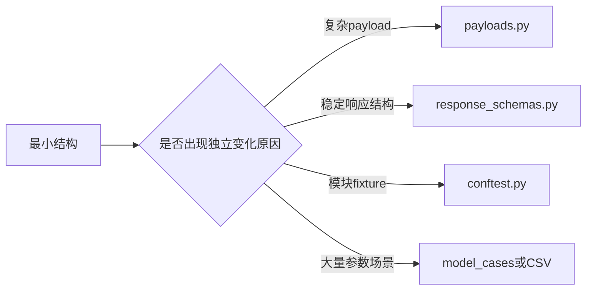

不要为了“目录看起来完整”创建没有责任的空文件。

---

## 5. `request.py`：传输合同的位置

基本形态可以很薄：

```python
from common import BaseRequest


class ExampleModelRequest(BaseRequest):
    pass
```

当模块存在明确传输差异时，再增加业务路径方法：

```python
def create_generation(self, payload):
    return self.post("/v1/example/generations", json=payload)
```

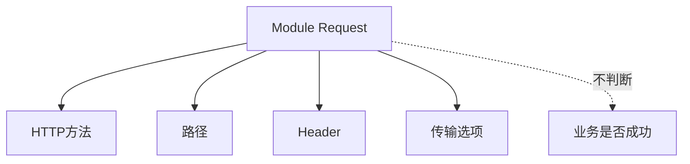

Request 可以知道“怎样请求”，不能替 Assertions 决定“结果是否正确”。

---

## 6. `task.py`：业务动作的位置

```python
class ExampleModelTask(BaseTask):
    @allure_step("创建 Example 模型任务")
    def create_example_generation(self, request_client, payload):
        return request_client.create_generation(payload)
```

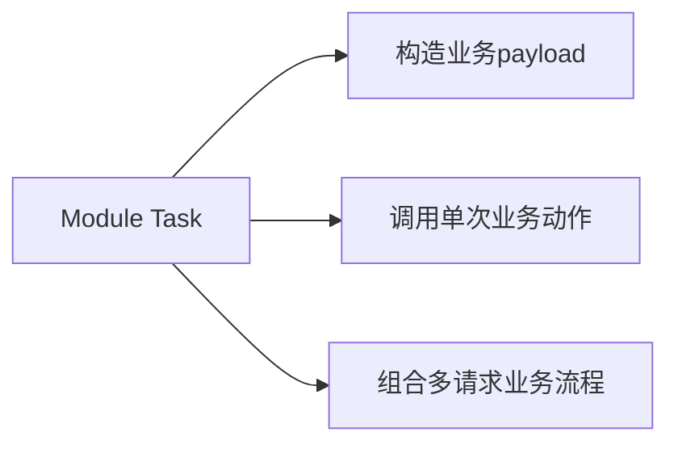

module Task 提供模块参数并调用公开入口，不复制公共算法。

```text
模块差异 → Module Task
通用机制 → BaseTask / common能力
```

本课只理解使用关系，不展开公共能力内部如何委托。

---

## 7. `assertions.py`：领域契约的位置

```python
from common import BaseAssertions


class ExampleModelAssertions(BaseAssertions):
    def assert_generation_succeeded(self, response):
        self.assert_status_code(response, 200)
        self.assert_json_path_exists(response, "$.id")
```

| 类型 | 示例 | 所属层 |
| --- | --- | --- |
| 通用状态码比较 | `assert_status_code` | BaseAssertions |
| JSONPath 存在 | `assert_json_path_exists` | BaseAssertions |
| 某模型生成成功 | `assert_generation_succeeded` | Module Assertions |
| 某业务错误符合规则 | `assert_quota_error` | Module Assertions |


只断言场景真正关心、且具有稳定合同的字段。

---

## 8. `response_schemas.py`：稳定结构的位置

```python
EXAMPLE_GENERATION_SUCCESS_SCHEMA = {
    "type": "object",
    "required": ["id", "status"],
    "properties": {
        "id": {"type": "string", "minLength": 1},
        "status": {"type": "string"},
    },
    "additionalProperties": True,
}
```

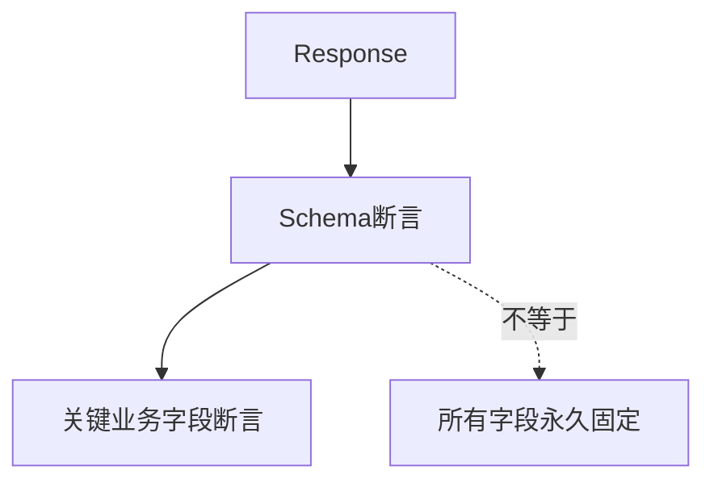

成功响应和标准错误响应应分开维护；业务仍快速变化的字段不要过度限制。

---

## 9. `payloads.py` 与 Task builder

简单 payload 可以由 Task 的静态 builder 构造；大量场景或模型变体可以进入 `payloads.py`。

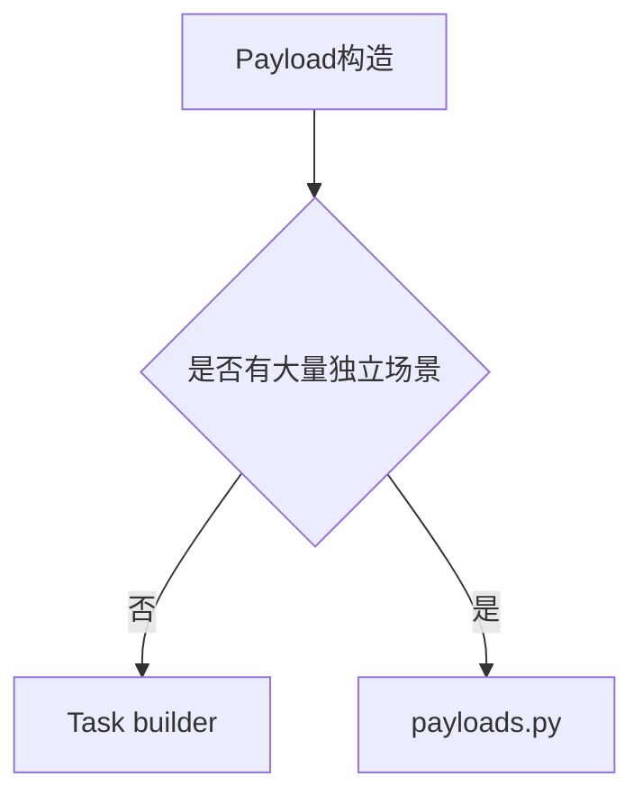

数据规则包括：

- 每次构造返回新对象。
- 场景名称与 payload 变化有清晰映射。
- API Key 等敏感数据不写入用例文件。
- 测试数据使用 Python 类型表达，不引入隐式 DSL。

---

## 10. `decorators.py`：步骤语义的位置

```python
from common import BaseDecorators


class ExampleModelDecorators(BaseDecorators):
    pass
```

模块可以继续使用公共 `allure_step`。步骤描述业务动作，不描述每一次字典赋值或内部函数调用。

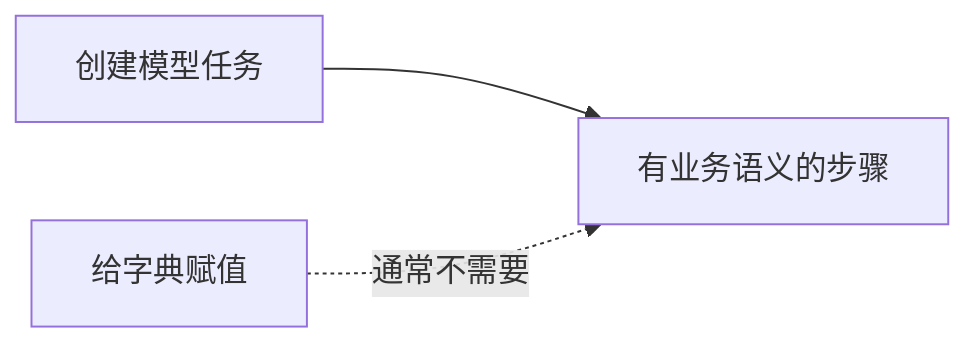

---

## 11. `__init__.py`：公开入口

推荐从模块包根导出四个主要类：

```python
from module.example_model.assertions import ExampleModelAssertions
from module.example_model.decorators import ExampleModelDecorators
from module.example_model.request import ExampleModelRequest
from module.example_model.task import ExampleModelTask

__all__ = [
    "ExampleModelAssertions",
    "ExampleModelDecorators",
    "ExampleModelRequest",
    "ExampleModelTask",
]
```

测试优先从模块包根导入，避免依赖多个内部文件路径。

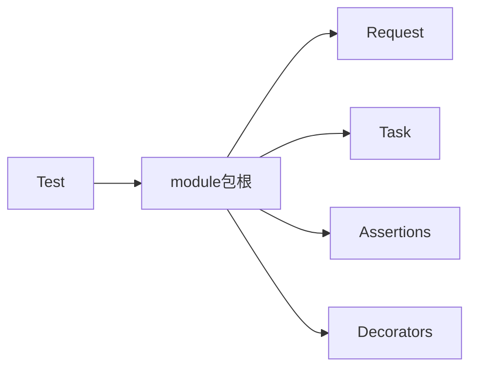

---

## 12. `test_*.py`：场景目录

```python
class TestExampleGeneration:
    def setup_method(self):
        self.example_request = ExampleModelRequest()
        self.example_task = ExampleModelTask()
        self.example_assertions = ExampleModelAssertions()

    def teardown_method(self):
        self.example_request.close()
```

测试类不定义 `__init__`，否则 pytest 不会按普通测试类收集。

测试方法名称应表达“动作 + 条件 + 期望结论”，例如：

```text
test_create_generation_returns_valid_contract
test_invalid_model_returns_standard_error
test_shared_account_billing_is_serial
```

测试文件按业务分类或变化原因拆分，而不是按函数数量机械拆分。

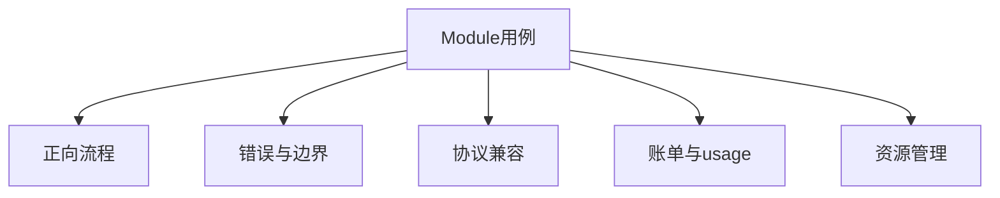

Day 5 会进一步解释这些分类。

---

## 13. Module 专用 `conftest.py`

只有在当前 module 有共享 fixture 时才增加。

适合放置：

- 模块级测试数据 fixture。
- 当前模块专用 Request fixture。
- 当前模块共享但可清理的业务资源 fixture。

不适合放置：

- 所有模块都需要的公共 fixture。
- 隐式修改全局状态的初始化。
- service 内部测试辅助逻辑。

---

## 14. 文件协作关系

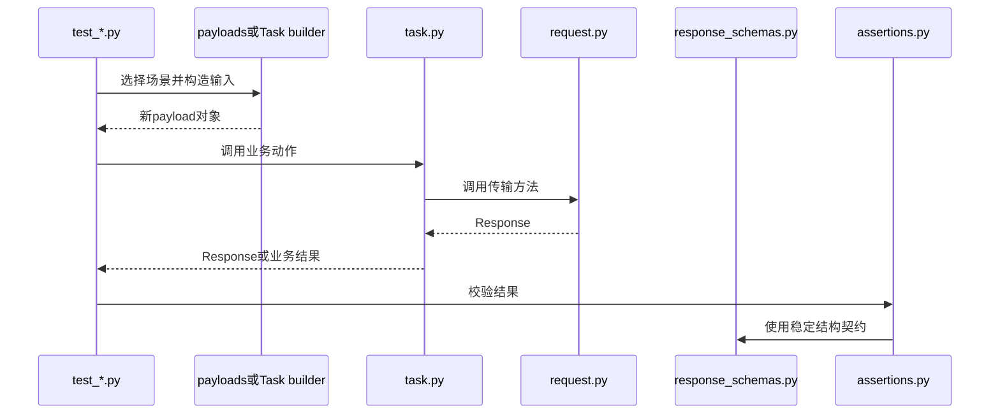

---

## 15. 常见结构错误

| 错误 | 直接后果 | 应调整到 |
| --- | --- | --- |
| 所有路径都写在 Test | 重复且难修改 | Request |
| 所有 payload 都写成模块全局字典 | 场景污染 | builder/payloads |
| 业务判断散落在局部 assert | 规则不一致 | Assertions |
| 新业务逻辑继续塞进 BaseTask | 公共层依赖业务 | Module Task |
| 测试从多个内部文件导入 | 调整文件即破坏调用方 | 模块包根 |
| Schema 限制所有当前字段 | 接口小变化导致脆弱失败 | 只约束稳定合同 |

---

## 16. 本课结论与 Day 4

Day 3 的核心不是记住文件名，而是形成变化归属判断：

```text
路径变化找Request
动作变化找Task
判断变化找Assertions
数据变化找Payload
场景变化找Test
公开入口找__init__
```

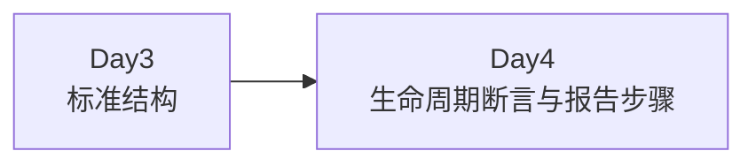

Day 4 将把这些对象放入 pytest 的 setup、call 和 teardown 时间轴，解释资源和证据怎样形成闭环。
