# 第 04 天：Module 测试生命周期、断言与报告步骤

> **课程定位**：把标准 module 对象放入 pytest 的 setup、call、teardown 时间轴，解释资源和证据如何闭环  
> **讲解重点**：`setup_method`、fixture、Request 关闭、TestContext、断言层级、Allure 步骤  
> **课程形式**：纯讲解，不设置实操、练习、作业、小测或命令执行要求  
> **事实依据**：`FRAMEWORK_TEST_SPEC.md`、`module/conftest.py` 与真实 module 测试类  
> **本课边界**：不深入 service fixture，不展开 pytest hook 和 Allure 生命周期内部实现

---

## 0. 从 Day 3 读取什么

Day 3 已经回答“对象放在哪里”。

Day 4 增加时间轴：

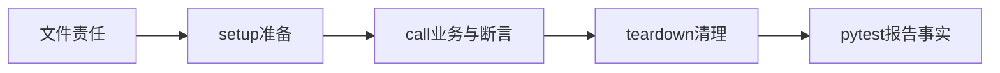

今天的核心问题是：

> 谁创建资源、谁使用资源、谁保证资源最终被关闭？

---

## 1. 第一性原理：测试结果来自完整生命周期

测试不是只有测试方法中的几行代码。

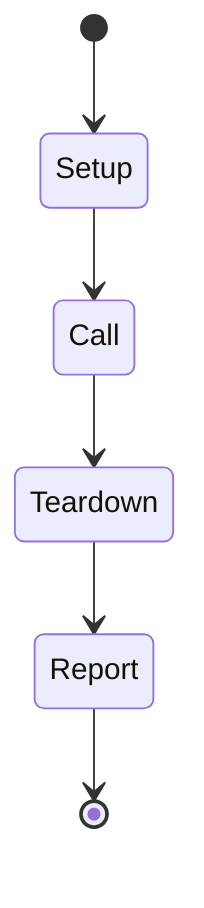

| 阶段 | 主要任务 |
| --- | --- |
| setup | 创建 Request、Task、Assertions 和测试数据 |
| call | 准备输入、调用 Task、执行断言 |
| teardown | 关闭 Session、清理登记的业务资源 |
| report | 形成 pytest、Allure 和 JUnit 可见事实 |

call 断言通过，不代表整个测试一定健康；teardown 失败仍然是测试生命周期问题。

---

## 2. TOC：生命周期的约束是清理责任不明确

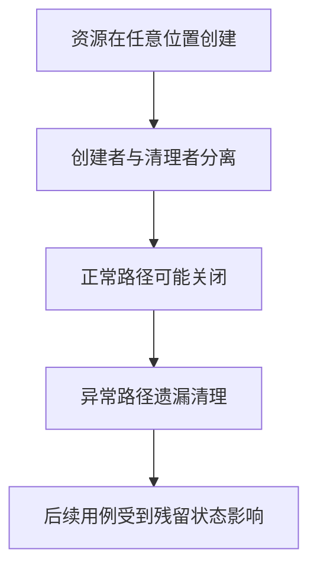

解约束原则是：

> 创建边界必须同时定义清理边界。

---

## 3. `setup_method` 与 `teardown_method`

真实 module 测试常使用类级协作者：

```python
class TestExampleGeneration:
    def setup_method(self):
        self.example_request = ExampleModelRequest()
        self.example_task = ExampleModelTask()
        self.example_assertions = ExampleModelAssertions()

    def teardown_method(self):
        self.example_request.close()
```

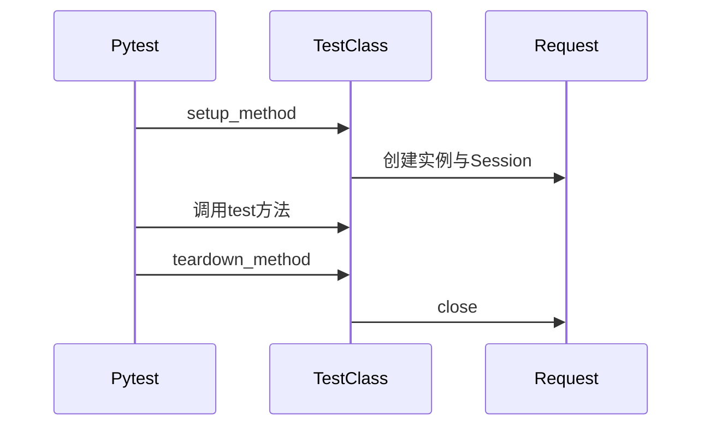

Task 和 Assertions 通常是轻量对象；Request 持有 Session，因此关闭责任最明确。

测试类不要定义 `__init__`，否则 pytest 不会按普通测试类收集。

---

## 4. Fixture：依赖注入与资源所有权

fixture 不只是测试数据，它还可以拥有资源生命周期。

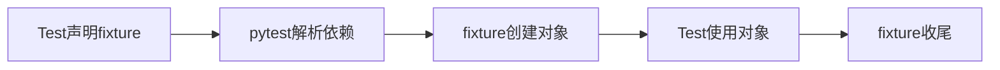

`module/conftest.py` 提供两个重要公共 fixture：

| fixture | 交付对象 | 收尾责任 |
| --- | --- | --- |
| `api` | `BaseRequest` | `finally` 调用 `close()` |
| `test_context` | `TestContext` | `finally` 调用 `cleanup()` |

如果 module 需要领域 Request，可以使用自己的 fixture，但仍应遵守同一原则：谁创建，谁在 `yield` 后关闭。

```python
@pytest.fixture
def example_request():
    request_client = ExampleModelRequest()
    try:
        yield request_client
    finally:
        request_client.close()
```

---

## 5. 两种生命周期模式怎样选择

| 模式 | 适合场景 | 主要优点 |
| --- | --- | --- |
| `setup_method` / `teardown_method` | 测试类共享相同协作者形态 | 结构直观 |
| fixture + `yield` | 需要组合依赖、参数化或跨类复用 | 所有权集中 |

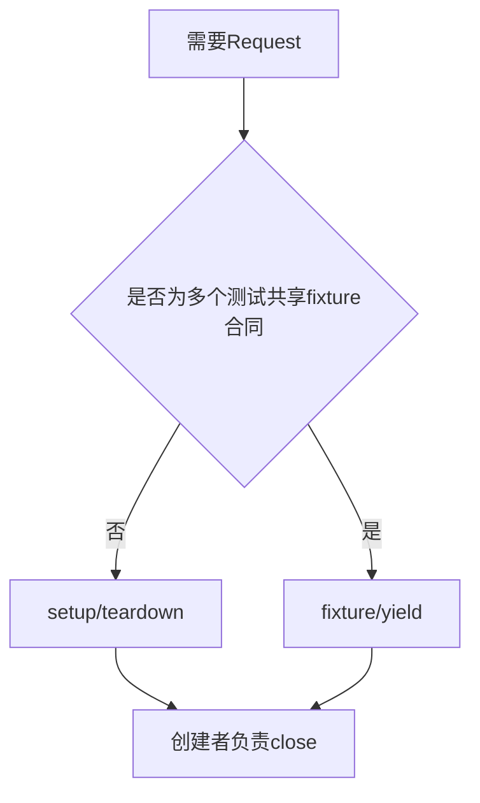

两种模式都合法，关键不是形式统一，而是资源所有者唯一且可验证。

---

## 6. Call 阶段：业务场景保持三段式

```python
def test_create_generation_returns_valid_contract(self):
    payload = self.example_task.build_generation_payload()
    response = self.example_task.create_example_generation(
        self.example_request,
        payload,
    )
    self.example_assertions.assert_generation_succeeded(response)
```

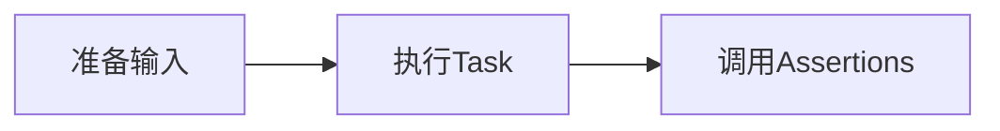

测试方法不负责关闭 Request；关闭属于 teardown。

业务资源如果需要删除，应在获得资源 ID 后立即登记清理责任，而不是等到方法末尾临时补救。

---

## 7. 断言的三层结构

### 7.1 状态码断言

状态码回答 HTTP 结果是否符合场景预期。

负向场景可以期望 400、401、404 或 429，不能把非 200 一律看成框架失败。

### 7.2 Schema 断言

Schema 回答响应结构是否满足稳定契约。

它不应过度限制快速变化字段。

### 7.3 业务字段断言

业务断言回答任务 ID、状态、错误码或结果 URL 是否满足场景规则。

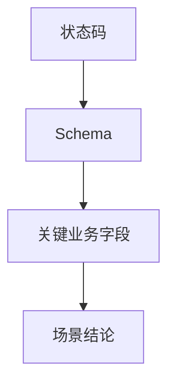

多个断言可以共同证明一个业务结论，但不要把多个无关结论混进同一个测试方法。

---

## 8. Allure 步骤与断言不是同一件事

Allure 步骤描述“发生了什么业务动作”。

断言回答“结果是否满足契约”。

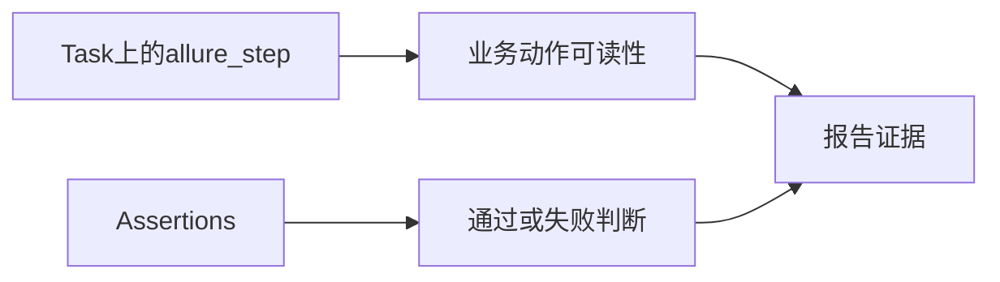

适合作为步骤的内容：

- 创建模型任务。
- 查询任务结果。
- 删除业务资源。
- 校验生成结果。

不适合单独成为步骤的内容：

- 给字典赋值。
- 读取普通局部变量。
- 每一次内部工具函数调用。

步骤可以没有断言，断言也不一定需要独立步骤；两者职责不同。

---

## 9. TestContext：跨步骤值与清理责任

同一用例跨步骤传递 request ID、resource ID 或 task ID 时，使用 `test_context`，不要使用模块全局变量。

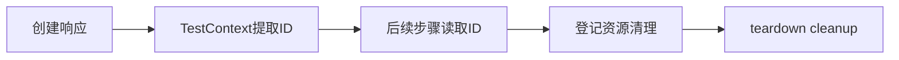

```python
test_context.extract(
    "request_id",
    response,
    header="x-oneapi-request-id",
)
request_id = test_context.require("request_id", expected_type=str)
```

需要清理业务资源时：

```python
test_context.add_cleanup(
    self.example_task.delete_resource,
    self.example_request,
    resource_id,
)
```

Day 12 会深入解释提取顺序和 LIFO 清理；本课只建立 module 编写责任。

---

## 10. 失败发生在哪个阶段

| 阶段 | 常见失败 | 主要归属 |
| --- | --- | --- |
| setup | 配置缺失、Request 创建失败 | fixture 或 setup |
| call/动作 | HTTP、Retry、Polling 或业务异常 | Task/Request |
| call/断言 | 状态码、Schema、字段不满足 | Assertions |
| teardown | Session 关闭或业务清理失败 | 资源所有者 |

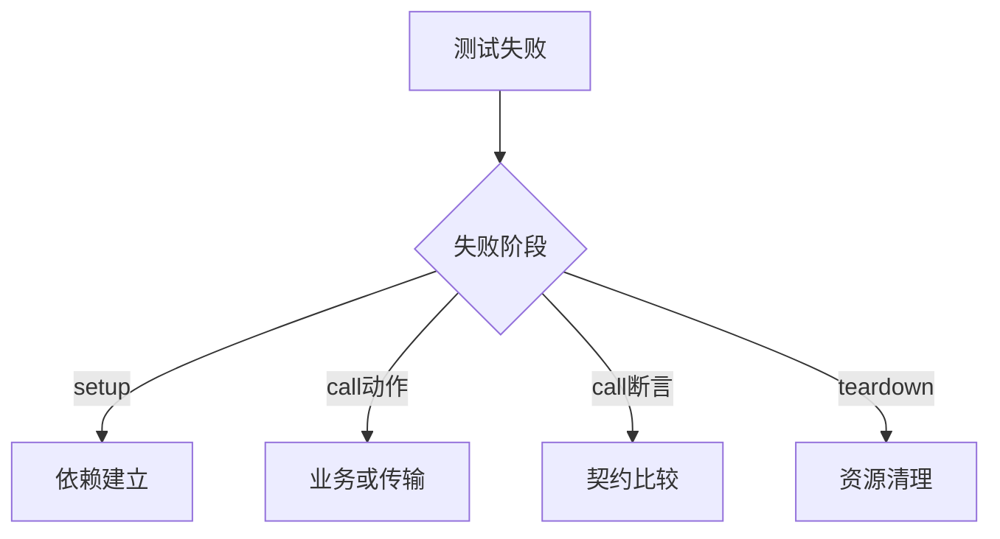

先定位阶段，再定位角色，比直接阅读完整堆栈更容易建立因果关系。

---

## 11. 证据边界

| 证据 | 能说明 | 不能说明 |
| --- | --- | --- |
| setup 成功 | 依赖已建立 | 业务动作一定成功 |
| Assertions 通过 | 已写出的契约满足 | 未断言字段全部正确 |
| Request close 被调用 | 当前所有者执行关闭动作 | 外部连接在所有环境都立即物理释放 |
| cleanup 完成 | 已登记动作执行完成 | 未登记资源也被自动发现 |
| Allure 步骤存在 | 动作被记录 | 动作结果必然正确 |

---

## 12. 本课结论与 Day 5

Day 4 建立了生命周期闭环：

```text
setup 创建并绑定资源
→ call 执行业务动作与断言
→ teardown 关闭 Request 并清理业务资源
→ report 保存阶段事实
```

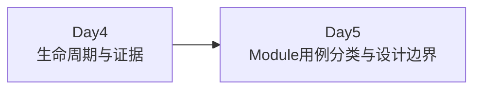

Day 5 将回答：同一个 module 中，正向、契约、边界、鉴权、清理和串行场景应该怎样分类和命名。
