# 第 05 天：Module 用例分类与设计边界

> **课程定位**：从真实业务 module 视角解释用例怎样按业务风险、契约类型和资源约束分类  
> **讲解重点**：正向、契约、边界、鉴权、隔离、清理、参数化、优先级与 serial 标记  
> **课程形式**：纯讲解，不设置实操、练习、作业、小测或命令执行要求  
> **事实依据**：`FRAMEWORK_TEST_SPEC.md`、`module/material_library/volc_cn_assets_test_case_design.md` 与真实 module 测试  
> **本课边界**：黄金组合用例只用于说明 module 层能力协作与组合证据，不讲 service 内部故障注入或本地服务实现

---

## 0. 从 Day 4 进入用例设计

Day 4 解决了一个测试怎样完成生命周期闭环。

Day 5 解决更大的问题：

> 一个业务 module 有很多风险时，应该怎样拆成清晰、可维护、可调度的测试类别？

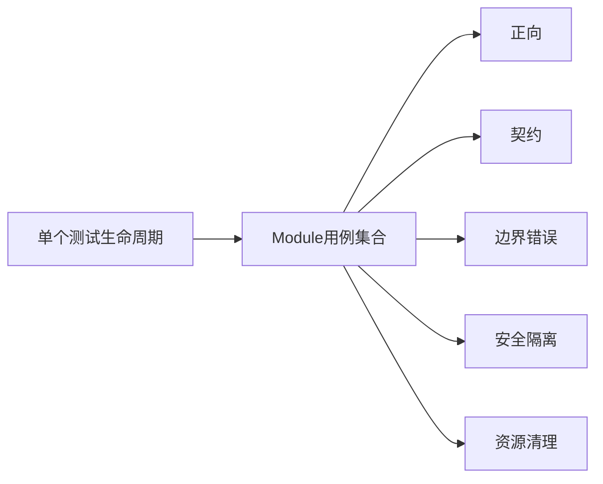

---

## 1. 第一性原理：用例集合是风险模型

用例数量不是目标。

测试集合的本质是把业务风险转化为可观察比较。

```text
业务能力
→ 识别失败方式
→ 选择可观察输入输出
→ 形成测试场景
→ 绑定断言和清理责任
```

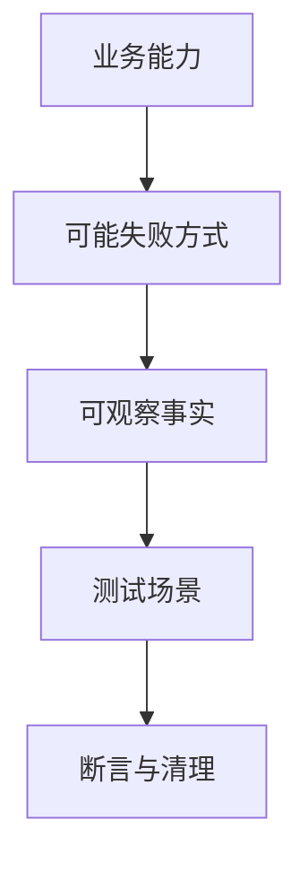

如果只根据接口数量写测试，就容易遗漏跨接口状态、鉴权边界和资源生命周期。

---

## 2. TOC：最大约束是场景边界不清

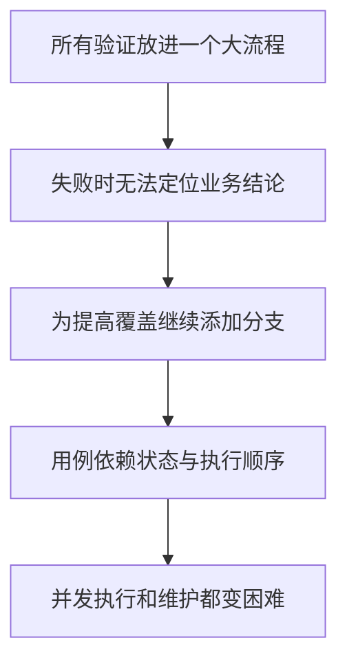

解约束原则是：

1. 一个测试方法表达一个核心业务结论。
2. 用例文件按业务风险或变化原因分类。
3. 共享流程进入 Task，共享判断进入 Assertions。
4. 共享资源影响通过 marker 和清理合同显式表达。

---

## 3. 第一类：正向业务流程

正向用例回答：在满足前置条件时，核心业务是否完成。

典型结构：

```text
合法输入
→ 调用Task
→ 状态码满足预期
→ Schema满足稳定合同
→ 关键业务字段存在或状态正确
```

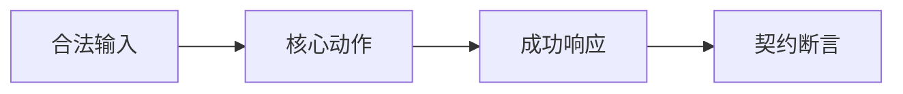

正向用例不需要把所有边界和错误分支塞进同一个方法。

---

## 4. 第二类：响应契约用例

契约用例关注调用方依赖的稳定结构：

- 必需字段。
- 字段类型。
- 枚举状态。
- 标准错误结构。
- request id 等关键 Header。

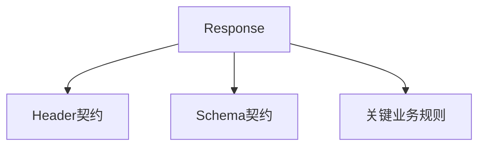

契约断言要防止两个极端：

| 极端 | 问题 |
| --- | --- |
| 只断言 200 | 业务结构错误仍可能通过 |
| 固定所有当前字段 | 非关键字段变化导致脆弱失败 |

只约束调用方真正依赖的稳定合同。

---

## 5. 第三类：错误与边界用例

错误与边界场景来自输入空间，而不是 service 内部实现。

常见维度包括：

- 缺少必填字段。
- 字段类型错误。
- 空字符串或空集合。
- 超出长度、数量或取值范围。
- 不支持的模型或枚举。
- 不存在的资源 ID。

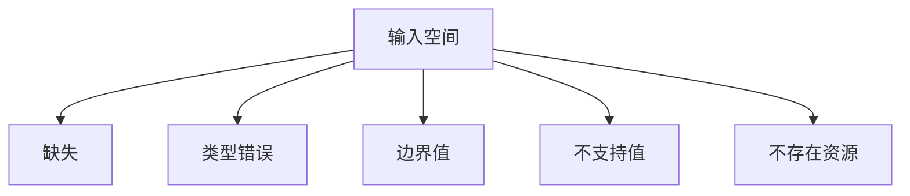

负向用例应断言公开错误合同，例如状态码、错误码、错误结构和脱敏输出。

不要读取 service 内部变量来判断为什么失败。

---

## 6. 第四类：鉴权与隔离用例

鉴权用例回答“谁可以做什么”。

隔离用例回答“一个主体的资源是否被另一个主体错误读取或修改”。

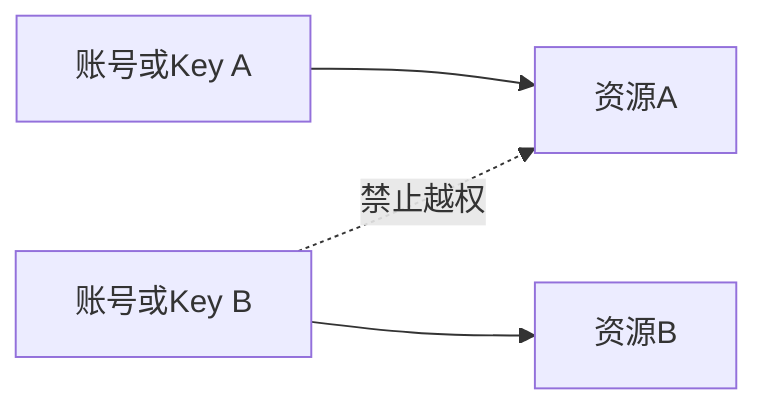

典型结论包括：

- 缺少凭证时返回标准未授权错误。
- 错误凭证不能访问资源。
- 不同账号的资源相互隔离。
- 错误输出不泄露 API Key、账号和敏感请求内容。

---

## 7. 第五类：资源生命周期用例

创建型接口不仅要验证创建成功，还要明确资源的后续责任。

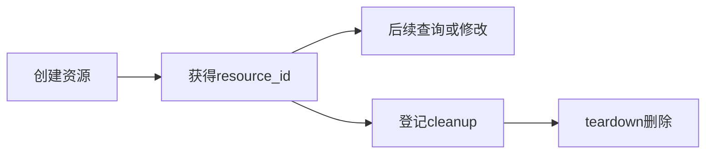

资源类用例通常需要说明：

- 谁创建资源。
- 怎样提取资源 ID。
- 后续步骤怎样读取 ID。
- 删除动作由哪个 Task 方法负责。
- 清理失败怎样暴露。

不要依赖用例执行顺序让另一个测试负责删除。

---

## 8. 第六类：异步状态与账单场景

异步任务需要区分：

- 创建请求已接受。
- 任务仍在 pending。
- 任务最终 success。
- 任务 failure、unknown 或 timeout。

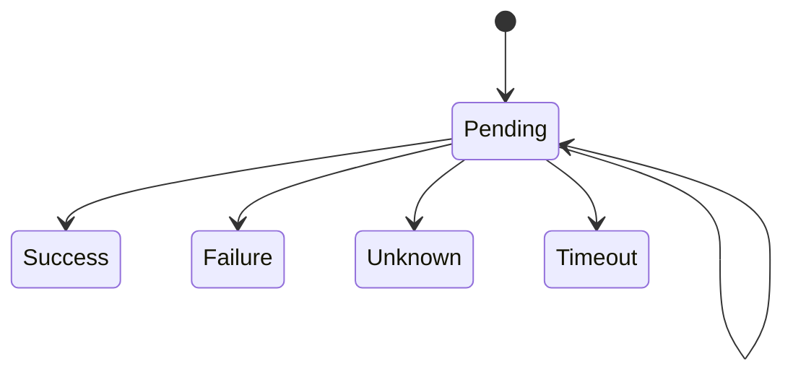

账单、余额和 usage 对账通常依赖共享账号或延迟结算，容易相互影响，应显式评估 `serial` 标记。

---

## 9. 参数化与场景数据

当多个场景共享同一业务流程，只改变输入数据时，适合参数化。


参数化适合：

- 多模型协议兼容。
- 多种 payload 变体。
- 多个合法枚举值。
- 一组等价错误输入。

不适合强行参数化：

- 生命周期完全不同的场景。
- 断言结论完全不同的场景。
- 需要不同清理策略的场景。

测试数据仍使用 Python 类型表达；CSV 可用于大规模协议矩阵，但加载、校验和业务语义仍由 Python 代码负责。

---

## 10. 文件拆分与命名

文件按业务边界或变化原因拆分。

```text
test_generation.py
test_generation_errors.py
test_billing.py
test_protocol_interception.py
test_resource_management.py
```

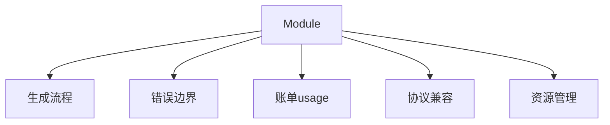

名称应让读者在不打开代码时，也能大致知道测试验证什么。

---

## 11. 优先级与执行约束

业务优先级可以分层表达：

| 层级 | 典型内容 |
| --- | --- |
| P0 | 核心创建、查询和关键成功契约 |
| P1 | 管理接口、常见错误、主要边界 |
| P2 | 低频能力、复杂认证或长耗时组合 |
| P3 | 安全输出、极端异常和补充回归 |

优先级描述业务重要性，marker 描述 pytest 执行属性，两者不是同一个概念。

以下场景通常需要 `serial`：

- 余额、账单和 usage 对账。
- 共享账号或共享 Header。
- 共享全局资源。
- 服务端延迟结算。
- 并发执行会改变断言结果。

```python
pytestmark = pytest.mark.serial
```

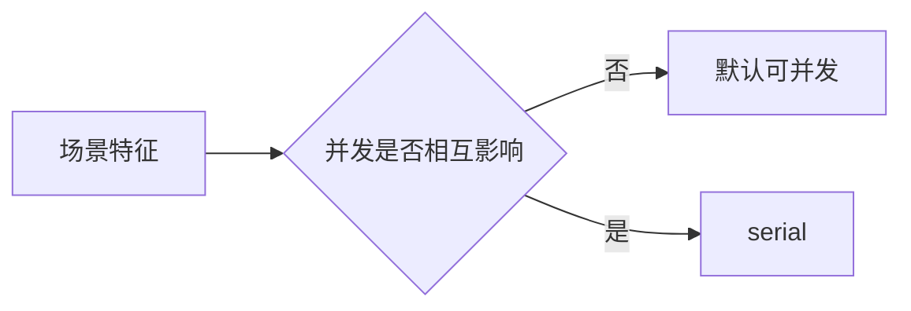

---

## 12. 场景设计矩阵

一个用例在进入代码前，应至少能回答：

| 维度 | 问题 |
| --- | --- |
| 目标 | 要证明哪个业务结论？ |
| 输入 | 合法、边界还是非法输入？ |
| 动作 | 调用哪个 Task 方法？ |
| 结果 | 观察状态码、Header、JSON 还是流？ |
| 断言 | 哪些稳定合同必须满足？ |
| 资源 | 是否创建远端资源，怎样清理？ |
| 调度 | 可并发还是必须串行？ |

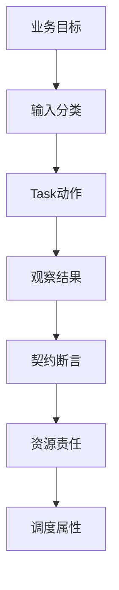

---

## 13. 组合流程的证据边界

组合流程可以证明多个公开能力在一个业务场景中协作，但不应成为日常用例编写的唯一模板。

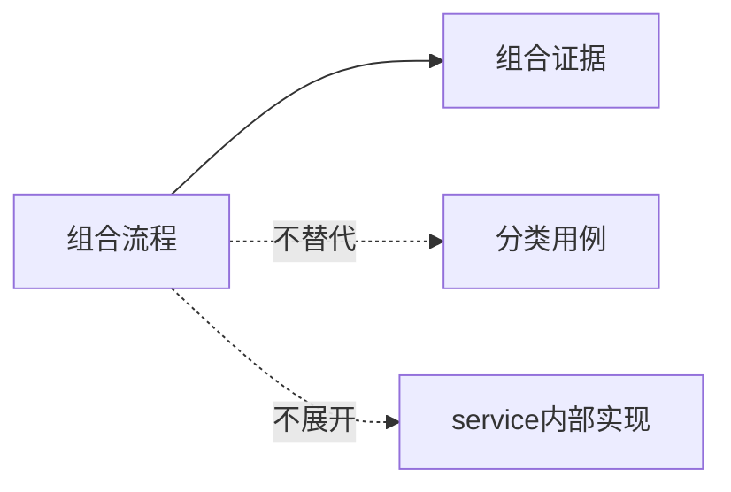

分类用例定位失败归属，组合流程观察协作结果，两者回答不同问题。

对 module 作者而言，service 仍然只是公开边界：

- 输入是请求合同。
- 输出是状态码、Header、响应体或事件流。
- 断言基于可观察结果。
- 不读取 service 内部存储来证明结论。

---

## 14. 第一周收束与 Day 6

第一周形成了一条完整的 module 作者主线：

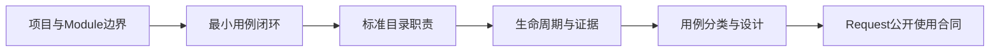

第一周最终结论：

1. Test 负责场景，不承载公共机制。
2. Task 负责业务动作和流程。
3. Request 负责传输合同和 Session 边界。
4. Assertions 负责稳定业务结论。
5. 用例集合按风险分类，而不是依赖一个大型组合流程覆盖全部问题。
6. service 内部实现不属于 module 用例课程主线。

Day 6 将从 module Request 作者视角解释 BaseRequest 和 RequestContext：哪些参数应该传入、哪些状态属于单次请求、哪些状态不能泄漏到下一次调用。
