# 第 06 天：Module Request 与请求上下文

> **Module 层落点**：先回答模块 Request 方法应传入哪些请求参数、哪些值属于单次调用，再解释足以理解该合同的 BaseRequest 内部事实  
> **课程边界**：不把 BaseRequest 实现当成 module 作者需要复制的模板

## 从 Day5 读取什么

Day5 已经建立了第一周的业务调用与证据地图：Test 组织场景，Task 编排动作，Request 负责传输，Response 传递事实，Assertions 把事实解释成业务结论。

Day5 还留下了一条必须继续遵守的边界：分类用例证明各自写出的业务合同，组合流程只能增加组合证据；任何一类证据都不能自动扩大成整个框架正确。

Day6 不改变这条业务主线，而是从 module Request 的公开用法向内观察“一次 HTTP attempt”的对象、状态、资源和证据边界。

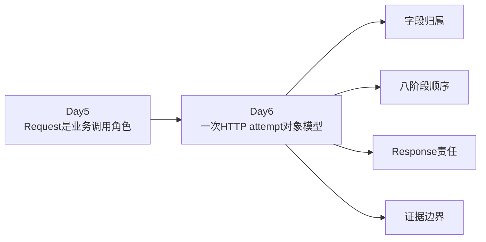

今天的重点不是记住 `common/base_request.py` 的全部方法，而是回答四个问题：

- 哪些状态属于长期客户端。
- 哪些状态只属于一次 attempt。
- 哪些对象越过 BaseRequest 边界继续存活。
- 源码事实、测试事实和尚未证明的结论如何分开。

---

## 1. 第一性原理：真正的瓶颈是所有权

一次 HTTP 调用至少同时包含四类东西：环境默认配置、可复用传输客户端、本次发送输入、发送后的结果或异常。

如果四类东西混在同一对象中，一次修改就可能影响后续请求，失败时也难以判断哪个对象应恢复状态、记录诊断或关闭资源。

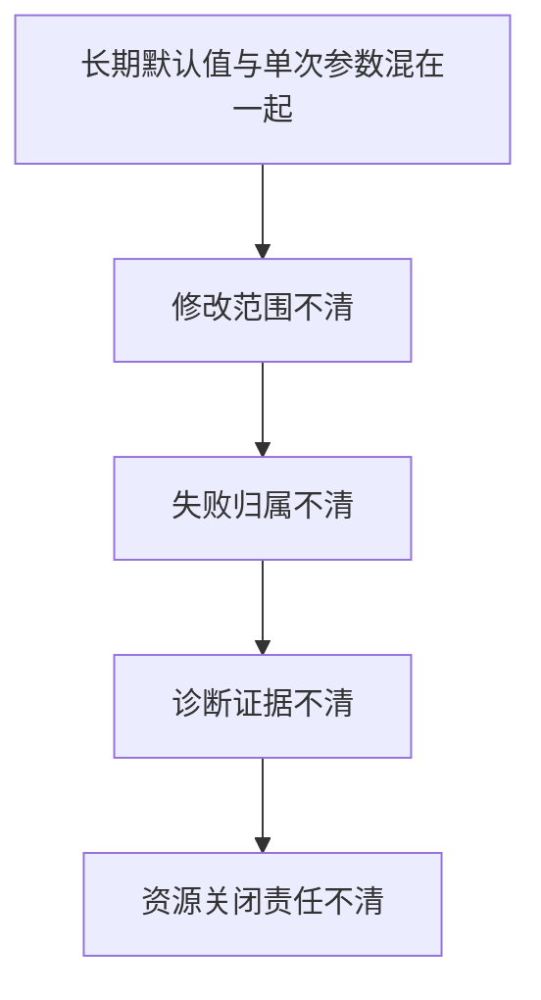

用 TOC 约束理论观察，当前主线的约束不是 HTTP 语法，而是对象所有权不清。

只要这个约束不解除，Middleware、Retry、Capture 和 Polling 越丰富，主干越难解释。

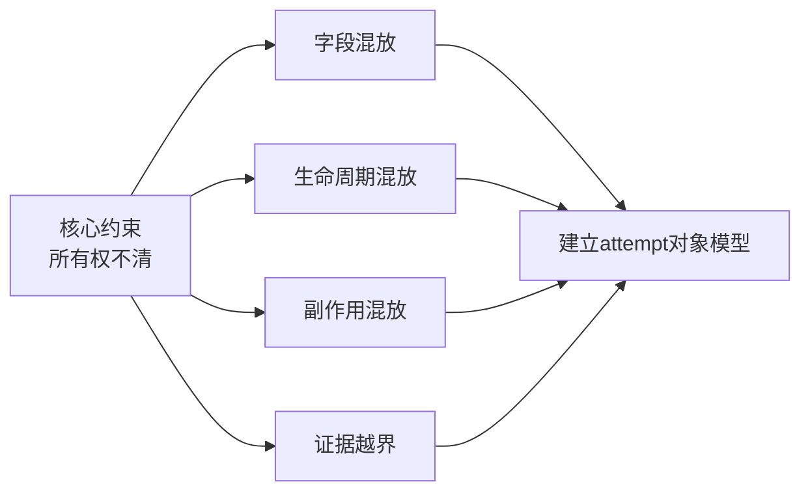

当前实现用四个主要边界解除这个约束：

- `BaseRequest`：长期协调者。
- `requests.Session`：可复用传输状态。
- `RequestContext`：标准化请求事实对象；实际发送时作为 attempt 的共享上下文。
- `requests.Response`：发送后返回的结果对象。

`Settings` 则向长期协调者提供环境默认事实。

---

## 2. attempt 不是整个业务调用

本课所说的 HTTP attempt，是一次真正进入 `self.session.request(...)` 的发送尝试。

一次普通业务调用可能只有一个 attempt；显式提供 Retry 策略后，一个逻辑请求可能包含多个 attempt；Polling 又可能发起多轮 GET，每轮内部仍可与 Retry 协作。

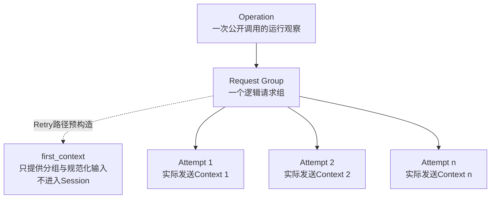

没有 Retry 时：

- 一个公开 `request()` 调用启动一个 Operation。
- `_send_single_group()` 创建 `configured_max_attempts=1` 的 Request Group。
- Group 绑定一个 `RequestContext`。
- 这个 Context 进入一次 `session.request()`。

有 Retry 时：

- Operation 仍代表公开调用。
- Group 仍代表逻辑请求。
- `_send_with_retry()` 先构造一个不发送的 `first_context`，用于读取规范化 method、path 与 request kwargs，并创建 Group。
- `context_factory` 再为每个实际 attempt 新建 Context。
- 不同实际 attempt 不复用同一个 Context 对象。

因此最重要的粒度结论是：

> 与 Session 实际协作的 `RequestContext` 按 attempt 隔离，不属于整个测试、整个 Task 或整个 Polling 生命周期；但不能反推“每个 Context 实例都代表一次 attempt”，因为 Retry 路径还有一个未发送的 `first_context`。

---

## 3. 五个核心对象的职责与寿命

| 对象 | 典型寿命 | 主要持有内容 | 是否代表一次 attempt |
| --- | --- | --- | --- |
| `Settings` | 通常长于单次请求 | 环境配置与默认值 | 否 |
| `BaseRequest` | 跨多次请求复用 | 配置引用、Session、Middleware 与协作者 | 否 |
| `requests.Session` | 随 BaseRequest 存活 | 可复用 Header 与传输会话 | 否 |
| `RequestContext` | 通常为单次 attempt；也可用于 Retry 发送前规划 | method、path、url、kwargs、控制与扩展字段 | 实际发送 Context 是；`first_context` 不是 |
| `requests.Response` | Session 返回后继续存活 | 状态码、Header、正文与可能的流资源 | 是该 attempt 的结果 |

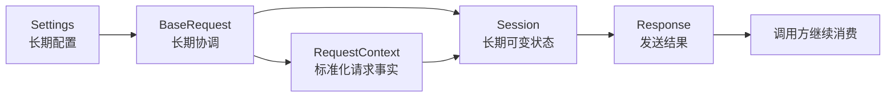

### 3.1 BaseRequest

构造函数保存或创建：`config`、`session`、`default_headers`、`capture_policy`、`middlewares`、`retry_executor` 和 `_runtime_observer`。

它负责标准化公开调用、构造 Context、连接协作者并把 attempt 交给 Session。

它不负责把 HTTP 内容解释成业务成功，也不会在成功返回前自动关闭 Response。

### 3.2 Session

Session 是真正执行 `request(...)` 的对象，也是跨请求复用的可变状态。

`set_header()`、`update_headers()`、`remove_header()` 和 `reset_headers()` 都直接修改 `self.session.headers`，因此这些修改会影响未来构造的 Context。

### 3.3 RequestContext

`RequestContext` 是可变 dataclass，字段包括：

- `method`、`path`、`url`。
- `kwargs`。
- `attach_log`。
- `request_step_name`、`response_step_name`。
- `protocol`。
- `retry_policy`、`polling_policy`。
- `attributes`。

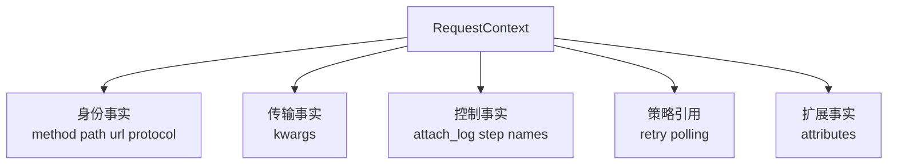

Context 不拥有长期 Session，不复制整个 Settings，也没有固定的 `response` 或 `error` 字段。

Response 与异常在执行阶段分别传给 Middleware，而不是预先塞入 Context。

### 3.4 Response

只要 Session 正常返回 Response，BaseRequest 就进入响应路径；这不等于状态码一定是 2xx，更不等于业务已经成功。

`test_default_request_does_not_retry` 让 Session 返回 503，BaseRequest 默认仍把 Response 返回，并且只发送一次。

| 层次 | 含义 |
| --- | --- |
| 传输返回 | Session 返回 Response 对象 |
| HTTP 成功 | 状态码是否在接受范围 |
| 业务成功 | 还需领域逻辑或 Assertions 判断 |
| 传输异常 | Session 没有返回 Response，而是抛出异常 |

---

## 4. Settings 提供默认事实，不代表本次请求

`config.py` 中的 `Settings` 包含 `timeout`、三项报告配置、`base_url`、`api_key` 和 `environment_name`，并使用 `ConfigDict(frozen=True)`。

`settings = load_settings()` 在模块加载时创建默认实例，`BaseRequest` 默认引用这个对象。

BaseRequest 当前直接读取的 Settings 字段只有三类：

| 字段 | 读取位置 | 进入哪里 |
| --- | --- | --- |
| `base_url` | `_build_url()` | Context 的完整 `url` |
| `api_key` | `_build_default_headers()` | 默认 `Authorization` |
| `timeout` | `_build_request_context()`、`poll_get()` | 默认单次或轮询超时 |

报告字段与 `environment_name` 不会被整体复制进 Context。

Settings 是默认来源，Context 是本次 attempt 的最终解析结果。

例如 Context timeout 可能来自显式参数，也可能来自 Settings，还可能再被 deadline 夹紧，因此不能把两者视为同一状态。

两份 BaseRequest 测试使用只含 `base_url`、`api_key`、`timeout` 的 `DummyConfig`，证明被覆盖路径只依赖这三个属性；它不证明生产配置加载与环境变量校验正确。

---

## 5. BaseRequest 构造时已经发生状态变化

`BaseRequest.__init__()` 不只是保存参数，它在对象创建时已经产生副作用。

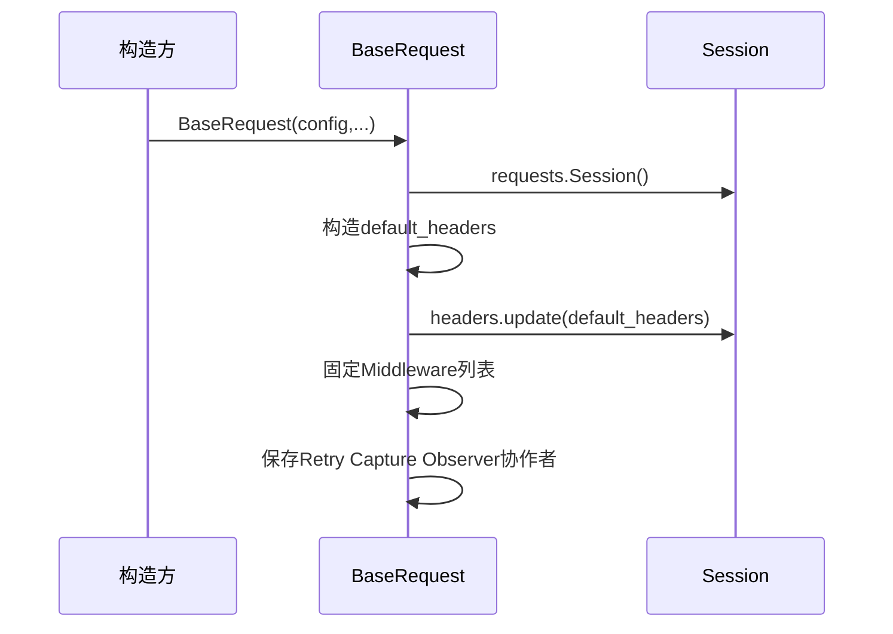

### 5.1 默认 Header

`_build_default_headers()` 当前返回：

| Header | 来源 |
| --- | --- |
| `Content-Type` | 固定 `application/json` |
| `Accept` | 固定 `application/json` |
| `User-Agent` | 固定框架标识 |
| `Authorization` | `Bearer {config.api_key}` |

这份字典被保存为 `self.default_headers`，随后更新到 `self.session.headers`。

`reset_headers()` 先清空 Session Header，再写回调用时的 `self.default_headers`；它不会重新读取 Settings。

`default_headers` 本身是普通可变字典，所以源码保证的是“按当前字典恢复”，而不是由类型系统保证“永远恢复构造瞬间的绝对原值”。

### 5.2 Middleware 列表

如果 `middlewares is None`，BaseRequest 调用默认工厂；如果显式传入列表，即使是空列表，也使用显式列表。

最终通过 `list(...)` 形成当前实例自己的列表对象。

`test_explicit_empty_middlewares_disables_default_middlewares` 证明：

- `None` 表示使用默认列表。
- `[]` 表示明确不使用 Middleware。

### 5.3 Session 与 Context 的寿命差异

一个 BaseRequest 默认持有一个 Session，却可以为多次请求创建多个 Context。

Context 每次新建，Session 默认复用；复用带来统一默认状态，也带来跨请求影响的可能。

---

## 6. 入口参数会被分流，不会全部进入 Session

公开 `request(method, path, **kwargs)` 先弹出三个框架控制项：

- `_attach_log`
- `retry_policy`
- `_inherit_session_headers`

`stream` 不会被弹出，它仍保留在传输 kwargs 中，同时用于选择运行观察类型和默认协议标签。

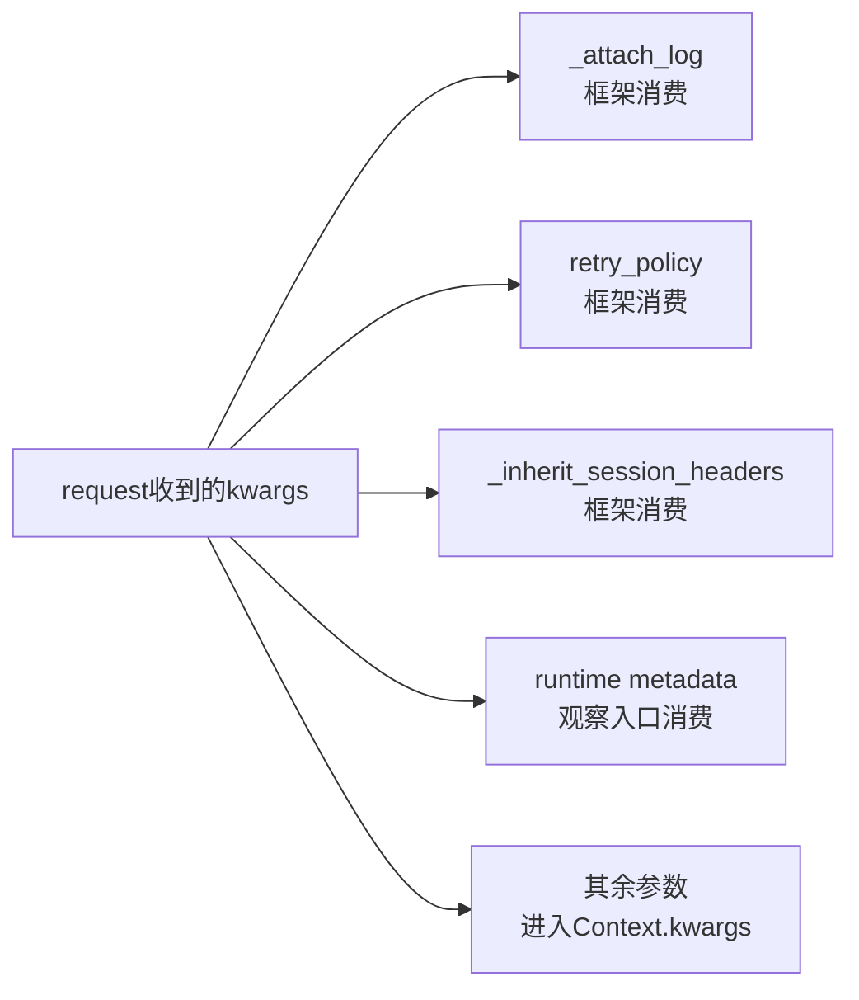

可以把输入分为三类：

| 类别 | 例子 | 最终去向 |
| --- | --- | --- |
| 调用身份 | `method`、`path` | Context 顶层字段 |
| 框架控制 | `_attach_log`、`retry_policy`、`_inherit_session_headers` | BaseRequest 分支或 Context 控制字段 |
| 传输参数 | `json`、`data`、`files`、`params`、`headers`、`timeout`、`stream` | Context `kwargs` |

框架控制项通过 `pop()` 被消费，因此不会意外作为参数传给 `Session.request()`。

`method` 在 Context 构造时转为大写；`path` 保留原始输入；`url` 保存解析后的完整地址。

---

## 7. URL、timeout 与 Header 如何成为 attempt 事实

### 7.1 URL

`_build_url()` 有两条分支：

- path 以 `http://` 或 `https://` 开头时，原样返回。
- 否则，用 `urljoin(f{base_url}/, path.lstrip(/))` 组合完整 URL。

当前代码没有在这里限制完整 URL 必须属于 `base_url` 域名。

### 7.2 timeout

Context 构造先执行 `setdefault(timeout, self.config.timeout)`，所以显式 timeout 优先，Settings timeout 只补缺省值。

随后 `retry_executor.clamp_timeout(...)` 还可能按 deadline 夹紧最终值。

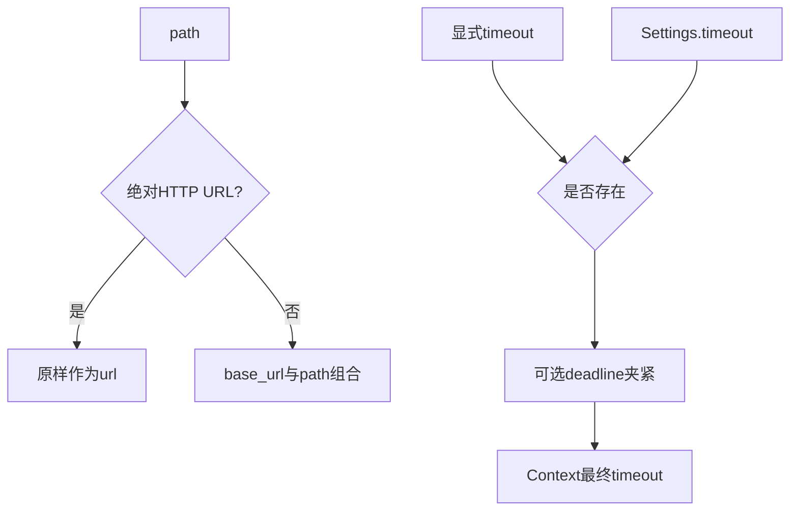

Day6 只确认输入来源与调用顺序，不提前展开 Retry 等待预算或 Polling 总 deadline 的内部算法。

### 7.3 Header

默认情况下，`_merge_headers()` 先复制 `self.session.headers`，再用本次显式 Header 覆盖同名键，最终写入 `context.kwargs[headers]`。

`test_runs_middlewares_in_registration_order` 直接检查了默认 Authorization、本次 `X-Test` 与最终 Session 参数。

当 `_inherit_session_headers=False` 时，源码为 Session 中现有 Header 名生成值为 `None` 的映射，再叠加本次 Header。

本课能确认这份映射进入 Context 和 Session；`requests` 依赖库如何解释 `None` 覆盖，不由两份 BaseRequest 测试单独证明。

---

## 8. kwargs 复制：常见数据隔离，但不是绝对隔离

`_copy_request_kwargs()` 对每个顶层值分别尝试 `deepcopy(value)`；某个值复制失败时，只让该值回退为原引用，其他值继续处理。

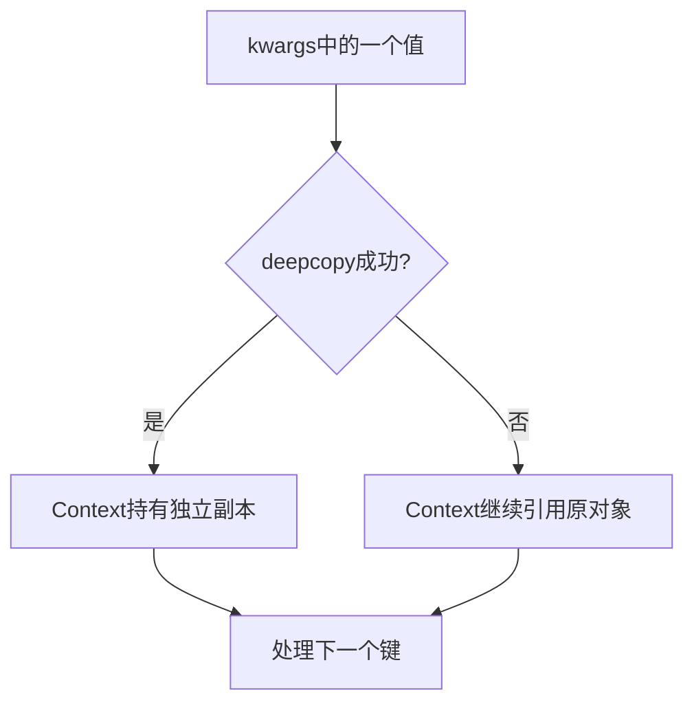

`test_request_context_deep_copies_nested_kwargs` 证明普通嵌套 JSON payload 被复制：Middleware 修改 Context 内部文本，调用方原 payload 仍保持原值。

`test_request_context_is_isolated_under_threads` 证明两个线程中的普通嵌套 payload 在该测试场景下互不覆盖，原对象也没有被改写。

这些测试没有证明：

- 任意对象都一定能深拷贝。
- 复制失败后仍然隔离。
- 共享 Session 在任意并发修改下都安全。
- 并发 `set_header()`、`remove_header()` 或 `reset_headers()` 不会冲突。

测试使用替换后的 `session.request`，重点是 Context 与普通 payload 隔离，不是真实连接池并发语义。

Context 没有声明 frozen，`kwargs` 与 `attributes` 都可变；这允许 Middleware 在发送前扩展 attempt 数据，也意味着错误修改会影响真实发送。

---

## 9. Header 的三层状态与 RequestContext 字段归属

`default_headers`、`session.headers`、`context.kwargs[headers]` 是三份不同状态。

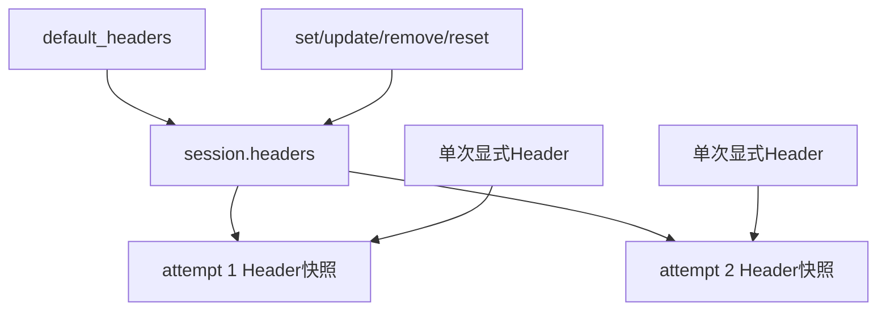

| 状态 | 作用范围 | 修改后影响 |
| --- | --- | --- |
| `default_headers` | reset 的来源 | 影响未来 reset 结果 |
| `session.headers` | BaseRequest 实例级默认值 | 影响未来 Context |
| Context Header | 单次 attempt | 影响本次 Session 调用 |

Context 的其余字段可以分组理解：

| 字段组 | 字段 | 来源与作用 |
| --- | --- | --- |
| 身份 | `method`、`path`、`url`、`protocol` | 标识本次 attempt |
| 传输 | `kwargs` | 交给 Session 的标准化参数 |
| 日志控制 | `attach_log`、两个 step name | 告诉协作者如何记录 |
| 策略引用 | `retry_policy`、`polling_policy` | 表示所属调用语境 |
| 扩展 | `attributes` | 保存 attempt 级诊断事实 |

`protocol` 默认按 `stream` 推导为 `sse` 或 `http`，Polling 会显式传入 `polling`；它是运行观察标签，不是服务端 JSON 字段。

`attributes` 使用 `field(default_factory=dict)`，所以每个 Context 默认获得独立字典。

`test_creates_independent_context_for_each_request` 证明两次请求的 Context 与 attributes 都不是同一对象。

BaseRequest 自身会写入 Retry attempt 的 `attempt_index`、`max_attempts`，以及异常 Middleware 失败时的 `middleware_exception_errors`。

因此 `attributes` 是 attempt 级扩展袋，不是业务请求体，也不是长期全局状态。

---

## 10. 无 Retry 的一次 HTTP attempt：源码八阶段

下面以普通 `get/post/put/patch/delete` 且没有传 Retry 策略的路径为准。这是最小、完整、可直接对应源码的一次 attempt。

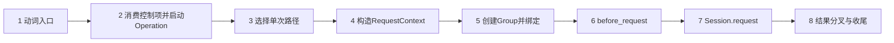

### 阶段 1：动词薄入口

`get()`、`post()`、`put()`、`patch()`、`delete()` 只把固定 method、path 和 kwargs 交给统一 `request()`。

它们不各自维护 Session，也不重复 Header、timeout 或 Middleware 逻辑。

### 阶段 2：消费控制项并启动 Operation

`request()` 先取出 `_attach_log`、`retry_policy`、`_inherit_session_headers`，再读取 `stream`，通过 RuntimeObserver 规范化元数据并启动 Operation。

本课只确认观察入口存在，不展开 Operation 内部持久化机制。

### 阶段 3：选择发送路径

`retry_policy is None` 时进入 Context 构造与 `_send_single_group()`；否则进入 `_send_with_retry()`。

默认请求不会因为 503 自动 Retry，对应测试只观察到一次发送。

### 阶段 4：构造 RequestContext

`_build_request_context()` 的实际顺序是：

1. 解析 URL。
2. 逐值复制 kwargs。
3. 补默认 timeout。
4. 按 deadline 夹紧 timeout。
5. 取出本次 Header。
6. 合并 Session Header。
7. 创建 Context。

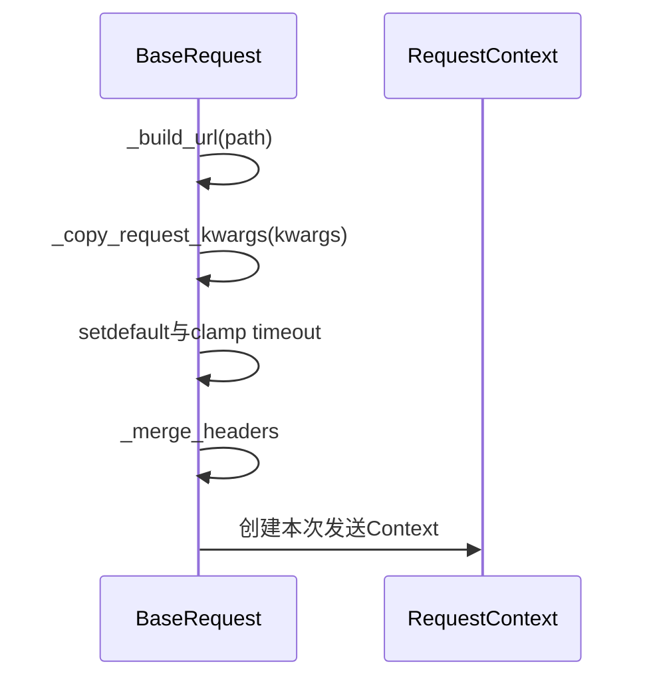

### 阶段 5：创建 Request Group 并绑定 Context

`_send_single_group()` 创建 `configured_max_attempts=1` 的 Group，使用 Context 的 method、path、protocol，并调用 `group.bind(context)`。

发送被包在 `try/finally` 中，所以只要 Group 已创建，无论返回还是抛出，`group.finish()` 都会执行。

### 阶段 6：执行 `before_request`

`_send()` 首先按 `self.middlewares` 注册顺序逐个调用 `before_request(context)`。

`test_runs_middlewares_in_registration_order` 观察到 `one.before → two.before → send`，两个 Middleware 收到同一个 Context。

### 阶段 7：Session 执行标准请求

真正的传输边界只有：

`self.session.request(method=context.method, url=context.url, **context.kwargs)`。

Session 接收的不是未处理的业务输入集合，而是 Context 中已经标准化的 attempt 事实。

### 阶段 8：结果分叉与分层收尾

Session 返回 Response 时：

1. 按注册顺序执行 `after_response(context, response)`。
2. `_send()` 返回同一个局部 Response 引用。
3. Group 在 finally 中完成。
4. Operation 调用 `finish_response(...)`。
5. Response 返回调用方。

Session 抛出异常时：

1. `_send()` 执行 `on_exception(context, error)`。
2. 原请求异常重新抛出。
3. Group 在 finally 中完成。
4. Operation 调用 `finish_error(error)`。
5. 原异常继续向上抛出。

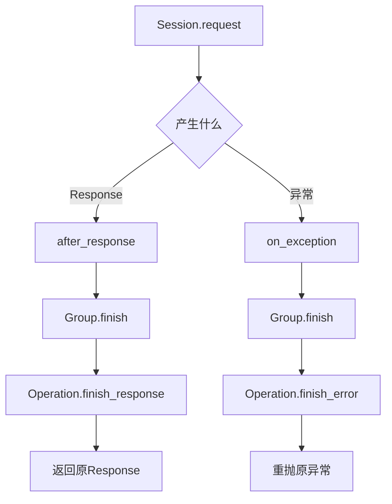

---

## 11. 不同异常位置不是同一种失败

### 11.1 before_request 失败

`_run_before_middlewares()` 位于 Session 的 try 块之前。

某个 before 钩子失败时：

- BaseRequest 包装为带 Middleware 类型名的 `RuntimeError`。
- Session 尚未执行。
- `_run_exception_middlewares()` 不会被调用。
- Group 仍会 finish。
- Operation 记录错误并重新抛出。

`test_wraps_middleware_error_with_source` 覆盖了错误包装信息。

### 11.2 Session 传输失败

Session 抛出异常时，所有 `on_exception` 按注册顺序执行，最终重新抛出原请求异常对象。

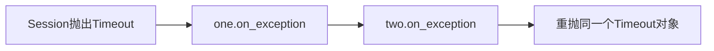

测试使用 `exc_info.value is request_error` 检查对象身份，证明原异常没有被新异常替换。

### 11.3 on_exception 自身失败

BaseRequest 收集 Middleware 错误，把包装后的列表写入 `context.attributes[middleware_exception_errors]`，并给原异常添加 note。

主异常仍是原请求异常，Middleware 错误只作为诊断补充。

### 11.4 after_response 失败

`_run_after_middlewares()` 位于 Session try/except 之后。

after 钩子失败时：

- 错误被包装为 `RuntimeError`。
- 不会转入 `on_exception`。
- Group 与 Operation 仍由外层逻辑收尾。
- Response 已存在，但不会正常返回调用方。

当前两份 BaseRequest 测试没有直接覆盖这个分支，所以这是源码可见事实，不应写成“测试已经证明”。

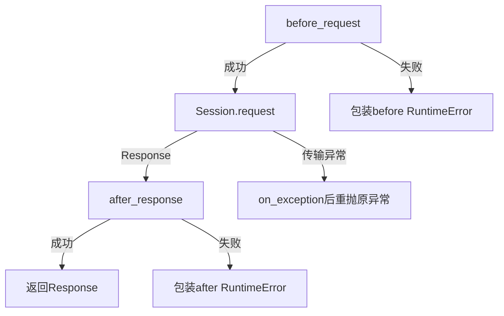

所以“请求失败”至少可能指：发送前扩展失败、传输失败、返回后扩展失败，或 Session 正常返回但业务不接受的 HTTP Response。

---

## 12. Middleware、Retry、Capture、Polling 只是协作者入口

### 12.1 Middleware

BaseRequest 规定三个钩子位置：发送前 `before_request`、返回后 `after_response`、传输异常后 `on_exception`。

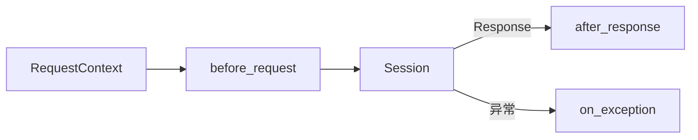

默认 Middleware 工厂接收 CapturePolicy。相邻 source card 说明默认列表包含运行观察、媒体资源、脱敏和日志协作者，并规定注册顺序。

Day6 只确认它们共享 attempt Context 并从固定钩子进入主干，不展开具体处理机制。

### 12.2 Retry

`retry_policy` 默认为空，只有显式提供时才进入 `_send_with_retry()`。

Retry 路径先创建一个未发送的 `first_context`，再为每个实际 attempt 新建 Context，并在实际 attempt Context 中写入 `attempt_index` 与 `max_attempts`。

`test_retry_uses_independent_context_for_each_attempt` 证明原 payload 不被改写，两个 attempt 的 Context 不是同一对象。

Retry 资格、可恢复条件、等待与预算决策留到 Day9。

### 12.3 Capture

BaseRequest 保存 `capture_policy`。输入 Capture 由默认 `MediaResourceMiddleware.before_request()` 在 POST 发送前触发；输出 Capture 则由 `poll_get()` 外层的 `download_links_from_poll_get` 装饰器在轮询成功返回后触发。

因此 Capture 不是 Session 参数，也不是 RequestContext 固定字段；输入与输出 Capture 共享策略，但进入主干的所有权位置不同，不能都归入 Middleware。

资源识别、下载与原子落盘留到 Day8；有入口不等于资源已经安全落盘。

### 12.4 Polling

`poll_get()` 要求显式 `polling_policy`，每轮通过 `_request_without_attach()` 发起 GET，并把专用步骤名、`protocol=polling`、策略与统一 deadline 传入 Context 构造路径。

Polling 没有另造 HTTP 发送器，仍复用 Context、Middleware 与 Session 主干；四类状态与总截止时间留到 Day10。

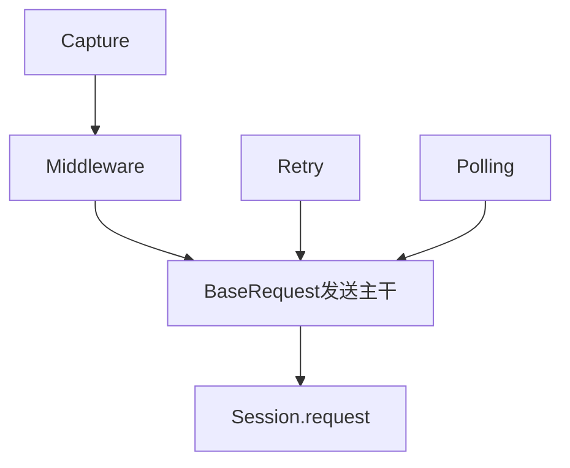

这些协作者都不拥有整个请求。真正传输仍收敛到 Session，一次 attempt 的共享事实仍收敛到 RequestContext。

---

## 13. Response 关闭责任

### 13.1 BaseRequest.close() 关闭的是 Session

`BaseRequest.close()` 只调用 `self.session.close()`。

它没有接收某个 Response，因此不能解释成“关闭所有已返回 Response 的统一方法”。

### 13.2 成功返回前没有关闭 Response

`_send()` 把 Session 返回的 Response 交给 after Middleware，然后逐层返回给调用方。

如果 BaseRequest 在返回前无条件关闭 Response，调用方就无法继续消费流式内容；当前实现选择让 Response 越过边界继续存活。

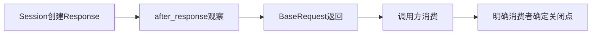

源码直接确认：

- BaseRequest 成功路径没有 `response.close()`。
- 返回的是 Session 产生的 Response 引用。
- `BaseRequest.close()` 关闭 Session。

### 13.3 最终消费者的责任

Response 返回后已离开 BaseRequest 的局部控制范围，最终消费者需要拥有明确关闭点，尤其是流式消费路径。

必要 source card 给出真实例子：`SmokeTask.collect_stream_chat_completion_chunks` 在 `finally` 中调用 `response.close()`，让正常解析与异常路径经过同一关闭点。

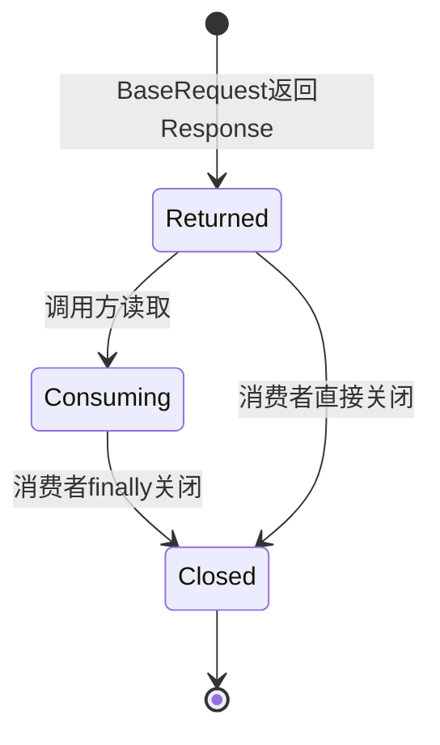

这是一种责任模型，不表示每个当前调用点都已经使用同样的 finally。

### 13.4 测试的关闭证据边界

两份 BaseRequest 测试使用 `make_response()` 构造内存 Response，手工设置状态码、正文、Header 和 PreparedRequest，没有建立真实网络连接。

它们能证明 Response 对象如何沿主干传递，不能证明真实 socket、连接池或流资源已经关闭。

`FakeStreamResponse` 虽有 `closed` 标记，但当前两份 BaseRequest 测试没有用它证明 BaseRequest 自动关闭流式 Response。

Retry 与 Polling 可能产生多个 Response。仅凭本课证据，不能宣称所有未最终返回的中间 Response 都已确定关闭，也不能仅凭缺少测试就断言真实环境必然泄漏。

准确边界是：最终返回 Response 不由 BaseRequest 在成功返回前关闭；协作者内部产生但不返回的 Response，需要在相应实现与专门资源证据中分别审计。

---

## 14. 对象状态、资源与副作用总账

### 14.1 构造阶段

| 动作 | 改变的对象 | 副作用范围 |
| --- | --- | --- |
| 创建 Session | `BaseRequest.session` | 新增长期传输资源 |
| 构造默认 Header | `BaseRequest.default_headers` | 新增可变字典 |
| 更新 Session Header | `session.headers` | 改变未来请求默认值 |
| 固定 Middleware 列表 | `BaseRequest.middlewares` | 决定钩子顺序 |
| 创建 RetryExecutor | `BaseRequest.retry_executor` | 保存时间与等待协作者 |

### 14.2 Context 构造阶段

| 动作 | 改变的对象 | 对调用方输入的影响 |
| --- | --- | --- |
| 解析 URL | Context 字段 | 不修改 path 字符串 |
| 复制 kwargs 值 | 新 kwargs 字典 | 可复制值与原对象隔离 |
| 补 timeout | Context kwargs | 不回写调用方字典 |
| 合并 Header | Context kwargs | 不直接改 Session Header |
| 创建 attributes | 新独立字典 | 不与其他 Context 默认共享 |

### 14.3 发送阶段

| 动作 | 可能状态变化 |
| --- | --- |
| `before_request` | 可修改 Context kwargs 与 attributes |
| `session.request` | 发生真实或替代传输副作用 |
| `after_response` | 可观察并可能修改传入 Response 对象 |
| `on_exception` | 可记录异常诊断事实 |
| Runtime 收尾 | Operation 与 Group 记录结束状态 |

```mermaid
flowchart TD
    L[长期状态<br/>Settings BaseRequest Session] --> A[单次状态<br/>RequestContext]
    A --> N[网络或替代传输副作用]
    N --> R[Response或异常]
    R --> D[诊断与运行观察副作用]
    R --> C[调用方后续消费或处理]
```

最容易混淆的四组状态是：

| 容易混淆 | 正确区别 |
| --- | --- |
| Settings timeout 与 Context timeout | 前者是默认来源，后者是本次最终值 |
| Session Header 与 Context Header | 前者跨请求，后者是 attempt 快照 |
| Context attributes 与业务 payload | 前者供框架扩展，后者属于真实传输参数 |
| Session close 与 Response close | 前者收口客户端会话，后者收口具体响应资源 |

---

## 15. 测试证据分别证明什么

### 15.1 Middleware 顺序

`test_runs_middlewares_in_registration_order` 证明：

- before 按注册顺序执行。
- Session 位于 before 与 after 之间。
- after 也按注册顺序执行。
- 多个 Middleware 看到同一个 Context。
- method、URL、默认 timeout 与合并 Header 已进入 Session。

它使用 RecordingMiddleware，因此不证明默认 Middleware 的内部语义全部正确。

### 15.2 异常优先级

`test_runs_exception_middlewares_then_reraises_original_error` 证明 Session Timeout 后不进入 after，on_exception 按顺序执行，最终异常仍是原对象。

`test_exception_middleware_error_does_not_hide_original_request_error` 证明 Middleware 异常以 note 补充，原 Timeout 仍是主异常。

### 15.3 Context 独立性

以下测试形成递进证据：

- `test_creates_independent_context_for_each_request`：不同请求的 Context 与 attributes 独立。
- `test_request_context_deep_copies_nested_kwargs`：普通嵌套 JSON 不被 Context 修改回写。
- `test_request_context_is_isolated_under_threads`：该普通 payload 场景下的线程修改隔离。
- `test_retry_uses_independent_context_for_each_attempt`：Retry attempt 之间也新建 Context。

### 15.4 显式空 Middleware

`test_explicit_empty_middlewares_disables_default_middlewares` 证明空列表是有效配置，不是 None 的另一种写法。

### 15.5 日志开关

`test_attach_log_false_still_sends_request_without_auto_attach` 证明 `_attach_log=False` 不阻止发送；LoggingMiddleware 仍可创建 logger，但成功 Response 不自动附加。

所以 `attach_log` 是诊断控制，不是业务发送开关。

### 15.6 Retry 与 Polling 的入口证据

两份测试可以支持这些 Day6 结论：

- 默认请求不自动 Retry。
- 显式 Retry 可能产生多个 attempt。
- 每个 Retry attempt 有独立 Context。
- `poll_get()` 要求 PollingPolicy。
- Polling 每轮仍复用 Session 请求主干。

它们在 Day6 不用于提前讲完 Retry 方法资格、恢复条件、退避计算，也不用于提前讲完 Polling 四类终态。

### 15.7 mock_helpers 的能力边界

`make_response()` 构造内存 Response；`SequenceTransport` 记录参数并按顺序返回对象或异常；`SleepRecorder` 记录等待；`FakeApiCallLogger` 记录附件调用；`FakeStreamResponse` 模拟流与关闭标记。

这些替身让测试能确定性检查对象身份、顺序和参数，但不自动证明真实 HTTP 服务、DNS、TLS、socket 或连接池行为。

---

## 16. 源码证据与测试证据必须分栏

| 证据类型 | 主要回答 |
| --- | --- |
| 源码阅读 | 当前实现写了哪些字段、分支与调用顺序 |
| 离线测试 | 某个输入下实际观察到了哪些对象与结果 |

源码存在某个分支，不等于测试覆盖过它；替身测试通过，也不等于真实依赖的全部行为都被覆盖。

```mermaid
flowchart LR
    S[源码可见事实] --> C[实现结论]
    T[测试观察事实] --> E[行为证据]
    C --> B[保守边界]
    E --> B
    B --> R[只陈述共同支持的强度]
```

### 16.1 可以高置信陈述

- BaseRequest 构造时创建 Session。
- 默认 Header 被写入 Session。
- 每次 Context 构造都会创建新 dataclass 实例。
- Context attributes 默认独立。
- 普通嵌套 kwargs 在现有测试中实现隔离。
- before、send、after 的顺序已被测试观察。
- Session 异常触发 on_exception，并重抛原异常。
- 默认请求不会仅因 503 自动 Retry。
- BaseRequest 成功路径不关闭返回 Response。
- BaseRequest.close() 关闭 Session。

### 16.2 不能扩大陈述

- 不能说任意 kwargs 对象都一定深拷贝成功。
- 不能说共享 Session 的所有并发使用都安全。
- 不能说 HTTP 503 是传输异常。
- 不能说 Middleware 永远不会修改真实请求。
- 不能说启用 Capture 就代表资源必然落盘成功。
- 不能说显式 Retry 一定发生第二次 attempt。
- 不能说 Polling 一定进入下一轮。
- 不能说 Session close 等于所有 Response 已关闭。
- 不能说 mock Response 已证明真实网络资源生命周期。

---

## 17. 当前设计的主要取舍

### 17.1 中央协调

所有动词进入 `request()`，所有 attempt 进入 `_send()`。

收益是 Header、timeout、Middleware 与观察顺序统一；代价是 BaseRequest 同时连接多个协作者入口，需要继续按所有权拆解。

### 17.2 可变 Context

Middleware 可以在 before 阶段扩展 kwargs 与 attributes。

收益是扩展点统一；代价是错误修改会污染真实发送参数。

### 17.3 Session 复用

收益是客户端级默认状态集中；代价是 `set_header()` 等修改会影响未来 Context。

### 17.4 尽力 deepcopy

逐值 deepcopy 覆盖常见字典、列表和标量，失败后回退原引用。

收益是兼容更多传输对象；代价是隔离并非无条件保证。

### 17.5 Response 穿透返回

收益是调用方可继续读取普通或流式内容；代价是最终消费者必须拥有明确关闭点。

```mermaid
flowchart LR
    U[统一主干] -->|收益| C[一致顺序]
    U -->|代价| K[集中复杂度]
    M[可变Context] -->|收益| E[容易扩展]
    M -->|代价| P[可能污染发送]
    S[Session复用] -->|收益| R[默认状态复用]
    S -->|代价| X[跨请求影响]
    O[Response返回] -->|收益| F[继续消费]
    O -->|代价| Z[关闭责任外移]
```

设计取舍没有脱离场景的绝对答案，关键是边界与证据必须清楚。

---

## 18. Day6 的完整对象模型

```mermaid
flowchart TB
    ST[Settings<br/>base_url api_key timeout] --> BR[BaseRequest长期协调者]
    BR --> SE[Session长期可变传输状态]
    BR --> RC[实际发送RequestContext<br/>单次attempt快照]
    RC --> BM[before Middleware入口]
    BM --> SE
    SE -->|Response| AM[after Middleware入口]
    SE -->|异常| EM[exception Middleware入口]
    AM --> RP[Response返回调用方]
    EM --> EX[原异常向上抛出]
    RP --> CL[消费者确定Response关闭点]
    BR --> SC[close时关闭Session]
```

这张图有四条不能互换的线：

1. Settings 向 BaseRequest 提供默认配置。
2. BaseRequest 用 Session 保存长期传输状态。
3. 实际发送的 RequestContext 保存单次 attempt 的标准化事实；Retry 预构造的 `first_context` 不进入 Session。
4. Response 穿过 BaseRequest 边界，由后续消费者继续拥有。

八阶段可以压缩为一句话：

> 动词入口进入 `request()`，框架控制项先被消费，单次路径构造 Context，Group 绑定 Context，Middleware 在 Session 前后协作，Session 返回 Response 或抛出异常，最后 Group 与 Operation 分层收尾，而 Response 本身继续返回调用方。

---

## 19. 向 Day7 交付什么

Day6 把请求主干停在一个精确位置：

- 调用方输入已经过复制、timeout 补全与 Header 合并。
- 最终真实发送参数位于 `context.kwargs`。
- 实际发送的 RequestContext 是一次 attempt 的共享可变对象；Retry 的未发送 `first_context` 只用于发送前规划。
- Middleware 在 Session 之前首先接触这个 Context。
- `attributes` 可以保存 attempt 级诊断扩展。
- Session 把 `context.kwargs` 作为真实业务请求发送。
- Response 与异常分别进入不同钩子。

这为 Day7 留下新的约束：日志若直接读取真实 kwargs，敏感信息可能进入诊断输出；若为了日志安全直接改写真实 kwargs，业务请求又可能被污染。

因此下一课必须同时保留两条数据轨道。

```mermaid
flowchart LR
    C[RequestContext进入Middleware] --> R[真实业务参数<br/>继续交给Session]
    C --> D[诊断副本<br/>供日志与观察使用]
    R --> S[Session真实发送]
    D --> L[安全诊断输出]
    R -.不能被诊断处理污染.-> D
```

Day7 将读取的模型是：

> 真实业务参数与诊断副本共同进入 Middleware 协作范围，但拥有不同用途、不同修改边界和清楚的数据流向。

Day6 不提前展开 Day7 的具体脱敏顺序，也不提前展开 Day8 下载、Day9 Retry 决策或 Day10 Polling 状态机。

本课只完成它们共同依赖的基础：一次 HTTP attempt 的对象、顺序、资源与证据边界。
