# 第 07 天：请求中间件脱敏与诊断日志

> **课程定位**：承接第 6 天的 `RequestContext` 与八阶段请求主线，解释请求进入网络边界前后，Middleware 如何附加观察、资源触发、脱敏副本和诊断日志  
> **Module 层落点**：模块 Request 继续传递真实业务参数；用例作者只配置公开选项并遵守敏感信息边界，不直接调用中间件生命周期方法  
> **讲解重点**：真实业务参数与脱敏诊断副本双轨并存、`before_request / after_response / on_exception` 的真实顺序、默认 Middleware 职责，以及 Header、Body、异常文本、cURL、Allure 的安全边界  
> **事实依据**：`common/request_middleware.py`、`common/base_request.py`、`util/redaction.py`、`util/api_call_logger.py`、`util/curl_builder.py`、`util/media_resources.py` 与相关离线测试  
> **范围约束**：`RuntimeObservationMiddleware` 与 `MediaResourceMiddleware` 只说明它们在链中的位置和直接副作用；资源生命周期留给第 8 天

---

## 0. 从第 6 天接过来的不是“一个请求”，而是一次 attempt 的事实对象

第 6 天已经把普通无 Retry 请求整理成八个阶段：

```text
1. HTTP 动词薄方法进入 BaseRequest.request()
2. 消费框架控制项并启动 Operation
3. 根据 retry_policy 选择单次或 Retry 发送路径
4. 构造 RequestContext
5. 创建并绑定 Request Group
6. 执行 before_request Middlewares
7. Session 执行标准化请求
8. Response/异常分叉，并完成 Group 与 Operation 收尾
```

第 7 天不改写这条主线。

本课只把第 6、7、8 阶段之间原本压缩成一个词的 Middleware 展开。

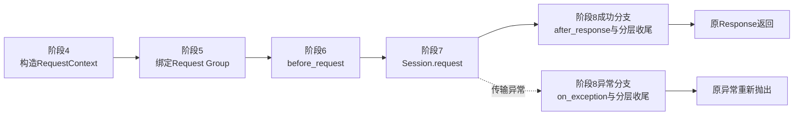
```mermaid
flowchart LR
    A[阶段4<br/>构造RequestContext] --> B[阶段5<br/>绑定Request Group]
    B --> C[阶段6<br/>before_request]
    C --> D[阶段7<br/>Session.request]
    D --> E[阶段8成功分支<br/>after_response与分层收尾]
    D -.传输异常.-> F[阶段8异常分支<br/>on_exception与分层收尾]
    E --> G[原Response返回]
    F --> H[原异常重新抛出]
```

### 0.1 第 6 天已经确定的对象边界

`RequestContext` 的核心字段仍然是：

| 字段 | 本课怎样读取 | 是否直接进入服务协议 |
| --- | --- | --- |
| `method` | 判断 HTTP 动词，供 Middleware 和 Session 共用 | 作为请求方法进入 |
| `path` | 保留模块相对路径身份 | 不直接传给 Session |
| `url` | 完整请求地址，也是日志请求行的输入 | 作为 URL 进入 |
| `kwargs` | 已复制、补 timeout、合并 Header 的真实传输参数 | 通过 `**context.kwargs` 进入 |
| `attach_log` | 控制成功或失败时是否自动附加日志 | 不进入 |
| `request_step_name` | 指定请求侧 Allure 步骤名 | 不进入 |
| `response_step_name` | 指定响应侧 Allure 步骤名 | 不进入 |
| `protocol` | 供运行观察解释 attempt 类型 | 不进入 |
| `attributes` | 保存 Middleware 添加的诊断对象与扩展事实 | 不进入 |

最重要的延续结论是：

> `context.kwargs` 是 Session 将要消费的真实标准化参数；`context.attributes` 是框架侧扩展空间。

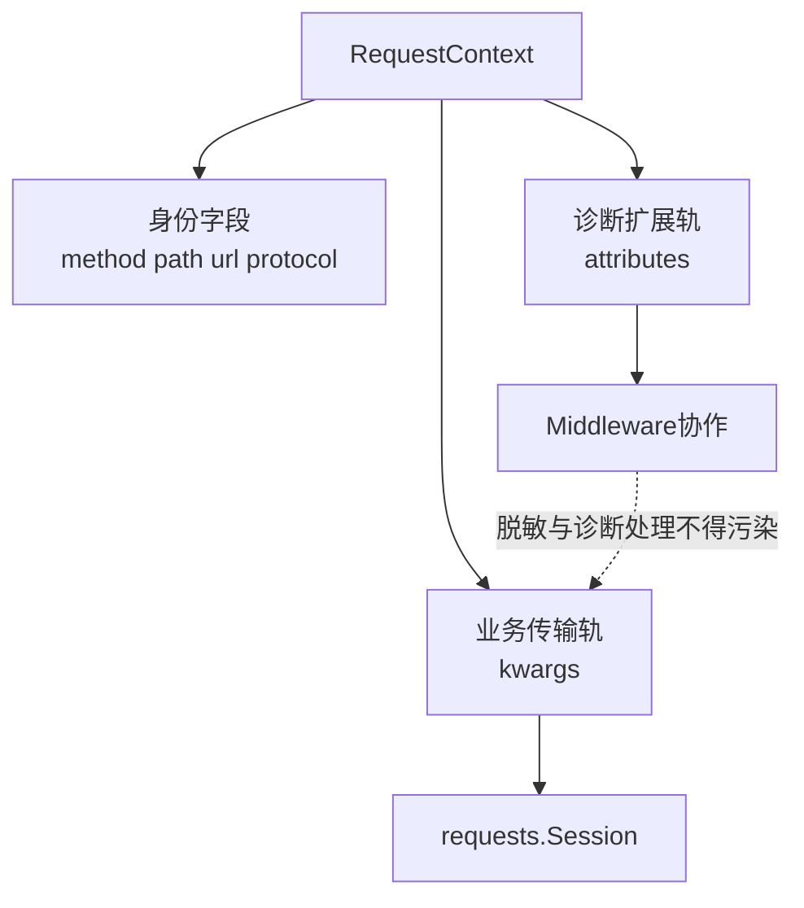
```mermaid
flowchart TB
    C[RequestContext]
    C --> I[身份字段<br/>method path url protocol]
    C --> B[业务传输轨<br/>kwargs]
    C --> D[诊断扩展轨<br/>attributes]
    B --> S[requests.Session]
    D --> M[Middleware协作]
    M -.脱敏与诊断处理不得污染.-> B
```

### 0.2 本课真正增加的一个坐标

第 6 天看到的是：

```text
一个 Context
→ 一组 before 钩子
→ 一次 Session 调用
→ 一组成功或异常钩子
```

第 7 天增加的是：

```text
同一个 Context 中
真实业务参数继续用于发送
同时生成独立的脱敏诊断副本
诊断消费者优先读取副本
```

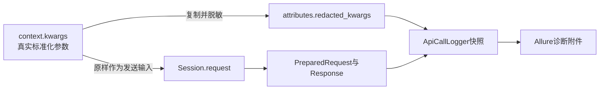
```mermaid
flowchart LR
    K[context.kwargs<br/>真实标准化参数] -->|原样作为发送输入| S[Session.request]
    K -->|复制并脱敏| R[attributes.redacted_kwargs]
    R --> L[ApiCallLogger快照]
    L --> A[Allure诊断附件]
    S --> P[PreparedRequest与Response]
    P --> L
```

这里的“双轨”不是创建两个 HTTP 请求。

它表达的是：

- 业务轨保留真实认证信息、真实载荷和真实媒体 URL。
- 诊断轨尽量保存结构相同但敏感值被替换的副本。
- 两条轨道在内存中并行存在，但只有业务轨进入 Session。
- 诊断轨的目标是降低输出泄露风险，不是改变服务器实际收到的内容。

---

## 1. 第一性原理：为什么不能先脱敏，再拿脱敏结果发请求

### 1.1 HTTP 请求必须保留完成业务所需的真实信息

认证 Header、查询凭据、Body 中的 token 或 password，可能正是服务端验证请求的必要输入。

如果框架为了日志安全，直接把业务对象里的值改成 `<redacted>`，服务端收到的就不再是原请求。

结果会形成一条错误因果链：

```text
为了保护日志
→ 修改真实请求
→ 认证或业务语义改变
→ 服务端拒绝或行为偏离
→ 测试测到的是脱敏器制造的故障
```

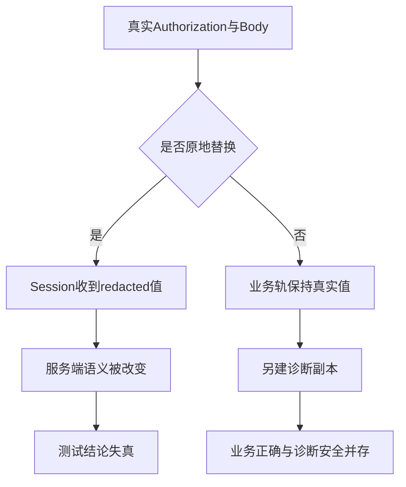
```mermaid
flowchart TD
    A[真实Authorization与Body] --> B{是否原地替换}
    B -->|是| C[Session收到redacted值]
    C --> D[服务端语义被改变]
    D --> E[测试结论失真]
    B -->|否| F[业务轨保持真实值]
    F --> G[另建诊断副本]
    G --> H[业务正确与诊断安全并存]
```

所以，脱敏系统的第一条不变量不是“任何地方都看不到秘密”，而是：

> 脱敏动作不能污染真实业务请求。

### 1.2 真正要隔离的是“用途”，而不只是“变量名”

同一份数据有两个不同用途：

| 用途 | 需要什么 | 允许失真吗 |
| --- | --- | --- |
| 业务发送 | 完整、真实、协议兼容 | 不允许 |
| 诊断展示 | 足够定位问题、尽量不暴露秘密 | 允许敏感值被占位符替代 |

如果只创建一个对象，就会让两个目标争夺同一个状态。

双轨把冲突拆成两个对象：

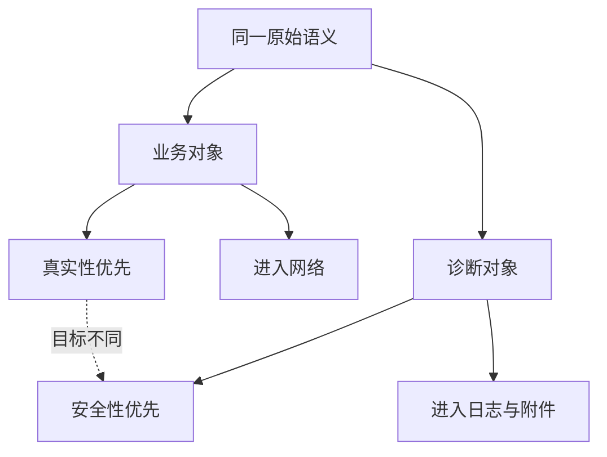
```mermaid
flowchart TB
    X[同一原始语义] --> B[业务对象]
    X --> D[诊断对象]
    B --> B1[真实性优先]
    B --> B2[进入网络]
    D --> D1[安全性优先]
    D --> D2[进入日志与附件]
    B1 -.目标不同.-> D1
```

这也是对象所有权的第一性原理：

- Session 拥有对真实传输参数的消费权。
- Redaction 拥有创建诊断副本的责任。
- Logging 拥有把诊断信息组织成附件的责任。
- Allure 只是接收最终文本，不负责猜测哪些字段敏感。

### 1.3 TOC 视角：系统约束是“最后一个可能输出真实数据的边界”

仅仅证明 `redact_request_kwargs()` 返回了 `<redacted>` 还不够。

因为诊断数据可能经过多条路径：

```text
RequestContext
→ LoggingMiddleware
→ ApiCallLogger
→ PreparedRequest
→ cURL 构建
→ 请求头/请求体附件
→ 响应附件
→ 异常文本附件
```

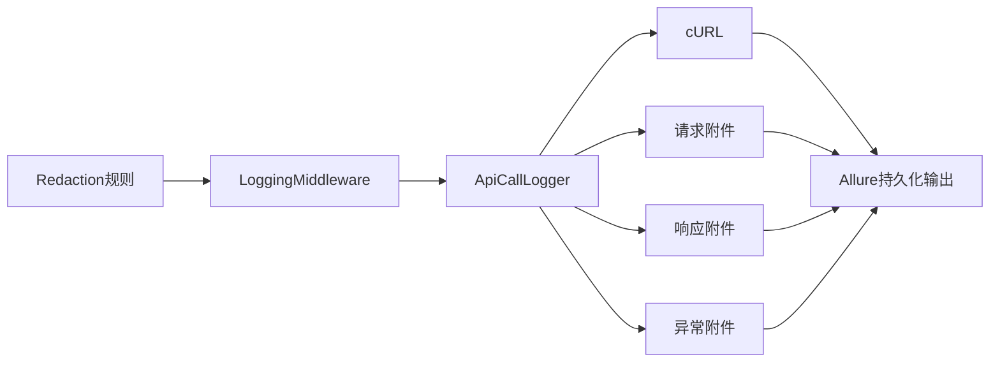
```mermaid
flowchart LR
    R[Redaction规则] --> M[LoggingMiddleware]
    M --> L[ApiCallLogger]
    L --> C[cURL]
    L --> Q[请求附件]
    L --> P[响应附件]
    L --> E[异常附件]
    C --> A[Allure持久化输出]
    Q --> A
    P --> A
    E --> A
```

约束理论提醒我们：

> 安全强度由最弱的输出路径决定，而不是由最早的一次脱敏决定。

因此本课必须分别检查：

1. 真实请求有没有被改写。
2. 诊断副本有没有正确生成。
3. Logging 是否确实消费副本。
4. PreparedRequest、Response 和异常文本是否再次经过对应规则。
5. 哪些格式或字段名不在当前规则覆盖内。

---

## 2. 三层对象：调用者输入、真实 Context 参数、脱敏诊断副本

“双轨”发生在 `RequestContext` 内部，但它前面还有调用者输入。

因此完整对象关系其实有三层。

### 2.1 第一层：调用者传给 BaseRequest 的对象

模块 Request 可能调用：

```python
self.post("/v1/echo", json=payload)
```

这里的 `payload` 仍由调用者持有。

`BaseRequest._build_request_context()` 先调用 `_copy_request_kwargs()`，对每个顶层参数分别尝试 `deepcopy()`。

成功时，后续 Middleware 修改 `context.kwargs` 中的嵌套结构，不会回写调用者的普通 payload。

失败时，源码会保留原值引用，而不是让整个请求构造失败。

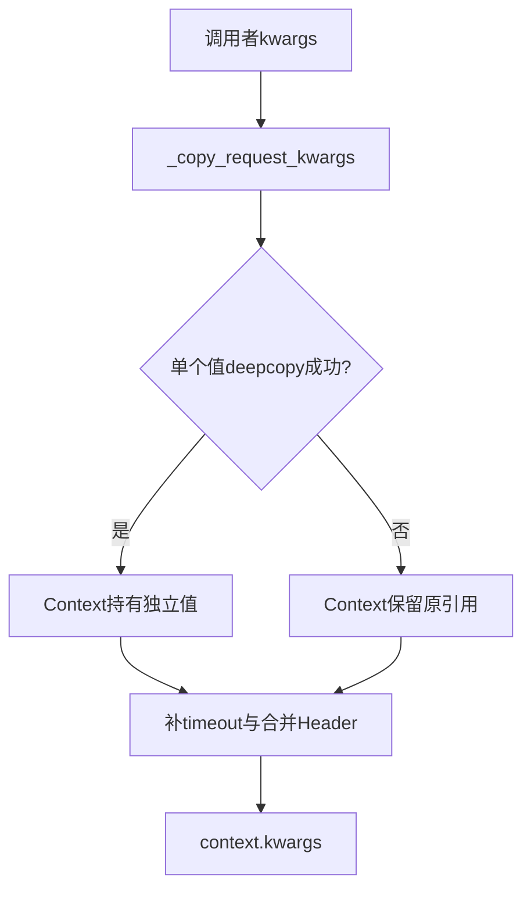
```mermaid
flowchart TD
    A[调用者kwargs] --> B[_copy_request_kwargs]
    B --> C{单个值deepcopy成功?}
    C -->|是| D[Context持有独立值]
    C -->|否| E[Context保留原引用]
    D --> F[补timeout与合并Header]
    E --> F
    F --> G[context.kwargs]
```

所以“Context 深复制”是当前普通容器场景中的强行为，但不是对任意自定义对象的绝对隔离承诺。

### 2.2 第二层：`context.kwargs` 是真实标准化请求轨

构造 Context 时还会发生：

- 生成完整 `url`。
- 为缺失的 `timeout` 补配置默认值。
- 把单次 Header 与 Session Header 合并成新的 Header 字典。
- 保存将传给 `requests.Session.request()` 的标准参数。

随后 `_send()` 直接执行：

```python
self.session.request(
    method=context.method,
    url=context.url,
    **context.kwargs,
)
```

这说明判断某个值是否会进入服务端，最可靠的问题是：

> 它最终是否仍存在于 `context.kwargs`，并被 Session 消费？

### 2.3 第三层：`attributes["redacted_kwargs"]` 是诊断轨

`RedactionMiddleware.before_request()` 只执行一件事：

```python
context.attributes["redacted_kwargs"] = redact_request_kwargs(context.kwargs)
```

它没有：

- 给 `context.kwargs` 重新赋值。
- 修改 `context.kwargs["headers"]`。
- 修改 `context.kwargs["json"]`。
- 改写调用者的 payload。
- 把 `<redacted>` 交给 Session。

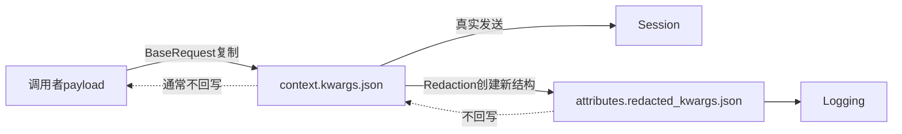
```mermaid
flowchart LR
    A[调用者payload] -->|BaseRequest复制| B[context.kwargs.json]
    B -->|真实发送| S[Session]
    B -->|Redaction创建新结构| D[attributes.redacted_kwargs.json]
    D --> L[Logging]
    D -.不回写.-> B
    B -.通常不回写.-> A
```

### 2.4 三层对象不能混成一句“原始参数”

| 对象 | 是否可能包含真实敏感值 | 谁主要消费 | 当前复制边界 |
| --- | --- | --- | --- |
| 调用者 `payload` | 是 | 模块代码与测试 | Context 构造时逐值尝试深复制 |
| `context.kwargs` | 是 | Middleware 与 Session | 是 attempt 内真实参数 |
| `redacted_kwargs` | 敏感命中项应被替换 | Logging | 由字段分派与递归规则创建 |
| `ApiCallLogger.kwargs` | 期望已脱敏 | ApiCallLogger 自身 | 构造时再次 `deepcopy` |

最后一行尤其重要。

`ApiCallLogger` 并不只是保存传入字典引用，而是再次执行 `deepcopy(kwargs)`。

这进一步隔离日志快照与后续 Context 变化。

但这次 `deepcopy` 没有容错分支；如果传入对象不可复制，Logger 构造会抛异常，并被视为 `before_request` Middleware 失败。

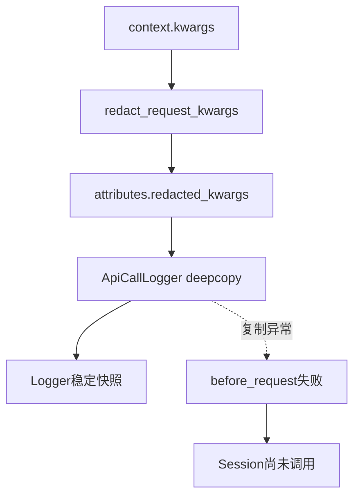
```mermaid
flowchart TB
    C[context.kwargs] --> R[redact_request_kwargs]
    R --> A[attributes.redacted_kwargs]
    A --> D[ApiCallLogger deepcopy]
    D --> L[Logger稳定快照]
    D -.复制异常.-> X[before_request失败]
    X --> N[Session尚未调用]
```

---

## 3. RequestMiddleware 合同：三个钩子，不是一个装饰器

先回答“BaseRequest 允许 Middleware 在哪些时刻介入”。打开 `common/request_middleware.py` 中的 `RequestMiddleware`，可以直接看到三个协作入口。下面的 `...` 是 Protocol 在真实源码中的方法体，不是课程省略的实现：

```python
class RequestMiddleware(Protocol):
    def before_request(self, context: RequestContext) -> None:
        ...

    def after_response(self, context: RequestContext, response: requests.Response) -> None:
        ...

    def on_exception(self, context: RequestContext, error: BaseException) -> None:
        ...
```

三个方法都接收同一个 attempt 的 `RequestContext`，但只有结果阶段额外接收 Response 或异常。Protocol 只规定调用形状，不决定执行顺序，也不拥有 Response 和异常的终态；要回答“哪个钩子何时被调用”，必须继续进入 `BaseRequest._send()`。

### 3.1 三个时刻各自能看到什么

| 钩子 | 已经存在的对象 | 还不存在的对象 | 适合承担的职责 |
| --- | --- | --- | --- |
| `before_request` | Context、真实 kwargs、attributes | Response、传输异常 | 观察开始、生成副本、创建 Logger、触发前置资源 |
| `after_response` | Context、Response | 传输异常 | 记录成功、附加请求与响应诊断 |
| `on_exception` | Context、原传输异常 | Response | 记录失败、附加异常诊断 |

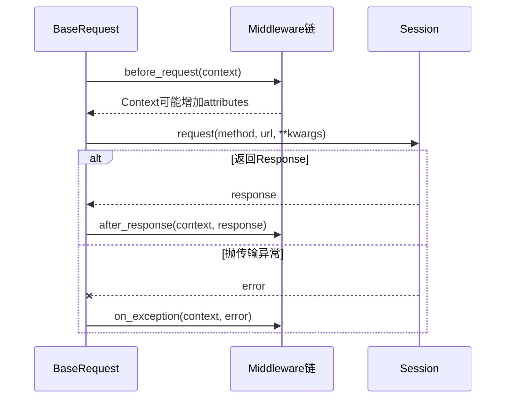
```mermaid
sequenceDiagram
    participant B as BaseRequest
    participant M as Middleware链
    participant S as Session
    B->>M: before_request(context)
    M-->>B: Context可能增加attributes
    B->>S: request(method, url, **kwargs)
    alt 返回Response
        S-->>B: response
        B->>M: after_response(context, response)
    else 抛传输异常
        S--xB: error
        B->>M: on_exception(context, error)
    end
```

### 3.2 `after_response` 与 `on_exception` 不是 finally 对称钩子

当前问题是“成功与异常为什么不会同时进入两个结果钩子”。打开 `common/base_request.py` 中的 `_send()`；这段实现完整保留了钩子、Session、异常和返回顺序：

```python
def _send(self, context: RequestContext) -> requests.Response:
    self._run_before_middlewares(context)

    try:
        response = self.session.request(
            method=context.method,
            url=context.url,
            **context.kwargs,
        )
    except Exception as error:
        self._run_exception_middlewares(context, error)
        raise

    self._run_after_middlewares(context, response)
    return response
```

输入是已经标准化的 Context。before 阶段可能扩展 `context.attributes`，但 Session 仍读取 `context.method`、`context.url` 和真实 `context.kwargs`。Session 返回时，Response 进入 after 阶段并继续返回；Session 抛异常时，异常进入 exception 阶段后由裸 `raise` 重新抛出。`_send()` 负责调用顺序，不负责把 HTTP 状态码解释成业务成功。

因此：

- `before_request` 自己失败时，不会进入 `on_exception`。
- Session 抛异常时，进入 `on_exception`。
- `after_response` 自己失败时，也不会进入 `on_exception`。
- HTTP 4xx 或 5xx 只要 Session 返回了 `Response`，仍然走 `after_response`。

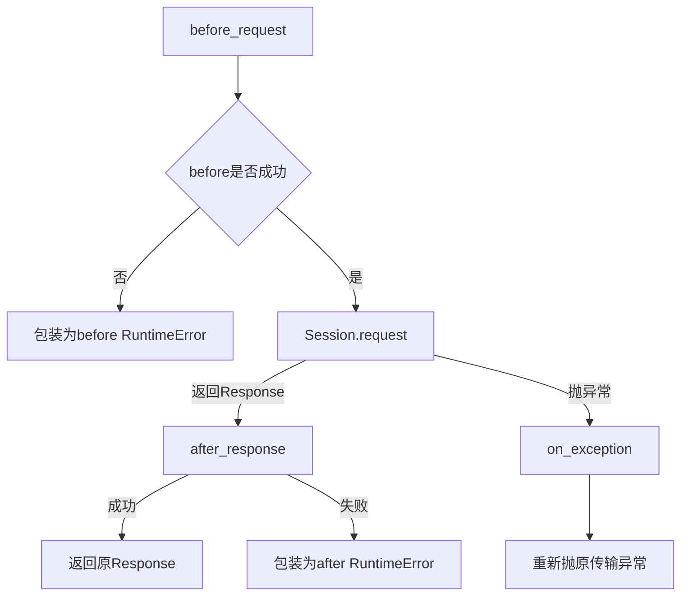
```mermaid
flowchart TD
    B[before_request] --> C{before是否成功}
    C -->|否| BX[包装为before RuntimeError]
    C -->|是| S[Session.request]
    S -->|返回Response| A[after_response]
    S -->|抛异常| E[on_exception]
    A -->|成功| R[返回原Response]
    A -->|失败| AX[包装为after RuntimeError]
    E --> O[重新抛原传输异常]
```

### 3.3 三阶段都按注册顺序正向遍历

接下来要确认“Middleware 是按栈逆序退出，还是始终按注册顺序广播”。先看 `BaseRequest._run_before_middlewares()`：

```python
def _run_before_middlewares(self, context: RequestContext) -> None:
    for middleware in self.middlewares:
        try:
            middleware.before_request(context)
        except Exception as error:
            raise RuntimeError(
                f"Request middleware {type(middleware).__name__} failed in before_request"
            ) from error
```

输入是注册完成的 `self.middlewares` 与当前 Context。循环按列表顺序调用 before；任一调用失败就包装异常并终止，既不会继续下一个 Middleware，也不会进入 Session。`_run_after_middlewares()` 使用相同的正向循环结构，因此不存在成功时正序、离开时逆序的栈式规则。异常阶段为何仍正序但保留原传输异常，将在第5节继续展开。

如果注册顺序是 `one, two`，测试证明成功事件为：

```text
one.before
two.before
send
one.after
two.after
```

异常事件为：

```text
one.before
two.before
send
one.exception
two.exception
```

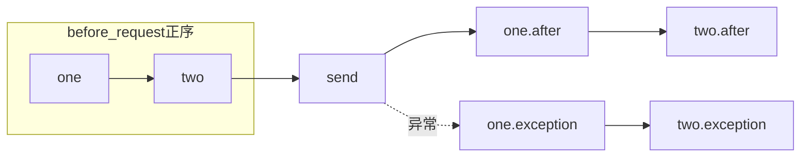
```mermaid
flowchart LR
    subgraph Before[before_request正序]
        B1[one] --> B2[two]
    end
    B2 --> S[send]
    S --> A1[one.after]
    A1 --> A2[two.after]
    S -.异常.-> E1[one.exception]
    E1 --> E2[two.exception]
```

这条顺序事实决定了 Redaction 必须位于 Logging 之前。

---

## 4. 默认 Middleware：顺序本身就是协作合同

现在要确定 Redaction 与 Logging 的先后关系是不是课程约定，而是真实注册顺序。打开 `common/request_middleware.py` 中的 `default_request_middlewares()`：

```python
def default_request_middlewares(
    capture_policy: CapturePolicy = DEFAULT_CAPTURE_POLICY,
) -> list[RequestMiddleware]:
    middlewares: list[RequestMiddleware] = [
        RuntimeObservationMiddleware(),
        MediaResourceMiddleware(capture_policy),
        RedactionMiddleware(),
        LoggingMiddleware(),
    ]
    return middlewares
```

输入是 Capture 使用的策略，输出是一份新列表和四个新 Middleware 实例。函数只拥有默认链的构造与顺序，不执行任何钩子。由于 BaseRequest 正向遍历列表，Redaction 会先生成诊断副本，Logging 随后才能消费它；下一步需要进入两个 before 函数确认这次状态交接。

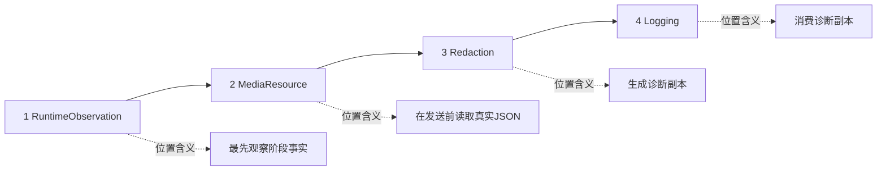
```mermaid
flowchart LR
    O[1 RuntimeObservation] --> M[2 MediaResource]
    M --> R[3 Redaction]
    R --> L[4 Logging]
    O -.位置含义.-> O1[最先观察阶段事实]
    M -.位置含义.-> M1[在发送前读取真实JSON]
    R -.位置含义.-> R1[生成诊断副本]
    L -.位置含义.-> L1[消费诊断副本]
```

### 4.1 四个默认职责只在各自边界内成立

| Middleware | `before_request` | `after_response` | `on_exception` |
| --- | --- | --- | --- |
| `RuntimeObservationMiddleware` | 调用 `observe_request_started(context)` | 调用 `observe_request_succeeded(context, response)` | 调用 `observe_request_failed(context, error)` |
| `MediaResourceMiddleware` | 仅 POST 时把 `context.kwargs.get("json")` 与 CapturePolicy 交给资源入口 | 无动作 | 无动作 |
| `RedactionMiddleware` | 写入 `attributes["redacted_kwargs"]` | 无动作 | 无动作 |
| `LoggingMiddleware` | 创建 `ApiCallLogger` 并写入 attributes | 按 `attach_log` 附加成功诊断 | 按 `attach_log` 附加失败诊断 |

本课不展开 RuntimeObservation 后面的 Provider、指标或归并机制。

本课也不展开 MediaResource 入口之后的资源内部生命周期。

这里只保留两个顺序事实：

- RuntimeObservation 位于默认链第一位。
- MediaResource 在 Redaction 之前读取真实业务 JSON。

### 4.2 默认 before 阶段的对象变化

先看 `RedactionMiddleware.before_request()` 如何建立第二条数据轨：

```python
def before_request(self, context: RequestContext) -> None:
    context.attributes[self.REDACTED_KWARGS_ATTR] = redact_request_kwargs(context.kwargs)
```

输入是将要交给 Session 的真实 `context.kwargs`。`redact_request_kwargs()` 返回另一份诊断字典，before 函数只把它写入 `context.attributes["redacted_kwargs"]`，没有把返回值写回 `context.kwargs`。因此网络发送轨仍保留真实值，诊断轨获得新的副本。

诊断副本生成后，下一个问题是 Logging 是否真的读取这份副本。继续看 `LoggingMiddleware.before_request()`：

```python
def before_request(self, context: RequestContext) -> None:
    logger_kwargs = context.attributes.get(RedactionMiddleware.REDACTED_KWARGS_ATTR, context.kwargs)
    context.attributes[self.LOGGER_ATTR] = ApiCallLogger(
        context.method,
        context.url,
        logger_kwargs,
        step_name=context.request_step_name,
        response_step_name=context.response_step_name,
    )
```

它先尝试读取 `redacted_kwargs`，缺失时才回退到真实 kwargs，然后创建 Logger 并写入 `context.attributes["api_call_logger"]`。输出是一个供结果阶段复用的 Logger 对象，不是新的网络参数。这个回退分支也说明：Logging 可以脱离默认链单独使用，但那时不能再假设 Logger 输入已经脱敏。

至此，四个 before 钩子按正序作用于同一个 Context：

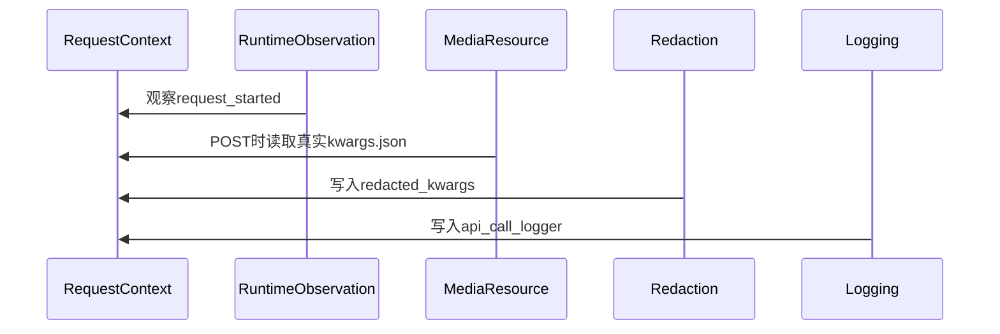
```mermaid
sequenceDiagram
    participant C as RequestContext
    participant O as RuntimeObservation
    participant M as MediaResource
    participant R as Redaction
    participant L as Logging
    O->>C: 观察request_started
    M->>C: POST时读取真实kwargs.json
    R->>C: 写入redacted_kwargs
    L->>C: 写入api_call_logger
```

在 Session 真正发送前，Context 里至少可能出现：

| 位置 | 内容 | 是否用于网络发送 |
| --- | --- | --- |
| `context.kwargs` | 真实 Header、Body、params、timeout 等 | 是 |
| `context.attributes["redacted_kwargs"]` | 诊断副本 | 否 |
| `context.attributes["api_call_logger"]` | Logger 对象 | 否 |

MediaResource 的直接副作用可能已经被触发，但它没有把自己的返回值写入 Context，也不改变 `session.request()` 的参数。

### 4.3 默认成功与异常阶段仍然正序

成功时：

```text
RuntimeObservation.after_response
→ MediaResource.after_response 空操作
→ Redaction.after_response 空操作
→ Logging.after_response
```

传输异常时：

```text
RuntimeObservation.on_exception
→ MediaResource.on_exception 空操作
→ Redaction.on_exception 空操作
→ Logging.on_exception
```

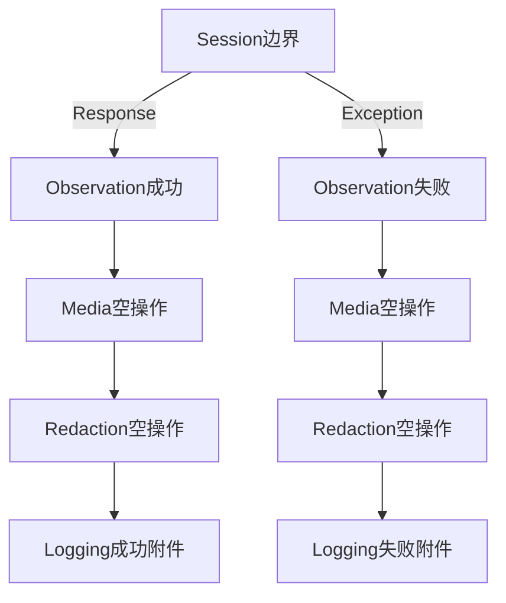
```mermaid
flowchart TB
    S[Session边界]
    S -->|Response| A1[Observation成功]
    A1 --> A2[Media空操作]
    A2 --> A3[Redaction空操作]
    A3 --> A4[Logging成功附件]
    S -->|Exception| E1[Observation失败]
    E1 --> E2[Media空操作]
    E2 --> E3[Redaction空操作]
    E3 --> E4[Logging失败附件]
```

这不是“离开时逆序撤销”的资源栈。

Middleware 链在当前实现中是同序广播。

### 4.4 默认链可以被完全替换

`BaseRequest.__init__()` 的判断是：

```text
middlewares is None
→ 使用默认四件套

middlewares 是显式列表
→ 原样复制该列表
```

因此显式传入 `middlewares=[]` 会关闭全部默认 Middleware。

这意味着：

- 不再自动生成 `redacted_kwargs`。
- 不再自动创建 `ApiCallLogger`。
- 不再自动触发默认资源入口。
- 不再经过默认运行观察 Middleware。

“框架拥有脱敏能力”不等于“任意自定义 Middleware 配置都自动安全”。

---

## 5. 失败语义：不是所有 Middleware 故障都 fail-open

### 5.1 `before_request` 与 `after_response` 都是 fail-fast

每个 before 或 after 调用都被单独捕获，并包装为带 Middleware 类型名和阶段名的 `RuntimeError`。

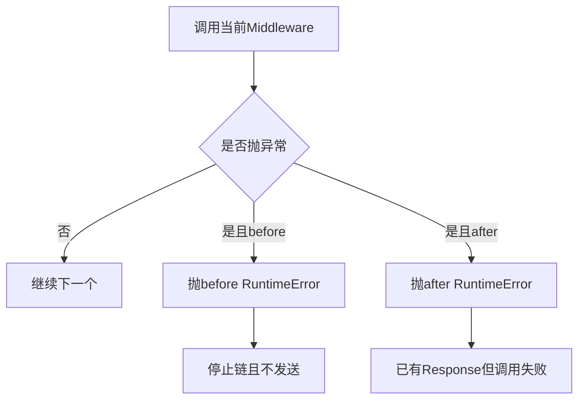
```mermaid
flowchart TD
    A[调用当前Middleware] --> B{是否抛异常}
    B -->|否| C[继续下一个]
    B -->|是且before| D[抛before RuntimeError]
    B -->|是且after| E[抛after RuntimeError]
    D --> F[停止链且不发送]
    E --> G[已有Response但调用失败]
```

所以：

- Redaction before 失败会阻止网络请求。
- Logging before 失败会阻止网络请求。
- Logging after 附件失败会让本来已经返回 Response 的调用改以 `RuntimeError` 结束。
- before 或 after 失败不会自动转入 `on_exception`。

这说明诊断能力虽然不应修改业务请求内容，却仍可能通过异常副作用改变调用结果。

### 5.2 只有 `on_exception` 的附加故障采用“保留原异常”策略

当 Session 抛出原传输异常后，需要回答“某个异常钩子再次失败，会不会覆盖最初故障”。打开 `common/base_request.py` 中的 `_run_exception_middlewares()`：

```python
def _run_exception_middlewares(self, context: RequestContext, request_error: BaseException) -> None:
    middleware_errors: list[RuntimeError] = []
    for middleware in self.middlewares:
        try:
            middleware.on_exception(context, request_error)
        except Exception as error:
            middleware_errors.append(
                RuntimeError(
                    f"Request middleware {type(middleware).__name__} failed in on_exception"
                )
            )
            middleware_errors[-1].__cause__ = error
    if middleware_errors:
        context.attributes["middleware_exception_errors"] = middleware_errors
        for middleware_error in middleware_errors:
            request_error.add_note(str(middleware_error))
```

输入是当前 Context 和 Session 抛出的原异常。循环仍按注册顺序调用全部异常钩子；钩子的普通异常被包装并暂存，不中断后续钩子。遍历完成后，二次错误进入 `context.attributes`，说明文字进入原异常 note。这个函数不抛出包装错误，也不替换 `request_error`；控制权回到 `_send()` 后，裸 `raise` 重新抛出原异常对象。

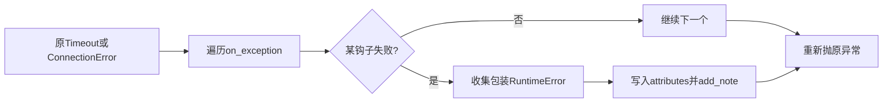
```mermaid
flowchart LR
    T[原Timeout或ConnectionError] --> E[遍历on_exception]
    E --> B{某钩子失败?}
    B -->|否| N[继续下一个]
    B -->|是| W[收集包装RuntimeError]
    W --> A[写入attributes并add_note]
    N --> R[重新抛原异常]
    A --> R
```

`tests/test_base_request_middleware.py` 还验证了最终异常对象与 Session 抛出的对象是同一个实例。

准确表述应当是：

> 异常钩子的二次故障不会隐藏原传输异常；这不代表整个 Middleware 系统普遍 fail-open。

### 5.3 顺序错位会削弱脱敏保证

`LoggingMiddleware.before_request()` 的读取规则是：

```python
context.attributes.get("redacted_kwargs", context.kwargs)
```

即：

- 有 `redacted_kwargs` 时，优先消费诊断副本。
- 没有时，回退到真实 `context.kwargs`。

因此以下配置都削弱安全合同：

- 只注册 `LoggingMiddleware`。
- 把 Logging 放在 Redaction 前面。
- 自定义 Redaction 没有写入约定属性名。
- Redaction 被显式禁用。

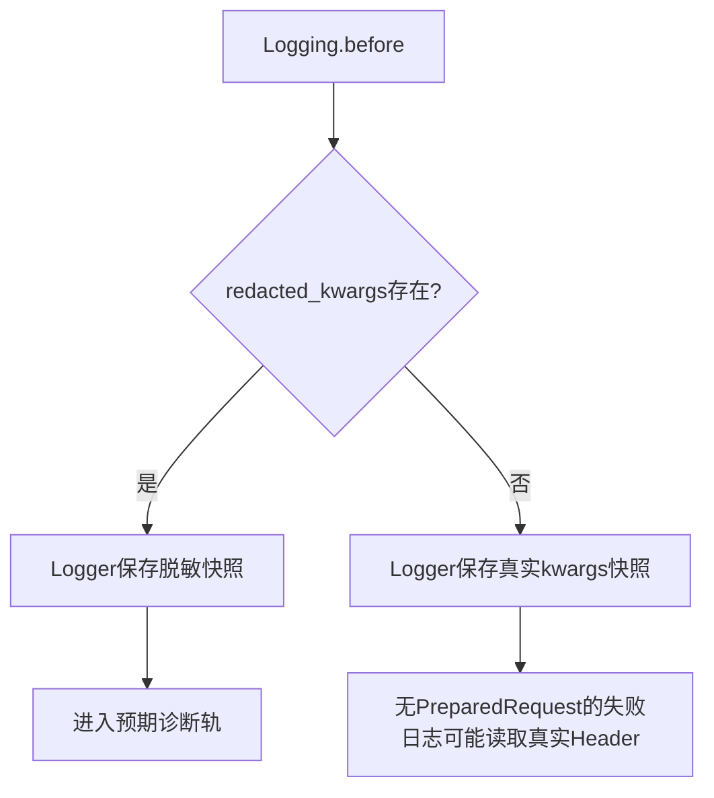
```mermaid
flowchart TD
    L[Logging.before] --> C{redacted_kwargs存在?}
    C -->|是| S[Logger保存脱敏快照]
    C -->|否| R[Logger保存真实kwargs快照]
    R --> X[无PreparedRequest的失败日志可能读取真实Header]
    S --> Y[进入预期诊断轨]
```

默认顺序不是美观排序，而是数据依赖排序。

---

## 6. Redaction 规则：按数据形态分派，而不是对任意字符串施魔法

### 6.1 请求 kwargs 的四路分派

`RedactionMiddleware.before_request()` 已把真实 kwargs 交给 `redact_request_kwargs()`，现在需要确认它怎样生成副本而不是原地改写。打开 `util/redaction.py` 中的函数：

```python
def redact_request_kwargs(kwargs: Mapping[str, Any]) -> dict[str, Any]:
    redacted: dict[str, Any] = {}
    for name, value in kwargs.items():
        lowered_name = name.lower()
        if lowered_name == "headers":
            redacted[name] = redact_headers(value)
        elif lowered_name in {"params", "json", "data"}:
            redacted[name] = redact_sensitive_data(value)
        elif _is_sensitive_key(name):
            redacted[name] = REDACTED_VALUE
        else:
            redacted[name] = _safe_copy(value)
    return redacted
```

输入是只读视角的 `Mapping`，输出是新建的 `redacted` 字典。函数按顶层参数名把 Header、结构化参数、顶层敏感键和普通字段交给不同规则；它不写回输入 Mapping。责任到“为每个顶层值选择处理器并组装诊断副本”为止，Header 和 Body 内部如何递归处理由下游辅助函数拥有。

顶层敏感键集合按不区分大小写匹配：

```text
api_key, key, token, access_token, refresh_token,
secret, password, authorization
```

普通值通过 `_safe_copy()` 尝试深复制；复制失败时保留原引用。

因此“新建了顶层字典”不等于“任意嵌套自定义对象都已经完全隔离”。

### 6.2 Header 与 URL 的安全边界

默认敏感 Header 名称为：

```text
Authorization
Cookie
Proxy-Authorization
Set-Cookie
X-Api-Key
```

名称匹配不区分大小写，命中值替换为 `<redacted>`。

非空 Header 映射会被转换并生成新字典；空值会直接返回原空值。

URL 只处理 query 中命中敏感键集合的参数。

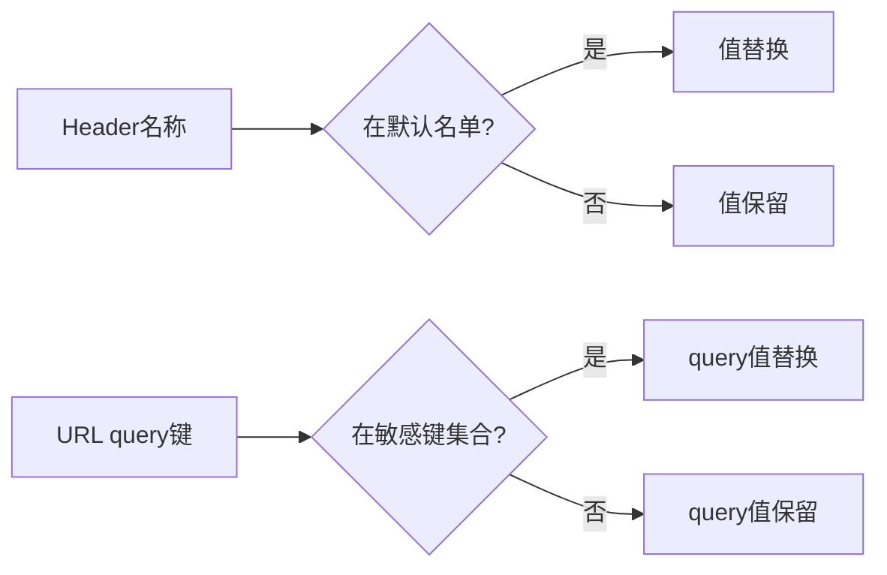
```mermaid
flowchart LR
    H[Header名称] --> HC{在默认名单?}
    HC -->|是| HR[值替换]
    HC -->|否| HP[值保留]
    U[URL query键] --> UC{在敏感键集合?}
    UC -->|是| UR[query值替换]
    UC -->|否| UP[query值保留]
```

当前规则不会自动覆盖：

- 自定义认证 Header，例如 `X-Auth-Token`。
- 把秘密放进 URL path 的设计。
- 名称不在集合中的 query 参数。
- 非敏感 Header 值内部偶然包含的秘密。

### 6.3 结构化 Body 与文本 Body 的边界不同

`redact_request_kwargs()` 会把 `params`、`json` 和 `data` 交给 `redact_sensitive_data()`。要理解嵌套字段为何能被处理，需要继续进入这个递归分派函数：

```python
def redact_sensitive_data(value: Any) -> Any:
    if isinstance(value, Mapping):
        return {
            key: REDACTED_VALUE if _is_sensitive_key(key) else redact_sensitive_data(item)
            for key, item in value.items()
        }

    if isinstance(value, list):
        return [_redact_sequence_item(item) for item in value]

    if isinstance(value, tuple):
        return tuple(_redact_sequence_item(item) for item in value)

    if isinstance(value, str):
        return redact_text_body(value)

    return _safe_copy(value)
```

输入可以是任意值，输出按数据形态重新构造。Mapping 会递归检查键；list 与 tuple 会递归处理元素，并识别形如二元键值对的敏感项；其他对象只尝试安全复制。函数不承担“发现任意文本秘密”的责任，字符串会继续交给更窄的 `redact_text_body()` 规则。

字符串 Body 的规则更窄：

- 看起来像 JSON 时，解析成功后递归脱敏。
- 可解析为表单键值对且存在敏感键时，替换对应值。
- 其他普通文本原样返回。
- 看起来像 JSON 但解析失败时，也会原样返回。

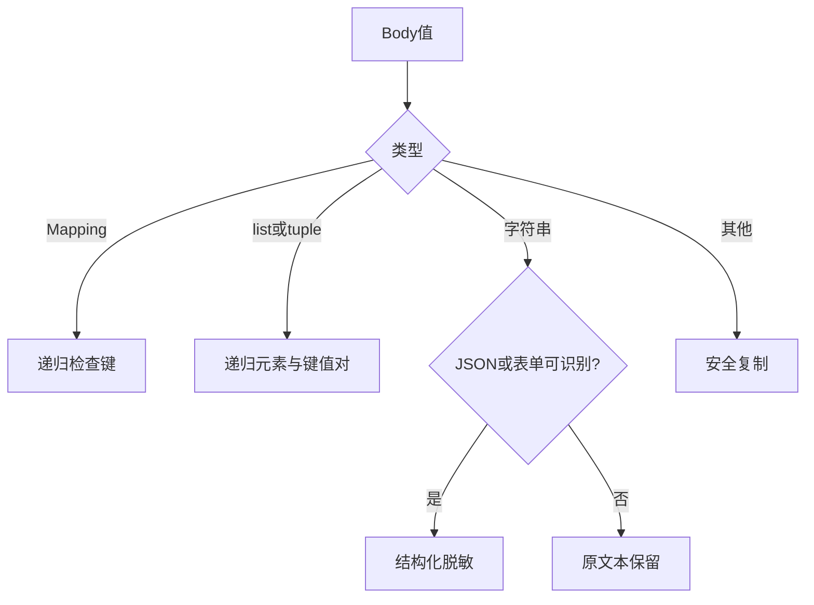
```mermaid
flowchart TD
    B[Body值] --> T{类型}
    T -->|Mapping| M[递归检查键]
    T -->|list或tuple| L[递归元素与键值对]
    T -->|字符串| S{JSON或表单可识别?}
    T -->|其他| C[安全复制]
    S -->|是| R[结构化脱敏]
    S -->|否| P[原文本保留]
```

所以当前实现能证明“规则命中的 JSON 与表单字段被处理”，不能证明“任意编码或任意自然语言中的秘密都会被发现”。

### 6.4 异常文本使用额外的模式替换

结构化请求已经有明确键名，但异常通常只有一段字符串。打开 `util/api_call_logger.py` 中的 `_format_error_text_value()`，可以看到异常附件使用的处理顺序：

```python
def _format_error_text_value(self, value: str) -> str:
    return self._truncate(redact_text_body(redact_urlencoded_text(value)))
```

输入是从异常或重试记录得到的文本。`redact_urlencoded_text()` 先处理表单与有限文本模式，`redact_text_body()` 再尝试 JSON 或表单 Body 规则，最后 `_truncate()` 控制附件容量。输出只是新的诊断字符串，不会改写原异常对象。

前者除了表单键值对，还使用有限正则处理：

- `api_key=...`、`token='...'` 等赋值文本。
- `Authorization: ...`、`Cookie: ...` 等 Header 风格文本。

```mermaid
flowchart LR
    E[str(error)] --> U[表单与文本模式替换]
    U --> J[JSON或表单Body规则]
    J --> T[最长50000字符]
    T --> A[异常附件文本]
```

这只净化写入该附件的字符串副本。

原异常对象不会被改写，BaseRequest 仍重新抛出原异常；因此 pytest 捕获、控制台 traceback 或其他日志通道不自动继承这次脱敏。

---

## 7. Logging、cURL 与 Allure：诊断边界要逐层看

### 7.1 Logger 在发送前创建，在结果确定后附加

`LoggingMiddleware.before_request()` 创建 `ApiCallLogger`，保存 method、URL、诊断 kwargs、步骤名和开始时间。

要确认 Logger 保存的是引用还是快照，继续进入 `util/api_call_logger.py` 中的构造函数：

```python
def __init__(
    self,
    method: str,
    url: str,
    kwargs: dict[str, Any],
    step_name: str = API_REQUEST_STEP_NAME,
    response_step_name: str = API_RESPONSE_STEP_NAME,
):
    self.method = method.upper()
    self.url = url
    self.kwargs = deepcopy(kwargs)
    self.step_name = step_name
    self.response_step_name = response_step_name
    self.started_perf = time.perf_counter()
```

输入是 Logging Middleware 选出的诊断 kwargs，而不是固定读取真实 `context.kwargs`。构造函数深复制这份字典，并记录步骤名与开始时间，因此后续附件拥有发送前诊断快照。这里的 `deepcopy()` 没有回退分支；复制失败会让 Logger 构造失败，并按 before 阶段的 fail-fast 规则阻止请求发送。

请求成功后，`LoggingMiddleware.after_response()` 决定是否输出成功附件：

```python
def after_response(self, context: RequestContext, response: requests.Response) -> None:
    if not context.attach_log:
        return
    self.get_logger(context).attach_success(response)
```

输入是同一个 Context 和 Session 返回的 Response。`attach_log=False` 时函数直接结束，不改写 Response；开启时从 Context 取回 before 阶段创建的 Logger，并把 Response 交给成功格式化入口。Middleware 只负责开关和转交，不拥有附件内部的脱敏规则。

传输异常时使用并列的失败入口：

```python
def on_exception(self, context: RequestContext, error: BaseException) -> None:
    if not context.attach_log:
        return
    self.get_logger(context).attach_failure(error)
```

输入从 Response 换成原传输异常，开关语义不变。由此可见，`attach_log=False` 只让成功和异常钩子跳过自动附件，不会阻止 Logger 创建，也不会阻止请求发送。

```mermaid
sequenceDiagram
    participant B as BaseRequest
    participant R as Redaction
    participant L as Logging
    participant S as Session
    participant A as Allure
    R->>L: redacted_kwargs已存在
    L->>L: 创建Logger快照
    L-->>B: Logger保存到Context
    B->>S: 业务轨继续发送
    alt attach_log为true
        S-->>L: Response或Exception
        L->>A: 附加诊断文本
    else attach_log为false
        S-->>L: Response或Exception
        L-->>L: 跳过自动附件
    end
```

### 7.2 成功附件优先读取真实 PreparedRequest，再分别脱敏

Middleware 把 Response 交给 Logger 后，下一问题是“成功诊断使用发送前快照，还是实际准备后的请求”。打开 `ApiCallLogger.attach_success()`：

```python
def attach_success(self, response: requests.Response) -> None:
    self._attach_parts(
        self.step_name,
        self._request_parts(response.request),
        (REQUEST_CURL_ATTACHMENT_NAME, "请求行", "请求头", "请求体"),
    )
    self._attach_parts(self.response_step_name, self._response_parts(response), ("响应行", "响应头", "响应体"))
```

输入是 Session 返回的 Response。请求侧明确读取 `response.request`，响应侧读取 Response 本身，两组格式化结果分别交给 `_attach_parts()`。该函数负责组织请求与响应附件，不修改 Response，也不决定业务结果。

成功时，Logger 从 `response.request` 读取实际准备后的请求，并分别处理：

- 请求 URL：`redact_url()`。
- 请求 Header：`redact_headers()`。
- 请求 Body：JSON 或表单规则。
- cURL：`build_curl(prepared_request)`。
- 响应 Header：`redact_headers(response.headers)`。
- 响应 Body：JSON 时递归脱敏，非 JSON 文本原样截断。

```mermaid
flowchart TB
    P[PreparedRequest] --> U[脱敏URL]
    P --> H[脱敏Header]
    P --> B[按Body格式脱敏]
    P --> C[构建cURL]
    R[Response] --> RH[脱敏响应Header]
    R --> RB[JSON响应递归脱敏]
    U --> A[Allure请求步骤]
    H --> A
    B --> A
    C --> A
    RH --> Z[Allure响应步骤]
    RB --> Z
```

PreparedRequest 是“实际准备后的请求证据”，但仍必须经过输出侧脱敏。

Logger 构造时拿到脱敏 kwargs，并不意味着后续 PreparedRequest 可以直接裸输出。

### 7.3 无 PreparedRequest 的失败路径依赖 before 阶段快照

成功路径能从 Response 取得 PreparedRequest，但连接建立前的失败可能没有这个对象。打开 `ApiCallLogger.attach_failure()`，观察它如何把异常转换成请求与响应两组诊断：

```python
def attach_failure(self, error: BaseException) -> None:
    self._attach_parts(
        self.step_name,
        self._request_parts(self._request_from_error(error)),
        (REQUEST_CURL_ATTACHMENT_NAME, "请求行", "请求头", "请求体"),
    )
    self._attach_parts(
        self.response_step_name,
        {
            "响应行": "<no response>",
            "响应头": "<empty>",
            "响应体": "\n".join(
                [
                    f"异常类型: {type(error).__name__}",
                    f"异常内容: {self._format_error_text(error)}",
                ]
            ),
        },
        ("响应行", "响应头", "响应体"),
    )
```

输入是原异常。请求侧先尝试从异常提取 PreparedRequest，再统一交给 `_request_parts()`；响应侧明确生成 `<no response>`，并把异常文本交给前面已经阅读过的脱敏格式化入口。输出仍是附件副作用，原异常对象没有被替换，随后继续由 BaseRequest 向上抛出。

如果异常对象带有 `requests.PreparedRequest`，失败日志沿用实际请求的 URL、Header、Body 与 cURL 处理。

如果异常没有 request：

- method 与 URL 来自 Logger 构造参数。
- Header 来自 `self.kwargs["headers"]`。
- Body 从 Logger kwargs 的 `json` 或 `data` 回退生成。
- cURL 标记为不可用。

```mermaid
flowchart TD
    E[RequestException] --> Q{包含PreparedRequest?}
    Q -->|是| P[从实际请求生成并脱敏]
    Q -->|否| F[从Logger快照回退]
    F --> C{快照来自Redaction?}
    C -->|是| S[预期安全副本]
    C -->|否| R[可能包含真实Header]
```

这再次说明默认链中 Redaction 在 Logging 前面不是可选优化。

### 7.4 cURL 是可复制的诊断文本，不是天然安全格式

`build_curl()` 默认会：

- 脱敏 URL query 中的已知敏感键。
- 脱敏默认 Header 名单。
- 对 JSON 与表单 Body 使用相应规则。
- 对 shell 单引号做转义。

但它公开允许调用者传入 `redact_headers=set()`，测试也证明此时 Authorization 会原样进入 cURL。

Shell 转义只保证命令文本结构，不提供保密性。

### 7.5 Allure 是最终输出边界，不是补救边界

最后需要找到文本真正离开 Python 对象、进入报告的位置。打开 `ApiCallLogger._attach_parts()`：

```python
def _attach_parts(
    self,
    step_name: str,
    parts: dict[str, str],
    attachment_names: tuple[str, ...],
) -> None:
    with allure.step(step_name):
        for name in attachment_names:
            allure.attach(
                parts.get(name) or "<empty>",
                name=name,
                attachment_type=AttachmentType.TEXT,
            )
```

输入是已经格式化的 `parts` 和明确的附件顺序。函数只创建 Allure step 并逐项附加文本；它没有再次调用通用脱敏器。因此，上游传入什么文本，这里就持久化什么文本，缺失值只替换为 `<empty>`。

`ApiCallLogger` 在请求步骤下附加 cURL、请求行、请求头、请求体，在响应步骤下附加响应行、响应头、响应体。

每段文本最长保留 50000 字符。

截断是容量控制，不是脱敏规则：

- 秘密位于前 50000 字符时仍可能泄露。
- 秘密恰好位于截断后面只是偶然未输出。
- 非 JSON 响应正文没有通用敏感词扫描。
- 未命中的字段名不会因为进入 Allure 而自动变安全。

```mermaid
flowchart LR
    D[诊断对象] --> F[格式化与脱敏]
    F --> T[长度截断]
    T --> A[Allure附件]
    A --> P[持久化报告数据]
    X[未知字段或未知编码] -.可能穿透.-> F
```

正确边界是：

> Allure 接收的是上游决定输出的文本；它不会替框架补齐遗漏的敏感字段规则。

---

## 8. 对象、状态、副作用与证据边界总表

| 结论 | 主要对象或状态 | 直接副作用 | 证据能证明到哪里 |
| --- | --- | --- | --- |
| Middleware 三阶段正序 | `self.middlewares` | 依次调用钩子 | 顺序测试证明 before、after、exception 都按注册顺序 |
| 脱敏不污染业务轨 | `context.kwargs` 与 `redacted_kwargs` | attributes 新增诊断副本 | 单元测试证明已列 Header、params、JSON 嵌套键；离线管线证明 payload 值与服务端回显保持原样 |
| 真实 Header 仍用于业务 | Session Header 与 Context Header | Session 发送真实 Authorization | 离线管线证明 Session Header 未被覆盖；该测试没有检查所有附件 |
| 异常钩子不覆盖原异常 | 原传输异常与 `middleware_exception_errors` | 添加 note、保存二次错误 | 测试证明重新抛出同一异常实例 |
| Logging 自动附件可关闭 | `attach_log` 与 Logger | 跳过 success/failure attach | 测试证明请求仍发送、Logger 仍创建、自动附件为空 |
| cURL 默认脱敏 | PreparedRequest | 生成可复制文本 | 测试覆盖已知 query、Header、JSON、表单；同时证明可显式关闭 Header 脱敏 |
| Allure 内容经过格式化 | ApiCallLogger parts | 创建步骤与文本附件 | 测试证明特定样例不含秘密，不等于所有未知字段和编码都安全 |

```mermaid
flowchart TB
    S[源码事实] --> O[对象与调用顺序]
    T[专项测试] --> P[特定输入下的行为证明]
    I[离线管线测试] --> C[真实公共链组合证明]
    O --> B[明确实现边界]
    P --> B
    C --> B
    B --> N[结论不超过证据粒度]
```

## 9. 向第 8 天交付：从 Middleware 触发附加资源生命周期

本课对 `MediaResourceMiddleware` 只保留一个交接模型：

```mermaid
flowchart LR
    C[RequestContext真实kwargs.json] --> M[MediaResource.before_request]
    M -->|仅POST| P[CapturePolicy约束的资源入口]
    P --> H[附加资源生命周期句柄]
    M --> S[Session继续发送原业务请求]
    H --> D[第8天展开Capture生命周期]
```

第 8 天从这里继续回答：附加资源如何被收集、观察、附加与收口。

Day7 交付的不变量是：资源入口由 Middleware 链在网络发送前触发，读取的是业务轨真实 JSON；它与 Redaction 诊断轨并列存在，不替换请求参数，也不替换最终 `Response`。

到此，第二周主线从“一个 attempt 的 Context”推进为：

```text
真实业务轨负责发送
→ 诊断副本轨负责安全观察
→ Middleware 顺序决定副本与副作用何时可用
→ MediaResource 从同一 before 链触发后续附加资源生命周期
```
