# 第 08 天：资源捕获下载与原子落盘

> **课程定位**：承接第 7 天的默认中间件顺序与 `MediaResourceMiddleware` 触发点，解释一次业务请求附带的输入资源与输出资源如何被捕获、下载并安全发布为文件  
> **Module 层落点**：模块用例选择 `CapturePolicy`、判断是否需要捕获，并为业务资源登记清理；下载线程和原子落盘算法不是 Test 方法要复制的实现  
> **讲解重点**：输入/输出 Capture 双链、`CapturePolicy`、下载任务、`.part → 校验 → replace`、命名与限额、资源关闭、取消协作、`done_event` 与线程结束、五阶段资源状态、证据边界  
> **课程形式**：纯讲解，只做源码关系、状态变化、因果链和 Mermaid 图解；不设置实操、练习、作业、小测、排错、成果要求或教学门禁  
> **内容边界**：不读取也不讲解 `util/artifact_io.py`；不展开 Hash、Manifest、可信消费；不提前解释 Retry 或 Polling 的决策与预算机制

---

## 0. 与第 7 天衔接：从中间件触发点走向资源副作用

第 7 天已经建立了默认请求中间件顺序：

```text
RuntimeObservationMiddleware
→ MediaResourceMiddleware
→ RedactionMiddleware
→ LoggingMiddleware
```

其中，`MediaResourceMiddleware` 在第 7 天只作为顺序中的一个节点出现。

第 8 天把这个节点展开，回答两个不同问题：

- POST 请求发送前，输入 payload 中的媒体 URL 如何触发后台下载。
- 最终业务 `Response` 已经形成后，响应中的结果 URL 如何触发输出下载。

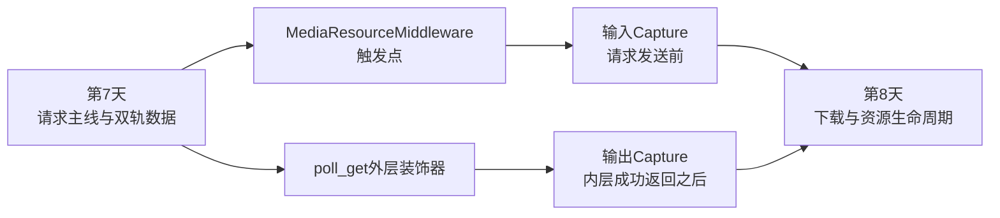

这两条链都叫 Capture，但它们并不拥有相同的时间位置、执行方式和收口能力。

输入 Capture 是后台旁路：它启动守护线程后，请求主线继续向前。

输出 Capture 是返回旁路：它先拿到业务 `Response`，再同步尝试下载结果文件，最后返回同一个 `Response`。

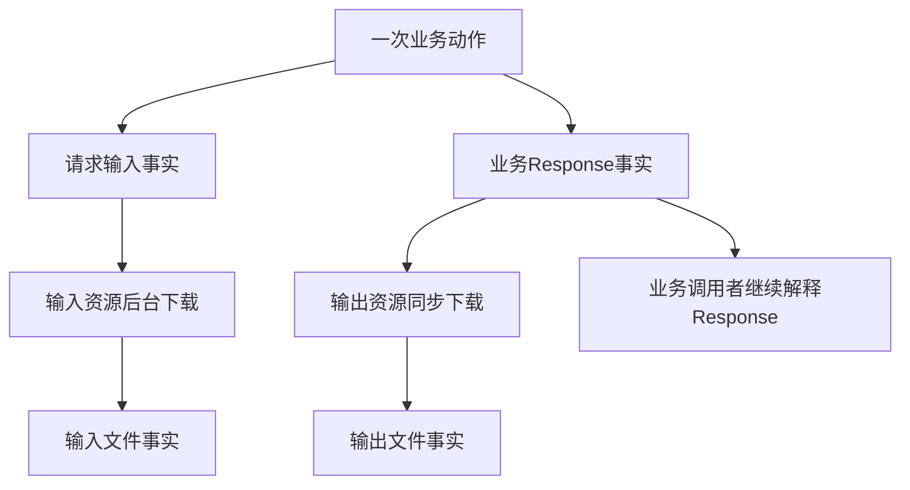

本课最重要的起点是：

> `Response` 成立、文件落盘、取消被请求、worker 完成、线程终止，是不同事实，不能用其中一个替代另一个。

---

## 1. 第一性原理：Capture 的本质是附加副作用

### 1.1 为什么业务请求之外还要捕获资源

业务接口中的图片、视频或其他媒体，常常不是直接嵌入请求或响应，而是以 URL 形式出现。

URL 只说明“资源可以从某处取得”，并不等于本地已经拥有文件。

因此 Capture 增加了一条附加链：


这条链解决的是资源证据的可保存性，不是业务成功的定义。

业务接口可以成功，而资源下载可以失败。

资源下载可以成功，也不能反向证明业务语义一定正确。

### 1.2 三条事实链必须分开

第 8 天涉及三条互相相交但不等价的事实链：

1. 业务请求链：产生 `Response` 或异常。
2. 下载事务链：产生最终文件或清理失败残留。
3. 后台任务链：产生取消信号、结果字段与完成事件。

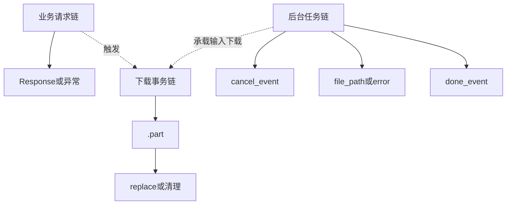

如果把三条链压成一个“成功/失败”布尔值，就会失去关键边界。

例如：

- 输出 Capture 失败，不应把已成功的业务 `Response` 替换成下载异常。
- `cancel_event.set()` 发生，不代表 worker 已经观察到取消。
- `done_event` 已设置，不代表调用方已经通过 `join()` 同步确认线程结束。

### 1.3 TOC 视角：真正的约束是完成事实混淆

表面上，本课似乎只是在讲文件下载。

继续追问原因，会得到更深的因果链：

```text
表面现象：Capture 有时成功，有时失败，有时仍在后台执行
→ 中层原因：输入和输出 Capture 的时间位置不同
→ 深层原因：下载、关闭、清理、完成事件与线程同步由不同对象拥有
→ 核心约束：调用方缺少一套区分“已请求、已观察、已完成、已同步”的事实语言
```

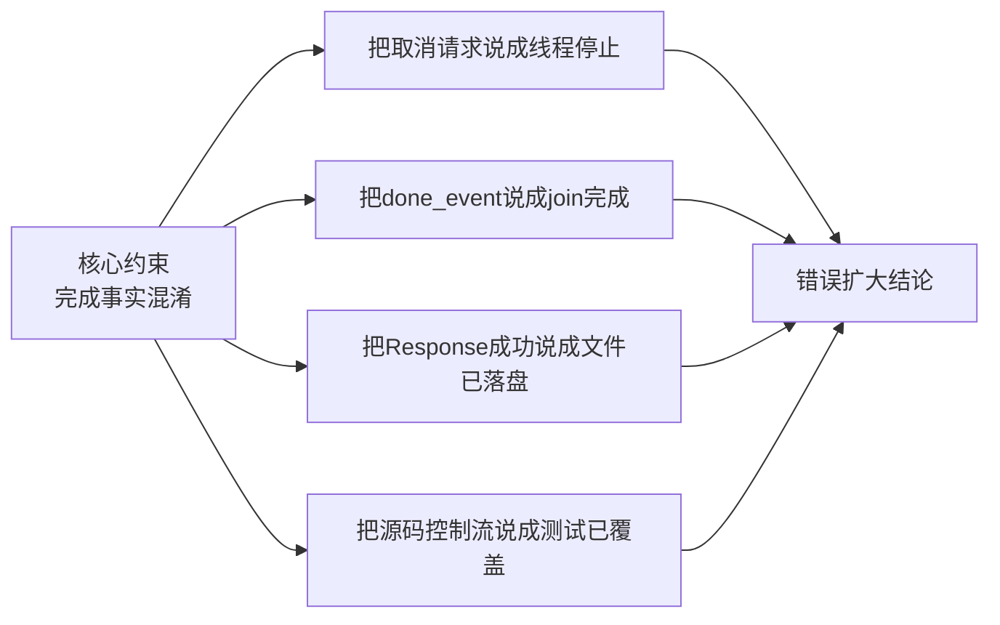

按 TOC 清晰思考，本课不追求增加更多下载术语，而是先解除这个认知约束。

判断任何一句话时，都要问：

- 这个事实由谁写入？
- 发生在什么时间点？
- 哪个观察者能够看到？
- 它能证明到哪一步？
- 它不能替代哪个更强的同步事实？

---

## 2. Day 7 留下的真实触发位置

### 2.1 默认中间件中的输入 Capture

`default_request_middlewares()` 把 `MediaResourceMiddleware` 放在第二位：

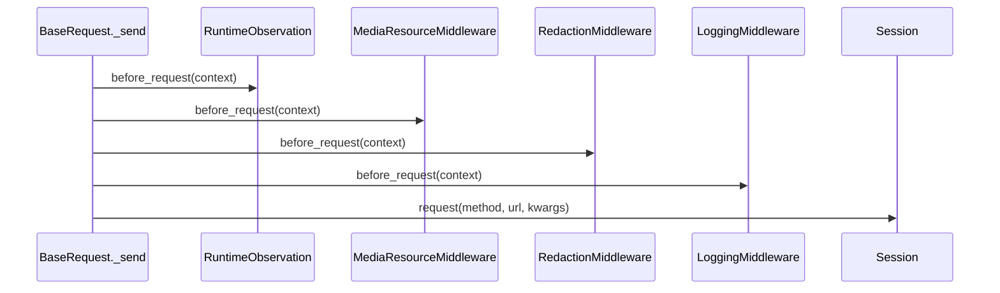

这意味着输入资源捕获发生在真实业务请求进入 `Session` 之前。

它读取的是 `RequestContext.kwargs` 中的 `json` payload。

它不读取第 7 天生成的脱敏副本，也不改写日志安全轨。

`MediaResourceMiddleware.before_request()` 只对 `context.method == POST` 调用 `start_media_downloads()`。

因此当前触发条件首先是方法条件，而不是“payload 中是否一定存在媒体”。

POST 通过方法门后，资源提取函数还会继续判断 payload 结构。

### 2.2 输出 Capture 不在请求中间件中

输出 Capture 由 `BaseDecorators.download_links_from_poll_get()` 提供。

它装饰 `BaseRequest.poll_get()`，但本课只关注装饰器的返回时序，不展开轮询状态与时间预算。

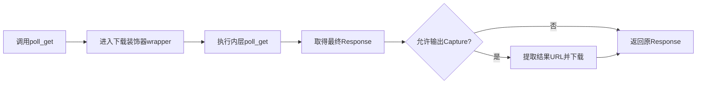

这里的关键不是装饰器“包在外面”，而是 `response = func(...)` 位于结果提取之前。

所以输出 Capture 的业务前提是：内层调用已经正常返回一个 `Response`。

如果内层调用直接抛异常，代码不会进入输出下载分支。

### 2.3 所有权地图

不同对象只拥有自己那一段状态：

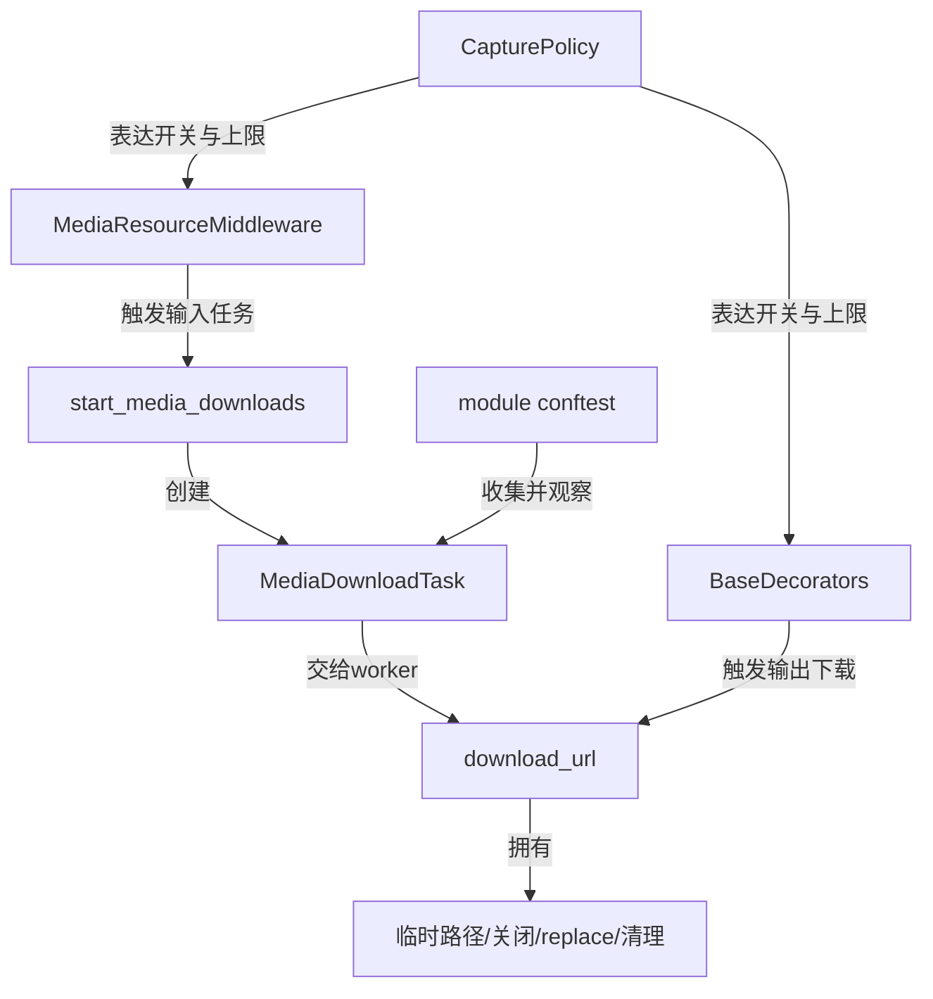

`CapturePolicy` 不执行下载。

`MediaResourceMiddleware` 不写文件。

`MediaDownloadTask` 不拥有 `Thread` 句柄。

`download_url()` 才拥有单个 URL 从临时写入到最终发布的事务。

测试 teardown 只观察任务状态并附加当前事实，不拥有线程同步结束能力。

---

## 3. `CapturePolicy`：只表达策略，不表达完成

### 3.1 四个字段

`CapturePolicy` 是冻结的数据类，包含四个策略字段：

| 字段 | 默认值 | 控制对象 | 含义 |
| --- | --- | --- | --- |
| `capture_input_media` | `True` | 输入 Capture | 是否允许从 POST payload 捕获输入媒体 |
| `capture_output_results` | `True` | 输出 Capture | 是否允许从最终 `Response` 捕获结果 URL |
| `max_input_bytes` | `None` | 输入单文件下载 | 每个输入资源允许写入的最大字节数 |
| `max_output_bytes` | `None` | 输出单文件下载 | 每个输出资源允许写入的最大字节数 |

`None` 表示当前策略不设置该方向的字节上限。

非 `None` 的上限必须大于 0，否则构造策略时抛出 `ValueError`。

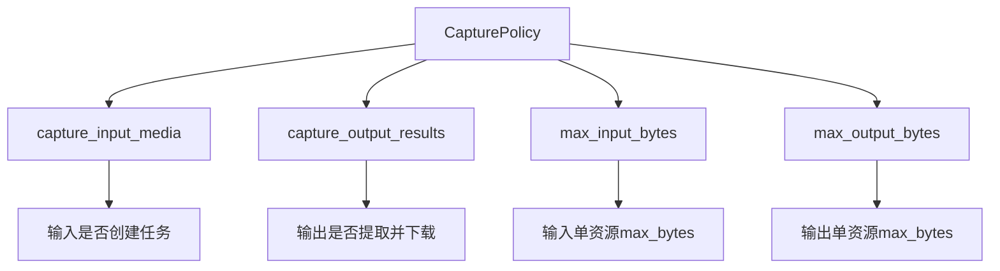

### 3.2 三个便捷策略

| 构造方式 | 输入 | 输出 | 上限去向 |
| --- | --- | --- | --- |
| `CapturePolicy.disabled()` | 关闭 | 关闭 | 不启动输入线程，也跳过输出下载 |
| `CapturePolicy.input_only(max_bytes=...)` | 开启 | 关闭 | 只设置 `max_input_bytes` |
| `CapturePolicy.output_only(max_bytes=...)` | 关闭 | 开启 | 只设置 `max_output_bytes` |

默认策略 `DEFAULT_CAPTURE_POLICY` 同时开启输入和输出 Capture，两个上限都是 `None`。

这里必须避免一个常见误解：

> 策略开启只表示“允许尝试”，不表示发现了 URL，不表示线程已经启动，更不表示文件已经发布。

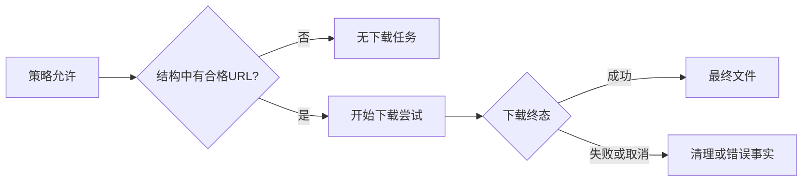

### 3.3 上限不是总目录预算

输入和输出上限最终都作为单次 `download_url()` 调用的 `max_bytes`。

如果响应中有多个 URL，每个 URL 都分别使用同一个上限。

当前实现没有把多个资源的字节数累加成一个 Capture 总预算。

因此“累计字节超限”指的是一个下载响应流内部的 `written` 累计值超限，不是整个目录、整次测试或全部 URL 的合计超限。

---

## 4. 输入 Capture：POST 发送前启动后台任务

### 4.1 完整触发链

输入 Capture 从 `RequestContext` 开始，沿以下顺序发生：

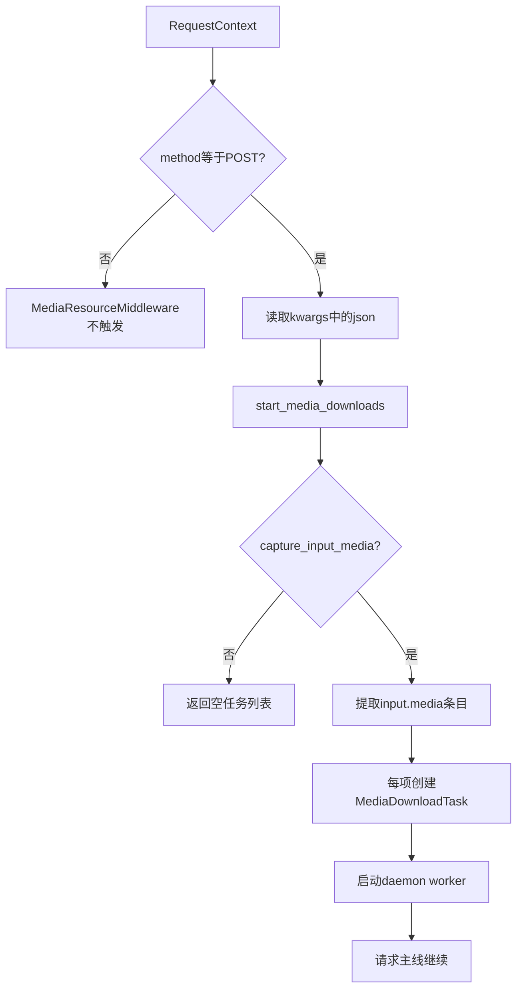

方法判断只区分 POST 与非 POST。

即使是 POST，如果 `json` 不符合媒体结构，也不会创建任务。

反过来，即使其他 HTTP 方法携带类似结构，当前中间件也不会触发输入 Capture。

`tests/test_request_middleware.py` 中的相关测试证明了 POST 会把 payload 交给启动函数，而 GET 不会触发。

这项相邻证据不属于 `tests/test_capture_downloads.py` 的四项测试，不能混入后者的数量统计。

### 4.2 媒体条目提取规则

`_extract_media_entries()` 按固定结构读取输入：

```text
payload
└── input
    └── media
        ├── 一个字典
        └── 或字典列表
```

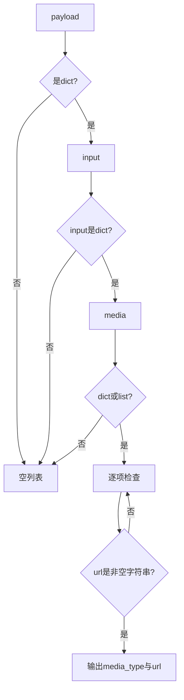

每个媒体项必须是字典。

`url` 必须是非空字符串，首尾空白会被去除。

`type` 如果不是非空字符串，就使用 `media` 作为任务类型。

提取函数只负责生成 `(media_type, url)`，不负责验证远端资源一定存在。

### 4.3 `MediaDownloadTask` 保存什么

每个合格媒体条目对应一个 `MediaDownloadTask`：

| 字段 | 初始状态 | 后续写入者 | 表达的事实 |
| --- | --- | --- | --- |
| `media_type` | 提取值或 `media` | 不再变化 | 资源显示类型 |
| `url` | 去除首尾空白后的 URL | 不再变化 | 下载来源 |
| `cancel_event` | 未设置 | teardown 等观察者 | 请求协作式取消 |
| `done_event` | 未设置 | worker 的 `finally` | worker 已执行到完成通知点 |
| `file_path` | `None` | worker 成功分支 | 下载函数返回的最终路径 |
| `error` | `None` | worker 异常分支 | 取消回退文本或异常摘要 |
| `max_bytes` | 输入策略上限 | 不再变化 | 单个输入下载的字节上限 |

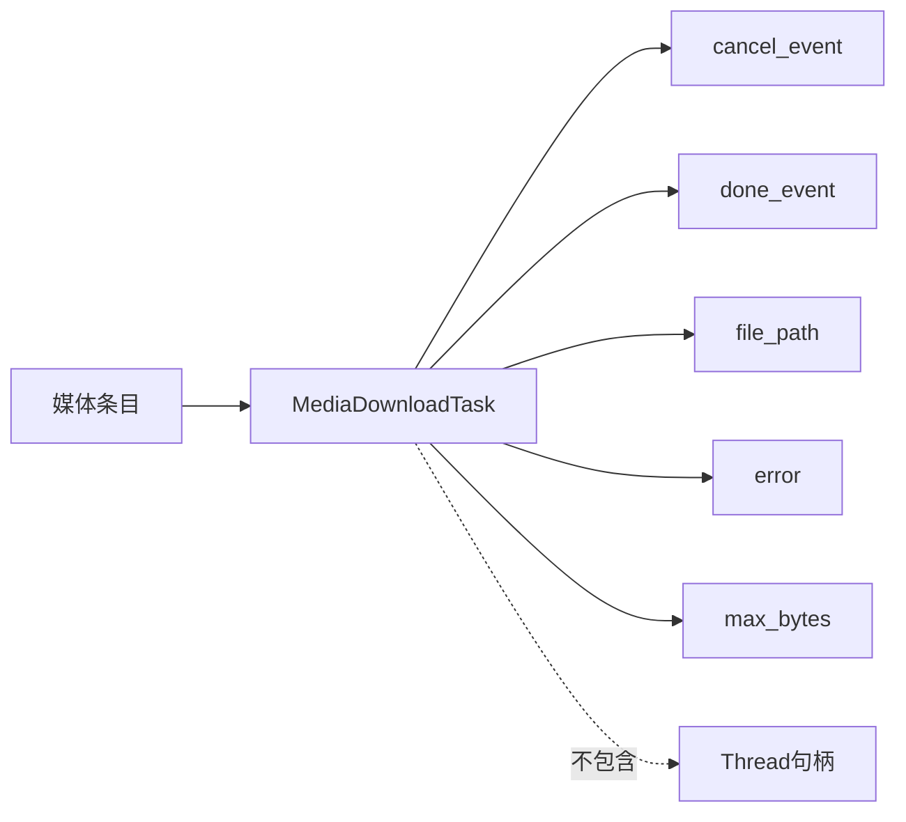

`is_done` 属性只是读取 `done_event.is_set()`。

任务对象不是线程对象，也没有保存线程标识或线程句柄。

### 4.4 线程启动与句柄丢失

`start_media_downloads()` 为每个任务创建一个线程：

- `target` 是 `_run_download`。
- `args` 只传入当前任务。
- 线程名是 `media-download-{media_type}`。
- `daemon=True`。
- 调用 `thread.start()` 后，只把 `task` 加入返回列表。

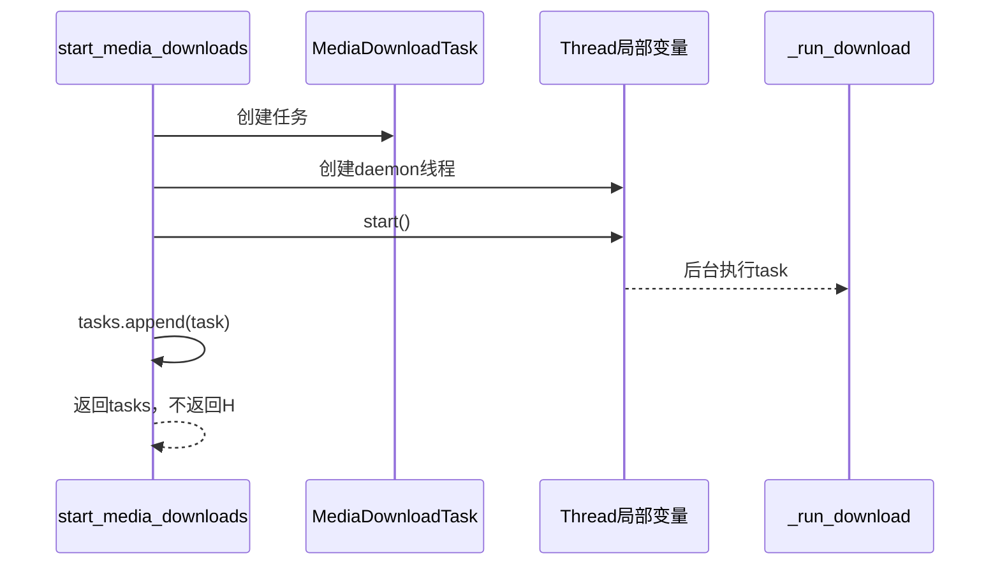

局部变量 `thread` 在循环后没有被写入任务对象，也没有进入返回值。

这形成当前同步能力的根约束：

> 调用方拥有任务状态，却不拥有可以 `join()` 的线程句柄。

守护线程属性也不能被解释为“自动完成”或“自动清理”。

它只影响进程退出时对该线程的等待语义，不提供测试 teardown 的同步证明。

### 4.5 任务收集使用 `ContextVar`

模块级 autouse fixture 在测试开始时调用：

- `start_media_download_collection()`，把当前上下文的任务列表设为空列表。
- `start_model_result_collection()`，为输出文件建立另一条收集链。

输入任务启动后，`_record_media_download_tasks()` 只有在当前 `ContextVar` 已存在列表时才扩展该列表。

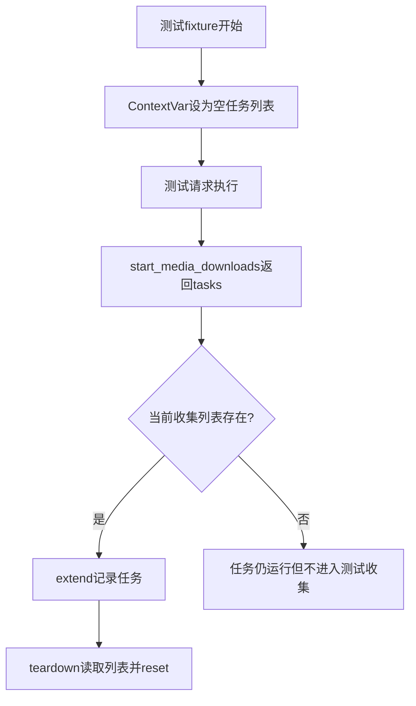

这里还有一个重要边界：

`ContextVar` 收集的是 `MediaDownloadTask` 引用，不是线程句柄，也不是等待器。

停止收集会复制当前任务列表并重置上下文，不会停止任务。

---

## 5. 输入 worker：结果、错误与完成事件

### 5.1 `_run_download()` 的三类结果

worker 调用 `_download_media_url()`，后者继续委托公共 `download_url()`。

输入方向只改变了几个参数：

- 下载目录是 `data/pre_data`。
- 兜底文件名是 `media`。
- 超时是 `(3.05, 5)`。
- 传入任务的 `cancel_event`。
- 传入任务的 `max_bytes`。

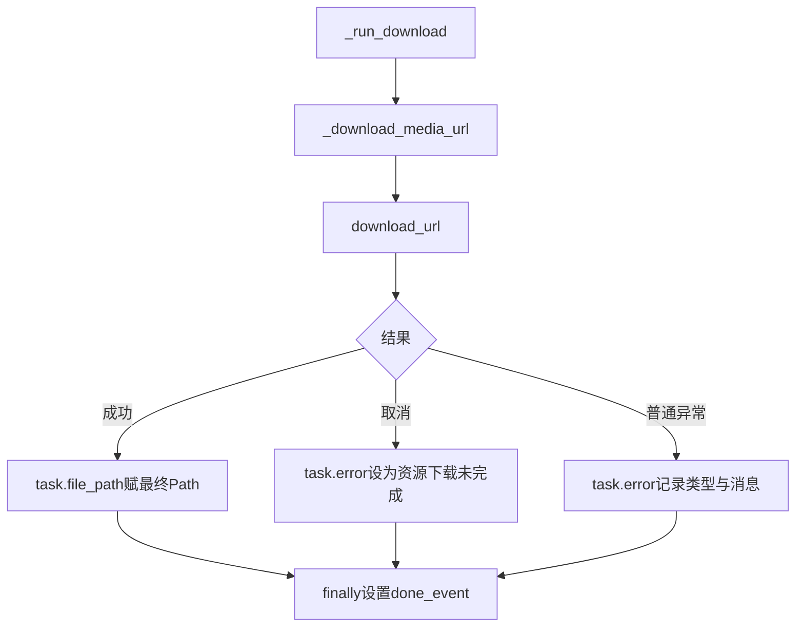

成功时，`file_path` 被赋值。

取消时，错误文本统一为“资源下载未完成”。

其他普通异常时，错误文本包含异常类型和消息。

无论以上哪条分支，`finally` 都调用 `task.done_event.set()`。

### 5.2 `done_event` 的准确含义

`done_event` 能证明 worker 已经执行到 `_run_download()` 的 `finally` 通知点。

它通常意味着下载函数已经返回或抛出，结果字段已经完成当前分支的写入。

但它仍然不是线程同步原语的完整使用：

- 调用方没有等待 `done_event.wait()`。
- 调用方没有保存 `Thread`。
- 调用方没有调用 `join()`。
- 测试也没有断言 `done_event` 的设置时机。

因此本课只把它称为“worker 完成通知”，不称为“线程已经被同步回收”。

### 5.3 teardown 如何观察任务

`attach_media_download_steps()` 对每个任务做三分判断：

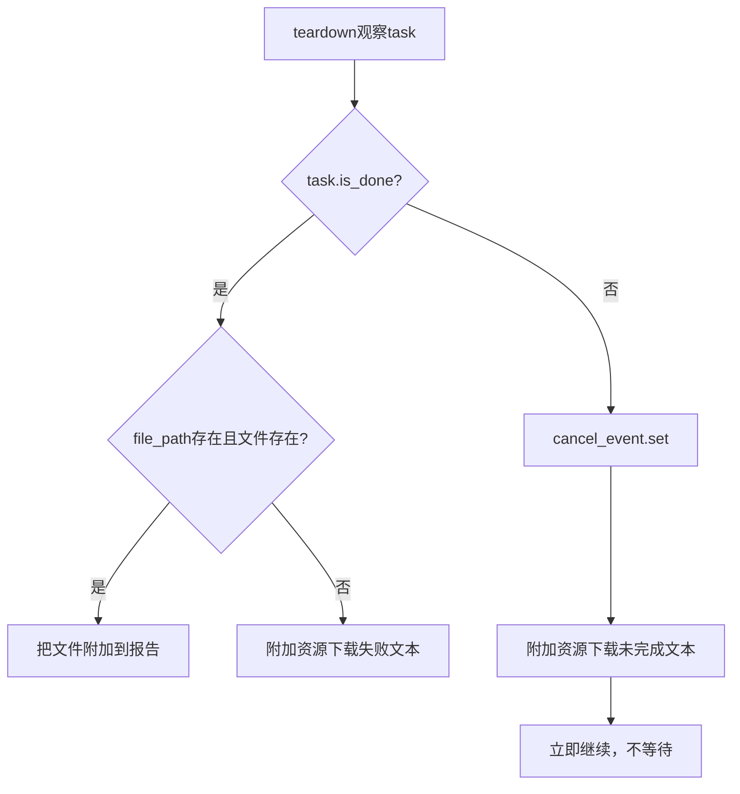

如果任务已完成且最终文件存在，teardown 附加文件。

如果任务已完成但没有可用文件，teardown 附加失败文本。

如果任务尚未完成，teardown 设置取消事件，再附加“资源下载未完成”文本。

这个函数没有在设置取消后重新检查任务，也没有等待 `done_event`。

它的目标是报告当前状态，不是建立线程完全收口保证。

---

## 6. 输出 Capture：先有业务 `Response`，后有下载副作用

### 6.1 wrapper 的严格时间顺序

输出 Capture 的 wrapper 先读取实例上的 `capture_policy`，再读取调用参数中的结果路径配置。

随后，它首先调用被装饰的内层函数：

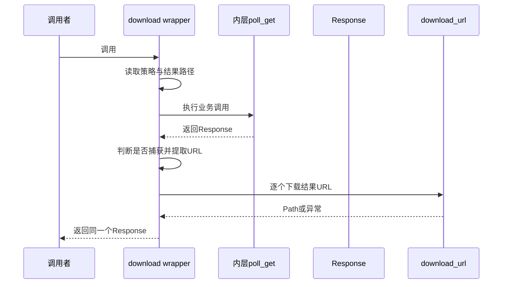

这里有两个不可颠倒的因果关系：

1. 没有内层成功返回的 `Response`，就没有输出 URL 提取。
2. 下载失败发生在 `Response` 已经存在之后，因此它被设计为可降级副作用。

结果路径配置缺失，或者 `capture_output_results` 为假时，wrapper 直接返回 `response`。

### 6.2 URL 提取与去重

输出 Capture 使用结果路径从 `response.json()` 中取值。

然后 `_extract_urls()` 递归处理字符串、字典和非字节可迭代对象。

字符串中的 URL 由正则提取，最后通过保持插入顺序的方式去重。

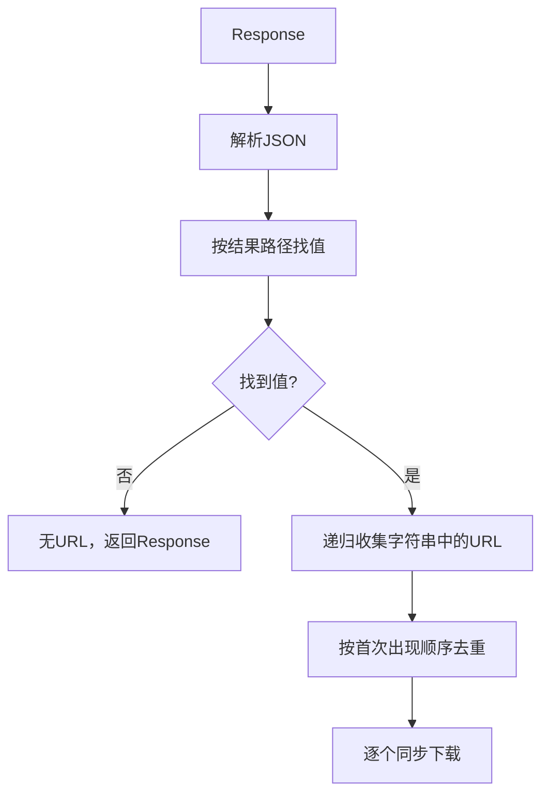

本课只解释该路径是输出 Capture 的定位入口，不展开产生最终 `Response` 的轮询状态机。

如果响应不是有效 JSON、结果路径格式错误或提取过程抛异常，wrapper 会附加一次结果路径失败诊断，然后仍返回原 `Response`。

### 6.3 输出下载失败为何不能替换业务响应

每个 URL 的下载都位于内层 `try/except Exception` 中。

下载成功时，文件路径被记录或附加。

下载失败时，`_attach_download_failure()` 尝试附加 URL、异常类型与异常消息。

即使附件本身失败，该附件函数也吞掉异常并返回。

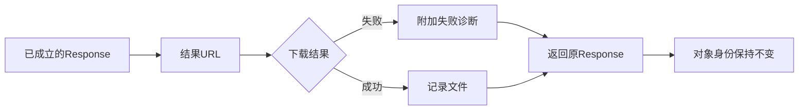

因此输出 Capture 的错误所有权是：

- 下载异常成为诊断事实。
- 业务 `Response` 保持返回值所有权。
- wrapper 不创建替代 `Response`。
- wrapper 不把下载异常重新抛给业务调用者。

`tests/test_capture_downloads.py` 的第二项测试直接断言返回对象 `is response`，只证明这个降级合同。

### 6.4 输入与输出的执行方式不同

| 维度 | 输入 Capture | 输出 Capture |
| --- | --- | --- |
| 触发位置 | POST 的 `before_request` | 最终 `Response` 返回之后 |
| 执行方式 | 每项启动 daemon worker | 当前 wrapper 中逐个同步下载 |
| 取消事件 | 传入 `cancel_event` | 当前调用不传取消事件 |
| 任务对象 | 有 `MediaDownloadTask` | 没有对应任务对象 |
| 完成事件 | 有 `done_event` | 无该事件，函数返回即该次下载调用结束 |
| 失败处理 | worker 写 `error` | 附加失败诊断并保留 `Response` |
| 下载目录 | `data/pre_data` | `data` |
| 兜底文件名 | `media` | `download` |

“都调用 `download_url()`”只说明它们共享单文件下载事务，不说明它们拥有相同的线程生命周期。

---

## 7. 公共下载事务：`.part → 校验 → replace`

### 7.1 最终路径不是写入起点

`download_url()` 先计算最终路径，再创建位于同一目录的唯一临时路径。

临时文件名形式是：

```text
.{最终文件名}.{uuid}.part
```

真正的字节写入目标是这个 `.part` 文件，不是最终路径。

```mermaid
flowchart LR
    U[URL] --> N[计算安全文件名]
    N --> F[选择唯一最终路径]
    F --> T[生成同目录唯一.part路径]
    T --> W[流式写入.part]
    W --> C[完成校验并关闭资源]
    C --> R[replace发布最终路径]
```

这样设计的第一性原理是：

> 读取最终路径的观察者，不应把正在写入的半成品误认为完整文件。

最终路径只在 `replace()` 成功后成为本次事务的发布结果。

### 7.2 下载前与下载中的校验

公共函数按以下顺序执行检查：

1. 如果取消事件在请求前已设置，立即抛出 `DownloadCancelled`。
2. 创建下载目录。
3. 分配最终路径和临时路径。
4. `requests.get(..., stream=True)` 取得下载 `Response`。
5. `raise_for_status()` 校验 HTTP 状态。
6. 如果存在 `Content-Length` 且超过上限，提前拒绝。
7. 逐块读取，每块前检查取消。
8. 忽略空块。
9. 累加 `written`，超过上限时拒绝。
10. 通过检查后才把当前块写入 `.part`。

```mermaid
flowchart TB
    A[进入download_url] --> C0{请求前已取消?}
    C0 -- 是 --> X[抛DownloadCancelled]
    C0 -- 否 --> G[打开流式Response]
    G --> H[raise_for_status]
    H --> L{Content-Length预检超限?}
    L -- 是 --> E[抛DownloadLimitExceeded]
    L -- 否 --> O[打开.part文件]
    O --> K[读取下一个chunk]
    K --> C1{此时已取消?}
    C1 -- 是 --> X
    C1 -- 否 --> B[累加written]
    B --> L2{written大于上限?}
    L2 -- 是 --> E
    L2 -- 否 --> W[写入chunk]
    W --> K
```

当 `written == max_bytes` 时仍允许写入，因为拒绝条件是严格大于上限。

如果下一块使累计值超过上限，异常在写入该块之前抛出。

### 7.3 文件关闭与下载 `Response` 关闭

下载函数使用两个嵌套上下文管理器：

- 外层 `with requests.get(...) as response` 管理下载 `Response`。
- 内层 `with temporary_path.open(wb) as output` 管理文件句柄。

正常路径的退出顺序是内层先退出、外层后退出：

```mermaid
sequenceDiagram
    participant D as download_url
    participant R as 下载Response
    participant F as .part文件句柄
    participant P as 最终路径
    D->>R: 进入Response上下文
    D->>F: 进入文件上下文
    D->>F: 写入全部合格chunk
    D->>F: 退出并关闭文件
    D->>R: 退出并关闭下载Response
    D->>P: temporary_path.replace(file_path)
```

所以成功 `replace` 发生在文件句柄与下载 `Response` 的上下文都已经退出之后。

这里的“下载 `Response`”不是业务 `poll_get` 返回的那个 `Response`。

输出 Capture 不会在 wrapper 中关闭业务 `Response`；它只通过 `download_url()` 管理自己新建的资源下载响应。

输入 worker 也只管理自己的资源下载响应。

### 7.4 异常路径为何删除两条路径

`download_url()` 的 `except Exception` 会尝试删除：

- 当前事务的临时 `.part` 路径。
- 当前事务分配的最终路径。

随后重新抛出原异常。

```mermaid
flowchart TB
    S[下载事务开始] --> Q{发生Exception?}
    Q -- 否 --> R[replace并返回Path]
    Q -- 是 --> C1[unlink临时.part]
    C1 --> C2[unlink最终路径]
    C2 --> E[重新抛出原异常]
```

删除最终路径不会删除一个更早已存在且被避让的同名文件，因为本次事务已经通过 `unique_file_path()` 选择了自己的目标路径。

清理调用使用 `missing_ok=True`，路径不存在时不会再制造新的缺失异常。

但该捕获范围是 `Exception`，不是所有 `BaseException`。

因此不能把这段代码扩大成对 `KeyboardInterrupt`、`SystemExit` 等所有退出方式的清理承诺。

### 7.5 “原子”准确指什么

本课所说的原子落盘，指发布边界集中在一次同目录 `replace()`：

- 写入期间，最终路径不承载半成品。
- 校验和资源关闭完成后，才切换到最终路径。
- 失败时走清理分支，不把 `.part` 当成最终结果。

它不是以下更强结论：

- 不是所有文件系统环境下的持久化承诺。
- 不是断电后一定持久存在的证明。
- 不是文件内容已经被后续消费者信任的证明。
- 不是测试已经覆盖成功 `replace` 精确时机的证明。

---

## 8. 命名规则：输入输出共享核心函数

### 8.1 从 URL 到文件名

`filename_from_url()` 的顺序是：

1. 解析 URL。
2. 对路径做 URL 解码。
3. 取路径最后一段名称。
4. 如果有名称，交给 `sanitize_filename()`。
5. 如果没有名称，使用调用方提供的兜底名。

```mermaid
flowchart LR
    U[URL] --> P[解析path]
    P --> D[unquote解码]
    D --> B[取basename]
    B --> Q{名称为空?}
    Q -- 是 --> F[使用fallback_name]
    Q -- 否 --> S[sanitize_filename]
    S --> N[安全文件名]
```

输入兼容辅助函数使用 `media` 作为兜底名。

输出兼容辅助函数使用 `download` 作为兜底名。

二者调用同一组 `util.downloads` 核心函数，所以清理规则一致，只有 fallback 不同。

### 8.2 字符清理与唯一目标路径

`sanitize_filename()` 把 Windows 等环境中不适合作为文件名的字符和控制字符替换为下划线。

然后去除名称首尾的点与空格。

如果清理后为空，则返回兜底名。

`unique_file_path()` 再处理已存在路径：

| 目录状态 | 选择结果 |
| --- | --- |
| 目标不存在 | 直接使用原名称 |
| 目标已存在 | 依次尝试 `stem_1.suffix`、`stem_2.suffix` 等 |
| 一直无法分配 | 达到循环上限后抛 `RuntimeError` |

```mermaid
flowchart TB
    N[清理后的文件名] --> P[目标路径]
    P --> E{已经存在?}
    E -- 否 --> U[使用原路径]
    E -- 是 --> I[尝试stem_1到stem_n]
    I --> A{找到不存在候选?}
    A -- 是 --> V[使用候选路径]
    A -- 否 --> R[抛RuntimeError]
    U --> T[生成该目标对应的唯一.part]
    V --> T
```

这个唯一命名是“先检查是否存在，再选择候选”。

它不是跨线程的原子路径预留机制，因此不能额外宣称并发下载永远不会竞争同一候选名。

### 8.3 输入输出命名一致的证据

`tests/test_capture_downloads.py` 的第四项测试比较了两组兼容辅助函数：

- 含非法字符的 `a:b?.png` 都被清理成 `a_b_.png`。
- URL 中的 `a%20b.png` 都被解码成 `a b.png`。

它直接证明输入和输出兼容入口共享命名规则。

它不证明真正执行了下载，也不证明 `.part`、关闭、`replace`、取消或线程状态。

---

## 9. 限额与五阶段资源状态

### 9.1 两道限额门

限额校验有两条路径，但它们服务于同一个单文件上限：

| 限额门 | 发生时间 | 依据 | 能处理什么 |
| --- | --- | --- | --- |
| `Content-Length` 预检 | 打开下载 `Response` 后、打开文件前 | 响应头声明值 | 声明值已超限时提前拒绝 |
| 流式累计检查 | 每个非空 chunk 写入前 | 实际累计 `written` | 无长度头、长度头不可靠或流式中途超限 |

`Content-Length` 缺失时不会阻止下载，实际字节仍受累计检查约束。

当前实现直接把长度头转换为整数；格式无效会形成普通异常，进入清理与重抛路径。

### 9.2 单个资源的五阶段状态

为了避免把“下载中”直接跳成“已完成”，可以把每个资源拆成五个阶段：

| 阶段 | 文件系统事实 | 关键动作 | 尚不能证明 |
| --- | --- | --- | --- |
| 1. 候选态 | 还没有本次文件 | 已发现 URL，策略允许尝试 | 请求已发出 |
| 2. 已分配态 | 最终路径未发布 | 选择安全名称、唯一最终路径和 `.part` 路径 | 已写入有效字节 |
| 3. 临时写入态 | `.part` 可能存在 | 状态、取消、长度与累计字节持续校验 | 最终路径可用 |
| 4. 待发布态 | `.part` 已写完，最终路径仍未提交 | 文件句柄和下载 `Response` 依次关闭 | `replace` 已成功 |
| 5. 终态 | 最终路径已发布，或失败路径已清理 | `replace` 返回，或异常清理并重抛 | 输入线程已被 `join()` |

```mermaid
stateDiagram-v2
    [*] --> 候选态
    候选态 --> 已分配态: URL合格且策略允许
    已分配态 --> 临时写入态: 打开下载响应与.part
    临时写入态 --> 待发布态: 流结束且校验通过
    待发布态 --> 已发布: 关闭资源后replace成功
    已分配态 --> 已清理: Exception
    临时写入态 --> 已清理: 取消或超限或异常
    待发布态 --> 已清理: replace异常
    已发布 --> [*]
    已清理 --> [*]
```

五阶段描述的是单个下载资源的事务状态，不是业务请求状态，也不是线程同步状态。

---

## 10. 取消、观察、完成与线程结束

### 10.1 七个不能互换的事实

| 事实 | 直接证据 | 准确含义 |
| --- | --- | --- |
| 取消请求 | `cancel_event.is_set()` 为真 | 某观察者提出停止意图 |
| worker 观察取消 | worker 在检查点发现事件并抛 `DownloadCancelled` | 协作代码已经消费取消信号 |
| 文件关闭 | 文件上下文退出 | `.part` 文件句柄不再由该上下文持有 |
| 下载 `Response` 关闭 | 响应上下文退出 | 本次资源下载响应离开上下文 |
| 临时文件清理 | `.part` 路径已不存在 | 异常清理已执行到相应删除动作 |
| `done_event` | worker 的 `finally` 已调用 `set()` | worker 到达完成通知点 |
| 线程完全结束并同步确认 | 持有线程句柄并成功 `join()` | 调用方建立了线程终止同步事实 |

当前实现只在下载请求前和每个 chunk 处理前检查取消。

如果 worker 正阻塞在网络调用或等待下一块数据，另一个线程设置事件不会强制中断底层调用；worker 必须运行到检查点才能观察取消。

```mermaid
sequenceDiagram
    participant T as teardown
    participant E as cancel_event
    participant W as worker
    participant D as download_url
    participant F as worker finally
    T->>E: set()
    Note over T,E: 只证明取消请求
    W->>D: 继续当前阻塞或读取
    D->>E: 到检查点读取is_set
    E-->>D: true
    D-->>W: 抛DownloadCancelled并清理
    W->>F: 写error后进入finally
    F->>F: done_event.set()
    Note over F: 仍没有join证据
```

`done_event.set()` 是 `_run_download()` 的最后一个显式状态写入，但线程还要从目标函数返回。

更关键的是，当前任务对象没有线程句柄，teardown 也不等待 `done_event`，所以没有 `join()` 同步保证。

最保守的结论是：teardown 能请求取消并记录当时看到的状态，不能同步证明所有后台线程已经完全结束。

---

## 11. 证据与未覆盖合同

### 11.1 `tests/test_capture_downloads.py` 只有四项测试

必须准确写成以下四项，不能增加或合并成其他数量：

| 测试 | 直接证明 | 不能扩大为 |
| --- | --- | --- |
| `test_disabled_input_capture_starts_no_download_thread` | 关闭 Capture 时，在构造任何线程前短路并返回空任务列表 | 启用后的完成、取消观察、关闭或线程结束 |
| `test_output_download_failure_does_not_replace_polling_response` | 输出下载抛错时仍返回原 `Response` 对象 | 成功下载、成功 `replace` 或业务 `Response` 关闭 |
| `test_download_limit_removes_partial_file` | 单个响应流累计字节超限后抛错，目录为空 | `Content-Length` 预检、成功发布、取消与线程收口 |
| `test_input_and_output_compatibility_helpers_share_naming_rules` | 输入与输出兼容辅助函数的清理和 URL 文件名规则一致 | 任何真实下载生命周期 |

因此，这个测试文件的四项证据分别是：

1. 关闭 Capture 不启动线程。
2. 输出下载失败仍返回原 `Response`。
3. 累计字节超限后目录为空。
4. 输入输出命名规则一致。

### 11.2 明确未被这四项覆盖

不能宣称 `tests/test_capture_downloads.py` 覆盖了以下合同：

- `Content-Length` 预检是否按预期触发。
- 成功下载时 `replace` 的精确发生时机。
- `done_event` 是否在所有目标场景按预期设置。
- 下载 `Response` 是否被关闭。
- 文件句柄是否被关闭。
- worker 是否观察了取消请求。
- 后台线程是否完全结束。
- 是否存在任何 `join()` 同步保证。
- 输出资源成功下载并记录到 ContextVar 的完整路径。
- 同一输出中重复 URL 是否被去重。
- ContextVar 中模型结果文件的收集与后续消费。
- 非法 `Content-Length` 值的处理分支。

这些内容中，一部分可以从生产源码控制流读取；另一部分仍是当前测试未锁定的合同。

相邻证据需要单独归属：

- `TestMediaResourceMiddleware.test_post_triggers_media_download_and_get_does_not` 补充 POST/GET 触发边界。
- `TestCaptureAndAssertions.test_capture_limit_failure_does_not_override_response` 补充普通模块链中业务响应保留且输出目录无残留的集成事实。

它们不会改变“`tests/test_capture_downloads.py` 只有四项测试”，也不会扩大四项测试各自的证明边界。

---

## 12. 本课结论与 Day 9 交付

第 8 天可以压缩为四个判断：

1. 输入 Capture 在 POST 发送前启动后台任务，输出 Capture 在最终 `Response` 之后同步尝试下载。
2. `download_url()` 拥有 `.part → 校验 → 关闭资源 → replace`，失败时清理并重抛。
3. `cancel_event`、worker 观察、资源关闭、清理、`done_event`、线程结束与 `join()` 是不同强度的事实。
4. 测试证据必须按四项现有断言陈述，源码可见顺序不能伪装成测试覆盖。

本课向 Day 9 交付的准确句子是：

> 单次请求附加资源已分离，下一步解释同一业务动作为什么重新attempt。
