# 第 09 天：请求重试策略

> **课程定位**：解释同一个业务动作为什么、何时以及在什么预算内创建新的 HTTP attempt  
> **Module 层落点**：module Task 选择或传入 `RetryPolicy`，并复用公开执行能力；测试方法和模块 Task 都不手写重复的重试循环  
> **讲解重点**：RetryPolicy、幂等边界、失败分类、等待计算、RetryExecutor 与终态  
> **课程形式**：纯讲解，不设置实操、练习、作业、小测或教学门禁  
> **本课边界**：只讲一次业务动作内部的恢复性重试，不展开 Polling 业务状态循环

---

## 0. 从第 8 天读取什么模型

第 8 天已经解释了单次 attempt 可能产生的附加资源生命周期：

- Request 发送一次请求。
- Middleware 可在 POST 发送前触发输入 Capture；`poll_get()` 外层装饰器可在内层成功返回后触发输出 Capture。
- Response、下载文件、临时文件和 worker 各有关闭边界。
- 一次 attempt 结束，不代表同一业务动作一定结束。

Day 9 增加的问题是：

> 如果一次 attempt 遇到可恢复失败，框架是否应该创建下一次 attempt？

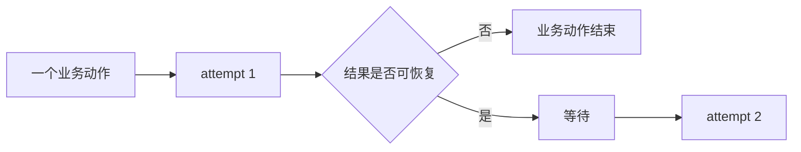

本课只解释 Retry。业务状态尚未到终态而继续查询，属于 Day 10 的 Polling。

---

## 1. 第一性原理：重试是在复制副作用风险

### 1.1 为什么不能看到失败就重试

重试会重复发送请求。对于读取动作，重复通常风险较低；对于写入动作，重复可能造成：

- 重复创建任务。
- 重复扣费。
- 重复写入数据。
- 重复触发外部通知。

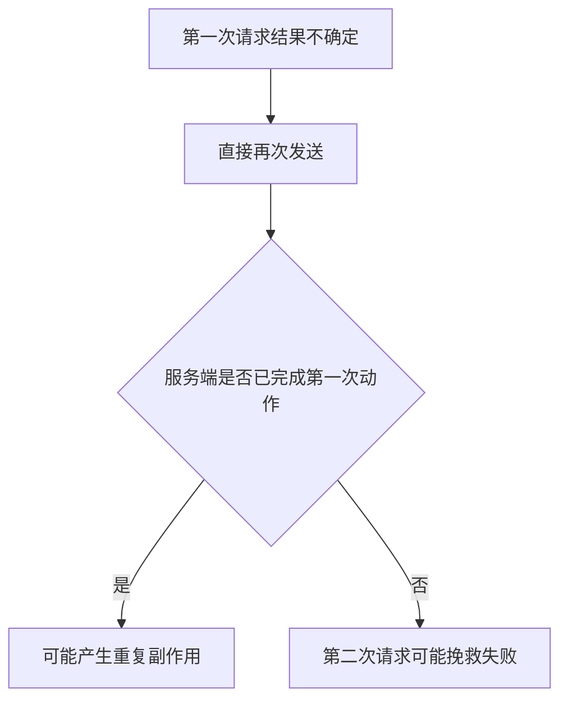

所以 Retry 的第一个问题不是“失败是否暂时”，而是“重复发送是否安全”。

### 1.2 TOC 约束：失败分类与幂等性混在一起

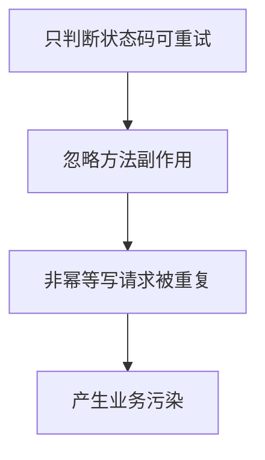

正确决策至少需要四个维度：

1. 方法是否允许重试。
2. 失败是否属于可恢复类别。
3. attempt 数量是否还有余额。
4. 等待是否仍在时间预算内。

### 1.3 Retry 的最小决策式

```text
允许创建下一次 attempt
= 方法具备重试资格
∩ 失败属于可恢复条件
∩ attempt 尚未耗尽
∩ 等待仍在预算内
```

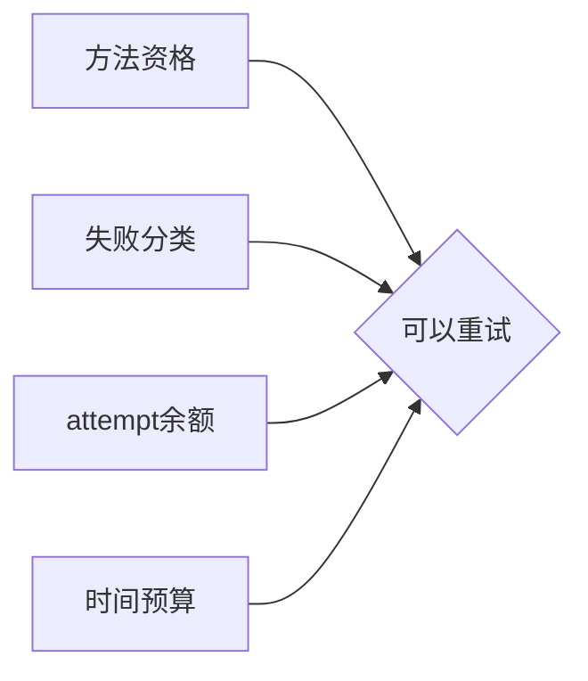

---

## 2. 业务动作与 attempt

### 2.1 两个粒度不能混淆

| 粒度 | 含义 |
| --- | --- |
| 业务动作 | 调用方希望完成的一次业务意图 |
| attempt | 为完成该意图而进行的一次实际 HTTP 发送 |

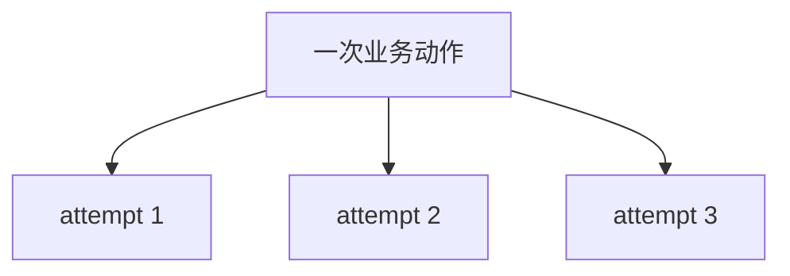

多个 attempt 可以属于同一个业务动作，但每个实际发送的 attempt 都使用自己的 RequestContext。

### 2.2 为什么每次 attempt 需要独立上下文

不同 attempt 可能具有不同：

- 开始时间。
- 响应或异常。
- 日志记录。
- `attempt_index`。
- 中间件前后状态。

如果复用同一个可变上下文，后一次 attempt 会覆盖前一次事实。

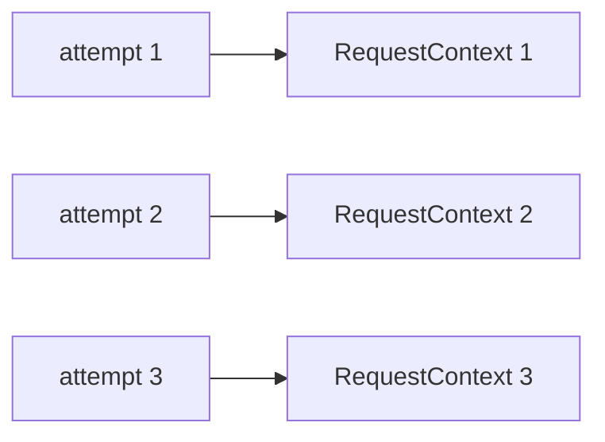

Retry 记录可以共享为同一业务动作的历史列表，但 attempt 的请求事实应独立。

---

## 3. `RetryPolicy`：冻结的决策输入

### 3.1 Policy 为什么要独立

Retry 决策不应散落在 while 循环的多个条件中。`RetryPolicy` 把决策输入冻结为一个对象。

| 字段 | 主要含义 |
| --- | --- |
| `max_attempts` | 最多创建多少次 attempt |
| `retry_statuses` | 哪些 HTTP 状态可恢复 |
| `retry_exceptions` | 哪些异常可恢复 |
| `backoff` | fixed 或 exponential |
| `base_delay` / `max_delay` | 等待计算边界 |
| `jitter` | 是否引入随机抖动 |
| `respect_retry_after` | 是否尊重服务端等待建议 |
| `max_elapsed` | Retry 自身最大经过时间 |
| `allowed_methods` | 默认允许的方法 |
| `allow_post` | 是否显式允许 POST |
| `idempotency_header` | POST 幂等键 Header 名称 |

### 3.2 默认策略表达什么

当前默认可重试状态码为：

```text
429, 500, 502, 503, 504
```

默认允许方法为：

```text
GET, HEAD
```

默认可重试异常包括连接错误和超时，但 SSL 错误与重定向过多会被显式排除。

### 3.3 Policy 验证保护什么

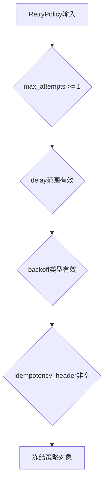

Policy 冻结后，一次业务动作中的所有 attempt 读取同一套决策合同。

---

## 4. 方法与幂等边界

### 4.1 默认允许读取方法

`GET` 和 `HEAD` 默认进入重试资格判断，因为它们通常不应改变服务端业务状态。

### 4.2 非 POST 的其他方法

如果方法不在 `allowed_methods` 中，且不是 POST，当前实现直接判定为不允许重试。

### 4.3 POST 的三条合法路径

POST 只有满足以下任一条件才允许重试：

1. POST 已被加入 `allowed_methods`。
2. `allow_post=True`。
3. 请求 Header 中存在配置的幂等键。

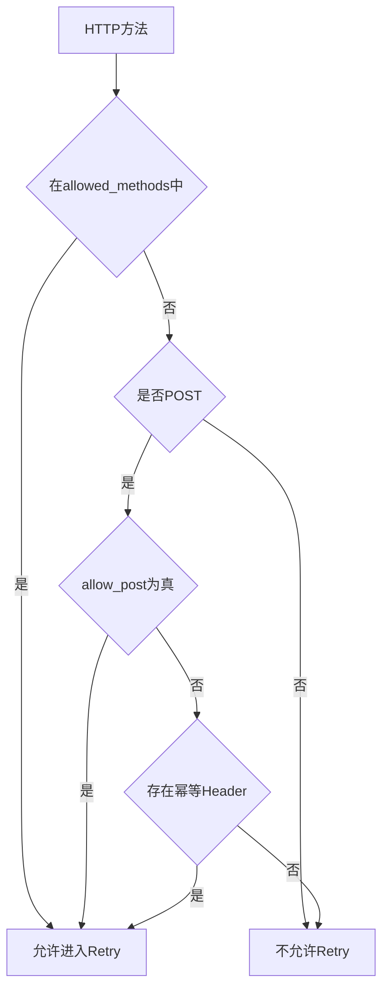

### 4.4 幂等键证明到什么程度

框架只能观察 Header 是否存在，不能仅凭 Header 证明服务端真的实现了幂等语义。


服务端幂等合同仍属于业务协议责任。

---

## 5. 失败分类：Response 与 Exception

### 5.1 Response 路径

请求成功返回 Response 后，`should_retry_response` 只检查状态码是否在 `retry_statuses` 中。

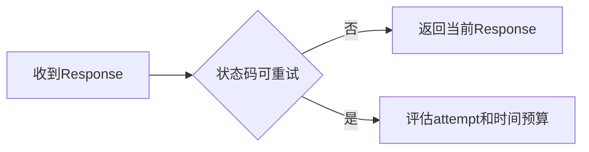

Response 路径已经拥有一个可返回的结果，因此预算耗尽时可能返回当前或最后一个 Response。

### 5.2 Exception 路径

发送过程抛出异常后，`should_retry_exception` 判断异常类型。

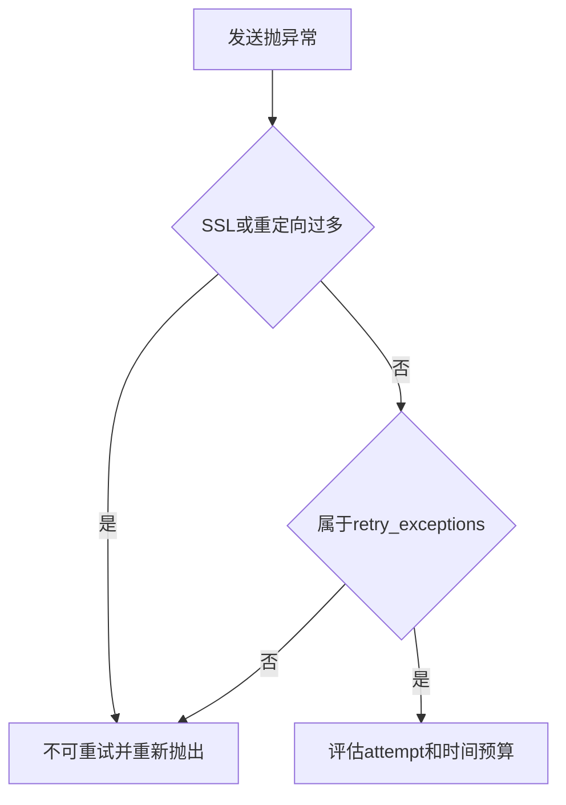

### 5.3 为什么两条路径终态不同

| 路径 | 已有结果 | 耗尽时常见终态 |
| --- | --- | --- |
| Response | 有最后 Response | 返回最后或当前 Response |
| Exception | 没有 Response | 重新抛出原异常 |

外部 deadline 被耗尽时会使用 `RetryDeadlineExceeded` 表达预算终止，并可携带 `last_response`。

---

## 6. 等待如何计算

### 6.1 `Retry-After` 优先

如果启用 `respect_retry_after` 且 Response 提供合法 `Retry-After`，等待优先采用服务端建议。

`Retry-After` 可以是：

- 秒数。
- HTTP 日期。

非法值会回退到本地 backoff。

### 6.2 fixed 与 exponential

```text
fixed:
delay = base_delay

exponential:
delay = base_delay × 2^(attempt_index - 1)
```

等待最终受 `max_delay` 限制。

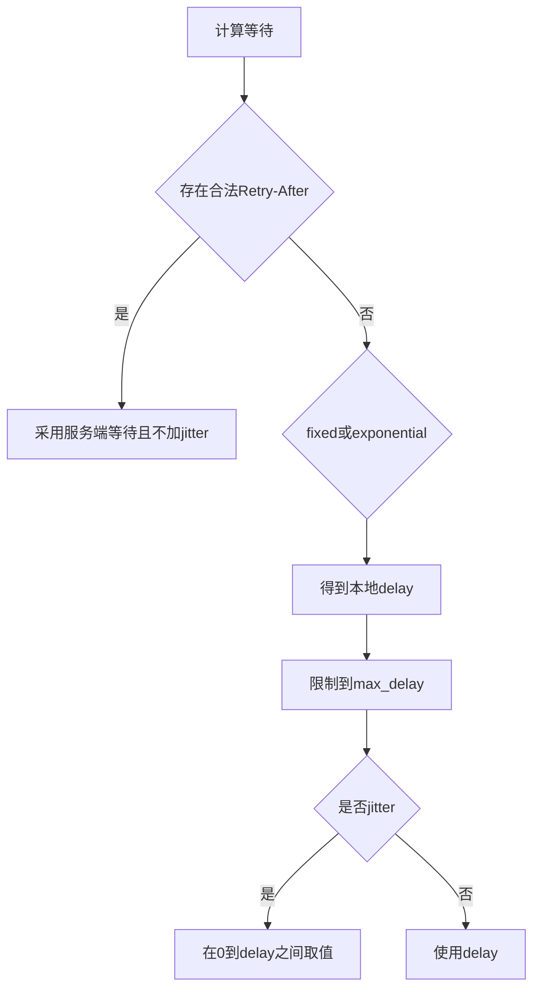

### 6.3 jitter 的作用

当大量客户端同时失败时，如果等待完全一致，它们可能再次同时发起请求。jitter 用于打散下一次 attempt 时间。

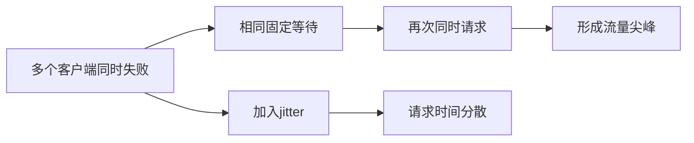

---

## 7. 三种预算

### 7.1 attempt 数量预算

`max_attempts` 包含第一次发送，而不是“额外重试次数”。

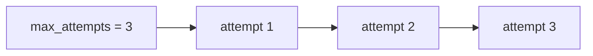

### 7.2 Retry 自身经过时间

`max_elapsed` 从 Retry 开始时计时，评估“当前已耗时 + 下一次等待”是否仍在限制内。

```text
当前经过时间 + wait_seconds <= max_elapsed
```

Response 路径若不再允许等待，会返回当前 Response；Exception 路径会重新抛出当前异常。

### 7.3 外部 deadline

RetryExecutor 还可以接收外部绝对 deadline。这个 deadline 不属于 RetryPolicy，而是上层调用者给出的更强时间边界。

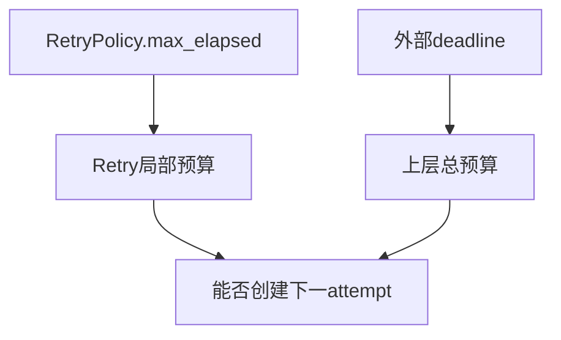

Day 10 的 Polling 会把统一 deadline 传入每次轮询请求内部的 Retry。

### 7.4 为什么等待必须小于剩余时间

当前实现要求 `wait_seconds < remaining`。如果等待已经等于或超过剩余时间，继续 sleep 只会确定性越界。

### 7.5 超时参数也要被 deadline 截断

`clamp_timeout` 会把单次发送 timeout 限制在剩余时间内；元组 timeout 的每个值也分别被截断。


这避免单个 attempt 的网络 timeout 超过上层总预算。

---

## 8. `RetryExecutor` 的所有权

### 8.1 它负责什么

`RetryExecutor` 只拥有重试编排：

- 判断方法资格。
- 创建 attempt 循环。
- 调用 `context_factory`。
- 调用 `send_once`。
- 记录重试原因与等待。
- 检查 attempt 和时间预算。
- sleep 后进入下一 attempt。

### 8.2 它不负责什么

- 构造业务 payload。
- 实现 Middleware。
- 直接调用 `requests.Session`。
- 解释业务成功。
- 管理 Polling 业务状态。

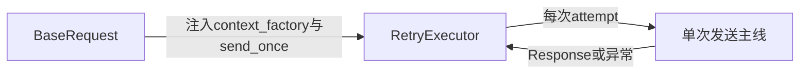

### 8.3 为什么使用注入函数

RetryExecutor 不需要知道 RequestContext 具体如何构造，也不需要知道 Middleware 和 transport 如何工作。它只调用稳定的函数边界。

这保持了依赖方向：Retry 编排依赖抽象调用点，而不是反向拥有 BaseRequest。

---

## 9. 一次执行的真实顺序

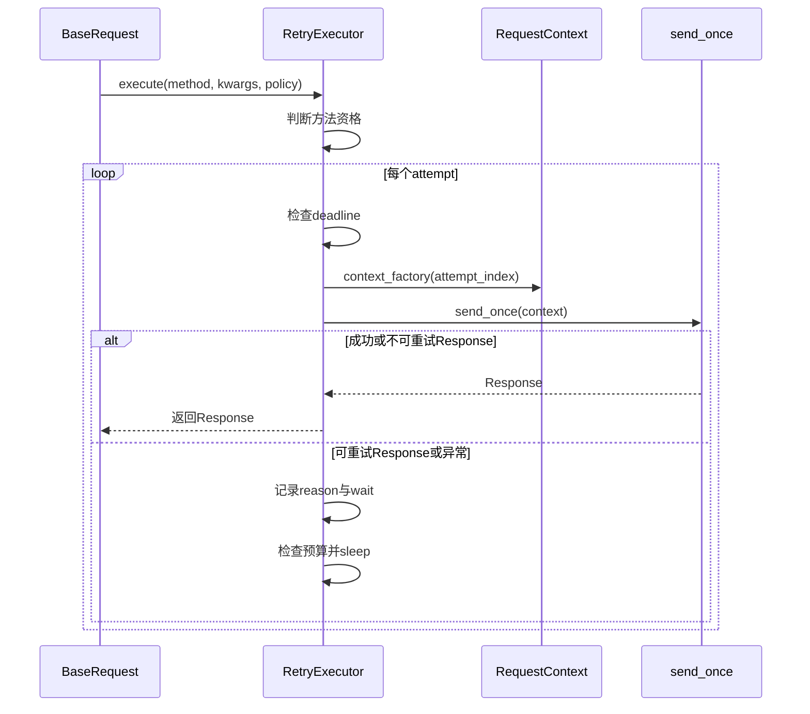

### 9.1 RetryAttemptRecord

每次决定继续时，记录包含：

- `attempt_index`。
- `max_attempts`。
- 原因文本。
- 等待秒数。
- Response 状态码，或异常类型与消息。

### 9.2 记录附加到哪个上下文

当前 attempt 的 RequestContext 会保存共享的 `retry_records` 列表，并附加到日志观察接口。

`context_recorder` 只保留最新上下文，使 BaseRequest 在 Retry 完成后能够读取最后 attempt 的事实。

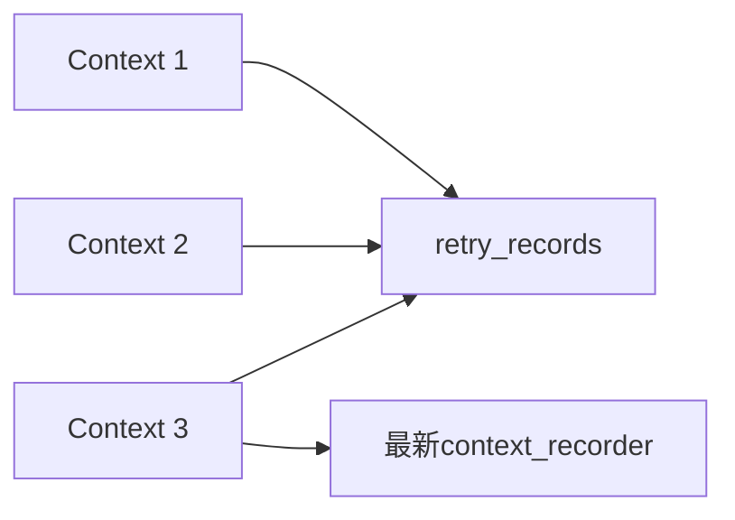

---

## 10. 终态决策

### 10.1 方法不允许重试

即使传入 RetryPolicy，RetryExecutor 也只执行一次实际发送。实现层仍会先构造一个不发送的 `first_context`，随后由 `context_factory` 创建唯一的实际 attempt Context；因此是“两个 Context 对象、一次 Session 发送”，而不是“只创建一个 Context”。

Policy 的存在不等于一定发生重试，attempt 数量必须按实际 Session 发送次数计算。

### 10.2 第一次成功

Response 不在 `retry_statuses` 中，立即返回。

### 10.3 重试后成功

某次 attempt 返回不可重试状态，例如 200，Retry 返回该 Response。

### 10.4 Response 耗尽

达到 `max_attempts` 时，即使最后 Response 仍属于可重试状态，也返回最后 Response，由上层决定是否接受。

### 10.5 Exception 耗尽

达到最大 attempt 或异常不可重试时，重新抛出原异常。

### 10.6 外部 deadline 耗尽

在发送前无剩余时间，或下一次等待无法放入 deadline 时，抛出 `RetryDeadlineExceeded`；如果已有 Response，会携带 `last_response`。

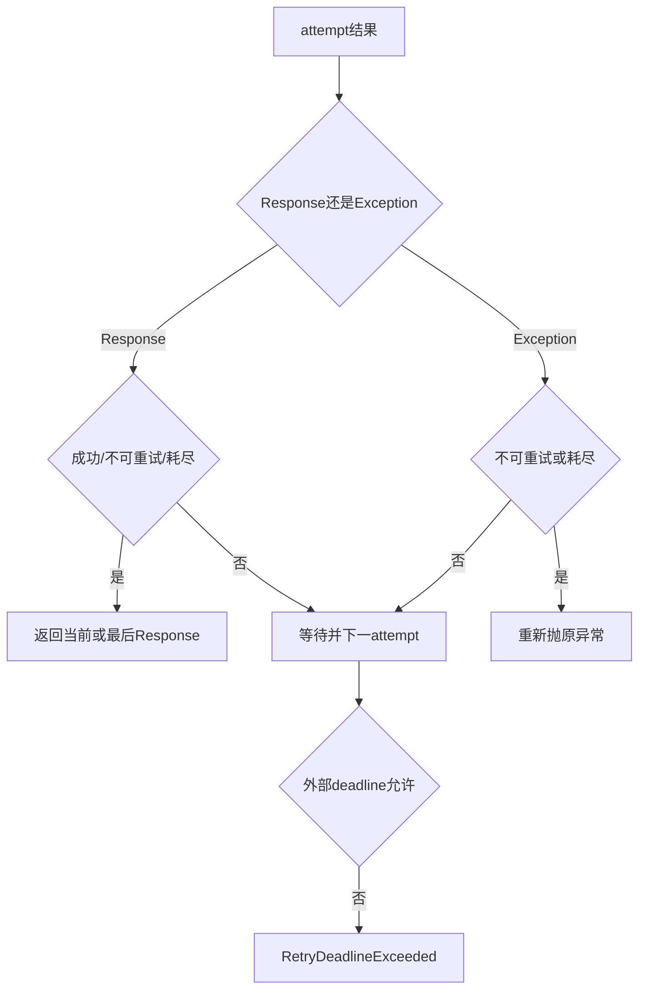

---

## 11. Retry 与 Polling 的边界

### 11.1 Retry 的问题

> 同一次业务动作中的单次请求失败，是否值得重新发送？

### 11.2 Polling 的问题

> 请求成功返回了业务状态，但任务尚未到终态，是否应该再次查询？

```mermaid
flowchart TB
    P[Polling业务状态循环]
    P --> Q1[第1次查询]
    P --> Q2[第2次查询]
    Q1 --> R1[查询内部Retry attempts]
    Q2 --> R2[查询内部Retry attempts]
```

Retry 可以嵌套在每次 Polling 请求内部，但不能替代 Polling。

| 维度 | Retry | Polling |
| --- | --- | --- |
| 触发原因 | 请求失败或可重试状态码 | 业务状态仍为 pending |
| 循环对象 | 同一 HTTP 动作的 attempt | 多次业务状态查询 |
| 等待依据 | Retry-After 或 backoff | poll_interval |
| 终态 | Response、异常、耗尽 | success、failure、unknown、timeout |

---

## 12. 证据边界

### 12.1 Policy 单元测试证明

- 字段验证和冻结合同。
- Retry-After 解析。
- backoff、max_delay 和 jitter。
- 方法与幂等资格。
- Response 与异常分类。

### 12.2 Executor 测试证明

- 可重试 Response 或异常进入下一 attempt。
- 最大 attempt 的 Response/异常终态。
- `max_elapsed` 阻止等待。
- 每次 attempt 使用独立上下文。

### 12.3 离线分类测试证明

- transient GET 在真实 loopback 链路中被挽救。
- Retry-After 被尊重。
- 幂等 POST 可以重试。
- 非幂等 POST 保持单次发送。

### 12.4 不能证明什么

- 所有服务端都正确实现幂等键。
- Retry 可以修复业务失败。
- Polling 的状态迁移与总 deadline 正确。
- 重试一定比快速失败更合适。

```mermaid
flowchart TB
    E[Retry证据]
    E --> P1[证明客户端重试决策]
    E --> P2[证明attempt与等待边界]
    E -.不能证明.-> N1[服务端幂等实现]
    E -.不能证明.-> N2[业务状态最终成功]
```

---

## 13. 常见误解与向第 10 天交付

### 13.1 常见误解

| 误解 | 准确解释 |
| --- | --- |
| `max_attempts=3` 表示重试三次 | 它包含第一次发送，总共最多三次 attempt |
| POST 永远不能重试 | 显式允许或存在幂等键时可以进入资格 |
| 503 一定会重试 | 还需要方法、attempt 和时间预算同时允许 |
| Retry-After 一定有效 | 非法值会回退到本地 backoff |
| 最后一个 503 会抛异常 | Response 路径耗尽时返回最后 Response |
| Retry 就是 Polling | Retry恢复请求，Polling等待业务终态 |

### 13.2 向 Day 10 交付的模型

Day 9 交付两项输入：

1. 一个业务动作可以形成多个独立 attempt。
2. attempt 和 Retry 等待都会消耗时间预算。

```mermaid
flowchart LR
    A[Polling总deadline] --> B[一次状态查询]
    B --> C[查询内部Retry attempts]
    C --> D[Retry等待]
    D --> E[剩余deadline]
    E --> F[Polling间隔]
```

Day 10 将回答：

> 当多个状态查询、查询内部 Retry 和 Polling 间隔共享同一个截止时间时，如何保证成功、失败、未知和超时终态都不越过总预算？
