# 第 10 天：轮询状态机与总截止时间

> **课程定位**：解释异步业务如何在多个状态查询、Retry attempt 和等待之间共享一个总截止时间  
> **Module 层落点**：module Task 用 `PollingPolicy` 声明状态路径和分类，并调用公开轮询能力；Test 只观察最终业务结论，不复制 while 状态机  
> **讲解重点**：PollingPolicy、四状态评估、Transition、统一 deadline 与 Retry/Polling 双层预算  
> **课程形式**：纯讲解，不设置实操、练习、作业、小测或教学门禁  
> **本课边界**：只讲普通 Response 的轮询终态，不展开 Day 11 的 SSE 流式连接生命周期

---

## 0. 从第 9 天读取什么模型

第 9 天已经建立：

- 一次业务动作可以包含多个 HTTP attempt。
- 每个实际发送的 attempt 有独立 RequestContext。
- Retry backoff 和网络 timeout 会消耗时间预算。
- Retry 处理请求恢复，不处理业务状态终态。

第 10 天将 Retry 放进更外层的 Polling 循环：

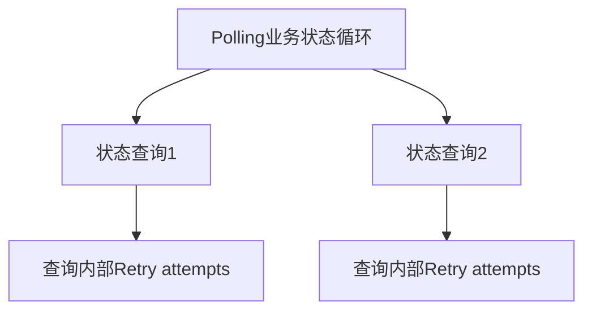

核心问题是：

> 请求耗时、Retry 等待和轮询间隔都在消耗时间，谁来保证 Polling 内核的状态等待阶段不超过 `poll_timeout`？

---

## 1. 第一性原理：Polling 等待的是业务终态

### 1.1 HTTP 成功不等于业务完成

异步任务的查询接口可能返回 HTTP 200，但 Body 中的状态仍是：

- `queued`。
- `running`。

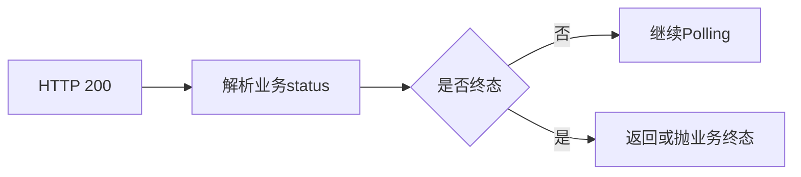

Retry 看到 HTTP 200 通常会停止；Polling 必须继续解释业务状态。

### 1.2 为什么不能只限制循环次数

同样的轮询次数，实际耗时可能完全不同：

- 网络请求耗时变化。
- 每次查询内部 Retry 次数变化。
- Retry backoff 变化。
- `poll_interval` 变化。

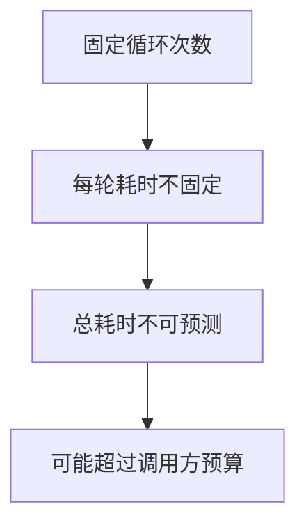

因此，Polling 使用绝对 deadline，而不是只看次数。

### 1.3 TOC 约束：每层各自计时

如果 Polling、Retry 和单次请求分别维护互不相关的 timeout：

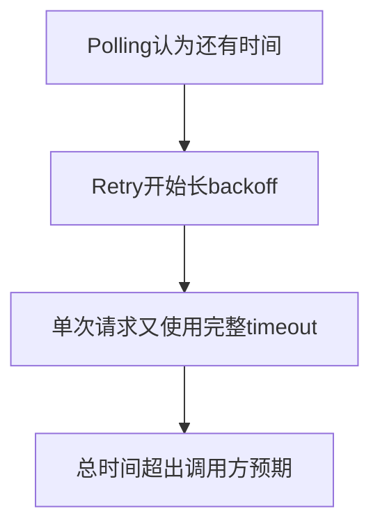

解约束方式是让所有内层动作读取同一个绝对 deadline。

---

## 2. `PollingPolicy` 的职责

### 2.1 Policy 字段

先打开 `common/polling.py` 中的 `PollingPolicy` 字段部分：

```python
class PollingPolicy(BaseModel):
    model_config = ConfigDict(frozen=True)

    status_json_path: str = "$.status"
    pending: frozenset[Any] = frozenset({"queued", "running"})
    success: frozenset[Any] = frozenset({"succeeded"})
    failure: frozenset[Any] = frozenset({"failed", "cancelled"})
    result_json_path: str | None = None
    error_json_path: str | None = "$.error"
    unknown: str = "fail"
```

输入是调用方选择的JSONPath、状态集合和unknown策略，其余使用默认值；输出是冻结的分类合同。Policy不保存当前Response、查询次数、deadline或Transition，这些运行状态由Polling循环拥有。

| 字段 | 主要含义 |
| --- | --- |
| `status_json_path` | 从 Response Body 读取状态 |
| `pending` | 继续等待的状态集合 |
| `success` | 成功终态集合 |
| `failure` | 失败终态集合 |
| `result_json_path` | 结果存在时可直接判成功 |
| `error_json_path` | 错误存在时优先判失败 |
| `unknown` | 未知状态处理策略 |

默认状态集合为：

```text
pending: queued, running
success: succeeded
failure: failed, cancelled
```

### 2.2 冻结合同

PollingPolicy 是冻结模型。一次轮询过程中，状态分类规则不应被动态修改。

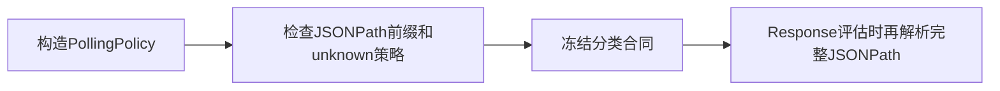

### 2.3 JSONPath 前缀检查与延迟解析

构造 Policy 时只检查状态、结果和错误路径是否以 `$` 开头；这不是完整 JSONPath 语法验证。完整路径由 `parse(...)` 在 Response 评估阶段解析，因此“缺少 `$`”会在进入循环前被拒绝，而其他语法错误可能到首次评估时才暴露。

以必填状态路径为例，字段验证器只委托前缀检查：

```python
@field_validator("status_json_path")
@classmethod
def _validate_status_json_path(cls, value: str) -> str:
    _validate_json_path("status_json_path", value)
    return value
```

实际辅助函数也只检查首字符：

```python
def _validate_json_path(name: str, json_path: str) -> None:
    if not json_path.startswith("$"):
        raise ValueError(f"{name} must start with '$', current value: {json_path!r}")
```

输入是字段名与路径文本，输出是验证通过或`ValueError`。函数不调用JSONPath解析器，因此不能把Policy构造成功解释为表达式语法完整有效。

真正的解析发生在Response评估阶段：

```python
def _extract_json_path_value(body: Any, json_path: str) -> Any:
    matches = [match.value for match in parse(json_path).find(body)]
    if not matches:
        return None
    return matches[0] if len(matches) == 1 else matches
```

输入是已解析Body和JSONPath文本。解析器在这里才读取完整表达式；无匹配返回`None`，单个匹配返回值本身，多个匹配返回列表。语法错误会在此处向上传播，并由本轮Response评估失败分支处理。

---

## 3. 四种状态

`PollingState` 包含：

```python
class PollingState(Enum):
    PENDING = "pending"
    SUCCESS = "success"
    FAILURE = "failure"
    UNKNOWN = "unknown"
```

枚举输入来自Response评估结果，输出是循环能够稳定比较的四类状态。它只描述业务状态分类；timeout由时钟产生，不属于这个枚举。

### 3.1 PENDING

业务仍在进行，需要在预算允许时等待后再次查询。

### 3.2 SUCCESS

业务已经成功完成，可以返回当前 Response。

### 3.3 FAILURE

业务已经到达失败终态，应抛出 `PollingFailedError`。

### 3.4 UNKNOWN

状态无法归入已知集合，默认抛出 `PollingUnknownStateError`。

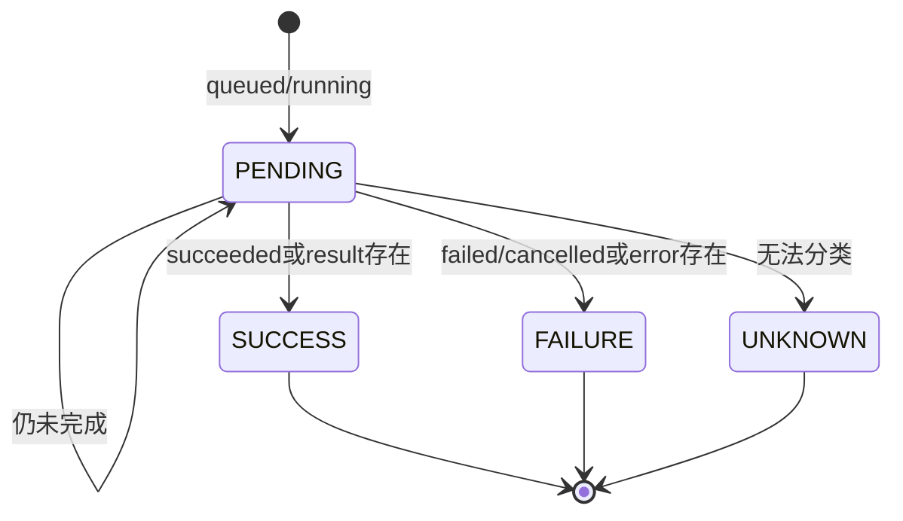

timeout 不属于 Response 的业务状态，而是循环预算终态。

---

## 4. Response 评估优先级

### 4.1 先解析 JSON

Response Body 不是合法 JSON 时，评估抛出 AssertionError，并使用脱敏、截断后的响应文本提供诊断。

打开 `evaluate_polling_response()`，先看JSON解析与状态字段提取。下面是函数开头的连续摘录，其他决策分支在后续小节继续出现：

```python
def evaluate_polling_response(response: requests.Response, policy: PollingPolicy) -> PollingEvaluation:
    try:
        body = response.json()
    except ValueError as exc:
        raise AssertionError(f"polling response body is not valid JSON: {_redact_response_text(response)}") from exc

    raw_status = _extract_json_path_value(body, policy.status_json_path)
```

输入是本轮Response与冻结Policy。JSON解析失败时，函数用脱敏、截断后的文本构造评估异常；解析成功后才按状态路径提取`raw_status`。此时尚未形成PENDING或终态，必须继续检查错误与结果路径。

### 4.2 错误路径优先

如果 `error_json_path` 存在且提取结果 `is not None`，直接判定 FAILURE。

```python
if policy.error_json_path is not None:
    error_value = _extract_json_path_value(body, policy.error_json_path)
    if error_value is not None:
        return PollingEvaluation(
            state=PollingState.FAILURE,
            raw_status=raw_status if raw_status is not None else error_value,
            error_value=error_value,
        )
```

输入是已经解析的Body与可选错误路径。只要提取值不是`None`就立即返回FAILURE Evaluation；错误值即使是空字符串、`False`或0也会命中。该分支优先返回，因此后面的结果字段不能覆盖已经成立的错误事实。

### 4.3 结果路径其次

没有错误结论时，如果 `result_json_path` 的提取结果 `is not None`，判定 SUCCESS。

```python
if policy.result_json_path is not None:
    result_value = _extract_json_path_value(body, policy.result_json_path)
    if result_value is not None:
        return PollingEvaluation(
            state=PollingState.SUCCESS,
            raw_status=raw_status,
            result_value=result_value,
        )
```

输入仍是同一Body，但只有错误分支未返回时才执行。非`None`结果生成SUCCESS Evaluation并保留结果值；函数只解释Response，不返回业务Response本身。

这里判断的不是 Python 真值。空字符串、空列表、空字典、`False` 和 `0` 都不是 `None`，仍会分别触发 FAILURE 或 SUCCESS。

### 4.4 最后解释 status

只有错误和结果都没有形成结论时，才根据 `raw_status` 落入 pending、success、failure 或 unknown。

```python
if raw_status in policy.pending:
    return PollingEvaluation(state=PollingState.PENDING, raw_status=raw_status)
if raw_status in policy.success:
    return PollingEvaluation(state=PollingState.SUCCESS, raw_status=raw_status)
if raw_status in policy.failure:
    return PollingEvaluation(state=PollingState.FAILURE, raw_status=raw_status)
```

输入是前面提取的原始状态。集合按pending、success、failure顺序判断并返回Evaluation；Policy应避免把同一值重复放入多个集合，否则较早集合拥有优先级。没有命中时才交给unknown策略。

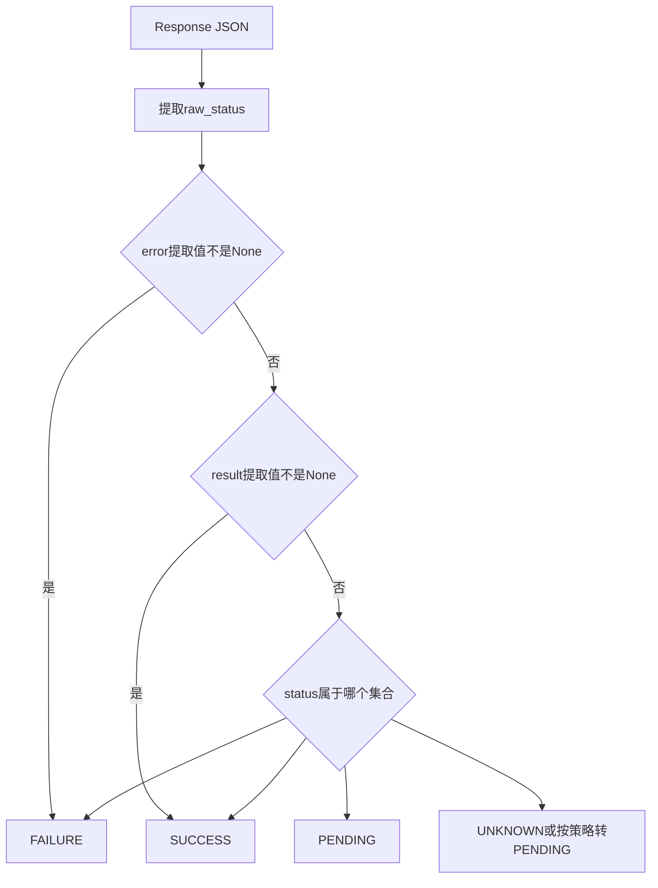

错误优先于结果，避免同一响应同时含错误与旧结果时被误判成功。

### 4.5 HTTP 状态码不会自动替代 Body 评估

当前 Polling 路径不会对每个 Response 自动调用 `raise_for_status()`。无 Retry 时返回的非 2xx Response，或 Retry 耗尽后保留下来的非 2xx Response，仍会进入 JSON Body 与 Polling 状态评估；如果 Body 不满足合同，最终暴露的是相应的解析或状态异常。

---

## 5. unknown 策略

`unknown` 允许三个值：

构造阶段先限制策略取值：

```python
@field_validator("unknown")
@classmethod
def _validate_unknown(cls, value: str) -> str:
    if value not in {"fail", "pending", "ignore"}:
        raise ValueError("unknown must be 'fail', 'pending', or 'ignore'")
    return value
```

输入是unknown文本，输出是验证后的策略值；其他字符串在进入循环前被拒绝。

| 策略 | 评估结果 |
| --- | --- |
| `fail` | 返回 UNKNOWN，循环抛未知状态异常 |
| `pending` | 把未知值当 PENDING |
| `ignore` | 当前实现同样映射为 PENDING |

Response评估函数的最后两行负责实际映射：

```python
if policy.unknown in {"pending", "ignore"}:
    return PollingEvaluation(state=PollingState.PENDING, raw_status=raw_status)
return PollingEvaluation(state=PollingState.UNKNOWN, raw_status=raw_status)
```

输入是未命中任何集合的`raw_status`。`pending`与`ignore`都返回PENDING，只有默认`fail`返回UNKNOWN；这里没有“忽略后立即成功”的分支。

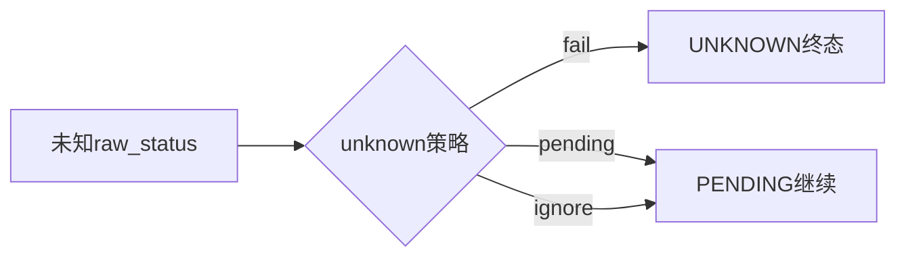

把未知状态当 pending 会提高兼容性，但也可能掩盖服务端协议变化，最终只能由总 deadline 收口。

---

## 6. `PollingEvaluation` 与 `PollingTransition`

### 6.1 Evaluation 是单次解释结果

它保存：

```python
class PollingEvaluation(BaseModel):
    model_config = ConfigDict(frozen=True)

    state: PollingState
    raw_status: Any
    result_value: Any = None
    error_value: Any = None
```

构造输入来自一次`evaluate_polling_response()`调用，输出是冻结的单次解释结果。它不保存Response、观察时间或历史Transition，也不决定循环是否还有预算。

- 分类后的 `state`。
- 原始 `raw_status`。
- 可选 `result_value`。
- 可选 `error_value`。

### 6.2 Transition 是时间线记录

每次业务状态查询完成后，追加一条 Transition：

`PollingTransition` 的字段部分定义为：

```python
class PollingTransition(BaseModel):
    model_config = ConfigDict(frozen=True)

    attempt_index: int
    elapsed_seconds: float
    state: PollingState
    raw_status: Any
    response_status_code: int
```

构造输入由Polling循环在观察Response后提供，输出是一条冻结时间线记录。它只保存本轮查询摘要，不持有Response对象，也不表示下一轮已经开始。

- `attempt_index`：第几次 Polling 查询。
- `elapsed_seconds`：从 Polling 开始经过多久。
- `state`。
- `raw_status`。
- Response 状态码。

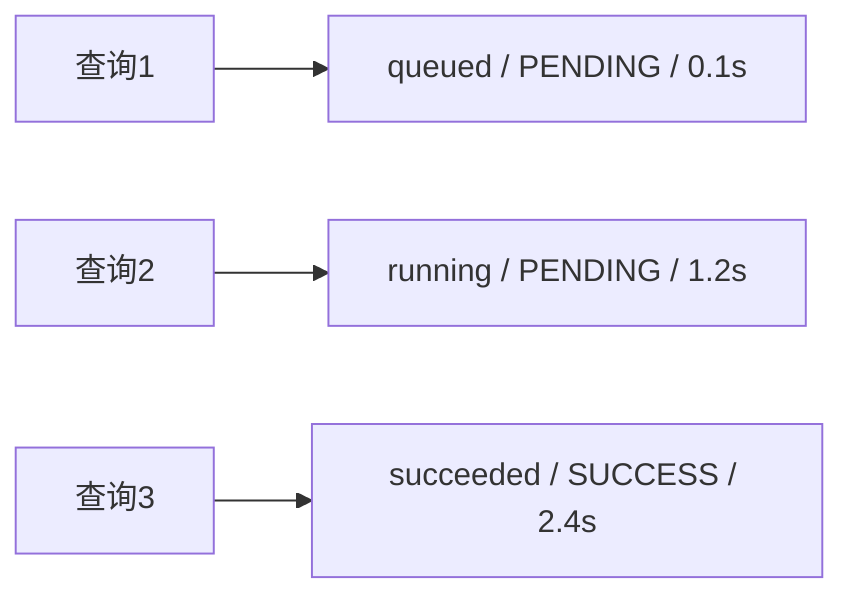

### 6.3 attempt_index 不等于 Retry attempt

PollingTransition 的 `attempt_index` 表示第几次业务状态查询。每次查询内部可能还有多个 Retry attempt。

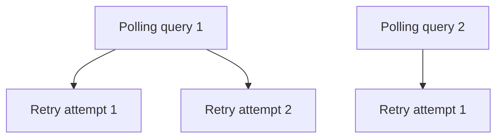

两个索引属于不同循环层级。

---

## 7. 统一 deadline

### 7.1 deadline 如何形成

公开入口`BaseRequest.poll_get()`先把可选timeout解析成一个正数总预算：

```python
if poll_interval <= 0:
    raise ValueError("poll_interval must be greater than 0")

timeout = self.config.timeout if poll_timeout is None else poll_timeout
if timeout <= 0:
    raise ValueError("poll_timeout must be greater than 0")
```

输入是调用方的轮询间隔与可选`poll_timeout`；未显式提供时使用配置timeout，非正数在进入状态循环前被拒绝。输出是一个确定的`timeout`值，但此时尚未计算绝对deadline。

随后公开入口把该值交给内核：

```python
response = self._poll_get_with_policy(
    path,
    poll_interval=poll_interval,
    timeout=timeout,
    polling_policy=polling_policy,
    retry_policy=retry_policy,
    runtime_polling=polling,
    **kwargs,
)
```

这段聚焦摘录只展示参数转移；公开入口外围还负责运行观察的成功与异常收尾。内核接收的是同一份timeout、Policy与可选RetryPolicy，不会为每轮重新调用配置解析。

Polling 开始时记录单调时钟：

```python
started_at = self.retry_executor.monotonic()
deadline = started_at + timeout
transitions: list[PollingTransition] = []
last_response: requests.Response | None = None
last_status: Any = None
last_logger: ApiCallLogger | None = None
attempt_index = 0
```

这段代码位于`BaseRequest._poll_get_with_policy()`开头。输入是已验证的总timeout，输出是一次绝对deadline以及本轮Polling独享的状态容器。deadline只创建一次；`last_response`、`last_status`和transitions用于保留最近事实，不会在每轮重新初始化。

以后不再为每轮重新生成 timeout，而是反复计算：

```text
remaining = deadline - now
```

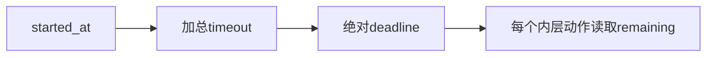

### 7.2 deadline 覆盖哪些时间

- 状态查询的网络耗时。
- 查询内部 Retry attempt。
- Retry backoff。
- Response 评估时间。
- Polling 间隔 sleep。

这个范围准确对应 `_poll_get_with_policy()` 内部的轮询内核。`poll_get()` 成功返回后，外层 `download_links_from_poll_get` 装饰器还可能同步执行输出 Capture；这段下载不受该 deadline 约束，因此公开 `poll_get()` 的墙钟耗时可能超过 `poll_timeout`。

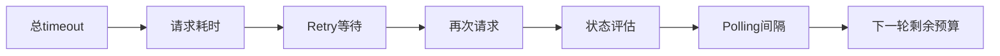

### 7.3 为什么使用单调时钟

单调时钟不受系统时间向前或向后调整影响，更适合计算经过时间与 deadline。

---

## 8. Polling 主循环

先沿`_poll_get_with_policy()`进入每轮查询。下面摘录从循环开始到Retry deadline翻译，状态评估将在下一段出现：

```python
while True:
    attempt_index += 1
    try:
        last_response, last_logger = self._request_without_attach(
            "GET",
            path,
            step_name=POLL_GET_REQUEST_STEP_NAME,
            response_step_name=POLL_GET_RESPONSE_STEP_NAME,
            retry_policy=retry_policy,
            protocol="polling",
            polling_policy=polling_policy,
            deadline=deadline,
            **kwargs,
        )
    except RetryDeadlineExceeded as error:
        raise PollingTimeoutError(
            path=path,
            timeout=timeout,
            last_status=last_status,
            last_response=(
                error.last_response
                if error.last_response is not None
                else last_response
            ),
            transitions=transitions,
        ) from error
```

每轮先增加的是Polling查询序号，再把同一个绝对deadline传给请求与可选Retry。正常输出是Response与本轮Logger；内层若因deadline终止，则转换为PollingTimeoutError，并优先保留Retry携带的最后Response，否则使用此前轮次的Response。循环不把Retry预算异常暴露成另一套外层终态。

### 8.1 Retry deadline 如何翻译

某次查询内部若抛出 `RetryDeadlineExceeded`，Polling 会翻译为 `PollingTimeoutError`，保留已有 `last_response` 和 transitions。

这样外层调用者看到的是 Polling 总预算耗尽，而不是误以为只有单次 Retry 失败。

### 8.2 Response 评估失败

如果 JSON 无法解析或状态提取异常，当前 logger 会附加 Response 成功事实后重新抛出评估异常。HTTP 请求成功与业务评估失败仍是两类事实。

对应实现紧接在查询之后：

```python
try:
    evaluation = evaluate_polling_response(last_response, polling_policy)
except Exception:
    last_logger.attach_success(last_response)
    raise
```

输入是已成功返回的HTTP Response。评估成功时输出Evaluation并继续状态机；评估的普通异常发生时，Logger仍记录HTTP Response事实，然后裸`raise`保留原评估异常。该分支没有Transition，因为Evaluation尚未形成。

---

## 9. 为什么成功也要先检查 deadline

当前循环在评估并记录状态后，先计算 `remaining`，再处理 SUCCESS。

打开循环中Evaluation之后的连续片段：

```python
last_status = evaluation.raw_status
if runtime_polling is not None:
    runtime_polling.observe_state(evaluation.state.value)
observed_at = self.retry_executor.monotonic()
transitions.append(
    PollingTransition(
        attempt_index=attempt_index,
        elapsed_seconds=round(observed_at - started_at, 3),
        state=evaluation.state,
        raw_status=evaluation.raw_status,
        response_status_code=last_response.status_code,
    )
)

remaining = deadline - observed_at
if remaining <= 0:
    self._attach_polling_transitions(last_logger, transitions)
    last_logger.attach_success(last_response)
    raise PollingTimeoutError(
        path=path,
        timeout=timeout,
        last_status=last_status,
        last_response=last_response,
        transitions=transitions,
    )
```

输入是Evaluation、Response和本轮观察时刻。循环先保存状态并追加Transition，再计算剩余时间；即使Evaluation已经是SUCCESS，只要观察时刻不早于deadline，也先形成TIMEOUT。输出是更新后的历史，或携带当前Response与历史的超时异常。

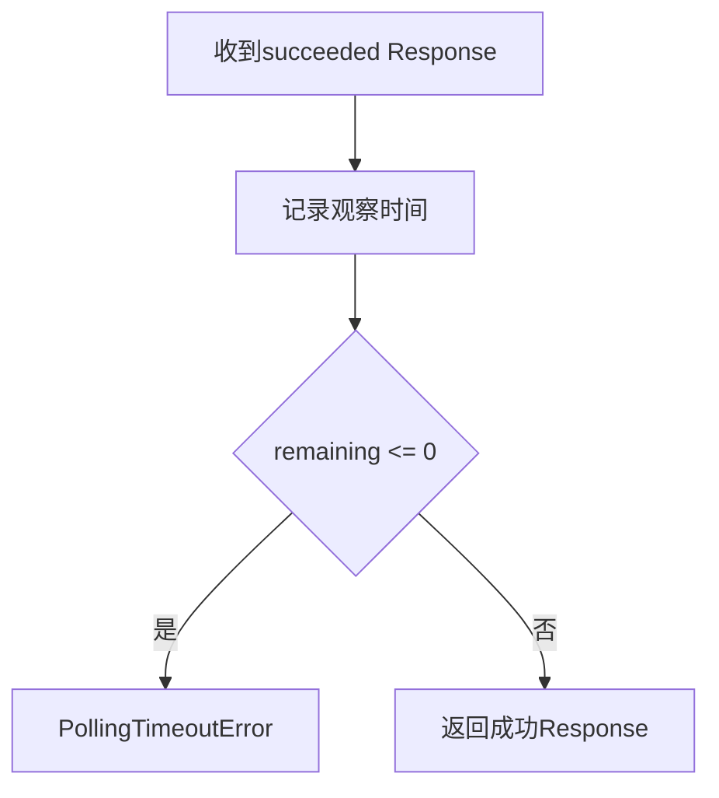

这意味着：

> 成功状态如果在 deadline 之后才被观察到，仍然属于超时。

否则框架会把“迟到的成功”解释成预算内成功，破坏调用方的总时间合同。

---

## 10. 四类终态

### 10.1 SUCCESS

前提：

- Evaluation 为 SUCCESS。
- 观察时仍有剩余时间。

结果：附加 transitions 与 Response 记录，返回当前 Response。

```python
if evaluation.state is PollingState.SUCCESS:
    self._attach_polling_transitions(last_logger, transitions)
    last_logger.attach_success(last_response)
    return last_response
```

输入是预算检查已经通过的SUCCESS Evaluation、当前Response与完整Transition列表。函数先附加状态演进和HTTP诊断，再返回同一个Response；它不创建新的结果对象，也不执行下一轮查询。

### 10.2 FAILURE

业务状态进入 failure 集合，或 `error_json_path` 有值。

结果：抛出 `PollingFailedError`，携带：

- path。
- last_status。
- last_response。
- transitions。
- error_value。

```python
if evaluation.state is PollingState.FAILURE:
    self._attach_polling_transitions(last_logger, transitions)
    last_logger.attach_success(last_response)
    raise PollingFailedError(
        path=path,
        last_status=last_status,
        last_response=last_response,
        transitions=transitions,
        error_value=evaluation.error_value,
    )
```

输入是FAILURE Evaluation与本轮已成立的HTTP事实。Logger仍按成功Response记录传输结果，随后状态机抛出业务失败异常；该异常保留Response、Transition和错误字段，但不会把HTTP调用改写成传输异常。

### 10.3 UNKNOWN

未知状态且策略为 `fail`，抛出 `PollingUnknownStateError`，保留上下文。

```python
if evaluation.state is PollingState.UNKNOWN:
    self._attach_polling_transitions(last_logger, transitions)
    last_logger.attach_success(last_response)
    raise PollingUnknownStateError(
        path=path,
        last_status=last_status,
        last_response=last_response,
        transitions=transitions,
    )
```

输入是UNKNOWN Evaluation。循环附加已观察事实后终止，不把未知值自动升级为失败集合成员；异常类型单独表达“协议无法分类”。

### 10.4 TIMEOUT

以下情况都会成为 PollingTimeoutError：

- 某轮请求开始前已无预算。
- 查询内部 Retry 等待无法放入 deadline。
- Response 在 deadline 后才观察到。
- PENDING 状态持续到总预算耗尽。

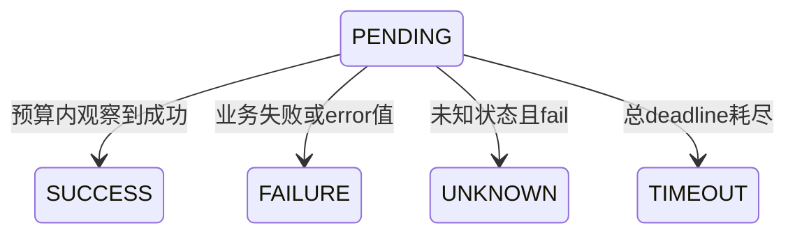

### 10.5 异常为什么保存 transitions

只给出“超时”无法解释任务经历了什么。Transition 序列提供：

```text
queued → running → running → timeout
```

它是诊断状态演进的证据，不是重新执行结果。

FAILURE与UNKNOWN异常共享的上下文字段由`PollingError`统一保存：

```python
class PollingError(AssertionError):
    def __init__(
        self,
        message: str,
        *,
        path: str,
        last_status: Any,
        last_response: requests.Response | None,
        transitions: list[PollingTransition],
    ):
        super().__init__(message)
        self.path = path
        self.last_status = last_status
        self.last_response = last_response
        self.transitions = transitions
```

输入是终态消息及最近查询上下文，输出是保留诊断字段的断言型异常。它只保存列表引用和Response引用，不重新执行状态查询，也不关闭Response。

---

## 11. Retry 与 Polling 的双层预算

### 11.1 内外两层循环

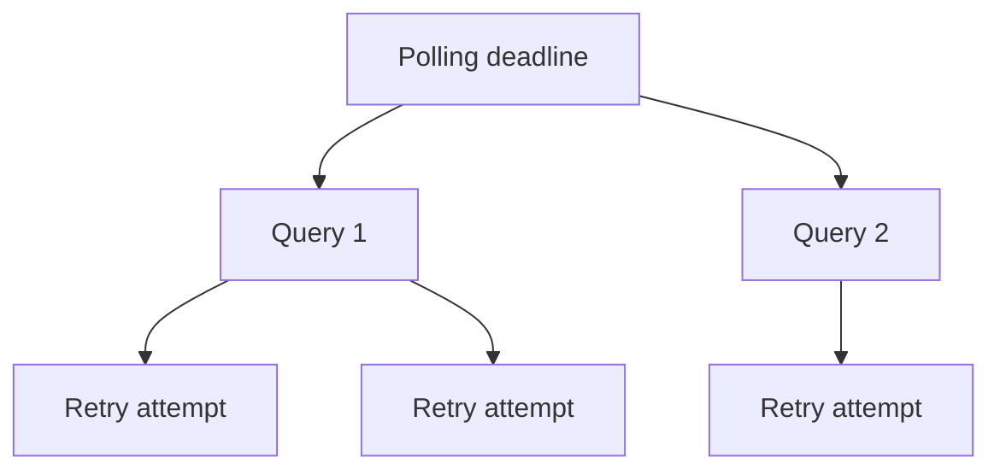

### 11.2 预算扣减顺序

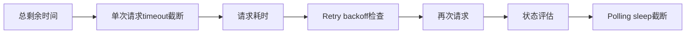

### 11.3 两种等待不能混淆

| 等待 | 原因 | 所有者 |
| --- | --- | --- |
| Retry wait | 上一次请求失败，准备重新发送同一动作 | RetryExecutor |
| Polling interval | 上一次查询成功，但业务仍为 pending | Polling loop |

两种等待都消耗同一个 deadline。

### 11.4 `min(poll_interval, remaining)`

PENDING 后的 sleep 不会超过剩余时间。即使 `poll_interval` 很长，也只等待到 deadline。

循环尾部的实际实现是：

```python
sleep_seconds = min(poll_interval, remaining)
sleep_started_at = self.retry_executor.monotonic()
try:
    self.retry_executor.sleeper(sleep_seconds)
finally:
    if runtime_polling is not None:
        runtime_polling.add_sleep(
            self.retry_executor.monotonic() - sleep_started_at,
        )
```

输入是配置间隔与本轮剩余预算，输出是一次不超过deadline的Polling等待。等待由与Retry共享的可注入sleeper执行，但原因属于PENDING业务状态；`finally`只记录实际等待观察，不论sleeper是否正常返回，都不把这次等待改称Retry backoff。

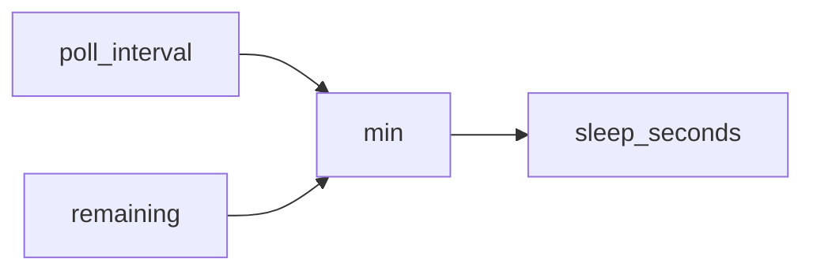

---

## 12. 证据边界与常见误解

### 12.1 状态机单元测试证明

- Policy 验证与冻结。
- pending/success/failure/unknown 分类。
- error 与 result 路径优先级。
- 非法 JSON 的脱敏诊断。
- 异常携带状态与 transitions。

### 12.2 BaseRequest 协作测试证明

- 成功、失败、未知和 timeout 路径。
- deadline 后观察到成功仍超时。
- 单次查询内部可以使用 RetryPolicy。
- Retry backoff 不能越过 Polling deadline。

### 12.3 离线分类测试证明

- loopback 服务中完整状态迁移到成功。
- 业务失败被正确报告。
- 未知状态被拒绝。
- 总 deadline 被执行。

### 12.4 不能证明什么

- 真实外部服务一定按相同状态集合工作。
- timeout 后服务端任务已经停止。
- Polling 可以替代取消接口。
- SSE 流式连接可以使用同一生命周期模型。

### 12.5 常见误解

| 误解 | 准确解释 |
| --- | --- |
| HTTP 200 就是 Polling 成功 | 还要解释业务状态或结果字段 |
| Polling 次数决定总耗时 | 网络、Retry 和等待都影响时间 |
| unknown=ignore 表示立即忽略并成功 | 当前实现映射为 PENDING |
| Retry 和 Polling 使用不同总预算 | 内层 Retry 读取 Polling deadline |
| succeeded 响应永远成功 | deadline 后观察仍是 timeout |
| timeout 表示服务端任务已取消 | 它只表示客户端停止等待 |

---

## 13. 第二周整合与向 Day 11 交付

### 13.1 第二周五个模型

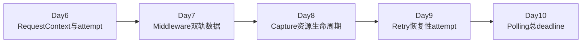

### 13.2 一次可靠请求主线

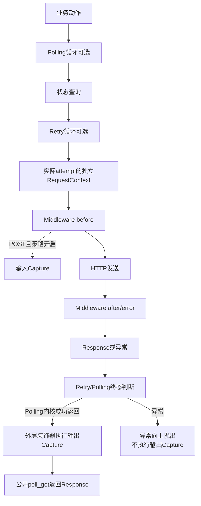

### 13.3 三类预算

| 预算 | 控制对象 |
| --- | --- |
| 单次 timeout | 一个 attempt 的网络等待 |
| Retry max_attempts/max_elapsed | 同一请求动作的恢复尝试 |
| Polling deadline | `_poll_get_with_policy()` 内的业务状态等待过程，不含成功返回后的同步输出 Capture |

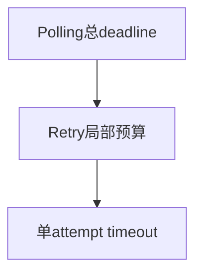

外层预算约束内层预算，而不是三套时间可以相互叠加。

### 13.4 向 Day 11 交付

第二周处理的都是普通 Response：一次发送最终得到一个完整响应对象。

Day 11 将改变响应形态：

```mermaid
flowchart LR
    A[普通Response<br/>一次性完整结果] --> B[SSE连接<br/>持续产生事件]
```

下一课将回答：

> 当连接持续开放、事件逐条到达时，谁拥有连接、迭代器、停止条件和关闭责任？
