# 第 11 天：流式响应与资源生命周期

> **课程定位**：从 Day10 的普通 Response 所有权模型出发，解释流式 Response 在请求、逐行消费、协议终止与资源清理之间如何传递责任  
> **Module 层落点**：模块 Request 声明流式传输，模块 Task 消费事件并在 `finally` 关闭 Response，Test 只编排场景和调用领域断言  
> **讲解重点**：`stream=True`、`iter_sse_lines()`、Task 层协议判断、`finally: response.close()`、中断缺口与测试证据边界  
> **课程形式**：纯讲解，不设置实操、练习、作业、小测、命令执行要求、教学门禁或成果模板  
> **本课边界**：只解释当前 Smoke 流式路径，不展开 `common.runtime_hooks` 在 Day18/Day20 才会讨论的内部机制
> **源码依据**：`common/streaming.py`、`module/smoke/request.py`、`module/smoke/task.py` 与 `tests/test_stream_fault_simulation.py`

---

## 0. 从 Day10 读取普通 Response 所有权模型

本课从 Day10 已经交付的普通 Response 所有权模型开始。

Day10 中，Polling 内核持续查询业务状态。

当业务进入成功终态时，内核把“当前这个普通 Response”返回给外层调用者。

这个模型包含三个重要前提：

- 一次响应对象代表一次已经返回的 HTTP 响应结果。
- Polling 判断的是业务终态，而不是持续消费中的事件边界。
- Response 从内层返回后，后续使用责任随对象一起交给外层。

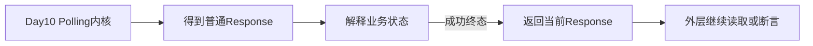

Day11 不推翻这个所有权模型。

Day11 改变的是 Response 的内部时间形态。

普通 Response 更接近“一次得到一个可整体解释的结果”。

流式 Response 则是“先得到响应对象，再在一段时间内不断得到行”。

因此，Response 被返回不再表示响应内容已经消费完毕。

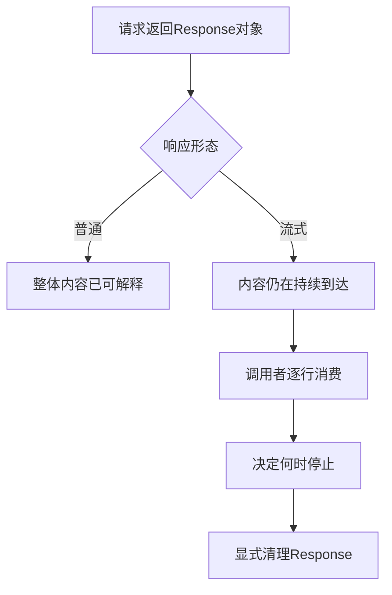

本课要完成的转换是：

> 从“谁接收返回的 Response”，推进到“谁在整个消费期间稳定拥有 Response，并保证所有出口都执行清理”。

---

## 1. 第一性原理：流式响应同时存在两条生命周期

### 1.1 语义生命周期

语义生命周期回答：

> 业务数据是否已经按当前协议规则完整结束？

在当前 Smoke 路径中，最显眼的语义结束标志是：

`data: [DONE]`

但“看到 DONE”只是一条业务协议事实。

它不是 socket 状态。

它不是 Python 迭代器自然结束。

它也不是 `Response.close()` 已经执行的证明。

### 1.2 资源生命周期

资源生命周期回答：

> 谁仍然持有响应对象、底层读取能力以及尚未释放的网络资源？

当前 Task 层用 `finally: response.close()` 结束自己负责的 Response 使用期。

这个动作与“是否成功看到 DONE”必须分开理解。

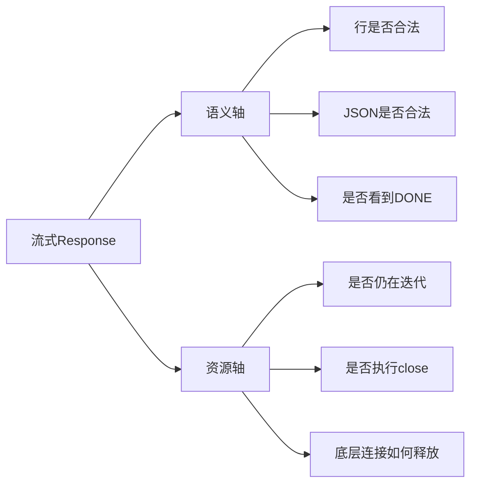

### 1.3 为什么必须双轴建模

如果只看语义轴，会出现一个错误推理：

1. 看到了 DONE。
2. 所以业务结束。
3. 所以资源已经关闭。

第三步没有事实依据。

如果只看资源轴，也会出现另一个错误推理：

1. `response.close()` 已执行。
2. 所以这次流式响应完整成功。

同样没有事实依据。

非法 JSON、非 `data:` 行、缺少 DONE 和中途异常都可以在最终执行 close。

因此：

> close 证明清理路径被触发，不证明业务协议成功；DONE 证明特定语义标志出现，不证明资源已经释放。

---

## 2. TOC：系统真正的约束是责任跨层

### 2.1 表面问题与真实问题

表面问题像是：

- 如何逐行读取 SSE。
- 如何把一行转成 JSON。
- 如何在 DONE 时停止。

这些都不是最深层约束。

真正的约束是：

> 同一个 Response 跨过 Request 层、common 迭代层和 Task 层，但每一层只掌握部分事实。

Request 层知道如何发起流式请求。

common 层知道如何把原始行转成交付行。

Task 层知道 Smoke 场景接受什么协议形态。

只有稳定的消费所有者才能把异常出口与 close 统一起来。

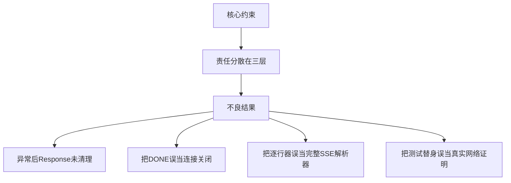

### 2.2 TOC 因果链

因果链可以继续向下挖：

1. 流式内容不是一次性材料，而是持续到达的时间序列。
2. 持续到达意味着消费可能从多个出口结束。
3. 多出口意味着成功路径上的清理不足以覆盖系统。
4. 清理若分散在分支中，就容易漏掉某个异常分支。
5. 因此需要一个覆盖消费区间的稳定所有者。
6. 稳定所有者必须用 `finally` 统一登记清理动作。

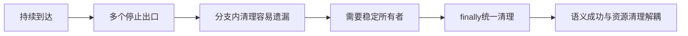

### 2.3 本课的责任分配

当前代码的责任分配不是“每层都做一点相同的事”。

它更接近以下边界：

| 层级 | 当前职责 | 当前不承担的职责 |
| --- | --- | --- |
| Request | 发起请求并启用流式读取 | 不验证响应 `Content-Type` |
| `iter_sse_lines()` | 跳过空行、容错解码、逐行交付、发出直接生命周期调用 | 不解析 JSON，不验证 `data:`，不关闭 Response |
| Task collect | 验证 `data:`、解析 JSON、识别 DONE、检查结尾、关闭 Response | 不实现完整 SSE 语法 |
| Task interrupt | 按时间或 DONE 停止、返回 request_id、关闭 Response | 不断言每个非空行都必须是 `data:` |

这张表是本课后续所有判断的基准。

---

## 3. Request 层：提出流式意图，不证明响应类型

### 3.1 当前请求实际设置了什么

`SmokeRequest.create_stream_chat_completion()` 调用 `post()`。

先打开 `module/smoke/request.py` 中的真实入口：

```python
def create_stream_chat_completion(self, payload: dict[str, Any]) -> requests.Response:
    return self.post(
        self.chat_completions_path,
        json=payload,
        headers={"Accept": "text/event-stream"},
        stream=True,
        _attach_log=False,
        _quality_operation_name="chat_completion_stream",
        _quality_traffic_role="workload",
    )
```

输入是业务payload，输出是`BaseRequest.post()`返回的Response。函数只设置请求路径、JSON、Accept、`stream=True`及观察参数；它不读取响应Header、不迭代正文，也不关闭Response。资源所有权因此继续转移给后续消费者。

与流式传输直接相关的设置只有：

- 请求头 `Accept: text/event-stream`。
- `stream=True`。

此外还有日志和质量元数据参数。

它们不改变本课的协议边界。

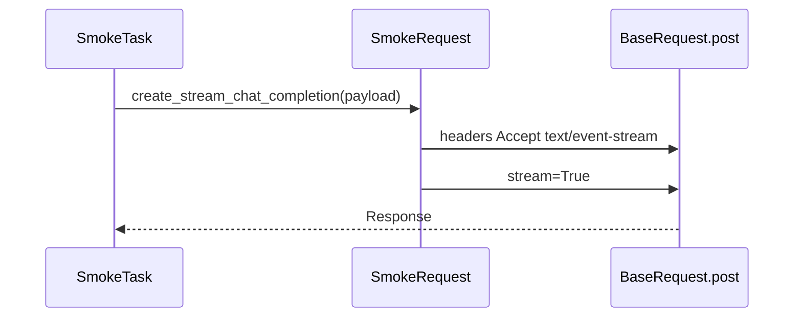

业务 payload 的构造器也放入了 `stream: true`。

这表达服务端业务接口应采用流式输出。

而 `post(..., stream=True)` 表达客户端不要在返回前急切消费完整响应体。

两者位于不同层次，不能互相替代。

### 3.2 `Accept` 不是响应 Header 验证

`Accept: text/event-stream` 是客户端向服务端表达偏好。

它不等于服务端已经返回：

`Content-Type: text/event-stream`

当前 `create_stream_chat_completion()` 没有读取响应 `Content-Type`。

当前 `collect_stream_chat_completion_chunks()` 也没有读取响应 `Content-Type`。

当前 `interrupt_stream_chat_completion()` 同样没有读取响应 `Content-Type`。

因此，本课只能陈述：

> 当前代码发出了 SSE 接受意图，但没有完成响应 `Content-Type` 验证。

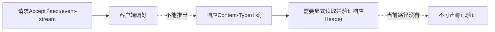

### 3.3 `stream=True` 也不是协议证明

`stream=True` 改变客户端消费响应体的方式。

它不检查每一行是否符合 SSE。

它不检查结束标志。

它不检查 JSON。

它不自动替 Task 决定何时 close。

所以 Request 层完成的是“建立可流式消费的 Response”。

它没有完成“证明这是一个合规 SSE 响应”。

---

## 4. `iter_sse_lines()`：逐行适配器，而不是完整协议解析器

### 4.1 初始状态

`common/streaming.py` 的 `iter_sse_lines(response)` 进入时先做三件事：

- 通过 `get_stream_lease(response)` 取得直接使用的 stream lease。
- 把 `completed` 初始化为 `False`。
- 把 `exhausted` 初始化为 `False`。

对应函数开头如下。这个连续摘录停在`try`入口，循环与收口将在后续小节继续出现：

```python
def iter_sse_lines(response: requests.Response) -> Iterator[str]:
    """Iterate decoded SSE lines while emitting fail-open lifecycle facts."""
    stream_lease = get_stream_lease(response)
    completed = False
    exhausted = False
    try:
```

输入是已经建立的流式Response。函数取得与该Response关联的观察lease，并初始化两个语义标志；它没有在入口读取正文或接管`response.close()`。输出形式是惰性Iterator，只有消费者请求下一项时，`try`中的读取才继续执行。

本课只点到这些 `common.runtime_hooks` 的直接调用位置。

本课不展开 lease 如何保存、去重、上报或收敛。

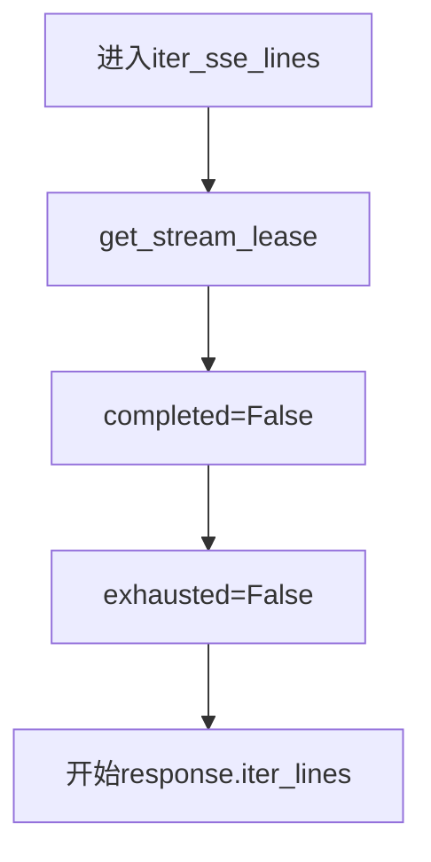

两个布尔量描述的是两类不同事实。

`completed` 表示是否观察到特定 DONE 文本。

`exhausted` 表示底层 `for` 是否自然走完，并执行到循环后的赋值。

它们不是同义词。

### 4.2 读取的是原始行

common 层调用：

`response.iter_lines(decode_unicode=False)`

实际循环入口是：

```python
for raw_line in response.iter_lines(decode_unicode=False):
```

输入由Response逐步产生，`decode_unicode=False`要求requests先交付原始bytes或底层替身提供的行。循环拥有逐行适配顺序，但Response及其连接仍由调用方负责关闭。

也就是说，它主动要求先取得未由 `requests` 自动解码的行。

之后再由自己的规则处理 bytes。

这样做把字符解码策略固定在当前 helper 中。

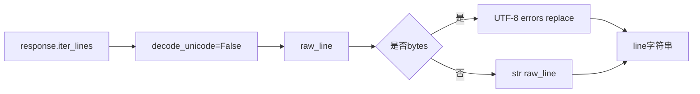

### 4.3 空行会被跳过

循环首先判断 `if not raw_line`。

```python
if not raw_line:
    continue
```

输入是当前原始行。空bytes、空字符串和其他假值在这里被消费且不向上yield；输出是继续读取下一行，因此上层看不到完整底层行序列。

为假的原始行会直接 `continue`。

因此空 bytes 和空字符串不会交给 Task 层。

这意味着 Task 层看到的不是底层完整行序列。

它看到的是已经去掉空行后的序列。

在完整 SSE 语义中，空行可能参与事件边界。

当前 helper 直接丢弃空行，所以它不能被描述为完整 SSE 事件解析器。

### 4.4 UTF-8 容错解码

当 `raw_line` 是 bytes 时，代码使用：

`raw_line.decode(utf-8, errors=replace)`

完整的类型分支是：

```python
line = (
    raw_line.decode("utf-8", errors="replace")
    if isinstance(raw_line, bytes)
    else str(raw_line)
)
```

输入是非空原始行，输出统一为字符串。bytes采用UTF-8容错解码，其他对象调用`str()`；转换不会保留无法解码字节的无损副本。

`errors=replace` 的含义是：

- 非法 UTF-8 字节不会在这里抛出 `UnicodeDecodeError`。
- 无法解码的部分会被替换字符代替。
- 后续 Task 得到的是容错后的文本，而不是原始字节的无损副本。

当 `raw_line` 不是 bytes 时，代码使用 `str(raw_line)`。

这个分支保证 helper 最终逐行交付字符串。

### 4.5 先观察，再判断 DONE，再 yield

每个非空、已解码的 `line` 先被观察，再判断 DONE，最后逐行交付。

具体顺序是：

1. 调用 `observe_stream_line(stream_lease, line)`。
2. 判断 `line.strip()` 是否精确等于 `data: [DONE]`。
3. 若相等，把 `completed` 设为 `True`。
4. `yield line` 给上层消费者。

源码顺序与上述责任一致：

```python
observe_stream_line(stream_lease, line)
if line.strip() == "data: [DONE]":
    completed = True
yield line
```

输入是解码后的line。观察调用先发生，精确DONE只改变`completed`标志，随后原line仍被yield；函数没有`break`，因此停止消费的决定继续属于上层Task。

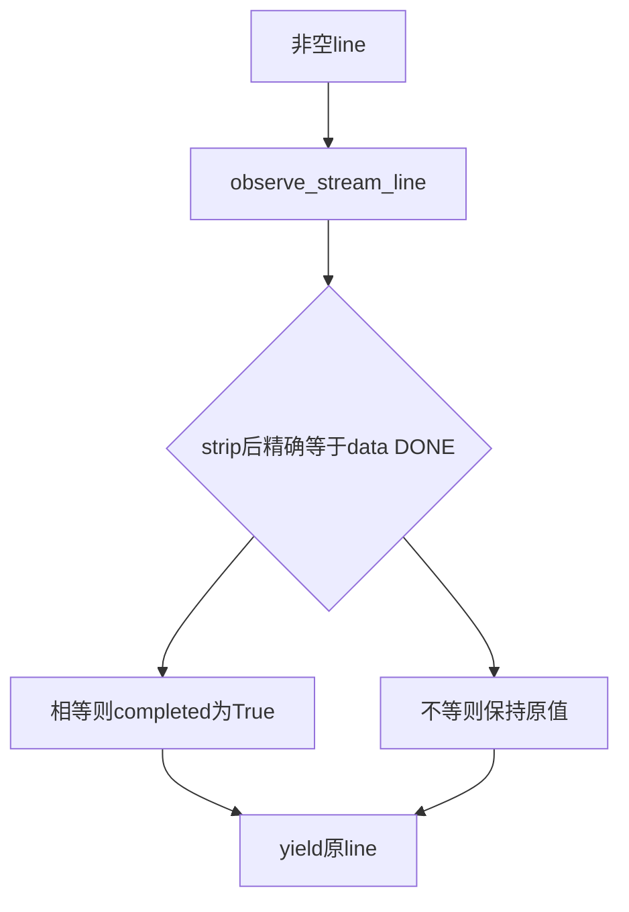

common 层判断 DONE 前会先执行 `strip()`。

所以“精确”指去掉行首行尾空白后，文本必须精确等于 `data: [DONE]`。

标记 `completed=True` 不会让 common 层自己 `break`。

DONE 行仍然会被 yield。

是否在 DONE 后停止消费，由上层 Task 决定。

---

## 5. common 层明确没有做什么

### 5.1 不解析 JSON

`iter_sse_lines()` 不调用 `json.loads()`。

它不知道 `data:` 后面是对象、数组、字符串、数字还是非法文本。

它只交付字符串行。

### 5.2 不验证 `data:` 前缀

除 DONE 特例外，common 层不要求行以 `data:` 开头。

`event:`、`id:`、`retry:` 或其他非空文本都会被观察并 yield。

上层接受、忽略还是拒绝，由具体 Task 决定。

### 5.3 不关闭 Response

`iter_sse_lines()` 内没有 `response.close()`。

它的 `finally` 处理 stream outcome 的直接调用。

它不是 Response 资源清理器。

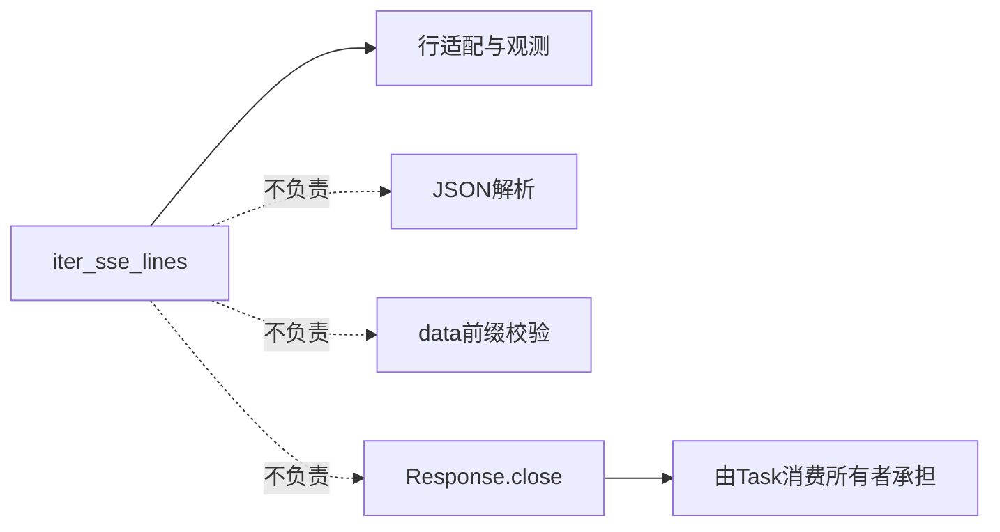

### 5.4 为什么不是完整 SSE 语法支持

完整 SSE 可能涉及多种字段和事件组合。

当前实现没有建立事件对象，也没有组合多行 `data:`。

它没有解释 `event:`，没有保存 `id:`，也没有应用 `retry:`。

它还会跳过空行，而不是利用空行组装事件边界。

准确表述是：

> 当前实现处理 Smoke 场景所需的逐行 `data:` 子集，不是完整 SSE 解析器。

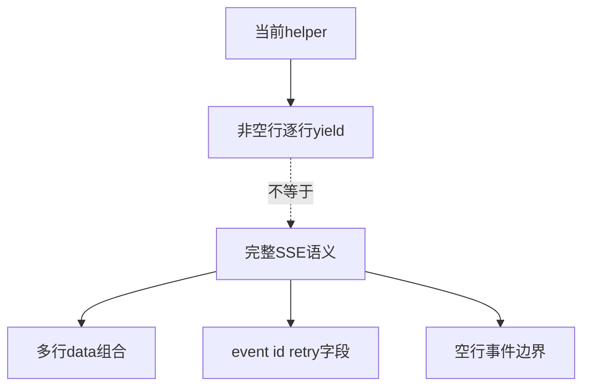

---

## 6. common 层的完成、耗尽与异常回调

### 6.1 `completed` 与 `exhausted`

底层 `for` 自然结束后，代码才把 `exhausted` 设为 `True`。

```python
exhausted = True
```

这行位于`for`循环之后、异常处理之前，只有底层迭代自然走完才会执行。消费者`break`只表示不再请求下一项；无论生成器随后何时退出，或读取过程中何时抛错，都不能由这行得到自然耗尽事实。

所以消费者主动停止、生成器退出或读取中抛错，都不等于自然耗尽。

`finally` 先看 `completed`，再看 `exhausted`。

当前两个未完成分支最终都直接调用 `INTERRUPTED`。

最终outcome选择集中在`finally`：

```python
finally:
    if completed:
        finish_stream(stream_lease, RuntimeStreamOutcome.COMPLETE)
    elif exhausted:
        finish_stream(stream_lease, RuntimeStreamOutcome.INTERRUPTED)
    else:
        finish_stream(stream_lease, RuntimeStreamOutcome.INTERRUPTED)
```

输入是前面累积的两个布尔标志。观察到DONE时优先报告COMPLETE；其余两条路径都直接报告INTERRUPTED。这个`finally`只结束运行观察，不调用`response.close()`，所以不能替代资源所有者的清理。

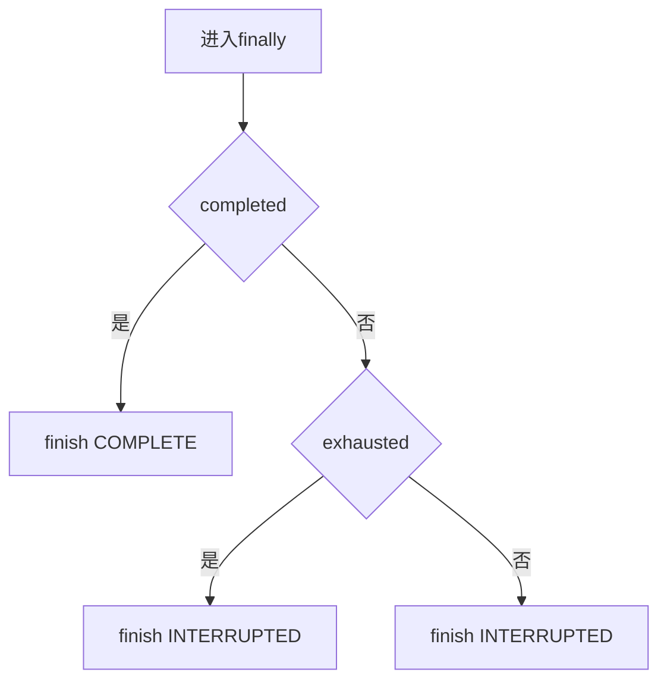

自然耗尽不等于协议完成。

如果流结束却没有精确 DONE，common 层把它归入 `INTERRUPTED`。

反过来，观察到 DONE 后，`completed` 优先于 `exhausted`。

### 6.2 普通异常不是严格一次回调

普通 `BaseException` 分支先直接调用 `finish_stream(..., ERROR)`。

```python
except BaseException:
    finish_stream(stream_lease, RuntimeStreamOutcome.ERROR)
    raise
```

输入是未被更早异常分支捕获的BaseException。函数先发出ERROR观察，再裸`raise`保留原异常；随后仍进入上一小节的`finally`，因此源码中存在第二次outcome调用位置。

然后异常被重新抛出。

无论重新抛出什么，`finally` 仍会执行。

在异常发生前没有看到 DONE、循环也没有自然耗尽时，`finally` 又直接调用 `INTERRUPTED`。

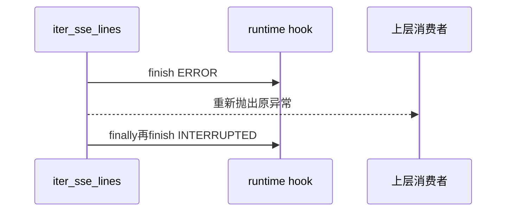

因此不能声称 common 层终态回调严格一次。

这里说的是源码中的直接调用位置。

本课不展开 runtime hook 内部是否去重或如何记录。

若异常发生在 DONE 已被标记之后，`finally` 会按 `completed` 分支调用 `COMPLETE`。

这进一步说明“异常分支只有一个终态调用”并不成立。

### 6.3 其他异常类别

`KeyboardInterrupt` 与 `SystemExit` 分支先直接调用 `INTERRUPTED`，随后重新抛出。

它们还会进入 `finally`，因此同样不能从 common 代码声称严格一次。

`GeneratorExit` 分支只重新抛出，再由 `finally` 根据状态调用 outcome。

```python
except GeneratorExit:
    raise
except (KeyboardInterrupt, SystemExit):
    finish_stream(stream_lease, RuntimeStreamOutcome.INTERRUPTED)
    raise
```

输入分别是消费者关闭生成器，或进程级中断异常。两条分支都保留原异常；只有后一条在进入`finally`前额外发出INTERRUPTED。它们仍然不拥有Response关闭责任。

所有这些 outcome 调用都不替代 `response.close()`。

---

## 7. Task collect：协议判断与资源清理汇合

### 7.1 Task 为什么成为消费所有者

`collect_stream_chat_completion_chunks(response)` 接收已经创建的 Response。

先看 `module/smoke/task.py` 中函数入口：

```python
def collect_stream_chat_completion_chunks(self, response: requests.Response) -> StreamChatCompletionChunks:
    raw_data_lines: list[str] = []
    chunks: list[dict[str, Any]] = []

    try:
```

输入是Request层返回的Response，函数创建两份消费结果列表并立即进入受`finally`保护的区域。输出要等到整个协议检查完成后才形成；从进入`try`开始，Task承担消费与显式关闭责任。

它随后控制整个消费循环。

它决定哪些行可以接受。

它决定何时解析 JSON。

它决定何时因 DONE 停止。

它也在 `finally` 中关闭 Response。

因此，在这个方法的消费区间内，Task 是稳定的资源所有者。

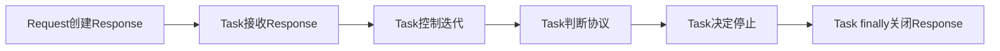

### 7.2 每一行的处理顺序

collect 先建立 `raw_data_lines` 和 `chunks` 两个列表。

随后在 `try` 中遍历 `self.iter_stream_lines(response)`。

该方法最终 `yield from iter_sse_lines(response)`。

这个薄适配函数没有增加关闭逻辑：

```python
@staticmethod
def iter_stream_lines(response: requests.Response):
    yield from iter_sse_lines(response)
```

输入与输出都沿用common迭代器；SmokeTask只保留一个场景内稳定入口。真正消费循环先处理空行与可选打印：

```python
for line in self.iter_stream_lines(response):
    if not line:
        continue
    self.print_stream_raw_line(line)
```

输入是common层yield的字符串。Task再次防御空值，非空行先打印；此时还没有完成`data:`合同检查，也没有写入结果列表。

Task 对每个交付行按固定顺序处理。

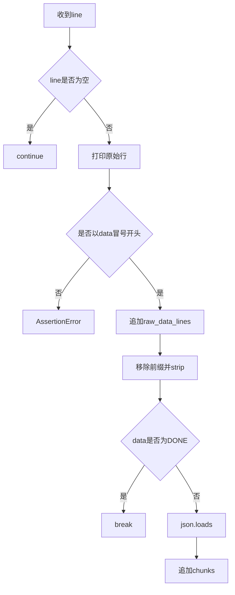

common 已经跳过空行，所以 Task 中的空行判断通常不会接到原始空行。

但它仍作为 Task 自己的防御分支存在。

### 7.3 `data:` 校验属于 Task

collect 使用 `line.startswith(data:)` 的断言。

```python
assert line.startswith("data:"), f"Stream chunk should start with 'data:', actual: {line!r}"
raw_data_lines.append(line)

data = line.removeprefix("data:").strip()
if data == "[DONE]":
    break
```

输入是已打印的非空line。前缀不合格时立即抛断言，且不会进入`raw_data_lines`；合格行先保留原文，再提取data内容。DONE在这里由Task执行`break`，因此语义停止责任不属于common迭代器。

这条规则比 common 层严格。

common 会交付任意非空行。

collect 则把非 `data:` 行视为协议错误。

`event: message` 在 common 层可以被 yield，在 collect 层会被拒绝。

这正是“传输适配”与“场景合同”分层的体现。

### 7.4 JSON 解析属于 Task

通过前缀校验后，原始行先加入 `raw_data_lines`。

然后 Task 移除一次 `data:` 前缀，并对剩余文本做 `strip()`。

如果结果是 `[DONE]`，循环立即 `break`，不会解析 JSON。

否则调用 `json.loads(data)`。

`ValueError` 会被转换为带固定说明的 `AssertionError`。

解析成功的值被加入 `chunks`。

```python
try:
    chunk = json.loads(data)
except ValueError as exc:
    raise AssertionError(f"Stream data chunk is not valid JSON: {data}") from exc

chunks.append(chunk)
```

输入是去除`data:`前缀且不是DONE的文本。合法JSON被追加到chunks，解析失败则转换为场景断言并保留异常因果；这个分支不关闭Response，清理由外层`finally`统一承担。

当前代码没有额外断言解析结果一定是字典。

类型标注表达预期，但运行时协议检查集中在“可解析 JSON”。

### 7.5 close 先于循环后的最终断言

`response.close()` 位于 `finally`。

```python
finally:
    response.close()

assert raw_data_lines, "Stream response did not produce any data lines."
assert raw_data_lines[-1] == "data: [DONE]", (
    f"Stream response should end with 'data: [DONE]', actual: {raw_data_lines[-1]!r}"
)
assert chunks, "Stream response did not produce any JSON chunks before [DONE]."
return StreamChatCompletionChunks(raw_data_lines=raw_data_lines, chunks=chunks)
```

输入是消费过程中累积的列表以及仍被Task持有的Response。任何离开`try`的路径先调用close；只有没有在循环内抛错时，才继续执行三个最终协议断言并构造返回对象。因而缺DONE和空结果错误发生在显式清理之后。

循环正常完成、主动 break、断言失败、JSON 失败或读取异常都会离开 `try`。

离开时先执行 close。

之后才执行三个最终断言：

- 至少产生一条 data 行。
- 最后一条必须精确等于 `data: [DONE]`。
- DONE 前至少有一个 JSON chunk。

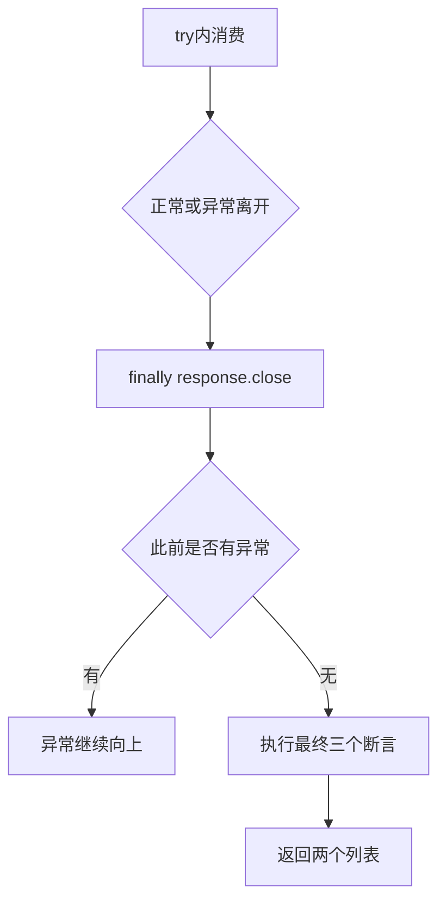

所以“缺 DONE”不是在 common 层抛出的协议断言。

它是 Task 在 Response 已关闭后，根据最终收集结果抛出的断言。

---

## 8. collect 成功路径与测试证据

成功测试提供三行输入：两个 JSON data 行和一个精确 DONE 行。

collect 对前两行解析 JSON，对 DONE 行停止。

`raw_data_lines` 保留三条原始 data 行。

`chunks` 只保留 DONE 前的两个 JSON 值。

`finally` 关闭测试 Response。

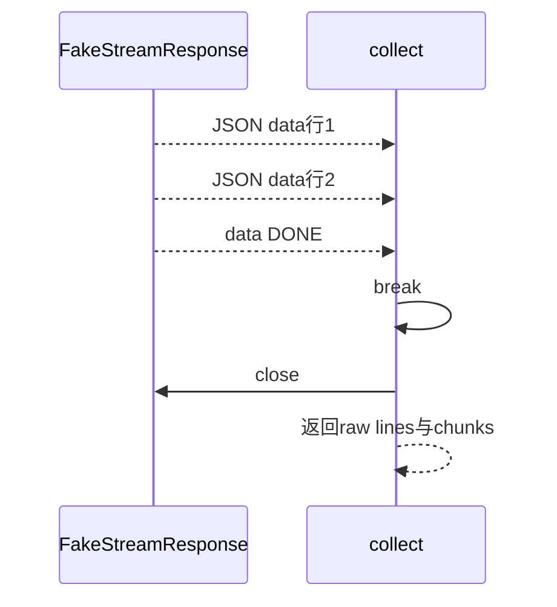

现有成功测试只断言：

- `raw_data_lines` 最后一项是精确的 `data: [DONE]`。
- 两个 chunk 的 `id` 都是 `chatcmpl-001`。
- 测试替身的 `closed` 为 `True`。

它没有断言响应 `Content-Type`。

它没有断言真实网络连接如何复用或关闭。

它也没有证明真实 Smoke 环境已经验证通过。

---

## 9. 非法 JSON 路径

测试输入先给出 `data: not-json`，随后才列出 DONE。

第一行通过 `data:` 前缀断言。

它也先被加入 `raw_data_lines`。

随后 `json.loads()` 失败。

Task 抛出信息包含 `Stream data chunk is not valid JSON` 的 `AssertionError`。

异常离开 `try` 时，`finally` 调用 close。

现有测试断言的只有异常类型与消息匹配，以及 `closed is True`。

测试没有声称 DONE 行已被消费。

---

## 10. 非 `data:` 行路径

测试输入的第一行是 `event: message`。

common 层会把这个非空行逐行交付。

collect 在 `startswith` 断言处拒绝它。

因为追加动作发生在断言之后，这一行不会进入 `raw_data_lines`。

随后 `finally` 关闭 Response。

测试只断言消息包含 `Stream chunk should start with 'data:'`，并断言 `closed is True`。

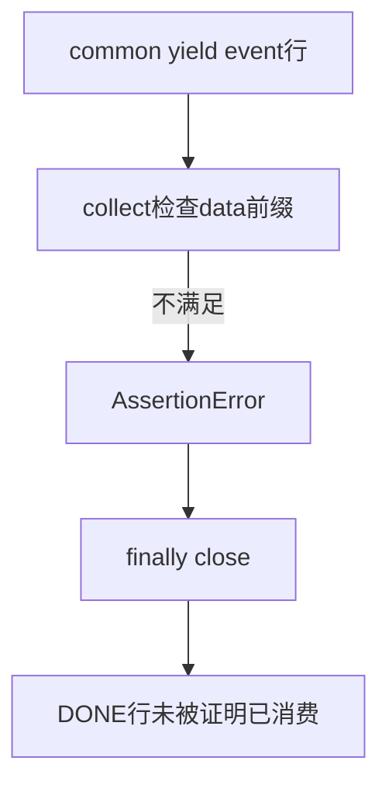

这条测试同时说明：

> common 允许交付，不代表 collect 场景合同允许接受。

---

## 11. 缺少 DONE 路径

测试输入只有一个合法 JSON data 行。

这一行被解析并加入 `chunks`。

之后底层迭代自然结束。

common 的 `exhausted` 变为 `True`，但 `completed` 仍为 `False`。

common 的 finally 因而直接调用 `INTERRUPTED`。

Task 的循环正常走完，接着先在 finally 中关闭 Response。

然后最终断言发现最后一行不是 `data: [DONE]`。

测试断言错误信息包含 `Stream response should end with 'data: [DONE]'`。

测试还断言 `closed is True`。

它没有把“迭代器自然结束”当成“协议完整结束”。

---

## 12. 中途异常路径

测试构造一个 `ChunkedEncodingError` 实例。

测试替身在交付第一行后抛出这个同一个异常对象。

因此列表中虽然预先还有 DONE，collect 也没有机会消费到它。

common 的普通异常分支先直接调用 `ERROR`。

在未完成、未耗尽状态下，common finally 又直接调用 `INTERRUPTED`。

异常继续穿过 Task 的循环。

Task finally 调用 `response.close()`。

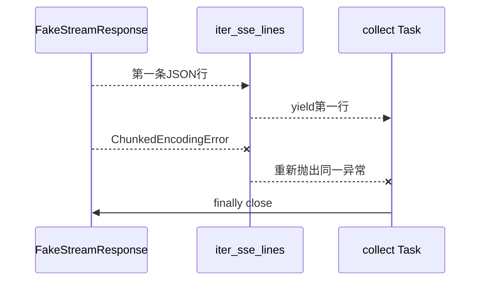

现有测试精确断言：

- 向上抛出的对象就是构造时的 `error` 对象。
- `response.closed is True`。

测试没有断言 common outcome 的次数或最终存储结果。

所以本课只能从源码指出直接调用路径，不能把 hook 内部行为说成已被该测试证明。

---

## 13. 五类 collect 路径的共同结构

```mermaid
flowchart TB
    A[collect开始消费] --> B{路径}
    B --> C[成功并看到DONE]
    B --> D[非法JSON]
    B --> E[非data行]
    B --> F[缺DONE]
    B --> G[中途异常]
    C --> H[finally close]
    D --> H
    E --> H
    F --> H
    G --> H
```

共同点是 Task 的 `try/finally` 已经覆盖消费过程。

差异在于语义结果与异常出口。

因此不能用 `closed is True` 区分成功与失败。

close 是共同清理事实，不是成功标签。

---

## 14. interrupt 路径：主动停止也必须关闭

`interrupt_stream_chat_completion()` 不收集 JSON chunks。

它的目标是持续读取，直到时间达到上限或看到 DONE。

先看函数如何建立停止计时并进入受保护的消费区间：

```python
request_id = self.get_request_id_from_response(response)
started_at = time.monotonic()

try:
    for line in self.iter_stream_lines(response):
        elapsed_seconds = time.monotonic() - started_at
        if elapsed_seconds >= max_duration_seconds:
            print(f"stream elapsed seconds: {round(elapsed_seconds, 3)}")
            print(f"stream interrupted after {max_duration_seconds}s")
            break
```

输入是Response与最大消费时长。方法先提取request_id，再建立单调时钟起点；每次取得line后先计算经过时间，达到上限就停止请求后续行。这个时间边界约束Task消费过程，不是网络层强制断开计时器。

每次收到 line 后，代码先计算已经经过的时间。

如果达到 `max_duration_seconds`，立即打印中断信息并 `break`。

这个时间判断发生在空行判断、打印和 `data:` 处理之前。

若未达到时限，非 `data:` 行会被忽略，而不是像 collect 那样断言失败。

若 `data:` 内容是 `[DONE]`，循环也会 `break`。

循环的剩余分支是：

```python
if not line:
    continue
if print_raw_lines:
    self.print_stream_raw_line(line)
if not line.startswith("data:"):
    continue

data = line.removeprefix("data:").strip()
if data == "[DONE]":
    break
```

输入是尚未触发时限的line。空行和非`data:`行被忽略，DONE触发语义停止，其他data行继续下一轮；该路径不解析JSON，也不要求最终必须看到DONE。

无论按时限停止、按 DONE 停止或循环内抛错，try 内路径都会进入 finally close。

```python
finally:
    response.close()

print(f"stream request_id: {request_id}")
return StreamChatCompletionResult(
    request_id=request_id,
)
```

输入是消费结束时仍由Task持有的Response。所有已进入`try`的退出路径先调用close，随后正常路径才打印并返回request_id；异常路径在close后继续向上抛出，不构造结果对象。

```mermaid
flowchart TB
    A[收到line] --> B[计算elapsed]
    B --> C{达到时限}
    C -->|是| D[break]
    C -->|否| E{是否data行}
    E -->|否| F[continue]
    E -->|是| G{是否DONE}
    G -->|是| D
    G -->|否| A
    D --> H[finally close]
```

### 14.1 现有 interrupt 测试证明什么

测试提供合法 Header：`x-oneapi-request-id: request-001`。

模拟时间让第二条数据到达时已经超过 15 秒。

方法在时限分支停止，并在 finally 中关闭测试替身。

测试只断言返回的 `request_id` 等于 `request-001`，以及 `closed is True`。

它没有断言 DONE 被看到。

它没有断言真实连接状态。

它没有覆盖 Header 缺失。

### 14.2 request_id 提取位于 try 之前

方法先调用 `get_request_id_from_response(response)`，之后才进入 try。

直接实现会读取 Header、去除空白，并在结果为空时抛出 `AssertionError`。

`SmokeTask`通过`BaseTask`委托到`BillingCapability.get_request_id_from_response()`，真正读取Header的函数是：

```python
@staticmethod
def get_request_id_from_response(response: requests.Response) -> str:
    request_id = response.headers.get(ONEAPI_REQUEST_ID_HEADER, "").strip()
    print(f"{ONEAPI_REQUEST_ID_HEADER}: {request_id}")
    if not request_id:
        raise AssertionError(
            f"Response header {ONEAPI_REQUEST_ID_HEADER} is missing. "
            f"Response headers: {dict(response.headers)}"
        )
    return request_id
```

输入是尚未进入interrupt消费`try`的Response。Header存在时输出去除空白的request_id；缺失时直接抛出断言。函数不关闭Response，因此这个前置失败不会触发后面尚未进入的`finally`。

因此 Header 缺失异常可能在进入 try 之前发生。

一旦没有进入 try，本方法的 finally 就不会执行。

于是该 Response 可能绕过这里的 close。

```mermaid
flowchart LR
    A[进入interrupt] --> B[提取request_id]
    B -->|合法| C[进入try消费]
    C --> D[finally close]
    B -->|缺失并抛错| E[绕过本方法finally]
    E --> F[可能未由本方法close]
```

这是一条源码可见的生命周期缺口。

现有测试只有合法 Header，所以不能声称该缺口已经被测试覆盖。

---

## 15. 五个“结束”必须分层

| 概念 | 准确含义 | 不能推出什么 |
| --- | --- | --- |
| 消费结束 | Task 不再请求下一行 | 不保证看到了 DONE |
| 看到 DONE | 当前规则识别到结束标志 | 不保证迭代器自然耗尽 |
| 迭代器结束 | 底层不再产生行 | 不保证协议有 DONE |
| `Response.close()` | 调用响应对象的显式清理接口 | 不等于物理连接已确定关闭 |
| 连接关闭 | 更低层网络连接结束或不可再用 | 现有 Fake 测试没有证明它 |

```mermaid
flowchart LR
    A[消费结束] -.可能因为.-> B[DONE break]
    A -.也可能因为.-> C[超时或异常]
    D[迭代器结束] -.不保证.-> B
    B -.不自动执行.-> E[Response.close]
    E -.不等同于.-> F[物理连接关闭]
```

这五层中，Task 能直接负责的是“何时停止消费”和“调用 Response.close”。

DONE 属于应用协议层。

迭代器结束属于读取序列层。

物理连接最终如何关闭或复用属于更低层行为。

测试替身的 `close()` 只把 `closed` 设为 `True`，不能替真实网络作证。

---

## 16. 本课证据边界

现有源码与测试支持：逐行容错解码、Task 协议校验、五类 collect 路径、合法 Header 的 interrupt 关闭路径。

现有证据不支持：响应 `Content-Type` 已验证、完整 SSE 语法已实现、common 终态回调严格一次、Header 缺失仍必然 close、物理连接必然关闭。

现有测试使用 Fake Response，因此不得声称真实 Smoke 已验证通过。

准确结论不是“流式机制已经完备”。

准确结论是“当前责任链的已覆盖路径与缺口都可以被明确指出”。

---

## 17. 向 Day12 交付

Day11 把 Day10 的普通 Response 所有权扩展成了跨时间的流式所有权。

核心变化不是多了一个循环，而是资源会跨越请求、消费、判断和清理多个步骤。

Day12 需要继续追问：资源一旦跨步骤存在，如何避免所有者漂移、遗漏和重复清理。

因此，本课向 Day12 交付的明确结论是：

> 跨步骤资源需要稳定所有者和显式清理登记
