# 第 12 天：测试上下文提取与资源清理
> **课程定位**：解释测试用例如何从响应中提取事实、写入有作用域的上下文，并在测试结束时按责任链清理资源  
> **Module 层落点**：Test 使用 `test_context` 跨步骤传值，并在获得资源 ID 后立即调用 `add_cleanup()`；不要使用模块全局变量或依赖用例顺序  
> **讲解重点**：`TestContext`、`extract()`、`extract_first()`、写入顺序、`transform`、`expected_type`、LIFO 清理栈与测试证据边界  
> **课程形式**：纯讲解，强调第一性原理、TOC 约束与因果链  
> **事实依据**：`common/test_context.py`、`module/conftest.py`、`tests/test_test_context.py`、`module/offline_framework_example/test_context_cleanup.py`
---
## 0. 从 Day11 接过来的问题
Day11 留下的关键判断是：
> **资源使用结束不等于清理完成。**
“最后一次读取已经发生”只描述业务使用阶段结束。
它没有回答下面四件事：
- 谁知道这个资源需要被清理；
- 谁保存清理动作；
- 谁决定清理顺序；
- 清理失败后，剩余资源是否仍会继续清理。
这四个问题共同指向“所有权”。
如果所有权没有被显式表达，框架就无法只凭“资源曾被使用过”推导出正确的释放动作。
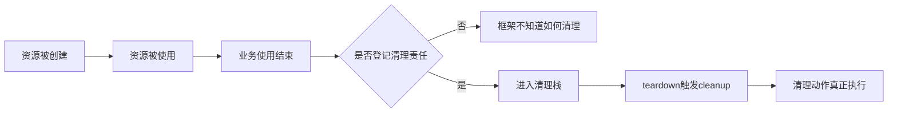
因此，Day12 不把 `TestContext` 理解成“方便放变量的字典”。
它要解决的是两类跨步骤责任：
1. 前一步从响应中得到的事实，如何以测试用例为作用域传给后一步；
2. 前一步创建的资源，如何把清理责任交给测试结束阶段。
这两类责任分别落在两个容器中：
- `_variables` 保存测试变量；
- `_cleanup_callbacks` 保存待执行的清理动作。
二者属于同一个 `TestContext`，但不是同一套状态。
---
## 1. 第一性原理：上下文解决的是作用域内的责任连续性
### 1.1 为什么测试步骤不能只依赖局部变量
一个测试可能先创建任务，再查询任务，最后删除任务。
创建阶段获得 `task_id`，查询和删除阶段都需要它。
如果每一步只拥有自己的局部变量，事实无法自然跨越步骤边界。
如果把变量放入模块级全局字典，事实虽然能跨步骤，却会失去测试用例边界。
于是产生两种相反风险：
| 做法 | 表面收益 | 根本风险 |
| --- | --- | --- |
| 只用局部变量 | 边界清楚 | 多步骤之间难以共享 |
| 使用全局字典 | 读取方便 | 不同测试可能互相污染 |
| 每个测试独立 `TestContext` | 共享与隔离并存 | 仍需正确传播实例 |
`TestContext` 的本质不是“全局可见”。
它的本质是“在一个明确作用域内持续可见”。
### 1.2 变量状态与资源状态不是同一件事
变量可以有“存在”与“不存在”。
资源则至少有“创建、登记、清理中、清理成功、清理失败”。
仅仅把资源 ID 写入变量字典，不会自动推进资源状态。
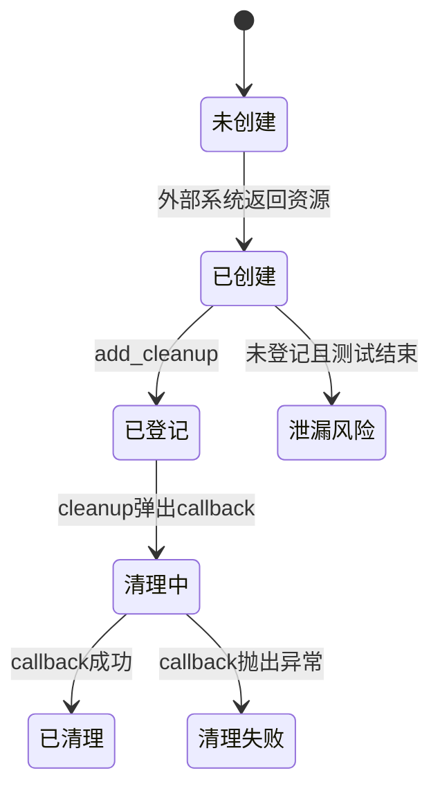
从第一性原理看，变量值只是“描述资源的事实”。
清理 callback 才是“改变资源状态的动作”。
描述事实不能替代执行动作。
### 1.3 本课的三个不等式
理解 Day12，可以先记住三个不等式：
1. 提取到值，不等于值已经满足业务约束；
2. 登记清理动作，不等于清理动作已经成功；
3. 多个实例在线程中隔离，不等于同一个实例可被并发安全写入。
后文所有边界都可以从这三个不等式展开。
---
## 2. TOC 约束：真正的瓶颈是责任没有进入正确容器
### 2.1 找出系统目标
这里的目标不是“尽量多保存响应字段”。
真正目标是：
> 每个测试只读取属于自己的事实，并在作用域结束时尽可能完成属于自己的资源清理。
如果目标没有达成，常见表象可能是：
- 后续步骤找不到任务 ID；
- 可选字段被误写成默认值；
- JSON `null` 被误判为字段缺失；
- 类型不符合预期却已经写入；
- 删除动作从未执行；
- 一个删除失败阻断其他清理动作；
- 并发测试之间出现状态串扰。
这些表象背后的共同约束是：
> 事实和责任没有在正确时间进入正确作用域。
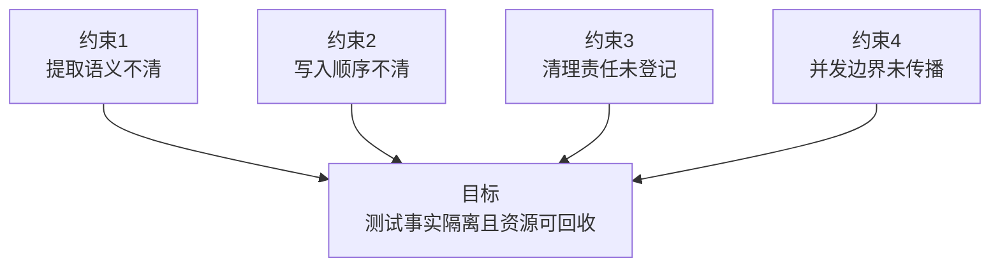
### 2.2 TOC 五步如何映射到本课
| TOC 步骤 | 在 TestContext 中的含义 |
| --- | --- |
| 识别约束 | 找到事实丢失、责任丢失或作用域混乱的位置 |
| 充分利用约束 | 用明确的提取管线和 LIFO 栈减少歧义 |
| 其他决策服从约束 | 默认值、转换、类型检查都必须服从写入顺序 |
| 提升约束 | 用 fixture 把清理触发点固定在 teardown |
| 防止惯性 | 不把单线程、单失败 callback 的测试扩大解释 |
### 2.3 为什么“自动发现所有资源”不是当前答案
自动发现听起来更省事，但它需要回答：
- 哪个变量代表资源；
- 哪个资源需要删除；
- 删除动作需要哪些参数；
- 删除顺序是否依赖创建顺序；
- 删除失败是否可以重试；
- 外部系统是否允许重复删除。
当前 `TestContext` 不推测这些领域知识。
它要求调用方显式提供 callback。
这不是功能缺失的简单同义词，而是一条责任边界：
> 通用上下文负责调度清理动作，业务代码负责定义清理动作。
---
## 3. `TestContext` 与 `RequestContext` 的粒度区别
### 3.1 两个 Context 服务于不同时间尺度
`RequestContext` 位于请求执行主线。
它保存一次请求 attempt 附近的标准化事实，例如：
- `method`；
- `path`；
- `url`；
- `kwargs`；
- 日志步骤名称；
- `protocol`；
- Retry 与 Polling 策略引用；
- 扩展 `attributes`。
`TestContext` 位于测试用例主线。
它保存：
- 测试步骤之间共享的变量；
- 测试结束阶段要执行的清理 callback。
二者不是父子类关系，也不是同一对象的两个名字。
### 3.2 时间线上的位置
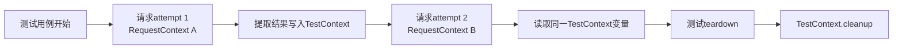
一次测试可以经历多个请求 attempt。
因此，一个 `TestContext` 可以跨越多个 `RequestContext` 的生命区间。
反过来，`RequestContext` 不应该承担整个测试的资源清理栈。
它的时间尺度更短，职责也更靠近单次请求执行。
### 3.3 粒度对照
| 维度 | `RequestContext` | `TestContext` |
| --- | --- | --- |
| 主要粒度 | 请求 attempt 附近 | 测试用例 |
| 主要内容 | 请求事实、策略引用、扩展属性 | 测试变量、清理 callback |
| 创建位置 | 请求构造路径 | 测试或 fixture |
| 是否自动包含响应 | 否 | 否 |
| 是否自动拥有外部资源 | 否 | 否 |
| 是否提供清理栈 | 当前定义没有 | 有 |
| 是否是全局状态 | 否 | 否 |
### 3.4 为什么 TestContext 不是全局字典
`TestContext.__init__()` 为每个实例创建新的 `_variables` 与 `_cleanup_callbacks`。

```python
def __init__(self, *, name: str | None = None):
    self.name = name
    self._variables: dict[str, Any] = {}
    self._cleanup_callbacks: list[_CleanupCallback] = []
```

输入只有可选名称，输出是两份属于当前实例的新容器。变量仓库与清理栈在对象创建时为空，既不引用模块级共享字典，也不自动发现外部资源。
它没有模块级共享变量仓库。
`module/conftest.py` 中的 `test_context` fixture 默认是 function scope。
每次 fixture 使用都会构造新的 `TestContext()`。
因此，正确模型是：
> 每个测试拿到自己的实例，而不是所有测试访问同一个全局字典。
但“不是全局字典”不等于“实例会自动到达所有线程、任务和回调”。
实例仍然必须被显式传递，或者由正确的作用域机制绑定。
---
## 4. TestContext 不会自动拥有所有资源
### 4.1 “拥有”在这里是什么意思
一个资源归 `TestContext` 管理，至少需要满足：
- 清理动作已经通过 `add_cleanup()` 登记；
- callback 所需参数仍然有效；
- teardown 或显式调用最终执行 `cleanup()`。
仅满足下面任一条件都不够：
- 资源由当前测试创建；
- 资源 ID 被写入 `_variables`；
- 资源对象曾作为局部变量出现；
- 测试已经不再使用资源；
- fixture 已经创建了 `TestContext`。
### 4.2 显式转移清理责任
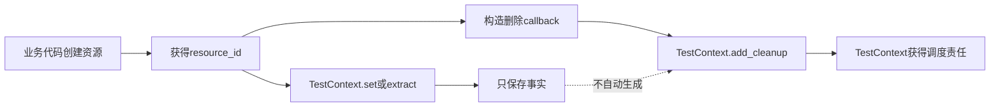
图中有两条并行路径：
- 写入变量，让后续步骤知道资源是谁；
- 登记 callback，让 teardown 知道如何清理。
缺少第二条路径，`TestContext` 就只知道 ID，不知道删除方法。
### 4.3 `api` fixture 说明资源可以有其他所有者
`module/conftest.py` 中，`api` fixture 自己在 `finally` 中调用 `client.close()`。
它没有把 `client.close` 登记到 `test_context`。
这说明仓库并没有规定“所有资源必须统一交给 TestContext”。
不同资源可以由不同 fixture 或组件拥有。
关键不是所有权必须集中，而是所有权必须明确。
### 4.4 离线示例中的任务删除
离线示例创建媒体任务后，显式定义 `delete_task()`。
随后通过 `offline_test_context.add_cleanup(delete_task)` 登记。
真正被登记的是删除动作，不是任务 ID 本身。
任务 ID 只是 callback 闭包使用的输入事实。
---
## 5. `extract()`：恰好选择一个来源
### 5.1 四个来源选择器
`extract()` 支持四类来源：
- `json_path`；
- `header`；
- `cookie`；
- `regex`。
实现通过统计这四个参数中“不为 `None`”的数量来判断来源数。
要求不是“至少一个”，而是“恰好一个”。
因此：
| 来源配置 | 结果 |
| --- | --- |
| 四个都未提供 | 抛出 `ContextExtractionError` |
| 只提供一个 | 进入对应提取器 |
| 同时提供两个或更多 | 抛出 `ContextExtractionError` |
`group`、`source_text`、`multiple` 是来源的附加参数。
它们不算独立来源。

要确认“恰好一个”在哪里执行，打开`TestContext.extract()`的方法体开头。下面是来源校验与后续委托的聚焦摘录，具体提取和写入分别在第6节与第9节展开：

```python
_validate_variable_name(name)
source_count = sum(value is not None for value in (json_path, header, cookie, regex))
if source_count != 1:
    raise ContextExtractionError(
        "extract() requires exactly one source: json_path, header, cookie, or regex."
    )

value = self._extract_value(
    name,
    response,
    json_path=json_path,
    header=header,
    cookie=cookie,
    regex=regex,
    group=group,
    source_text=source_text,
    multiple=multiple,
)
return self._store_extracted_value(
    name,
    value,
    required=required,
    default=default,
    expected_type=expected_type,
    transform=transform,
    allow_none=allow_none,
    source_description=_format_source_description(
        json_path=json_path,
        header=header,
        cookie=cookie,
        regex=regex,
    ),
    response=response,
)
```

输入是变量名、可选Response、四个来源选择器及统一写入参数。方法先拒绝零来源或多来源，再把原始提取结果交给同一存储管线；它不在各来源分支中复制default、transform或类型校验逻辑。
### 5.2 为什么必须恰好一个来源
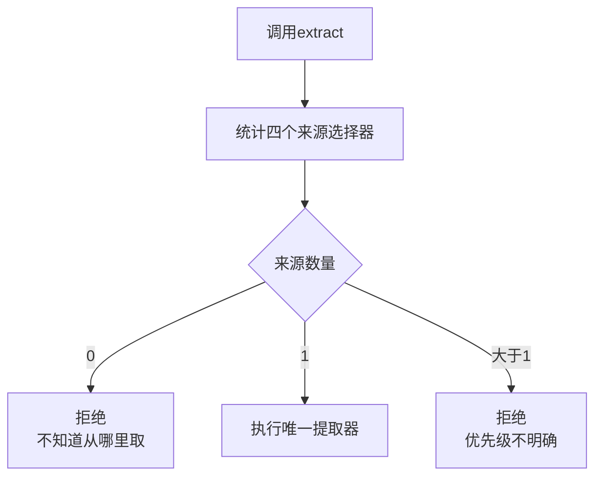
如果 `extract()` 同时接受 JSONPath 与 Header，却没有优先级规则，调用者就无法预测最终写入哪个值。
因此，单来源约束把选择策略留给调用方；需要有序回退时，应使用 `extract_first()`。
### 5.3 测试证明了什么
`test_extract_requires_exactly_one_source` 同时传入 JSONPath 与 Header，并断言出现包含 `exactly one source` 的错误。
它证明多来源同时传入会被拒绝，但没有单独覆盖“四个来源都不传”的分支；后者只能标记为实现可见。
---
## 6. 四类来源的提取语义
### 6.1 来源分派
打开`TestContext._extract_value()`，可以看到四个来源的实际优先分派：

```python
def _extract_value(
    self,
    name: str,
    response: requests.Response | None,
    *,
    json_path: str | None = None,
    header: str | None = None,
    cookie: str | None = None,
    regex: str | None = None,
    group: int | str = 0,
    source_text: str | None = None,
    multiple: bool = False,
) -> Any:
    if json_path is not None:
        _require_response(name, response, "json_path")
        return _extract_json_path(name, response, json_path, multiple=multiple)
    if header is not None:
        _require_response(name, response, "header")
        return _extract_header(response, header)
    if cookie is not None:
        _require_response(name, response, "cookie")
        return _extract_cookie(response, cookie)
    if regex is not None:
        if source_text is None:
            _require_response(name, response, "regex")
            source_text = response.text
        return _extract_regex(name, source_text, regex, group)
    raise ContextExtractionError("No extraction source was provided.")
```

输入已经通过`extract()`的单来源校验。JSONPath、Header和Cookie先要求Response；Regex有显式`source_text`时可以脱离Response。输出是某个来源的原始值或内部缺失哨兵，函数不处理default、transform和最终写入。
### 6.2 JSONPath
JSONPath 必须以 `$` 开头；实现先调用 `response.json()`，再用解析器查找匹配项。
JSON 解析失败或路径解析失败会被包装为 `ContextExtractionError`。
没有匹配项时返回内部哨兵 `_NO_VALUE`；`multiple=False` 返回第一项，`multiple=True` 返回完整列表。
`test_extract_json_path_multiple_returns_all_values` 证明两个 ID 会作为列表返回并写入。

对应函数完整保留了路径、JSON和解析错误的边界：

```python
def _extract_json_path(
    name: str,
    response: requests.Response,
    json_path: str,
    *,
    multiple: bool,
) -> Any:
    if not json_path.startswith("$"):
        raise ContextExtractionError(f"JSONPath must start with '$', actual: {json_path!r}.")

    try:
        body = response.json()
    except ValueError as exc:
        raise ContextExtractionError(
            f"Response body is not valid JSON while extracting context variable {name!r}. "
            f"JSONPath: {json_path!r}. Response: {_redact_response_summary(response)}"
        ) from exc

    try:
        matches = [match.value for match in parse(json_path).find(body)]
    except Exception as exc:
        raise ContextExtractionError(
            f"Invalid JSONPath while extracting context variable {name!r}: {json_path!r}. "
            f"{type(exc).__name__}: {_redact_text(str(exc))}"
        ) from exc

    if not matches:
        return _NO_VALUE
    if multiple:
        return matches
    return matches[0]
```

输入是Response、路径和多值开关。输出按无匹配、全部匹配或首个匹配分流；异常被转换为带变量与脱敏响应摘要的ContextExtractionError。函数只负责来源读取，不写入Context。
### 6.3 Header
Header 使用 `response.headers.get(header)`；找不到时返回 `_NO_VALUE`，字符串值会先 `strip()`。

```python
def _extract_header(response: requests.Response, header: str) -> Any:
    value = response.headers.get(header)
    if value is None:
        return _NO_VALUE
    if isinstance(value, str):
        value = value.strip()
    return value
```

输入是Response与Header名，输出是缺失哨兵或去除首尾空白的值。大小写规则由requests的Header映射提供，该函数不自行扫描其他Header。
测试证明小写查询名可以读取混合大小写 Header，并去掉两端空格。
### 6.4 Cookie
Cookie 使用 `response.cookies.get(cookie)`；找不到时返回 `_NO_VALUE`，字符串值同样会 `strip()`。

```python
def _extract_cookie(response: requests.Response, cookie: str) -> Any:
    value = response.cookies.get(cookie)
    if value is None:
        return _NO_VALUE
    if isinstance(value, str):
        value = value.strip()
    return value
```

输入是Response与Cookie名，输出语义与Header相同，但读取容器是`response.cookies`；两类来源不能互相回退。
测试证明 Cookie 成功提取与空格去除。
### 6.5 Regex
Regex 使用 `re.search()`，可以读取显式 `source_text`，也可以在未传 `source_text` 时读取 `response.text`。
没有匹配时返回 `_NO_VALUE`；匹配后通过 `group` 选择整体、数字分组或命名分组，字符串结果会 `strip()`。
测试分别覆盖响应文本匹配和显式 `source_text` 的命名分组。

```python
def _extract_regex(name: str, source_text: str, pattern: str, group: int | str) -> Any:
    try:
        match = re.search(pattern, source_text)
    except re.error as exc:
        raise ContextExtractionError(
            f"Invalid regex while extracting context variable {name!r}: {pattern!r}. "
            f"{type(exc).__name__}: {_redact_text(str(exc))}"
        ) from exc

    if match is None:
        return _NO_VALUE

    try:
        value = match.group(group)
    except IndexError as exc:
        raise ContextExtractionError(
            f"Regex group {group!r} does not exist while extracting context variable {name!r}."
        ) from exc
    return value.strip() if isinstance(value, str) else value
```

输入是来源文本、表达式与分组标识。无匹配返回缺失哨兵，表达式或分组错误被转换为提取错误，成功值只做字符串strip；函数不验证匹配值的业务类型。
### 6.6 响应要求
JSONPath、Header、Cookie 必须有 `response`；Regex 只有在没有 `source_text` 时才必须有 `response`。
所以“所有提取都必须有响应对象”不是准确结论。
---
## 7. `extract_first()`：按顺序寻找第一个有值来源
### 7.1 它解决的是来源优先级
同一业务标识可能出现在不同位置，`extract_first()` 接收有序 `sources`，顺序本身就是优先级合同。
### 7.2 主循环
打开`extract_first()`的候选循环。下面的连续摘录停在所有候选耗尽之前，default与required收口放到第10节：

```python
source_errors: list[str] = []
for source in sources:
    try:
        normalized_source = _normalize_source(source)
        value = self._extract_value(name, response, **normalized_source)
    except ContextExtractionError as exc:
        source_errors.append(str(exc))
        continue
    if _has_extracted_value(value):
        return self._store_extracted_value(
            name,
            value,
            required=required,
            default=default,
            expected_type=expected_type,
            transform=transform,
            allow_none=allow_none,
            source_description=_format_source_description(**normalized_source),
            response=response,
        )
    source_errors.append(f"{_format_source_description(**normalized_source)} did not match any value.")
```

输入是有序sources。每个候选先标准化为单来源，再复用相同提取函数；来源错误和无值都记录后继续，首个有值候选立即进入统一存储并终止搜索。输出顺序由sources决定，不会比较多个候选谁“更好”。
### 7.3 每个候选仍是单来源
每个 Mapping 可以包含一个来源选择器，以及 `group`、`source_text`、`multiple` 等附加参数。
未知键会报错；每个候选仍必须在 JSONPath、Header、Cookie、Regex 中恰好选择一个。
因此，`extract_first()` 不是放松单来源约束，而是在多个单来源候选之间增加顺序。
### 7.4 错误与顺序边界
循环会捕获候选来源抛出的 `ContextExtractionError`，记录文本并继续下一个来源。
现有成功测试覆盖“第一路径无匹配、第二路径命中”，没有覆盖“前一来源解析报错、后一来源成功”。
`test_extract_first_uses_first_non_empty_source` 的顺序是 `$.task_id`、`$.id`、`$.request_id`；第二项命中后，第三项不再成为最终值。
---
## 8. “有值”是代码语义，不是自然语言感觉
### 8.1 `_has_extracted_value()` 的规则
当前实现把 `_NO_VALUE`、空字符串 `"`、空列表 `[]` 视为没有值。
数字 `0`、布尔值 `False`、非空字符串、非空列表和 `None` 通常被视为已有值。
最后一项最容易被忽略。

真实判定函数只有三条无值规则：

```python
def _has_extracted_value(value: Any) -> bool:
    if value is _NO_VALUE:
        return False
    if isinstance(value, str) and value == "":
        return False
    if isinstance(value, list) and not value:
        return False
    return True
```

输入是任意候选值，输出是是否停止`extract_first()`搜索。`None`、0和`False`都落入最后的`True`，因此“有值”不等于Python真值为真。
### 8.2 候选值判断
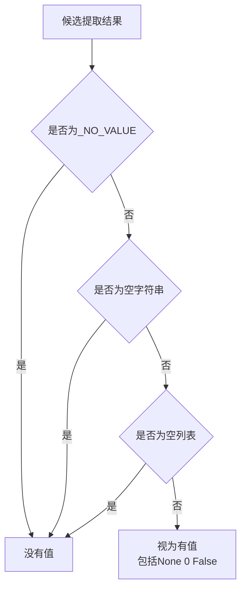
### 8.3 `None` 与缺失不同
JSONPath 没有匹配时返回 `_NO_VALUE`；字段存在且 JSON 值为 `null` 时得到 Python `None`。
缺失表示“路径没有匹配”，`None` 表示“路径匹配到了显式空值”，两者携带的信息不同。
因为 `None` 被视为有值，`extract_first()` 会在该来源停止查找，再进入 `allow_none` 相关判断。
所以首来源为 JSON null 时不会自动回退到第二来源；现有测试没有专门覆盖这个组合。
---
## 9. 真实写入链：顺序就是合同
### 9.1 完整管线
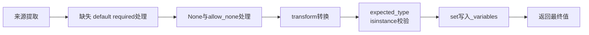
这个顺序不能交换，因为每一步的输出都是下一步的输入。
### 9.2 来源提取
来源提取只回答“从指定位置读到了什么原始值”，不负责默认值、业务转换或最终写入。
### 9.3 缺失、default、required
原始值没有值时：有 default 就使用 default；没有 default 且 required 为真就抛错；没有 default 且 required 为假就返回 `None`。
最后一种情况直接返回，不进入 transform、类型校验和 set。
### 9.4 None 与 allow_none
当前拒绝条件是 `value is None and required and not allow_none`。
所以 `allow_none` 与 `required` 联动，不能概括成“任何 None 都由 allow_none 单独决定”。
### 9.5 transform
提供 transform 时，当前值被传入 callable，其返回值替代原值继续流动。
transform 抛出的普通 `Exception` 会被包装成 `ContextExtractionError`。
### 9.6 expected_type
类型检查发生在 transform 之后，使用 `isinstance(value, expected_type)`；不符合时抛出 `ContextVariableTypeError`。
### 9.7 set
只有前面阶段全部通过才调用 `self.set(name, value)`。
提取失败、必填缺失、None 被拒绝、transform 失败和类型不匹配，都不会进入最终 set。
---
## 10. 缺失、default 与 required 的因果链
### 10.1 三个概念不能互相替代
`required` 回答没有值时是否必须失败；`default` 回答是否有替代输入；`None` 表示显式空值或空 default。
### 10.2 单来源 extract 的缺失决策
统一存储函数`_store_extracted_value()`先处理缺失、default与required。下面是函数开头的连续摘录，None、transform和类型校验将在后续小节继续出现：

```python
if value is _NO_VALUE or not _has_extracted_value(value):
    if default is not _UNSET:
        value = default
    elif required:
        raise ContextExtractionError(
            f"Failed to extract required context variable {name!r}. "
            f"Source: {source_description}. Response: {_redact_response_summary(response)}"
        )
    else:
        return None
```

输入是来源原始值、default哨兵与required标志。缺失时有default就替换当前值并继续；无default且必填时抛错；可选缺失时直接返回，不进入后续转换、校验和set。此处返回`None`只表示本次提取没有写入。

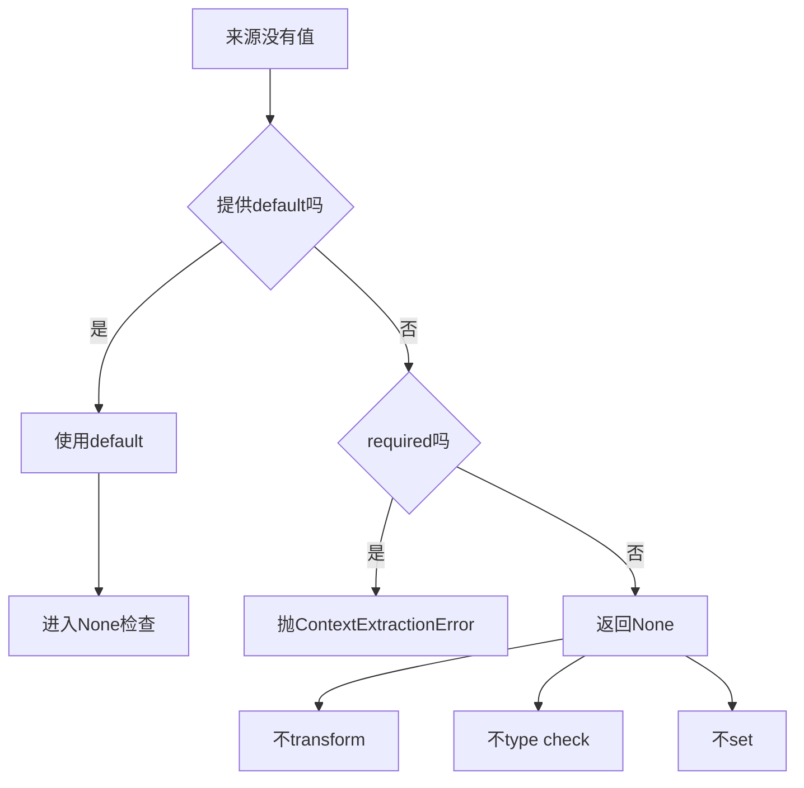
### 10.3 optional 缺失且无 default
`test_required_false_without_default_does_not_store_value` 证明：路径无匹配、`required=False`、无 default 时，返回 `None`，但 `has(optional)` 为假。
所以返回 `None` 不能自动解释成变量已写入，必须结合 `has()` 判断。
### 10.4 default 仍走后续管线
default 会继续经过 None 处理、transform、expected_type 与 set。
测试使用字符串 default `2`，经 `int` 变成整数 `2`，再通过 `expected_type=int` 并写入；离线示例覆盖同一合同。
### 10.5 `get(default=...)` 不同
`get()` 的 default 是读取回退：变量缺失时直接返回且不写入，测试明确证明这一点。
`extract()` 的 default 是提取管线输入，会继续转换、校验并可能写入。
### 10.6 `extract_first()` 的 default 细节
所有来源失败且提供 default 时，`extract_first()` 调用统一存储函数，但当前实现给该分支传入 `required=False`。

对应收口位于候选循环之后：

```python
if default is not _UNSET:
    return self._store_extracted_value(
        name,
        default,
        required=False,
        default=default,
        expected_type=expected_type,
        transform=transform,
        allow_none=allow_none,
        source_description="default",
        response=response,
    )
if required:
    raise ContextExtractionError(
        f"Failed to extract required context variable {name!r} from any source. "
        f"Sources: {source_errors}. Response: {_redact_response_summary(response)}"
    )
return None
```

输入是全部候选积累的错误、default与required。default存在时进入统一管线；否则必填聚合来源说明并失败，可选则直接返回None。函数没有在候选间并行提取，也不会在default分支重新访问Response。

主干顺序仍是 default、None、transform、type、set，但 None 门禁收到的 required 状态可能与单来源 `extract()` 不同。
现有测试没有覆盖 `extract_first(default=None)` 与 `extract(default=None)` 的对照，不能宣称所有边界完全等价。
---
## 11. JSON null 与字段缺失必须分开建模
### 11.1 两条不同路径
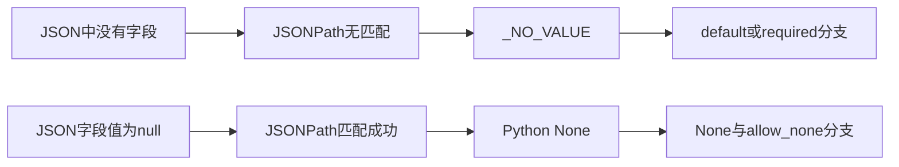
### 11.2 默认 required 状态下的 JSON null
`test_json_null_requires_explicit_allow_none` 使用默认 `required=True`；字段存在但值为 null，因 `allow_none=False` 抛出包含 `None is not allowed` 的错误。
测试证明的是“必填且未允许 None”的行为。

统一存储函数在缺失处理之后执行这条门禁：

```python
if value is None and required and not allow_none:
    raise ContextExtractionError(
        f"Context variable {name!r} extracted None from {source_description}, but None is not allowed."
    )
```

输入是已经确认来源存在或由default产生的值。只有`None + required + not allow_none`同时成立才失败；这段代码不把None重新变成缺失哨兵，也不会自动尝试下一个来源。
### 11.3 allow_none=True
`test_json_null_can_be_stored_when_allow_none_is_true` 证明返回值是 `None`、`has(value)` 为真、`get(value)` 也是 `None`。
这与 optional 缺失形成对照：两者返回值都可能是 None，但前者已写入，后者未写入。
### 11.4 未覆盖的组合
当前条件表明，`required=False` 的已提取 None 不会命中拒绝条件，会继续进入 transform、类型校验和 set；现有测试没有直接覆盖。
None 检查又发生在 transform 之前，所以 transform 若产生 None，不会重新执行 allow_none 检查；后续是否失败取决于 expected_type，这个组合也未被测试。
---
## 12. transform 负责转换，expected_type 只负责校验
### 12.1 职责分工
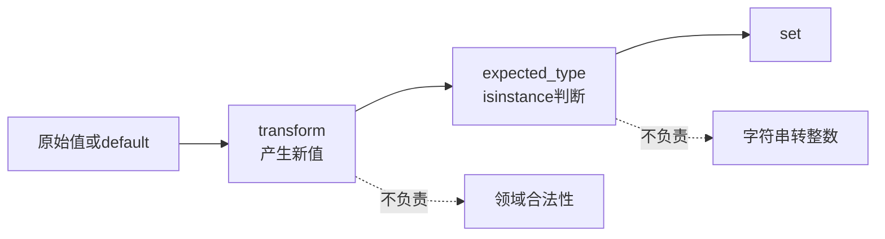
### 12.2 transform 是值生产者
transform 可以把字符串变成整数、统一大小写或映射数据结构。
离线示例用 `str.upper` 转换任务 ID，用 `int` 把 default `2` 变成整数 `2`，因此转换责任属于 transform。

```python
if transform is not None:
    try:
        value = transform(value)
    except Exception as exc:
        raise ContextExtractionError(
            f"Failed to transform context variable {name!r} from {source_description}: "
            f"{type(exc).__name__}: {_redact_text(str(exc))}"
        ) from exc
```

输入是通过缺失与None门禁的当前值。transform返回值替换原值，普通异常被包装并脱敏展示；此时尚未写入Context，因此转换失败不会留下本次变量，但函数也不知道transform可能产生的外部副作用。
### 12.3 expected_type 不做转换
`expected_type=int` 不会把 `2` 变成 `2`，只检查当前值是否已经是 int 实例。
没有 transform 时字符串仍是字符串，类型检查会失败。

transform之后，统一存储函数只剩三步：

```python
_ensure_expected_type(name, value, expected_type)
self.set(name, value)
return value
```

类型检查实现为：

```python
def _ensure_expected_type(
    name: str,
    value: Any,
    expected_type: type | tuple[type, ...] | None,
) -> None:
    if expected_type is None or isinstance(value, expected_type):
        return
    raise ContextVariableTypeError(
        f"Context variable {name!r} type mismatch. "
        f"Expected: {_format_expected_type(expected_type)}, "
        f"actual: {type(value).__name__}, value: {_format_value(name, value)}"
    )
```

输入是transform后的值与可选类型。通过时才调用`set()`并返回同一值；失败时只生成脱敏类型错误，不执行转换，也不写入变量仓库。
### 12.4 expected_type 不负责领域约束
类型正确不等于业务正确：整数仍可能越界、不在枚举内或与其他字段矛盾。
`expected_type=int` 只证明 `isinstance` 关系，不证明“这是合法业务数量”。
它遵循 Python 自身的继承与类型元组规则，不是 schema 校验。
### 12.5 读取时也可校验
`get()` 与 `require()` 也支持 expected_type。
离线示例保存字符串 `task_upper` 后再按 int 读取，测试证明会报告 expected 与 actual，并对测试中的敏感值脱敏。
---
## 13. transform 失败不会回滚外部副作用
### 13.1 管线内部结果
transform 抛异常时，最终 set 不发生，因此本次新值不会写入变量仓库。
这只是写入管线内部的控制结果。
### 13.2 外部副作用边界
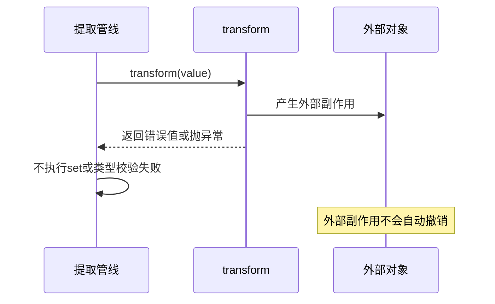
transform 是普通 callable，可能修改列表、更新外部对象或触发其他动作；`TestContext` 不知道这些副作用，无法通用回滚。
transform 成功但 expected_type 失败时，set 不发生，可是 transform 已经执行完毕，外部变化同样不会撤销。
### 13.3 测试边界
`test_transform_failure_raises_context_extraction_error` 用 `int(abc)` 制造异常，证明异常被包装并包含变量名。
它没有检查外部副作用或回滚，因此不能声称框架提供事务性 transform。
第一性原理结论是：transform 负责计算新值，外部副作用不属于 TestContext 的自动事务边界。
---
## 14. `add_cleanup()`：登记动作，不执行动作
### 14.1 登记内容
`add_cleanup(callback, *args, **kwargs)` 保存 callback、位置参数元组和关键字参数字典。
callback 必须满足 `callable()`，否则抛 `TypeError`；登记成功后，它被追加到列表尾部。

登记项先被封装成一个内部数据对象：

```python
@dataclass
class _CleanupCallback:
    callback: Callable[..., Any]
    args: tuple[Any, ...]
    kwargs: dict[str, Any]
```

`add_cleanup()`只验证并追加：

```python
def add_cleanup(self, callback: Callable[..., Any], *args: Any, **kwargs: Any) -> None:
    if not callable(callback):
        raise TypeError(f"cleanup callback must be callable, actual: {callback!r}")
    self._cleanup_callbacks.append(_CleanupCallback(callback=callback, args=args, kwargs=dict(kwargs)))
```

输入是callback及调用参数，输出是清理栈新增一项。位置参数元组直接保存，kwargs只复制最外层字典；方法不调用callback、不检查返回值，也不验证资源当前是否存在。
### 14.2 登记与执行分离
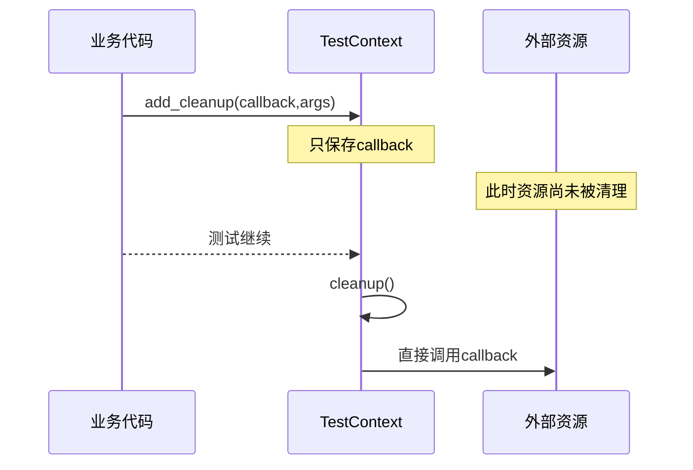
注册成功只证明 callback 已进入列表，不证明 callback 已经执行，更不证明将来一定成功。
关键字参数的最外层字典会复制，但这不是深复制合同；现有测试没有验证复杂可变参数的捕获语义。
### 14.3 同步与异步 callback 的谨慎结论
当前执行模型是直接调用 `callback(*args, **kwargs)`，没有 `await`，也不检查返回值是否为 awaitable。
但注册阶段只检查 `callable()`，原生异步函数对象也可能通过并被登记。
因此只能说当前 cleanup 没有异步等待路径，不能把 coroutine 返回值视为执行完成，也不能说注册阶段明确拒绝所有异步函数。
现有测试没有覆盖异步 callback。
---
## 15. `cleanup()`：用 pop 构造 LIFO
### 15.1 为什么后登记先清理
资源常按依赖顺序创建：先父资源、后子资源；清理通常应先子资源、后父资源，栈自然表达这个逆序。
### 15.2 pop 的执行顺序
打开`TestContext.cleanup()`，LIFO、失败继续和最终聚合都位于同一个循环：

```python
def cleanup(self) -> None:
    errors: list[BaseException] = []
    while self._cleanup_callbacks:
        cleanup_callback = self._cleanup_callbacks.pop()
        try:
            cleanup_callback.callback(*cleanup_callback.args, **cleanup_callback.kwargs)
        except BaseException as exc:  # noqa: BLE001 - cleanup must continue after any callback failure.
            errors.append(exc)

    if errors:
        raise ContextCleanupError(errors)
```

输入是当前实例的清理栈。每轮先从列表尾部pop，再同步调用；失败对象进入errors但不阻断剩余项。循环结束后栈为空，无错误正常返回，有错误统一抛出聚合异常。函数不重试失败callback，也没有await路径。
实现使用 `while self._cleanup_callbacks` 和无索引的 `pop()`，每次取列表尾部，因此形成 LIFO。
### 15.3 callback 在执行前已被弹出
callback 先从列表移除，再被调用；失败时也不会留在栈中等待下一次 cleanup 重试。
所以当前 cleanup 是一次消费模型，不是失败保留模型。
### 15.4 成功路径证据
单元测试登记 `first`、`second`，证明顺序为 `second`、`first`，第二次 cleanup 不新增调用。
离线示例登记 `first`、`delete`、`last`，证明顺序为 `last`、`delete`、`first`，任务删除只发生一次。
---
## 16. 清理失败：继续执行，最后聚合并脱敏
### 16.1 一个失败不阻断剩余 callback
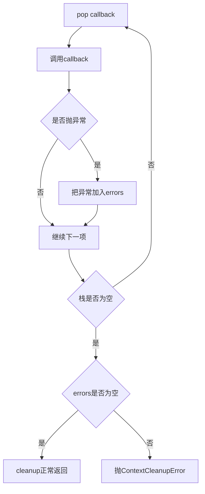
实现捕获 `BaseException`，把异常对象 append 到 errors，然后继续循环；所有 callback 消费后才统一决定是否抛错。
如果第一个失败就停止，后续资源一定没有清理机会；继续执行不能保证全部成功，但能避免一次失败立即扩大成更多泄漏。
### 16.2 错误聚合与脱敏
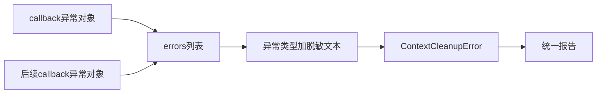
`ContextCleanupError` 保存原始异常对象列表；展示消息包含失败数量、异常类型和脱敏后的异常文本。

```python
class ContextCleanupError(TestContextError):
    def __init__(self, errors: list[BaseException]):
        self.errors = errors
        details = "; ".join(f"{type(error).__name__}: {_redact_text(str(error))}" for error in errors)
        super().__init__(f"Test context cleanup failed with {len(errors)} error(s): {details}")
```

输入是cleanup按捕获顺序收集的原始异常列表。对象保留这些异常供程序检查，面向人的消息只拼接异常类型与脱敏文本；构造函数不恢复资源、不重新执行callback，也不能保证未知秘密格式被识别。
测试用 `api_key=cleanup-secret` 与 Bearer Token 风格文本，证明这些测试格式会被脱敏，但不证明任意未知秘密格式都能识别。
### 16.3 失败测试的真实边界
单元测试只有 `fail()` 抛错，离线示例也只有 `fail_cleanup()` 抛错；两处都断言 errors 长度为 `1`。
它们证明失败前后的正常 callback 继续执行、最终聚合一个错误并脱敏。
它们没有制造两个或更多失败 callback，不能声称已覆盖多个失败异常的聚合顺序。
从实现可见异常按捕获顺序 append，但这不是多失败顺序的测试证据。
聚合只改善可观察性，不撤销成功动作、不重试失败动作，也不恢复 callback 已改变的外部状态。
---
## 17. cleanup 的幂等性边界
### 17.1 为什么第二次通常不再执行
第一次 cleanup 不断 pop，成功 callback 和失败 callback 都在调用前被移除，循环结束后列表为空。
### 17.2 一次消费模型
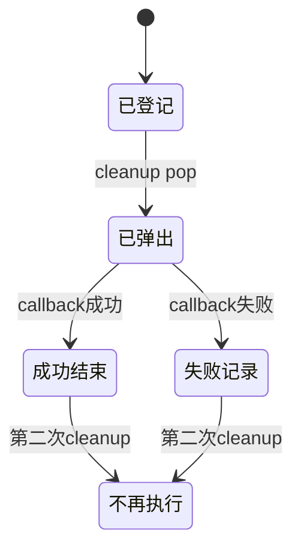
### 17.3 成功与失败后的重复 cleanup
成功 LIFO 单元测试连续调用两次 cleanup，第二次没有新增调用；离线成功示例也证明删除任务不会重复发生。
离线失败示例在第一次抛出 `ContextCleanupError` 后再次 cleanup，调用顺序没有变化，说明失败 callback 也已被消费，不会自动重试。
### 17.4 不要扩大“幂等”的含义
这里的幂等来自栈已为空，不证明每个 callback 自身幂等。
同一 callback 若被登记两次仍会执行两次；cleanup 期间动态登记新 callback 的行为也未被现有测试覆盖。
准确表述是：对已经完整消费的清理栈再次 cleanup，不会重复执行已弹出的 callback。
---
## 18. fixture 只在 teardown 触发 cleanup
### 18.1 fixture 生命周期
`module/conftest.py`中的fixture直接表达了setup与teardown边界：

```python
@pytest.fixture
def test_context() -> TestContext:
    context = TestContext()
    try:
        yield context
    finally:
        context.cleanup()
```

setup输入为空并创建新Context，yield把同一实例交给测试，teardown无论测试正常还是异常都调用cleanup。fixture只保证触发清理栈，不登记业务资源，也不吞掉ContextCleanupError。
`module/conftest.py` 中的 fixture 构造 `TestContext()`，yield 给测试，再在 finally 中调用 cleanup。
fixture 自身没有在 setup 阶段调用 cleanup，自动触发点固定在 yield 之后的 teardown。
### 18.2 fixture 不会自动登记资源
fixture 只创建空上下文，不观察局部变量、不扫描响应，也不知道测试将创建哪些资源。
资源只有显式 `add_cleanup()` 后，才进入该上下文的管理范围。
### 18.3 teardown 证据与边界
`test_module_test_context_fixture_runs_cleanup` 取得 fixture 生成器，登记 append callback，再推进生成器结束，证明 finally 会执行 cleanup。
离线示例在测试体内显式 cleanup 以便立即断言；测试结束后 fixture 仍会再调用一次，但栈已消费，不会重复旧 callback。
fixture 保证的是触发清理流程，不保证每个 callback 成功；失败时 cleanup 最终仍会抛 `ContextCleanupError`。
---
## 19. 测试证据地图：哪些结论被证明
### 19.1 三种证据标签
| 标签 | 含义 |
| --- | --- |
| 实现可见 | 可以从当前源码控制流直接读出 |
| 测试证明 | 现有测试明确构造并断言该行为 |
| 尚未证明 | 当前测试没有覆盖，不能扩张结论 |
区分这些标签，是为了防止把“代码看起来会这样”误写成“测试已经保护了这样”。
### 19.2 证据地图
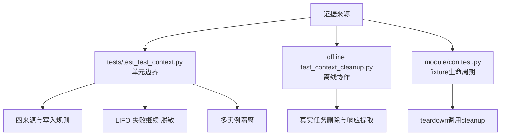
### 19.3 变量与提取
单元测试证明 set/get/require/has/delete/clear/snapshot 的基础行为、非法变量名拒绝与缺失变量错误。
它还证明 JSONPath 单值和多值、Header、Cookie、Regex 两种文本来源、extract 多来源拒绝与 extract_first 顺序选择。
### 19.4 缺失与类型
测试证明 optional 缺失且无 default 返回 None 且不写入；default 经过 transform 与 expected_type；JSON null 在默认必填状态下需要允许，允许后会真正写入 None。
测试还证明 transform 失败被包装、类型不匹配报告 expected 与 actual、测试中的敏感值不出现在类型错误文本。
### 19.5 清理
测试证明 callback 按 LIFO 执行、成功后重复 cleanup 不重复、一个失败 callback 不阻断后续项、最终错误被聚合并脱敏。
文件测试证明登记 `unlink` callback 后文件可被删除；fixture 测试证明 teardown 触发 cleanup；离线测试证明任务删除在失败 callback 之后仍执行。
### 19.6 隔离
两个 TestContext 实例使用同名变量仍各自读取自己的值，证明实例变量仓库独立。
线程测试让每个 worker 自己创建 context 并只写读自己的实例，证明的是独立实例在线程 worker 场景中的结果隔离。
---
## 20. 测试边界：哪些结论不能声称已经覆盖
### 20.1 同一个 TestContext 的并发写安全未被证明
线程测试的每个 worker 都创建新的 `TestContext()`，写入并读取自己的 `request_id`；不同线程没有共享同一个 context。
当前类内部也没有显式锁，所以准确结论是：独立实例在线程 worker 场景中隔离；同一实例的并发写、删与清理安全未被现有测试证明。
### 20.2 并发边界图
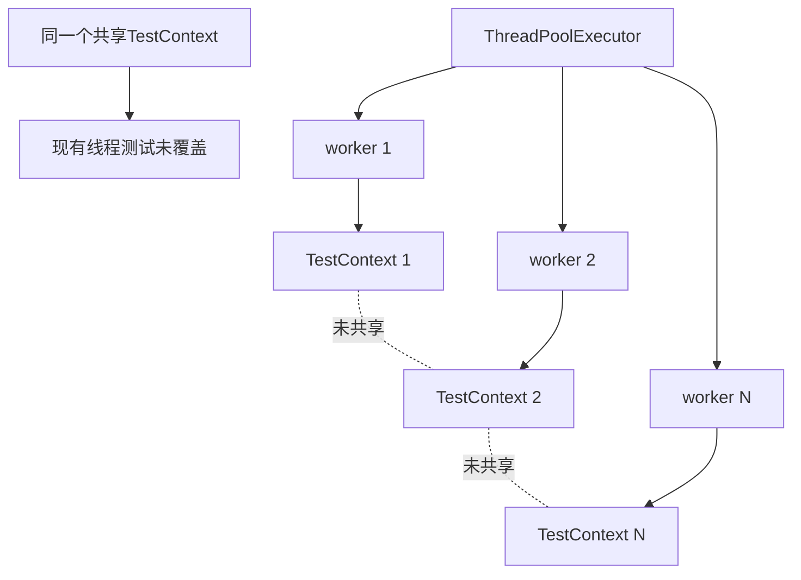
### 20.3 多失败顺序未被证明
实现允许收集多个异常对象，但现有失败测试都只制造一个失败 callback。
因此，不能把多个失败在 errors 中的顺序、多种异常混合消息或多失败脱敏组合写成已测试事实。
### 20.4 异步 callback 未被证明
现有测试只登记同步函数或同步 callable，没有测试事件循环、coroutine、awaitable 返回值或异步关闭。
所以不能声称异步清理受支持，也不能声称注册阶段主动拒绝异步函数；只能说明当前 cleanup 直接同步调用且不 await。
### 20.5 transform 事务性未被证明
测试覆盖 transform 成功转换和抛异常，没有覆盖修改外部对象后失败、成功后类型失败、自动回滚或重试。
所以不能把 transform 描述为事务。
### 20.6 领域约束未被证明
expected_type 只调用 `isinstance`，没有证明范围、枚举、跨字段一致性或资源存在性；`task_id` 是字符串不等于任务一定存在。
### 20.7 任意敏感信息脱敏未被证明
测试只证明特定 api_key 与 Authorization 格式被脱敏，未知格式、编码变体或嵌套异常对象不在证据内。
### 20.8 fixture 清理全部资源未被证明
fixture 只调用 context.cleanup；没有登记的资源不会进入清理栈，所以 fixture 存在不等于测试创建的全部资源都受管。
### 20.9 证据纪律如何保护设计判断
第一层只描述源码明确存在的控制流，例如 pop、append、isinstance 与 finally。
第二层只描述测试真实构造的输入和真实断言的输出。
第三层把没有覆盖的组合保留为开放边界，而不是用常识补齐。
这种纪律可以阻止四类推理跳跃：
- 从一个失败 callback 跳到多个失败顺序已覆盖；
- 从独立实例并发跳到共享实例线程安全；
- 从 callable 可登记跳到异步清理已完成；
- 从类型正确跳到领域对象一定有效。
TOC 视角下，过度解释证据会隐藏真正约束。
一旦约束被隐藏，后续设计就会围绕错误前提优化。
因此，本课宁可明确写“尚未证明”，也不把实现可能性包装成质量保证。
这个边界同样适用于未来新增测试：新增一个断言，只能扩大它直接覆盖的事实范围。
---
## 21. Day12 结论
### 21.1 关于作用域
`TestContext` 是测试用例粒度的变量仓库与清理栈；`RequestContext` 是请求 attempt 附近的请求事实对象，二者不能互相替代。
TestContext 不是模块级全局字典；测试证明不同实例隔离，但不证明同一实例并发写安全。
### 21.2 关于提取
`extract()` 必须恰好选择 JSONPath、Header、Cookie、Regex 中的一个来源。
`extract_first()` 按 sources 顺序选择第一个被代码判定为有值的来源；空字符串与空列表被视为无值，None 不等于缺失。
### 21.3 关于写入
真实顺序是：
> 提取 → 缺失/default/required → None/allow_none → transform → expected_type 的 isinstance 校验 → set。
optional 缺失且没有 default 时返回 None 且不写入；default 仍经过 transform 与类型检查。
transform 负责转换，expected_type 只负责校验，不负责领域约束，也不回滚 transform 外部副作用。
### 21.4 关于清理
`add_cleanup()` 只登记 callback；当前 cleanup 以同步直接调用方式执行，没有 await 路径。
`cleanup()` 用 pop 实现 LIFO，失败后继续剩余项，最后聚合异常并对错误文本脱敏。
注册成功不等于清理成功；fixture 只在 teardown 调 cleanup；资源必须显式 add_cleanup 后才进入 TestContext 清理责任范围。
### 21.5 关于证据边界
成功测试证明 LIFO 与重复 cleanup 不重复执行。
失败测试证明一个失败 callback 不阻断后续清理，并产生一个脱敏后的聚合错误；没有覆盖多个失败 callback 的聚合顺序。
线程测试是每个 worker 独立创建 TestContext，不是共享实例并发写。
---
## 22. 向 Day13 交付
Day12 已建立有作用域的 TestContext：变量不放进全局共享字典，清理动作与变量事实分开保存，fixture 在 teardown 触发清理，独立实例可以隔离。
但实例有作用域还不够，并发执行仍要回答：新线程或新任务如何拿到正确实例、哪些执行单元不能共享可变实例、cleanup 如何与并发完成边界对齐。
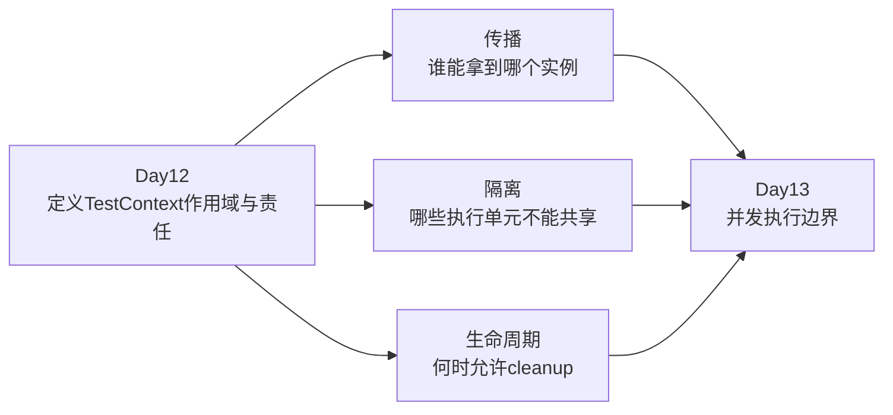
Day13 的起点是：
> **有作用域的 TestContext 仍需在并发执行边界正确传播与隔离。**
