# 第 13 天：上下文传播与并发隔离

> **课程定位**：承接第 12 天的 TestContext 作用域和清理责任，解释执行跨越线程池边界时，逻辑上下文如何传播，Request、Session 与 Header 又如何通过实例所有权保持隔离  
> **Module 层落点**：默认用 marker 决定是否串行；确需在单个用例内创建线程时使用 `submit_with_context()`，并让每个 worker 创建和关闭自己的 Request  
> **讲解重点**：`ContextVar`、`copy_context()`、`context.run()`、提交时快照、TestContext 独立实例、worker Request 生命周期、Session 与单次 Header 边界  
> **课程形式**：纯讲解，不设置实操、练习、作业、小测、命令执行要求或教学门禁  
> **事实依据**：`common/context_executor.py`、`common/runtime_hooks/provider.py`、`module/offline_framework_example/test_concurrency_context.py`、`tests/quality/test_quality_context_executor.py` 与 Header 隔离测试  
> **本课边界**：只讲 ThreadPoolExecutor 相关证据，不展开 Day 14 CLI、Day 15 分池，也不展开 Day 18 Runtime Hooks 内部实现

---

## 0. 从第 12 天读取什么模型

Day 12 已经建立：

- TestContext 面向一次测试流程。
- 变量与清理 callback 属于具体 Context 实例。
- 不同 TestContext 实例互不共享内部字典和清理栈。
- 资源只有显式登记后才由 TestContext 清理。

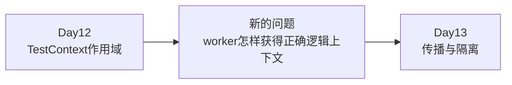

### 0.1 一个 Context 对象存在，不等于 worker 能看见它

并发代码增加了一个执行边界：

```text
父执行流
→ 提交任务
→ 线程池选择worker
→ worker执行函数
```

如果没有明确传播，worker 可能：

- 读不到父执行流的 ContextVar。
- 读到默认值。
- 使用错误的逻辑观察者。

### 0.2 本课唯一新增模型

> 逻辑上下文通过提交时快照传播，实例资源通过 worker 内创建和关闭保持隔离。

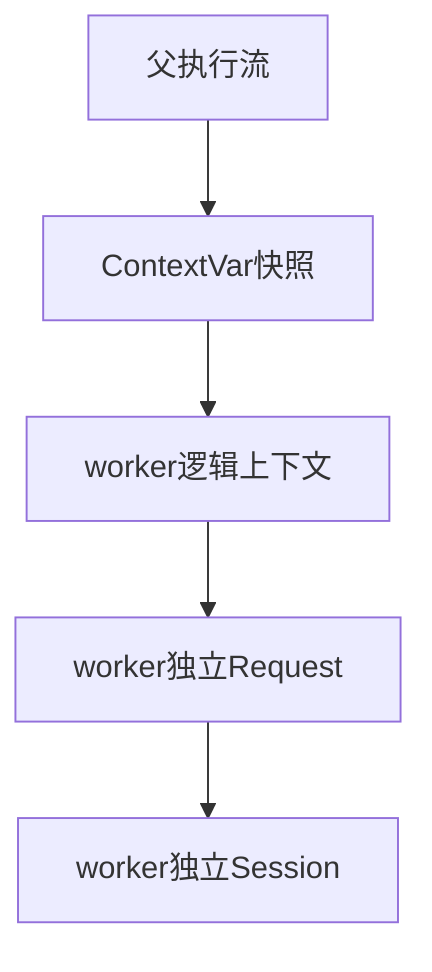

---

## 1. 第一性原理：传播与隔离是两个问题

### 1.1 传播回答“worker 应该知道什么”

例如：

- 当前测试身份。
- 当前运行观察者。
- 当前逻辑 owner。

### 1.2 隔离回答“worker 不应该共享什么”

例如：

- 可变 Session。
- Request 实例。
- 单次请求 Header。
- TestContext 内部变量字典。

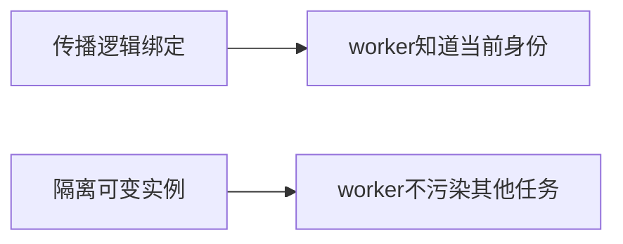

### 1.3 TOC 因果链

如果把传播误认为实例复制：

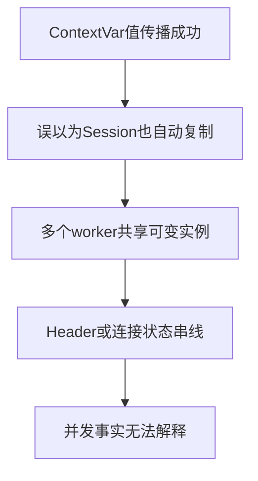

所以本课必须同时回答两条链，但不能把它们合成一个机制。

---

## 2. 四个容易混淆的对象

| 对象 | 保存什么 | 典型作用域 | 是否由 `copy_context()` 创建新实例 |
| --- | --- | --- | --- |
| ContextVar 绑定 | 当前执行上下文中的逻辑值 | 执行上下文 | 复制绑定关系 |
| TestContext | 变量字典与清理栈 | 一次测试或显式实例 | 否 |
| Request 对象 | 配置、Session、Middleware | worker 或调用方实例 | 否 |
| Session | Header 与连接复用状态 | 随 Request 实例 | 否 |

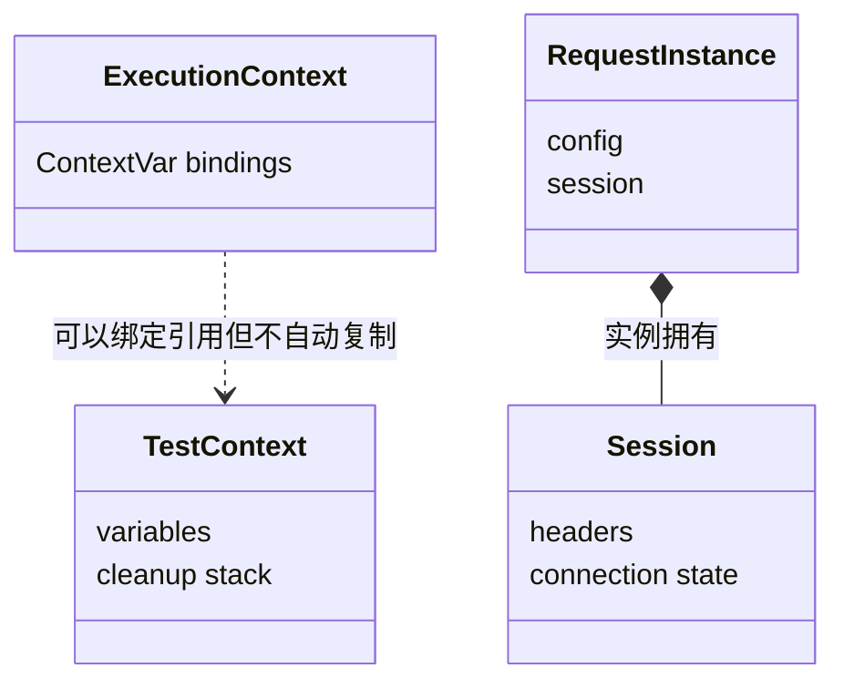

### 2.1 隔离不是同一个词的重复

可以同时出现：

- 两个 worker 读取相同 owner 字符串。
- 两个 worker 使用不同 Request 实例。
- 两个 worker 使用不同 Session。

相同逻辑身份与独立资源并不矛盾。

---

## 3. ContextVar 表达当前逻辑绑定

`common/runtime_hooks/provider.py` 定义一个 ContextVar：

```text
_RUNTIME_HOOKS
```

它有默认 Noop 值，并提供：

- `get_runtime_hooks()`。
- `bind_runtime_hooks(hooks)`。
- `reset_runtime_hooks(token)`。

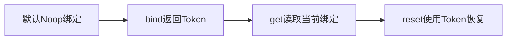

### 3.1 Token 表示恢复点

`set()` 返回 Token。

后续 `reset(token)` 恢复之前的绑定。

这与修改模块全局变量不同：

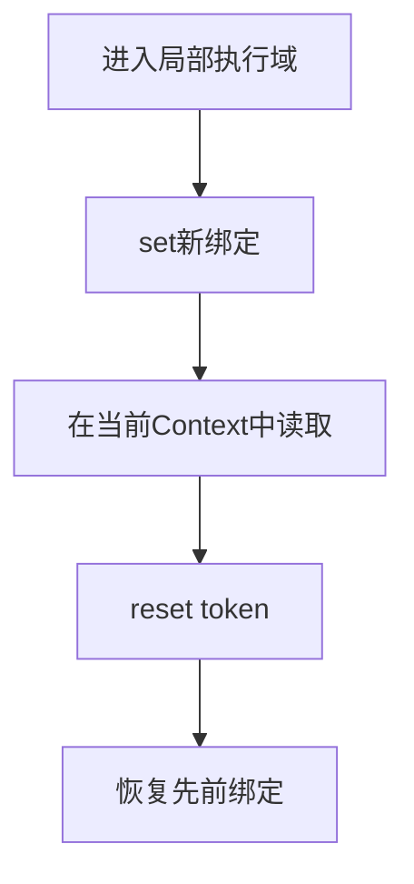

### 3.2 本课不展开 Runtime Hooks

这里使用 provider 只为证明：

- 某类运行观察者存放在 ContextVar 中。
- 绑定可以被提交时上下文传播。

Hook 如何记录 Operation、Group 与结果属于 Day 18。

---

## 4. `submit_with_context()` 的全部核心只有两步

实现是：

```text
context = copy_context()
executor.submit(context.run, function, *args, **kwargs)
```

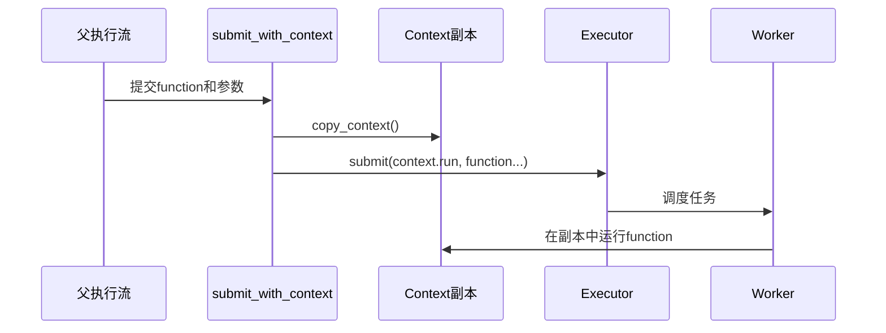

### 4.1 快照在提交时创建

不是 worker 真正开始时才复制。

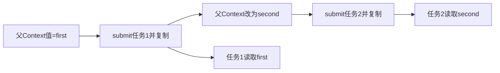

### 4.2 `Future` 语义不被替换

helper 返回 Executor 的 `Future`。

因此：

- 函数返回值仍通过 `future.result()` 获得。
- 函数异常仍通过 `future.result()` 重新抛出。
- helper 不吞掉业务异常。

---

## 5. 原生 `executor.submit()` 与显式传播

当前项目明确提供 `submit_with_context()`。

课程不能写成：

> 任何线程池提交都会自动传播 ContextVar。

准确边界是：

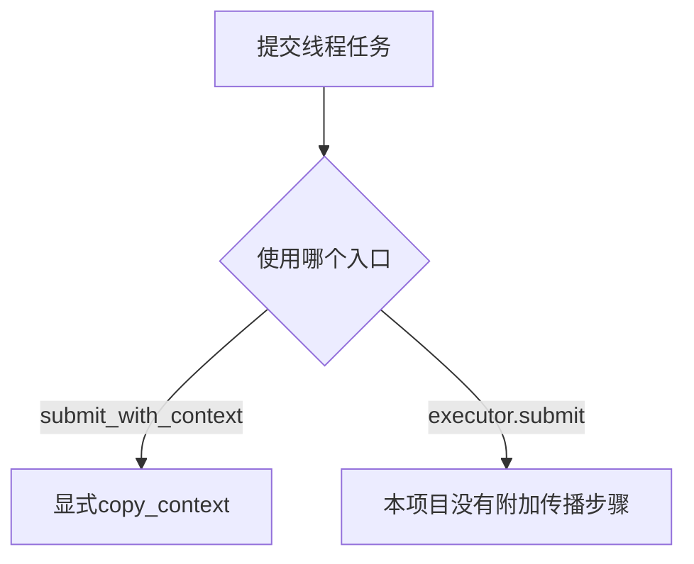

### 5.1 为什么使用包装入口

包装入口把传播责任固定在提交边界，而不是要求每个 worker 自己猜测父 Context。

### 5.2 现有证据只覆盖线程池

测试使用 `ThreadPoolExecutor`。

不能据此声称：

- `ProcessPoolExecutor` 受支持。
- Context 对象可以跨进程序列化。
- 任意自定义 Executor 都有相同语义。

---

## 6. `copy_context()` 不深复制绑定值

Context 快照复制的是绑定关系。

如果某个 ContextVar 绑定的是可变 list：

```text
ContextVar → list对象
```

两个 Context 可能仍引用同一个 list。

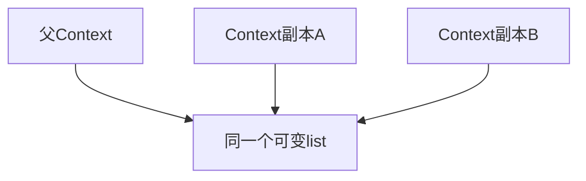

### 6.1 字符串测试不能证明深复制

现有传播测试使用字符串值。

字符串不可变，所以测试能够证明：

- 提交时值被正确读取。

它不能证明：

- 可变值会自动复制。
- worker 修改 list 不影响其他 Context。

### 6.2 项目中确有可变 ContextVar 值

媒体下载任务与模型结果文件收集等位置使用 ContextVar 保存 list。

本课只把它们作为“不能假定深复制”的边界，不展开其业务生命周期。

---

## 7. Context Executor 的三个直接测试

### 7.1 每次 submit 捕获自己的快照

测试先设置 `first` 并提交任务一，再设置 `second` 并提交任务二。

断言：

```text
任务一结果 = first
任务二结果 = second
```

这直接证明快照时点在每次 submit 调用中。

### 7.2 多个任务可以读取传播后的相同绑定

测试提交 40 个任务读取同一字符串绑定。

所有结果都是 `shared`。

这直接证明多个已提交任务都能读取传播后的绑定值。

它没有检查 Context 对象身份，也没有强制多个任务同时重入同一个 Context，因此不能仅凭这个测试声称“任务绝不复用同一个 Context 对象”。

每次 `submit_with_context()` 都调用 `copy_context()`，属于源码可以直接读取的实现事实。

它不证明绑定值对象被深复制。

### 7.3 返回值与异常保持

成功任务返回 `2 + 3 = 5`。

失败任务抛 `ValueError(broken)`。

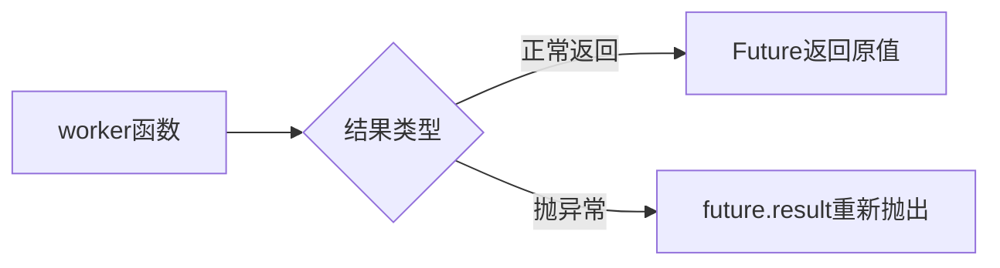

helper 只增加上下文传播，不改变函数结果合同。

---

## 8. TestContext 隔离来自独立实例

`tests/test_test_context.py` 的线程测试在每个 worker 内：

1. 新建 `TestContext()`。
2. 写入自己的 request_id。
3. 读取自己的值。

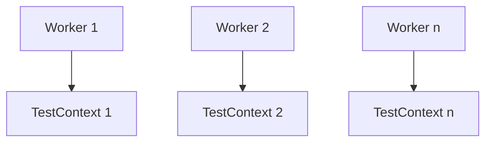

### 8.1 测试没有做什么

它没有让多个线程同时写同一个 TestContext。

所以不能声称：

- 同一 `_variables` 字典支持并发写。
- 同一 cleanup 栈支持并发 push/pop。
- TestContext 内置锁或事务。

### 8.2 ContextVar 与 TestContext 的关系

ContextVar 可以绑定一个 TestContext 引用。

但绑定引用不等于复制实例。

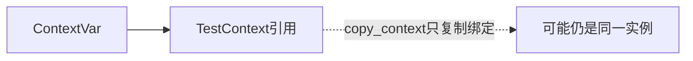

如果需要 TestContext 数据隔离，仍要控制实例创建边界。

---

## 9. Offline 并发场景的 worker 所有权

`_query_audit_worker()` 在每个 worker 内新建：

```text
OfflineFrameworkRequest
```

并记录其 Session ID。

最后在 `finally` 中：

```text
request_client.close()
```

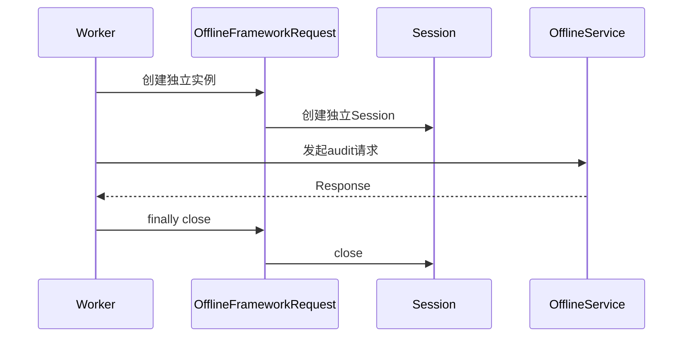

### 9.1 Session 隔离的来源

不是：

```text
copy_context() 复制 Session
```

而是：

```text
每个 worker 新建 Request
→ 每个 Request 新建 Session
→ 每个 worker finally 关闭自己的 Session
```

### 9.2 相同 owner 与不同 Session 同时成立

两个 worker 都可以继承：

```text
offline-concurrency-owner
```

同时拥有不同 Session ID。

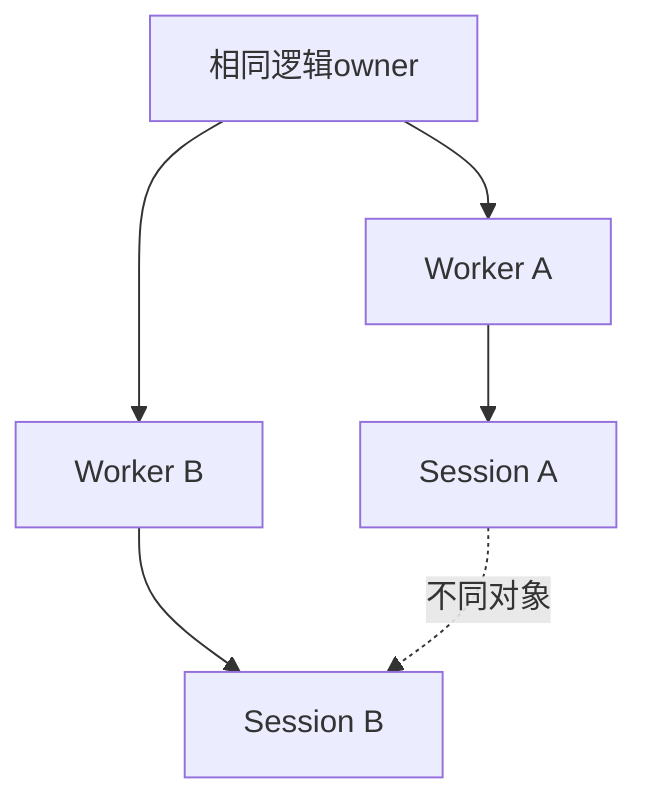

这正是逻辑传播与资源隔离的组合。

---

## 10. 并发编排怎样提交 worker

`_run_audit_workers()` 创建：

- `Barrier(2)`。
- `closed_session_ids` 集合。
- 保护该集合的 `Lock`。
- `ThreadPoolExecutor(max_workers=2)`。

随后每个 audit name 都通过 `submit_with_context()` 提交。

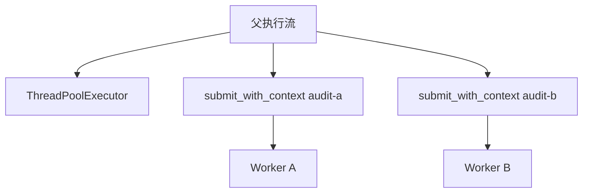

### 10.1 Barrier 的责任

Barrier 让两个 worker 在发送前相遇，提高并发重叠概率。

它不负责：

- ContextVar 传播。
- Session 创建。
- Header 合并。

### 10.2 Lock 的责任

Lock 只保护 `closed_session_ids.add(...)`。

它不能被解释成整个 Request 或 Session 的线程安全锁。

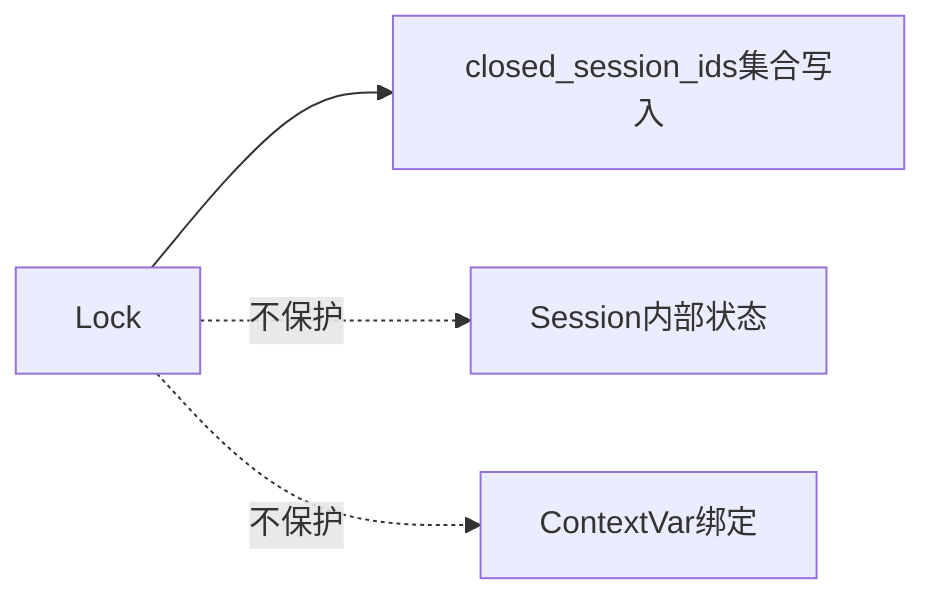

---

## 11. 并发测试证明的 Session 事实

### 11.1 两个 Session ID 不同

测试收集两个 worker 的 `session_id`，断言集合长度为 2。

### 11.2 两个 Session 都进入关闭记录

测试断言：

```text
closed_session_ids == session_ids
```

这证明 worker finally 记录到两个实例的 close 路径。

它不证明底层所有连接资源都已经物理释放。

### 11.3 `trust_env` 事实

测试断言两个 Session 的 `trust_env` 都为 False。

这是当前 OfflineFrameworkRequest 初始化事实，不是 ContextVar 的结果。

---

## 12. 单次 Header 为什么不应残留到 Session

`get_audit()` 把：

```text
X-Audit-Name
```

作为本次 `get(..., headers=...)` 参数传入。

BaseRequest 构造 Context 时：

1. 复制请求 kwargs。
2. 取出本次 headers。
3. 复制 Session Header。
4. 用本次 headers 更新副本。
5. 把合并结果放回 `context.kwargs`。

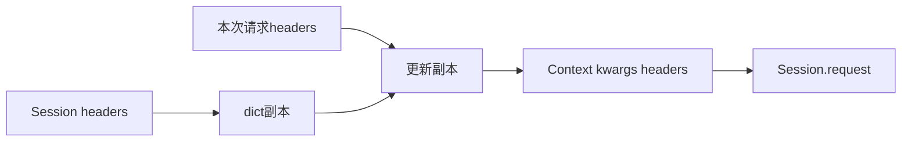

### 12.1 关键不是 Header 名称

关键是本次 Header 进入请求参数副本，而不是调用 `session.headers.update(...)`。

### 12.2 测试直接断言

worker 返回：

```text
X-Audit-Name in request_client.session.headers
```

测试要求其为 False。

这证明该特定单次 Header 没有残留在 worker 的 Session Header 中。

---

## 13. Protocol Header 的共享实例边界

ProtocolRequest 的 Anthropic 请求使用：

- 本次构造的 Header 字典。
- `_inherit_session_headers=False`。

BaseRequest 在关闭 Session Header 继承时，先用 Session Header 名称构造 None 覆盖，再更新本次 Header。

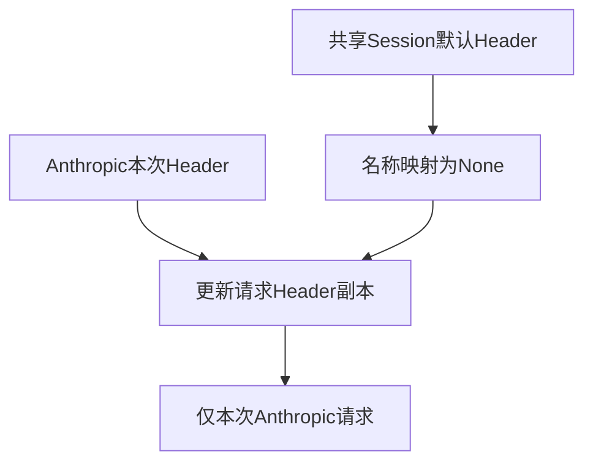

### 13.1 已知缺陷回归测试证明什么

测试在同一个 ProtocolRequest 上并发发起：

- Anthropic message。
- OpenAI chat completion。

最终观察 OpenAI 请求看到的 Session Header，不包含 Anthropic 专用 Header。

### 13.2 不能扩大成通用线程安全

这个测试证明特定 Header 路径没有通过 Session Header 污染另一个调用。

它不证明：

- requests.Session 的任意并发操作都线程安全。
- 同一 Session 的 cookie、adapter、连接状态都隔离。
- 任意自定义 Middleware 都不会修改共享状态。

---

## 14. 三种隔离合同

### 14.1 逻辑隔离

ContextVar 绑定决定 worker 当前看到哪个逻辑 owner 或观察者。

### 14.2 数据隔离

TestContext 通过独立实例拥有不同变量字典与清理栈。

### 14.3 资源隔离

Request 实例通过独立 Session 拥有传输资源，并由 worker finally 关闭。

```mermaid
flowchart TB
    ISO[并发隔离]
    ISO --> L[逻辑隔离<br/>ContextVar]
    ISO --> D[数据隔离<br/>TestContext实例]
    ISO --> R[资源隔离<br/>Request与Session实例]
```

任何一层缺失，都可能产生不同类型的串线。

---

## 15. 现有测试证据矩阵

| 测试 | 直接证明 | 不能扩大为 |
| --- | --- | --- |
| snapshot per task | 每次 submit 读取自己的提交时字符串值 | 可变值深复制 |
| 40 concurrent tasks | 多任务可读取传播后的相同绑定 | ProcessPool 支持 |
| return value and exception | Future 保留返回值与异常 | worker 资源自动关闭 |
| preserves case ownership | owner 与 runtime observer 能进入 worker | Session 由 ContextVar 创建 |
| independent sessions | 两个 worker Session ID 不同并记录关闭 | 任意 Session 操作线程安全 |
| headers do not leak | 单次 X-Audit-Name 不残留到 Session | 所有 Header 路径无竞态 |
| Anthropic regression | 特定协议 Header 不污染并发 OpenAI 观察 | 共享 Session 完全线程安全 |

```mermaid
flowchart LR
    ASSERT[测试断言] --> DIRECT[直接事实]
    DIRECT -.不能自动扩展.-> GENERAL[通用并发安全结论]
```

---

## 16. 明确未被证明的合同

### 16.1 ProcessPool

没有现有证据证明：

- Context 可以跨进程序列化。
- Request 或 Session 可以跨进程传播。
- `submit_with_context()` 适配 ProcessPoolExecutor。

### 16.2 可变 ContextVar 值

没有测试证明 list、dict 或自定义对象在 Context 副本间深复制。

### 16.3 同一 TestContext 并发写

线程测试使用独立实例。

没有证据证明一个 TestContext 可被多个 worker 同时修改。

### 16.4 共享 Session 的完整线程安全

特定 Header 测试不能覆盖：

- cookie 修改。
- adapter 修改。
- 认证状态修改。
- 自定义 Middleware 写共享状态。

```mermaid
flowchart TD
    E[当前证据] --> H[特定Header隔离]
    E --> S[独立Session实例]
    H -.不能推出.-> ALL[共享Session所有操作安全]
    S -.不能推出.-> ALL
```

---

## 17. 常见误解与正确边界

| 常见误解 | 正确理解 |
| --- | --- |
| ContextVar 会复制所有对象 | 它复制执行上下文绑定，不深复制绑定值 |
| 原生 executor.submit 自动传播 | 项目通过 submit_with_context 显式传播 |
| ContextVar 传播创建 TestContext | TestContext 仍需独立实例化或显式绑定 |
| 相同 owner 表示共享同一 Session | 逻辑值可相同，Session 仍可独立 |
| Lock 保护了整个 Request | 当前 Lock 只保护关闭 ID 集合写入 |
| Header 不泄漏表示 Session 完全线程安全 | 只能证明特定 Header 路径 |
| worker 返回表示 Session 一定关闭 | 当前 worker finally 负责 close；其他 worker 函数未必相同 |
| ThreadPool 证据可以推广到 ProcessPool | 进程边界没有现有支持证据 |

---

## 18. 设计选择与适用边界

### 18.1 提交时复制 Context

收益：

- 每个任务拥有明确快照。
- 父 Context 后续变化不改写已提交任务。
- Future 行为保持原样。

代价：

- 可变绑定值仍可能共享。
- 必须使用包装入口。

### 18.2 worker 内创建 Request

收益：

- Session 所有权清晰。
- close 可以放在同一 worker finally。
- 单次 Header 不需要写入共享 Session。

代价：

- 每个 worker 创建独立客户端与 Session。
- 连接复用范围缩小。

```mermaid
flowchart TB
    CHOICE[并发设计选择]
    CHOICE --> SNAP[提交时Context快照]
    CHOICE --> INST[worker独立Request]
    SNAP --> TRADE[传播确定性与可变值风险]
    INST --> TRADE2[资源隔离与复用代价]
```

---

## 19. TOC 清晰思考：真正瓶颈是共享可变所有权

只增加线程数量不会自动产生安全并发。

```mermaid
flowchart TD
    A[更多worker] --> B{状态所有权清晰吗}
    B -- 否 --> C[共享Session Header Context混杂]
    C --> D[并发扩大串线概率]
    B -- 是 --> E[逻辑传播与资源隔离分开]
    E --> F[并发事实可解释]
```

本课的 TOC 结论是：

> 并发系统的主要约束不是 worker 数量，而是可变对象是否有唯一、可关闭、可审计的所有者。

因果链可以压缩为：

```text
提交时复制逻辑绑定
→ worker 读取正确身份
→ worker 创建自己的 Request
→ Request 拥有自己的 Session
→ 本次 Header 进入请求副本
→ worker finally 关闭自己的实例
```

---

## 20. Day 13 完整对象模型

```mermaid
flowchart TB
    P[父执行流]
    CV[ContextVar绑定]
    SUB1[第一次submit_with_context]
    SUB2[第二次submit_with_context]
    COPY1[第一次copy_context快照]
    COPY2[第二次copy_context快照]
    W1[Worker A]
    W2[Worker B]
    T1[TestContext A]
    T2[TestContext B]
    R1[Request A]
    R2[Request B]
    S1[Session A]
    S2[Session B]

    P --> CV
    P --> SUB1
    P --> SUB2
    SUB1 --> COPY1
    SUB2 --> COPY2
    COPY1 --> W1
    COPY2 --> W2
    W1 -.在独立实例场景中显式创建.-> T1
    W2 -.在独立实例场景中显式创建.-> T2
    W1 --> R1
    W2 --> R2
    R1 --> S1
    R2 --> S2
```

这是一张跨测试场景的对象边界图，不表示单个测试同时创建了图中所有对象。Context 快照来自每次提交；TestContext 隔离来自 worker 显式创建独立实例；Request 与 Session 隔离来自各 worker 自己创建并关闭实例。

需要记住：

1. Context 快照传播逻辑绑定。
2. TestContext 是否独立取决于实例边界。
3. Request 与 Session 不由 copy_context 创建。
4. Header 隔离来自本次参数副本与实例所有权。
5. worker finally 是当前 Offline 场景的关闭点。

---

## 21. 向 Day 14 交付什么

Day 13 已经说明执行域内部怎样保持上下文与资源边界。

下一步需要回答：执行域最初从哪里获得配置？

```mermaid
flowchart LR
    D13[Day13<br/>执行上下文与实例隔离] --> Q[需要确定外部输入]
    Q --> D14[Day14<br/>稳定入口与CLI参数]
```

Day 13 向 Day 14 交付：

- worker 需要明确逻辑上下文。
- 可变资源必须有实例所有者。
- 运行配置不能依赖多个线程共同修改的全局变量。
- 创建执行任务之前，应先形成稳定、显式的用户输入。

Day 14 将把注意力移到 `run_master.py` 与 CLI 参数边界，不再展开线程池内部机制。
