# 第 14 天：稳定入口与命令行参数

> **课程定位**：承接第 13 天的执行上下文与隔离边界，把观察范围从“一个 worker 如何获得正确上下文”扩大到“用户意图如何通过稳定入口进入 Runner”  
> **Module 层落点**：用例作者保证文件、类和方法可被 pytest 收集，并通过稳定入口选择目录、文件或 nodeid；不在业务用例中导入 Runner 内部 stage  
> **讲解重点**：根入口、公开 API、`argv`、`parse_known_args()`、已知参数、pytest 参数、路径优先级、兼容参数与当前解析歧义  
> **课程形式**：纯讲解，不设置实操、练习、作业、小测、命令执行要求或教学门禁  
> **事实依据**：`run_master.py`、`run_orchestration/__init__.py`、`run_orchestration/cli.py`、`run_orchestration/runner.py`、`run_orchestration/pytest_execution.py` 与公开入口测试  
> **本课边界**：只讲参数如何进入执行编排，不展开 Day 15 的权威收集与分池，也不展开 Day 16 的 Pool Result 和退出码

---

## 0. 从第 13 天读取什么模型

第 13 天已经建立：

- 执行上下文需要明确的作用域。
- 隐式共享的可变状态会破坏并发隔离。
- 逻辑身份传播与 Session 实例所有权是两类问题。
- worker 开始工作前，必须先获得一份确定的执行输入。

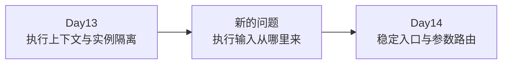

Day 14 不再研究线程内部怎样传播 ContextVar。

本课把视角移动到整个执行系统的最外层：

```text
用户表达意图
→ 根入口接收 argv
→ CLI 识别框架参数
→ 剩余参数交给 pytest 计划层
→ Runner 获得明确输入
```

### 0.1 本课唯一新增模型

> 稳定入口不是业务执行器，而是把不稳定的外部参数翻译成内部可识别输入的边界。

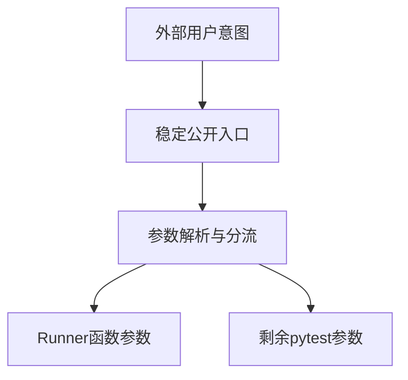

### 0.2 TOC 视角：真正约束不是参数数量

如果系统没有稳定入口：

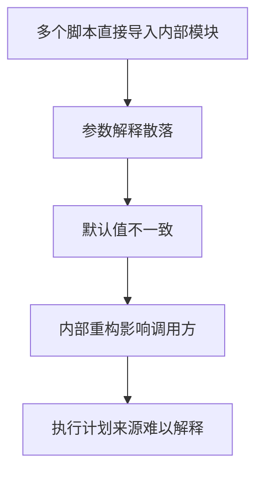

表面问题是“参数太多”。

更深层的因果链是：

```text
外部接口不稳定
→ 用户意图没有统一翻译点
→ 内部模块同时承担兼容责任
→ 参数所有权变得模糊
→ 后续收集与调度难以证明来自同一输入
```

所以本课先解决入口稳定性，不提前解决执行结果。

---

## 1. 第一性原理：入口为什么要薄

一个执行入口最小只需要完成三件事：

1. 暴露稳定名称。
2. 接收外部参数。
3. 把参数委托给真正的编排层。

它不需要自己：

- 收集测试。
- 创建并行池。
- 执行 pytest。
- 计算最终退出码。
- 生成质量事实。

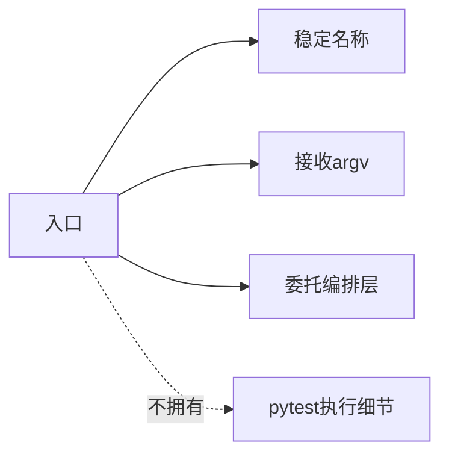

### 1.1 薄入口减少什么变化

内部实现可能不断拆分：

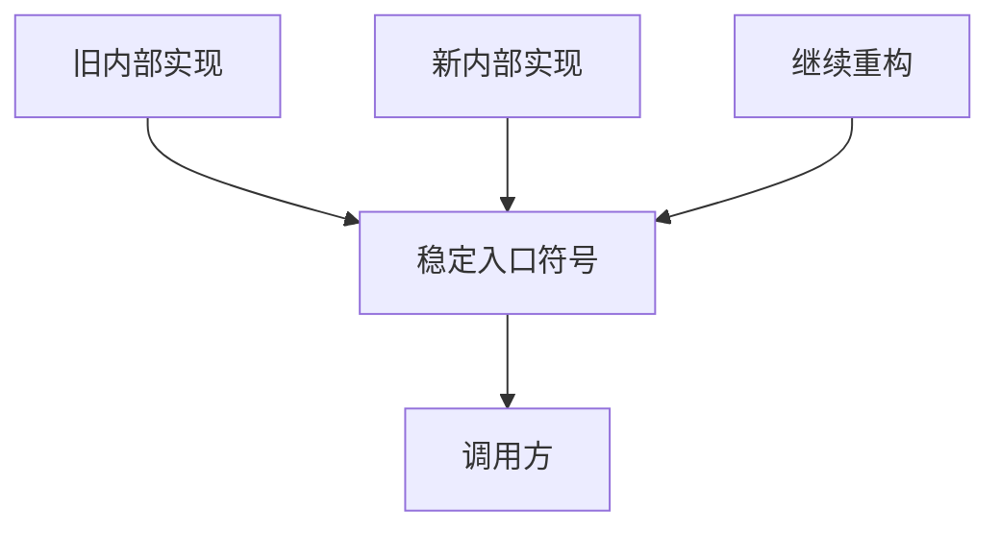

调用方只依赖稳定入口，不需要知道内部模块如何移动。

### 1.2 薄不等于没有责任

入口仍然拥有：

| 责任 | 当前实现怎样表达 |
| --- | --- |
| 公开符号 | `run`、`main`、`PROJECT_ROOT`、`DEFAULT_ALLURE_RESULTS_DIR` |
| 脚本参数来源 | `sys.argv[1:]` |
| 编码环境默认值 | `PYTHONIOENCODING`、`PYTHONUTF8` |
| 进程退出委托 | `SystemExit(main(...))` |

它不拥有 pytest 收集事实。

---

## 2. `run_master.py` 是兼容门面

根文件只从 `run_orchestration` 导入四个公开符号：

```text
DEFAULT_ALLURE_RESULTS_DIR
PROJECT_ROOT
main
run
```

并用 `__all__` 再次声明同一组公开名称。

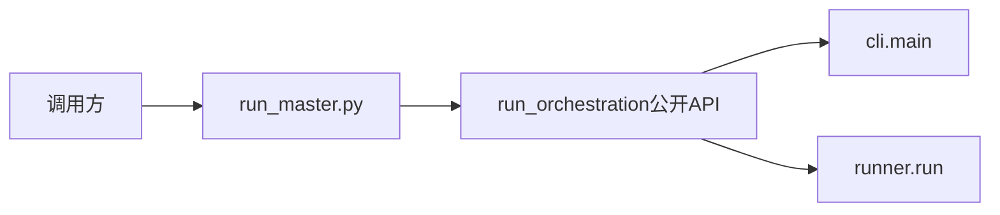

### 2.1 门面与实现层不能混淆

| 对象 | 面向谁 | 主要责任 |
| --- | --- | --- |
| `run_master.py` | 外部脚本与兼容调用方 | 稳定导出并委托 |
| `run_orchestration.__init__` | Python 调用方 | 定义编排包公开 API |
| `cli.main` | 命令行入口 | 解析参数并调用 Runner |
| `runner.run` | 内部编排 | 接收规范化输入并进入计划阶段 |

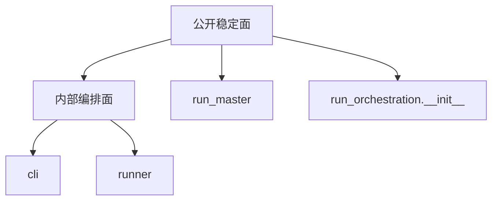

### 2.2 根入口没有直接导入 pytest 或 Quality

公开入口测试通过 AST 检查确认：

- 根文件没有直接导入 `pytest`。
- 根文件没有直接导入 `quality`。
- `run_master.run` 与包导出的 `run` 是同一对象。
- `run_master.main` 与包导出的 `main` 是同一对象。

这个证据只证明公开边界稳定。

它不证明 CLI 参数解析正确，也不证明测试能够成功执行。

---

## 3. 脚本执行路径

当文件作为脚本运行时，顺序是：

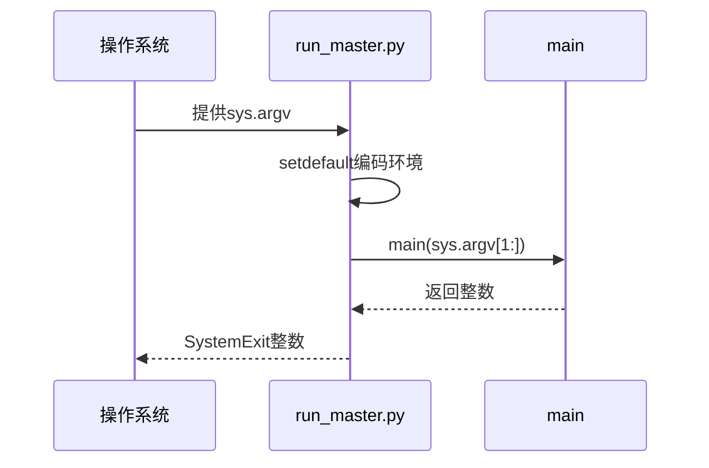

### 3.1 为什么传入 `sys.argv[1:]`

`sys.argv[0]` 是脚本自身路径。

真正需要解释的是后续参数：

```text
sys.argv
= [脚本名, 参数1, 参数2, ...]

sys.argv[1:]
= [参数1, 参数2, ...]
```

### 3.2 编码设置只是默认值

入口使用 `os.environ.setdefault(...)`。

这意味着：

- 如果外部已经设置，入口不会覆盖。
- 如果外部没有设置，入口补默认值。
- 编码环境不是 Runner 配置对象的一部分。

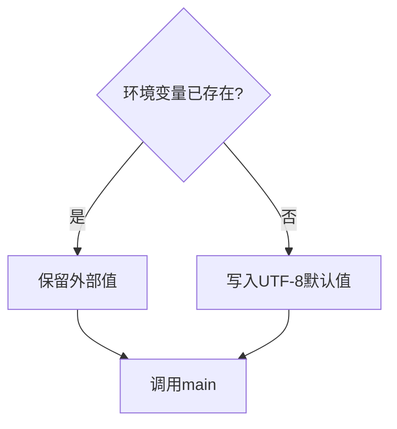

---

## 4. `main()` 是参数桥接层

`run_orchestration.cli.main()` 做两步：

1. 调用 `parse_args()`。
2. 把解析结果交给 `runner.run()`。

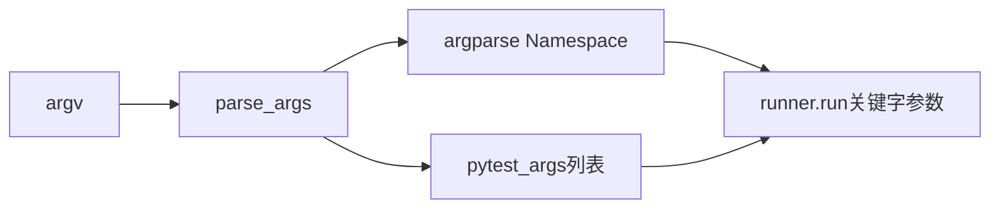

### 4.1 当前不存在统一 `RunnerConfig`

课程中不能把当前实现描述成：

```text
argv → RunnerConfig → Runner
```

真实形态是：

```text
argv
→ argparse.Namespace
+ pytest_args list
→ runner.run(...) 的关键字参数
→ 后续 PytestArgumentPlan
```

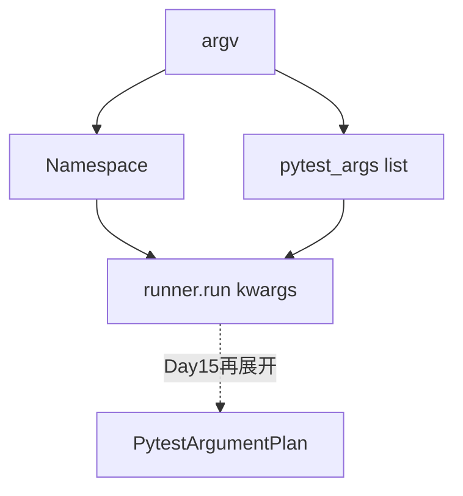

把不存在的配置类写进课程，会让学员寻找一个源码中没有的对象。

### 4.2 `main()` 不代表已经执行

参数桥接完成只能证明：

- Runner 收到了 test path。
- Runner 收到了 pytest 参数。
- Runner 收到了并发和 marker 选项。

它不能证明：

- 测试已经收集。
- nodeid 已经形成。
- parallel/serial 已经分池。
- pytest 已经执行。

---

## 5. `parse_known_args()` 为什么产生两条参数轨

CLI 使用的不是 `parse_args()`，而是 `parse_known_args()`。

它产生：

```text
已知参数 → Namespace
未知参数 → pytest_args
```

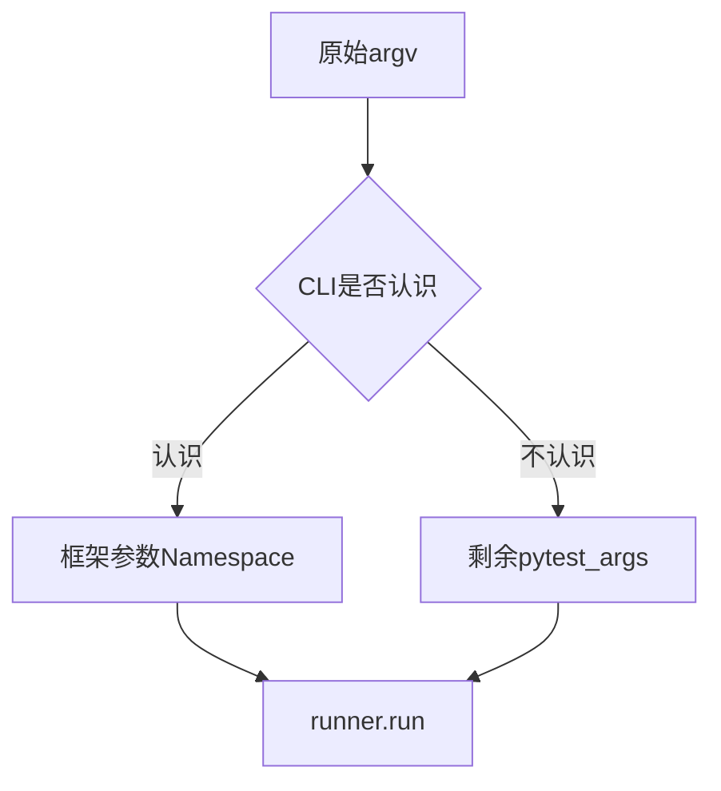

### 5.1 为什么不重新实现 pytest 参数解析器

pytest 与插件参数数量很多。

框架只显式拥有自己的参数，把其他参数留给 pytest，能减少重复解释。

但是“未知参数被返回”不等于“任何未知参数组合都能无损透传”。

这个限制与可选 positional target 有关，后文会单独展开。

---

## 6. 当前 CLI 显式认识哪些参数

| 参数 | 解析结果 | 当前用途 |
| --- | --- | --- |
| positional `target` | `parsed_args.target` | 测试路径候选 |
| `--test-path` | `parsed_args.test_path` | 显式测试路径 |
| `-n / --numprocesses` | `parsed_args.numprocesses` | Runner 是否进入并行优先分支的主要信号 |
| `--dist` | `parsed_args.dist` | 后续并行参数 |
| `--serial-marker` | `parsed_args.serial_marker` | Day15 分池标记名 |
| `--parallel-first` | `parsed_args.parallel_first` | 当前只解析，不传给 Runner |

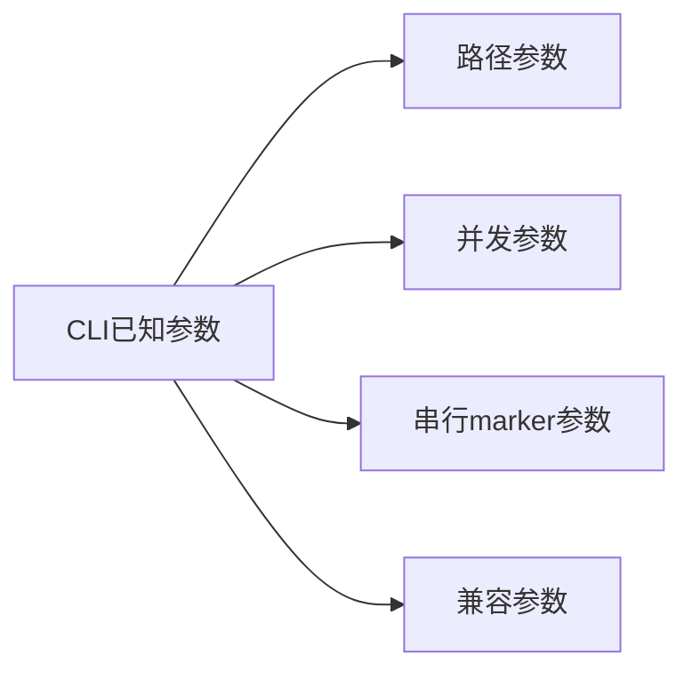

本课只解释路由事实，不评价参数设计是否最优。

---

## 7. 测试路径的三层优先级

`parse_args()` 最后计算：

```text
parsed_args.test_path
or parsed_args.target
or DEFAULT_TEST_PATH
```

因此优先级是：

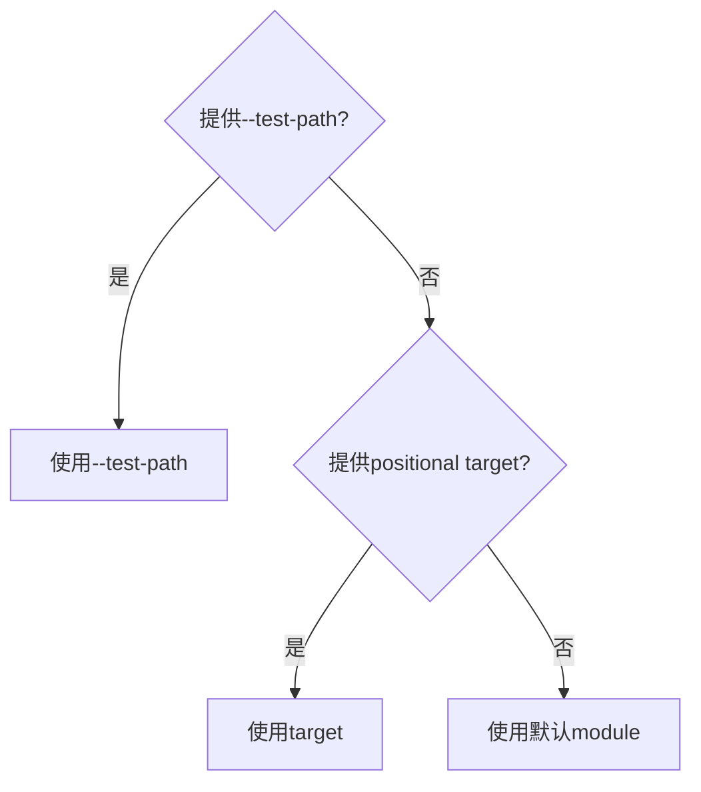

### 7.1 显式参数优先

即使 positional target 同时存在，`--test-path` 仍优先。

这是一条解析优先级，不是路径有效性证明。

当前 CLI 层没有在这里证明：

- 路径存在。
- 路径可被 pytest 收集。
- 路径内一定有测试。

### 7.2 默认值属于入口合同

`DEFAULT_TEST_PATH` 当前为 `module`。

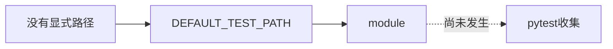

默认路径只说明 Runner 将收到什么字符串。

---

## 8. positional target 与未知参数值的歧义

这是 Day 14 最需要保留的源码边界。

`parse_known_args()` 可以返回未知选项，但解析器同时声明了一个可选 positional target。

当参数形态类似：

```text
-k smoke
```

CLI 不认识 `-k`，但 `smoke` 可能被 positional target 消费。

当前解析结果会形成类似事实：

```text
test_path = smoke
pytest_args = [-k]
```

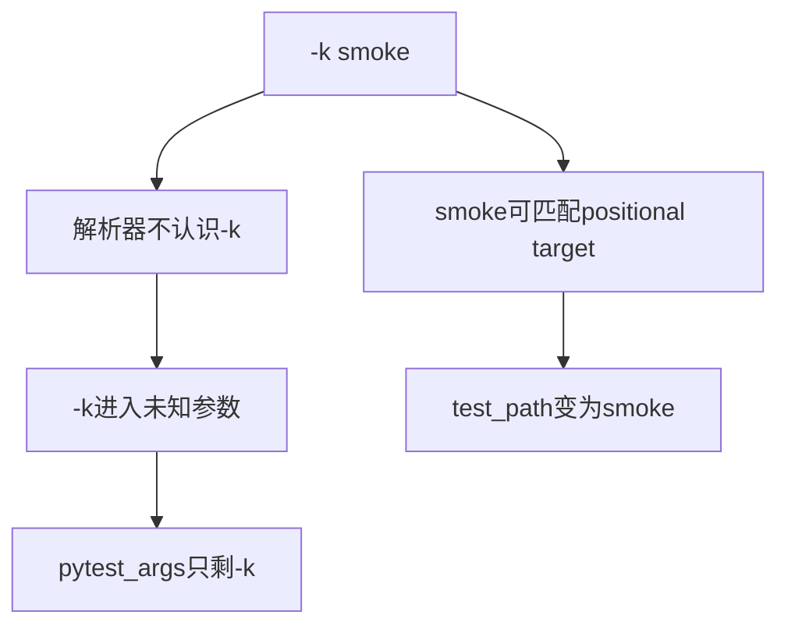

### 8.1 为什么这不是普通“透传”

完整 pytest 选项本来需要：

```text
-k + 表达式
```

如果值被 target 消费，剩余参数已经不完整。

所以课程必须使用准确措辞：

> CLI 通过 `parse_known_args()` 返回未识别参数，但由于可选 positional target 的存在，不能保证任意未知 pytest 参数和值都原样成组保留。

### 8.2 哪种形态更稳定

从当前解析规则看，先给 positional target：

```text
tests -k smoke
```

解析器已有 target 后，`-k smoke` 更可能共同留在 pytest 参数轨。

或者显式设计不含 positional 歧义的入口合同。

本课只解释当前实现，不提出迁移步骤。

### 8.3 测试证据边界

现有公开入口测试没有直接调用 `parse_args()` 验证：

- 路径优先级。
- `-k` 等未知参数的组合保留。
- positional target 歧义。
- CLI help 文本。

因此这部分主要是源码事实，不应包装成“已有测试完整覆盖”。

---

## 9. `--parallel-first` 当前是兼容性参数

CLI 定义了：

```text
--parallel-first
```

它使用 `store_true`，所以 Namespace 中会出现布尔值。

但是 `main()` 调用 `runner.run()` 时没有传入 `parallel_first`。

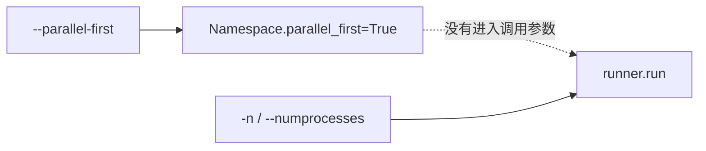

### 9.1 实际并行信号是什么

当前 Runner 根据 `numprocesses` 判断：

```text
没有 numprocesses → 所有用例走串行执行分支
有 numprocesses → 进入并行优先分支
```

所以不能写成：

> `--parallel-first` 开启并行优先执行。

准确结论是：

> `--parallel-first` 当前被 CLI 接受，但没有改变传给 Runner 的参数；实际分支信号是 `-n / --numprocesses`。

### 9.2 兼容参数的风险

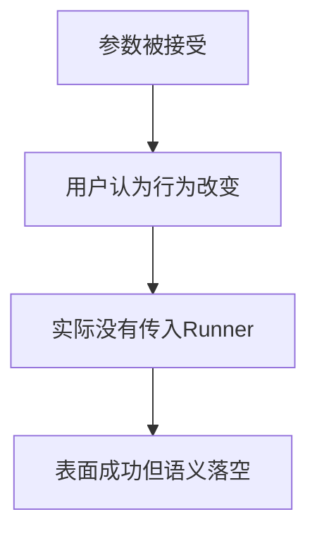

接受参数与执行参数生效是两个不同事实。

---

## 10. `runner.run()` 是程序化入口

当前公开签名包含：

```text
test_path
extra_pytest_args
numprocesses
dist
serial_marker
```

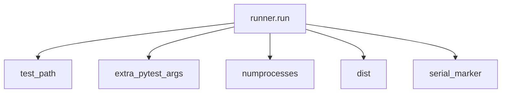

### 10.1 CLI 不是唯一调用者

Python 代码可以直接调用 `run_master.run(...)`。

因此需要区分：

| 入口 | 输入形态 | 是否经过 CLI 解析 |
| --- | --- | --- |
| 脚本入口 | `sys.argv[1:]` | 是 |
| `main(argv)` | 参数字符串序列 | 是 |
| `run(...)` | Python 参数 | 否 |

### 10.2 程序化调用绕过什么

直接调用 `run()` 不经过：

- positional target 解析。
- CLI 路径优先级。
- `parse_known_args()`。
- `--parallel-first` 兼容参数。

但它仍会进入 Runner 内部参数分相与权威收集。

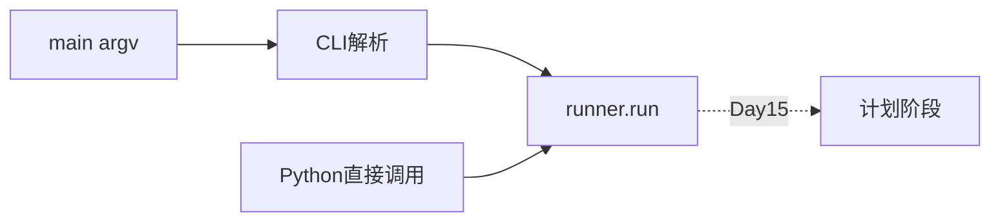

---

## 11. 三类参数不能混成一张字典

### 11.1 框架公开参数

框架显式拥有：

- test path。
- worker 数量。
- xdist 分发策略。
- serial marker 名称。

### 11.2 pytest 与插件参数

CLI 不完整解释：

- `-k`。
- `-m`。
- `--ignore`。
- 报告插件参数。
- 其他未知插件参数。

### 11.3 后续阶段参数

Runner 还会把 pytest 参数拆成：

- 收集阶段参数。
- 执行阶段参数。
- 选择参数。
- collect-only 标志。

这部分在 Day 15 展开。

```mermaid
flowchart TB
    A[所有外部参数]
    A --> F[框架参数]
    A --> P[pytest与插件参数]
    F --> R[runner.run kwargs]
    P --> D15[Day15阶段分相]
```

### 11.4 参数所有权表

| 参数事实 | 创建者 | 主要消费者 | 不应由谁重新解释 |
| --- | --- | --- | --- |
| `test_path` | CLI 或程序化调用者 | Runner | 执行池 |
| `numprocesses` | CLI 或程序化调用者 | Runner 并行分支 | Collector |
| `serial_marker` | CLI 或程序化调用者 | Scheduling | pytest 测试函数 |
| `pytest_args` | CLI 剩余参数或调用者 | 参数计划器 | 根入口 |
| `parallel_first` | CLI Namespace | 当前无实际消费者 | 不能假定 Runner 已使用 |

---

## 12. 参数失败发生在哪一层

### 12.1 CLI 已知参数缺值

如果 `--test-path`、`-n`、`--dist` 或 `--serial-marker` 缺少值，argparse 会在 CLI 层处理。

### 12.2 未知 pytest 参数缺值

CLI 不一定知道它是否缺值。

后续 `partition_pytest_args()` 只对自己认识的 pytest 选项执行配对检查。

```mermaid
flowchart TD
    A[参数错误] --> B{哪一层认识该参数}
    B -- CLI认识 --> C[argparse处理]
    B -- 参数计划器认识 --> D[Runner返回usage error]
    B -- 两层都不认识 --> E[交给pytest或插件解释]
```

### 12.3 入口不验证测试路径可执行性

CLI 把路径字符串交给 Runner。

路径是否可收集，要到 Day 15 的权威收集阶段才形成事实。

---

## 13. 当前调用链的完整时序

```mermaid
sequenceDiagram
    participant U as 用户或调用方
    participant RM as run_master
    participant C as cli.main
    participant P as parse_args
    participant R as runner.run
    participant D15 as Day15计划层
    U->>RM: argv或公开函数调用
    RM->>C: main(argv)
    C->>P: 解析已知与未知参数
    P-->>C: Namespace + pytest_args
    C->>R: test_path/numprocesses/dist/marker/extra args
    R->>D15: 参数分相与权威收集
```

对程序化 `run()` 调用，前面的 CLI 两步会被绕过。

---

## 14. 现有测试直接证明什么

### 14.1 根入口重导出稳定 API

`tests/test_run_orchestration_public_contract.py` 直接检查：

- `run_master.run is run_orchestration.run`。
- `run_master.main is run_orchestration.main`。
- `PROJECT_ROOT` 指向项目根目录。
- 默认 Allure 结果目录位于项目根目录下。
- `run()` 与 `main()` 的公开签名稳定。

### 14.2 根入口不直接依赖实现模块

测试解析 `run_master.py` 的 AST，并确认根文件没有直接 import：

- pytest。
- quality。

```mermaid
flowchart LR
    T[公开合同测试] --> A[符号身份]
    T --> B[函数签名]
    T --> C[根路径与默认目录]
    T --> D[根入口导入边界]
```

### 14.3 包公开符号数量

测试还确认 `run_orchestration.__all__` 只包含四个稳定根符号。

这说明编排包没有把所有内部模块都变成公开 API。

---

## 15. 现有测试不能证明什么

当前没有找到直接针对 `run_orchestration.cli.parse_args()` 的单元测试。

因此不能把以下结论写成“测试已覆盖”：

- `--test-path` 优先级。
- positional target 默认行为。
- `-k smoke` 的解析歧义。
- 未知参数原样保留。
- `--serial-marker` 从 CLI 进入 Runner。
- `--parallel-first` 是否生效。
- CLI help 文本是否符合预期。

```mermaid
flowchart TD
    S[源码可见事实] --> C[可以解释当前实现]
    T[直接测试缺失] --> N[不能声称测试覆盖]
    C --> B[课程使用保守措辞]
    N --> B
```

Runner 的程序化行为测试很多，但这不能反向证明 CLI 字符串解析正确。

### 15.1 静态合同与运行事实不同

| 证据 | 能证明 | 不能证明 |
| --- | --- | --- |
| AST 导入检查 | 根入口没有直接 import 某些内部模块 | 运行时不会间接加载它们 |
| 对象身份断言 | 根入口与包导出同一函数 | 函数内部行为全部正确 |
| 函数签名断言 | 参数名称与顺序稳定 | 参数组合语义无歧义 |
| 源码阅读 | 当前路由顺序 | 所有边界都有自动化测试 |

---

## 16. 常见误解与正确边界

| 常见误解 | 正确理解 |
| --- | --- |
| `run_master.py` 就是整个 Runner | 它是稳定门面，执行逻辑在编排包 |
| `parse_known_args()` 保证所有未知参数完整透传 | positional target 可能消费未知选项的值 |
| 当前有统一 RunnerConfig | 当前是 Namespace、pytest_args 与函数参数组合 |
| `--parallel-first` 会开启并行 | 当前真正信号是 `numprocesses` |
| `main()` 返回就代表测试完成 | 它只是进入 Runner，后续仍有计划与执行阶段 |
| 默认路径为 `module` 就代表一定有测试 | 只有权威收集才能形成测试集合事实 |
| 根入口不 import pytest 就代表系统不用 pytest | 它只把依赖隐藏在内部层 |

```mermaid
flowchart LR
    INPUT[参数被接受] --> ROUTED[参数已路由]
    ROUTED --> PLANNED[计划已形成]
    PLANNED --> EXECUTED[测试已执行]
    EXECUTED --> RESULT[结果已归并]
```

这五个状态不能互相替代。

---

## 17. 设计选择与适用边界

### 17.1 为什么保留薄根入口

收益：

- 外部调用路径稳定。
- 内部模块可重构。
- 公开符号数量受控。

代价：

- 调试时需要继续进入编排包。
- 根入口本身不能解释完整行为。

### 17.2 为什么使用 `parse_known_args()`

收益：

- 不需要复制 pytest 全部参数定义。
- 插件参数仍有机会进入后续阶段。

代价：

- 框架与 pytest 参数之间可能出现边界歧义。
- positional target 会放大未知参数值被消费的风险。

### 17.3 为什么不用全局配置对象

当前函数参数让数据流直接可见。

但参数数量增加后，缺少统一对象也可能提高组合复杂度。

课程只描述当前实现，不把“以后应怎样重构”写成既成事实。

```mermaid
flowchart TB
    CHOICE[当前设计选择]
    CHOICE --> THIN[薄入口]
    CHOICE --> KNOWN[parse_known_args]
    CHOICE --> KW[函数关键字参数]
    THIN --> TRADE[稳定性与追踪成本]
    KNOWN --> TRADE
    KW --> TRADE
```

---

## 18. TOC 清晰思考：当前最弱环节在哪里

第三周前半段已经解释了执行上下文如何隔离。

Day 14 的约束转移到参数入口：

```mermaid
flowchart TD
    A[上下文隔离正确] --> B[仍需要确定执行输入]
    B --> C[CLI同时接收框架与pytest参数]
    C --> D[positional target产生歧义]
    D --> E[后续计划可能读取错误目标]
```

TOC 判断：

> 当前入口的主要约束不是缺少更多参数，而是参数轨之间的边界不能在所有组合下保持无歧义。

如果目标路径在入口处被误解释，后续权威收集再准确，也只是在准确收集错误目标。

### 18.1 约束与下游影响

```text
参数分流歧义
→ test_path 或 pytest_args 失真
→ 收集输入改变
→ nodeid 全集改变
→ parallel/serial 计划改变
```

Day 15 必须把接收到的输入视为已形成事实，不能反向修复 CLI 含义。

---

## 19. Day 14 完整对象模型

```mermaid
flowchart TB
    U[用户或Python调用方]
    RM[run_master稳定门面]
    MAIN[cli.main]
    PARSE[parse_known_args]
    NS[Namespace<br/>框架参数]
    PX[pytest_args<br/>剩余参数]
    RUN[runner.run]
    NEXT[Day15参数计划与权威收集]

    U --> RM
    RM --> MAIN
    MAIN --> PARSE
    PARSE --> NS
    PARSE --> PX
    NS --> RUN
    PX --> RUN
    U -.程序化调用.-> RUN
    RUN --> NEXT
```

这张图需要保留四条边界：

1. 根入口稳定导出，不拥有 pytest 细节。
2. CLI 把框架已知参数与剩余参数分轨。
3. 当前没有单一 RunnerConfig 对象。
4. Runner 收到参数不等于执行计划已经成立。

---

## 20. 向 Day 15 交付什么

Day 14 交付的是一份规范化但仍未验证为“可执行集合”的输入：

- `test_path`。
- `extra_pytest_args`。
- `numprocesses`。
- `dist`。
- `serial_marker`。

```mermaid
flowchart LR
    D14[Day14<br/>入口与参数路由] --> I[Runner输入]
    I --> D15[Day15<br/>权威收集与分池计划]
```

下一课将回答：

> Runner 如何把路径与选择参数转化为唯一 nodeid 全集，并在不重复、不遗漏的前提下拆分 parallel 与 serial 计划？

Day 15 会重新读取第一周的 nodeid 模型，但必须停在计划事实：

```text
知道准备执行什么
≠ 已经执行
≠ 已经得到Pool Result
≠ 已经得到最终退出码
```
