# 第 15 天：权威收集与并串行调度

> **课程定位**：承接第 14 天形成的 Runner 输入，并回读第一周的 nodeid 模型，解释测试计划如何从一次权威收集形成唯一全集，再守恒地拆分 parallel 与 serial 计划  
> **Module 层落点**：用例作者只负责稳定 nodeid、正确 marker 和无重复收集副作用；分池算法属于执行层，不应复制进 module 测试  
> **讲解重点**：`PytestArgumentPlan`、`CollectionResult`、Collector、nodeid 唯一性、Marker、集合守恒、collect-only、并行参数与串行参数边界  
> **课程形式**：纯讲解，不设置实操、练习、作业、小测、命令执行要求或教学门禁  
> **事实依据**：`run_orchestration/runner.py`、`run_orchestration/pytest_execution.py`、`run_orchestration/scheduling.py`、`master_service.py` 与相关测试  
> **本课边界**：停在计划与调度事实，不展开 Day 16 的 Pool Result、终止型退出码、最终退出码和实际结果归并

---

## 0. 从第 14 天读取什么模型

Day 14 已经交付：

- `test_path`。
- `extra_pytest_args`。
- `numprocesses`。
- `dist`。
- `serial_marker`。

这些值表达调用方意图，但还不是测试集合。


### 0.1 回读第一周的 nodeid

第一周已经建立：

- pytest 通过收集形成测试项。
- 每个测试项有稳定 nodeid。
- Marker 是测试项上的分类事实。
- 参数字符串不是 nodeid 集合。

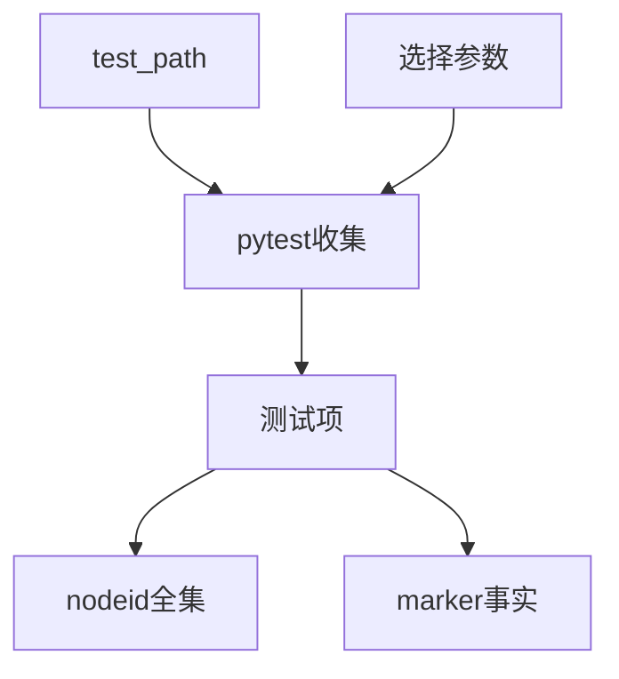

### 0.2 本课唯一新增模型

> 一次权威计划收集产生唯一 nodeid 全集，分池只是对这个全集的纯分类变换。

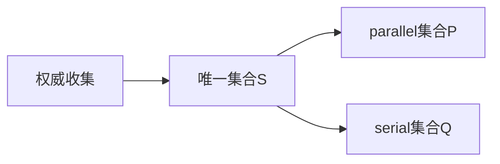

本课必须证明：

```text
P ∩ Q = ∅
P ∪ Q = S
S 中每个 nodeid 唯一
```

---

## 1. 第一性原理：计划不等于执行

执行系统至少有四类事实：

| 事实 | 回答的问题 |
| --- | --- |
| 输入事实 | 用户想选择什么 |
| 收集事实 | pytest 实际识别到什么 |
| 计划事实 | 这些 nodeid 准备进入哪个池 |
| 执行事实 | 每个池实际发生了什么 |


Day 15 只走到计划与调度入口。

### 1.1 为什么不能直接按文件名分池

文件路径不能完整表达：

- 类级 Marker。
- 函数级 Marker。
- 参数化用例 nodeid。
- `-k` 与 `-m` 选择后的真实集合。
- pytest 插件参与后的收集结果。

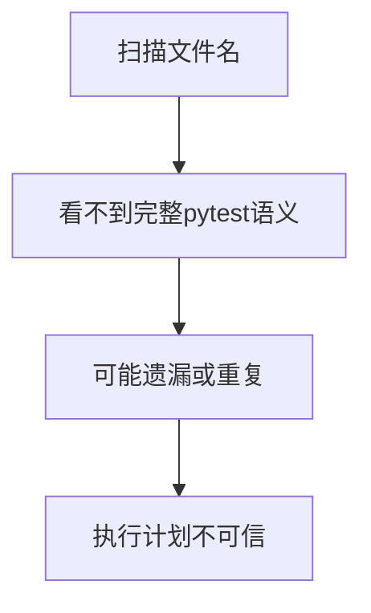

所以权威集合必须来自 pytest 自己的 collection 结果。

### 1.2 TOC 约束链

如果 parallel 与 serial 各自独立产生计划：

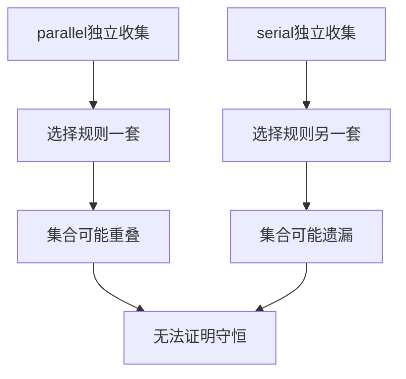

真正约束是：

> 所有分池必须读取同一份权威测试事实。

---

## 2. Runner 先做 pytest 参数分相

`runner.run()` 的第一步不是 collect。

它先调用：

```text
partition_pytest_args(extra_pytest_args)
```

返回冻结的 `PytestArgumentPlan`：

```text
collection_args
execution_args
selection_args
collect_only
```

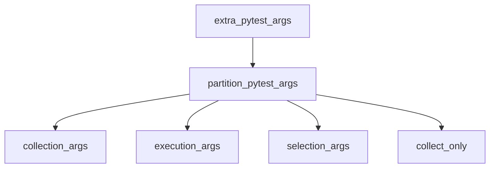

### 2.1 为什么收集参数与执行参数要分开

选择参数需要影响权威全集：

- `-k`。
- `-m`。
- `--ignore`。
- `--ignore-glob`。
- `--deselect`。

执行参数只需要在真正运行池时出现：

- JUnit 输出路径。
- Allure 输出目录。
- xdist worker 数量。
- xdist 分发策略。

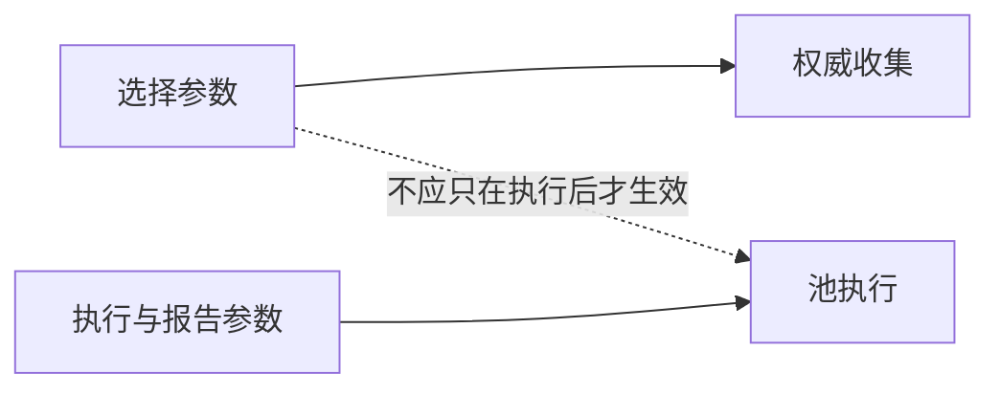

### 2.2 `selection_args` 是解释性子集

已知选择参数同时进入：

- `collection_args`。
- `selection_args`。

`selection_args` 用来表达“哪些参数改变了测试选择”。

它不是另一轮收集输入。

### 2.3 collect-only 参数被转换成布尔事实

`--collect-only`、`--co`、`--collectonly` 会：

1. 把 `collect_only` 设为 True。
2. 不继续放入普通参数列表。


---

## 3. 参数分相的真实分类规则

### 3.1 已知选择参数

需要独立值的已知选择参数包括：

```text
-k
-m
--ignore
--ignore-glob
--deselect
```

它们缺少值时，参数计划器抛出 `ValueError`。

### 3.2 已知执行参数

执行参数包括：

```text
--junitxml
--junit-xml
--alluredir
-n
--numprocesses
--dist
```

以及部分 `--name=value` 形式和 `--clean-alluredir`。

### 3.3 未知参数被共享

对参数计划器不认识的参数，当前实现同时放入：

- `collection_args`。
- `execution_args`。

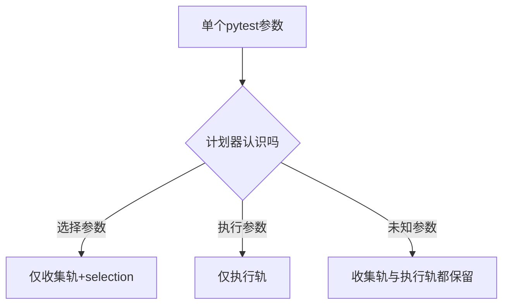

### 3.4 未知共享的边界

这样做能保留插件既有行为，但不能保证：

- 每个未知参数在两个阶段语义相同。
- 第三方 selection 参数只影响权威收集。
- 插件一定接受重复出现在收集与执行阶段。

所以不能把当前分类器描述成完整 pytest 参数解析器。

---

## 4. `PytestArgumentPlan` 是参数计划，不是测试计划

这两个“计划”容易混淆。

| 对象 | 保存什么 | 尚未拥有 |
| --- | --- | --- |
| `PytestArgumentPlan` | 参数如何分阶段 | nodeid 与 Marker |
| `CollectionResult` | pytest 收集事实 | parallel/serial 分类 |
| parallel/serial tuple | 计划分池结果 | 实际执行结果 |


### 4.1 当前没有独立 `ExecutionPlan` 类

课程可以使用“执行计划”作为概念。

但源码中当前没有名为 `ExecutionPlan` 的统一模型类。

计划事实分布在：

- `PytestArgumentPlan`。
- `CollectionResult`。
- `parallel_cases` tuple。
- `serial_cases` tuple。
- Runner 局部变量。

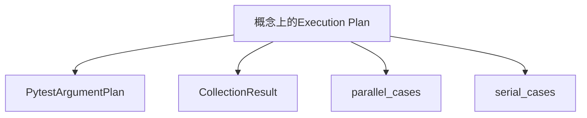

不能把概念名称误写成现有源码类。

---

## 5. 权威收集如何启动

Runner 使用：

```text
collect_test_case_items(test_path, argument_plan.collection_args)
```

内部拼出：

```text
--collect-only
-q
-o addopts=
+ collection_args
+ test_path
```

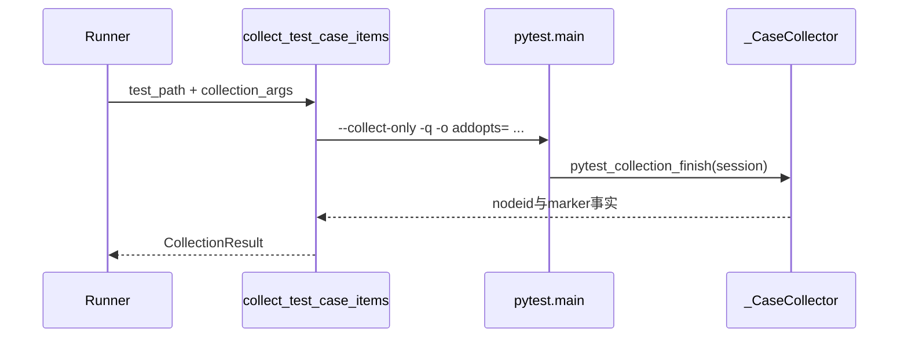

### 5.1 为什么显式清空 addopts

参数中加入：

```text
-o addopts=
```

这让权威收集不自动继承项目配置中的默认 `addopts`。

它减少隐式执行参数改变收集的风险。

### 5.2 stdout 与 stderr 也是收集事实

收集过程把标准输出与标准错误捕获到字符串。

`CollectionResult` 保存：

- 原始 pytest exit code。
- cases。
- stdout。
- stderr。

这些字段用于解释收集是否成功，不代表测试结果。

---

## 6. `_CaseCollector` 从 `session.items` 建立权威事实

pytest 完成收集后调用：

```text
pytest_collection_finish(session)
```

Collector 遍历 `session.items`，为每项保存：

- `item.nodeid`。
- `item.iter_markers()` 得到的全部 marker 名称。

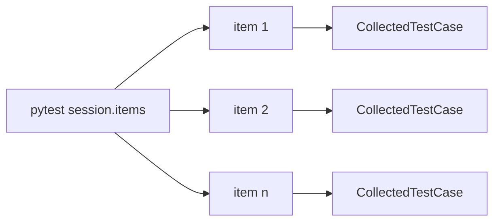

### 6.1 Marker 来源不只在函数上

`iter_markers()` 会读取 pytest 已经解释后的 Marker。

现有测试覆盖：

- 函数级 marker。
- 类级 marker。
- 文件级 marker。

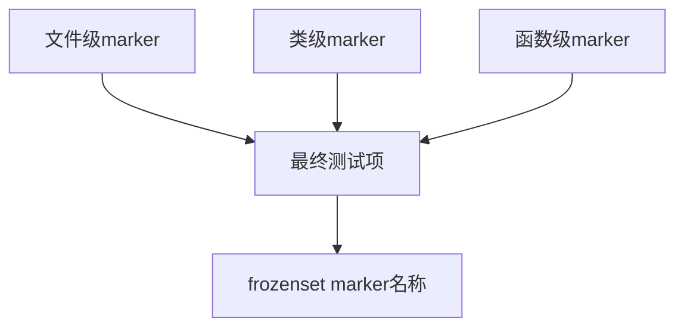

因此 Scheduling 不需要重新扫描源码装饰器。

### 6.2 `CollectedTestCase` 是收集事实

它包含：

```text
nodeid
markers
```

`is_serial` 属性只检查默认 marker 名称 `serial`。

真正支持自定义 marker 名称的分池函数，会接收独立 `serial_marker` 参数。

---

## 7. nodeid 唯一性门禁

Collector 维护一个 `seen` 集合。

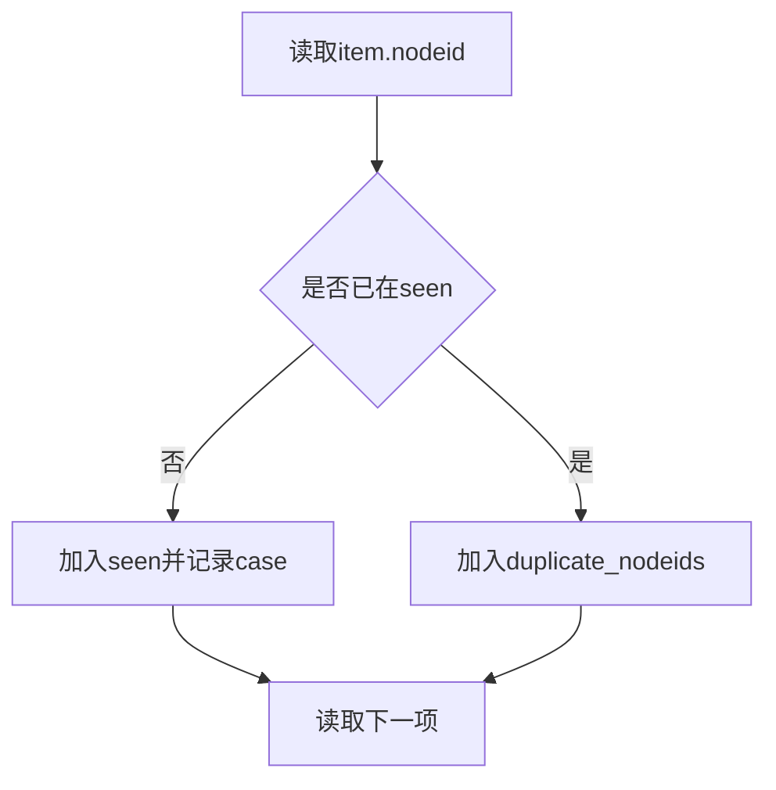

收集结束后，如果存在重复 nodeid：

```text
raise RuntimeError
```

### 7.1 为什么重复不能静默去重

静默去重会丢失来源信息：

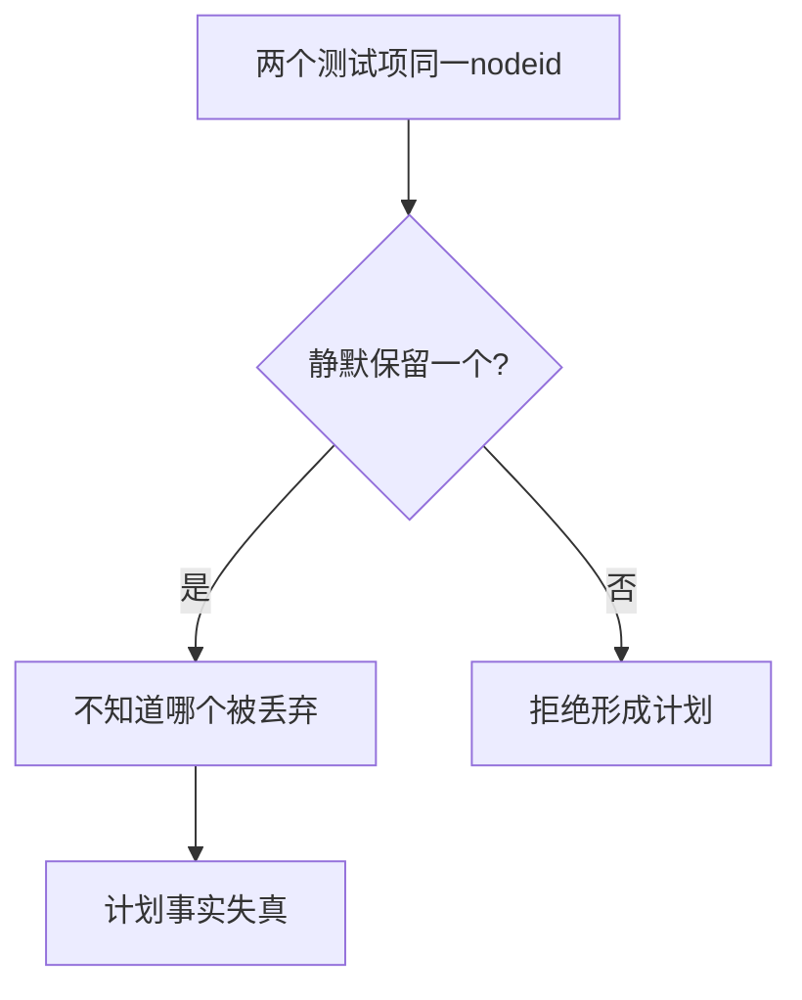

当前实现选择拒绝，而不是猜测。

### 7.2 测试边界

源码明确存在重复 nodeid 防御。

但现有 Day 15 直接测试没有构造重复 nodeid 负例。

因此准确表述是：

> 实现包含重复 nodeid 门禁；当前列出的测试没有直接覆盖该异常分支。

---

## 8. `CollectionResult` 的四项事实

| 字段 | 含义 | 不能解释成 |
| --- | --- | --- |
| `raw_pytest_exit_code` | 本次权威收集的 pytest 原始退出码 | 最终执行退出码 |
| `cases` | 收集得到的测试项 | 已执行用例 |
| `stdout` | 收集阶段标准输出 | 测试日志 |
| `stderr` | 收集阶段标准错误 | Pool 错误结果 |

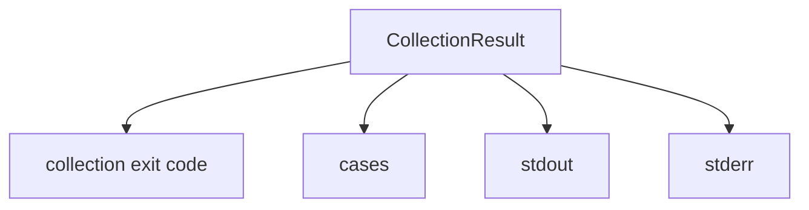

### 8.1 收集成功才继续形成分池计划

Runner 先检查 `raw_pytest_exit_code`。

如果收集没有正常完成，就不会把不完整 cases 当成权威计划继续分池。

本课不展开这些退出码怎样参与最终进程退出码。

### 8.2 空选择也是收集事实

没有测试被收集时，pytest 可能返回 no-tests-collected 状态。

这不等于：

- parallel 池为空但 serial 池有用例。
- 测试执行成功。
- 测试执行失败。

它只是权威收集没有形成可执行 case 集合。

---

## 9. “一次权威收集”到底是什么意思

这是本课最容易被扩大解释的概念。

准确含义是：

> Runner 的计划全集只由一次 planning collection 产生，所有分池都读取这份结果。

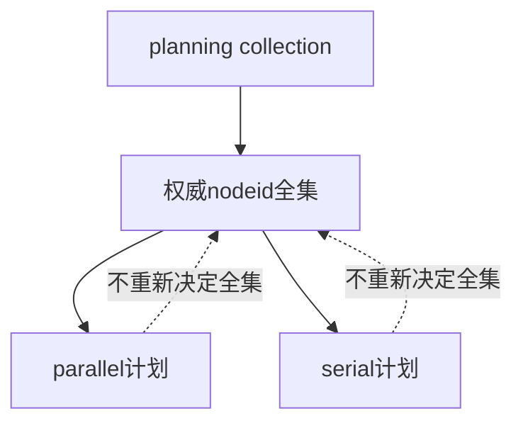

### 9.1 不等于进程中只调用一次 pytest collection

后续每个池执行时，Runner 会把计划 nodeid 传给新的 `pytest.main(...)` 调用。

pytest 在执行这些 nodeid 时仍可能进行自己的内部收集与解析。

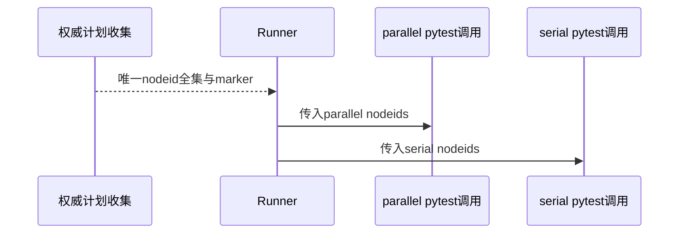

权威性来自“计划来源唯一”，不是“底层 pytest 物理上只能收集一次”。

### 9.2 为什么后续池不能改变计划全集

池调用接收的是已经选定的 nodeid。

它们的责任是执行计划，不是重新定义哪些测试属于本次运行。

---

## 10. 分池是纯计划变换

`scheduling.split_test_cases()` 接收：

- `CollectedTestCase` 序列。
- `serial_marker` 名称。

返回：

- parallel nodeid tuple。
- serial nodeid tuple。

```mermaid
flowchart TD
    S[权威cases序列] --> D{包含serial_marker?}
    D -- 是 --> Q[serial_cases]
    D -- 否 --> P[parallel_cases]
```

### 10.1 分类规则是二选一

每个 case 只经过一个判断：

```text
serial_marker in case.markers
```

命中进入 serial，否则进入 parallel。

### 10.2 顺序被保留

函数按输入顺序 append nodeid。

所以两个 tuple 各自保留原权威 cases 中的相对顺序。

```mermaid
flowchart LR
    S[A B C D] --> P[A C]
    S --> Q[B D]
```

这不等于并行池实际完成顺序可预测。

---

## 11. 三个集合不变量

### 11.1 全集唯一

分池函数自己也维护 `seen`。

重复 nodeid 会立即抛错。

### 11.2 交集为空

```text
set(parallel) & set(serial) == ∅
```

如果不为空，说明同一 nodeid 被计划到两个池。

### 11.3 并集等于全集

```text
set(parallel) | set(serial) == seen
```

如果不相等，说明发生遗漏或计划外新增。

```mermaid
flowchart TB
    S[权威集合S]
    S --> P[parallel P]
    S --> Q[serial Q]
    P --> I[P∩Q必须为空]
    Q --> I
    P --> U[P∪Q必须等于S]
    Q --> U
```

### 11.4 防御条件与测试覆盖要分开

当前源码显式检查：

- 重复。
- 交集。
- 并集。

现有基础分池测试只覆盖正常 marker 分类。

没有直接构造三个不变量失败的负例。

---

## 12. 自定义 `serial_marker` 的所有权

默认值是：

```text
serial
```

但 CLI 和程序化入口都可以向 Runner 提供其他 marker 名称。

```mermaid
flowchart LR
    CLI[--serial-marker] --> RUN[runner.run]
    PY[程序化serial_marker] --> RUN
    RUN --> SPLIT[split_test_cases]
```

### 12.1 `is_serial` 与实际分池参数

`CollectedTestCase.is_serial` 使用默认 `serial` 常量。

`split_test_cases()` 则直接检查传入的 `serial_marker`。

因此课程不能把属性写成所有自定义分池的唯一判断入口。

### 12.2 Marker 只决定计划归属

Marker 命中说明：

- 在启用并行分池的计划中，它进入 serial tuple。

Marker 不说明：

- 用例已经运行。
- 用例运行成功。
- 用例一定需要某种具体外部资源。

---

## 13. `numprocesses` 决定计划怎样被消费

Runner 无论是否并行，都会先完成权威收集与 `split_test_cases()`。

但后续计划消费方式不同。

### 13.1 没有 `numprocesses`

当前 Runner 会：

```text
把全部 case_nodeids 交给一个 serial-pool
```

它不会按 marker 分成两个实际调用阶段。

```mermaid
flowchart LR
    S[权威全集S] --> CHECK{有numprocesses?}
    CHECK -- 否 --> ONE[单一serial-pool计划<br/>包含全部nodeid]
```

这意味着：

- 带与不带 serial marker 的 nodeid 都进入同一个名为 `serial-pool` 的阶段。
- 分池 tuple 已经计算，但不用于两个独立池调用。
- 标准 CLI 路径没有 `numprocesses` 时不会产生 xdist 参数；但程序化调用者仍可能把 `-n` 放进 `extra_pytest_args`，而该分支不会调用 `remove_xdist_args()`，所以阶段名不能被扩大解释为任意参数组合下都绝对串行。

### 13.2 有 `numprocesses`

Runner 才使用 parallel/serial tuple：

```mermaid
flowchart LR
    S[权威全集S] --> SPLIT[marker分池]
    SPLIT --> P[parallel计划]
    SPLIT --> Q[serial计划]
    P --> FIRST[先进入parallel阶段]
    Q --> SECOND[后进入serial阶段]
```

### 13.3 “并行优先”是顺序合同

当前调用顺序是：

```text
parallel pool
→ serial pool
```

本课只讲调度顺序。

如果 parallel 阶段出现某些终止条件，serial 是否继续属于 Day 16 的执行结果决策。

---

## 14. parallel 与 serial 参数不是同一份

### 14.1 parallel 参数构造

`build_parallel_args()`：

1. 调整 JUnit 文件后缀。
2. 追加 `-n numprocesses`。
3. 如果有 `dist`，追加 `--dist value`。

```mermaid
flowchart LR
    E[execution_args] --> J[替换JUnit后缀]
    J --> N[追加-n]
    N --> D{有dist?}
    D -- 是 --> P[追加--dist]
    D -- 否 --> P2[parallel args完成]
```

### 14.2 并行参数可能重复

函数不会先移除输入中已有的 `-n`。

如果调用方同时：

- 把 `-n` 放进 `extra_pytest_args`。
- 又向 Runner 传入 `numprocesses`。

构造结果可能包含重复并行配置。

这是一条源码边界，现有列出的测试没有专门验证该组合。

### 14.3 serial 参数构造

`build_serial_args()` 先调用 `remove_xdist_args()`，再调整 JUnit 后缀。

```mermaid
flowchart LR
    E[execution_args] --> X[移除已识别xdist参数]
    X --> J[替换JUnit后缀]
    J --> S[serial args完成]
```

### 14.4 xdist 清理是白名单

当前识别：

```text
-n value
--numprocesses value
--dist value
--numprocesses=value
--dist=value
```

没有列入规则的新参数形式，不会自动被移除。

所以不能声称“串行池能移除任意 xdist 相关参数”。

---

## 15. collect-only 停在哪里

Runner 完成：

1. 参数分相。
2. 权威收集。
3. 打印 nodeid。
4. 分出 parallel 与 serial tuple。

如果 `collect_only=True`，随后只打印两个池的数量并返回。

```mermaid
flowchart TD
    A[参数计划] --> B[权威收集]
    B --> C[分池计划]
    C --> D{collect_only?}
    D -- 是 --> E[输出计划数量并结束]
    D -- 否 --> F[进入池执行阶段]
```

### 15.1 collect-only 能证明什么

它能形成：

- 收集退出事实。
- nodeid 全集。
- Marker 集合。
- parallel/serial 数量。

### 15.2 collect-only 不能证明什么

它不能证明：

- 测试函数执行成功。
- fixture 可以建立。
- 外部服务可用。
- parallel 运行没有竞态。
- serial 用例运行成功。

### 15.3 现有测试的直接证据

`test_run_collect_only_prints_pool_counts_without_execution` 使用替身保证：

- collect-only 输出池数量。
- pool 执行入口不应被调用。

这是一条计划与执行分离的直接测试证据。

---

## 16. 现有测试直接证明什么

### 16.1 Marker 收集

真实临时测试文件证明：

- 函数级 serial marker 被读取。
- 类级 marker 被读取。
- 文件级 marker 被读取。
- 没有 serial marker 的测试不会被误标为 serial。

### 16.2 基础正常分池

`test_split_test_cases_separates_serial_pool` 证明一个正常样本被分类为：

```text
parallel = [test_parallel, test_parallel]
serial = [test_serial]
```

它通过 `master_service.split_test_cases()` 兼容门面观察 list 结果。

### 16.3 参数阶段分相

现有测试证明：

- `-k` 与 `--ignore` 进入 collection args。
- JUnit 与 Allure 参数进入 execution args。
- collect-only 被转成布尔值。
- `-q` 作为未知参数同时保留在两个阶段。

### 16.4 选择参数影响权威收集

已知测试分别验证：

- `-k` 关键词选择。
- `-m` Marker 选择。
- `--ignore` 路径忽略。

这些选择在权威收集阶段已经缩小全集。

```mermaid
flowchart LR
    FULL[潜在测试全集] --> SELECT[-k/-m/--ignore]
    SELECT --> AUTH[权威收集集合]
    AUTH --> SPLIT[parallel/serial分池]
```

### 16.5 并行优先顺序

Runner 测试通过调用记录证明：

- 有 `numprocesses` 时先调用 parallel nodeids。
- 随后调用 serial nodeids。
- serial 参数中不保留并行配置。
- 空池会被跳过。

本课不展开这些池的返回状态与退出码。

---

## 17. 现有证据不能扩大成什么

### 17.1 没有当前项目池规模

本轮课程生成没有对当前 `module/` 或 Smoke 执行 collect-only。

因此不能给出：

- 当前 nodeid 总数。
- 当前 parallel 数量。
- 当前 serial 数量。
- 当前 marker 分布。

### 17.2 不变量负例没有直接测试

源码有防御，但现有列出的直接测试没有覆盖：

- Collector 重复 nodeid。
- Scheduling 重复 nodeid。
- parallel/serial 交集不为空。
- 两池并集不等于 seen。

### 17.3 未知插件参数语义不受保证

未知参数会同时进入收集与执行。

这不能证明第三方插件：

- 在两个阶段都接受该参数。
- 不会改变计划。
- 不会产生额外副作用。

### 17.4 分池不证明执行隔离

把 nodeid 放进不同 tuple，只证明计划分类。

它不证明：

- parallel 用例没有共享状态。
- serial marker 设置合理。
- Session、文件或账号资源真正隔离。

```mermaid
flowchart LR
    PLAN[分池计划正确] -.不能推出.-> SAFE[并发执行一定安全]
    PLAN -.不能推出.-> PASS[用例一定通过]
```

---

## 18. 常见误解与正确边界

| 常见误解 | 正确理解 |
| --- | --- |
| 一次权威收集表示 pytest 全程只收集一次 | 只表示计划全集来源唯一，池执行仍会调用 pytest |
| `PytestArgumentPlan` 就是 nodeid 执行计划 | 它只保存参数阶段分类 |
| 当前有 `ExecutionPlan` 类 | 当前计划事实分散在多个对象与 tuple 中 |
| serial marker 永远创建独立 serial pool | 没有 numprocesses 时全部 nodeid 进入同一个 `serial-pool` 阶段；程序化 extra args 仍可能携带 xdist 参数 |
| 分池成功表示用例已执行 | 分池只产生计划 |
| collect-only 表示测试通过 | 它没有执行测试函数 |
| 未知 pytest 参数只用于收集 | 当前未知参数同时进入收集与执行 |
| 串行参数会移除所有 xdist 形式 | 只移除代码列出的白名单形式 |
| 集合守恒已有完整负例测试 | 当前主要是源码防御，直接测试覆盖正常样本 |

```mermaid
flowchart TB
    INPUT[Runner输入] --> PARAM[参数计划]
    PARAM --> AUTH[权威收集]
    AUTH --> SPLIT[守恒分池]
    SPLIT --> SCHEDULE[调度顺序]
    SCHEDULE -.Day16.-> OUTCOME[执行结果]
```

---

## 19. 设计选择与适用边界

### 19.1 选择 pytest 作为权威收集器

收益：

- nodeid 与 pytest 实际语义一致。
- Marker 继承关系由 pytest 解释。
- 选择参数在形成计划前生效。

代价：

- 计划阶段需要启动 pytest 收集。
- 插件与环境仍可能影响收集结果。

### 19.2 选择先全集、后分池

收益：

- 容易证明交集与并集。
- 两个池共享同一来源。
- nodeid 不需要重复发现。

代价：

- 必须保留全集与 Marker 信息。
- 分池逻辑必须拒绝重复与不守恒。

### 19.3 选择 tuple 保存分池结果

收益：

- 计划结果不可通过 append 原地修改。
- 保留输入相对顺序。

代价：

- 没有统一对象集中保存来源、参数与两个池。

```mermaid
flowchart TB
    CHOICE[Day15设计选择]
    CHOICE --> PYTEST[pytest权威收集]
    CHOICE --> ONE[先全集后分池]
    CHOICE --> TUPLE[tuple计划结果]
    PYTEST --> TRADE[收益与代价]
    ONE --> TRADE
    TUPLE --> TRADE
```

---

## 20. TOC 清晰思考：第三周末的系统约束

第三周从资源所有权一路走到计划所有权：

```mermaid
flowchart LR
    D11[SSE连接关闭] --> D12[TestContext清理]
    D12 --> D13[Context传播与实例隔离]
    D13 --> D14[稳定参数入口]
    D14 --> D15[权威收集与守恒分池]
```

### 20.1 每一天解决的约束

| 天数 | 解除的主要约束 |
| --- | --- |
| Day 11 | 流消费结束与 Response 关闭混淆 |
| Day 12 | 跨步骤数据与资源没有稳定所有者 |
| Day 13 | 逻辑上下文传播与实例隔离混淆 |
| Day 14 | 外部参数没有统一稳定入口 |
| Day 15 | 执行池缺少唯一计划来源 |

### 20.2 Day 15 的当前约束

现在系统已经知道：

- 准备执行哪些 nodeid。
- 哪些 nodeid 属于 parallel 计划。
- 哪些 nodeid 属于 serial 计划。
- 参数怎样分别进入收集与执行阶段。

但系统还不知道：

- pool 实际执行状态。
- 某个 pool 是否抛出异常。
- 哪些退出码应该终止后续阶段。
- 多个 pool 如何形成最终退出码。

```mermaid
flowchart TD
    A[计划事实完整] --> B[下一个约束]
    B --> C[计划怎样变成可归并的执行结果]
```

这正是 Day 16 的范围。

---

## 21. 第三周完整所有权地图

```mermaid
flowchart TB
    SSE[SSE Response与迭代消费]
    TC[TestContext变量与清理栈]
    CV[ContextVar提交时快照]
    CLI[稳定入口与参数双轨]
    ARGS[PytestArgumentPlan]
    COL[CollectionResult]
    POOLS[parallel/serial tuples]

    SSE -->|跨步骤资源问题| TC
    TC -->|执行边界传播问题| CV
    CV -->|需要明确外部输入| CLI
    CLI --> ARGS
    ARGS --> COL
    COL --> POOLS
```

### 21.1 六类对象的所有权

| 对象 | 它拥有 | 它不拥有 |
| --- | --- | --- |
| SSE 消费者 | 事件解析、停止条件、Response 关闭 | TestContext 清理栈 |
| TestContext | 测试级变量与显式登记的清理 callback | 自动发现所有资源 |
| Context 快照 | 提交时 ContextVar 绑定 | Session 深复制 |
| CLI | 已知参数解析与 Runner 桥接 | 权威 nodeid 集合 |
| Collector | nodeid、Marker、收集输出 | parallel/serial 判定 |
| Scheduling | 对权威集合进行守恒分池 | 测试执行结果 |

### 21.2 五个不能互换的结束点

```mermaid
flowchart TB
    X[不同作用域中的结束事实]
    A[SSE协议终止信号<br/>可能看到DONE]
    B[流消费循环结束]
    C[Response关闭尝试完成]
    D[TestContext清理完成]
    E[执行计划形成]
    F[测试执行完成]

    X -.协议层.-> A
    X -.消费层.-> B
    X -.资源层.-> C
    X -.测试作用域.-> D
    X -.计划层.-> E
    X -.执行层.-> F
```

这些节点是并列的边界事实，不构成一条固定时序。看到 DONE 不是消费结束或 Response 关闭的必要条件，测试级清理、计划形成与测试执行也不属于同一次 SSE 调用链。

---

## 22. Day 15 完整计划模型

```mermaid
flowchart TB
    INPUT[Day14 Runner输入]
    PART[partition_pytest_args]
    AP[PytestArgumentPlan]
    PC[planning pytest collection]
    ITEMS[session.items]
    CR[CollectionResult]
    CASES[原始case_nodeids]
    SPLIT[split_test_cases]
    P[parallel tuple]
    S[serial tuple]
    NP[numprocesses输入]
    MODE{有numprocesses?}
    ONE[原始case_nodeids进入单一serial-pool阶段]
    TWO[parallel tuple优先<br/>再消费serial tuple]

    INPUT --> PART
    PART --> AP
    AP --> PC
    PC --> ITEMS
    ITEMS --> CR
    CR --> CASES
    CR --> SPLIT
    SPLIT --> P
    SPLIT --> S
    INPUT --> NP
    SPLIT --> MODE
    NP --> MODE
    CASES --> ONE
    MODE -- 否 --> ONE
    P --> TWO
    S --> TWO
    MODE -- 是 --> TWO
```

这张图必须附带三个注释：

1. `Execution Plan` 是概念，不是当前独立类。
2. 权威来源唯一，不代表池执行时 pytest 不再内部收集指定 nodeid。
3. 分池 tuple 虽然已经形成，但无 `numprocesses` 时单一阶段消费的是原始 `case_nodeids`，不是把两个 tuple 重新拼接。
4. `ONE` 与 `TWO` 都只是调度入口，实际 Pool Result 留给 Day 16。

---

## 23. 向 Day 16 交付什么

Day 15 交付：

- 一份 `PytestArgumentPlan`。
- 一份通过 pytest 形成的 `CollectionResult`。
- 唯一 nodeid 全集。
- Marker 事实。
- parallel/serial 两个守恒 tuple。
- 单阶段串行或并行优先的调度顺序。

```mermaid
flowchart LR
    D15[Day15<br/>计划事实] --> D16[Day16<br/>执行器状态与退出码]
```

Day 15 不交付：

- `PoolExecutionResult` 的完整语义。
- pool 异常与 NOT_RUN 条件。
- 终止型 pytest exit code。
- 多 pool 最终退出码。
- 结果文件与报告生命周期。

下一课将回答：

> 当计划中的池真正被调用后，如何区分未运行、已完成与执行器错误，并把多个原始结果转换成可靠的进程退出事实？
