# 第 16 天：执行器状态与退出码

> **课程定位**：承接 Day 15 的权威执行计划，解释计划中的池真正交给 pytest 后，怎样形成池级状态、原始退出码和最终进程退出码  
> **Module 层落点**：用例作者只负责稳定 nodeid、正确 marker 和可靠测试结果；不在 module 中构造 `PoolExecutionResult` 或改写退出码  
> **黄金用例边界**：可以把黄金用例的 module nodeid 放入计划并观察执行事实，但不读取或解释其 service 内部实现  
> **课程形式**：纯讲解，不设置实操、练习、作业、小测或命令执行要求  
> **事实依据**：`run_orchestration/pytest_execution.py`、`run_orchestration/runner.py`、`run_orchestration/artifacts.py` 与 Runner 测试  
> **本课边界**：只讲执行状态和退出事实；Allure 生命周期留给 Day 17，Quality 接入留给 Day 19

---

## 0. 从 Day 15 接过来的是什么

Day 15 已经形成：

```text
权威 nodeid 全集
→ parallel / serial 分类
→ 单池或并行优先的执行顺序
```

这些仍然只是计划事实。

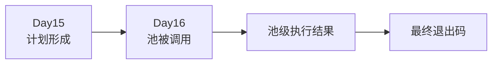

今天新增的问题是：

> 当计划进入执行阶段后，怎样区分“没有运行”“pytest 已返回”和“执行器自身出错”？

---

## 1. 第一性原理：执行事实至少有三层

一个测试池执行后，至少产生三类不同事实：

| 层级 | 回答的问题 |
| --- | --- |
| 计划事实 | 准备运行哪些 nodeid？ |
| 池状态 | 这个池是否被调用，调用过程是否抛出执行器异常？ |
| pytest 退出码 | pytest 对本次测试进程给出了什么结果？ |

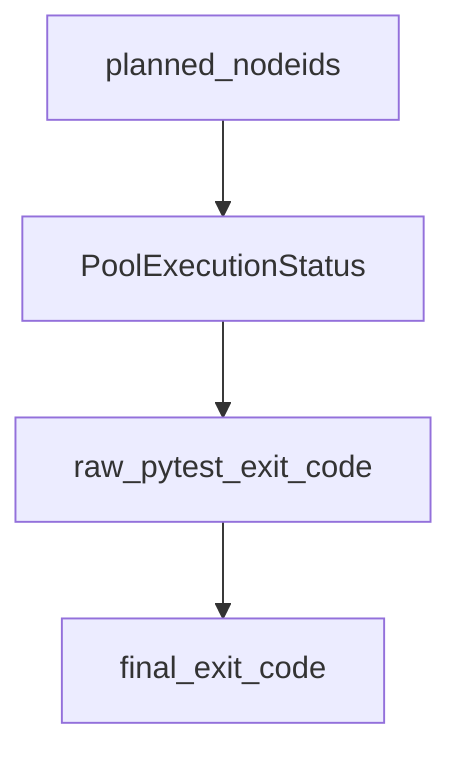

这三层不能互相替代。

“池已完成”不等于“测试全部通过”；“池未运行”也不等于“测试失败”。

---

## 2. TOC：系统约束是状态词被混用

初学者容易形成以下错误因果链：

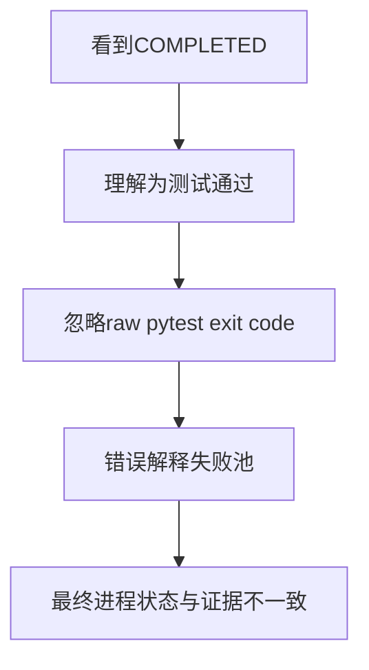

真正的约束不是退出码数量多，而是没有先回答：

```text
这个字段描述的是执行器，还是 pytest？
```

本课始终把两条轴分开：

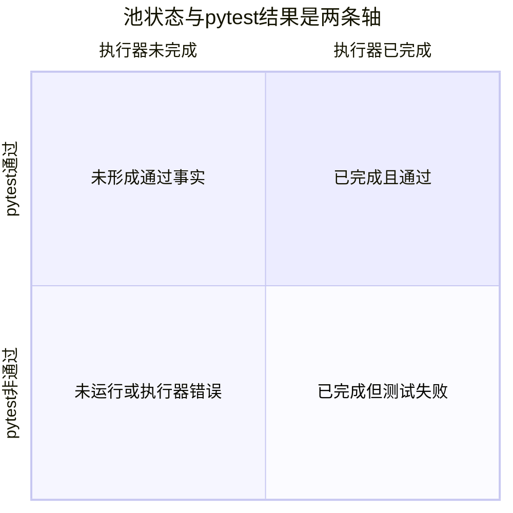

---

## 3. Module 作者真正需要知道什么

Module 作者能直接影响：

- 测试是否可收集。
- nodeid 是否稳定。
- marker 是否正确。
- 测试断言最终让 pytest 返回通过、失败、跳过或错误。
- setup、call、teardown 是否完整。

Module 作者不负责：

- 创建池结果对象。
- 合并多个池退出码。
- 决定终止型退出码。
- 写入 `execution-result.json`。
- 用 Quality 或报告结果改写 pytest 退出码。

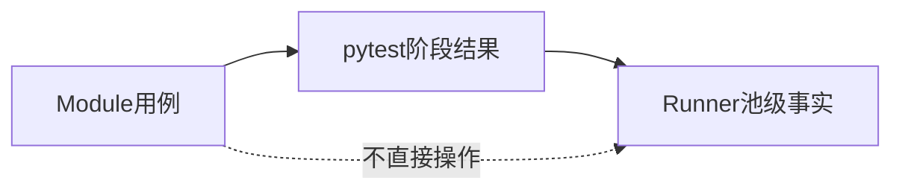

---

## 4. `PoolExecutionStatus` 的三个状态

### 4.1 `NOT_RUN`

表示池没有进入真实 pytest 调用。

常见原因：

- 池中没有 nodeid。
- 前一个池返回终止型退出码，后续池被跳过。
- Runner 主动构造未运行结果。

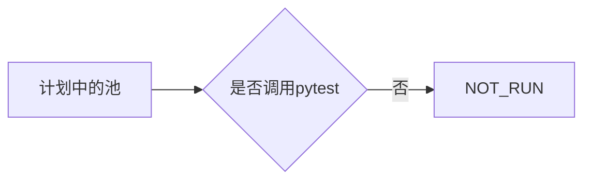

`NOT_RUN` 的 `raw_pytest_exit_code` 是 `None`，因为 pytest 没有为该池返回退出码。

### 4.2 `COMPLETED`

表示 `pytest.main()` 调用正常返回了一个整数退出码。

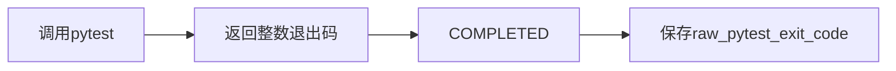

`COMPLETED` 可以与退出码 0、1、2、3、4 或 5 同时出现。

因此：

```text
COMPLETED = 执行器调用完成
不等于
测试通过
```

### 4.3 `ERROR`

表示调用 pytest 的执行函数抛出了普通异常，执行器没有获得原始 pytest 退出码。

结果会记录：

- `started_at`。
- `completed_at`。
- `exception_type`。
- `raw_pytest_exit_code=None`。

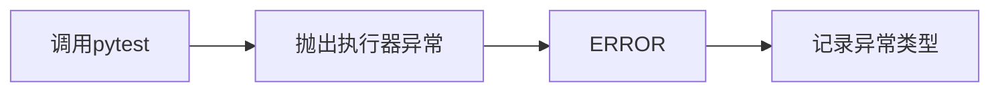

---

## 5. `PoolExecutionResult` 保存什么

| 字段 | 含义 |
| --- | --- |
| `stage_id` | 池或阶段身份，例如 `parallel-pool` |
| `planned_nodeids` | 本池准备交给 pytest 的 nodeid |
| `status` | NOT_RUN、COMPLETED 或 ERROR |
| `raw_pytest_exit_code` | pytest 原始退出码；未运行或异常时为空 |
| `started_at` | 真正开始调用池的时间 |
| `completed_at` | 池调用结束或异常被捕获的时间 |
| `exception_type` | 执行器异常类型，不保存完整敏感异常文本 |
| `junit_path` | 本池预期使用的 JUnit 路径 |

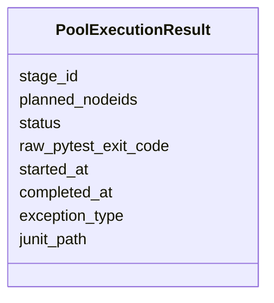

该对象描述池级执行事实，不描述单个测试方法的完整业务语义。

---

## 6. `execute_pool()` 的生命周期

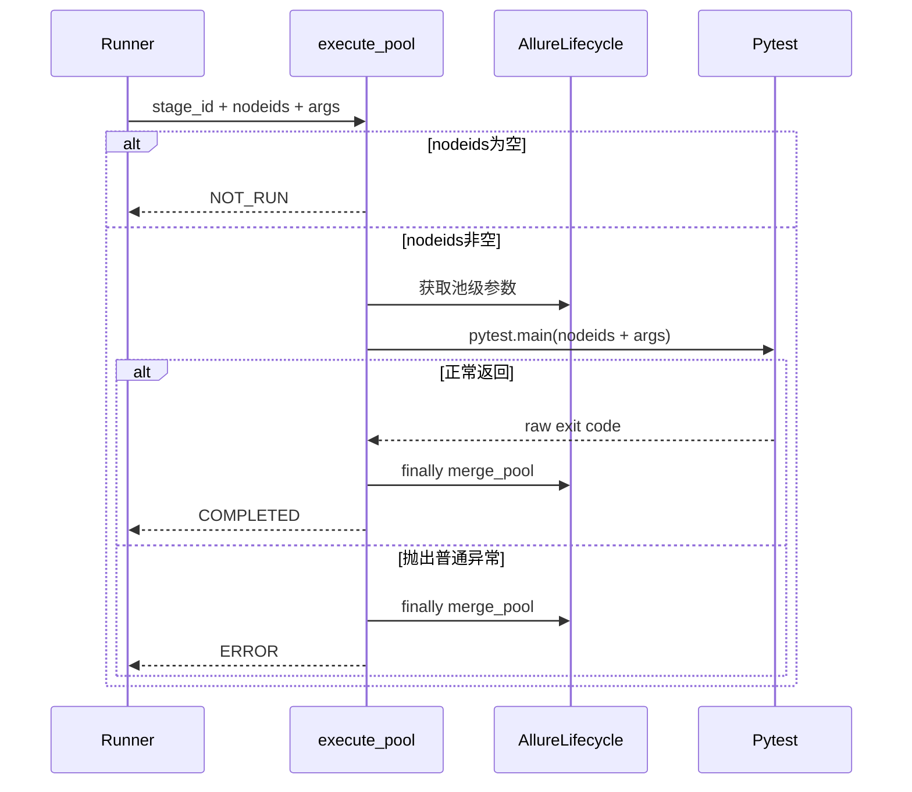

一个重要边界是：Allure 池合并位于 `finally`，即使 pytest 调用抛出异常，也会尝试合并已经产生的 raw 证据。

---

## 7. pytest 原始退出码

当前课程使用 pytest 的六个基础退出码：

| 退出码 | 含义 | Runner 是否视为终止型 |
| --- | --- | --- |
| 0 | 测试执行成功 | 否 |
| 1 | 存在测试失败 | 否 |
| 2 | 执行被中断 | 是 |
| 3 | pytest 内部错误 | 是 |
| 4 | pytest 使用错误 | 是 |
| 5 | 没有收集到测试 | 是 |

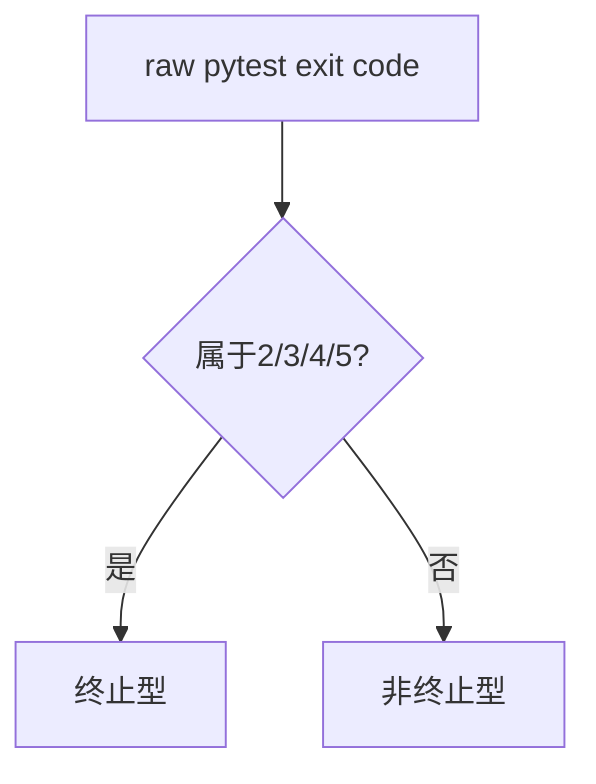

退出码 1 虽然表示测试失败，但不是终止型。

这意味着并行池出现普通测试失败后，串行池仍可继续执行，以收集更多失败证据。

---

## 8. 为什么退出码 1 继续，2～5 停止

### 8.1 普通失败仍有继续价值

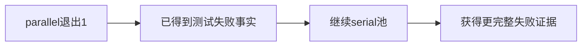

### 8.2 终止型退出码说明执行环境不再可靠

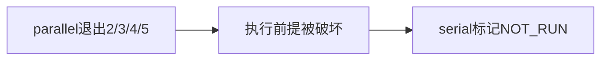

这是一种信息收益与安全边界的权衡：

- 退出码 1：继续可增加有效证据。
- 退出码 2～5：继续可能制造误导或重复基础设施错误。

---

## 9. 最终退出码怎样合并

最终决策按以下顺序理解：

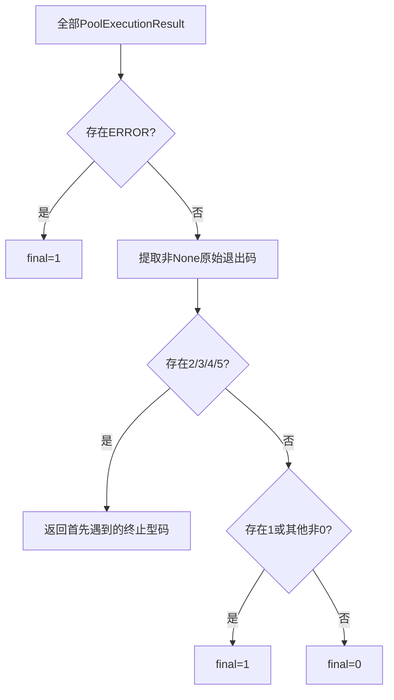

### 9.1 没有原始退出码

`merge_exit_codes([])` 返回 0。

但在真实 Runner 主线中，权威空集合会在收集阶段直接返回 5，而不是依赖空列表合并得到成功。

### 9.2 多池全部为 0

最终返回 0。

### 9.3 任一池为 1

如果没有终止型退出码，最终返回 1。

### 9.4 存在执行器 `ERROR`

最终返回 1，即使其他池返回 0。

---

## 10. `execution-result.json` 记录什么

Runner 在正式执行路径中写入机器可读执行结果。

核心字段包括：

```text
schema_version
test_target
selection_args
planned_case_count
planned_nodeids
collection_exit_code
pool_results
final_exit_code
```

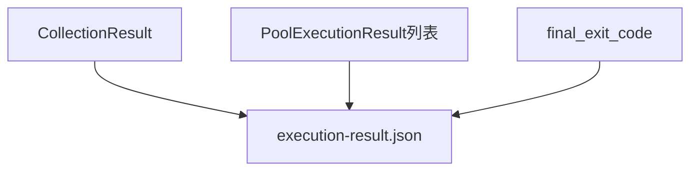

每个池条目保存：

- 阶段身份。
- 计划 nodeid。
- 池状态。
- 原始 pytest 退出码。
- 起止时间。
- 异常类型。
- JUnit 路径。

它不保存：

- service 内部状态。
- Allure HTML 页面内容。
- Jenkins 最终阶段结论。
- Quality 聚合指标。
- 单个断言的完整业务语义。

---

## 11. 原子写入与失败边界

执行结果使用临时文件、flush、`fsync` 和 `os.replace()` 完成原子替换。

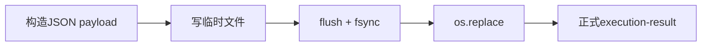

如果写入失败：

- 原本 final=0 时不能制造“假成功”，返回 1。
- 原本 final=1 时仍返回 1。
- 原本为 2、3、4、5 时保留终止型退出码。

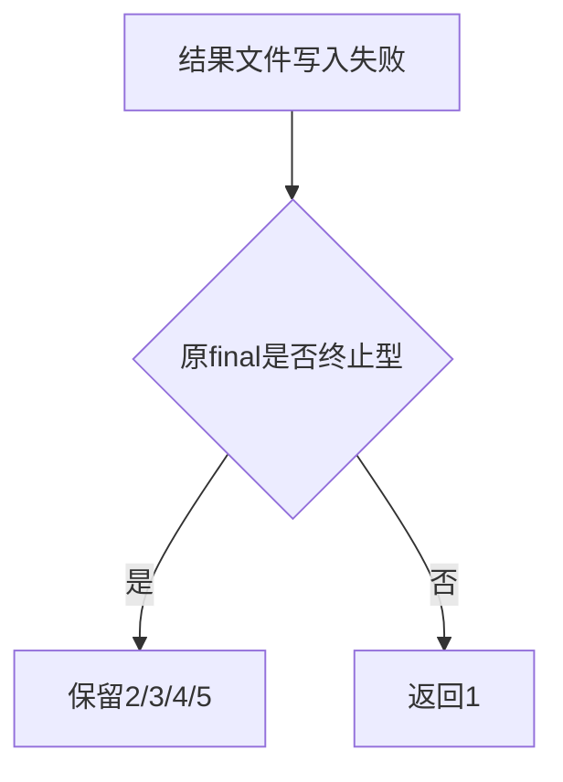

机器产物写入失败不能把真实失败降级为成功。

---

## 12. collect-only 与空集合

### 12.1 collect-only

collect-only 只输出收集和分池摘要，不进入：

- Allure 正式生命周期。
- Quality 正式生命周期。
- 池执行。
- `execution-result.json` 正式执行写入。

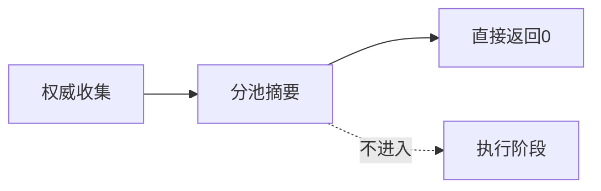

### 12.2 权威空集合

当收集返回 pytest exit 5：

- 不调用池执行。
- 正式非 collect-only 路径会写入空 `pool_results`。
- `collection_exit_code` 与 `final_exit_code` 都为 5。

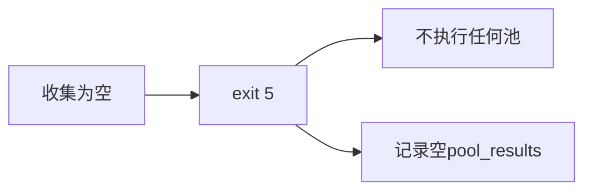

---

## 13. 黄金用例怎样进入本课

黄金用例在本课只提供 module 执行对象：

```text
黄金Test方法
→ 稳定nodeid
→ marker分类
→ pytest执行
→ 池级退出事实
```

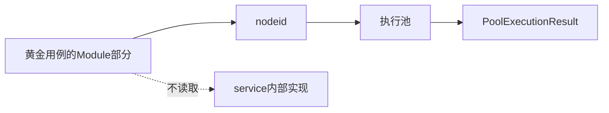

本课可以解释黄金用例的 setup、call、teardown 如何影响 pytest 结果，但不解释其边界对端怎样保存任务或制造故障。

---

## 14. 现有测试直接证明什么

| 测试事实 | 支持的结论 |
| --- | --- |
| 无 `numprocesses` 时所有 nodeid 只进入一次 pytest 调用 | 单池路径消费原始权威顺序 |
| 并行池退出 1 后串行池仍执行 | 普通测试失败不是终止型 |
| 并行池退出 2～5 后串行池不执行 | 终止型退出码会停止后续池 |
| 权威空选择返回 5 且 pool_results 为空 | 空集合在收集阶段结束 |
| 结果文件包含 stage、raw code 和 final code | 池级事实被机器化保存 |
| Quality finalize 失败不改变 pytest exit | 可选观察不拥有执行结论 |
| 结果文件写入失败不产生假成功 | 机器产物失败至少返回非零 |

这些测试使用替身和临时文件，不能扩大成真实外部业务服务已经被验证。

---

## 15. 常见误解

| 误解 | 正确边界 |
| --- | --- |
| COMPLETED 表示测试通过 | 只表示 pytest 调用正常返回 |
| NOT_RUN 表示测试失败 | 表示该池没有真实运行 |
| ERROR 等于 pytest exit 1 | ERROR 是执行器异常；exit 1 是 pytest 测试失败 |
| parallel 失败后一定停止 | 只有 ERROR 或 2～5 停止；exit 1 继续 |
| execution-result 是最终报告 | 它是 Runner 机器执行事实，不是 Allure 页面或 Jenkins 结论 |
| Quality 可以改写最终退出码 | Quality 失败采用旁路原则，不覆盖 pytest 事实 |

---

## 16. 本课结论与 Day 17

Day 16 建立了执行事实链：

```text
计划nodeid
→ 池是否运行
→ pytest是否正常返回
→ 原始退出码
→ 多池合并
→ execution-result.json
```

```mermaid
flowchart LR
    D16[Day16<br/>执行事实] --> D17[Day17<br/>报告生命周期与机器产物]
```

Day 17 将回答：JUnit、Allure raw、Allure HTML、history 和 execution-result 分别由谁拥有，为什么报告生成失败不能改写测试原始退出事实。
