# 第 16 天：执行器状态与退出码

> **课程定位**：承接 Day 15 的权威执行计划，解释计划中的池真正交给 pytest 后，怎样形成池级状态、原始退出码和最终进程退出码  
> **Module 层落点**：用例作者只负责稳定 nodeid、正确 marker 和可靠测试结果；不在 module 中构造 `PoolExecutionResult` 或改写退出码  
> **黄金用例边界**：可以把黄金用例的 module nodeid 放入计划并观察执行事实，但不读取或解释其 service 内部实现  
> **课程形式**：初学者自学课；先建立状态模型，再读最小源码，最后用离线黄金用例和专项测试核对机器事实
> **事实依据**：`run_orchestration/pytest_execution.py`、`run_orchestration/runner.py`、`run_orchestration/artifacts.py` 与 Runner 测试  
> **本课边界**：只讲执行状态和退出事实；Allure 生命周期留给 Day 17，Quality 接入留给 Day 19

---

## 学习目标与前置准备

### 完成本课后，你应该能够

1. 区分“池有没有运行”“pytest 有没有正常返回”“测试是否通过”三个不同问题。
2. 准确解释 `NOT_RUN`、`COMPLETED`、`ERROR` 的含义。
3. 根据多个池的原始 pytest 退出码推导最终退出码。
4. 读懂 `reports/execution-result.json` 中计划、池状态和退出码字段。
5. 说明为什么 Allure 或 Quality 的旁路失败不能改写 pytest 的业务结论。
6. 用仓库自带离线黄金用例生成并核对一次 Runner 机器事实。

### 建议前置知识

- 已完成 Day 14，知道 CLI 参数怎样进入 Runner。
- 已完成 Day 15，知道权威 nodeid 集合怎样被拆成 parallel/serial 两个池。
- 知道 pytest 退出码 `0` 通常表示成功、`1` 表示存在测试失败。
- 能阅读 Python `dataclass`、`Enum`、`try/except/finally`。

### 本课学习产出

完成后至少保留三份材料：

- 一张池状态机图。
- 一张原始退出码到最终退出码的决策表。
- 一份真实 `execution-result.json` 字段解释。

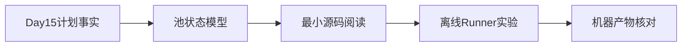

---

## 0. 从 Day 15 接过来的是什么

Day 15 已经形成：

```text
权威 nodeid 全集
→ parallel / serial 分类
→ 单池或并行优先的执行顺序
```

这些仍然只是计划事实。

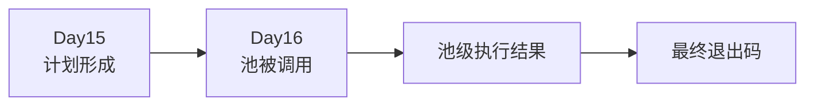

今天新增的问题是：

> 当计划进入执行阶段后，怎样区分“没有运行”“pytest 已返回”和“执行器自身出错”？

---

## 1. 第一性原理：执行事实至少有三层

一个测试池执行后，至少产生三类不同事实：

| 层级 | 回答的问题 |
| --- | --- |
| 计划事实 | 准备运行哪些 nodeid？ |
| 池状态 | 这个池是否被调用，调用过程是否抛出执行器异常？ |
| pytest 退出码 | pytest 对本次测试进程给出了什么结果？ |

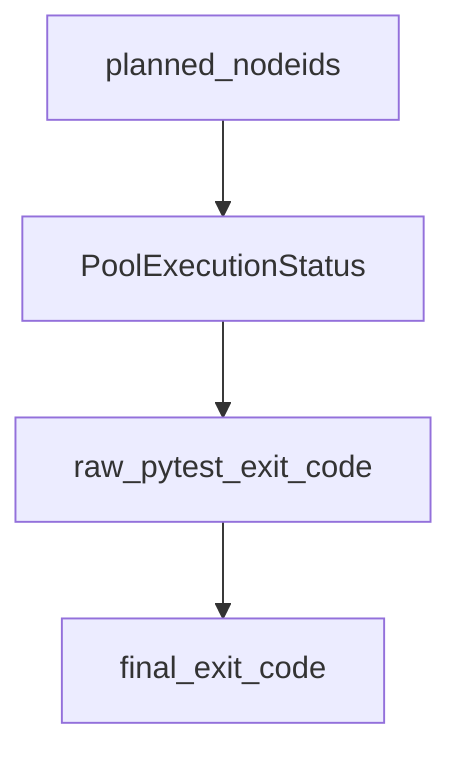

这三层不能互相替代。

“池已完成”不等于“测试全部通过”；“池未运行”也不等于“测试失败”。

---

## 2. TOC：系统约束是状态词被混用

初学者容易形成以下错误因果链：

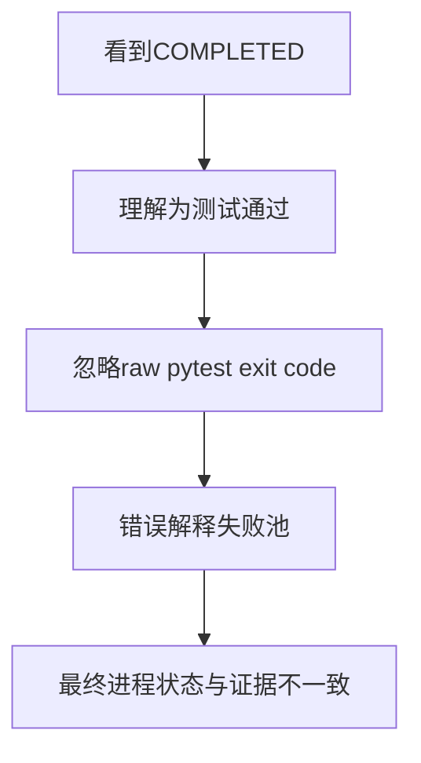

真正的约束不是退出码数量多，而是没有先回答：

```text
这个字段描述的是执行器，还是 pytest？
```

本课始终把两条轴分开：

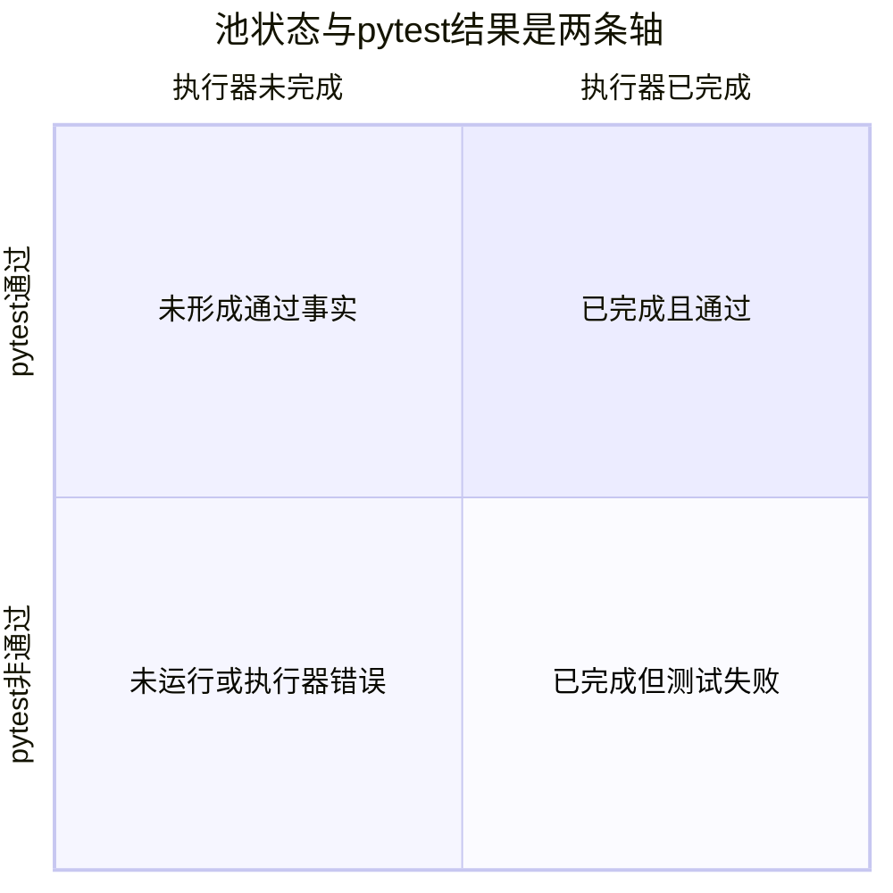

---

## 3. Module 作者真正需要知道什么

Module 作者能直接影响：

- 测试是否可收集。
- nodeid 是否稳定。
- marker 是否正确。
- 测试断言最终让 pytest 返回通过、失败、跳过或错误。
- setup、call、teardown 是否完整。

Module 作者不负责：

- 创建池结果对象。
- 合并多个池退出码。
- 决定终止型退出码。
- 写入 `execution-result.json`。
- 用 Quality 或报告结果改写 pytest 退出码。

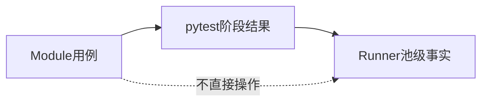

---

## 4. `PoolExecutionStatus` 的三个状态

### 4.1 `NOT_RUN`

表示池没有进入真实 pytest 调用。

常见原因：

- 池中没有 nodeid。
- 前一个池返回终止型退出码，后续池被跳过。
- Runner 主动构造未运行结果。

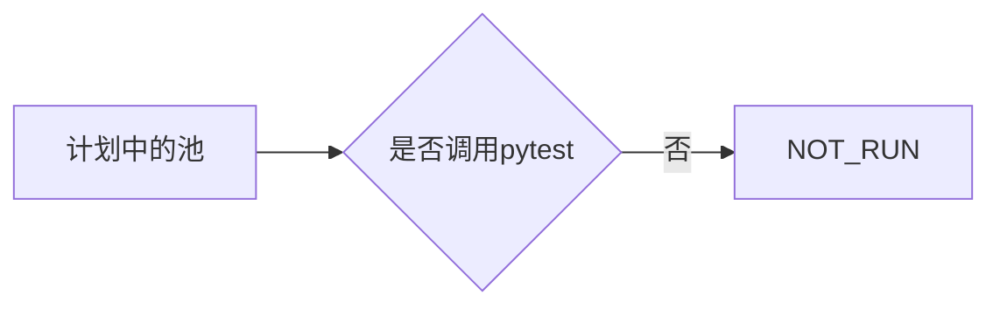

`NOT_RUN` 的 `raw_pytest_exit_code` 是 `None`，因为 pytest 没有为该池返回退出码。

### 4.2 `COMPLETED`

表示 `pytest.main()` 调用正常返回了一个整数退出码。

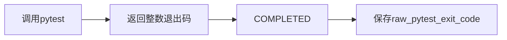

`COMPLETED` 可以与退出码 0、1、2、3、4 或 5 同时出现。

因此：

```text
COMPLETED = 执行器调用完成
不等于
测试通过
```

### 4.3 `ERROR`

表示调用 pytest 的执行函数抛出了普通异常，执行器没有获得原始 pytest 退出码。

结果会记录：

- `started_at`。
- `completed_at`。
- `exception_type`。
- `raw_pytest_exit_code=None`。


---

## 5. `PoolExecutionResult` 保存什么

| 字段 | 含义 |
| --- | --- |
| `stage_id` | 池或阶段身份，例如 `parallel-pool` |
| `planned_nodeids` | 本池准备交给 pytest 的 nodeid |
| `status` | NOT_RUN、COMPLETED 或 ERROR |
| `raw_pytest_exit_code` | pytest 原始退出码；未运行或异常时为空 |
| `started_at` | 真正开始调用池的时间 |
| `completed_at` | 池调用结束或异常被捕获的时间 |
| `exception_type` | 执行器异常类型，不保存完整敏感异常文本 |
| `junit_path` | 本池预期使用的 JUnit 路径 |

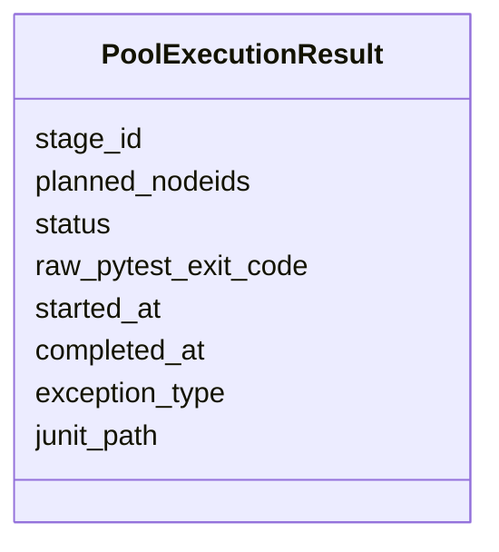

该对象描述池级执行事实，不描述单个测试方法的完整业务语义。

---

## 6. `execute_pool()` 的生命周期

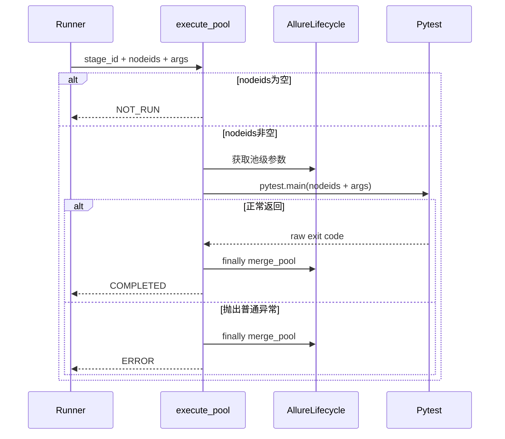

一个重要边界是：Allure 池合并位于 `finally`，即使 pytest 调用抛出异常，也会尝试合并已经产生的 raw 证据。

---

## 7. pytest 原始退出码

当前课程使用 pytest 的六个基础退出码：

| 退出码 | 含义 | Runner 是否视为终止型 |
| --- | --- | --- |
| 0 | 测试执行成功 | 否 |
| 1 | 存在测试失败 | 否 |
| 2 | 执行被中断 | 是 |
| 3 | pytest 内部错误 | 是 |
| 4 | pytest 使用错误 | 是 |
| 5 | 没有收集到测试 | 是 |

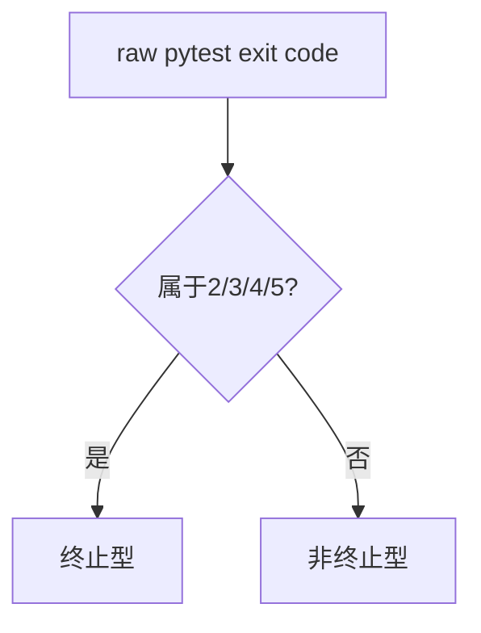

退出码 1 虽然表示测试失败，但不是终止型。

这意味着并行池出现普通测试失败后，串行池仍可继续执行，以收集更多失败证据。

---

## 8. 为什么退出码 1 继续，2～5 停止

### 8.1 普通失败仍有继续价值

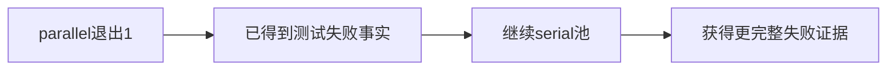

### 8.2 终止型退出码说明执行环境不再可靠

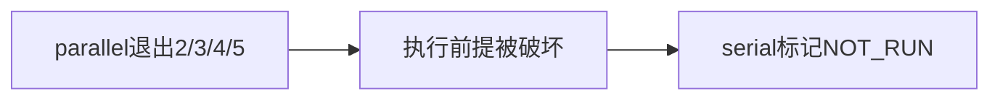

这是一种信息收益与安全边界的权衡：

- 退出码 1：继续可增加有效证据。
- 退出码 2～5：继续可能制造误导或重复基础设施错误。

---

## 9. 最终退出码怎样合并

最终决策按以下顺序理解：

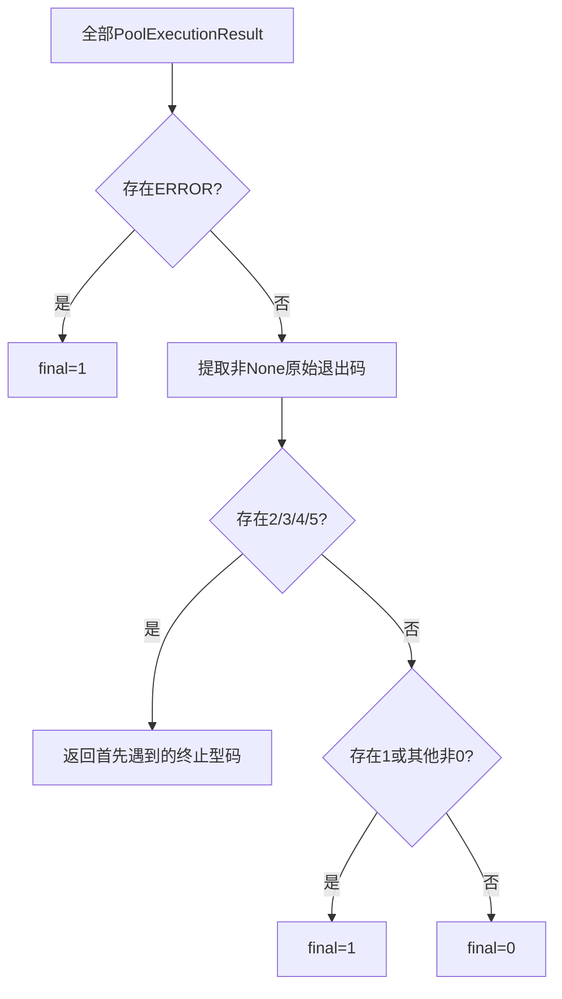

### 9.1 没有原始退出码

`merge_exit_codes([])` 返回 0。

但在真实 Runner 主线中，权威空集合会在收集阶段直接返回 5，而不是依赖空列表合并得到成功。

### 9.2 多池全部为 0

最终返回 0。

### 9.3 任一池为 1

如果没有终止型退出码，最终返回 1。

### 9.4 存在执行器 `ERROR`

最终返回 1，即使其他池返回 0。

---

## 10. `execution-result.json` 记录什么

Runner 在正式执行路径中写入机器可读执行结果。

核心字段包括：

```text
schema_version
test_target
selection_args
planned_case_count
planned_nodeids
collection_exit_code
pool_results
final_exit_code
```

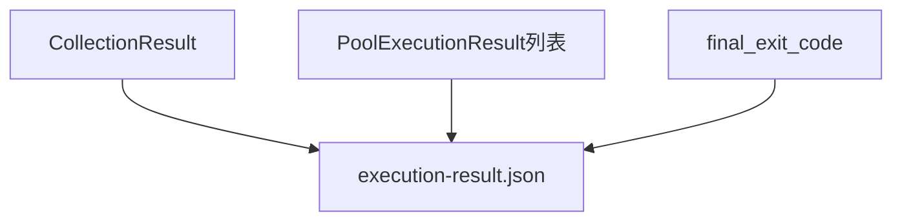

每个池条目保存：

- 阶段身份。
- 计划 nodeid。
- 池状态。
- 原始 pytest 退出码。
- 起止时间。
- 异常类型。
- JUnit 路径。

它不保存：

- service 内部状态。
- Allure HTML 页面内容。
- Jenkins 最终阶段结论。
- Quality 聚合指标。
- 单个断言的完整业务语义。

---

## 11. 原子写入与失败边界

执行结果使用临时文件、flush、`fsync` 和 `os.replace()` 完成原子替换。

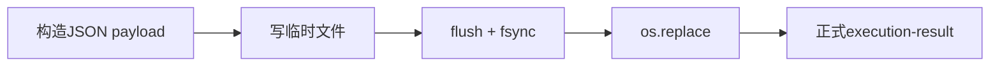

如果写入失败：

- 原本 final=0 时不能制造“假成功”，返回 1。
- 原本 final=1 时仍返回 1。
- 原本为 2、3、4、5 时保留终止型退出码。

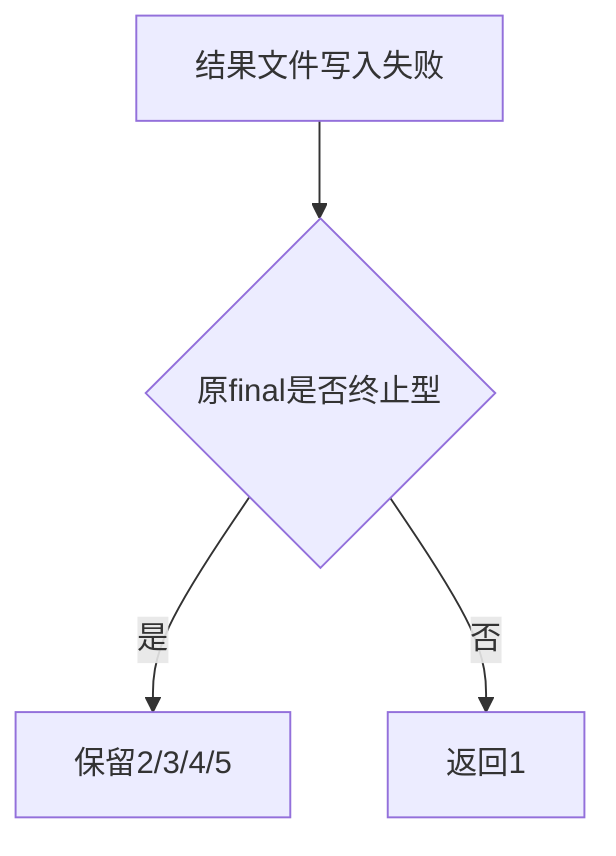

机器产物写入失败不能把真实失败降级为成功。

---

## 12. collect-only 与空集合

### 12.1 collect-only

collect-only 只输出收集和分池摘要，不进入：

- Allure 正式生命周期。
- Quality 正式生命周期。
- 池执行。
- `execution-result.json` 正式执行写入。

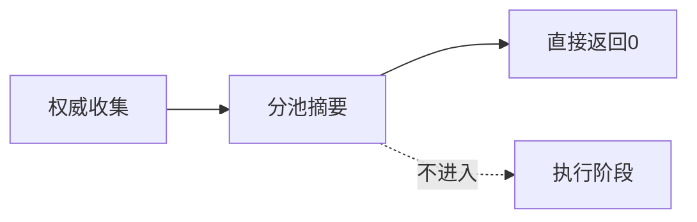

### 12.2 权威空集合

当收集返回 pytest exit 5：

- 不调用池执行。
- 正式非 collect-only 路径会写入空 `pool_results`。
- `collection_exit_code` 与 `final_exit_code` 都为 5。

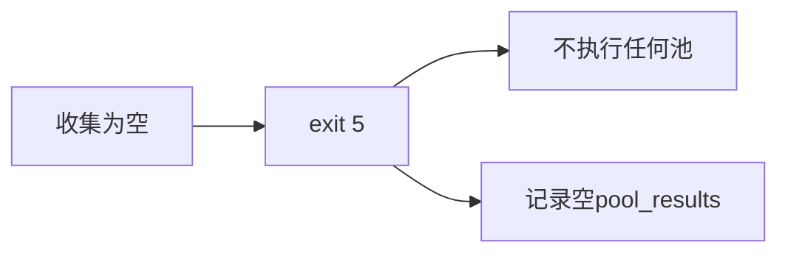

---

## 13. 黄金用例怎样进入本课

黄金用例在本课只提供 module 执行对象：

```text
黄金Test方法
→ 稳定nodeid
→ marker分类
→ pytest执行
→ 池级退出事实
```

```mermaid
flowchart LR
    G[黄金用例的Module部分] --> N[nodeid]
    N --> P[执行池]
    P --> R[PoolExecutionResult]
    G -.不读取.-> S[service内部实现]
```

本课可以解释黄金用例的 setup、call、teardown 如何影响 pytest 结果，但不解释其边界对端怎样保存任务或制造故障。

---

## 14. 现有测试直接证明什么

| 测试事实 | 支持的结论 |
| --- | --- |
| 无 `numprocesses` 时所有 nodeid 只进入一次 pytest 调用 | 单池路径消费原始权威顺序 |
| 并行池退出 1 后串行池仍执行 | 普通测试失败不是终止型 |
| 并行池退出 2～5 后串行池不执行 | 终止型退出码会停止后续池 |
| 权威空选择返回 5 且 pool_results 为空 | 空集合在收集阶段结束 |
| 结果文件包含 stage、raw code 和 final code | 池级事实被机器化保存 |
| Quality finalize 失败不改变 pytest exit | 可选观察不拥有执行结论 |
| 结果文件写入失败不产生假成功 | 机器产物失败至少返回非零 |

这些测试使用替身和临时文件，不能扩大成真实外部业务服务已经被验证。

---

## 15. 常见误解

| 误解 | 正确边界 |
| --- | --- |
| COMPLETED 表示测试通过 | 只表示 pytest 调用正常返回 |
| NOT_RUN 表示测试失败 | 表示该池没有真实运行 |
| ERROR 等于 pytest exit 1 | ERROR 是执行器异常；exit 1 是 pytest 测试失败 |
| parallel 失败后一定停止 | 只有 ERROR 或 2～5 停止；exit 1 继续 |
| execution-result 是最终报告 | 它是 Runner 机器执行事实，不是 Allure 页面或 Jenkins 结论 |
| Quality 可以改写最终退出码 | Quality 失败采用旁路原则，不覆盖 pytest 事实 |

---

## 16. 本课结论与 Day 17

Day 16 建立了执行事实链：

```text
计划nodeid
→ 池是否运行
→ pytest是否正常返回
→ 原始退出码
→ 多池合并
→ execution-result.json
```

```mermaid
flowchart LR
    D16[Day16<br/>执行事实] --> D17[Day17<br/>报告生命周期与机器产物]
```

Day 17 将回答：JUnit、Allure raw、Allure HTML、history 和 execution-result 分别由谁拥有，为什么报告生成失败不能改写测试原始退出事实。

---

## 17. 最小源码阅读路线

初学者不需要从整个 `run_orchestration/` 目录开始遍历。本课只按“状态定义 → 单池执行 → 多池编排 → 机器落盘”的顺序读取。

```mermaid
flowchart LR
    A[pytest_execution.py<br/>状态与execute_pool] --> B[runner.py<br/>多池流程]
    B --> C[artifacts.py<br/>原子写入]
    C --> D[专项测试<br/>边界证据]
```

### 第一步：读状态对象

打开 `run_orchestration/pytest_execution.py`，先定位：

- `PoolExecutionStatus`
- `PoolExecutionResult`
- `PYTEST_EXIT_*`
- `PYTEST_TERMINATING_EXIT_CODES`

先回答字段问题，不急着追调用：

| 字段 | 阅读时要问的问题 |
| --- | --- |
| `stage_id` | 这是哪个执行阶段？ |
| `planned_nodeids` | 本池原计划执行什么？ |
| `status` | Runner 是否真正完成了 pytest 调用？ |
| `raw_pytest_exit_code` | pytest 是否给出了原始退出码？ |
| `exception_type` | 是否发生执行器层异常？ |
| `junit_path` | 该池预期关联哪个 JUnit 文件？ |

### 第二步：读单池生命周期

继续阅读 `execute_pool()`，只抓四个分支：

1. nodeid 为空，直接返回 `NOT_RUN`。
2. 调用前记录 `started_at`。
3. `pytest.main()` 正常返回，形成 `COMPLETED + raw code`。
4. 调用抛出普通异常，形成 `ERROR + exception_type`。

注意 `allure_lifecycle.merge_pool(stage_id)` 位于 `finally`。这说明报告 raw 合并是执行后的旁路清理动作，不是 pytest 成功返回的前置条件。

### 第三步：读多池编排

打开 `run_orchestration/runner.py`，顺序定位：

- parallel 池执行。
- `stop_after_parallel` 判定。
- serial 池执行或 `NOT_RUN`。
- `_final_exit_code()`。
- `_write_execution_result()`。
- `finally` 中的 Allure 与 Quality finalize。

此时要特别观察：最终退出码先由池事实计算，旁路生命周期在 `finally` 中结束。

### 第四步：读机器落盘

打开 `run_orchestration/artifacts.py`，确认：

- schema 为 `runner-execution.v1`。
- 默认路径是 `reports/execution-result.json`。
- 使用临时文件与替换完成原子写入。

### 第五步：只用测试验证边界

最后阅读：

- `tests/test_run_orchestration_public_contract.py`
- `tests/test_run_orchestration_boundaries.py`

测试不是源码的重复说明，而是“哪些边界已经被机器锁定”的证据。

---

## 18. 离线实践：从状态推导到机器产物

以下命令均在仓库根目录执行，不会调用真实外部接口。

### 实验一：运行 Runner 专项测试

```powershell
.\.venv\Scripts\python.exe -m pytest `
  tests/test_run_orchestration_public_contract.py `
  tests/test_run_orchestration_boundaries.py `
  -q
```

当前仓库的预期结果是：

```text
7 passed
```

这组测试主要证明：

- 无并行参数时使用单个 serial pool。
- parallel exit 1 后 serial 仍可执行。
- parallel 出现终止型退出码后 serial 不再执行。
- 机器产物包含池级与最终退出事实。
- Quality finalize 失败不会改写 pytest 退出码。

如果数量随仓库演进变化，应以“测试全部通过且断言语义未改变”为准，不要把 `7` 当成永久业务常量。

### 实验二：直接观察退出码合并函数

```powershell
@'
from run_orchestration.pytest_execution import merge_exit_codes

samples = [
    (),
    (0,),
    (0, 0),
    (1, 0),
    (0, 1),
    (1, 2),
    (4, 1),
]

for sample in samples:
    print(f"{sample!r} -> {merge_exit_codes(sample)}")
'@ | .\.venv\Scripts\python.exe -
```

预期输出：

```text
() -> 0
(0,) -> 0
(0, 0) -> 0
(1, 0) -> 1
(0, 1) -> 1
(1, 2) -> 2
(4, 1) -> 4
```

观察重点：

- 空序列表示没有可合并的原始码，函数返回 `0`。
- `1` 表示普通测试失败。
- `2～5` 属于终止型结果，优先返回遇到的终止型退出码。

不要把这个实验扩大解释为 `_final_exit_code()` 的全部行为，因为 `_final_exit_code()` 还会先检查池是否存在 `ERROR`。

### 实验三：运行离线黄金用例并读取机器事实

先关闭 Quality 和 Allure HTML/history 生成，只保留 Runner 执行与 Allure raw：

```powershell
$env:QUALITY_ENABLE = '0'
$env:GENERATE_ALLURE_REPORT = 'FALSE'
$env:GENERATE_HISTORY_REPORT = 'FALSE'

.\.venv\Scripts\python.exe .\run_master.py `
  .\module\offline_framework_example\test_full_framework_flow.py `
  -q

Write-Output "Runner exit code: $LASTEXITCODE"
```

预期关键输出类似：

```text
Collected test cases: 1
- module/offline_framework_example/test_full_framework_flow.py::TestFullFrameworkFlow::test_offline_async_media_flow
Parallel test execution disabled. Running all cases serially.
1 passed
Allure HTML report generation skipped by GENERATE_ALLURE_REPORT=FALSE.
Runner exit code: 0
```

然后读取机器产物：

```powershell
$result = Get-Content .\reports\execution-result.json -Raw -Encoding UTF8 |
  ConvertFrom-Json

$result | Select-Object `
  schema_version, test_target, planned_case_count, `
  collection_exit_code, final_exit_code

$result.pool_results | Format-Table `
  stage_id, status, raw_pytest_exit_code, exception_type
```

你应该看到的稳定关系是：

| 字段 | 本实验预期 |
| --- | --- |
| `schema_version` | `runner-execution.v1` |
| `planned_case_count` | `1` |
| `collection_exit_code` | `0` |
| `pool_results[0].stage_id` | `serial-pool` |
| `pool_results[0].status` | `COMPLETED` |
| `pool_results[0].raw_pytest_exit_code` | `0` |
| `pool_results[0].exception_type` | `null` |
| `final_exit_code` | `0` |

时间戳会随运行变化，绝不能把示例时间当成固定值。

```mermaid
sequenceDiagram
    participant U as 学员
    participant R as run_master.py
    participant P as pytest
    participant F as execution-result.json
    U->>R: 执行离线黄金用例
    R->>P: serial-pool nodeid + 参数
    P-->>R: raw exit code 0
    R->>R: 计算final exit code 0
    R->>F: 原子写入机器事实
    U->>F: ConvertFrom-Json核对字段
```

---

## 19. 故障排查：先定位事实层

### 情况一：专项测试无法导入模块

检查：

- 当前目录是否为仓库根目录。
- 是否使用 `.venv\Scripts\python.exe`。
- 虚拟环境依赖是否已安装。

这属于环境入口问题，还没有进入 Runner 状态判断。

### 情况二：离线黄金用例收集不到

先执行：

```powershell
.\.venv\Scripts\python.exe .\run_master.py `
  .\module\offline_framework_example\test_full_framework_flow.py `
  --collect-only -q
```

如果收集结果不是 1，先回到 Day 15 检查目标路径、选择参数和 nodeid，不要直接修改退出码逻辑。

### 情况三：看到 `COMPLETED` 但最终退出码非零

这是允许的。

按顺序检查：

1. `raw_pytest_exit_code` 是多少。
2. 是否存在另一个池返回非零。
3. 是否出现终止型退出码。
4. 是否发生 `execution-result.json` 写入失败。

### 情况四：`execution-result.json` 不存在

可能原因：

- 使用了 `--collect-only`，该路径不会进入正式执行结果写入。
- 进程在收集前或调用入口前被强制终止。
- `reports/` 权限或原子替换失败。

不要用 Allure HTML 是否存在来推断该文件是否应该存在，它们属于不同生命周期。

### 情况五：Allure 或 Quality 报警，但 Runner 返回 0

先判断报警是否属于旁路生命周期。当前设计允许报告生成或质量采集失败开放，只要 pytest 执行事实仍为成功，业务退出码可以保持 `0`。

这不表示报警可以忽略；它表示报警应进入产物完整性或质量治理，而不是篡改用例执行结论。

---

## 20. 练习与参考答案

### 练习一：状态与退出码

某 parallel 池的结果是：

```text
status = COMPLETED
raw_pytest_exit_code = 1
```

问题：它是执行器错误吗？serial 池是否应该继续？

**参考答案**：不是执行器错误。`COMPLETED` 表示 pytest 正常返回，`1` 表示存在普通测试失败。当前策略下 serial 池仍应继续执行。

### 练习二：终止型退出码

parallel 池返回 `raw_pytest_exit_code = 4`，serial 池已有计划 nodeid。

问题：serial 池最终应是什么状态？最终退出码是什么？

**参考答案**：Runner 会停止后续池，serial 池形成 `NOT_RUN`，其原始退出码为 `None`；最终退出码保留终止型 `4`。

### 练习三：执行器异常

`pytest.main()` 没有返回整数，而是抛出 `RuntimeError`。

问题：池状态、原始退出码、异常字段和最终退出码分别是什么方向？

**参考答案**：池状态为 `ERROR`，`raw_pytest_exit_code` 为 `None`，`exception_type` 记录 `RuntimeError`；Runner `_final_exit_code()` 将执行器错误归一为测试失败退出码 `1`。

### 练习四：机器产物写入失败

两个池都返回 `0`，但 `execution-result.json` 原子写入失败。

问题：进程能否仍返回 `0`？

**参考答案**：不能。非终止型成功结论在关键机器产物写入失败时会转为 `1`，避免产生“没有执行证据但宣称成功”的假成功。

### 练习五：职责边界

某次 Allure HTML 生成失败，但 `execution-result.json` 显示单池 `COMPLETED + raw 0 + final 0`。

问题：应该如何描述本轮结果？

**参考答案**：测试执行成功，Runner 机器事实完整；Allure 展示产物生成失败，需要单独修复报告链路。不能把页面失败描述成测试用例失败，也不能忽略报告链路异常。

---

## 21. 当日验收清单

- [ ] 能不用“成功/失败”两个模糊词，解释池状态和 pytest 退出码。
- [ ] 能说明 `NOT_RUN` 为什么没有原始退出码。
- [ ] 能说明 `COMPLETED + 1` 为什么是合法组合。
- [ ] 能说明 `ERROR` 与 pytest exit 1 的差异。
- [ ] 能解释 exit 1 为什么允许后续池继续，而 2～5 会停止。
- [ ] 能从 `PoolExecutionResult` 找到计划、时间、异常和 JUnit 路径。
- [ ] 能独立运行两组 Runner 专项测试。
- [ ] 能运行离线黄金用例并找到 `reports/execution-result.json`。
- [ ] 能把机器产物字段映射回 Runner 中的对象与分支。
- [ ] 能说明执行结果写入失败为何不能产生假成功。
- [ ] 能解释 Allure/Quality 为什么是旁路观察者而不是退出码所有者。

如果有任意一项说不清，优先回到对应状态图或实验输出，不要靠背诵字段名过关。

---

## 22. 一分钟复述模板

> Day 15 先产生权威 nodeid 计划。Day 16 中，每个池由 `execute_pool()` 转成 `PoolExecutionResult`。`NOT_RUN` 表示没有调用 pytest，`COMPLETED` 表示 pytest 正常返回，`ERROR` 表示执行器捕获到异常。pytest 原始退出码与池状态是两条轴；Runner 先处理执行器错误，再按终止型退出码和普通失败合并最终退出码，最后把计划、池结果和最终码原子写入 `reports/execution-result.json`。Allure 与 Quality 可以观察执行，但不能拥有或改写 pytest 的业务结论。

能够完整复述这段话，并用本地机器产物举证，就达到了 Day 16 的学习目标。
