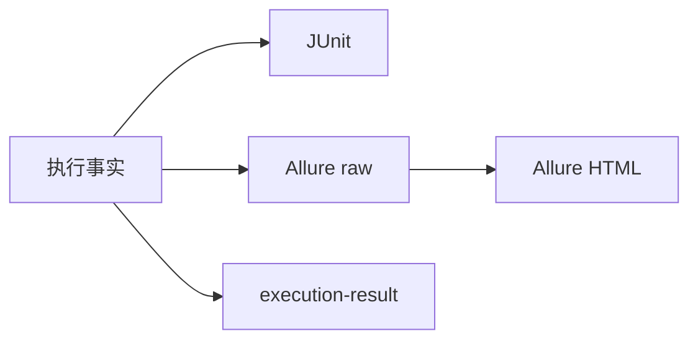
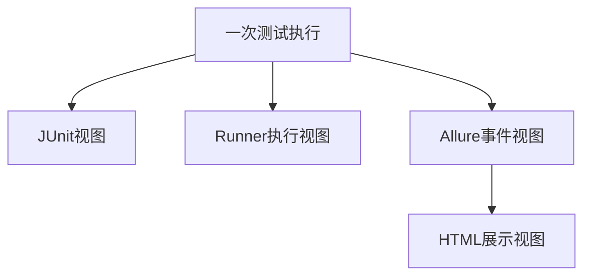
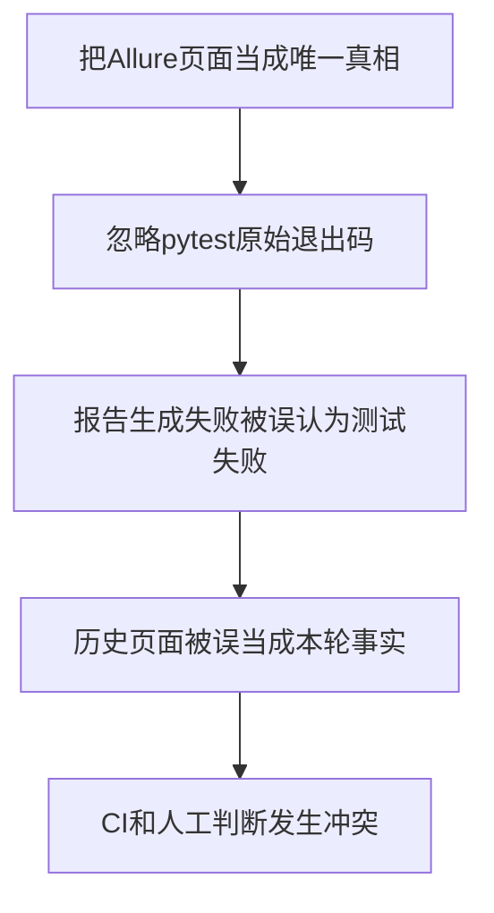
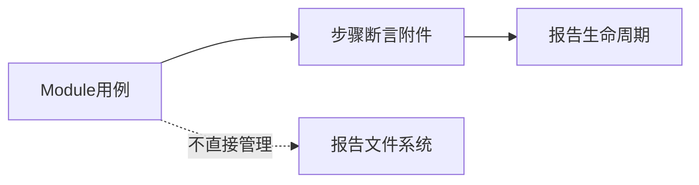
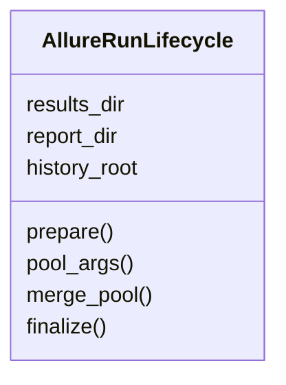
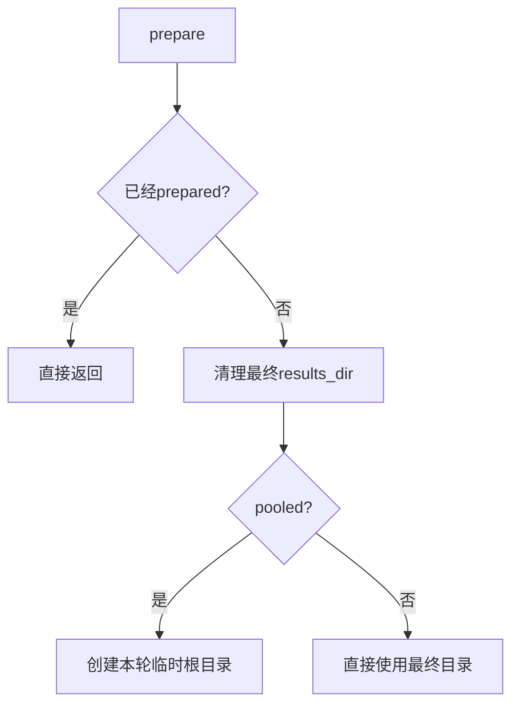
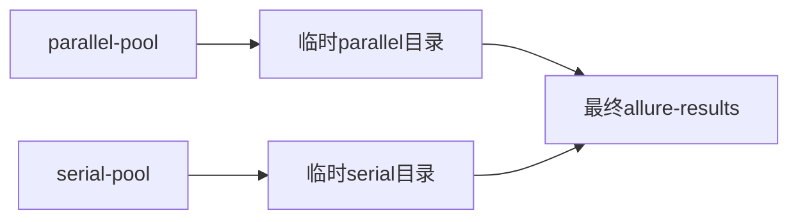

# 第 17 天：测试报告生命周期与机器产物

> **课程定位**：承接 Day 16 的池级执行事实，解释 JUnit、Allure raw、Allure HTML、history 和 `execution-result.json` 怎样形成各自独立的证据边界  
> **Module 层落点**：module 用例只使用标准断言、`allure_step`、附件与资源收集能力，不直接清理、合并或生成报告目录  
> **黄金用例边界**：可以观察黄金用例的 module 步骤、断言和附件怎样进入报告，但不讲其 service 内部状态和故障实现  
> **课程形式**：纯讲解，不设置实操、练习、作业、小测或命令执行要求  
> **事实依据**：`run_orchestration/allure_lifecycle.py`、`module/conftest.py`、`run_orchestration/artifacts.py` 与 Allure 测试  
> **本课边界**：不展开 Runtime Hooks 和 Quality 采集；它们分别从 Day 18、Day 19 开始

---

## 0. 从 Day 16 接过来的问题

Day 16 已经得到：

- 权威测试计划。
- 池级状态。
- pytest 原始退出码。
- 最终退出码。
- `execution-result.json`。

但执行事实还需要被不同读者消费。



今天要回答：

> 为什么这些产物不能合并成“一个报告文件”，以及谁负责它们的生命周期？

---

## 1. 第一性原理：产物是事实的不同投影

同一次测试执行可以被多个产物描述，但每个产物只保留自己关心的视角。

| 产物 | 主要视角 |
| --- | --- |
| JUnit XML | 用例统计、阶段结果、失败详情和 CI 兼容 |
| Allure raw | 步骤、附件、标签和测试结果原始事件 |
| Allure HTML | 对 raw 结果的可视化展示 |
| history | 某次 HTML 报告的历史快照和 latest 副本 |
| execution-result | Runner 计划、池状态、原始退出码和最终退出码 |



报告视图不是执行事实本身，而是对执行事实的结构化表达。

---

## 2. TOC：最大约束是产物职责混淆



解约束方式是固定事实优先级：

```text
pytest原始退出码与Runner执行事实
→ JUnit和Allure raw
→ HTML与history展示
```

展示层不能反向改写执行层。

---

## 3. Module 作者与报告系统的边界

Module 用例负责产生有意义的业务证据：

- 清晰测试名称。
- 领域 Assertions。
- Task 上的业务步骤。
- 必要的脱敏附件。
- 正确 setup、call、teardown 结果。

Module 用例不负责：

- 删除 `allure-results/`。
- 为不同池创建临时 raw 目录。
- 合并池级附件。
- 调用 Allure CLI。
- 生成 HTML 或历史副本。
- 写 Runner 执行结果。



这保证业务代码只描述业务，不承担报告基础设施副作用。

---

## 4. `AllureRunLifecycle` 是单一所有者

该生命周期对象拥有：

- 最终 raw 结果目录。
- 池级临时目录。
- HTML 报告目录。
- history 根目录。
- latest 历史副本。
- 清理、合并、生成和保留策略。



Runner 和直接 pytest 都委托同一实现，避免出现两个文件系统生命周期所有者。

---

## 5. `prepare()`：本轮 raw 结果的起点

`prepare()` 只执行一次。



pooled 模式不会让所有池同时写入同一个 raw 目录，而是为每个池准备独立位置。

准备失败采用 fail-open：记录消息，但不抛出错误覆盖 pytest 执行。

---

## 6. `pool_args()`：每个池获得独立 raw 目录



`pool_args()` 会把原 pytest 参数中的 `--alluredir` 替换成当前池临时目录。

最终自定义 `--alluredir` 仍由生命周期保存为合并目标，不会因为池级隔离而丢失。

<!-- CONTINUE -->
