# 第 17 天：测试报告生命周期与机器产物

> **课程定位**：承接 Day 16 的池级执行事实，解释 JUnit、Allure raw、Allure HTML、history 和 `execution-result.json` 怎样形成各自独立的证据边界  
> **Module 层落点**：module 用例只使用标准断言、`allure_step`、附件与资源收集能力，不直接清理、合并或生成报告目录  
> **黄金用例边界**：可以观察黄金用例的 module 步骤、断言和附件怎样进入报告，但不讲其 service 内部状态和故障实现  
> **课程形式**：初学者自学课；先拆分产物职责，再追踪单一生命周期，最后用直接 pytest、Runner 和专项测试核对证据边界
> **事实依据**：`run_orchestration/allure_lifecycle.py`、`module/conftest.py`、`run_orchestration/artifacts.py` 与 Allure 测试  
> **本课边界**：不展开 Runtime Hooks 和 Quality 采集；它们分别从 Day 18、Day 19 开始

---

## 学习目标与前置准备

### 完成本课后，你应该能够

1. 区分 JUnit、Allure raw、Allure HTML、history 与 `execution-result.json`。
2. 解释 `AllureRunLifecycle` 为什么必须成为单一文件系统所有者。
3. 画出 `prepare → pool_args → merge_pool → finalize` 生命周期。
4. 说明 parallel/serial 池为什么不能直接并发写同一个 raw 目录。
5. 解释相同文件、冲突文件和临时目录分别怎样处理。
6. 区分 Runner 路径与直接 pytest 路径的生命周期所有者。
7. 说明 HTML/history 生成失败为什么不改写 pytest 原始退出码。
8. 使用仓库离线用例生成 Allure raw，并从文件名和 JSON 内容识别原始证据。

### 建议前置知识

- 已完成 Day 16，能区分池状态、pytest 原始退出码与最终退出码。
- 知道 pytest 插件可以在 session 开始和结束时执行钩子。
- 能理解目录清理、临时目录、文件复制和 Hash 比较。
- 知道 HTML 是展示格式，不等于原始事件数据。

### 本课学习产出

- 一张 Allure 生命周期状态图。
- 一张五类产物职责矩阵。
- 一张 Runner 与直接 pytest 的所有权对照图。
- 一份离线生成的 Allure raw 文件观察记录。

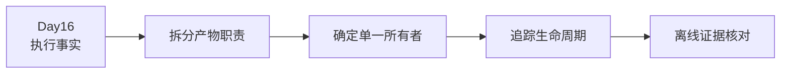

---

## 0. 从 Day 16 接过来的问题

Day 16 已经得到：

- 权威测试计划。
- 池级状态。
- pytest 原始退出码。
- 最终退出码。
- `execution-result.json`。

但执行事实还需要被不同读者消费。

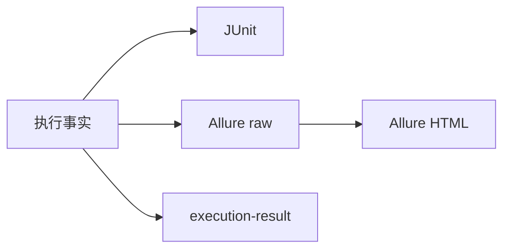

今天要回答：

> 为什么这些产物不能合并成“一个报告文件”，以及谁负责它们的生命周期？

---

## 1. 第一性原理：产物是事实的不同投影

同一次测试执行可以被多个产物描述，但每个产物只保留自己关心的视角。

| 产物 | 主要视角 |
| --- | --- |
| JUnit XML | 用例统计、阶段结果、失败详情和 CI 兼容 |
| Allure raw | 步骤、附件、标签和测试结果原始事件 |
| Allure HTML | 对 raw 结果的可视化展示 |
| history | 某次 HTML 报告的历史快照和 latest 副本 |
| execution-result | Runner 计划、池状态、原始退出码和最终退出码 |

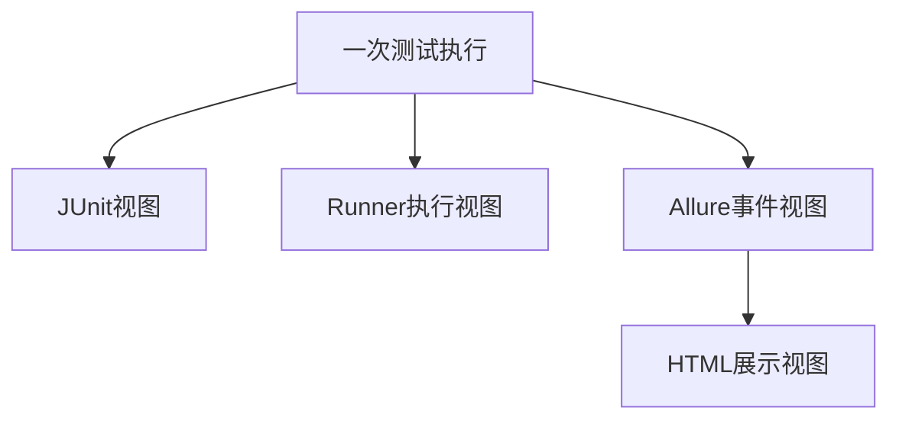

报告视图不是执行事实本身，而是对执行事实的结构化表达。

---

## 2. TOC：最大约束是产物职责混淆

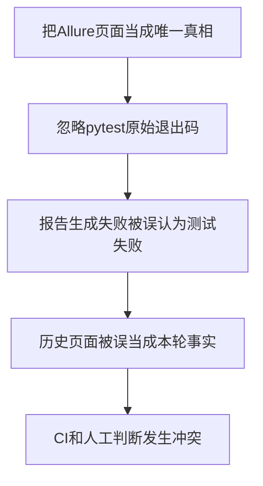

解约束方式是固定事实优先级：

```text
pytest原始退出码与Runner执行事实
→ JUnit和Allure raw
→ HTML与history展示
```

展示层不能反向改写执行层。

---

## 3. Module 作者与报告系统的边界

Module 用例负责产生有意义的业务证据：

- 清晰测试名称。
- 领域 Assertions。
- Task 上的业务步骤。
- 必要的脱敏附件。
- 正确 setup、call、teardown 结果。

Module 用例不负责：

- 删除 `allure-results/`。
- 为不同池创建临时 raw 目录。
- 合并池级附件。
- 调用 Allure CLI。
- 生成 HTML 或历史副本。
- 写 Runner 执行结果。

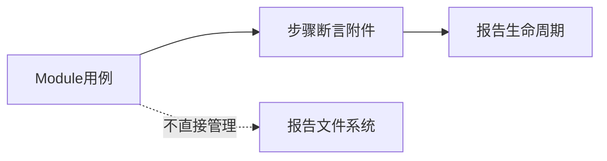

这保证业务代码只描述业务，不承担报告基础设施副作用。

---

## 4. `AllureRunLifecycle` 是单一所有者

该生命周期对象拥有：

- 最终 raw 结果目录。
- 池级临时目录。
- HTML 报告目录。
- history 根目录。
- latest 历史副本。
- 清理、合并、生成和保留策略。

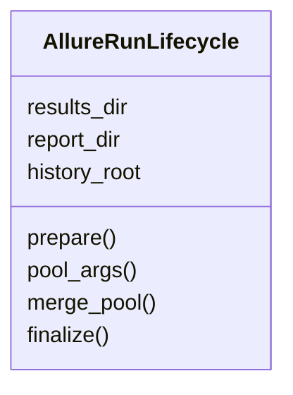

Runner 和直接 pytest 都委托同一实现，避免出现两个文件系统生命周期所有者。

---

## 5. `prepare()`：本轮 raw 结果的起点

`prepare()` 只执行一次。

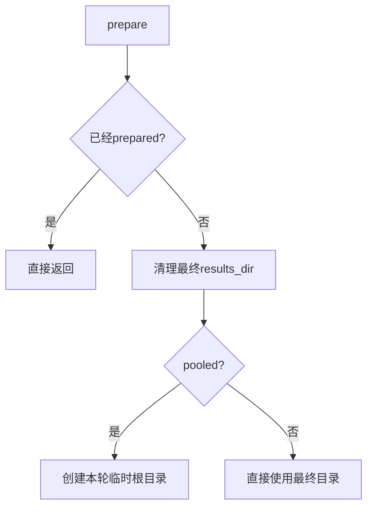

pooled 模式不会让所有池同时写入同一个 raw 目录，而是为每个池准备独立位置。

准备失败采用 fail-open：记录消息，但不抛出错误覆盖 pytest 执行。

---

## 6. `pool_args()`：每个池获得独立 raw 目录

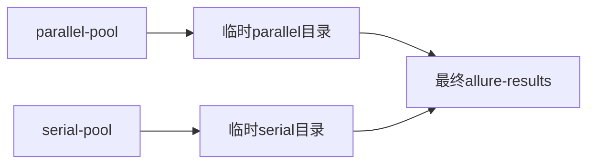

`pool_args()` 会把原 pytest 参数中的 `--alluredir` 替换成当前池临时目录。

最终自定义 `--alluredir` 仍由生命周期保存为合并目标，不会因为池级隔离而丢失。

---

## 7. `merge_pool()`：把池级 raw 汇入最终目录

池执行结束后，`execute_pool()` 会在 `finally` 中调用：

```text
allure_lifecycle.merge_pool(stage_id)
```

这意味着即使 `pytest.main()` 抛出普通异常，生命周期仍会尝试保存该池已经产生的 raw 证据。

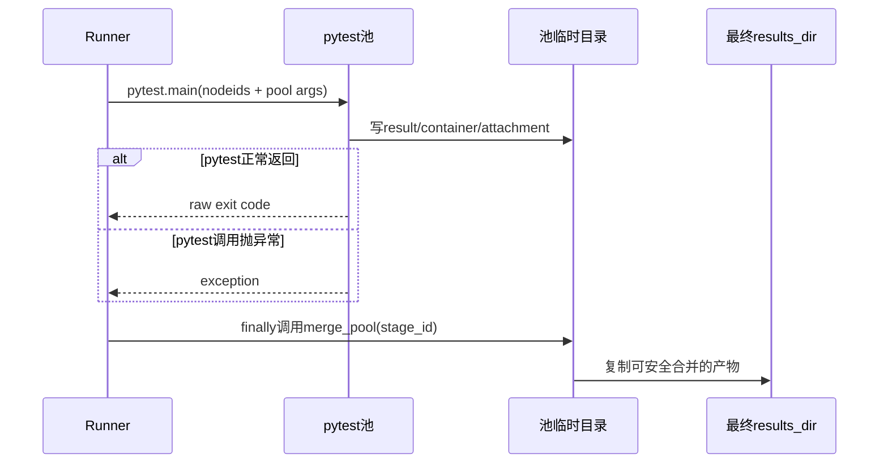

### 7.1 为什么 `merge_pool()` 要幂等

`_merged_pools` 记录已经处理过的 `stage_id`。同一个池重复调用时直接返回，避免：

- 重复复制附件。
- 重复报告冲突。
- 生命周期重入导致状态不确定。

幂等不代表任何阶段都可以随意重复调用，而是为异常清理和调用方防御提供稳定边界。

### 7.2 三类文件处理

| 情况 | 判断 | 处理 |
| --- | --- | --- |
| 最终目录不存在同名项 | `target.exists() == False` | 复制文件或目录 |
| 同名且内容完全相同 | 文件大小相同且 SHA-256 相同 | 视为重复证据，不再复制 |
| 同名但类型或内容不同 | 无法证明为同一文件 | 标记冲突，保留池目录 |

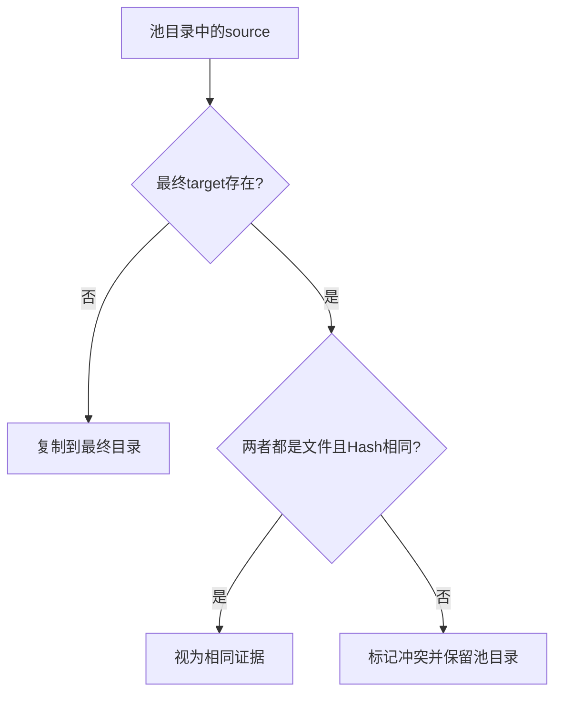

### 7.3 为什么不能自动覆盖冲突

如果两个池产生同名但不同内容的 raw 文件，自动覆盖会破坏证据：

- 后复制的文件会隐藏前一个文件。
- 无法判断哪份内容来自哪个池。
- HTML 页面可能基于被污染的混合输入生成。

因此当前实现选择“保守失败”：记录冲突，保留临时池目录，等待人工核对。

这符合证据系统的第一性原则：

> 不能证明等价时，不做破坏性合并。

---

## 8. 临时目录为什么有时删除、有时保留

`finalize()` 的 `finally` 中存在清理条件：

```text
存在临时根目录，并且没有发现冲突
→ 删除整个临时根目录
```

如果 `_has_conflict=True`，临时根目录会被保留。

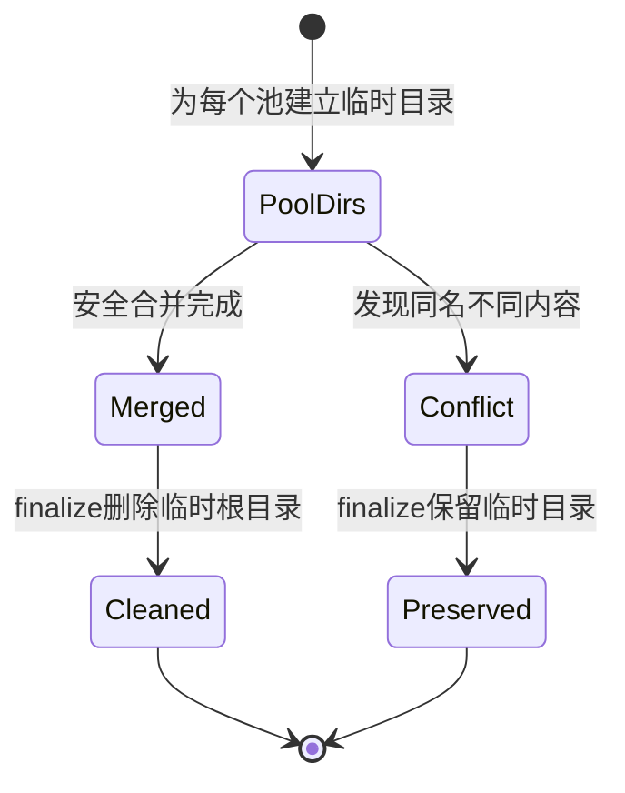

这里的保留不是垃圾文件泄漏，而是有意留下冲突证据。

判断临时目录是否应该删除时，不能只问“运行结束了吗”，还要问：

> 最终目录是否已经无损接收了所有池级证据？

---

## 9. `finalize()`：展示生成是可选旁路

`finalize()` 也只执行一次，内部按顺序判断：

1. 是否开启 HTML 生成。
2. 是否能找到 Allure CLI。
3. HTML 命令是否成功。
4. 是否开启 history 生成。
5. history 命令是否成功。
6. 更新 `latest` 并执行保留策略。

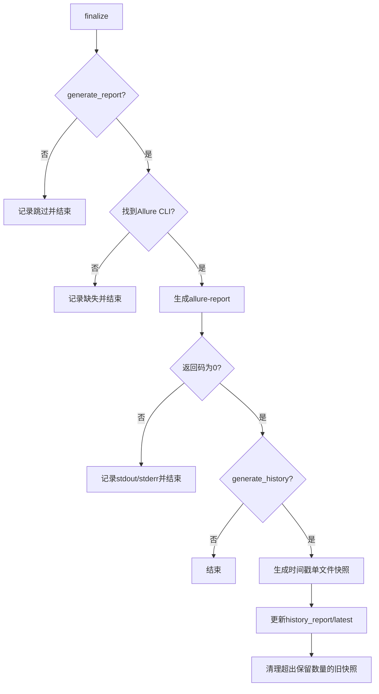

### 9.1 HTML 命令是什么

标准 HTML 生成等价于：

```text
allure generate <results_dir> -o <allure-report> --clean
```

代码通过 `subprocess.run(..., check=False)` 获取返回码、标准输出和标准错误，而不是让 CLI 异常直接覆盖 pytest 退出事实。

### 9.2 找不到 Allure CLI 会怎样

查找顺序是：

1. `node_modules/.bin/allure.cmd`
2. `node_modules/.bin/allure`
3. 系统 `PATH` 中的 `allure`

如果都找不到，只记录：

```text
Allure CLI not found; skipped HTML report generation.
```

raw 结果仍然可以存在，Runner 的退出码也不会因此被改写。

### 9.3 Java 环境如何处理

Allure CLI 依赖 Java。`build_allure_env()` 先使用当前 `PATH`；如果当前找不到 Java，再尝试搜索常见的 JBR/JRE/JDK 位置并临时补入子进程环境。

这个动作只影响 Allure 子进程，不负责修改系统永久环境变量。

### 9.4 fail-open 的准确边界

fail-open 不是“报告失败不重要”，而是：

- 不用报告异常替换 pytest 业务异常。
- 不用页面生成失败伪造测试失败。
- 仍通过 reporter 输出缺失、返回码和错误信息。
- 后续应由报告完整性或 CI 发布阶段处理。

---

## 10. history：当前实现保存的是什么

当前 `history_report/` 保存的是**每轮当前 raw 结果生成的单文件报告快照**，不是把历史数据反向注入本轮 pytest 执行。

目录形态类似：

```text
history_report/
├─ 20260809_210000/
│  └─ index.html
├─ 20260810_210000/
│  └─ index.html
└─ latest/
   └─ index.html
```

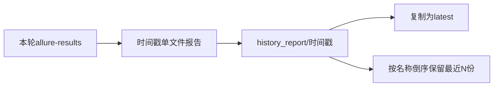

### 10.1 `latest` 是副本，不是符号链接合同

`update_latest_history_report()` 会先删除已有 `latest`，再通过 `copytree()` 复制最新快照。

因此课程中不要把 `latest` 描述成符号链接。

### 10.2 保留策略

`cleanup_old_history_reports()`：

- `keep_limit < 1` 时不删除任何历史目录。
- 排除 `latest`。
- 只处理普通目录，不处理符号链接目录。
- 按目录名倒序排列，删除超过限制的旧快照。

时间戳格式为 `YYYYMMDD_HHMMSS`，因此名称倒序与时间倒序在正常命名下保持一致。

### 10.3 不要混淆三种“历史”

| 名称 | 当前课程含义 |
| --- | --- |
| `history_report/<timestamp>` | 某轮生成的单文件展示快照 |
| `history_report/latest` | 最新快照的复制目录 |
| Allure 内建趋势数据 | 另一类 Allure history 数据机制，本课当前实现未把它作为主线 |

---

## 11. Runner 与直接 pytest：双入口怎样保持单一所有者

仓库支持两种执行方式：

```text
python run_master.py ...
python -m pytest ...
```

两种入口都需要 Allure 生命周期，但同一轮只能有一个所有者。

### 11.1 Runner 路径

Runner 自己创建 `AllureRunLifecycle(pooled=True)`：

```text
runner.run()
→ allure_lifecycle.prepare()
→ 每个池使用pool_args()
→ execute_pool()
→ merge_pool()
→ runner finally调用finalize()
```

在每次内部 `pytest.main()` 调用期间，Runner 临时设置：

```text
API_CASE_RUNNER_MANAGED_ALLURE=1
```

`module/conftest.py` 看到该标记后，不再创建第二个生命周期。

### 11.2 直接 pytest 路径

直接运行 pytest 时，没有 Runner 外层所有者。

`module/conftest.py` 在 `pytest_sessionstart` 中：

1. 读取 `--alluredir`。
2. 创建 `AllureRunLifecycle(pooled=False)`。
3. 调用 `prepare()`。

在 `pytest_sessionfinish` 中调用 `finalize()`。

### 11.3 还会跳过哪些情况

`_skip_direct_allure_lifecycle()` 在三种情况下跳过直接生命周期：

| 条件 | 原因 |
| --- | --- |
| 当前是 xdist worker | worker 不应各自清理和生成全局报告 |
| `collect-only` | 只收集，不应产生报告副作用 |
| Runner 管理环境标记为 `1` | 外层 Runner 已是生命周期所有者 |

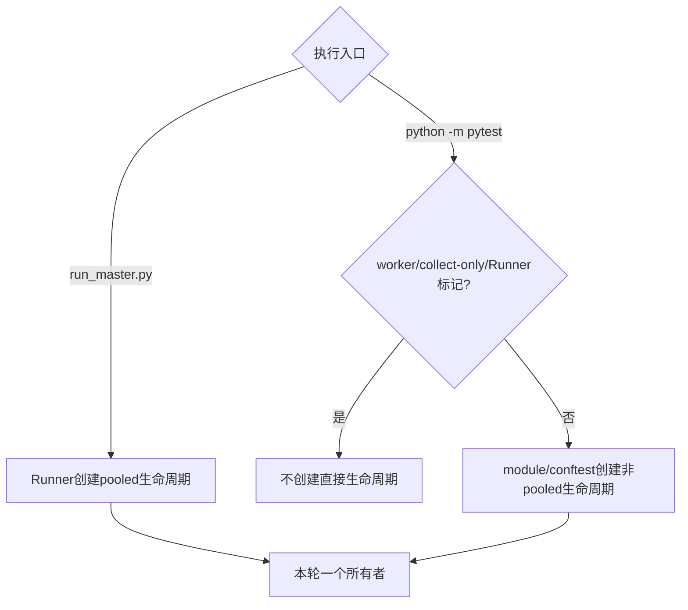

### 11.4 为什么不能让两边都清理

如果 Runner 与 `module/conftest.py` 都执行 `prepare()`：

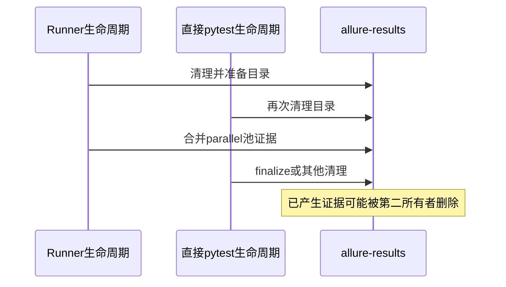

这就是单一所有者设计要消除的核心冲突。

---

## 12. 五类产物的职责边界

### 12.1 JUnit XML

主要回答：

- 哪些测试用例通过、失败、跳过或错误。
- 失败详情是什么。
- CI 或 Quality 后续如何读取用例级机器事实。

它不负责保存 Allure 步骤树和附件文件。

### 12.2 Allure raw

位于 `allure-results/` 或自定义 `--alluredir`，常见内容包括：

- `*-result.json`
- `*-container.json`
- `*-attachment.txt`
- 图片或其他附件

它是 Allure 页面生成输入，不是可直接发布的完整站点。

### 12.3 Allure HTML

位于 `allure-report/`，由 Allure CLI 根据 raw 生成，主要面向人工浏览。

删除 HTML 后，只要 raw 仍在且 CLI 可用，通常可以重新生成；反过来只有 HTML 时，不能把页面可靠还原成完整 raw 事件。

### 12.4 history 快照

位于 `history_report/`，用于保存每轮单文件展示版本和 `latest` 副本。

它服务于历史访问，不应代替本轮 `allure-results/`。

### 12.5 `execution-result.json`

由 Runner 写入，主要回答：

- 本轮目标路径与选择参数。
- 权威计划数量和 nodeid。
- 每个池的状态、原始 pytest 退出码、时间和异常。
- 最终退出码。

它不保存 Allure 步骤、附件内容或 HTML 页面。

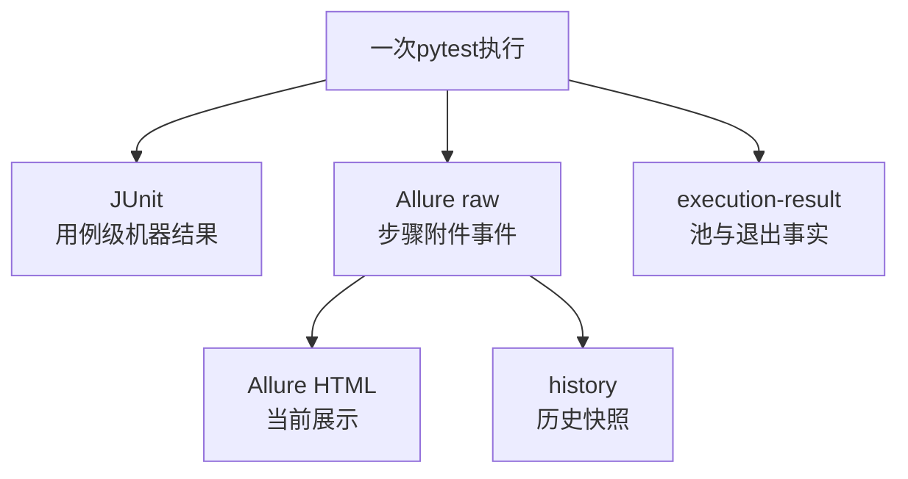

### 12.6 选择证据时先问读者是谁

| 读者 | 首选产物 |
| --- | --- |
| Shell、Runner 调用方 | 最终退出码、`execution-result.json` |
| CI 测试发布器 | JUnit XML |
| 人工排查步骤与附件 | Allure HTML，必要时回到 raw |
| 历史报告查看者 | `history_report/<timestamp>` 或 `latest` |
| 后续质量归并 | JUnit 与 Quality 原始事实，而不是只读 HTML |

---

## 13. 资源所有权与失败边界

| 资源或状态 | 创建/决定者 | 所有者 | 结束点 | 失败是否改写 pytest 退出码 |
| --- | --- | --- | --- | --- |
| 池临时 raw 目录 | `pool_args()` | `AllureRunLifecycle` | 安全合并后清理，冲突时保留 | 否 |
| 最终 raw 目录 | `prepare()` | `AllureRunLifecycle` | 下一轮 prepare 前持续存在 | 否 |
| HTML 报告目录 | Allure CLI | `AllureRunLifecycle` 管理生成 | 下一次 `--clean` 生成 | 否 |
| 时间戳 history | `_generate_history()` | `AllureRunLifecycle` | 保留策略清理 | 否 |
| `latest` | `update_latest_history_report()` | `AllureRunLifecycle` | 下轮替换 | 否 |
| JUnit XML | pytest JUnit 插件 | 对应执行阶段/后续消费者 | 由调用参数和流水线管理 | 其内容反映 pytest，但 Allure 不拥有 |
| Runner 最终退出码 | Runner | 进程调用方 | 进程返回 | 本身就是执行结论 |

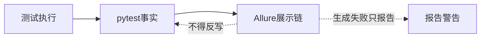

本课最重要的边界是：

> Allure 生命周期拥有报告文件系统副作用，但不拥有 pytest 执行结论。

---

## 14. 最小源码阅读路线

按“入口 → 生命周期 → 池调用点 → 测试证据”读取，不要先遍历全部报告目录。

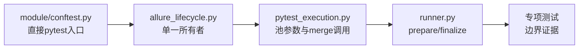

### 第一步：读 `AllureRunLifecycle` 字段

先定位：

- `results_dir`
- `report_dir`
- `history_root`
- `pooled`
- `_pool_dirs`
- `_merged_pools`
- `_has_conflict`
- `_temp_root`

给每个字段标注“配置、运行状态还是资源路径”。

### 第二步：按四个公开动作阅读

```text
prepare()
pool_args(stage_id, pytest_args)
merge_pool(stage_id)
finalize()
```

阅读时不要跳进所有辅助函数；先写出每个动作的输入、输出和副作用。

### 第三步：追 Runner 调用点

查看：

- `runner.py` 中 `prepare()` 和 `finalize()` 的位置。
- `pytest_execution.execute_pool()` 中 `pool_args()` 和 `merge_pool()` 的位置。
- `_runner_managed_allure_environment()` 怎样临时设置环境标记。

### 第四步：追直接 pytest 调用点

查看 `module/conftest.py`：

- `pytest_sessionstart()`。
- `pytest_sessionfinish()`。
- `_skip_direct_allure_lifecycle()`。
- `_get_allure_results_dir()`。

### 第五步：用测试锁定边界

- `tests/test_allure_run_lifecycle.py`
- `tests/test_allure_history_report.py`

注意测试通过替身模拟 Allure CLI，所以它证明生命周期编排，不证明当前机器一定安装了真实 CLI。

---

## 15. 离线实践：观察 raw、入口和生命周期

以下命令均在仓库根目录执行，使用离线黄金用例，不访问外部接口。

### 实验一：运行 Allure 生命周期专项测试

```powershell
.\.venv\Scripts\python.exe -m pytest `
  tests/test_allure_run_lifecycle.py `
  tests/test_allure_history_report.py `
  -q
```

当前仓库预期：

```text
5 passed
```

主要验证：

- parallel 与 serial 使用不同临时目录。
- 两个池的 raw 能合并到自定义最终目录。
- HTML 和 history 生成各调用一次。
- `latest` 被正确更新。
- history 保留策略不会误删 `latest`。
- 两种 `--alluredir` 语法都能解析。

### 实验二：直接 pytest 路径

```powershell
Remove-Item Env:API_CASE_RUNNER_MANAGED_ALLURE -ErrorAction SilentlyContinue
$env:QUALITY_ENABLE = '0'
$env:GENERATE_ALLURE_REPORT = 'FALSE'
$env:GENERATE_HISTORY_REPORT = 'FALSE'

.\.venv\Scripts\python.exe -m pytest `
  .\module\offline_framework_example\test_full_framework_flow.py `
  -q
```

预期关键输出：

```text
Allure raw results cleaned: ...\allure-results
1 passed
Allure HTML report generation skipped by GENERATE_ALLURE_REPORT=FALSE.
```

这里的 `prepare()` 与 `finalize()` 来自 `module/conftest.py` 创建的非 pooled 生命周期。

查看 raw 类型数量：

```powershell
Get-ChildItem .\allure-results -File |
  Group-Object {
    if ($_.Name -like '*-result.json') { 'result' }
    elseif ($_.Name -like '*-container.json') { 'container' }
    elseif ($_.Name -like '*-attachment.*') { 'attachment' }
    else { 'other' }
  } |
  Select-Object Name, Count
```

至少应存在一个 `result`。附件和 container 数量取决于用例、fixture 与 Allure 插件行为，不应硬编码成永久值。

读取一个 result 文件的核心字段：

```powershell
$resultFile = Get-ChildItem .\allure-results -Filter '*-result.json' |
  Select-Object -First 1

$raw = Get-Content $resultFile.FullName -Raw -Encoding UTF8 |
  ConvertFrom-Json

$raw | Select-Object name, status, start, stop
$raw.steps | Select-Object name, status
$raw.attachments | Select-Object name, source, type
```

### 实验三：Runner 路径

```powershell
$env:QUALITY_ENABLE = '0'
$env:GENERATE_ALLURE_REPORT = 'FALSE'
$env:GENERATE_HISTORY_REPORT = 'FALSE'

.\.venv\Scripts\python.exe .\run_master.py `
  .\module\offline_framework_example\test_full_framework_flow.py `
  -q
```

预期只看到一次 raw 清理消息。原因是 Runner 已经拥有 pooled 生命周期，内部 pytest 通过环境标记跳过 `module/conftest.py` 的直接生命周期。

运行后同时存在两类不同机器事实：

```powershell
Get-ChildItem .\allure-results -File | Select-Object Name, Length
Get-Content .\reports\execution-result.json -Raw -Encoding UTF8
```

对照回答：

| 问题 | 查看位置 |
| --- | --- |
| 用例步骤和附件是什么 | `allure-results/*-result.json` 与附件文件 |
| Runner 执行了哪个池 | `reports/execution-result.json` |
| pytest 原始退出码是多少 | `pool_results[].raw_pytest_exit_code` |
| HTML 是否生成 | `allure-report/` 与控制台生命周期消息 |

### 实验四：观察池参数改写

```powershell
@'
from pathlib import Path
from run_orchestration.allure_lifecycle import replace_allure_results_args

original = [
    "-q",
    "--alluredir",
    "custom-results",
    "--clean-alluredir",
]

rewritten = replace_allure_results_args(original, Path("pool-results"))
print("original =", original)
print("rewritten =", rewritten)
'@ | .\.venv\Scripts\python.exe -
```

预期关系：

- 原参数列表不被原地修改。
- 旧 `--alluredir` 两种形式会被移除。
- 旧 `--clean-alluredir` 会被移除。
- 最后追加当前池目录和一个 `--clean-alluredir`。

这保证每个池只清理自己的临时 raw 目录，而不是清理最终合并目录。

---

## 16. 故障排查：先判断是哪一类产物失败

### 情况一：pytest 通过，但没有 HTML

按顺序检查：

1. `GENERATE_ALLURE_REPORT` 是否为 `FALSE`。
2. 控制台是否显示 `Allure CLI not found`。
3. `node_modules/.bin/allure.cmd` 或系统 `allure` 是否存在。
4. Java 是否可用。
5. `allure-results/` 是否有 raw 文件。

如果 raw 存在、pytest exit 为 0，只能说明展示生成失败，不能改写成测试失败。

### 情况二：HTML 生成了，但内容为空

优先检查：

- 生成时使用的 `results_dir` 是否正确。
- 是否在 pytest 写 raw 之前调用了生成命令。
- 池级 raw 是否成功 merge 到最终目录。
- 最终目录是否只剩附件而没有 `*-result.json`。

不要先删除所有目录重跑；先保存当前 raw 作为证据。

### 情况三：parallel 有结果，serial 结果不见了

检查：

- 两个池的 `pool_args()` 是否得到不同目录。
- `merge_pool("serial-pool")` 是否被调用。
- 是否发生同名不同内容冲突。
- 临时 `.allure-run-*` 目录是否因冲突被保留。

### 情况四：临时目录没有被清理

可能是正常保护行为。

搜索控制台：

```text
Allure artifact conflict preserved in pool directory
```

如果存在冲突，先比较最终目录和池目录中的同名文件，不要直接删除证据。

### 情况五：每个 xdist worker 都在清理目录

这通常说明直接生命周期跳过条件失效。检查：

- worker 是否具有 `workerinput`。
- 插件是否加载了正确的 `module/conftest.py`。
- 是否绕过了项目公开入口并自行复制生命周期代码。

正确设计下，worker 只产生当前 worker 的 raw，不拥有全局清理和 HTML 生成。

### 情况六：直接 pytest 出现两次清理或两次 finalize

检查环境中是否错误保留了外部封装，或者有第二个插件也创建了生命周期。

Runner 内部 pytest 应设置 `API_CASE_RUNNER_MANAGED_ALLURE=1`；真正直接 pytest 则不应手工设置该变量，否则 `module/conftest.py` 会跳过生命周期。

### 情况七：history 把 `latest` 删除了

当前清理函数明确排除 `latest`。如果仍被删除，检查是否有外部脚本直接清空 `history_report/`，不要把问题归因于 `cleanup_old_history_reports()`。

### 情况八：Allure 错误覆盖了业务异常

当前生命周期方法内部会捕获普通异常并通过 reporter 输出。若调用方出现“只看到 Allure 异常、原业务异常丢失”，说明可能绕过了现有 fail-open 方法或在业务路径中直接调用了 `subprocess.run(check=True)`。

---

## 17. 练习与参考答案

### 练习一：五类产物

需求是“CI 需要知道哪个用例失败，并展示失败栈”。首选读取什么？

**参考答案**：优先使用 JUnit XML。Allure HTML适合人工查看，但 CI 用例结果发布应依赖稳定机器格式；`execution-result.json` 只提供池级退出事实，不含完整用例失败栈。

### 练习二：池级目录

为什么 parallel 与 serial 不直接写同一个 `allure-results/`？

**参考答案**：并发写同一目录会让清理、同名文件、半写入文件和生命周期所有权变得不可控。当前设计先隔离写入，再由单一所有者合并。

### 练习三：重复文件

两个池都出现 `same-attachment.txt`，大小和 SHA-256 完全相同。应该报冲突吗？

**参考答案**：不需要。当前实现把它视为相同证据，保留最终目录已有文件即可。

### 练习四：冲突文件

两个池出现同名 `result.json`，内容不同。为什么不把第二个改名后自动合并？

**参考答案**：自动改名可能破坏 Allure raw 内部引用关系，也会隐藏生成器本应保证唯一性的缺陷。当前实现选择标记冲突并保留池目录，等待核对。

### 练习五：HTML 失败

pytest 返回 0，`execution-result.json` 也为 final 0，但 Allure CLI 返回非零。最终测试结果是什么？

**参考答案**：测试执行成功，报告展示生成失败。两条事实都要记录，不能互相覆盖。

### 练习六：直接 pytest 所有者

直接执行 `python -m pytest`，不是 worker、不是 collect-only，也没有 Runner 环境标记。谁管理 Allure 生命周期？

**参考答案**：`module/conftest.py` 在 sessionstart 创建非 pooled `AllureRunLifecycle`，在 sessionfinish finalize。

### 练习七：Runner 内部 pytest

为什么 Runner 内部调用 pytest 时，`module/conftest.py` 不再创建生命周期？

**参考答案**：Runner 在调用期间设置 `API_CASE_RUNNER_MANAGED_ALLURE=1`，告诉插件外层已有单一所有者，避免双重清理和双重生成。

### 练习八：history 保留

`keep_limit=2`，目录中有三个时间戳快照和 `latest`。清理后保留什么？

**参考答案**：保留名称最新的两个时间戳目录和 `latest`；删除最旧时间戳目录。

---

## 18. 当日验收清单

- [ ] 能区分 JUnit、Allure raw、HTML、history 与 `execution-result.json`。
- [ ] 能解释 raw 是 HTML 输入，而不是 HTML 本身。
- [ ] 能画出 `prepare → pool_args → merge_pool → finalize`。
- [ ] 能解释 pooled 与 non-pooled 生命周期差异。
- [ ] 能说明为什么两个池使用不同 raw 目录。
- [ ] 能解释相同 Hash 文件为何忽略、冲突文件为何保留。
- [ ] 能说明 `_has_conflict` 为什么阻止临时目录清理。
- [ ] 能解释 Runner 与直接 pytest 怎样避免双重所有者。
- [ ] 能说明 collect-only 和 xdist worker 为什么跳过直接生命周期。
- [ ] 能运行 Allure 生命周期专项测试。
- [ ] 能运行离线用例并找到至少一个 `*-result.json`。
- [ ] 能从 raw JSON 找到用例名称、状态、步骤或附件引用。
- [ ] 能说明 HTML/history 失败为什么不改写 pytest 退出码。
- [ ] 能解释 `latest` 是复制目录而不是必须为符号链接。

如果无法回答“当前失败发生在执行事实、raw 生成、合并、HTML 生成还是 history 管理”，说明仍在用“报告坏了”这个模糊词，需要回到职责矩阵重新定位。

---

## 19. 本课完整因果链

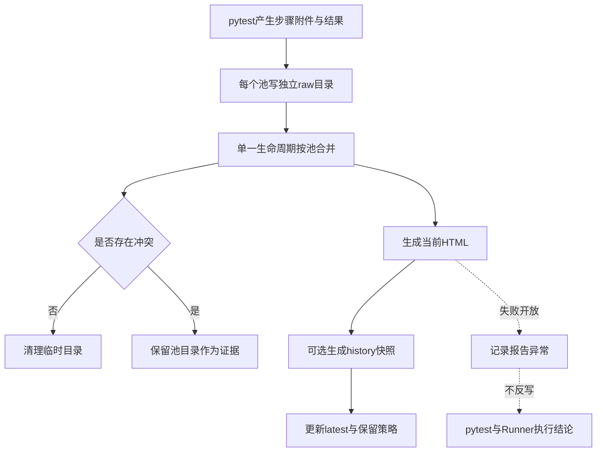

---

## 20. 向 Day 18 的桥梁

Day 17 已经把执行事实和展示产物分开：

```text
pytest/Runner决定执行结论
Allure生命周期管理展示文件
展示失败不能覆盖执行结论
```

但下一步会出现新问题：

> HTTP、Retry、Polling、SSE 运行过程中产生的细粒度事件，怎样被可选质量系统观察，而不让 `common` 直接依赖 `quality`？

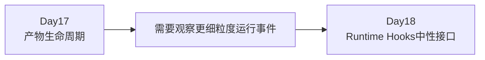

Day 18 不会再增加新的报告目录，它将建立 Protocol、Noop、Provider 和 Lease，使公共能力只发布中性事件。

---

## 21. 一分钟复述模板

> 同一次测试执行会产生不同投影：JUnit 保存用例级机器结果，Allure raw 保存步骤和附件事件，Allure HTML 是 raw 的展示视图，history 保存时间戳快照与 latest，`execution-result.json` 保存 Runner 的计划、池状态和退出码。`AllureRunLifecycle` 是 raw、HTML 和 history 的单一文件系统所有者。Runner 路径使用 pooled 生命周期并通过环境标记阻止内部 pytest 再建所有者；直接 pytest 则由 `module/conftest.py` 管理非 pooled 生命周期。池级 raw 先隔离再合并，无法证明等价的同名文件会保留冲突证据。所有报告生成错误都采用 fail-open，不改写 pytest 执行结论。

能够结合本地 raw 文件和控制台生命周期消息复述这段话，就完成了 Day 17。
