# 第 18 天：运行时观察接口

> **课程定位**：承接 Day 17 已经分离的执行事实与展示产物，解释 `common` 怎样通过中性 Runtime Hooks 发布 HTTP、Retry、Polling 和 SSE 事件，而不依赖任何具体 Quality 实现  
> **Module 层落点**：module 代码只声明中性 `runtime_metadata` 或使用现有 Request/Task 能力，不直接实例化质量采集器  
> **黄金用例边界**：使用离线黄金用例观察事件顺序、上下文传播和资源生命周期，不展开 Quality 如何持久化这些事件  
> **课程形式**：初学者自学课；先建立依赖倒置模型，再理解 Provider 与 Lease，最后用边界测试和离线用例验证  
> **事实依据**：`common/runtime_hooks/`、`common/base_request.py`、`common/request_middleware.py`、`common/streaming.py` 与 Runtime Hooks 专项测试  
> **本课边界**：只讲中性事件的定义、发布和生命周期；Quality 何时安装 Provider、如何写事实从 Day 19、Day 20 开始

---

## 学习目标与前置准备

### 完成本课后，你应该能够

1. 解释为什么 `common` 不能静态导入 `quality`。
2. 区分 `RuntimeHooks`、`NoopRuntimeHooks`、Provider、Lease 与 `RuntimeObserver`。
3. 说明 `ContextVar` Provider 如何绑定、读取和恢复当前 hooks。
4. 解释嵌套 operation 为什么复用父操作而不重复上报。
5. 说明 Provider 切换后，旧 Lease 为什么仍使用开始时的 hooks。
6. 画出 HTTP、Retry、Polling 和 SSE 的中性事件链。
7. 解释 hook 失败为什么不能覆盖业务异常。
8. 说明 Runtime Hooks 只发布事件，不负责 Quality 文件、指标或最终结论。

### 建议前置知识

- 已完成 Day 13，理解 `ContextVar` 与 `submit_with_context()`。
- 已完成 Day 16，知道执行结论有明确所有者。
- 已完成 Day 17，知道旁路报告不能改写业务结果。
- 能阅读 `Protocol`、`dataclass`、`Enum` 与 context manager。

### 本课学习产出

- 一张 common/quality 依赖方向图。
- 一张 Protocol/Noop/Provider/Lease 对象图。
- 一张 HTTP/Retry/Polling/SSE 事件地图。
- 一份 Provider 切换与 Lease 稳定性实验记录。

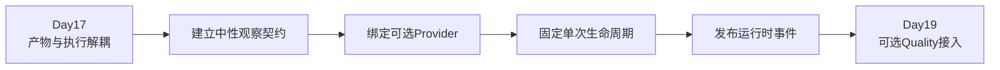

---

## 0. 从 Day 17 接过来的问题

Day 17 已经证明：

- pytest 与 Runner 拥有执行结论。
- Allure 拥有报告文件系统生命周期。
- 报告失败不能覆盖业务结果。

但 Allure 主要描述测试步骤和附件，它不能回答所有运行时问题：

- 一次业务操作包含几个 HTTP attempt？
- Retry 总共等待了多久？
- Polling 看到了哪些状态？
- SSE 是否消费到 `[DONE]`？
- 请求失败发生在网络、状态码还是流式消费阶段？

这些事件发生在 `common` 请求主链中。

新的矛盾是：

> `common` 最了解运行过程，但 Quality 才需要消费质量事件；如果 `common` 直接依赖 Quality，可选能力就会变成主链硬依赖。

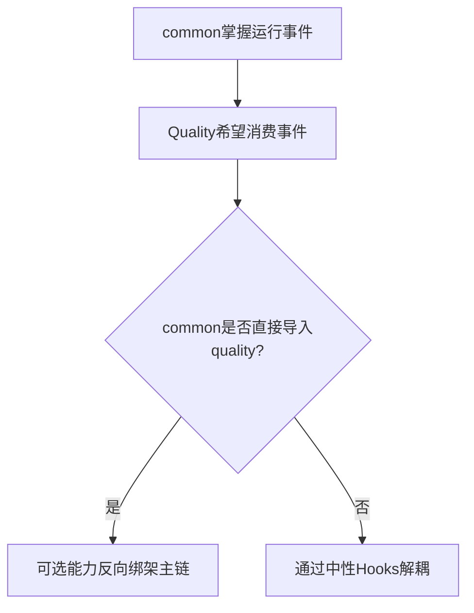

---

## 1. 第一性原理：观察不能拥有控制流

一次请求的最小职责是：

```text
构造请求
→ 发送请求
→ 处理重试或轮询
→ 返回响应或抛出业务异常
```

观察系统只需要知道发生了什么：

```text
操作开始
→ attempt开始/成功/失败
→ retry等待
→ polling状态
→ stream行与终态
→ 操作结束
```

控制与观察必须是单向关系：

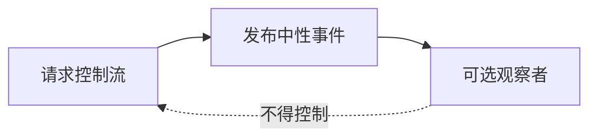

所以 Runtime Hooks 的第一性原则是：

1. 没有观察者时，业务照常运行。
2. 观察者切换时，已开始的操作不能被劫持。
3. 观察者失败时，不能替换业务异常。
4. 中性契约不包含 Quality 文件、表结构或指标术语。

---

## 2. TOC：系统约束是依赖方向

如果直接在 `common/base_request.py` 中调用 Quality Collector，因果链会快速恶化：

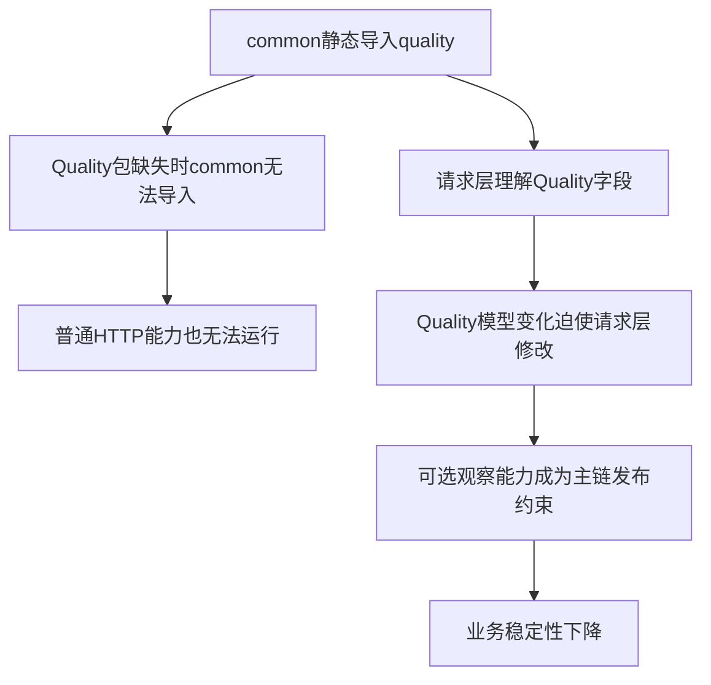

TOC 的解约束方案不是增加更多 `try/except ImportError`，而是改变依赖方向：

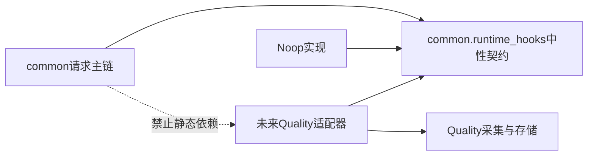

契约必须放在稳定、被依赖的一侧；具体实现依赖契约，而不是契约依赖具体实现。

---

## 3. 五个核心角色

| 角色 | 主要责任 | 不负责什么 |
| --- | --- | --- |
| `RuntimeHooks` | 定义中性事件方法 | 不保存全局当前实现 |
| `NoopRuntimeHooks` | 默认无副作用实现 | 不产生 Quality 文件 |
| Provider | 使用 `ContextVar` 保存当前 hooks | 不拥有单次操作终态 |
| Lease | 固定起始 hooks、native handle 与所有权 | 不决定业务成功失败 |
| `RuntimeObserver` | 为 Request 层封装生命周期调用 | 不拥有 HTTP 控制流 |

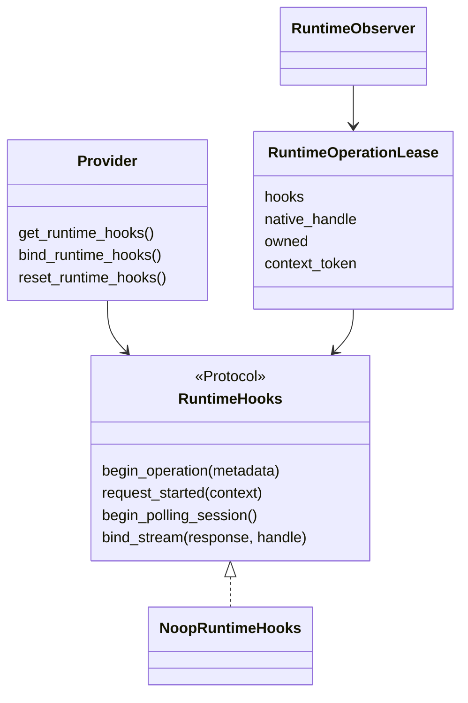

### 3.1 `Protocol` 是结构契约

Provider 实现不必继承某个基类，只要提供协议要求的方法即可。

这使 `common` 可以定义“会发生哪些事件”，而不规定后端把事件写到 JSONL、数据库还是内存。

### 3.2 Noop 是默认能力，不是空值判断

默认 Provider 是共享的 `NoopRuntimeHooks` 实例，而不是 `None`。

调用方因此可以直接发布事件，不需要在每个位置编写：

```text
if quality_enabled:
    ...
```

### 3.3 Provider 管当前实现

Provider 只提供三件事：

- `get_runtime_hooks()`
- `bind_runtime_hooks(hooks)`
- `reset_runtime_hooks(token)`

绑定返回 `ContextVar.Token`，调用方必须在 `finally` 中恢复。

### 3.4 Lease 管一次生命周期

Lease 保存：

- 操作开始时使用的 hooks。
- 后端返回的原生 handle。
- 当前调用是否拥有终结权。
- operation 的 ContextVar token。

Lease 的意义是把“当前 Provider”变成“本次操作固定的 Provider”。

### 3.5 `RuntimeObserver` 是门面

`BaseRequest` 不直接拼装所有底层函数，而是通过 `RuntimeObserver`：

- 规范化 metadata。
- 开始 operation。
- 开始 request group。
- 开始 polling。
- 把 response/error 转成中性 outcome。

它拥有观察生命周期编排，但不发送 HTTP，也不决定 retry/polling 控制流。

---

## 4. 中性模型：只描述运行事实

### 4.1 Operation 类型

`RuntimeOperationKind` 当前包含：

| 值 | 含义 |
| --- | --- |
| `HTTP` | 普通 HTTP 操作 |
| `SSE` | 流式 SSE 操作 |
| `POLLING` | 轮询操作 |
| `ASYNC_TASK` | 更高层异步任务操作 |

### 4.2 流量角色

`RuntimeTrafficRole`：

- `WORKLOAD`：被测业务负载。
- `CONTROL`：控制或辅助流量。
- `UNKNOWN`：调用方未声明。

角色只是中性标签，不直接决定是否计费、是否计入指标或是否失败。

### 4.3 Operation 结果

`RuntimeOperationOutcome` 包含：

- `SUCCESS`
- `FAILED`
- `TIMEOUT`
- `INTERRUPTED`
- `INCOMPLETE`
- `UNKNOWN`

Polling 和 Stream 有各自更细的 outcome 枚举，因为业务状态与总操作状态不是完全相同的问题。

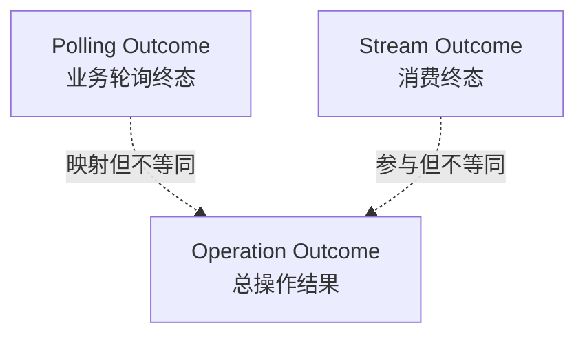

### 4.4 Metadata

`RuntimeOperationMetadata` 只包含：

```text
kind
name
role
model_id
```

它不包含 Quality run_id、数据库主键、文件路径或指标字段。

这正是“中性”的可核验边界。

---

## 5. Provider：为什么使用 `ContextVar`

Provider 定义：

```text
ContextVar[RuntimeHooks]
默认值 = NoopRuntimeHooks
```

### 5.1 基本绑定流程

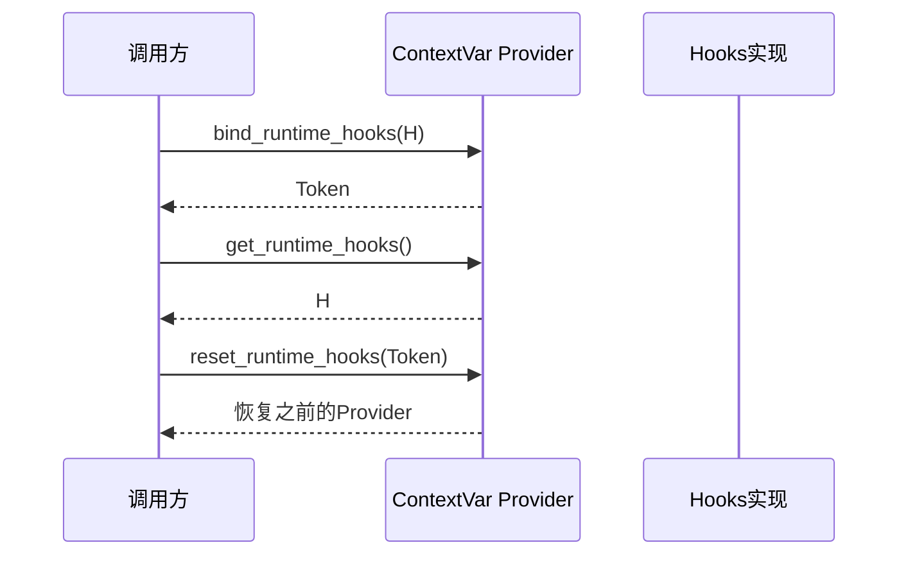

推荐模式：

```python
token = bind_runtime_hooks(hooks)
try:
    run_business_flow()
finally:
    reset_runtime_hooks(token)
```

### 5.2 为什么不用普通全局变量

普通全局变量会让并发任务互相覆盖。

`ContextVar` 提供逻辑上下文隔离，并可通过 Day 13 的 `submit_with_context()` 把提交时绑定传播到线程 worker。

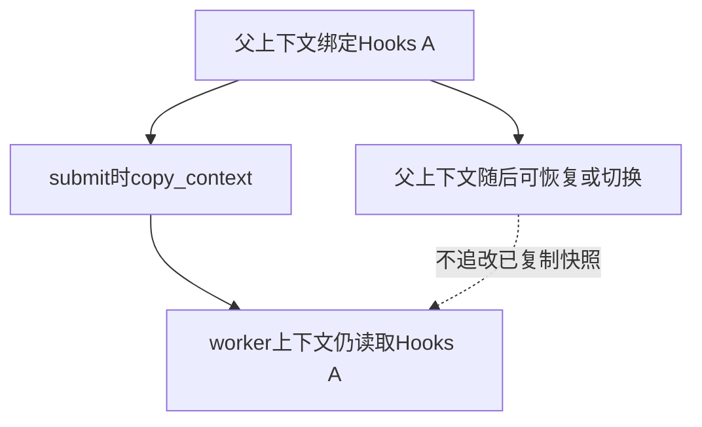

### 5.3 `ContextVar` 不会自动传播到所有并发模型

当前机器证据覆盖：

```text
ThreadPoolExecutor + submit_with_context()
```

不能扩大成任意新线程、子进程或分布式 worker 都自动继承。

### 5.4 Token 必须按作用域恢复

Token 代表“这次 set 之前的状态”。错误顺序恢复会破坏嵌套绑定。

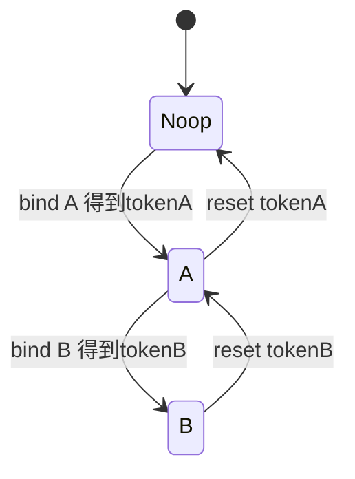

---

## 6. Operation Lease：谁拥有终结权

### 6.1 第一个 operation

`begin_operation()`：

1. 检查当前是否已有 active operation。
2. 没有则读取当前 Provider。
3. 构造 `RuntimeOperationMetadata`。
4. 安全调用 hooks 的 `begin_operation()`。
5. 根据返回的 `RuntimeOperationStart` 创建 Lease。
6. 只有 `owned=True` 才把 Lease 放入 `_ACTIVE_OPERATION`。

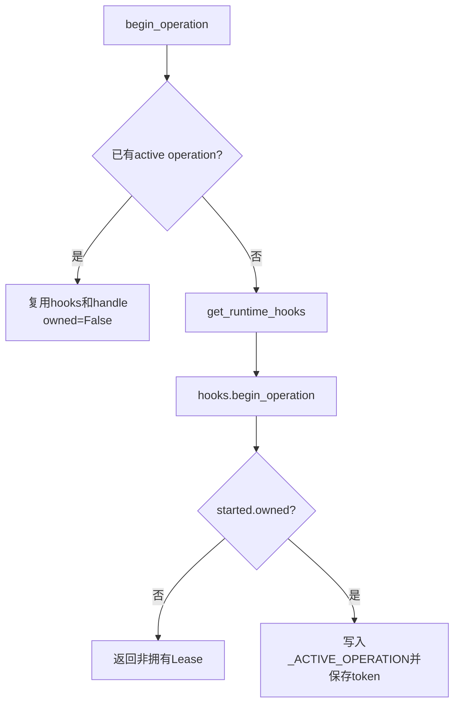

### 6.2 `owned` 的本质

`owned=True` 表示：

> 当前 Lease 创建了后端 operation，因此有权 finish 或 detach。

`owned=False` 表示：

> 当前调用只是复用外层 operation，不能重复发送终态。

### 6.3 嵌套 operation 为什么不重复

例子：外层异步任务中调用一个 HTTP 请求。

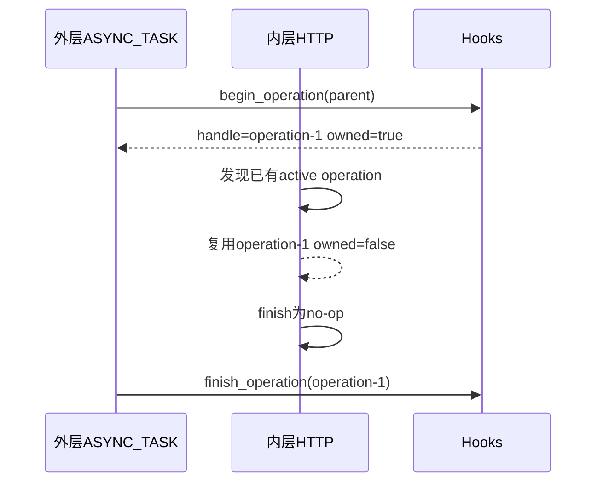

当前专项测试证明，嵌套 operation 只产生一组 begin/finish 事件。

### 6.4 默认 Noop 为什么返回 `owned=False`

Noop 不创建任何后端 operation，所以 `RuntimeOperationStart()` 的默认值是：

```text
native_handle=None
owned=False
```

业务照常运行，也不会建立无意义的 active operation。

---

## 7. Lease 固定起始 Provider

最容易误解的是：

> operation 开始后，如果当前 Provider 被切换，finish 应该交给谁？

答案是：交给开始时的 hooks。

Lease 直接保存 `hooks`，finish 调用的是：

```text
lease.hooks.finish_operation(...)
```

而不是再次执行 `get_runtime_hooks()`。

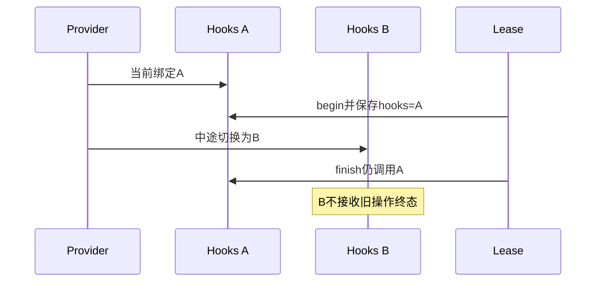

如果 finish 使用当前 Provider，会产生“在 A 开始、在 B 结束”的孤儿事件。

### 7.1 active operation 也固定 Provider

`get_active_runtime_hooks()` 优先返回 active Lease 的 hooks；只有没有 active operation 时才读取当前 Provider。

这保证 operation 内部的 model id 推断、request group 和 polling 等子事件保持同一观察后端。

### 7.2 结束与 detach

- `finish_operation()`：发送终态并恢复 active operation token。
- `detach_operation()`：把 operation 生命周期移交给更长寿命对象，然后恢复 active token。

detach 主要服务于 SSE：请求函数返回 response 后，流式消费仍未结束。

---

## 8. HTTP：operation、request group 与 attempt 是三层

一次普通无重试请求包含：

```text
一个HTTP operation
一个request group
一个RequestContext attempt
```

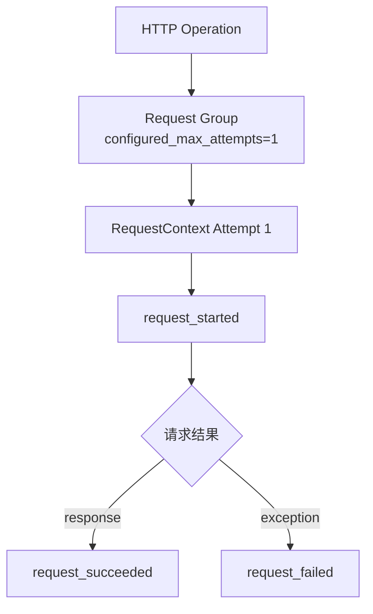

### 8.1 operation 层

`BaseRequest.request()`：

1. 根据 `stream` 决定 `HTTP` 或 `SSE`。
2. 规范化 metadata。
3. 开始 operation。
4. 执行业务请求。
5. response 或 error 结束 operation。

### 8.2 request group 层

无重试时，`_send_single_group()` 创建 max attempts 为 1 的 group。

group 回答：

- method/path/protocol 是什么。
- 配置的最大 attempt 数是多少。
- 哪些 RequestContext 属于同一业务请求组。
- Retry 总等待时间是多少。

### 8.3 attempt 层

`RuntimeObservationMiddleware` 在每个 RequestContext 上发布：

- `request_started(context)`
- `request_succeeded(context, response)`
- `request_failed(context, error)`

### 8.4 为什么把 hooks 保存进 RequestContext

`observe_request_started()` 会把当前 hooks 写入：

```text
context.attributes["runtime_observation_hooks"]
```

成功或失败时优先使用这个已保存的 hooks。

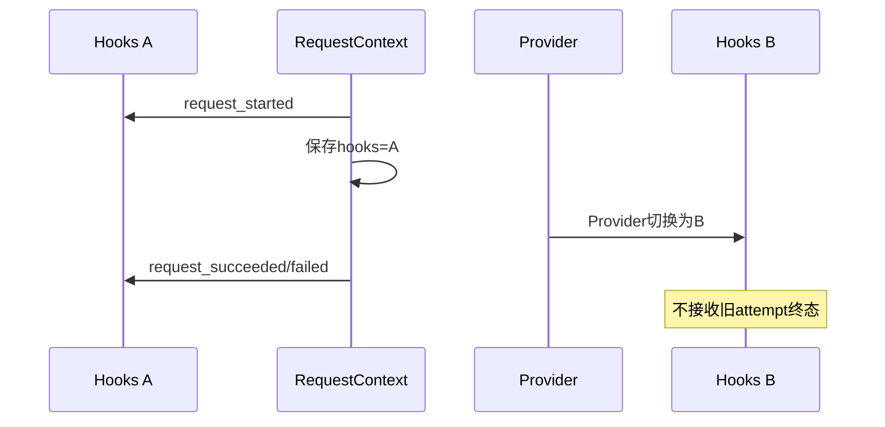

这与 Operation Lease 的原则相同：生命周期必须在同一个后端闭合。

---

## 9. Retry：多个 attempt 共享一个 request group

有重试时：

```text
一个 operation
→ 一个 request group
→ 多个 RequestContext attempt
```

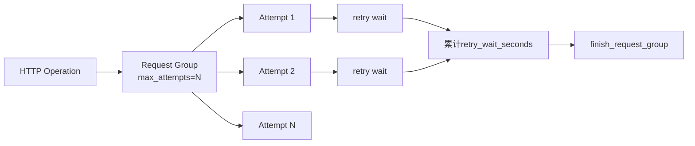

`context_factory(attempt_index)` 为每个 attempt：

- 构建新的 RequestContext。
- 写入 `attempt_index`。
- 写入 `max_attempts`。
- 绑定到同一个 request group。

Retry Executor 的 `on_wait` 回调进入 `group.add_retry_wait()`，只累计非负等待时间。

最终 `group.finish()` 在 `finally` 中执行，所以无论成功、失败还是 deadline 异常，group 都有关闭机会。

本课只定义这些中性事件；等待时间最终是否形成指标由后续 Provider 决定。

---

## 10. Polling：业务终态与总操作终态同时存在

Polling 比普通 HTTP 多一层会话：

```text
Polling Operation
→ Polling Session
→ 多轮GET Request Group/Attempt
```

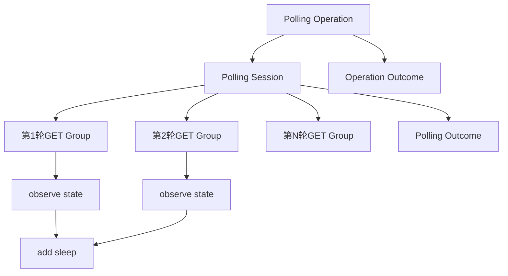

### 10.1 两套 outcome 映射

| Polling 异常 | Polling Outcome | Operation Outcome |
| --- | --- | --- |
| 正常成功 | `SUCCESS` | `SUCCESS` |
| `PollingFailedError` | `FAILURE` | `FAILED` |
| `PollingUnknownStateError` | `UNKNOWN` | `UNKNOWN` |
| `PollingTimeoutError` | `TIMEOUT` | `TIMEOUT` |
| `KeyboardInterrupt/SystemExit` | `INTERRUPTED` | `INTERRUPTED` |
| 其他异常 | `FAILURE` | 按通用错误映射 |

### 10.2 为什么要两套结果

Polling Session 回答“轮询业务怎样结束”；Operation 回答“整体操作怎样结束”。

今天它们大多一起映射，但分开建模避免未来把业务状态和操作结果硬编码成同一枚举。

### 10.3 状态与睡眠事件

每轮 response 被策略评估后发布状态字符串；实际 sleep 在 `finally` 中记录测得时长，而不是只记录计划 sleep 值。

这仍然是中性事实，不在 `common` 中计算成功率、P95 或 SLA。

---

## 11. SSE：为什么需要 detach 与 Stream Lease

普通 HTTP 在 `request()` 返回前已经结束。

SSE 不同：

```text
请求函数返回Response
≠ 流式消费结束
```

### 11.1 成功建立流时

当 response 为 2xx 且 `stream=True`：

1. 把 operation handle 绑定到 response。
2. 创建 `RuntimeStreamLease`。
3. 将 Lease 保存在 response 属性中。
4. detach operation，恢复 active ContextVar。
5. 后续迭代器继续使用 response 上的 Stream Lease。

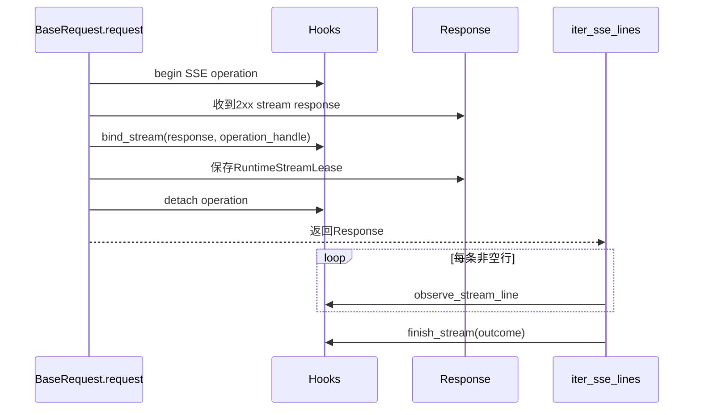

### 11.2 Provider 恢复后为什么仍可结束旧流

Stream Lease 保存 operation 开始时的 hooks。即使请求函数返回后 Provider 被恢复，迭代器仍调用原 hooks。

专项测试明确证明：

```text
begin → bind-stream → detach → stream-line → stream-finish
```

全部进入起始 Provider。

### 11.3 流终态

`iter_sse_lines()` 当前映射：

| 情况 | Stream Outcome |
| --- | --- |
| 看到精确 `data: [DONE]` | `COMPLETE` |
| 正常耗尽但未看到 DONE | `INTERRUPTED` |
| 消费者提前关闭 generator | `INTERRUPTED` |
| `KeyboardInterrupt/SystemExit` | `INTERRUPTED` |
| 其他 BaseException | 先报告 `ERROR`，finally 还可能再报告 `INTERRUPTED` |

最后一行非常重要：当前底层 Stream Lease 没有 `_finished` 防重状态，因此不能声称异常路径严格只发布一次终态。

这是现有实现边界，不应在课程中美化成“exactly once”。

---

## 12. fail-open：观察失败不能替换业务失败

生命周期工具通过两类安全调用：

- `_safe_call()`：异常时返回，不产生结果。
- `_safe_result()`：异常时返回默认值。

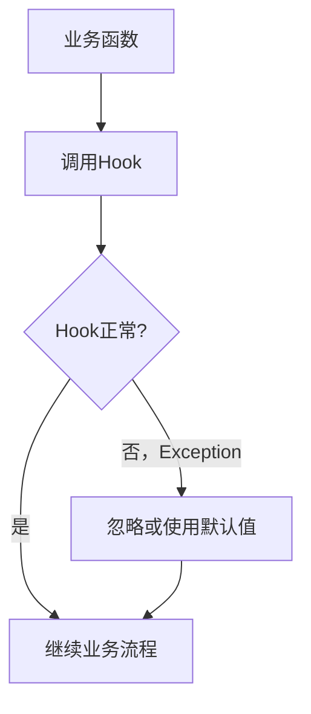

专项测试构造了一个 `finish_operation()` 会抛 `RuntimeError` 的 Hooks，并在 operation_scope 内抛出业务 `ValueError`。

最终保留的是：

```text
ValueError("business failed")
```

而不是观察者异常。

### 12.1 fail-open 不等于吞掉所有对象

安全函数捕获的是 `Exception`，不捕获所有 `BaseException`。

另外，Provider 的 `bind/reset` 也不是安全调用；作用域管理错误应暴露给调用方。

### 12.2 默认结果怎样降级

如果 `hooks.begin_operation()` 抛普通异常：

```text
_safe_result → RuntimeOperationStart()
→ owned=False
→ 后续finish为no-op
```

业务仍继续，但本次观察可能缺失。Day 20 会学习如何把部分采集失败转成 Integrity 事实。

---

## 13. 依赖边界如何被机器证明

课程不能只说“设计上解耦”，仓库有两类机器证据。

### 13.1 AST 静态导入检查

`test_common_has_no_static_quality_imports()` 遍历 `common/**/*.py` 的 AST，检查所有 `import` 与 `from ... import ...`。

只要出现：

```text
import quality
from quality... import ...
```

测试就会失败。

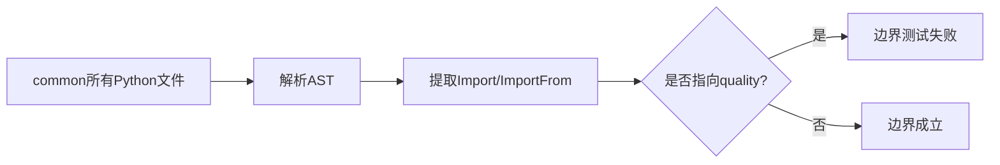

### 13.2 Quality 完全不可导入时的运行检查

另一个测试安装自定义 import finder，主动阻止所有 `quality` 导入，然后：

- 导入 `BaseRequest`。
- 导入 `BaseTask`。
- 导入 `iter_sse_lines`。
- 用替身 response 执行一次普通 GET。

结果必须正常，并且 `sys.modules` 中没有任何 Quality 模块。

这比“当前配置关闭 Quality”更强，因为它证明 Quality 包完全不可用时，common 主链仍可工作。

### 13.3 边界测试不证明什么

它不证明：

- 任意第三方 module 都没有导入 Quality。
- Quality Provider 本身一定正确。
- 所有事件都已持久化。

它只证明 common 的依赖方向和无 Quality 基础运行能力。

---

## 14. 并发上下文：Provider 传播与资源隔离

`RuntimeHooks` Provider 使用 ContextVar，因此可以被 `copy_context()` 捕获。

`submit_with_context()` 的实现是：

```text
context = copy_context()
executor.submit(context.run, function, ...)
```

```mermaid
sequenceDiagram
    participant M as 主线程
    participant C as copy_context
    participant W as Worker
    M->>M: bind Hooks A
    M->>C: submit_with_context
    C->>W: context.run(function)
    W->>W: get_runtime_hooks() == A
    M->>M: finally reset Token
```

### 14.1 传播的是什么

传播的是 ContextVar 绑定快照，不是 hooks 对象的深复制。

Worker 与父上下文可能引用同一个 hooks 实例，因此 Provider 隔离不自动等于实现内部线程安全。

### 14.2 Lease 与 ContextVar 是两层保护

- ContextVar 决定操作开始时选择哪个 Provider。
- Lease 决定操作结束时回到哪个 Provider。

没有 ContextVar，并发任务会选错起点；没有 Lease，中途切换会选错终点。

---

## 15. 四条真实调用链

### 15.1 普通 HTTP

```mermaid
sequenceDiagram
    participant B as BaseRequest
    participant O as RuntimeObserver
    participant G as RequestGroup
    participant M as RuntimeObservationMiddleware
    participant H as Hooks
    B->>O: start_operation(HTTP metadata)
    B->>O: start_request_group(max=1)
    O->>G: 创建group lease
    G->>M: bind RequestContext
    M->>H: request_started
    alt response
        M->>H: request_succeeded
        B->>H: finish_operation SUCCESS/FAILED by status
    else exception
        M->>H: request_failed
        B->>H: finish_operation error outcome
    end
```

2xx response 映射 operation `SUCCESS`，非 2xx response 映射 `FAILED`。这只是观察结果，不改变 BaseRequest 返回 response 的原控制逻辑。

### 15.2 Retry

```mermaid
flowchart LR
    O[一个HTTP Operation] --> G[一个Request Group]
    G --> C1[Context attempt 1]
    G --> C2[Context attempt 2]
    G --> CN[Context attempt N]
    C1 --> E1[start/success/failed]
    C2 --> E2[start/success/failed]
    E1 --> W[累计等待]
    E2 --> W
    W --> F[finish group]
```

### 15.3 Polling

```mermaid
flowchart LR
    PO[Polling Operation] --> PS[Polling Session]
    PS --> R1[轮次1 HTTP/Retry]
    PS --> R2[轮次2 HTTP/Retry]
    R1 --> S1[状态事件]
    R2 --> S2[状态事件]
    S1 --> SL[sleep事件]
    S2 --> END[Polling与Operation双终态]
```

### 15.4 SSE

```mermaid
flowchart LR
    OP[SSE Operation] --> RESP[2xx Response]
    RESP --> BIND[绑定Stream Lease]
    BIND --> DETACH[detach Operation]
    DETACH --> ITER[消费者迭代行]
    ITER --> LINE[stream line事件]
    LINE --> TERM[stream终态]
```

---

## 16. 最小源码阅读路线

```mermaid
flowchart LR
    P[protocol.py<br/>事件契约] --> M[models.py<br/>中性对象]
    M --> N[noop.py<br/>默认实现]
    N --> V[provider.py<br/>ContextVar]
    V --> L[lifecycle.py<br/>Lease与安全调用]
    L --> O[observer.py<br/>Request门面]
    O --> C[BaseRequest/Middleware/Streaming<br/>真实调用点]
    C --> T[专项测试<br/>边界证据]
```

建议阅读顺序：

1. `protocol.py`：只看有哪些事件。
2. `models.py`：只看枚举、Metadata 和四类 Lease。
3. `noop.py`：确认默认方法全部无副作用。
4. `provider.py`：确认 ContextVar 的 get/bind/reset。
5. `lifecycle.py`：重点读 operation、request、polling、stream 四段。
6. `observer.py`：看错误怎样映射为 outcome。
7. `base_request.py`、`request_middleware.py`、`streaming.py`：把事件映射回真实业务流程。
8. 最后读测试，不要从测试替身反推不存在的生产字段。

---

## 17. 离线实践

### 实验一：运行 Runtime Hooks 与依赖边界测试

```powershell
.\.venv\Scripts\python.exe -m pytest `
  tests/quality/test_common_runtime_hooks.py `
  tests/quality/test_common_quality_boundary.py `
  -q
```

当前仓库预期：

```text
8 passed
```

覆盖的关键事实：

- 默认 Provider 是 Noop。
- 嵌套 operation 不重复 begin/finish。
- Provider 切换不改变旧 Lease 的结束后端。
- `submit_with_context()` 传播 Provider。
- Stream Lease 保留起始 hooks。
- hook RuntimeError 不覆盖业务 ValueError。
- common 没有静态 Quality 导入。
- Quality 完全不可用时 HTTP 仍可运行。

### 实验二：手工观察嵌套 operation 与 Provider 切换

```powershell
@'
from common.runtime_hooks import (
    NoopRuntimeHooks,
    RuntimeOperationKind,
    RuntimeOperationOutcome,
    RuntimeOperationStart,
    begin_operation,
    bind_runtime_hooks,
    finish_operation,
    operation_scope,
    reset_runtime_hooks,
)

class RecordingHooks(NoopRuntimeHooks):
    def __init__(self, name):
        self.name = name
        self.events = []

    def begin_operation(self, metadata):
        self.events.append(("begin", metadata.kind.value, metadata.name))
        return RuntimeOperationStart(native_handle=f"{self.name}-1", owned=True)

    def finish_operation(self, native_handle, outcome):
        self.events.append(("finish", native_handle, outcome.value))

first = RecordingHooks("first")
second = RecordingHooks("second")

token_first = bind_runtime_hooks(first)
try:
    with operation_scope(RuntimeOperationKind.ASYNC_TASK, name="parent"):
        with operation_scope(RuntimeOperationKind.HTTP, name="child"):
            pass

    lease = begin_operation(RuntimeOperationKind.HTTP, name="switch-demo")
    token_second = bind_runtime_hooks(second)
    try:
        finish_operation(lease, RuntimeOperationOutcome.SUCCESS)
    finally:
        reset_runtime_hooks(token_second)
finally:
    reset_runtime_hooks(token_first)

print("first =", first.events)
print("second =", second.events)
'@ | .\.venv\Scripts\python.exe -
```

预期关系：

- `parent` 产生一次 begin/finish。
- `child` 不产生第二组事件。
- `switch-demo` 在 first 中开始和结束。
- second 没有收到旧 operation 的 finish。

### 实验三：验证离线 Request 主链事件

```powershell
.\.venv\Scripts\python.exe -m pytest `
  module/offline_framework_example/test_request_pipeline.py::TestRequestPipeline::test_request_uses_default_middleware_and_runtime_metadata `
  -q
```

预期：

```text
1 passed
```

该测试证明：

- 默认中间件首位是 `RuntimeObservationMiddleware`。
- metadata kind 为 HTTP。
- 业务声明的 name 与 role 被保留。
- request group method/path/protocol/max attempts 正确。
- `runtime_metadata` 已从真实 requests kwargs 中移除。
- operation 与 request_started 事件实际被调用。

### 实验四：确认 common 没有 Quality 静态依赖

```powershell
Get-ChildItem .\common -Recurse -Filter *.py |
  Select-String -Pattern '^\s*(from|import)\s+quality([\.\s]|$)'
```

预期没有输出。

这只是快速人工检查；权威验证仍是 AST 专项测试，因为文本搜索可能漏掉复杂导入格式或误判注释。

---

## 18. 故障排查：先判断是控制流还是观察流

### 情况一：Quality 关闭后普通 HTTP 不能运行

这说明依赖边界可能被破坏。

检查：

- `common/` 是否新增静态 `quality` 导入。
- 默认 Provider 是否仍为 `NoopRuntimeHooks`。
- 调用方是否把“没有 Quality Provider”当成错误。

先运行：

```powershell
.\.venv\Scripts\python.exe -m pytest `
  tests/quality/test_common_quality_boundary.py `
  -q
```

### 情况二：同一嵌套流程出现重复 begin/finish

检查：

- 内层是否绕过 `begin_operation()` 自行调用 Provider。
- 外层 Provider 是否返回 `owned=True`。
- 内层是否正确看到 `_ACTIVE_OPERATION`。
- 是否跨越了没有传播 ContextVar 的新线程。

当前嵌套复用只在同一逻辑 Context 内成立。

### 情况三：operation 在 A 开始、在 B 结束

这通常说明结束代码重新读取了当前 Provider，而没有使用 Lease 中保存的 hooks。

正确结束路径必须是：

```text
lease.hooks.finish_*(lease.native_handle, ...)
```

### 情况四：request_started 在 A，request_succeeded 在 B

检查 `RequestContext.attributes` 中是否保留 `runtime_observation_hooks`。

attempt 开始时要固定 hooks，成功或失败不能只读取当前 Provider。

### 情况五：线程 worker 得到 Noop

如果父线程已经绑定真实 Provider，但 worker 仍得到 Noop：

- 是否使用普通 `executor.submit()` 而不是 `submit_with_context()`。
- Provider 是否在 submit 前绑定。
- worker 是否在新的进程而不是线程中。

### 情况六：Hook 异常覆盖业务异常

检查是否绕过 `_safe_call()`、`_safe_result()` 或 Observer 封装直接调用后端方法。

业务主链中的观察调用必须 fail-open；Provider 的配置与作用域错误则应显式暴露。

### 情况七：SSE 没有 stream 事件

按顺序检查：

1. 请求是否使用 `stream=True`。
2. response 是否为 2xx。
3. operation 是否 `owned=True`。
4. `bind_stream_response()` 是否把 Lease 写到 response。
5. 消费者是否使用 `iter_sse_lines()`。

非 2xx stream response 不会进入成功的 bind/detach 路径。

### 情况八：SSE 异常路径收到两个终态

这是当前实现可能出现的边界：异常分支先 `ERROR`，`finally` 可能再 `INTERRUPTED`。

不要在课程或消费端假设 Stream finish 严格一次；如果后端要求幂等，应由后端 handle 或未来生命周期状态增强处理。

### 情况九：Runtime metadata 被发送到真实 HTTP 库

`RuntimeObserver.normalize_metadata()` 会从 kwargs 中 `pop("runtime_metadata")`，也会移除兼容字段。

如果 requests 收到未知参数，检查是否绕过 `BaseRequest.request()` 或自己复制了 metadata 解析逻辑。

---

## 19. 常见误区

| 误区 | 正确理解 |
| --- | --- |
| Runtime Hooks 就是 Quality | Hooks 是 common 中性契约，Quality 只是未来一个实现 |
| 没有 Provider 就不能观察 | 默认始终有 Noop Provider |
| Noop 应该返回 owned=True | Noop 没有创建后端 operation，应返回 owned=False |
| 每个内部 HTTP 都要新建 operation | active operation 内部会复用父 handle，避免重复 |
| finish 时读取当前 Provider 即可 | 必须使用 Lease 保存的起始 hooks |
| ContextVar 自动传播到任意线程 | 当前需要 `submit_with_context()` 显式复制 |
| ContextVar 会复制 hooks 对象 | 只复制绑定，值仍可能是同一实例 |
| Hook 异常应该让业务失败 | 运行时观察采用 fail-open |
| fail-open 等于完全忽略错误 | 它保护业务控制流，后续 Provider 可记录完整性问题 |
| request group 等于单个 attempt | Retry 时一个 group 包含多个 attempt |
| Polling outcome 与 operation outcome 是同一字段 | 它们是两个语义层次 |
| SSE response 返回表示流结束 | 返回只完成连接建立，消费终态由 Stream Lease 处理 |
| stream finish 一定只调用一次 | 当前异常路径不能保证 exactly-once |

---

## 20. 练习与参考答案

### 练习一：依赖方向

为什么不能在 `common/base_request.py` 中直接导入 `QualityCollector`？

**参考答案**：这会让公共请求能力依赖可选质量包，Quality 缺失或模型变化会破坏基础 HTTP 主链。正确方向是 common 定义中性 Protocol，Quality 适配器依赖该 Protocol。

### 练习二：默认 Provider

Quality 未开启时，`get_runtime_hooks()` 返回什么？

**参考答案**：共享的 `NoopRuntimeHooks`，不是 `None`。

### 练习三：嵌套 operation

外层 ASYNC_TASK 已拥有 operation，内层 HTTP 调用 `begin_operation()` 会发生什么？

**参考答案**：返回复用父 hooks/native handle 的 Lease，`owned=False`；内层 finish 为 no-op，只有外层发送最终终态。

### 练习四：Provider 切换

操作在 Hooks A 下开始，中途 Provider 切换为 Hooks B。finish 应发给谁？

**参考答案**：发给 Hooks A，因为 Lease 保存起始 hooks。否则会产生无法闭合的跨 Provider 生命周期。

### 练习五：Retry 粒度

配置最大重试 3 次并实际请求 2 次。operation、request group 和 attempt 各有多少？

**参考答案**：通常一个 HTTP operation、一个 request group、两个 RequestContext attempt；group 中配置最大 attempt 为 3，并累计真实 retry wait。

### 练习六：Polling 双终态

轮询抛出 `PollingTimeoutError`。Polling 与 Operation 分别是什么 outcome？

**参考答案**：Polling 为 `TIMEOUT`，Operation 也为 `TIMEOUT`，但它们属于不同枚举和语义层。

### 练习七：SSE detach

为什么成功的 SSE response 不直接 `finish_operation(SUCCESS)`？

**参考答案**：连接建立成功不等于流消费完成。operation handle 先绑定到 response 并 detach，后续由 Stream Lease 持续观察行和消费终态。

### 练习八：Hook 失败

业务抛 `ValueError`，finish hook 又抛 `RuntimeError`，调用者应收到什么？

**参考答案**：业务 `ValueError`。观察者普通异常被安全调用吞掉，不能替换业务异常。

### 练习九：线程传播

父线程绑定 Hooks A 后使用普通 `ThreadPoolExecutor.submit(get_runtime_hooks)`，能否保证 worker 得到 A？

**参考答案**：不能。当前证据要求使用 `submit_with_context()` 在提交时复制 Context。

### 练习十：职责边界

Runtime Hooks 是否应该写 `reports/quality/*.jsonl`？

**参考答案**：中性 Hooks 契约本身不写具体产物。后续 Quality Provider 可以在实现中持久化，但 common 只发布事件。

---

## 21. 当日验收清单

- [ ] 能画出 common → Runtime Hooks ← Quality Adapter 的依赖方向。
- [ ] 能说明 `RuntimeHooks` 是 Protocol，不是具体存储实现。
- [ ] 能说明默认 Provider 为什么是 Noop 而不是 `None`。
- [ ] 能写出 bind/try/finally/reset 的正确作用域模式。
- [ ] 能解释 ContextVar Provider 与 Operation Lease 的职责差异。
- [ ] 能说明 `owned=False` 如何阻止嵌套重复终态。
- [ ] 能解释 Provider 切换后旧 Lease 仍使用起始 hooks。
- [ ] 能说明 RequestContext 为什么保存 attempt 起始 hooks。
- [ ] 能区分 operation、request group 和 request attempt。
- [ ] 能区分 Polling Outcome 与 Operation Outcome。
- [ ] 能画出 SSE bind → detach → consume → finish 链路。
- [ ] 能说明当前 stream 异常路径不保证单终态。
- [ ] 能解释 `_safe_call()` 与 `_safe_result()` 的 fail-open 作用。
- [ ] 能运行 8 个 Runtime Hooks/边界专项测试。
- [ ] 能运行离线 Request Pipeline 用例并解释其事件证据。
- [ ] 能证明 common 在 Quality 完全不可导入时仍可工作。

如果还在使用“Hooks 会生成质量报告”这种表述，说明边界仍未建立。本课只到中性事件，文件与指标从后续课程开始。

---

## 22. 本课完整因果链

```mermaid
flowchart TD
    A[common掌握真实运行过程] --> B[定义中性RuntimeHooks Protocol]
    B --> C[默认Noop保证零配置可运行]
    B --> D[ContextVar Provider选择当前实现]
    D --> E[Lease固定起始hooks与handle]
    E --> F[HTTP/Retry/Polling/SSE发布事件]
    F --> G[安全调用保护业务主链]
    G --> H[common不依赖任何具体Quality实现]
    H --> I[Day19可按需安装Quality Provider]
```

---

## 23. 向 Day 19 的桥梁

Day 18 已经完成：

```text
common定义中性契约
→ 默认Noop
→ ContextVar选择Provider
→ Lease固定生命周期
→ 主链发布事件
```

但它还没有回答：

> 谁在什么时候把 Quality Provider 安装进 pytest 执行上下文？Quality 关闭、collect-only 和正式开启时，分别允许哪些副作用？

```mermaid
flowchart LR
    D18[Day18<br/>中性观察接口] --> INSTALL[需要可选安装Provider]
    INSTALL --> D19[Day19<br/>Quality生命周期与执行阶段]
```

Day 19 将进入 Runner 和 pytest 插件的接入边界，但不会改变今天建立的 common 依赖方向。

---

## 24. 一分钟复述模板

> `common.runtime_hooks` 定义的是中性运行时观察契约，不是 Quality 本身。默认 Provider 是 Noop，所以没有 Quality 时 HTTP、Retry、Polling 和 SSE 仍能运行。Provider 使用 ContextVar 选择当前 hooks；operation、request、polling 和 stream Lease 保存开始时的 hooks 与原生 handle，保证 Provider 中途切换不会把旧生命周期交给新后端。嵌套 operation 通过 `owned=False` 复用父操作，避免重复 begin/finish。所有业务路径中的 hook 调用采用 fail-open，观察者普通异常不能覆盖业务异常。Quality 只允许在外部实现该 Protocol，common 不静态依赖它。

能够用专项测试和离线请求用例证明这段话，就完成了 Day 18。
