# 第 19 天：可选质量能力与执行阶段

> **课程定位**：承接 Day 18 的中性 Runtime Hooks，解释 Runner 与 pytest 插件怎样在 disabled、collect-only、enabled 三条路径中控制 Quality 的导入、身份、环境和文件副作用  
> **Module 层落点**：module 用例不判断 `QUALITY_ENABLE`，也不创建 run_id、execution_id、Collector 或 Quality Provider  
> **黄金用例边界**：用离线黄金用例验证 Quality 开关和执行阶段，不提前分析 RequestMetric、CaseResult 的字段含义  
> **课程形式**：初学者自学课；先建立副作用门禁，再追踪父 Runner、轻量插件和 worker runtime 三层生命周期  
> **事实依据**：`run_orchestration/quality_lifecycle.py`、`run_orchestration/environment.py`、Quality pytest 插件与专项测试  
> **本课边界**：只讲 Quality 如何被按需安装和清理；事件怎样翻译成运行事实从 Day 20 开始

---

## 学习目标与前置准备

### 完成本课后，你应该能够

1. 对比 disabled、collect-only、enabled 三条路径的副作用。
2. 区分 `NoopQualityRunLifecycle` 与 `EnabledQualityRunLifecycle`。
3. 解释 Runner 为什么在 collect-only 时提前返回。
4. 说明轻量 pytest 插件为什么延迟导入 runtime 插件。
5. 区分 run_id、execution_id 与 worker_id 的作用域。
6. 画出 Runner 父生命周期、池级环境和 pytest worker 生命周期。
7. 解释 Provider、Collector 与 RunContext 在哪里安装和恢复。
8. 说明 Quality 初始化或 finalize 失败为什么不改写 pytest 退出码。

### 建议前置知识

- 已完成 Day 16，理解 Runner 收集、池状态与最终退出码。
- 已完成 Day 18，理解 Runtime Hooks Provider、Lease 与 fail-open。
- 知道 pytest controller、worker 和普通单进程执行的差异。
- 能阅读环境变量 context manager 与 pytest 插件钩子。

### 本课学习产出

- 一张三路径副作用矩阵。
- 一张 run/execution/worker 身份树。
- 一张轻量插件到 runtime 插件的延迟加载图。
- 三次离线运行的文件系统观察记录。

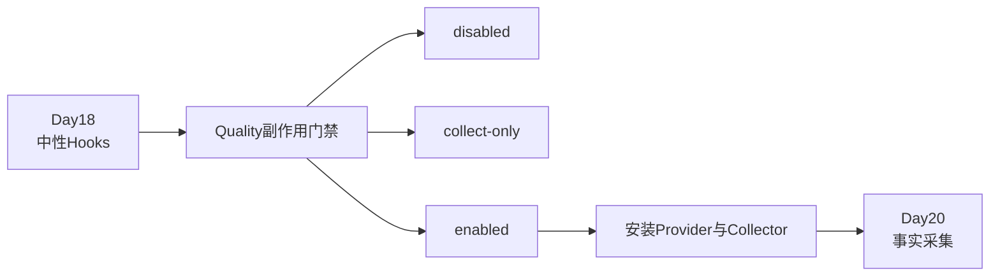

---

## 0. 从 Day 18 接过来的问题

Day 18 已经建立：

```text
common只发布中性事件
默认Provider是Noop
具体后端必须从外部按需安装
```

今天要回答的是：

> 谁决定安装？什么时候安装？安装到哪个执行作用域？关闭或只收集时必须避免哪些副作用？

如果没有明确答案，Quality 即使代码上“可选”，运行时仍可能偷偷创建目录、修改参数或污染 ContextVar。

---

## 1. 第一性原理：可选能力首先是副作用合同

“可选”不能只理解为有一个布尔开关。

真正的可选能力必须回答：

| 问题 | disabled 的要求 |
| --- | --- |
| 是否导入重型模块 | 尽量不导入 |
| 是否生成运行身份 | 不生成 |
| 是否修改 pytest 参数 | 不修改 |
| 是否修改环境变量 | 不修改 |
| 是否创建文件或目录 | 不创建 |
| 是否绑定 Runtime Hooks | 不绑定 |
| 是否改变 pytest 退出码 | 不改变 |

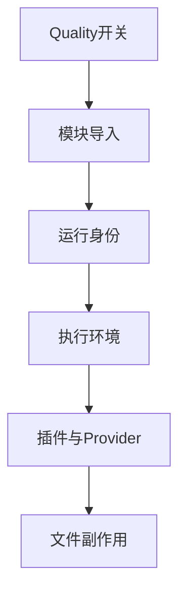

只有这条链每一层都受门禁控制，Quality 才是真正可选。

---

## 2. TOC：最大约束是阶段污染

最危险的错误不是 Quality 完全失败，而是在错误阶段产生半套副作用。

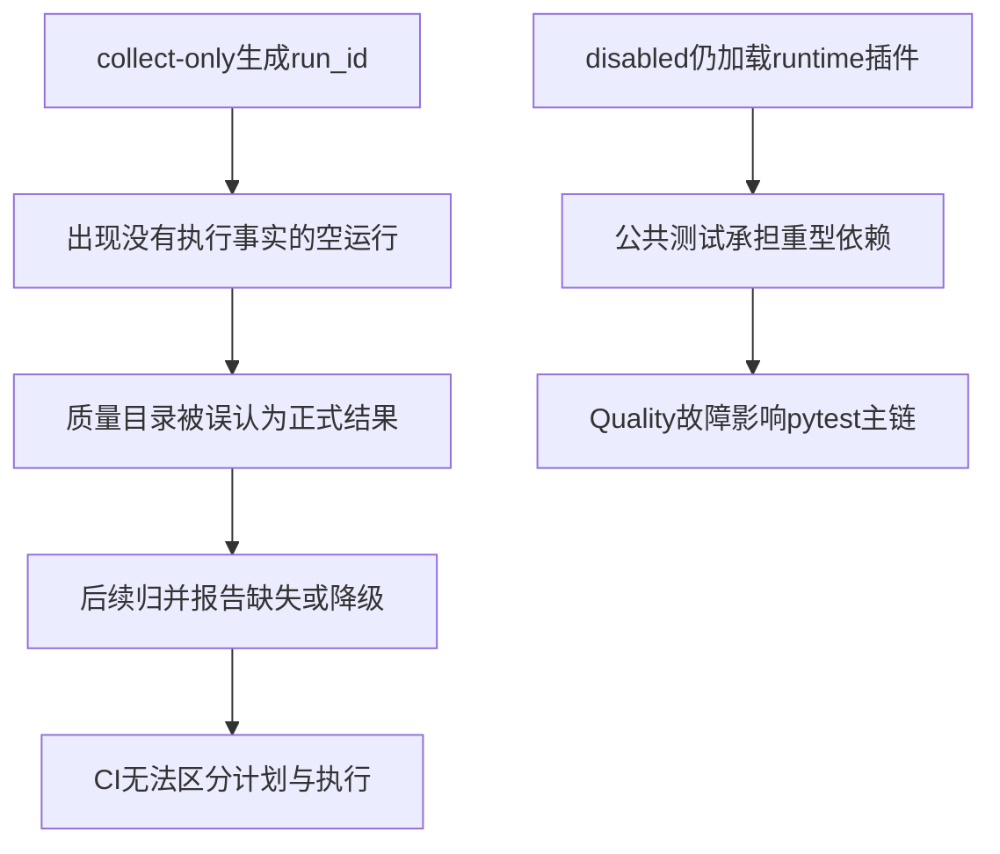

TOC 解约束方式是设置多层门禁，而不是只依赖一个 `if enabled`：

1. Runner collect-only 早返回。
2. 父 Quality 生命周期选择 Noop 或 Enabled。
3. 轻量插件只在 enabled 时导入 runtime 插件。
4. runtime 插件只在真实执行 worker 安装 Collector 与 Hooks。

---

## 3. 三条路径总览

| 路径 | 是否执行 pytest 用例 | Quality 生命周期 | 身份 | 参数/环境 | 文件 |
| --- | --- | --- | --- | --- | --- |
| disabled | 是 | Noop | 不生成 | 不注入 | 不创建 Quality 输出 |
| collect-only | 否 | Runner 在创建生命周期前返回 | 不生成 | 不注入执行阶段环境 | 不创建 Quality 输出 |
| enabled | 是 | Enabled | run/execution/worker | JUnit + stage env | run、分片和后续归并产物 |

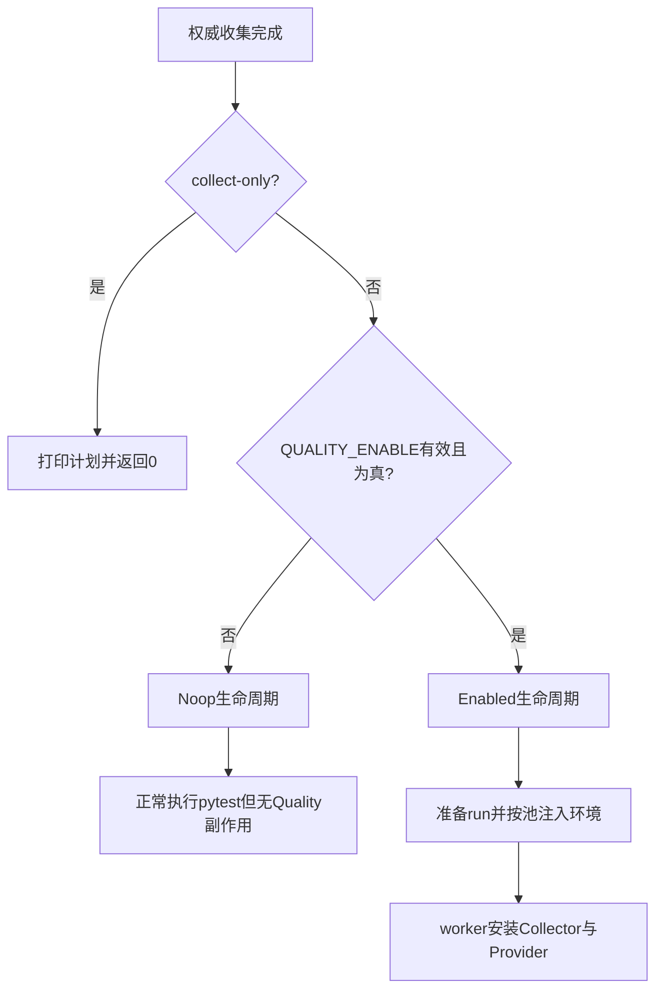

---

## 4. Quality 配置只描述请求状态

`QualityRuntimeConfig` 核心字段：

```text
enabled
run_id
execution_id
output_dir
semantic_enabled / warning
metrics_enabled / warning
flaky_* 设置
```

Day 19 只深入前四项。

### 4.1 `QUALITY_ENABLE` 解析

真值：

```text
1 true yes on
```

假值：

```text
空字符串 0 false no off
```

大小写和首尾空白会被规范化。未知值会抛 `ValueError`，上层生命周期捕获后退化为 Noop。

### 4.2 配置不是最终执行身份

环境中可以预先提供 `QUALITY_RUN_ID`，也可以只请求 enabled。

父 Runner 会把相对 `output_dir` 解析到项目根目录，并在缺少 run_id 时生成新的父 run 身份。

`execution_id` 不在父配置阶段固定，因为它属于具体执行池。

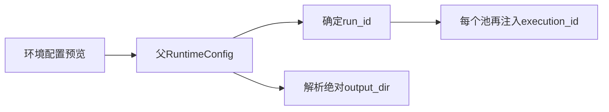

---

## 5. `QualityRunLifecycle`：Runner 的中性边界

Runner 不直接在主流程中拼装 Collector、Adapter 或归并逻辑，而是依赖一个生命周期 Protocol：

```text
enabled
prepare(start_time)
ensure_junit_args(pytest_args)
stage_environment(execution_id)
finalize(...)
```

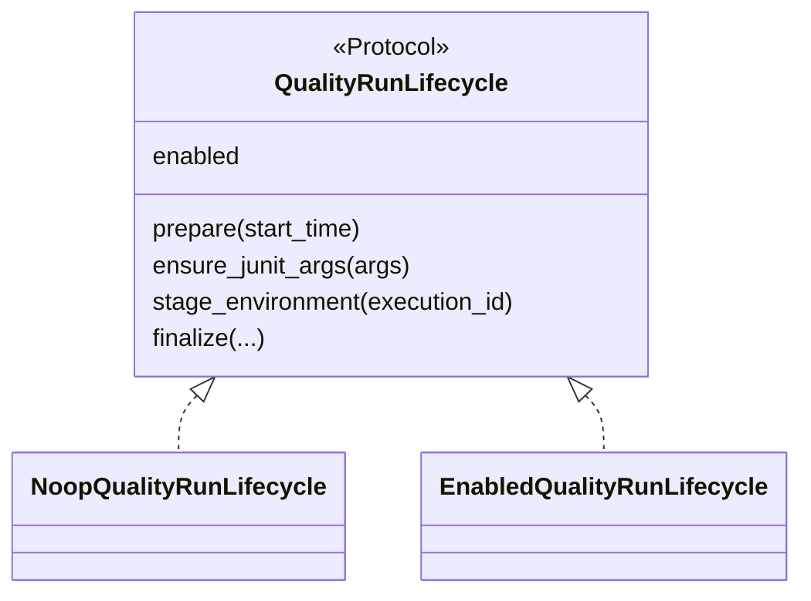

Runner 因此只处理统一动作，不需要在每个阶段写开关分支。

### 5.1 Factory 的两阶段判断

`create_quality_run_lifecycle()`：

1. 只导入并读取轻量 `quality.config`。
2. 配置异常或 `enabled=False`，返回 Noop。
3. enabled 时再解析父运行配置。
4. 父配置仍无效则返回 Noop。
5. 最后才创建 Enabled 生命周期。

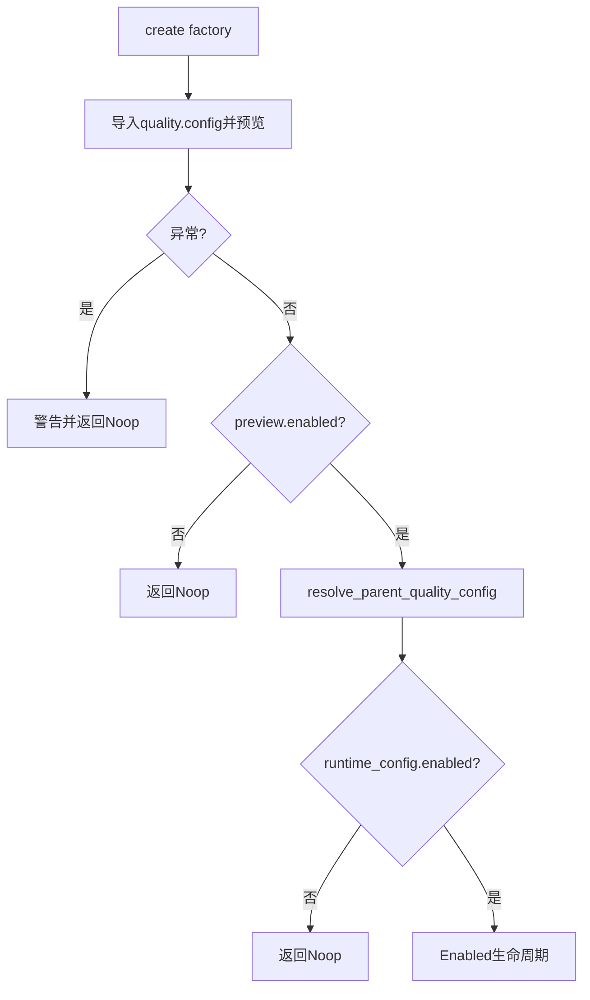

### 5.2 为什么先轻量预览

disabled 路径不需要导入：

- runtime adapter。
- Collector。
- Quality models 与 pipeline。
- 存储和聚合模块。

专项测试在独立进程中证明，disabled factory 只加载 `quality` 与 `quality.config`。

---

## 6. Noop 生命周期：真正的零副作用

`NoopQualityRunLifecycle` 的行为：

| 方法 | 行为 |
| --- | --- |
| `prepare()` | 什么也不做 |
| `ensure_junit_args()` | 返回参数副本，不添加 JUnit |
| `stage_environment()` | 返回 `nullcontext()` |
| `finalize()` | 什么也不做 |

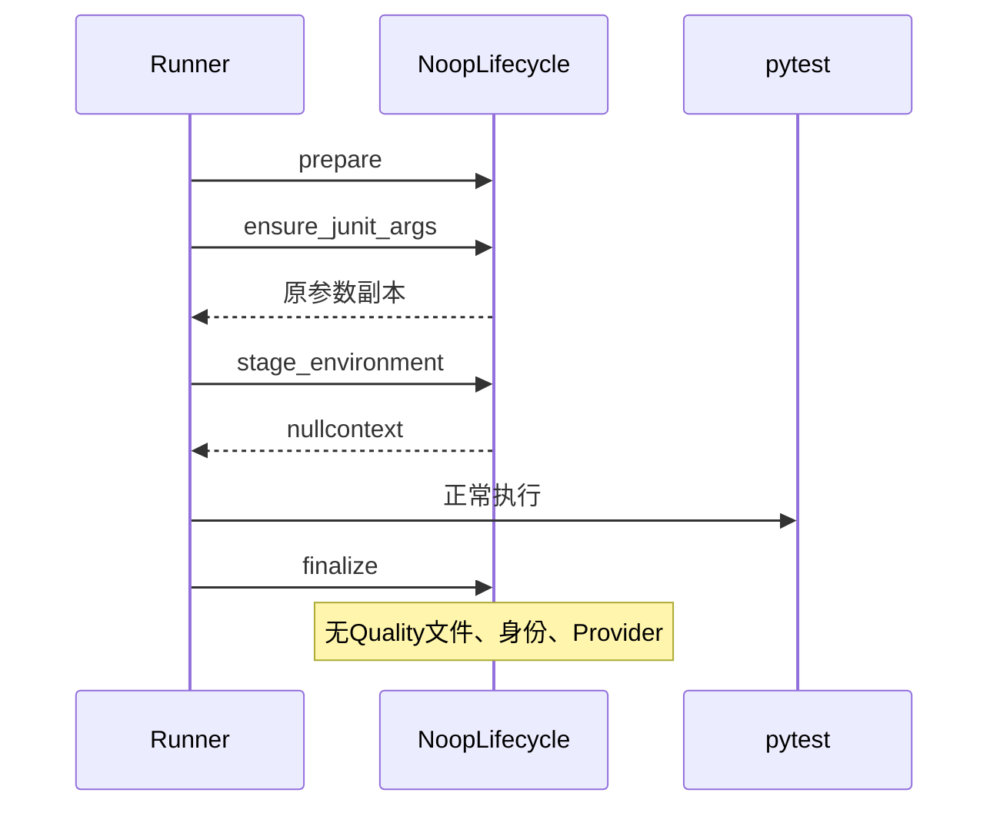

### 6.1 disabled 不等于不执行测试

Quality disabled 时，Runner 仍会：

- 权威收集。
- 分池。
- 执行 pytest。
- 生成 Runner 和 Allure 事实。

只是 Quality 不参与。

### 6.2 环境变量必须保持原状

Noop 不应清理、覆盖或“规范化”调用方已有环境。

例如外部存在一个无关的 `QUALITY_EXECUTION_ID`，disabled 生命周期不会进入 stage context 修改它。

### 6.3 文件系统门禁

即使设置了 `QUALITY_OUTPUT_DIR`，只要 disabled，正式离线运行后该目录也不应由 Quality 创建。

---

## 7. collect-only：比 disabled 更早的门禁

Runner 的顺序是：

```text
参数分相
→ 权威收集
→ 分池
→ 判断collect-only
→ 直接打印数量并返回0
```

Allure 与 Quality 生命周期在 collect-only 判断之后才创建。

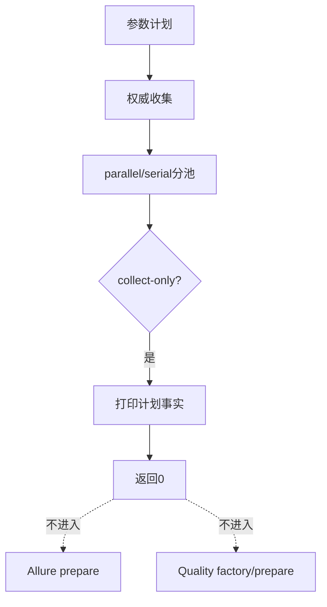

### 7.1 collect-only 为什么不能生成 run_id

run_id 表示一次质量运行。collect-only 没有执行 case，也没有 request/case facts。

如果此时生成 run_id，会产生“有身份、无执行”的幽灵运行。

专项测试会让 run_id 生成函数在 collect-only 时直接抛 AssertionError，以证明这条路径不会调用它。

### 7.2 pytest 插件也有 collect-only 防线

即使有人绕过 Runner 直接执行：

```text
python -m pytest --collect-only
```

轻量插件和 runtime 插件的 `pytest_configure()` 都会检查 `collectonly` 并返回。

这是防御纵深：

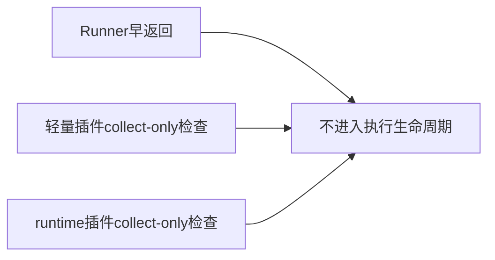

### 7.3 collect-only 允许什么

- 打印收集 nodeid。
- 打印 parallel/serial 数量。
- 返回 pytest 收集成功码。

不允许：

- 创建 Quality 输出目录。
- 注入 execution_id。
- 绑定 Runtime Hooks。
- 创建 Case/Request 分片。

---

## 8. Enabled 生命周期：父运行准备

Enabled 路径在正式执行前：

1. 解析绝对输出目录。
2. 确定共享 run_id。
3. 记录 Quality 开始时间。
4. 写入初始 `run.json`。

### 8.1 run_id 来源

优先级：

```text
显式QUALITY_RUN_ID
→ Jenkins JOB_NAME + BUILD_NUMBER
→ 本地生成build_run_id()
```

只有 `JOB_NAME` 与 `BUILD_NUMBER` 同时存在时才使用 Jenkins 身份。

### 8.2 初始 run 记录为什么是 partial/degraded

运行刚开始时：

- end_time 还不存在。
- case/request facts 还未完成。
- 完整性尚未核对。

因此初始 `run.json` 使用：

```text
status = partial
integrity_status = degraded
```

这不是运行已经失败，而是“尚未完成”的保守状态。

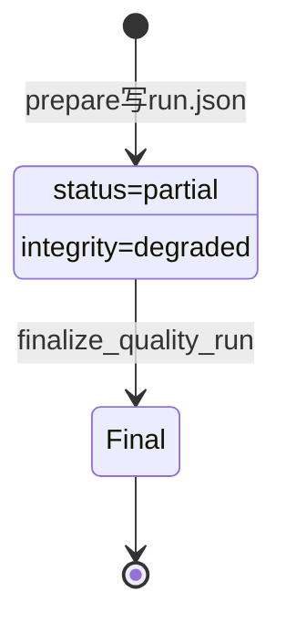

初始写入本身也 fail-open：磁盘异常会报告，但不替换 pytest 控制流。

---

## 9. JUnit 参数：已有配置优先

Quality 后续归并需要用例级机器证据，因此 Enabled 生命周期检查 pytest 参数。

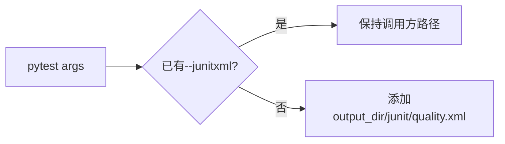

### 9.1 为什么不覆盖自定义路径

调用方可能已经为 CI 指定 JUnit。覆盖会破坏外部发布合同。

所以 `ensure_junit_args()` 只在缺失时补默认路径。

### 9.2 多池时的后续改写

Quality 生命周期先提供默认基础路径，Runner 的并行/串行参数构建再根据池追加 suffix。

可能形成：

```text
quality.parallel.xml
quality.serial.xml
```

无并行参数的单 serial 路径通常保持 `quality.xml`。

JUnit 由 pytest 插件写，Quality 生命周期只确保路径存在于参数合同中。

---

## 10. stage environment：为每个池注入 execution 身份

父 RuntimeConfig 中共享：

```text
run_id
output_dir
```

进入每个池前，`quality_stage_environment()` 临时设置：

```text
QUALITY_ENABLE=1
QUALITY_RUN_ID=<shared run id>
QUALITY_EXECUTION_ID=<stage id>
QUALITY_OUTPUT_DIR=<absolute output dir>
```

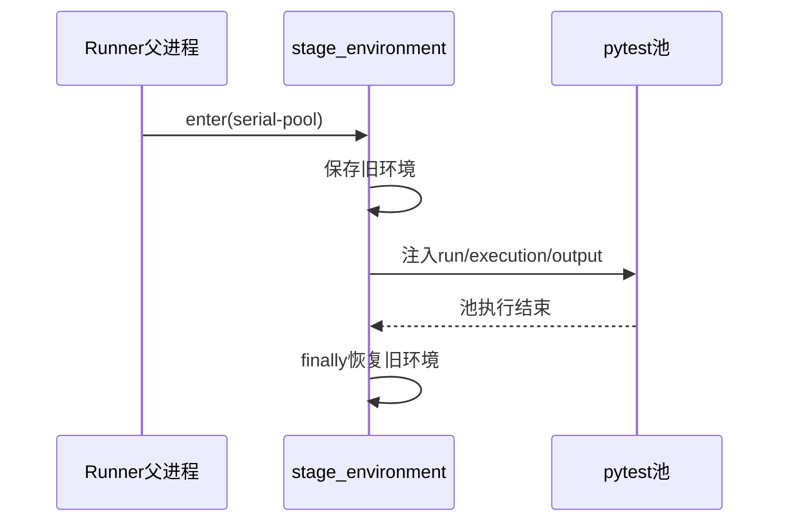

### 10.1 环境恢复是生命周期的一部分

context manager 在 `finally` 中：

- 原变量不存在则删除。
- 原变量存在则恢复原值。

这保证 parallel-pool 的 execution_id 不泄漏到 serial-pool，也不污染调用 Runner 的外部 Shell。

### 10.2 stage id 不是 worker id

`parallel-pool`、`serial-pool` 表示 Runner 执行阶段，不表示具体 xdist worker。

同一个 execution 下可以有多个 worker。

---

## 11. 三层身份模型

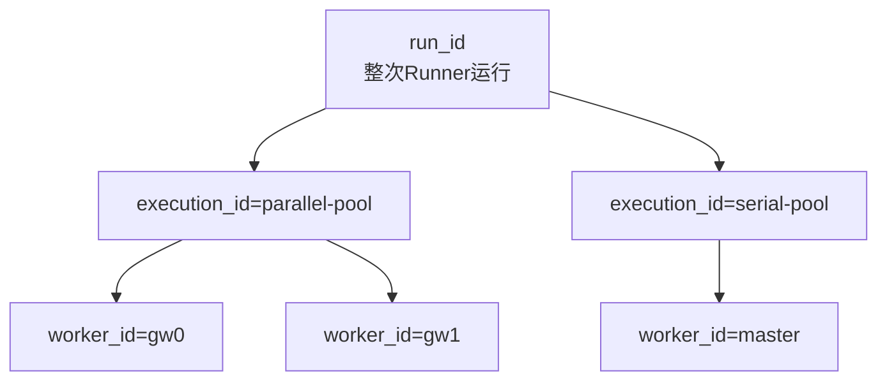

| 身份 | 作用域 | 示例 |
| --- | --- | --- |
| run_id | 一次完整质量运行 | `day19-enabled` |
| execution_id | 一次池/执行阶段 | `parallel-pool`、`serial-pool` |
| worker_id | 具体 pytest 写入者 | `gw0`、`gw1`、`master` |

### 11.1 为什么需要三层

只使用 run_id：多个池与 worker 会写到同一分片身份，无法追踪来源。

只使用 worker_id：不同 execution 中可能重复出现 `master` 或 `gw0`。

三层组合使后续可以证明：

```text
这条事实属于哪一轮、哪个阶段、哪个写入者
```

### 11.2 直接 pytest 的身份

非 Runner 的直接 pytest enabled 路径：

- 缺少 run_id 时自行 `build_run_id()`。
- 缺少 execution_id 时使用 `manual-pytest`。
- 非 xdist 时 worker_id 为 `master`。

这条路径仍有完整身份，但不应冒充 Runner 的 pool 语义。

---

## 12. 轻量插件：只负责是否加载 runtime

`module/conftest.py` 稳定注册：

```text
quality.pytest_plugin
```

但这个模块故意保持轻量。

`pytest_configure()`：

1. collect-only 直接返回。
2. 读取 worker payload 或轻量 config。
3. disabled 直接返回。
4. enabled 才 `import_module("quality.pytest_plugin_runtime")`。
5. 注册 runtime plugin。

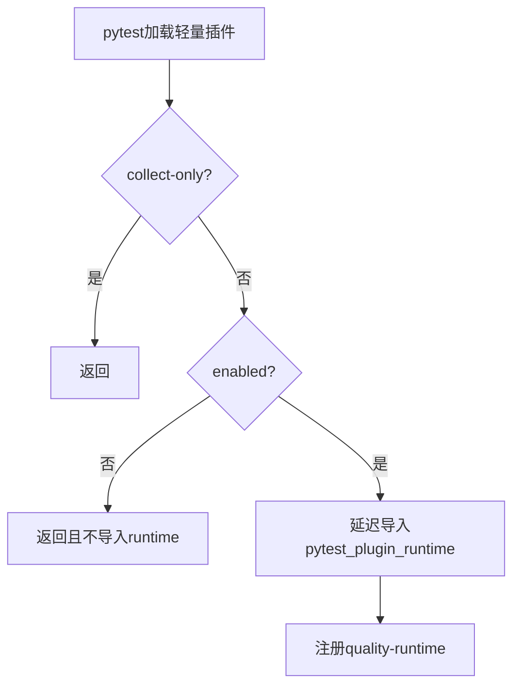

### 12.1 为什么不是直接在 conftest 导入 runtime

runtime 插件依赖：

- Collector。
- Runtime Adapter。
- Case/Request 模型。
- 存储与上下文。

disabled 时加载这些模块会增加启动成本与故障面。

### 12.2 worker 如何判断 enabled

xdist worker 优先读取 controller 传入的 `workerinput["quality_runtime"]`，而不是重新猜测父进程配置。

这样所有 worker 共享同一 run_id、execution_id 和 output_dir。

---

## 13. runtime 插件：只在真实执行者安装状态

runtime `pytest_configure()` 依次执行：

1. collect-only 返回。
2. 解析 runtime config。
3. 保存 `_PluginState`。
4. disabled 返回。
5. xdist controller 返回。
6. 真实 worker/master 建立 `QualityRunContext`。
7. 配置 Collector。
8. 可选配置 Semantic Collector。
9. 创建 `QualityRuntimeHooks`。
10. 绑定 Runtime Hooks Provider。

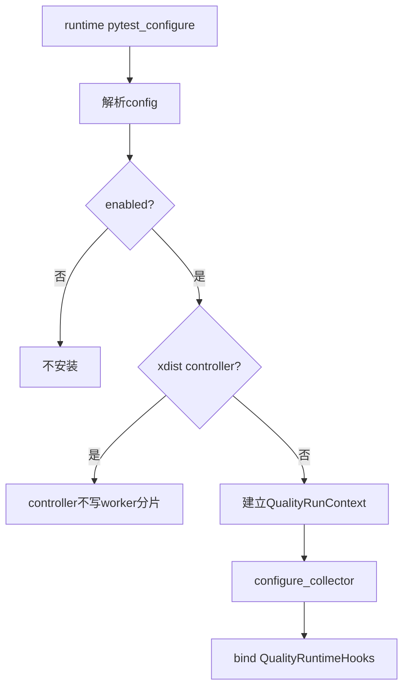

### 13.1 为什么 controller 不安装 Collector

xdist controller 负责任务编排，不执行具体测试 call。

如果 controller 也创建分片，可能出现：

- 空 controller 分片。
- 与 worker 重复的 case 事实。
- 难以解释的 worker_id。

### 13.2 configure_node 的责任

controller 虽不写事实，但会给每个 worker 发送：

```text
enabled
run_id
execution_id
output_dir
semantic设置
```

worker 使用该 payload 构造自己的 RuntimeConfig。

### 13.3 安装失败如何清理

如果 Collector、RunContext 或 Hooks 安装中途失败：

- 已绑定 hooks 则 reset。
- 已设置 run context 则 reset。
- reset Collector。
- 清空 state 引用。
- 输出 warning。

业务 pytest 继续执行。

---

## 14. pytest unconfigure：按反方向恢复

runtime 插件在 `pytest_unconfigure()` 中清理：

```text
finalize pending semantic
→ reset Runtime Hooks
→ reset RunContext
→ reset Semantic Collector
→ reset Collector
→ 删除PluginState
```

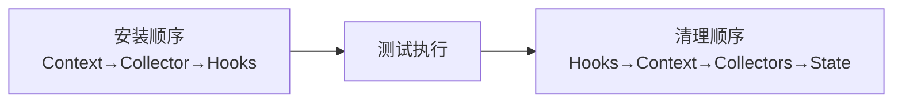

### 14.1 为什么先 reset Hooks

如果先删除 Collector，但 Provider 仍绑定 QualityRuntimeHooks，teardown 中的公共请求仍可能调用一个已失去后端状态的适配器。

先恢复 Noop/外层 Provider，再清理 Collector 更安全。

### 14.2 teardown 必须容忍部分安装

每个 state 字段都可能为 `None`，因为初始化可能在中途失败。

清理逻辑不能假设“要么全部成功，要么全部不存在”。

---

## 15. Runner finalize：只汇总实际执行阶段

Runner 最终把：

- start_time。
- expected_case_count。
- pool_results。
- 生命周期 status。

交给 Quality lifecycle。

Enabled finalize 先过滤 `NOT_RUN` 池，再提供：

```text
expected_execution_ids
junit_files
expected_case_count
RunStatus
```

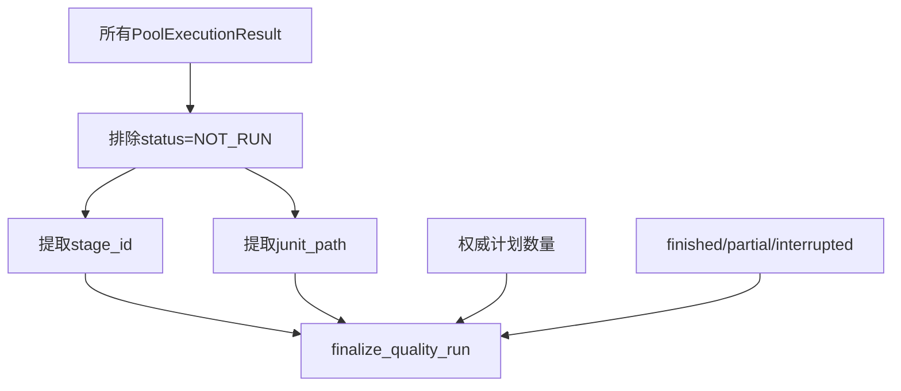

### 15.1 生命周期 status 来源

| Runner 情况 | Quality RunLifecycleStatus |
| --- | --- |
| 正常完成 | `FINISHED` |
| 任一池执行器状态为 ERROR | `PARTIAL` |
| Runner 普通异常 | `PARTIAL` |
| `KeyboardInterrupt/SystemExit` | `INTERRUPTED` |

这是运行生命周期状态，不等同于所有测试通过。

### 15.2 为什么排除 NOT_RUN

NOT_RUN 没有真实 pytest 执行，也没有可信 JUnit/worker 分片。

把它列入 expected execution 会让后续完整性检查误报“缺失整个阶段事实”。

### 15.3 finalize 仍然 fail-open

Quality merge、run record 或后续可选阶段失败时输出 warning，但不改写 Runner 已计算的 pytest 最终退出码。

如果 Runner 原本抛出 `KeyboardInterrupt`，Quality finalize 仍会运行，然后原中断继续传播。

---

## 16. 完整生命周期总图

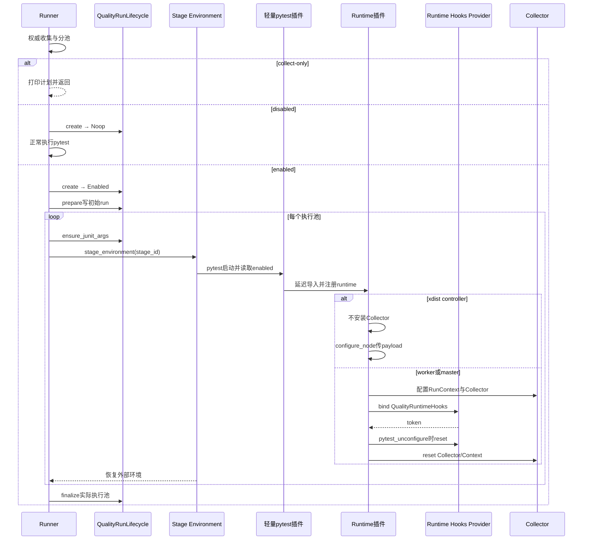

---

## 17. 三路径副作用矩阵

| 副作用 | disabled | collect-only | enabled |
| --- | --- | --- | --- |
| 执行测试 | 是 | 否 | 是 |
| 生成 run_id | 否 | 否 | 是或复用显式值 |
| 写初始 `run.json` | 否 | 否 | 是 |
| 添加默认 JUnit | 否 | 否 | 缺失时添加 |
| 注入 execution_id | 否 | 否 | 每个池注入 |
| 导入 runtime 插件 | 否 | 否 | 是 |
| 配置 Collector | 否 | 否 | worker/master 是 |
| 绑定 QualityRuntimeHooks | 否 | 否 | worker/master 是 |
| 创建 Quality 输出目录 | 否 | 否 | 是 |
| 执行 finalize pipeline | 否 | 否 | 是 |
| 改写 pytest 退出码 | 否 | 否 | 否 |

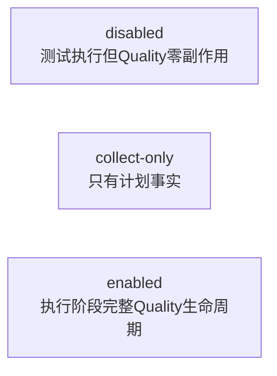

---

## 18. 最小源码阅读路线

```mermaid
flowchart LR
    CFG[quality/config.py<br/>开关与RuntimeConfig] --> LIFE[quality_lifecycle.py<br/>Noop/Enabled]
    LIFE --> ENV[environment.py<br/>父身份与stage环境]
    ENV --> LIGHT[pytest_plugin.py<br/>延迟加载]
    LIGHT --> RUNTIME[pytest_plugin_runtime.py<br/>worker安装]
    RUNTIME --> RUNNER[runner.py<br/>调用位置]
    RUNNER --> TESTS[三组专项测试]
```

建议顺序：

1. `quality/config.py`：只读核心字段和 `QUALITY_ENABLE`。
2. `quality_lifecycle.py`：对比 Noop 与 Enabled。
3. `environment.py`：看 run_id 和 stage env。
4. `runner.py`：看 collect-only 早返回和每池 context。
5. `quality/pytest_plugin.py`：看轻量门禁。
6. `quality/pytest_plugin_runtime.py`：只读 configure、configure_node、unconfigure。
7. 最后读测试，确认副作用边界。

不要在本课提前深入 `finalize_quality_run()` 内部归并算法，那是第五周内容。

---

## 19. 离线实践：验证三条路径

### 实验一：运行 Quality 生命周期专项测试

```powershell
.\.venv\Scripts\python.exe -m pytest `
  tests/quality/test_quality_lifecycle.py `
  tests/quality/test_quality_pytest_plugin.py `
  tests/quality/test_quality_run_master.py `
  -q
```

当前仓库预期：

```text
25 passed
```

覆盖：

- disabled 只加载轻量配置。
- Noop 无文件和参数副作用。
- stage 环境恢复。
- collect-only 不生成身份和输出。
- enabled 补 JUnit 并 finalize。
- xdist worker 独立写分片，controller 不重复。
- Collector 或后续阶段失败不改变 pytest outcome。

### 实验二：disabled 正式执行

```powershell
$output = Join-Path $env:TEMP `
  ('llm-api-case-day19-disabled-' + [guid]::NewGuid().ToString('N'))

$env:QUALITY_ENABLE = '0'
$env:QUALITY_OUTPUT_DIR = $output
$env:GENERATE_ALLURE_REPORT = 'FALSE'
$env:GENERATE_HISTORY_REPORT = 'FALSE'

.\.venv\Scripts\python.exe .\run_master.py `
  .\module\offline_framework_example\test_full_framework_flow.py `
  -q

Write-Output "Runner exit: $LASTEXITCODE"
Write-Output "Quality output exists: $(Test-Path -LiteralPath $output)"
```

预期：

```text
1 passed
Runner exit: 0
Quality output exists: False
```

测试被执行，但 Quality 目录不创建。

### 实验三：enabled + collect-only

```powershell
$output = Join-Path $env:TEMP `
  ('llm-api-case-day19-collect-' + [guid]::NewGuid().ToString('N'))

$env:QUALITY_ENABLE = '1'
$env:QUALITY_RUN_ID = 'day19-collect-demo'
$env:QUALITY_OUTPUT_DIR = $output

.\.venv\Scripts\python.exe .\run_master.py `
  .\module\offline_framework_example\test_full_framework_flow.py `
  --collect-only -q

Write-Output "Runner exit: $LASTEXITCODE"
Write-Output "Quality output exists: $(Test-Path -LiteralPath $output)"
```

预期关键输出：

```text
Parallel pool cases: 1
Serial pool cases: 0
1 tests collected
Runner exit: 0
Quality output exists: False
```

即使开关为 1，collect-only 仍没有 Quality 运行副作用。

### 实验四：enabled 正式执行

```powershell
$output = Join-Path $env:TEMP `
  ('llm-api-case-day19-enabled-' + [guid]::NewGuid().ToString('N'))

$env:QUALITY_ENABLE = '1'
$env:QUALITY_RUN_ID = 'day19-enabled-demo'
$env:QUALITY_OUTPUT_DIR = $output
$env:QUALITY_SEMANTIC_ENABLE = '0'
$env:QUALITY_METRICS_ENABLE = '0'
$env:QUALITY_FLAKY_HISTORY_ENABLE = '0'
$env:QUALITY_FLAKY_STATE_ENABLE = '0'
$env:GENERATE_ALLURE_REPORT = 'FALSE'
$env:GENERATE_HISTORY_REPORT = 'FALSE'

.\.venv\Scripts\python.exe .\run_master.py `
  .\module\offline_framework_example\test_full_framework_flow.py `
  -q

Write-Output "Runner exit: $LASTEXITCODE"
Get-ChildItem -LiteralPath $output -Recurse -File |
  ForEach-Object { $_.FullName.Substring($output.Length + 1) }
```

当前实现中可观察到类似：

```text
run.json
junit\quality.xml
shards\cases-serial-pool-master.jsonl
shards\requests-serial-pool-master.jsonl
shards\integrity-serial-pool-master.jsonl
merged\manifest.json
...
```

本课只确认路径和身份存在，不解释各 JSONL 字段或归并结论。

运行时可能出现 pytest 关于 `record_property` 与 `junit_family=xunit2` 的 warning；只要用例通过且 JUnit 文件生成，它不是本课的 Quality 生命周期失败。

### 实验五：验证 stage 环境恢复

```powershell
@'
import os
from pathlib import Path

from quality.config import QualityRuntimeConfig
from run_orchestration.environment import quality_stage_environment

config = QualityRuntimeConfig(
    enabled=True,
    run_id="run-demo",
    execution_id=None,
    output_dir=Path("reports/quality-demo").resolve(),
)

os.environ["QUALITY_EXECUTION_ID"] = "outside"

print("before =", os.environ["QUALITY_EXECUTION_ID"])
with quality_stage_environment(config, "serial-pool"):
    print("inside =", os.environ["QUALITY_EXECUTION_ID"])
    print("run_id =", os.environ["QUALITY_RUN_ID"])
print("after =", os.environ["QUALITY_EXECUTION_ID"])
'@ | .\.venv\Scripts\python.exe -
```

预期：

```text
before = outside
inside = serial-pool
run_id = run-demo
after = outside
```

### 实验六：观察 disabled 的轻量导入

```powershell
$env:QUALITY_ENABLE = 'FALSE'

@'
import sys
from run_orchestration.quality_lifecycle import create_quality_run_lifecycle

lifecycle = create_quality_run_lifecycle()
loaded = sorted(
    name for name in sys.modules
    if name == "quality" or name.startswith("quality.")
)
print("enabled =", lifecycle.enabled)
print("quality modules =", loaded)
'@ | .\.venv\Scripts\python.exe -
```

在新的 Python 进程中预期核心关系：

```text
enabled = False
quality modules = ['quality', 'quality.config']
```

如果外部启动环境预加载了其他模块，应以专项独立进程测试为准。

---

## 20. 故障排查：先定位门禁层

### 情况一：disabled 仍创建 Quality 目录

检查：

- 是否有 module 或 fixture 直接实例化 Collector。
- 是否绕过 `create_quality_run_lifecycle()`。
- 是否把历史遗留目录误认为本轮新建。
- 运行前后是否使用了唯一临时输出路径。

### 情况二：collect-only 出现 `run.json`

检查：

- 是否通过稳定 Runner 入口。
- collect-only 参数是否被参数计划识别。
- 是否有外部 pytest 插件在收集阶段自行启动 Quality。

Runner、轻量插件和 runtime 插件均应有 collect-only 门禁。

### 情况三：enabled 但没有 Quality 输出

按顺序检查：

1. `QUALITY_ENABLE` 是否是支持的真值。
2. `QUALITY_OUTPUT_DIR` 是否可写。
3. 控制台是否出现 `Quality collection disabled`。
4. stage 环境中 run_id/execution_id 是否存在。
5. runtime 插件是否成功注册。
6. 当前进程是否是 xdist controller 而非 worker。

### 情况四：出现 `Quality collection disabled: ValueError`

通常是布尔环境变量使用了未知值，例如：

```text
QUALITY_ENABLE=sometimes
```

当前设计会 fail-open 到 Noop，而不是阻止测试执行。

### 情况五：parallel 与 serial 使用不同 run_id

这是严重身份错误。两个池必须共享父 RuntimeConfig 中的 run_id，只更换 execution_id。

检查是否在每个 stage 内重新调用了 run_id 生成函数。

### 情况六：serial-pool 看到 parallel-pool 的环境

检查 `quality_stage_environment()` 是否通过 `with` 使用，以及异常路径是否仍执行 `finally` 恢复。

### 情况七：xdist controller 产生空分片

检查 `_is_xdist_controller()` 是否正确识别 controller，并在配置 Collector 前返回。

controller 只传播 payload，不拥有 worker 写入职责。

### 情况八：pytest 结束后仍绑定 QualityRuntimeHooks

检查 `pytest_unconfigure()` 是否运行、token 是否保存在 state，以及 teardown 是否按先 hooks 后 context/collector 的顺序执行。

### 情况九：Quality finalize 失败导致 Runner 变成失败

当前设计不应发生。Quality finalize 应记录 warning 并保持原 pytest 退出码。

如果退出码变化，检查是否在 Runner 主流程之外直接抛出了 Quality 异常。

---

## 21. 常见误区

| 误区 | 正确理解 |
| --- | --- |
| `QUALITY_ENABLE=0` 表示不执行测试 | 只关闭 Quality，pytest 仍执行 |
| collect-only 可以先建 run_id 备用 | 不可以，会产生无执行的幽灵运行 |
| disabled 时加载 runtime 插件没关系 | 会增加依赖、启动成本和故障面 |
| Noop 可以创建空目录 | Noop 的合同是无文件副作用 |
| run_id 等于 execution_id | run 跨池共享，execution 表示具体阶段 |
| execution_id 等于 worker_id | 一个 execution 可以有多个 worker |
| xdist controller 也应该写 case 分片 | controller 不执行用例，应只传配置 |
| 每个 worker 自己生成 run_id | 所有 worker 必须继承父 run 身份 |
| Quality JUnit 应覆盖调用方 JUnit | 已有 `--junitxml` 必须保留 |
| Provider 在 Runner 父进程安装一次即可 | 真正执行请求的是 pytest worker/master |
| finalize 应包含 NOT_RUN 阶段 | NOT_RUN 没有真实执行事实，应排除 |
| Quality 异常应该改变 pytest 退出码 | Quality 是旁路能力，采用 fail-open |

---

## 22. 练习与参考答案

### 练习一：disabled 路径

`QUALITY_ENABLE=0`，Runner 执行一个通过的离线测试。Quality 输出目录是否应该存在？最终退出码是什么？

**参考答案**：Quality 目录不应由本轮创建；pytest 与 Runner 正常执行，最终退出码为 0。

### 练习二：collect-only

`QUALITY_ENABLE=1` 且传入 `--collect-only`。是否生成 run_id 和 `run.json`？

**参考答案**：不生成。Runner 在创建 Allure/Quality 生命周期前返回，pytest 插件也有 collect-only 防线。

### 练习三：无效开关

`QUALITY_ENABLE=maybe` 会发生什么？

**参考答案**：配置解析抛 ValueError，factory 输出 Quality disabled warning 并返回 Noop；测试执行主链继续。

### 练习四：JUnit

调用方已传 `--junitxml=custom.xml`，Enabled 生命周期会改成 `quality.xml` 吗？

**参考答案**：不会。`ensure_junit_args()` 保留已有路径。

### 练习五：身份作用域

一次 Runner 先执行 parallel-pool，再执行 serial-pool。哪些身份相同，哪些不同？

**参考答案**：run_id 与 output_dir 相同；execution_id 分别为 parallel-pool 和 serial-pool；worker_id 由各池实际 worker 决定。

### 练习六：xdist controller

controller 为什么创建 PluginState 却不配置 Collector？

**参考答案**：它需要持有配置并向 worker 传播 payload，但不执行具体测试，不应写 worker 事实。

### 练习七：Provider 安装

`QualityRuntimeHooks` 应在 Runner 父进程还是 pytest worker 中绑定？

**参考答案**：在真实执行测试的 worker/master runtime 插件中绑定，因为公共请求事件发生在那里。

### 练习八：环境恢复

进入 serial-pool 前外部 `QUALITY_EXECUTION_ID=outside`。池结束后应该是什么？

**参考答案**：恢复为 `outside`，而不是保留 `serial-pool`。

### 练习九：中断

pytest 执行抛 `KeyboardInterrupt`，Quality 是否 finalize？中断是否继续传播？

**参考答案**：Runner finally 仍调用 Quality finalize，状态映射为 interrupted；原 KeyboardInterrupt 随后继续传播。

### 练习十：NOT_RUN

parallel 返回终止型退出码，serial 被标记 NOT_RUN。Quality finalize 的 expected execution ids 是否包含 serial？

**参考答案**：不包含。只汇总真实执行的阶段。

---

## 23. 当日验收清单

- [ ] 能完整对比 disabled、collect-only、enabled 三条路径。
- [ ] 能说明 disabled 与 collect-only 的差异。
- [ ] 能解释 Noop 为什么不能创建空目录或补 JUnit。
- [ ] 能说明 factory 为什么先只加载轻量 config。
- [ ] 能解释无效开关如何 fail-open。
- [ ] 能说明 collect-only 为什么不能生成 run_id。
- [ ] 能画出 run_id、execution_id、worker_id 身份树。
- [ ] 能解释 stage environment 如何保存并恢复外部变量。
- [ ] 能说明轻量插件为什么延迟导入 runtime 插件。
- [ ] 能说明 xdist controller 为什么不配置 Collector。
- [ ] 能说明 worker 如何继承父 run/execution/output 配置。
- [ ] 能解释 Runtime Hooks Provider 在哪里绑定和 reset。
- [ ] 能说明已有 JUnit 参数为什么优先。
- [ ] 能说明 finalize 为什么排除 NOT_RUN。
- [ ] 能运行 25 个 Quality 生命周期专项测试。
- [ ] 能用唯一临时目录验证三条路径的文件副作用。
- [ ] 能说明 Quality 失败为什么不改写 Runner 退出码。

如果不能从一个目录或环境变量反推出“它属于 run、execution 还是 worker”，说明身份模型还没有建立。

---

## 24. 本课完整因果链

```mermaid
flowchart TD
    A[Day18提供中性Hooks] --> B[Runner判断collect-only]
    B -->|是| C[无Quality身份与文件副作用]
    B -->|否| D[Factory选择Noop或Enabled]
    D -->|Noop| E[测试执行且Quality零副作用]
    D -->|Enabled| F[父run准备与JUnit合同]
    F --> G[每池注入execution环境]
    G --> H[轻量插件延迟加载runtime]
    H --> I[真实worker建立RunContext与Collector]
    I --> J[绑定QualityRuntimeHooks]
    J --> K[pytest执行并发布中性事件]
    K --> L[unconfigure恢复Hooks与Collector]
    L --> M[Runner finalize实际执行阶段]
    M --> N[Day20分析事件到事实映射]
```

---

## 25. 向 Day 20 的桥梁

Day 19 已经解释：

```text
Quality何时开启
→ 如何建立运行身份
→ 如何把配置送进执行worker
→ 如何安装Provider与Collector
→ 如何在结束时恢复
```

但还没有回答：

> `QualityRuntimeHooks` 收到 HTTP、Retry、Polling 和 SSE 中性事件后，具体调用了哪些现有采集函数？Case、Request 与 Integrity 事实分别从哪里来？

```mermaid
flowchart LR
    D19[Day19<br/>Provider已安装] --> EVENT[中性事件进入Quality适配器]
    EVENT --> D20[Day20<br/>运行事实采集]
```

Day 20 将进入 Adapter 与 Collector，但仍不会提前展开第五周的跨 worker 归并算法。

---

## 26. 一分钟复述模板

> Quality 的可选性由多层门禁保证。Runner 在 collect-only 时早返回，不生成 run_id、execution_id 或文件；正式执行时 factory 根据轻量配置选择 Noop 或 Enabled。Noop 不改参数、环境和文件。Enabled 在父层确定共享 run_id 与绝对 output_dir，缺少 JUnit 时补默认路径，并为每个池临时注入 execution_id。pytest 先加载轻量插件，只有 enabled 才延迟导入 runtime 插件；真实 worker/master 建立 RunContext、Collector 并绑定 QualityRuntimeHooks，xdist controller 只向 worker 传播配置。pytest unconfigure 时按顺序恢复 Hooks、Context 和 Collector，Runner finalize 只汇总实际执行池。所有 Quality 异常都 fail-open，不改写 pytest 最终退出码。

能够用 disabled、collect-only、enabled 三次离线运行证明这段话，就完成了 Day 19。
