# 第 20 天：质量适配与运行事实采集

> **本周位置**：第 4 周第 5 天
> **今日主线**：中性 Runtime Hooks 事件 → Quality Adapter → 原始运行事实
> **核心入口**：`quality/runtime_adapter.py`、`quality/request_metrics.py`、`quality/collector.py`、`quality/pytest_plugin_runtime.py`
> **建议用时**：3.5～4.5 小时，其中周复盘 30～45 分钟

---

## 学习目标与前置准备

### 完成本课后，你应该能够

1. 解释 `QualityRuntimeHooks` 为什么是“翻译器”，而不是请求执行器。
2. 画出 HTTP、Retry、Polling、SSE 事件到 Quality 采集入口的映射关系。
3. 区分 `CaseResult`、`RequestMetric`、`IntegrityIssue` 三类事实的来源与粒度。
4. 说明为什么一次 pytest 用例可能产生多条 Case 阶段事实和多条 Request attempt 事实。
5. 根据源码解释 `request_event_id`、`attempt_index`、`business_status`、`retryable` 的真实含义。
6. 解释 Collector 为什么按 `execution_id + worker_id` 分片，以及 `RLock` 解决了什么问题。
7. 说明采集失败为什么必须 fail-open，同时又不能静默丢失。
8. 使用离线测试和临时输出目录核对事件到 JSONL 事实的映射。
9. 完成第 4 周复盘，纠正“报告等于执行事实”“Hooks 等于 Quality”等混淆。

### 建议前置知识

- 已完成 Day 16，知道 Runner 池状态与最终退出码的关系。
- 已完成 Day 17，知道 JUnit、Allure 与执行事实不是同一种产物。
- 已完成 Day 18，知道 `common` 只发出中性 Runtime Hooks 事件。
- 已完成 Day 19，知道 Quality 是可选能力，并由生命周期安装 Provider 与 Collector。
- 能阅读 Python 数据类、Pydantic 模型、pytest hook 和 JSONL 文件。

### 本课学习产出

| 产出 | 最低要求 | 核验方式 |
| --- | --- | --- |
| 事件映射表 | 覆盖 Operation、Request Group、Request、Polling、SSE | 与 `quality/runtime_adapter.py` 对照 |
| 三类事实边界图 | 能指出事实来源、粒度和落盘文件 | 与模型和 Collector 对照 |
| 一次 Retry 的事实图 | 一个 group、多个 attempt、每次独立 `request_event_id` | 运行兼容性测试 |
| 旁路失败因果链 | 能说明业务异常、采集异常、Integrity 的关系 | 运行 fail-open 测试 |
| 第 4 周综合复盘 | 串联 Runner、报告、Hooks、Lifecycle、Adapter | 完成文末门禁 |

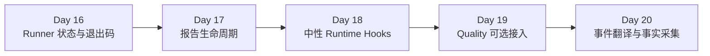

---

## 0. 从 Day 19 接过来的问题

Day 19 已经回答：

- Quality 什么时候启用；
- 谁创建 `run_id`；
- 谁向每个执行池注入 `execution_id`；
- worker 什么时候安装 Collector；
- disabled、collect-only、enabled 三条路径各有哪些副作用。

但“装上了 Quality”并不等于“已经有事实”。

还缺少一条真正的数据链：

```text
业务代码发生了什么
→ common 发出了什么中性事件
→ Quality 如何理解这个事件
→ 需要补充哪些身份和规范化字段
→ 最终写入哪一种 JSONL 事实
```

这就是 Day 20 要解决的问题。

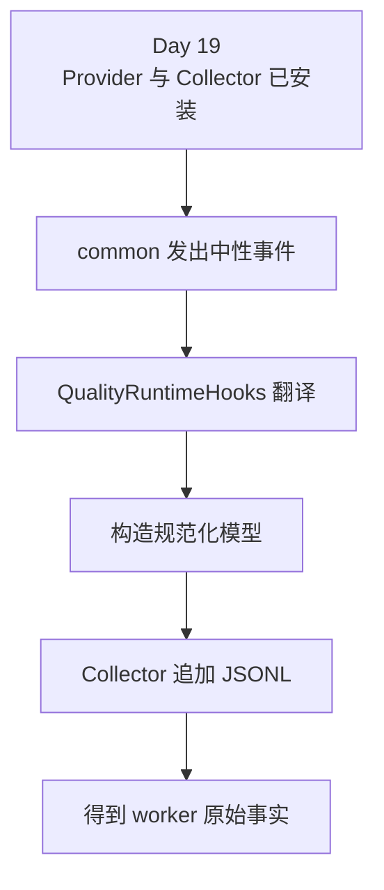

### 今天不提前讲什么

为了避免学习层次混乱，本课只讲“原始事实怎样产生”。

今天不深入：

- worker 分片如何提交和归并；
- Manifest 如何做消费者准入；
- Semantic 如何跨事实建立关系；
- Metrics 如何计算分母和指标；
- Flaky 如何跨运行建立历史身份。

这些内容从 Day 21 开始学习。

---

## 1. 第一性原理：事件不是事实

先从最小定义出发。

### 1.1 什么是事件

事件只表示“某件事在某个时刻发生了”。

例如：

- 一次请求开始；
- 一次请求拿到响应；
- 一次请求抛出异常；
- 一次轮询观察到 `pending`；
- 一条 SSE 数据行被读取；
- 一个业务 Operation 结束。

事件通常贴近执行过程，强调时序。

### 1.2 什么是事实

事实是能够被后续程序稳定读取、校验、关联和重放的数据记录。

一条事实至少需要回答：

1. 它属于哪一轮运行？
2. 它由哪个 execution、哪个 worker 产生？
3. 它属于哪个 case invocation？
4. 它描述的粒度是什么？
5. 字段是否已经规范化？
6. 它是否已经持久化？

因此：

```text
事件 + 身份 + 规范化 + 持久化 = 可消费的原始事实
```

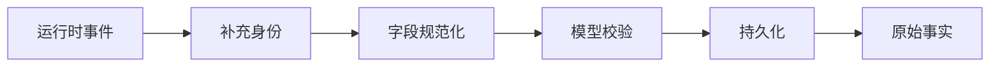

### 1.3 为什么不能直接把事件字典写入文件

如果每个事件发送方都直接拼接字典，会出现：

- `GET`、`get`、`Get` 三种 method；
- 完整 URL 泄漏资源 ID 或查询参数；
- Retry 的两次 attempt 共用一个 ID；
- Polling 的 `pending` 被错误记成成功；
- SSE 为了取 usage 提前读取流体；
- 缺少 case 上下文时仍写出无法关联的孤儿记录；
- 不同 worker 写入同一文件发生竞争。

因果链如下：

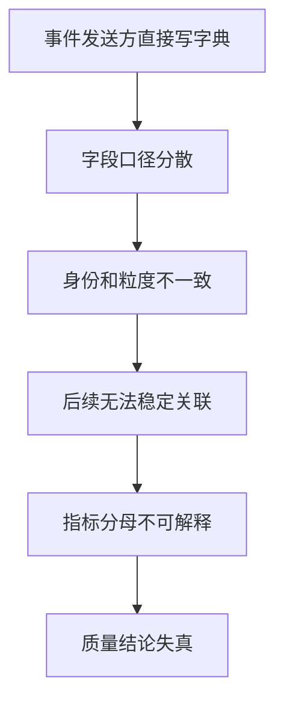

第一性原理结论：

> 采集层的首要责任不是“多记一些日志”，而是把瞬时事件压缩成边界清晰、身份稳定、字段受约束的事实。

---

## 2. TOC：当前最大约束是事实粒度混淆

TOC 约束理论要求先找到限制整个系统吞吐的关键约束。

在 Day 20，最危险的约束不是写文件速度，而是**粒度混淆**。

典型混淆包括：

- 把一条 pytest 用例当成只有一条 Case 事实；
- 把一次带 Retry 的调用当成只有一条 Request 事实；
- 把 `retryable=True` 当成“一定已经重试”；
- 把 `IntegrityIssue` 当成业务测试失败；
- 把 Semantic 关系事实当成 P0 Request 原始事实；
- 把 Allure/JUnit 报告当成 Quality 的权威输入。

### 2.1 约束因果链

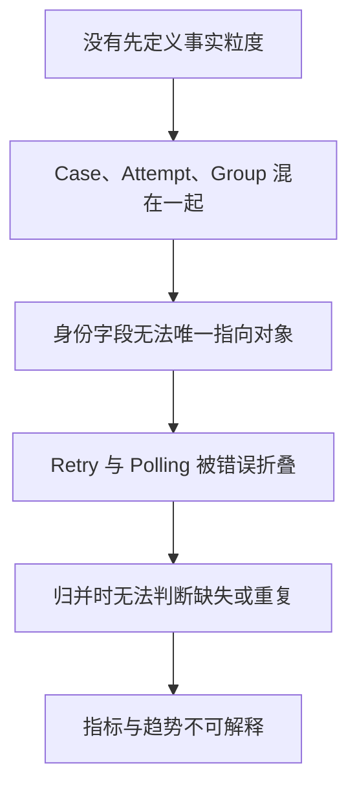

### 2.2 TOC 五步应用

| TOC 步骤 | Day 20 的动作 |
| --- | --- |
| 识别约束 | 三类事实和三种粒度容易混淆 |
| 挖尽约束 | 先固定来源、主键、落盘文件和一对多关系 |
| 服从约束 | Adapter 不跨层做业务控制，Collector 不做聚合 |
| 提升约束 | 用模型校验、独立 ID、分片文件和 Integrity 补偿 |
| 回到第一步 | 进入 Day 21 后检查提交与归并是否成为新约束 |

### 2.3 今天的判断口诀

遇到任何字段，先问四个问题：

1. **谁产生？** pytest、HTTP attempt，还是采集旁路？
2. **描述谁？** 阶段、请求尝试，还是采集缺口？
3. **用什么身份？** `invocation_id`、`request_event_id`，还是 `related_id`？
4. **写到哪里？** cases、requests，还是 integrity 分片？

---

## 3. 三层边界：发送方、适配器、事实层

当前实现把职责拆成三层。

| 层 | 典型模块 | 核心职责 | 不应该做什么 |
| --- | --- | --- | --- |
| 中性发送层 | `common/runtime_hooks.py`、请求/Retry/Polling/SSE 实现 | 发出与 Quality 无关的运行时事件 | 不导入 `quality.*`，不决定落盘格式 |
| Quality 适配层 | `quality/runtime_adapter.py` | 把中性类型和事件翻译到现有 Quality 入口 | 不发送 HTTP，不决定是否重试，不改变业务结果 |
| 事实采集层 | `quality/request_metrics.py`、pytest runtime、Collector | 补身份、规范化、建模并持久化 | 不替代 Runner，不生成最终质量指标 |

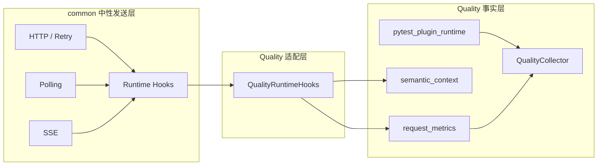

### 3.1 为什么 Adapter 必须薄

如果 Adapter 开始控制业务流程，就会形成错误依赖：

```text
Quality 是否可用
→ 决定请求是否发送
→ 决定 Retry 是否继续
→ 决定业务用例是否通过
```

这会破坏 Day 19 的可选能力合同。

正确关系是：

```text
业务流程先按自己的合同运行
→ 运行时事件被观察
→ Quality 尽力记录
→ Quality 失败不覆盖业务结果
```

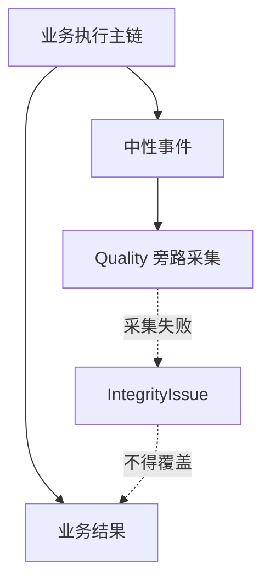

---

## 4. `QualityRuntimeHooks`：只翻译，不控制

`quality/runtime_adapter.py` 中的公开实现是：

```python
class QualityRuntimeHooks:
    """Map neutral common runtime hooks to the existing P0/P1 collectors."""
```

这句话已经给出两个关键信息：

1. 输入是 `common` 的中性 hooks；
2. 输出复用现有 P0/P1 采集入口。

### 4.1 完整事件映射表

| 中性 Hook 方法 | Quality 目标 | 作用 |
| --- | --- | --- |
| `model_id_from_kwargs()` | `semantic_context.model_id_from_kwargs()` | 从请求 JSON 中安全提取模型标识 |
| `begin_operation()` | `semantic_context.begin_operation()` | 建立 Operation 上下文 |
| `finish_operation()` | `semantic_context.finish_operation()` | 记录 Operation 结果并恢复上下文 |
| `detach_operation()` | `semantic_context.detach_operation()` | 仅解除当前 Operation 上下文 |
| `start_request_group()` | `semantic_context.start_request_group()` | 建立一次逻辑请求组 |
| `bind_request_context()` | `semantic_context.bind_request_context()` | 把 Operation、Group 等 ID 放入请求上下文 |
| `finish_request_group()` | `semantic_context.finish_request_group()` | 完成组并记录 Retry 等待时间 |
| `request_started()` | `request_metrics.start_request_capture()` | 为一次真实 attempt 建立事件 ID 和计时起点 |
| `request_succeeded()` | `request_metrics.record_response()` | 把响应规范化为 `RequestMetric` |
| `request_failed()` | `request_metrics.record_exception()` | 把异常规范化为 `RequestMetric` |
| `begin_polling_session()` | `semantic_context.begin_polling_session()` | 建立轮询会话 |
| `observe_polling_state()` | `semantic_context.observe_polling_state()` | 观察轮询状态 |
| `add_polling_sleep()` | `semantic_context.add_polling_sleep()` | 累计轮询等待 |
| `finish_polling_session()` | `semantic_context.finish_polling_session()` | 结束轮询会话 |
| `bind_stream()` | `semantic_context.bind_stream_response()` | 把 Operation ID 绑定到 Response |
| `observe_stream_line()` | `semantic_context.observe_stream_line()` | 观察 SSE 行 |
| `finish_stream()` | `semantic_context.finish_stream()` | 结束流式语义观察 |

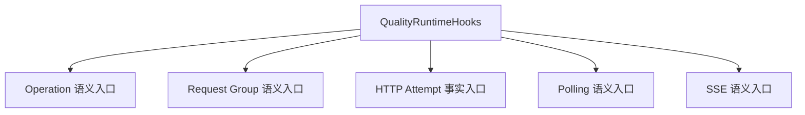

### 4.2 枚举为什么要取 `.value`

`common` 与 `quality` 拥有各自的枚举类型。

Adapter 使用 `_enum_value()`：

```python
def _enum_value(value: object) -> object:
    return value.value if isinstance(value, Enum) else value
```

这不是多余转换，而是在边界上主动去掉类型耦合：

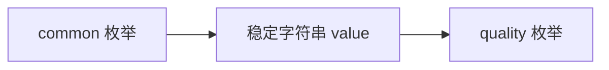

如果 Adapter 直接把 `common.RuntimeOperationOutcome` 传给 Quality，两个模块将通过具体枚举类发生隐式耦合。

### 4.3 native handle 为什么先检查类型

Operation 和 Polling 会返回 Quality 内部 handle。

Adapter 在结束事件中先判断：

```python
if isinstance(native_handle, OperationHandle):
    ...
```

或：

```python
if isinstance(native_handle, PollingSessionHandle):
    ...
```

原因是中性接口只承诺 `object | None`，不能假设任意 Provider 都返回 Quality 类型。

类型不匹配时，当前实现选择忽略，而不是强行转换。

### 4.4 Adapter 的关键边界

`QualityRuntimeHooks` 不负责：

- 计算请求 URL；
- 发送网络请求；
- 读取业务响应；
- 判断是否继续 Retry；
- 控制 Polling 何时结束；
- 消费 SSE 迭代器；
- 改写 pytest 测试状态；
- 聚合最终指标。

它只负责把已发生的中性事件送往正确的 Quality 入口。

---

## 5. 请求事实的最小单位：一次真实 attempt

`RequestMetric` 的粒度不是“一个接口”，也不是“一次业务 Operation”，而是：

> 一次真实发出的 HTTP 请求尝试，即一个 attempt。

这条定义是理解 Retry、Polling 和 SSE 的基础。

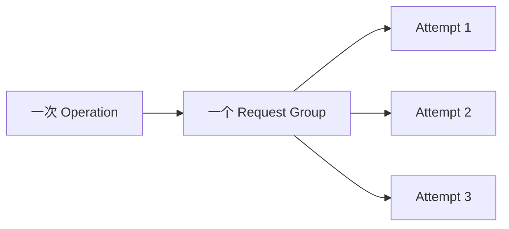

### 5.1 attempt 开始时记录什么

`start_request_capture(context)` 只有在 Collector 已安装时才工作：

```python
def start_request_capture(context: RequestContext) -> None:
    if get_collector() is None:
        return
    context.attributes[REQUEST_EVENT_ID_ATTR] = new_request_event_id()
    context.attributes[REQUEST_STARTED_ATTR] = time.perf_counter()
    context.attributes[REQUEST_METRIC_WRITTEN_ATTR] = False
```

它写入请求上下文的三个临时属性：

| 属性 | 含义 |
| --- | --- |
| `quality_request_event_id` | 当前 attempt 的唯一事件 ID |
| `quality_request_started` | 单调时钟起点，用于计算耗时 |
| `quality_request_metric_written` | 防止响应和异常路径重复写同一 attempt |

### 5.2 为什么计时使用 `perf_counter()`

事实中的 `duration_ms` 关注时间间隔，而不是墙上时钟时间。

`perf_counter()` 更适合测量经过时间；实现还用 `max(..., 0.0)` 防止得到负值。

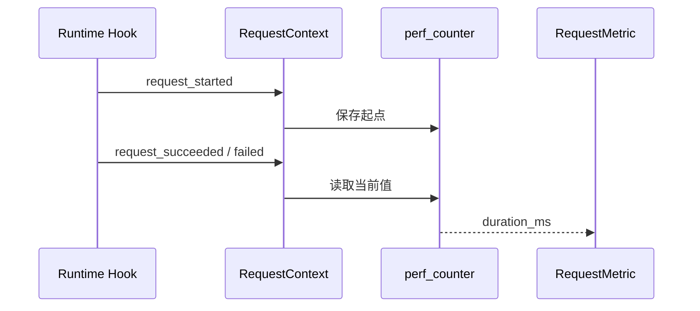

### 5.3 为什么同一 attempt 只能写一次

响应路径和异常路径都先检查 `_already_written(context)`，随后立即 `_mark_written(context)`。

这样可以避免：

- 中间件重复通知；
- 清理阶段再次通知；
- 一个异常被多层捕获后重复记录；
- 同一个 `request_event_id` 出现两条主事实。

注意：这里保证的是“当前 RequestContext 的 attempt 不重复”，不是全局去重。

---

## 6. 响应如何变成 `RequestMetric`

`record_response(context, response)` 的主链可以简化为：

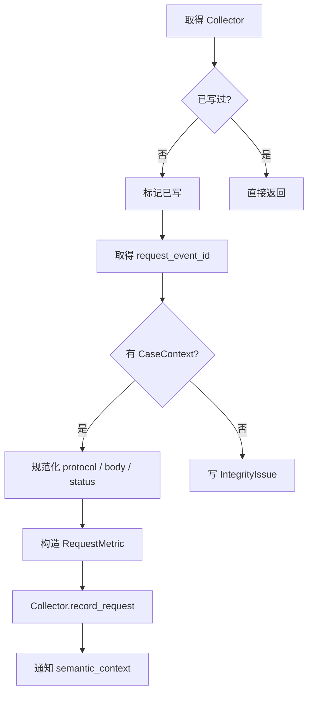

### 6.1 `RequestMetric` 字段边界

真实模型字段如下。

| 字段 | 来源 | 含义 |
| --- | --- | --- |
| `schema_version` | 模型默认值 | 当前为 `quality.v1` |
| `run_id` | Collector 的 `QualityRunContext` | 一轮 Quality 运行 |
| `execution_id` | `QualityRunContext` | 一个执行池或执行单元 |
| `worker_id` | `QualityRunContext` | 实际写分片的 worker |
| `case_id` | 当前 `CaseContext` | 稳定用例身份 |
| `invocation_id` | 当前 `CaseContext` | 本轮参数化调用身份 |
| `request_event_id` | attempt 开始时生成 | 当前真实请求尝试身份 |
| `server_request_id` | 响应头或 JSON body | 服务端返回的请求身份，可为空 |
| `interface_id` | method、path、protocol 规范化 | 接口稳定身份 |
| `method` | `RequestContext.method` | 模型会转成大写 |
| `url_template` | 对 path 做模板化 | 避免把动态资源 ID 当成接口身份 |
| `protocol` | `RequestContext.protocol` | `http`、`polling` 或 `sse` |
| `attempt_index` | context attributes | 第几次真实尝试，最小为 1 |
| `status_code` | Response | 异常路径为 `None` |
| `business_status` | 协议和响应状态推导 | `success`、`failed`、`unknown` |
| `duration_ms` | 单调时钟差值 | 当前 attempt 耗时 |
| `timeout` | 异常类型 | 是否是 `requests.Timeout` |
| `retryable` | 已有 RetryPolicy 计算 | 当前结果是否满足可重试条件 |
| `error_type` | 异常或轮询评估错误 | 可为空 |
| `usage` | 非 SSE JSON body | token、媒体数量等原始用量 |
| `cost` | 模型默认值 | 本层默认无成本来源 |

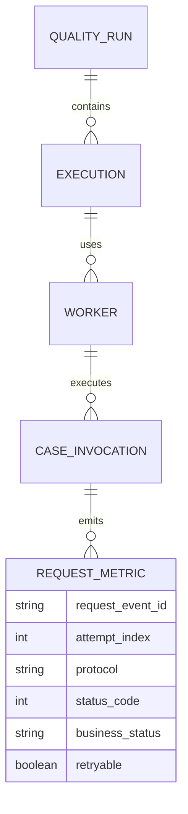

### 6.2 method 为什么在模型层转大写

`RequestMetric` 的 validator 会把 method 转成大写。

因此发送方即使传入 `get`，落盘事实也保持 `GET`。

模型校验的价值是：

```text
把“约定”变成“可执行约束”
```

### 6.3 `attempt_index` 的容错

实现从 `context.attributes["attempt_index"]` 读取：

- 必须是整数；
- 不能是布尔值；
- 必须大于等于 1；
- 不满足时退回 1。

这说明 `attempt_index` 是请求执行器提供的顺序信息，采集层只做边界校正。

### 6.4 服务端 request ID 的优先级

当前按以下响应头顺序查找：

1. `x-oneapi-request-id`
2. `x-request-id`
3. `request-id`

非 SSE 且响应 JSON 可读时，还会尝试 body 中的 `request_id`。

SSE 不读取 body，因此不会从流体中提取 `request_id`。

---

## 7. `business_status`：HTTP 成功不总等于业务终态成功

`business_status` 不是简单复制 HTTP status code。

### 7.1 HTTP 协议

| 条件 | `business_status` |
| --- | --- |
| 非 2xx | `failed` |
| 2xx | `success` |

### 7.2 SSE 协议

| 条件 | `business_status` |
| --- | --- |
| 非 2xx | `failed` |
| 2xx 握手成功 | `unknown` |

原因：2xx 只代表流式连接建立，不能证明后续所有事件都成功完成。

### 7.3 Polling 协议

2xx 响应还要使用已有 `PollingPolicy` 评估业务状态。

| Polling 评估 | `business_status` |
| --- | --- |
| `SUCCESS` | `success` |
| `PENDING` | `unknown` |
| 失败状态 | `failed` |
| 缺少 policy | `failed`，`error_type=MissingPollingPolicy` |
| 评估函数抛异常 | `failed`，同时写 Integrity |

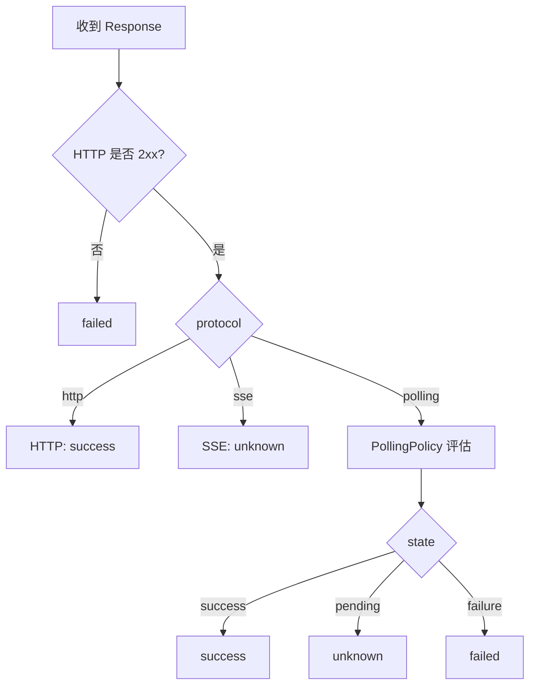

### 7.4 为什么 `unknown` 是必要状态

如果系统只允许 success/failed 二选一，会迫使采集层在证据不足时猜测。

`unknown` 表示：

> 当前 attempt 已经产生可记录事实，但这条事实本身不足以证明业务流程终态。

它不是丢数据，也不是采集失败。

---

## 8. `retryable`：满足条件，不代表已经重试

响应路径的 `retryable` 来自：

```text
存在 RetryPolicy
AND method/kwargs 允许重试
AND should_retry_response(...) 为真
```

异常路径的 `retryable` 来自：

```text
存在 RetryPolicy
AND method/kwargs 允许重试
AND should_retry_exception(...) 为真
```

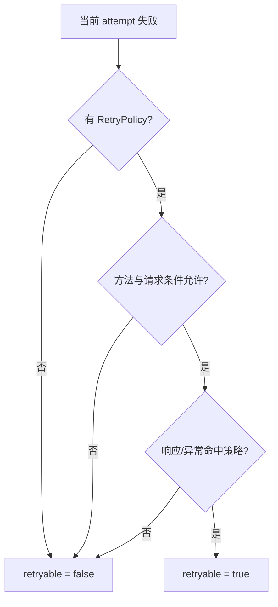

### 8.1 为什么不能从 `retryable` 推断“后面一定有下一次 attempt”

即使 `retryable=True`，仍可能因为以下条件没有继续：

- 已达到 `max_attempts`；
- 已耗尽最大 elapsed budget；
- 上层取消或中断；
- sleep 前发生其他控制异常；
- 请求执行流程提前结束。

因此：

```text
retryable = 当前结果具有可重试资格
是否真的重试 = 由执行器和剩余预算共同决定
```

这也是为什么后续必须以实际出现的 `RequestMetric` 为准，而不能根据策略推测 attempt 数量。

---

## 9. 异常如何变成 `RequestMetric`

请求没有拿到 Response 时，`record_exception(context, error)` 仍会写一条 attempt 事实。

它与响应路径共享：

- Collector 检查；
- 重复写保护；
- `request_event_id`；
- CaseContext；
- `interface_id`；
- `attempt_index`；
- duration 计算；
- Semantic 观察入口。

但异常路径固定或推导以下字段：

| 字段 | 异常路径值 |
| --- | --- |
| `status_code` | `None` |
| `business_status` | `failed` |
| `timeout` | `isinstance(error, requests.Timeout)` |
| `retryable` | 使用已有异常重试策略判断 |
| `error_type` | `type(error).__name__` |
| `usage` | 空的 `RequestUsage` |

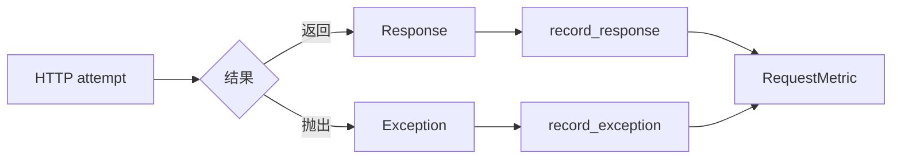

### 9.1 为什么异常也必须有 `request_event_id`

异常不代表“请求不存在”。

DNS、连接、TLS、读取超时等异常都可能发生在一次真实 attempt 中。如果异常路径不记录 attempt：

- Retry attempt 数会少；
- 失败耗时会消失；
- timeout 比例无法计算；
- Semantic group 无法关联该次失败；
- 最终成功会掩盖前面的真实失败成本。

### 9.2 缺少 CaseContext 时为什么不写 Request 主事实

`record_response()` 和 `record_exception()` 都要求当前存在 `CaseContext`。

缺少时：

1. 不写 `requests-*.jsonl`；
2. 写一条 `IntegrityIssue`；
3. `code="missing_case_context"`；
4. `related_id` 指向当前 `request_event_id`。

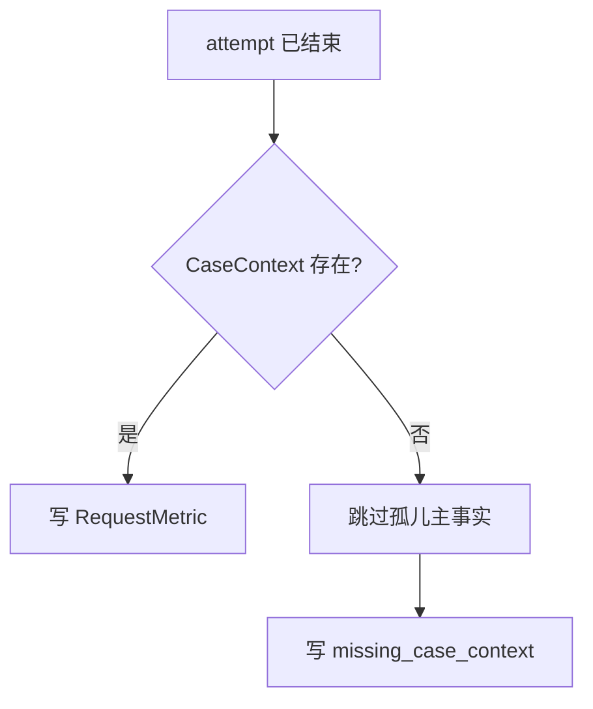

为什么宁可缺一条 Request 主事实，也不写孤儿记录？

因为一条无法归属 case invocation 的 Request 事实，会把“不完整”伪装成“完整但无法解释”。

显式 Integrity 比不可关联的主事实更诚实。

---

## 10. Retry：一个逻辑组，多条真实 attempt 事实

一次带 Retry 的调用至少涉及三种粒度：

| 粒度 | 当前对象 | 数量关系 |
| --- | --- | --- |
| 业务 Operation | `Operation` | 通常 1 个 |
| 逻辑请求组 | `Request Group` | 通常 1 个 |
| 真实请求尝试 | `RequestMetric` | 1～N 条 |

例如第一次返回 503，第二次返回 200：

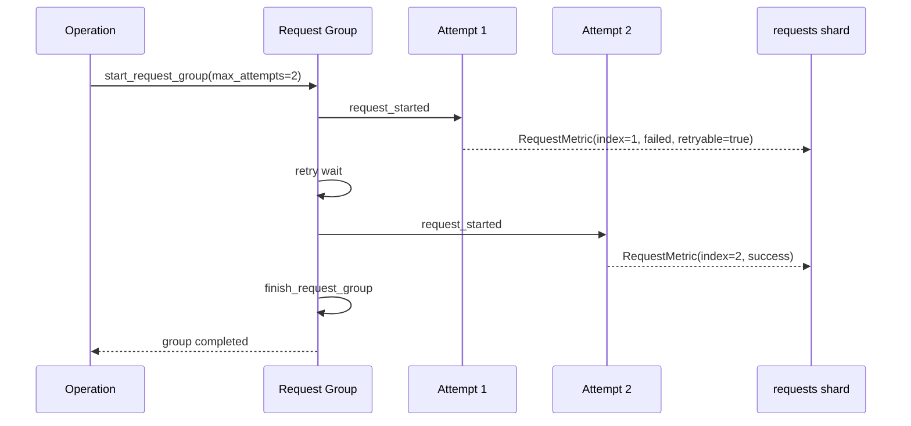

### 10.1 两次 attempt 必须拥有不同事件 ID

每次调用 `start_request_capture()` 都会生成新的 `request_event_id`。

因此正确事实类似：

```json
{"attempt_index": 1, "request_event_id": "event-a", "business_status": "failed"}
{"attempt_index": 2, "request_event_id": "event-b", "business_status": "success"}
```

错误做法是两条记录共用同一个事件 ID，因为那会让后续消费者无法判断：

- 是重复写；
- 还是同一组的两次真实尝试。

### 10.2 Group 如何看到 attempt

当 Adapter 调用 `bind_request_context()` 时，Semantic 层把 `request_group_id` 放入 RequestContext attributes。

`RequestMetric` 写入后，`request_metrics` 再调用：

```python
observe_request_metric(context, metric)
```

Semantic Collector 因而可以把 `metric.request_event_id` 加入 group 的 `attempt_event_ids`。

本课只需要理解这个关联入口，不展开 Day 22 的语义归并合同。

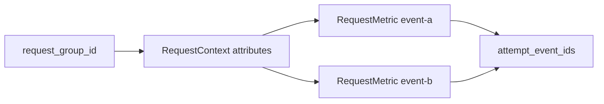

### 10.3 Retry 等待时间不是 attempt duration

`duration_ms` 只描述当前 HTTP attempt 的经过时间。

Retry sleep 由 Request Group 记录为 `retry_wait_seconds`，最终语义事实中表现为等待时间。

不要把两者相加后覆盖任一原始字段，因为：

- attempt duration 是传输事实；
- retry wait 是策略等待事实；
- operation 总耗时是更高层派生事实。

### 10.4 真实测试如何证明这一点

`tests/quality/test_runtime_fact_compatibility.py` 验证：

- 两条 metric 的 `attempt_index` 为 `[1, 2]`；
- 只有一个 group 和一个 operation；
- group 的 `attempt_event_ids` 与两条 metric 的事件 ID 对齐；
- Retry 等待为 10ms；
- usage 来自最终响应并归入 Operation。

这证明 Runtime Hook 间接层没有破坏原有事实关系。

---

## 11. Polling：每次查询是 Request，整段等待是 Session

Polling 容易产生另一个粒度混淆。

假设业务不断查询任务状态：

```text
queued → processing → succeeded
```

这里至少有：

- 一个 Polling Session；
- 三次真实 HTTP 查询；
- 三条 `RequestMetric`；
- 三次状态观察；
- 两段或多段 sleep；
- 一个最终 Polling outcome。

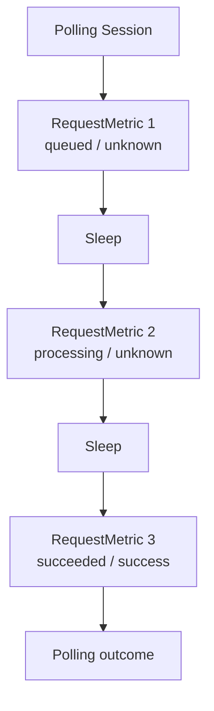

### 11.1 Polling 的双通道记录

当前 Adapter 同时使用两类入口：

| 事件 | 入口 | 记录重点 |
| --- | --- | --- |
| 每次 HTTP attempt 开始/结束 | `request_metrics` | Request 原始事实 |
| Session 开始/状态/sleep/结束 | `semantic_context` | 轮询关系与整体语义 |

因此不能说“Polling 只产生一条 RequestMetric”。

### 11.2 Pending 为什么是 `unknown`

Polling 的 pending 响应不是失败，也不是终态成功。

它准确表达：

```text
本次查询成功返回
但被查询任务尚未到达成功终态
```

如果把 pending 记成 success，会抬高业务成功 attempt；如果记成 failed，又会夸大失败。

### 11.3 Polling Policy 为什么必须复用执行策略

采集层调用 `evaluate_polling_response(response, context.polling_policy)`。

它没有重新发明一套状态判断规则，而是复用执行阶段已有的 policy。

这是“事实口径服从执行合同”的例子：

```mermaid
flowchart LR
    P[PollingPolicy]
    E[执行器终态判断]
    Q[Quality 状态解释]
    S[一致的业务状态口径]

    P --> E --> S
    P --> Q --> S
```

### 11.4 评估失败为什么既返回 failed 又写 Integrity

当 Polling 评估函数抛异常时，当前实现：

1. 写 `polling_metric_evaluation_failed`；
2. 当前 metric 的 `business_status` 记为 `failed`；
3. `error_type` 记录异常类型。

这里同时表达两件不同事实：

- 当前 attempt 无法被确认成成功；
- 采集解释过程本身发生异常，数据完整性受损。

---

## 12. SSE：握手 attempt 与流式消费不是同一事实

SSE 请求首先仍会发生一次 HTTP attempt。

因此初始响应可以形成一条 `RequestMetric`：

- `protocol="sse"`；
- 2xx 时 `business_status="unknown"`；
- 保留 status code、duration、request ID 等；
- 不读取流式 body；
- usage 默认空。

后续每一行流式数据由 Semantic 入口观察。

```mermaid
sequenceDiagram
    participant C as Client
    participant H as HTTP attempt
    participant M as RequestMetric
    participant S as SSE iterator
    participant Q as Semantic Context

    C->>H: 建立 SSE 请求
    H-->>M: 2xx, protocol=sse, status=unknown
    H-->>S: 返回可迭代 Response
    loop 每一行
        S->>Q: observe_stream_line
    end
    S->>Q: finish_stream(outcome)
```

### 12.1 为什么 SSE 不能调用 `response.json()`

流式响应的 body 可能：

- 尚未完整到达；
- 需要业务代码逐行消费；
- 很大或持续很久；
- 读取一次后无法再次读取。

采集层若提前读取，会改变业务行为。

因此 `_response_json()` 在 `Protocol.SSE` 时直接返回 `None`。

`test_sse_does_not_read_response_body` 会把 `response.json()` 替换成一旦调用就失败的函数，用来证明采集没有偷读 body。

### 12.2 SSE 的 2xx 为什么不能记成 success

握手成功后仍可能出现：

- 中途网络断开；
- 错误事件；
- 流被提前取消；
- 业务结束标记缺失；
- 解析失败。

因此初始 RequestMetric 只能说“连接 attempt 得到 2xx”，不能替整个流宣判成功。

---

## 13. Case 事实来自 pytest，不来自 Runtime Adapter

这是本课最重要的边界之一。

`QualityRuntimeHooks` 只处理 Operation、Request、Polling、SSE 等运行时事件。

`CaseResult` 由 `quality/pytest_plugin_runtime.py` 产生。

```mermaid
flowchart LR
    PY[pytest 生命周期]
    PR[pytest_plugin_runtime]
    CR[CaseResult]
    RH[Runtime Hooks]
    RA[runtime_adapter]
    RM[RequestMetric]

    PY --> PR --> CR
    RH --> RA --> RM
```

### 13.1 CaseContext 在哪里建立

`pytest_runtest_protocol()` 包裹整个测试协议：

1. 从 item 构造 `CaseContext`；
2. 用 ContextVar 设置当前 case；
3. 让 setup/call/teardown 在该上下文中执行；
4. 最后清理语义待完成对象；
5. reset CaseContext。

```mermaid
sequenceDiagram
    participant P as pytest_runtest_protocol
    participant C as CaseContext
    participant T as Test phases
    participant S as Semantic Collector

    P->>C: build + set
    P->>T: yield
    T->>T: setup / call / teardown
    T-->>P: 完成
    P->>S: finalize_pending(invocation_id)
    P->>C: reset
```

### 13.2 一次用例为什么可能有三条 `CaseResult`

`pytest_runtest_logreport()` 只接收：

- `setup`；
- `call`；
- `teardown`。

每收到一个阶段 report，就构造一条 `CaseResult`。

因此一个正常用例常见三条阶段事实，而不是一条。

| pytest 阶段 | `CasePhase` | 可能状态示例 |
| --- | --- | --- |
| setup | `setup` | passed / failed / skipped |
| call | `call` | passed / failed / xfailed / xpassed |
| teardown | `teardown` | passed / failed |

### 13.3 `CaseResult` 的主要字段

| 字段 | 含义 |
| --- | --- |
| `run_id` | 所属 Quality run |
| `execution_id` | 所属执行池 |
| `worker_id` | 产生阶段事实的 worker |
| `case_id` | 稳定用例身份 |
| `invocation_id` | 当前参数化调用身份 |
| `nodeid` | pytest nodeid |
| `param_hash` | 参数身份摘要 |
| `phase` | setup/call/teardown |
| `raw_status` | 当前阶段原始状态 |
| `final_status` | 当前实现初始等于 raw status |
| `duration_ms` | 当前阶段耗时 |
| `start_time` / `end_time` | 当前阶段时间边界 |
| `failure_id` | 可选失败身份 |
| `evidence_refs` | 可选证据引用 |

### 13.4 阶段事实如何折叠成调用状态

`quality/case_lifecycle.py` 提供 `fold_case_status()`：

优先级是：

```text
ERROR > FAILED > SKIPPED/XFAILED > PASSED
```

```mermaid
flowchart TD
    A[同一 invocation 的阶段事实]
    B{含 ERROR?}
    C[ERROR]
    D{含 FAILED?}
    E[FAILED]
    F{含 SKIPPED 或 XFAILED?}
    G[SKIPPED]
    H[PASSED]

    A --> B
    B -- 是 --> C
    B -- 否 --> D
    D -- 是 --> E
    D -- 否 --> F
    F -- 是 --> G
    F -- 否 --> H
```

注意：折叠函数的存在进一步证明，阶段 `CaseResult` 本身不是最终“一用例一行”的汇总产物。

---

## 14. 三类事实边界：Case、Request、Integrity

### 14.1 总表

| 模型 | 谁产生 | 最小粒度 | 主要定位字段 | 分片文件 | 不代表什么 |
| --- | --- | --- | --- | --- | --- |
| `CaseResult` | pytest runtime plugin | 一个 pytest 阶段 | `invocation_id + phase` | `cases-{execution_id}-{worker_id}.jsonl` | 不等于整个 run 结论 |
| `RequestMetric` | request metrics，经 Adapter 触发 | 一个真实 HTTP attempt | `request_event_id` | `requests-{execution_id}-{worker_id}.jsonl` | 不等于一个 Operation 或最终指标 |
| `IntegrityIssue` | pytest、Adapter、Collector 等旁路 | 一个采集/写入/解释问题 | `code + related_id + created_at` | `integrity-{execution_id}-{worker_id}.jsonl` | 不等于业务用例失败 |

```mermaid
flowchart TD
    RUN[Quality Run]
    CASE[CaseResult<br/>pytest phase]
    REQ[RequestMetric<br/>HTTP attempt]
    INT[IntegrityIssue<br/>采集缺口]

    RUN --> CASE
    RUN --> REQ
    RUN --> INT

    CASE -.通过 invocation_id.-> REQ
    INT -.related_id 可指向.-> CASE
    INT -.related_id 可指向.-> REQ
```

### 14.2 三个常见错误判断

**错误一：requests 分片为空，所以用例没有执行。**

不一定。用例可能不发送 HTTP，也可能缺少 CaseContext 导致 Request 被跳过，必须结合 cases 和 integrity 判断。

**错误二：integrity 分片出现一条记录，所以业务测试失败。**

不一定。Integrity 表示事实链可能不完整；业务状态仍由 pytest、Runner 等主链决定。

**错误三：cases 分片中有三行，所以测试执行了三次。**

不一定。它们很可能是同一 invocation 的 setup/call/teardown 三个阶段。

### 14.3 先看粒度，再看数量

```mermaid
flowchart LR
    N[看到 JSONL 行数]
    G[确认模型粒度]
    I[检查身份字段]
    R[重建一对多关系]
    C[最后得出数量结论]

    N --> G --> I --> R --> C
```

---

## 15. 身份链：从 run 到 attempt

Day 20 需要掌握的身份层级如下：

```mermaid
flowchart TD
    R[run_id<br/>一轮 Quality 运行]
    E[execution_id<br/>执行池/执行单元]
    W[worker_id<br/>实际写入者]
    C[case_id<br/>稳定用例]
    I[invocation_id<br/>本轮参数化调用]
    P[phase<br/>pytest 阶段]
    Q[request_event_id<br/>真实 attempt]

    R --> E --> W --> C --> I
    I --> P
    I --> Q
```

### 15.1 为什么 `case_id` 和 `invocation_id` 都需要

参数化用例中：

- `case_id` 表示稳定测试定义；
- `invocation_id` 表示本轮具体参数调用。

如果只保存 `case_id`，多个参数调用的 Request 会混在一起。

### 15.2 为什么 `request_event_id` 不能用 `invocation_id` 代替

一次 invocation 可以：

- 请求多个接口；
- 对同一接口 Retry 多次；
- Polling 多次；
- 同时产生普通 HTTP 与 SSE 请求。

因此关系是：

```text
一个 invocation_id → 零到多条 request_event_id
```

### 15.3 `server_request_id` 为什么不是主身份

服务端 ID 可能：

- 根本不返回；
- 不同供应商使用不同响应头；
- 只在 JSON body 中出现；
- SSE 无法安全读取 body；
- 在网络异常时不存在。

所以本地必须生成独立的 `request_event_id`，服务端 ID 只能作为可选关联字段。

---

## 16. Collector：把模型写入 worker 自有分片

`QualityCollector` 初始化时接收 `QualityRunContext`，其中包含：

- `run_id`；
- `execution_id`；
- `worker_id`；
- `output_dir`。

它创建三个路径：

```text
shards/cases-{execution_id}-{worker_id}.jsonl
shards/requests-{execution_id}-{worker_id}.jsonl
shards/integrity-{execution_id}-{worker_id}.jsonl
```

例如：

```text
shards/cases-serial-pool-master.jsonl
shards/requests-serial-pool-master.jsonl
shards/integrity-serial-pool-master.jsonl
```

```mermaid
flowchart TD
    RC[QualityRunContext]
    QC[QualityCollector]
    C[cases-execution-worker.jsonl]
    R[requests-execution-worker.jsonl]
    I[integrity-execution-worker.jsonl]

    RC --> QC
    QC --> C
    QC --> R
    QC --> I
```

### 16.1 为什么按 execution 和 worker 分片

如果所有 worker 共同追加同一个文件，会产生：

- 多进程写竞争；
- 行内容交错；
- 一个 worker 重启时无法只清理自己的旧文件；
- 无法判断哪个执行单元漏交数据；
- 归并阶段缺少提交边界。

分片后，每个 worker 只拥有自己的三个文件。

### 16.2 初始化为什么清空当前 worker 的三个文件

Collector 初始化时对三个路径执行空文本写入。

这解决的是同一个 execution/worker 组合在本地重复启动时残留旧事实的问题。

同时测试会验证：重新初始化 worker A，只清理 worker A 的分片，不影响 worker B。

### 16.3 `RLock` 解决什么，不解决什么

Collector 使用实例级 `RLock` 包裹 `_append()`。

它解决：

- 同一个进程；
- 同一个 Collector 实例；
- 多线程同时追加；
- 保证单次 JSONL append 不互相穿插。

它不解决：

- 多个进程共同写一个文件；
- 多台机器共同写一个文件；
- worker 崩溃后的事务恢复；
- 分片是否完整提交。

这些问题分别由 worker 分片和后续 Day 21 的提交/归并合同处理。

```mermaid
flowchart LR
    T1[Thread 1]
    T2[Thread 2]
    T3[Thread 3]
    L[RLock]
    F[当前 worker JSONL]

    T1 --> L
    T2 --> L
    T3 --> L
    L --> F
```

### 16.4 三个公开写入口

| 方法 | 接收模型 | 写入文件 |
| --- | --- | --- |
| `record_case()` | `CaseResult` | cases 分片 |
| `record_request()` | `RequestMetric` | requests 分片 |
| `record_integrity()` | `IntegrityIssue` | integrity 分片 |

此外 `capture_integrity()` 用普通字段构造 `IntegrityIssue`，再调用 `record_integrity()`。

---

## 17. 主事实写失败：不能静默，也不能反杀业务

Collector 把 Case 和 Request 称为主事实。

`record_case()` 和 `record_request()` 都进入 `_record_primary()`：

```python
try:
    self._append(path, record)
    return True
except Exception as error:
    self.capture_integrity(...)
    return False
```

### 17.1 两个必须同时满足的目标

采集失败时，系统同时需要：

1. **业务主链不中断**：不能因为磁盘或序列化问题把原本通过的接口用例改成失败；
2. **事实缺口可见**：不能假装数据完整。

这两个目标通过返回 `False` 和写 Integrity 同时实现。

```mermaid
flowchart TD
    A[写 Case/Request 主事实]
    B{append 成功?}
    C[返回 true]
    D[捕获异常]
    E[写 IntegrityIssue]
    F[返回 false]
    G[业务主链继续]

    A --> B
    B -- 是 --> C --> G
    B -- 否 --> D --> E --> F --> G
```

### 17.2 主事实写失败使用什么 code

| 主事实 | Integrity code | `related_id` |
| --- | --- | --- |
| Case | `case_write_failed` | `invocation_id` |
| Request | `request_write_failed` | `request_event_id` |

source 固定为 `collector`，severity 为 `error`。

### 17.3 如果连 Integrity 也写失败怎么办

`record_integrity()` 自己失败时：

- 不再递归创建新的 Integrity；
- 向 warning sink 输出警告；
- 返回 `False`；
- 仍不抛出到业务主链。

如果“Integrity 写失败”再次尝试写 Integrity，会造成无限递归。

```mermaid
flowchart LR
    P[主事实写失败]
    I[尝试写 Integrity]
    W{Integrity 写成功?}
    OK[留下可见缺口]
    WARN[仅 warning]

    P --> I --> W
    W -- 是 --> OK
    W -- 否 --> WARN
```

### 17.4 Adapter 自身调用失败的旁路

`request_started()`、`request_succeeded()`、`request_failed()` 都通过 `_capture_request_call()` 调用 request metrics。

如果内部函数抛异常，Adapter：

1. 查找当前 Collector；
2. 写 `source="request_metrics"`；
3. 写 `code="request_capture_failed"`；
4. 尝试把当前 `request_event_id` 作为 `related_id`；
5. 不重新抛出。

这层保护覆盖的是“采集函数意外抛出”，而 Collector 的 `_record_primary()` 覆盖的是“追加主事实失败”。

### 17.5 两层 fail-open 不重复吗

不重复，它们保护不同边界：

| 保护层 | 捕获范围 | 典型问题 |
| --- | --- | --- |
| Adapter `_capture_request_call()` | 整个 request metrics 调用 | 编程错误、模型构造异常、未预期异常 |
| Collector `_record_primary()` | JSONL 主事实追加 | 磁盘满、权限、I/O、序列化写失败 |

```mermaid
flowchart TD
    H[Runtime Hook]
    A[Adapter 保护层]
    M[request_metrics 建模]
    C[Collector 保护层]
    F[JSONL]
    IA[request_capture_failed]
    IC[request_write_failed]

    H --> A --> M --> C --> F
    A -.调用异常.-> IA
    C -.写入异常.-> IC
```

---

## 18. `IntegrityIssue`：描述证据链受损，不替代业务状态

`IntegrityIssue` 字段包括：

| 字段 | 含义 |
| --- | --- |
| `schema_version` | Quality 模型版本 |
| `run_id` | 所属运行 |
| `severity` | `info`、`warn`、`error` |
| `source` | 问题来自哪个采集组件 |
| `code` | 稳定机器码 |
| `message` | 脱敏后的可读说明 |
| `related_id` | 可选关联对象 ID |
| `created_at` | 带时区时间 |

### 18.1 本课涉及的典型 code

| code | 来源 | 表示什么 |
| --- | --- | --- |
| `request_capture_failed` | Adapter | Request 采集调用意外失败 |
| `missing_case_context` | request metrics / semantic context | 无法把事实归属到 case |
| `polling_metric_evaluation_failed` | request metrics | Polling 状态解释异常 |
| `case_context_build_failed` | pytest plugin | 无法建立或取得 CaseContext |
| `case_write_failed` | pytest plugin / Collector | Case 建模或写入失败 |
| `request_write_failed` | Collector | Request 主事实写入失败 |

### 18.2 为什么 Integrity 不直接让测试失败

把采集问题直接升级为业务失败，会产生新的因果倒置：

```text
观察系统故障
→ 被观察系统状态被改写
→ 测试结论不再描述业务
```

正确做法是把两条轴分开：

```mermaid
quadrantChart
    title 业务结果与事实完整性是两条轴
    x-axis 业务失败 --> 业务成功
    y-axis 证据不完整 --> 证据完整
    quadrant-1 成功且证据完整
    quadrant-2 失败但证据完整
    quadrant-3 失败且证据不完整
    quadrant-4 成功但证据不完整
```

一条用例完全可能：

- 业务通过；
- 但 RequestMetric 写失败；
- 因而 Quality 完整性降级。

业务结论和证据可信度必须分别表达。

### 18.3 错误消息为什么要脱敏

Collector 的 `_safe_message()` 会调用 Quality 脱敏逻辑，并要求移除 URL query。

这是因为异常文本可能包含：

- token；
- Authorization；
- API key；
- 带敏感查询参数的 URL；
- 请求 payload 片段。

测试会故意抛出带 `token=secret` 的异常，再断言落盘消息不包含 `secret`。

---

## 19. 全链路：从 pytest 用例到三个 worker 分片

下面把 Day 18～20 的真实主链合在一起。

```mermaid
flowchart TD
    P[pytest_runtest_protocol]
    CC[设置 CaseContext]
    T[业务 Test / Task]
    BR[BaseRequest]
    RH[中性 Runtime Hooks]
    QA[QualityRuntimeHooks]
    RM[request_metrics]
    SM[semantic_context]
    PR[pytest_runtest_logreport]
    CR[CaseResult]
    RQ[RequestMetric]
    II[IntegrityIssue]
    QC[QualityCollector]
    CF[cases shard]
    RF[requests shard]
    IF[integrity shard]

    P --> CC --> T --> BR --> RH --> QA
    QA --> RM --> RQ --> QC
    QA --> SM
    P --> PR --> CR --> QC
    RM -.异常/缺失.-> II --> QC
    QA -.调用失败.-> II
    QC --> CF
    QC --> RF
    QC --> IF
```

### 19.1 HTTP 成功链

```mermaid
sequenceDiagram
    participant P as pytest plugin
    participant B as BaseRequest
    participant H as Runtime Hooks
    participant A as Quality Adapter
    participant M as request_metrics
    participant C as Collector

    P->>P: set CaseContext
    B->>H: request_started(context)
    H->>A: request_started
    A->>M: start_request_capture
    B->>B: session.request
    B->>H: request_succeeded(context, response)
    H->>A: request_succeeded
    A->>M: record_response
    M->>C: record_request(RequestMetric)
    P->>C: record_case(CaseResult per phase)
```

### 19.2 HTTP 异常链

```mermaid
sequenceDiagram
    participant B as BaseRequest
    participant H as Runtime Hooks
    participant A as Quality Adapter
    participant M as request_metrics
    participant C as Collector

    B->>H: request_started
    B->>B: session.request raises
    B->>H: request_failed(context, error)
    H->>A: request_failed
    A->>M: record_exception
    M->>C: RequestMetric(status_code=None)
    C-->>B: fail-open，不改写业务异常
```

### 19.3 采集异常链

```mermaid
sequenceDiagram
    participant B as 业务主链
    participant A as Quality Adapter
    participant M as request_metrics
    participant C as Collector

    B->>A: request_succeeded
    A->>M: record_response
    M--xA: unexpected exception
    A->>C: capture_integrity(request_capture_failed)
    A-->>B: 正常返回，不重新抛出
```

---

## 20. P0 原始事实与 Semantic 关系的边界

源码注释中，Adapter 会把事件映射到现有 P0/P1 Collector。

初学者最容易把两者混为一谈。

### 20.1 本课只要求掌握的差异

| 维度 | P0 原始事实 | Semantic 关系事实 |
| --- | --- | --- |
| 典型对象 | `CaseResult`、`RequestMetric`、`IntegrityIssue` | Operation、Request Group、Polling Session 等 |
| 关注点 | 实际发生了哪些阶段和 attempt | 这些 attempt 属于哪个业务关系 |
| Request 入口 | `request_metrics` | `semantic_context.observe_request_metric()` |
| 是否为本课主目标 | 是 | 只理解入口，不深入归并 |

```mermaid
flowchart LR
    M1[RequestMetric event-a]
    M2[RequestMetric event-b]
    P0[P0 原始 attempt 事实]
    G[Request Group]
    O[Operation]
    SEM[Semantic 关系]

    M1 --> P0
    M2 --> P0
    M1 --> G
    M2 --> G
    G --> O
    O --> SEM
```

### 20.2 为什么 Adapter 同时送两条路径

只写 P0，后续仍知道每次 attempt 发生了什么，但不一定知道多个 attempt 如何组成业务 Operation。

只写 Semantic，又会失去逐 attempt 的原始字段和独立证据。

因此正确结构是：

```text
每次真实 attempt 先形成 P0 RequestMetric
→ 再把该 metric 的事件 ID交给 Semantic 关系上下文
```

### 20.3 今天不要提前做的聚合

不要在 Collector 中提前：

- 只保留最终成功 attempt；
- 把 Retry 多条 RequestMetric 合并成一行；
- 把 Polling pending 记录删除；
- 汇总 Operation 总时长；
- 计算成功率、重试率、token 总量；
- 宣布完整性通过。

这些操作会破坏原始事实可追溯性，且属于后续消费者职责。

---

## 21. 最小源码阅读路线

初学者不要一开始遍历整个 `quality/`。按以下顺序阅读，每一步只回答一个问题。

### 第一步：看 Adapter 公开面

文件：`quality/runtime_adapter.py`

重点：

- `QualityRuntimeHooks` 有哪些方法；
- 哪些方法进入 `request_metrics`；
- 哪些方法进入 `semantic_context`；
- `_capture_request_call()` 如何 fail-open；
- handle 和枚举如何转换。

### 第二步：看 Request attempt 建模

文件：`quality/request_metrics.py`

阅读顺序：

1. `start_request_capture()`；
2. `record_response()`；
3. `record_exception()`；
4. `_response_business_status()`；
5. `_response_retryable()` / `_exception_retryable()`；
6. `_response_json()`；
7. `_record_missing_case()`。

### 第三步：看三个模型

文件：`quality/models.py`

只定位：

- `IntegrityIssue`；
- `CaseResult`；
- `RequestMetric`；
- `RequestUsage`；
- 对应枚举和 validator。

### 第四步：看 Case 来源

文件：`quality/pytest_plugin_runtime.py`

只定位：

- `pytest_runtest_protocol()`；
- `pytest_runtest_logreport()`；
- `CaseResult(...)`；
- `collector.record_case(...)`。

再读 `quality/case_lifecycle.py` 的 `fold_case_status()`。

### 第五步：看落盘边界

文件：`quality/collector.py`

只定位：

- 三个分片路径；
- 初始化清空；
- `record_case()`；
- `record_request()`；
- `capture_integrity()`；
- `_record_primary()`；
- `_append()` 与 `RLock`；
- 全局 Collector 注册表。

### 第六步：最后看关系入口

文件：`quality/semantic_context.py`

本课只理解：

- Operation handle；
- Request Group ID 如何绑定 RequestContext；
- `observe_request_metric()` 如何拿到 group ID；
- Polling 与 Stream 事件有独立上下文。

```mermaid
flowchart LR
    A[runtime_adapter.py]
    B[request_metrics.py]
    C[models.py]
    D[pytest_plugin_runtime.py]
    E[collector.py]
    F[semantic_context.py]

    A --> B --> C --> D --> E --> F
```

---

## 22. 离线实践：从测试到真实 JSONL

所有实验都可以离线运行，不需要访问真实外部 API。

### 实验一：运行 Adapter、Collector、RequestMetric 专项测试

```powershell
.\.venv\Scripts\python.exe -m pytest `
  tests\quality\test_runtime_adapter.py `
  tests\quality\test_quality_collector.py `
  tests\quality\test_quality_request_metrics.py `
  -q
```

你应重点核对：

- Adapter 能把 P0 metric 关联到已有 Semantic group；
- request metrics 抛异常时写 `request_capture_failed`；
- Collector 创建三个 worker 分片；
- 多线程追加不会破坏 JSONL；
- Retry 每次真实 attempt 都产生一条 metric；
- Polling 复用已有 policy；
- SSE 不读取 body；
- 缺少 CaseContext 时只写 Integrity。

### 实验二：验证 Runtime Hook 间接层不破坏事实关系

```powershell
.\.venv\Scripts\python.exe -m pytest `
  tests\quality\test_runtime_fact_compatibility.py `
  -q
```

这个测试不是只验证“没有报错”，而是在验证：

```text
common 中性事件
→ Quality Adapter
→ P0 RequestMetric
→ Semantic Group / Operation
```

经过间接层后，attempt 顺序、事件 ID、Retry 等待和 usage 关系仍保持不变。

### 实验三：运行 enabled 离线黄金用例

使用唯一临时目录，避免与 Day 19 或其他运行混淆。

```powershell
$output = Join-Path $env:TEMP `
  ('llm-api-case-day20-' + [guid]::NewGuid().ToString('N'))

$env:QUALITY_ENABLE = '1'
$env:QUALITY_RUN_ID = 'day20-fact-demo'
$env:QUALITY_OUTPUT_DIR = $output
$env:QUALITY_SEMANTIC_ENABLE = '0'
$env:QUALITY_METRICS_ENABLE = '0'
$env:QUALITY_FLAKY_HISTORY_ENABLE = '0'
$env:QUALITY_FLAKY_STATE_ENABLE = '0'
$env:GENERATE_ALLURE_REPORT = 'FALSE'
$env:GENERATE_HISTORY_REPORT = 'FALSE'

.\.venv\Scripts\python.exe .\run_master.py `
  .\module\offline_framework_example\test_full_framework_flow.py `
  -q

Write-Output "Runner exit: $LASTEXITCODE"
Write-Output "Quality output: $output"

Get-ChildItem -LiteralPath (Join-Path $output 'shards') -File |
  Select-Object Name, Length
```

你应至少看到当前 worker 的三个文件：

```text
cases-serial-pool-master.jsonl
requests-serial-pool-master.jsonl
integrity-serial-pool-master.jsonl
```

即使 integrity 文件没有内容，它也会在 Collector 初始化时被创建。

在当前仓库的离线黄金用例中，一次已验证运行观察到：

```text
1 passed
cases shard: 3 行
requests shard: 8 行
integrity shard: 0 行
```

这组数量只描述该用例当前实现，不是框架固定常量。运行时还可能出现 `record_property` 与 `junit_family=xunit2` 的 pytest warning；只要用例通过且 Quality 分片正常生成，它不是本课所讨论的采集失败。

### 实验四：读取 Case 阶段事实

在实验三的同一个 PowerShell 会话中执行：

```powershell
$caseShard = Get-ChildItem `
  -LiteralPath (Join-Path $output 'shards') `
  -Filter 'cases-*.jsonl' |
  Select-Object -First 1

Get-Content -LiteralPath $caseShard.FullName -Encoding UTF8 |
  ForEach-Object { $_ | ConvertFrom-Json } |
  Select-Object nodeid, invocation_id, phase, raw_status, duration_ms |
  Format-Table -AutoSize
```

观察重点：

- 同一 `invocation_id` 是否出现 setup/call/teardown；
- 每个阶段是否有独立 duration；
- 行数为什么不能直接解释成“执行次数”。

### 实验五：读取 Request attempt 事实

```powershell
$requestShard = Get-ChildItem `
  -LiteralPath (Join-Path $output 'shards') `
  -Filter 'requests-*.jsonl' |
  Select-Object -First 1

Get-Content -LiteralPath $requestShard.FullName -Encoding UTF8 |
  ForEach-Object { $_ | ConvertFrom-Json } |
  Select-Object `
    invocation_id, request_event_id, interface_id, method, url_template, `
    protocol, attempt_index, status_code, business_status, `
    timeout, retryable, duration_ms |
  Format-Table -AutoSize
```

观察重点：

- 每一行是否都有独立 `request_event_id`；
- `method` 是否大写；
- `url_template` 和 `interface_id` 是否使用规范化身份；
- Polling 或 Retry 是否形成多条 attempt；
- `business_status` 是否服从协议语义。

### 实验六：读取 Integrity 事实或确认它为空

```powershell
$integrityShard = Get-ChildItem `
  -LiteralPath (Join-Path $output 'shards') `
  -Filter 'integrity-*.jsonl' |
  Select-Object -First 1

$issues = @(
  Get-Content -LiteralPath $integrityShard.FullName -Encoding UTF8 |
    Where-Object { $_.Trim() } |
    ForEach-Object { $_ | ConvertFrom-Json }
)

Write-Output "Integrity issue count: $($issues.Count)"
$issues |
  Select-Object severity, source, code, related_id, message |
  Format-Table -AutoSize
```

如果数量为 0，只能说明当前 worker 没有记录到已知采集问题，不能单凭空文件证明整个 run 已经完成归并或通过消费者准入。

### 实验七：验证 Retry 的一对多关系

```powershell
.\.venv\Scripts\python.exe -m pytest `
  tests\quality\test_quality_request_metrics.py::test_base_request_retry_records_each_real_attempt `
  tests\quality\test_runtime_fact_compatibility.py::test_retry_fact_relationships_are_preserved_after_runtime_hook_indirection `
  -q
```

完成后用一句话解释：

> 一次逻辑 Request Group 可以包含多个真实 attempt；每个 attempt 有独立 `request_event_id` 和 `RequestMetric`，Group 通过 `attempt_event_ids` 关联它们。

### 实验八：验证 fail-open 与脱敏

```powershell
.\.venv\Scripts\python.exe -m pytest `
  tests\quality\test_runtime_adapter.py::test_adapter_request_failure_is_fail_open_and_records_integrity `
  tests\quality\test_quality_collector.py::test_primary_write_failure_becomes_integrity_issue `
  tests\quality\test_quality_collector.py::test_integrity_write_failure_only_warns `
  tests\quality\test_quality_request_metrics.py::test_middleware_capture_failure_is_fail_open `
  -q
```

核对四层结论：

1. Adapter 不重新抛出采集异常；
2. 主事实写失败转成 Integrity；
3. Integrity 写失败只 warning；
4. 敏感字符串不会原样落盘。

---

## 23. 如何阅读一组 JSONL，而不被行数误导

建议按以下顺序分析一次运行。

### 第一步：确认分片身份

从文件名确认：

- `execution_id`；
- `worker_id`；
- 当前查看的是 cases、requests 还是 integrity。

### 第二步：确认 schema 和 run 身份

抽查每行：

- `schema_version`；
- `run_id`；
- `execution_id`；
- `worker_id`。

### 第三步：按模型粒度分组

Case：

```text
invocation_id → phase
```

Request：

```text
invocation_id → request_event_id → attempt_index
```

Integrity：

```text
source → code → related_id
```

### 第四步：先找 Integrity，再解释缺口

例如 requests 行数少于预期时，先查：

- `missing_case_context`；
- `request_capture_failed`；
- `request_write_failed`；
- `polling_metric_evaluation_failed`。

### 第五步：只做本层允许的结论

本课允许说：

- 某 worker 记录了多少阶段事实；
- 某 invocation 记录了多少真实 attempt；
- 某 attempt 的协议、状态和耗时是什么；
- 当前是否存在已知采集缺口。

本课暂时不应说：

- 整个 run 已完整提交；
- 所有 worker 都已归并；
- 最终成功率是多少；
- 当前构建是否可被下游消费；
- 某用例是否 flaky。

```mermaid
flowchart TD
    F[读取 worker JSONL]
    ID[核对文件与行身份]
    GR[按事实粒度分组]
    IN[检查 Integrity]
    EV[形成局部证据结论]
    AG[归并/指标/历史结论]

    F --> ID --> GR --> IN --> EV
    EV -.本课不要越界.-> AG
```

---

## 24. 故障排查：先定位丢在哪一层

排查采集问题时，不要一上来修改 Collector。先沿分层链路确定事件在哪一层消失。

```mermaid
flowchart LR
    A[业务动作发生]
    B[中性 Hook 发出]
    C[Adapter 收到]
    D[模型成功构造]
    E[Collector 成功追加]
    F[JSONL 可读取]

    A --> B --> C --> D --> E --> F
```

### 情况一：Quality enabled，但三个 shard 都不存在

优先检查：

1. 是否真的进入正式执行，而不是 collect-only；
2. worker 是否加载 `quality.pytest_plugin_runtime`；
3. `QUALITY_OUTPUT_DIR` 是否指向你正在查看的目录；
4. 当前进程是否是实际执行 worker；
5. Day 19 的 Collector 安装是否失败。

本情况通常发生在生命周期或环境层，不是 Adapter 字段映射问题。

### 情况二：cases 有内容，requests 为空

可能原因：

- 用例确实没有发送 HTTP；
- 中性 Request Hook 没有触发；
- Provider 未绑定为 `QualityRuntimeHooks`；
- Request 发生在 CaseContext 之外；
- Request 采集抛异常；
- Request 主事实写失败。

排查顺序：

1. 查看 integrity 是否有 `missing_case_context`；
2. 查看是否有 `request_capture_failed`；
3. 查看是否有 `request_write_failed`；
4. 运行 `test_runtime_adapter.py`；
5. 再回到 `common` 的事件发出位置。

### 情况三：一次 Retry 只有一条 metric

先问：

- 是否真的发生了第二次网络 attempt；
- 第一次结果是否满足 policy；
- method 是否允许重试；
- 是否已达到预算；
- 每次 attempt 是否都调用 `request_started()`；
- 是否错误复用了同一个 RequestContext 的 written 标记。

不能仅凭 `retryable=True` 断言应该有第二条 metric。

### 情况四：两次 Retry 共用一个 `request_event_id`

根因通常是 attempt 开始事件没有为每次真实请求重新触发，或多个 attempt 错误复用同一次采集初始化。

正确不变量：

```text
每次真实 attempt
→ 一次 start_request_capture
→ 一个新的 request_event_id
→ 至多一条 RequestMetric
```

### 情况五：Polling 的 pending 被记成 success

检查：

- `context.protocol` 是否为 `polling`；
- `polling_policy` 是否绑定到 RequestContext；
- policy 的 pending 状态配置是否正确；
- 是否绕过 `_response_business_status()` 自己用 2xx 判成功。

### 情况六：Polling 2xx 被记成 failed，`error_type=MissingPollingPolicy`

这不是 HTTP 失败，而是采集无法使用 Polling 业务规则解释响应。

检查请求主链是否把真实 `PollingPolicy` 放入 RequestContext。

不要在 Quality 层临时硬编码状态字段，否则执行判断和采集判断会分叉。

### 情况七：SSE 用例读取流时行为变化

检查是否有新增采集代码调用：

- `response.json()`；
- `response.text`；
- `response.content`；
- 提前遍历 `iter_lines()`。

SSE 的 RequestMetric 不能以改变流消费语义为代价提取 usage。

### 情况八：Case 行数比 pytest 用例数多

先按 `invocation_id` 分组，再看 `phase`。

多数情况下是 setup/call/teardown 三阶段，而不是重复执行。

如果同一个 `invocation_id + phase` 重复，再检查 pytest hook 是否重复注册。

### 情况九：主事实写失败，但 integrity 也是空的

可能是：

- integrity 文件本身也不可写；
- warning sink 输出到了 stderr；
- Collector 根本没有安装；
- 你查看了错误 worker 的分片。

运行 `test_integrity_write_failure_only_warns`，确认最后防线是 warning，不是递归写 Integrity。

### 情况十：出现采集异常后业务测试也失败

区分两种情况：

1. 业务本身也失败，两者只是同时发生；
2. Quality 异常从 Adapter 或 Collector 泄漏到了业务主链。

第二种情况应重点检查：

- `_capture_request_call()` 是否仍包裹请求采集；
- 新增采集入口是否缺少 try/except；
- warning sink 是否自己抛异常；
- 是否在业务代码中直接调用未保护的 Quality 内部函数。

### 情况十一：错误消息中出现 token 或查询参数

检查消息是否通过 Collector 的 `capture_integrity()` 和 `_safe_message()`。

不要把原始异常文本另写到：

- 自定义 JSON；
- print；
- 未脱敏日志；
- `evidence_refs`；
- 文件名。

### 情况十二：多线程写 requests 分片偶发 JSON 解析失败

检查：

- 是否所有写入都经过同一个 Collector 的 `_append()`；
- 是否有代码绕过 Collector 直接 open/append；
- 是否错误创建多个 Collector 指向同一 worker 文件；
- 是否把进程级竞争误认为 `RLock` 能解决。

---

## 25. 常见误区

| 误区 | 为什么错 | 正确认知 |
| --- | --- | --- |
| Runtime Hook 就是 Quality | Hook 是中性接口，Quality 只是一个 Provider | Day 18 定义事件，Day 19 安装 Provider，Day 20 消费事件 |
| Adapter 负责采集所有事实 | Case 来自 pytest plugin | Adapter 主要翻译 Operation/Request/Polling/SSE |
| 一个测试只有一条 CaseResult | pytest 有 setup/call/teardown | CaseResult 是阶段事实 |
| 一个接口调用只有一条 RequestMetric | Retry/Polling 会有多个真实 attempt | 一次 attempt 一条 metric |
| 2xx 永远是 business success | SSE 握手和 Polling pending 证据不足 | 按 protocol 和 policy 解释 |
| `retryable=True` 表示已重试 | 它只表示当前结果满足资格 | 下一次 attempt 要看预算和执行器 |
| Integrity 等于业务失败 | Integrity 描述证据链受损 | 业务结果和证据完整性是两条轴 |
| RLock 解决所有并发写 | 它只保护单 Collector 内线程 | 多进程靠 worker 分片 |
| server request ID 可以当主键 | 它可能缺失 | 本地 `request_event_id` 才是 attempt 身份 |
| Semantic 可以替代 P0 | 关系不能替代原始 attempt 字段 | P0 先记录，Semantic 再关联 |
| 空 integrity 文件证明 run 完整 | 它只说明本 worker 没记录已知 issue | 完整提交与准入在后续阶段判断 |
| Quality 失败应让测试失败 | 会让观察系统改变被观察结果 | fail-open，并记录 Integrity |

---

## 26. 练习与参考答案

### 练习一：判断事实来源

问题：以下对象分别由谁产生？

1. setup 阶段失败；
2. 第一次 HTTP attempt 返回 503；
3. Request JSONL 写入磁盘失败；
4. SSE 读取到一条数据行。

参考答案：

1. pytest runtime plugin 产生 `CaseResult`；
2. request metrics 产生 `RequestMetric`；
3. Collector 产生 `IntegrityIssue`；
4. Adapter 转给 `semantic_context.observe_stream_line()`，不是新建一条 P0 RequestMetric。

### 练习二：计算最小事实数

问题：一个测试 setup/call/teardown 都执行，call 中一次请求先 503 后 200。忽略 Integrity，至少产生多少条 Case 和 Request 事实？

参考答案：

- CaseResult：3 条阶段事实；
- RequestMetric：2 条 attempt 事实；
- 总计至少 5 条 P0 主事实。

### 练习三：解释 `unknown`

问题：为什么 SSE 2xx 和 Polling pending 都可以是 `business_status=unknown`，但原因不同？

参考答案：

- SSE 2xx 只证明握手成功，流终态尚未知；
- Polling pending 证明查询成功，但被查询任务尚未结束；
- 两者都不是采集失败，只是当前 attempt 证据不足以判定业务终态。

### 练习四：判断 Retry

问题：某条 RequestMetric 为 `retryable=true`，但分片中没有下一条 attempt。数据一定缺失吗？

参考答案：

不一定。还要检查 attempt 上限、elapsed budget、中断、取消和执行器控制流。`retryable` 是资格，不是实际发生证明。

### 练习五：缺少 CaseContext

问题：为什么不把 `case_id` 写成 `unknown` 后继续记录 RequestMetric？

参考答案：

因为这会制造无法可靠归属的孤儿主事实，后续无法判断属于哪个 invocation。当前实现选择跳过 Request 主事实并写 `missing_case_context`，显式表达缺口。

### 练习六：判断业务失败

问题：用例通过，但 `integrity-*.jsonl` 中出现 `request_write_failed`。应如何描述？

参考答案：

业务用例通过，但 Quality 请求事实不完整，证据完整性受损。不能把它描述成业务失败，也不能说本轮事实完整。

### 练习七：并发边界

问题：为什么有 `RLock` 后仍要按 worker 分片？

参考答案：

`RLock` 只协调单进程、单 Collector 实例中的线程；不同 worker 通常是不同进程，不能共享这个锁。分片消除多进程共同写同一文件的竞争。

### 练习八：身份设计

问题：为什么 Retry 两次 attempt 不能共用 `request_event_id`，但可以共用 `invocation_id`？

参考答案：

它们属于同一次测试调用，所以共享 `invocation_id`；但它们是两次真实请求尝试，所以必须有不同 `request_event_id`。

### 练习九：Adapter 职责

问题：如果 Adapter 在 `request_failed()` 中根据 `retryable` 主动再次调用 HTTP，有什么问题？

参考答案：

Adapter 将从观察层侵入执行控制层，导致 Quality 是否安装会改变业务请求次数，破坏可选能力和中性 Hook 合同。

### 练习十：阶段折叠

问题：setup passed、call passed、teardown failed，折叠后的 case 状态是什么？

参考答案：

`FAILED`。`fold_case_status()` 的优先级中 FAILED 高于 PASSED。

### 练习十一：Polling

问题：三次 Polling 响应依次是 queued、processing、succeeded，至少有几条 RequestMetric？business status 可如何分布？

参考答案：

至少三条，常见为 `[unknown, unknown, success]`，前提是 PollingPolicy 把前两种判为 pending、最后一种判为 success。

### 练习十二：SSE

问题：为什么不能为了提取 token usage 在 `record_response()` 中遍历 SSE？

参考答案：

遍历会消费业务流、阻塞或改变后续读取行为。观察系统不能为了补字段改变被观察系统。

### 练习十三：主事实写失败

问题：`record_request()` 返回 `False` 说明什么？

参考答案：

当前 Request 主事实没有成功追加；Collector 已尽力写 `request_write_failed`。它不直接说明业务请求失败。

### 练习十四：边界判断

问题：从某个 worker 的 requests 分片计算出的成功率，能否直接称为本轮 run 成功率？

参考答案：

不能。它只覆盖一个 worker 的已记录 attempt，还没有证明所有分片已提交、归并和通过消费者准入，也没有定义最终指标分母。

---

## 27. 第 4 周综合复盘：把五天连成一条链

周复盘的目标不是重复五篇课程，而是修正所有权和证据关系。

### 27.1 五天各自回答什么

| 学习日 | 核心问题 | 权威对象 |
| --- | --- | --- |
| Day 16 | 测试池怎样执行，最终退出码怎样得出 | Runner / execution result |
| Day 17 | JUnit、Allure 等报告何时生成 | 报告生命周期与机器产物 |
| Day 18 | common 怎样发出不依赖 Quality 的运行事件 | Runtime Hooks 合同 |
| Day 19 | Quality 怎样可选安装并管理运行阶段 | Quality lifecycle / Provider / Collector |
| Day 20 | 事件怎样变成 Case、Request、Integrity 原始事实 | Adapter、pytest runtime、request metrics、Collector |

```mermaid
flowchart LR
    R[Runner 执行]
    REP[报告产物]
    EVT[中性运行事件]
    LIFE[Quality 可选生命周期]
    FACT[worker 原始事实]

    R --> REP
    R --> EVT
    LIFE -->|安装 Provider/Collector| EVT
    EVT --> FACT
    R -->|pytest 阶段| FACT
```

### 27.2 纠正“报告等于执行事实”

JUnit、Allure、execution-result、Quality 事实可以来自同一次执行，但面向不同合同。

| 产物 | 主要用途 | 是否等于 Quality 原始事实 |
| --- | --- | --- |
| Runner execution result | 池级状态和退出码计算 | 否 |
| JUnit XML | CI 测试报告协议 | 否 |
| Allure results/report | 人类可视化与附件 | 否 |
| cases shard | pytest 阶段原始事实 | 是，P0 的一部分 |
| requests shard | HTTP attempt 原始事实 | 是，P0 的一部分 |
| integrity shard | 采集完整性问题 | 是，P0 完整性证据的一部分 |

### 27.3 纠正“Hooks 等于 Quality”

```mermaid
flowchart TD
    H[Runtime Hooks 接口]
    N[默认/空 Provider]
    Q[QualityRuntimeHooks]
    O[未来其他观察 Provider]

    H --> N
    H --> Q
    H --> O
```

Hooks 是可替换观察接口；Quality 是当前的一个实现。

如果 Quality disabled，业务请求仍应执行，只是不产生 Quality 事实。

### 27.4 纠正“Quality enabled 就代表数据完整”

enabled 只表示生命周期允许安装和采集。

之后仍可能发生：

- CaseContext 建立失败；
- Request 捕获失败；
- 主事实写失败；
- worker 中断；
- 分片未提交；
- 归并缺失；
- 消费者拒绝。

```mermaid
flowchart LR
    E[enabled]
    C[采集]
    S[分片]
    SUB[提交]
    M[归并]
    A[消费者准入]

    E --> C --> S --> SUB --> M --> A
```

Day 20 只完成到 worker 分片这一段。

### 27.5 TOC 周复盘：本周约束如何迁移

| 阶段 | 当时主要约束 | 解决方式 | 新约束 |
| --- | --- | --- | --- |
| Runner | 多池状态无法收敛 | 明确池状态与退出码优先级 | 如何输出证据 |
| 报告 | 人类视图与机器状态混淆 | 分离 JUnit、Allure、execution result | 如何观察运行细节 |
| Hooks | common 若直接依赖 Quality 会反向耦合 | 中性 Provider 接口 | 如何可选安装 |
| Lifecycle | disabled/collect-only 仍可能产生副作用 | 阶段门禁与环境恢复 | 如何形成规范事实 |
| Adapter/Collector | 事件与事实粒度混淆 | 模型、身份、分片、Integrity | 如何证明所有分片完整提交 |

第 4 周结束后，新约束已经从“如何产生事实”迁移到“如何证明事实集合可消费”。

### 27.6 本周必须能口头回答的五问

1. Runner 为什么不能从 Allure 页面反推最终退出码？
2. `common` 为什么不能直接导入 `quality.runtime_adapter`？
3. disabled 与 collect-only 为什么都不应创建 Quality run？
4. 为什么一次 Retry 必须保留多条 RequestMetric？
5. 为什么 IntegrityIssue 不能直接替代业务失败？

---

## 28. 当日验收清单

### 概念验收

- [ ] 能用一句话定义“事件”和“事实”的差异。
- [ ] 能解释 Adapter 为什么只翻译、不控制业务。
- [ ] 能说明一次真实 attempt 是 RequestMetric 的最小粒度。
- [ ] 能说明 CaseResult 来自 pytest plugin，不来自 Adapter。
- [ ] 能区分 Case、Request、Integrity 三类事实。
- [ ] 能解释 `unknown` 不等于采集失败。
- [ ] 能解释 `retryable` 不等于实际重试。

### 源码验收

- [ ] 能在 `runtime_adapter.py` 找到三个 Request 采集入口。
- [ ] 能在 `request_metrics.py` 找到响应和异常建模路径。
- [ ] 能在 `models.py` 找到三类模型字段。
- [ ] 能在 `pytest_plugin_runtime.py` 找到 CaseResult 构造位置。
- [ ] 能在 `collector.py` 找到三个分片命名规则。
- [ ] 能解释 `_record_primary()` 与 `_capture_request_call()` 保护的不同边界。
- [ ] 能说明 `RLock` 的有效范围。

### 实验验收

- [ ] Adapter、Collector、RequestMetric 专项测试通过。
- [ ] Runtime fact compatibility 测试通过。
- [ ] enabled 离线用例生成三个 worker shard。
- [ ] 能按 `invocation_id + phase` 查看 Case 阶段事实。
- [ ] 能按 `request_event_id + attempt_index` 查看 Request attempt。
- [ ] 能读取 Integrity 或确认当前分片为空。
- [ ] 能演示采集失败 fail-open 且消息脱敏。

### 产出验收

- [ ] 已画出完整事件映射图。
- [ ] 已画出 Retry 一对多关系图。
- [ ] 已提交三类事实边界表。
- [ ] 已完成第 4 周五天所有权对照表。
- [ ] 已纠正至少一个“报告等于事实”或“Hooks 等于 Quality”的错误认识。

---

## 29. 本课完整因果链

```mermaid
flowchart TD
    A[业务与 pytest 执行]
    B[产生阶段和运行事件]
    C[pytest plugin / Quality Adapter 接收]
    D[补充 run、execution、worker、case 身份]
    E[按协议和策略规范化字段]
    F[构造受约束模型]
    G[Collector 按 worker 分片追加]
    H[得到 CaseResult / RequestMetric]
    I{采集或写入失败?}
    J[写 IntegrityIssue 或 warning]
    K[业务主链保持原结果]
    L[为后续提交与归并保留原始证据]

    A --> B --> C --> D --> E --> F --> G --> H --> I
    I -- 否 --> L
    I -- 是 --> J --> K --> L
```

把这条链压缩成一句话：

> pytest 阶段和中性 Runtime 事件分别进入 Case 与 Request 采集入口，Quality 在不控制业务的前提下补齐身份、规范化字段并写入 worker 分片；旁路失败用 Integrity 显式表达，但不覆盖业务结果。

---

## 30. 向下一学习阶段的桥梁

Day 20 已经回答：

- worker 为什么会有三个 shard；
- 每行事实来自哪里；
- Case、Request、Integrity 的粒度是什么；
- Retry、Polling、SSE 怎样保留真实 attempt；
- 采集失败如何 fail-open。

但现在仍有一组新问题：

```text
一个 run 可能有多个 execution、多个 worker
→ 每个 worker 都有自己的分片
→ 哪些分片真正属于本轮提交？
→ 某个 worker 缺失时如何被发现？
→ 文件存在是否等于写入完成？
→ status=complete 是否等于完整性通过？
→ 下游消费者为什么还要独立准入？
```

这些问题属于下一阶段的提交、归并、Manifest 和消费者准入。

今天请先保留一个关键结论：

> worker 写出原始事实，只证明“局部采集曾发生”；它还不能证明“整个 run 的事实集合已经完整、可信并可消费”。

---

## 31. 一分钟复述模板

你可以用下面这段话完成本课口头验收：

> Day 20 的核心是把运行时事件变成边界清晰的原始事实。`QualityRuntimeHooks` 只负责把 common 的中性 Operation、Request、Polling 和 SSE 事件翻译到 `request_metrics` 或 `semantic_context`，它不发送请求、不决定 Retry，也不改写业务结果。`CaseResult` 来自 pytest 的 setup、call、teardown 阶段，一次 invocation 通常有多条阶段事实；`RequestMetric` 以一次真实 HTTP attempt 为最小粒度，所以 Retry 和 Polling 会产生多条记录，每条都有独立 `request_event_id`；`IntegrityIssue` 只表示采集或写入链受损，不等于业务用例失败。Collector 按 execution 和 worker 创建 cases、requests、integrity 三个 JSONL 分片，用 `RLock` 保护单进程线程追加。主事实或采集调用失败时，系统 fail-open，并尽力留下脱敏的 Integrity 证据。到这里我们只证明 worker 产生了局部原始事实，还没有证明整个 run 已提交、归并或可被消费者接纳。
