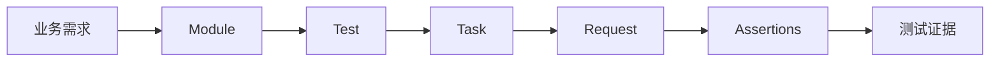
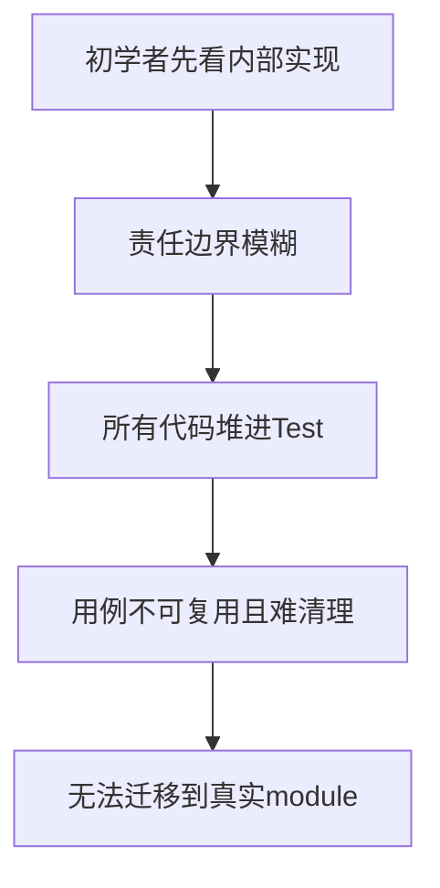
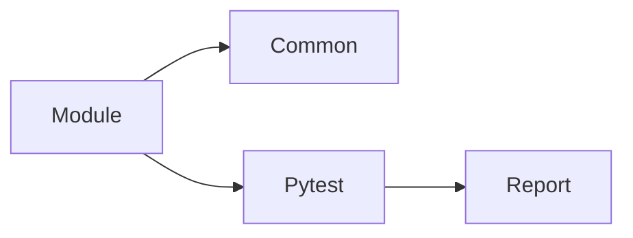
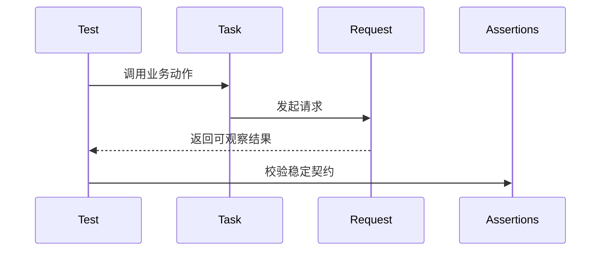
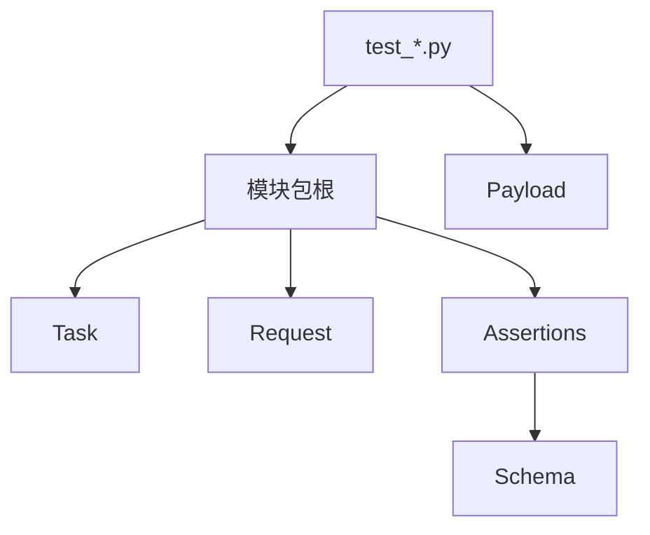
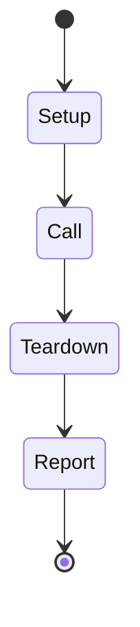
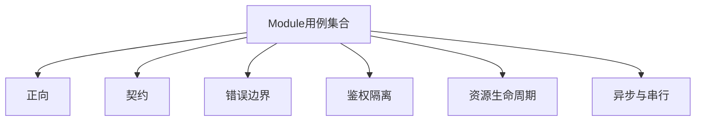
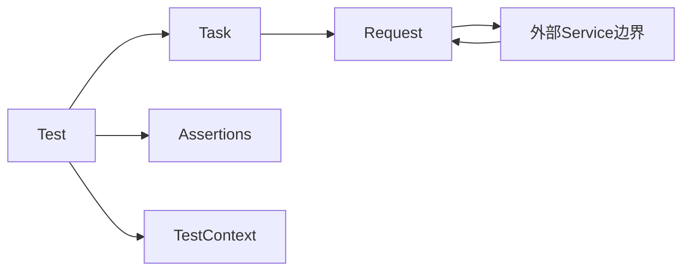
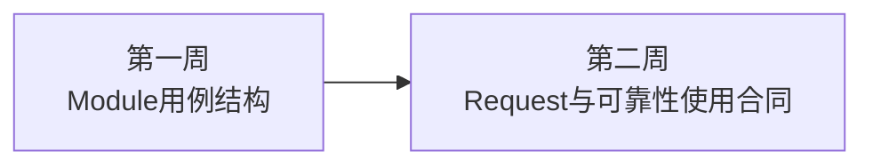

# 第一周课程导航：建立 Module 用例编写主线

> **本周定位**：从 module 用例作者视角建立 Test、Task、Request、Assertions 的标准协作方式  
> **课程形式**：纯讲解、面向初学者、多 Mermaid，不设置实操、练习、作业或命令要求  
> **权威依据**：`FRAMEWORK_TEST_SPEC.md` 与真实 `module/` 业务用例  
> **内容边界**：黄金用例只讲与 module 规范重合的 Test、Task、Request、Assertions、fixture 和清理部分；不展开 service 内部实现，也不提前讲 Runner 调度算法

---

## 1. 第一周唯一主目标

本周不追求记住框架所有组件。

唯一目标是建立下面这条可迁移主线：

```text
业务需求
→ Module场景
→ Test编排
→ Task业务动作
→ Request传输
→ Assertions契约
→ 生命周期与证据
→ 用例分类
```



---

## 2. TOC：本周解决什么约束



本周通过“责任所有者”解约束：

| 问题 | 主要所有者 |
| --- | --- |
| 场景验证什么 | Test |
| 业务动作怎样表达 | Task |
| 请求怎样传输 | Request |
| 结果怎样判断 | Assertions |
| 资源怎样关闭 | 创建者或 fixture |
| 用例怎样分类 | Module 测试设计 |

---

## 3. Day 1：项目边界与 Module 用例主线

Day 1 回答：一条 module 用例怎样进入公共能力和 pytest。

核心模型：



本日只保留稳定入口、可收集性和 nodeid 的基础概念。

不深入：

- Runner 分池算法。
- Pool Result。
- service 内部路由和状态。
- 质量聚合实现。

向 Day 2 交付：Test、Task、Request、Assertions 四个责任角色。

---

## 4. Day 2：Module 用例最小闭环

Day 2 回答：一个标准测试方法怎样组织输入、动作、结果和判断。



本日重点：

- Test 只负责编排场景。
- Task 使用业务语言。
- Request 拥有传输合同。
- Assertions 解释业务成功。
- Response 是事实载体。
- service 是外部边界，不展开内部实现。

向 Day 3 交付：四角色需要稳定文件位置。

---

## 5. Day 3：Module 标准结构与文件职责

Day 3 回答：新 module 怎样组织目录和公开入口。

```text
__init__.py
request.py
task.py
assertions.py
decorators.py
test_*.py
payloads.py              # 按需
response_schemas.py      # 推荐
```



不深入 BaseTask 内部委托、MRO 或 Capability 工厂。

向 Day 4 交付：对象位置已确定，需要进入 pytest 时间轴。

---

## 6. Day 4：生命周期、断言与报告步骤

Day 4 回答：对象何时创建、何时使用、何时清理。



本日重点：

- `setup_method` 与 `teardown_method`。
- fixture 与 `yield` 收尾。
- Request Session 的唯一所有者。
- 状态码、Schema、业务字段三层断言。
- Allure 步骤与断言的区别。
- `test_context` 的跨步骤与清理责任。

向 Day 5 交付：单个测试已形成闭环，需要设计整个 module 的场景集合。

---

## 7. Day 5：Module 用例分类与设计边界

Day 5 回答：业务风险怎样转化为用例类别。



本日重点：

- 一个测试方法表达一个核心结论。
- 文件按业务边界或变化原因拆分。
- 参数化只用于共享同一流程与断言的场景。
- 共享账号、账单和相互影响的场景使用 `serial`。
- 组合流程只提供组合证据，不替代分类用例。

向 Day 6 交付：已知道怎样设计 module 用例，下一步理解 Request 公开使用合同。

---

## 8. 第一周术语矩阵

| 术语 | 首次深入 | 准确定义 | 不等于 |
| --- | --- | --- | --- |
| Module | Day 1 | 一组业务用例和领域对象的边界 | service 实现目录 |
| Test | Day 2 | 场景编排与业务结论入口 | HTTP 客户端 |
| Task | Day 2 | 业务动作和流程 | Session 所有者 |
| Request | Day 2 | 传输合同与请求实例 | 业务成功判断器 |
| Assertions | Day 2 | 稳定契约比较 | service 真相来源 |
| Payload Builder | Day 3 | 每次构造独立业务输入 | 共享可变全局字典 |
| Schema | Day 3 | 稳定响应结构契约 | 当前响应全部字段快照 |
| Fixture | Day 4 | 依赖注入和资源生命周期 | 普通全局变量 |
| TestContext | Day 4 | 用例作用域数据与显式清理登记 | 自动发现所有资源 |
| Serial | Day 5 | 显式禁止并发影响的 marker | 业务优先级 |

---

## 9. 第一周统一边界



必须始终保持：

- Test 不复制公共机制。
- Task 不长期持有 Session。
- Request 不判断业务成功。
- Assertions 不发请求或改变状态。
- TestContext 只清理显式登记资源。
- 课程不把 service 内部实现作为用例编写主线。

---

## 10. 向第二周的桥梁

第一周已经回答“module 用例怎样组织”。

第二周开始回答“module Request 和 Task 怎样正确使用公共可靠性能力”。



后续课程仍以 module 作者决策为起点：先说明应该怎样调用，再解释足以理解边界的 common 实现事实。
