# 第三周课程导航：从流式资源到权威执行计划

> **本周定位**：把第二周已经建立的请求可靠性模型，扩展到流式 Response、测试级资源、并发执行上下文、稳定参数入口和权威 nodeid 计划  
> **课程形式**：纯讲解、面向初学者、重第一性原理与 TOC 因果链，不设置实操、练习、作业、小测、命令要求或教学门禁  
> **Module 作者主线**：SSE、TestContext、并发和 marker 都从 module 用例如何正确使用出发；Runner 细节只用于解释收集与调度边界  
> **源码范围**：`common/streaming.py`、`common/test_context.py`、`common/context_executor.py`、`run_master.py`、`run_orchestration/` 与对应测试  
> **最终边界**：第三周停在计划事实；Pool Result、执行器状态和最终退出码从 Day 16 开始

---

## 1. 本周真正解决什么问题

第二周结束时，框架已经能够解释：

- 一次 HTTP attempt。
- Retry 的多 attempt 恢复。
- Polling 的多轮业务状态查询。
- Response 越过请求函数后继续存活。

第三周不再增加新的 HTTP 恢复策略。

它扩大的是所有权范围：

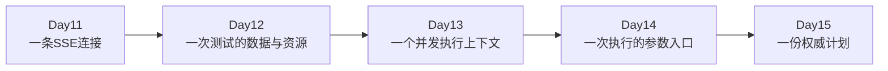

第一性原理问题是：

> 当对象生命周期越来越长、作用域越来越大时，谁创建、谁持有、谁传播、谁关闭、谁只负责计划而不负责结果？

---

## 2. TOC 因果链

第三周五课不是五个独立工具。

它们解除同一条约束链：

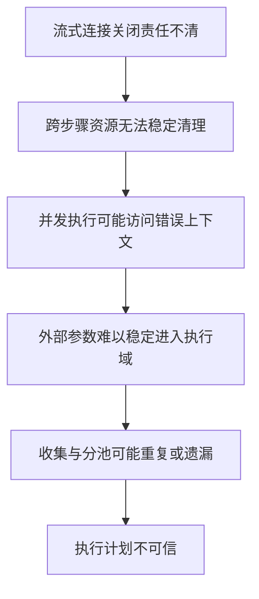

课程顺序不能随意交换：

- 不先分清 Response 关闭，就难以理解资源清理。
- 不先建立 TestContext 作用域，就难以解释并发传播。
- 不先解释执行域，就难以理解稳定 CLI 入口。
- 不先得到规范化输入，就无法证明权威收集的来源。

---

## 3. 每天只增加一个主要模型

| 天数 | 读取前课模型 | 本日只新增 | 交付下一课 |
| --- | --- | --- | --- |
| Day 11 | 普通 Response 所有权与关闭边界 | SSE 流式消费与显式关闭 | 跨步骤资源需要稳定所有者 |
| Day 12 | 使用结束不等于清理完成 | TestContext 提取链与 LIFO 清理 | 一个有作用域的测试上下文 |
| Day 13 | TestContext 作用域与资源所有权 | ContextVar 提交时快照和实例隔离 | 明确执行域与配置边界 |
| Day 14 | 执行域不能依赖隐式全局配置 | 稳定入口与参数双轨路由 | 规范化 Runner 输入 |
| Day 15 | Runner 输入与第一周 nodeid 模型 | 权威收集、集合守恒和调度计划 | 供 Day 16 执行的计划事实 |

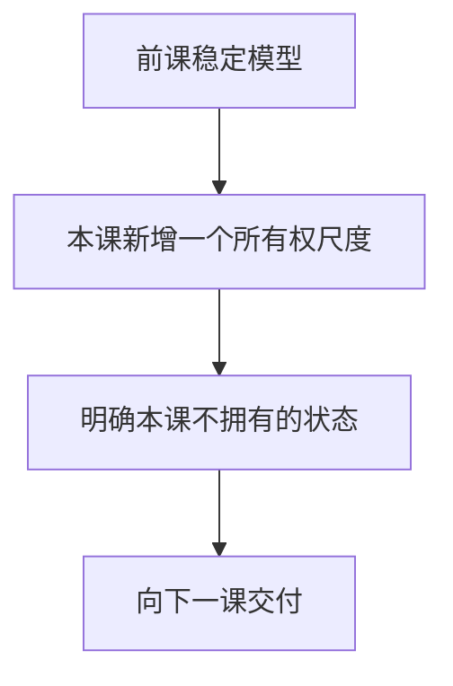

---

## 4. Day 11：流式响应与资源生命周期

### 4.1 从 Day 10 读取

- 普通 Response 可以越过 BaseRequest 返回。
- Session 关闭不能替代已返回 Response 的关闭。
- 业务终态与资源终态不是同一种事实。
- 最终消费者必须拥有明确关闭点。

### 4.2 本课回答

> 当 Response 不一次性消费完成，而是持续产生行时，迭代器、业务消费者与 Response 分别拥有什么？

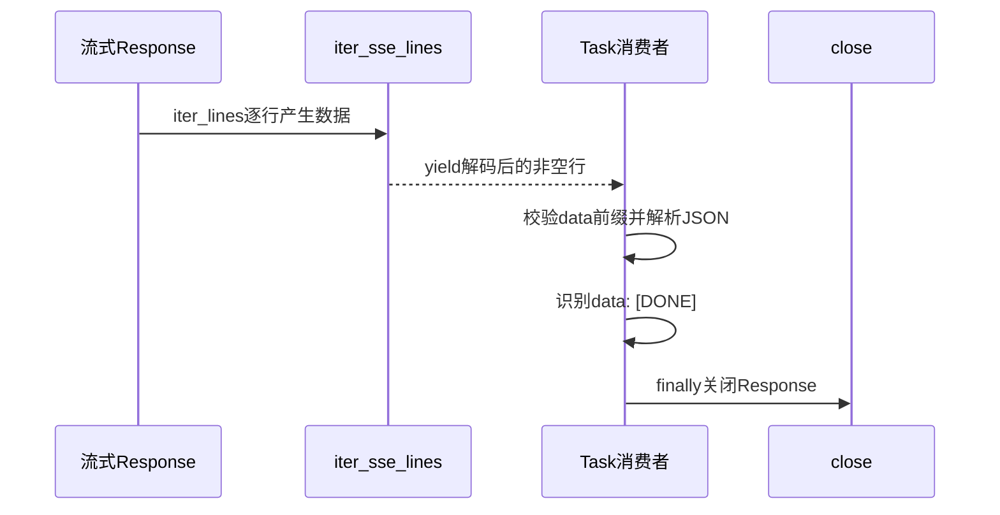

### 4.3 本课新增

- 请求设置 `Accept: text/event-stream` 与 `stream=True`。
- 当前代码没有验证响应 `Content-Type`，不能把请求 Accept 写成 Header 验证成功。
- `iter_sse_lines()` 跳过空行、容错解码并逐行 yield。
- 只有精确 `data: [DONE]` 会设置 completed。
- Iterator 不解析 JSON、不校验 `data:`、不关闭 Response。
- Task 在 `finally` 中承担 Response 关闭。
- DONE、迭代结束、消费结束与 Response 关闭不能互换。

### 4.4 关键边界

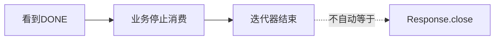

普通异常路径在 common 迭代层可能先报告 ERROR，随后 finally 再报告 INTERRUPTED，因此不能声称该层终态回调严格一次。

### 4.5 向 Day 12 交付

Day 11 交付：资源使用结束不等于资源已清理。

如果资源跨多个步骤继续存活，就需要稳定所有者和显式清理登记。

---

## 5. Day 12：测试上下文提取与资源清理

### 5.1 从 Day 11 读取

- 长生命周期资源需要明确所有者。
- 清理不能依赖“函数结束后自然释放”的假设。
- 关闭动作必须进入可解释路径。

### 5.2 本课回答

> TestContext 怎样保存跨步骤数据，又怎样只清理显式登记给自己的资源？

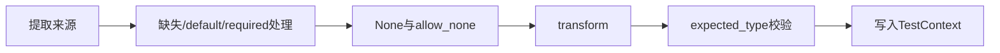

### 5.3 本课新增

- TestContext 面向一次测试流程，不是 RequestContext。
- `extract()` 恰好接受一个来源。
- `extract_first()` 按顺序选择第一个有值来源。
- `transform` 负责转换。
- `expected_type` 只做 `isinstance` 校验。
- optional 缺失且无 default 时返回 None，不写入 Context。
- JSON null 与没有匹配到值是不同事实。
- `add_cleanup()` 只登记同步 callback。
- `cleanup()` 使用 LIFO、失败继续、最终聚合错误。

### 5.4 所有权边界

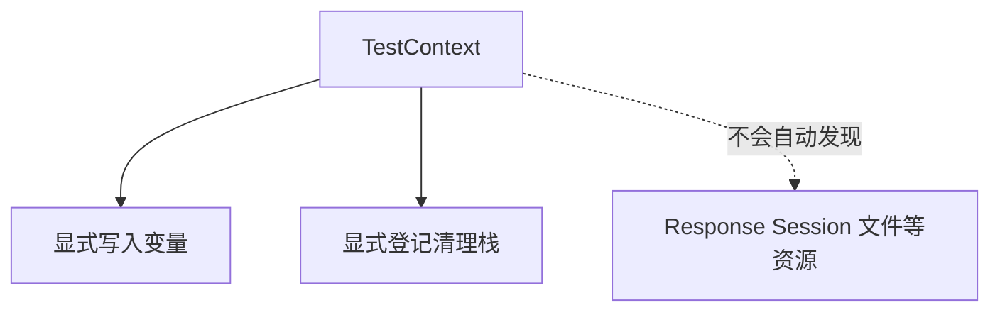

fixture 只保证 teardown 调用 `context.cleanup()`。

资源没有 `add_cleanup()`，就不能声称 TestContext 自动拥有它。

### 5.5 向 Day 13 交付

存在一个 TestContext 对象，不等于并发 worker 都会访问正确实例。

下一课解释执行跨越线程边界时，逻辑上下文怎样传播，实例资源怎样保持隔离。

---

## 6. Day 13：上下文传播与并发隔离

### 6.1 从 Day 12 读取

- TestContext 是有作用域的状态容器。
- 数据与清理责任属于具体测试流程。
- 错误 worker 访问错误 Context，会读取或清理他人的状态。

### 6.2 本课回答

> ContextVar 怎样把提交时的逻辑绑定传播给 worker，同时不把 Session 等实例资源误当成自动复制对象？

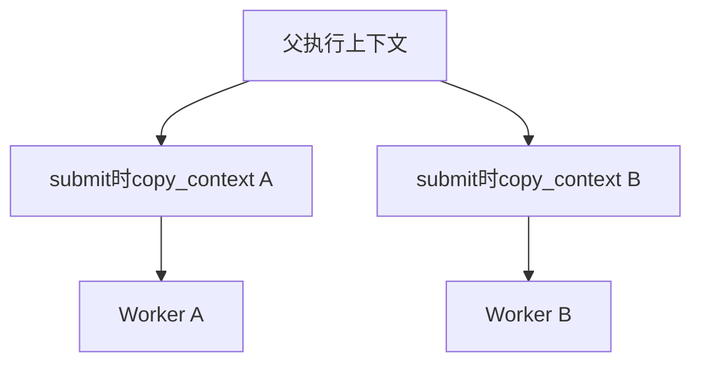

### 6.3 本课新增

- `submit_with_context()` 在提交时调用 `copy_context()`。
- worker 通过 `context.run(function, ...)` 执行。
- 传播的是提交时快照，不是随后父 Context 的值。
- ContextVar 复制绑定，不深复制绑定值。
- 当前证据只覆盖 ThreadPoolExecutor。
- TestContext 隔离来自独立实例，不是 ContextVar 自动完成。
- Session 隔离来自 worker 内新建并关闭 Request 实例。
- 相同 owner 值不代表共享 Session。

### 6.4 隔离矩阵

| 对象 | 隔离来源 | ContextVar 是否自动创建 |
| --- | --- | --- |
| 逻辑 owner | 提交时上下文快照 | 传播绑定 |
| TestContext | 每测试或每 worker 独立实例 | 否 |
| Request 实例 | worker 内创建 | 否 |
| Session | Request 实例所有权 | 否 |
| 单次 Header | 请求 kwargs 合并 | 否 |

### 6.5 向 Day 14 交付

执行域已经可以拥有正确上下文，但它仍需要明确、稳定的外部输入。

下一课从系统最外层解释用户参数怎样进入 Runner。

---

## 7. Day 14：稳定入口与命令行参数

### 7.1 从 Day 13 读取

- 执行域不能依赖漂移的隐式全局配置。
- worker 开始前必须获得确定输入。
- 外部意图与运行中 Context 是不同层次。

### 7.2 本课回答

> `run_master.py` 怎样保持薄入口，CLI 又怎样把框架已知参数与 pytest 剩余参数分成两条轨？

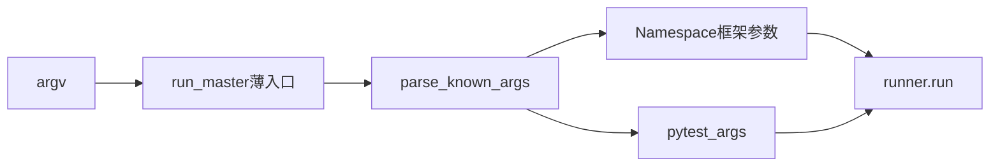

### 7.3 本课新增

- 根入口只稳定导出并委托。
- 当前没有统一 `RunnerConfig` 对象。
- 当前结构是 Namespace、pytest_args 与 `runner.run` 关键字参数。
- 路径优先级为 `--test-path → target → module`。
- `--parallel-first` 被解析但没有传给 Runner。
- 实际并行信号是 `numprocesses`。
- positional target 可能消费未知选项的值。

### 7.4 解析歧义

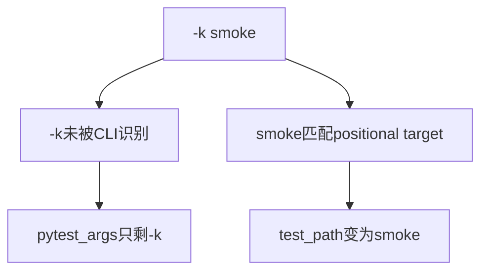

所以不能声称 `parse_known_args()` 保证任意 pytest 参数和值原样透传。

现有公开入口测试证明稳定导出与导入边界，不直接覆盖 `parse_args()` 的路径和歧义合同。

### 7.5 向 Day 15 交付

Day 14 交付规范化 Runner 输入，但还没有形成可执行 nodeid 集合。

---

## 8. Day 15：权威收集与并串行调度

### 8.1 从 Day 14 读取

- Runner 已获得 test path、pytest args、并发参数和 serial marker。
- 参数解析成功不等于测试集合已经形成。
- Day 15 回读第一周 nodeid 模型。

### 8.2 本课回答

> Runner 怎样让 pytest 形成唯一权威全集，再用 Marker 守恒地拆成 parallel 与 serial 计划？

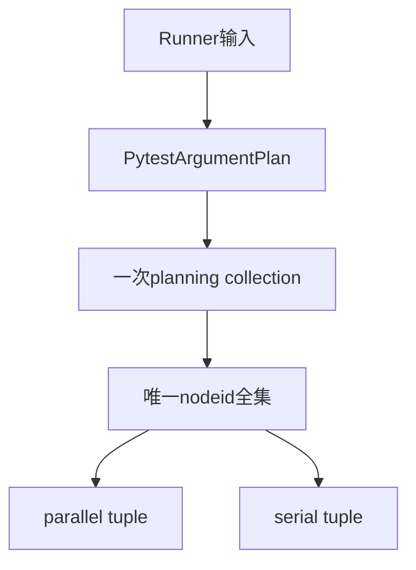

### 8.3 本课新增

- pytest 参数分为收集轨、执行轨、选择子集与 collect-only。
- 未知参数当前同时进入收集和执行轨。
- Collector 从 `session.items` 读取 nodeid 与全部 marker。
- 重复 nodeid 会阻止计划形成。
- 分池满足交集为空、并集等于全集。
- 当前没有独立 `ExecutionPlan` 类。
- 没有 numprocesses 时，全部 nodeid 进入单一 `serial-pool` 阶段；程序化 `extra_pytest_args` 若自行携带 xdist 参数，当前分支不会主动清理。
- 有 numprocesses 时，parallel 计划先于 serial 计划。

### 8.4 权威性的准确含义

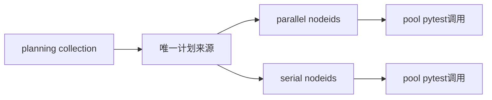

“一次权威收集”表示计划来源唯一，不表示池执行时 pytest 物理上不再内部收集指定 nodeid。

### 8.5 向 Day 16 交付

Day 15 交付计划事实，不交付：

- PoolExecutionResult 完整语义。
- NOT_RUN、COMPLETED、ERROR 的决策。
- 终止型退出码。
- 最终退出码。

---

## 9. 术语首次深入矩阵

| 术语 | 首次深入日 | 本周稳定含义 | 不能扩大成 |
| --- | --- | --- | --- |
| SSE 流消费 | Day 11 | 从流式 Response 逐行读取并解释业务停止条件 | 完整 SSE 协议解析器 |
| `iter_sse_lines` | Day 11 | 解码、跳过空行、yield 与运行观察调用 | Response 关闭器 |
| TestContext | Day 12 | 测试级变量容器与显式清理栈 | 全局共享字典或自动资源管理器 |
| `transform` | Day 12 | 对值执行转换函数 | 类型断言 |
| `expected_type` | Day 12 | `isinstance` 校验 | 值转换或领域校验 |
| ContextVar 快照 | Day 13 | submit 时复制逻辑绑定 | 深复制任意对象 |
| Session 隔离 | Day 13 | worker 独立 Request 实例拥有独立 Session | ContextVar 自动创建 Session |
| 稳定入口 | Day 14 | 对外导出稳定符号并委托内部编排 | 整个 Runner 实现 |
| pytest 参数轨 | Day 14～15 | CLI 剩余参数再按阶段分相 | 完整无歧义透传合同 |
| 权威收集 | Day 15 | 唯一计划全集来源 | 进程中 pytest 只收集一次 |
| Execution Plan | Day 15 | 参数、收集与分池事实的概念组合 | 当前已存在的同名类 |

---

## 10. 本周所有权对照

| 模型 | 它拥有 | 它不拥有 | 结束标志 |
| --- | --- | --- | --- |
| SSE 消费者 | 事件校验、JSON 解析、停止条件、Response close | TestContext 清理与 Runner 计划 | finally 完成 close 尝试 |
| TestContext | 显式写入变量、显式登记 callback、LIFO 清理 | 自动发现 Response/Session/文件 | cleanup 栈清空或聚合错误 |
| Context 快照 | 提交时 ContextVar 绑定 | Session、Header、TestContext 深复制 | worker 的 context.run 返回或抛出 |
| Request/Session 实例 | 具体传输状态与关闭 | 逻辑 owner 传播 | worker finally 调 close |
| CLI | 已知参数解析、路径优先级、Runner 桥接 | nodeid 收集与分池 | 调用 runner.run |
| Collector | nodeid、Marker、收集输出 | parallel/serial 分类 | CollectionResult 形成 |
| Scheduling | 权威集合的互斥守恒分类 | 测试结果与最终退出码 | 两个 tuple 形成 |

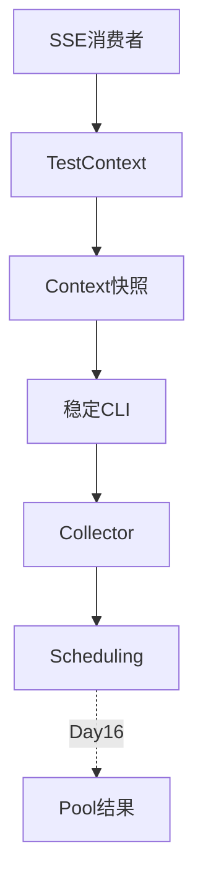

---

## 11. 证据强度矩阵

| 主题 | 源码直接事实 | 现有测试直接事实 | 明确缺口 |
| --- | --- | --- | --- |
| SSE | Iterator 不关闭 Response，Task finally 关闭 | 多条 collect 分支检查假 Response 已关闭 | 无响应 Content-Type 验证；interrupt 缺 Header 路径未覆盖 |
| TestContext | transform 在类型校验前，cleanup 为 LIFO | default 转换、LIFO、失败继续与脱敏聚合 | 同实例并发写、多个失败 callback 顺序未覆盖 |
| ContextVar | submit 时 copy_context | 字符串快照、返回值和异常保持 | ProcessPool、可变值深复制不支持或未证明 |
| CLI | 薄入口、双轨解析、兼容参数 no-op | 公开符号、签名与根导入边界 | parse_args 路由没有直接测试 |
| 收集与分池 | Collector 唯一性门禁、集合守恒检查 | Marker 收集、正常分池、参数分相、collect-only | 三个不变量的负例缺少直接测试 |

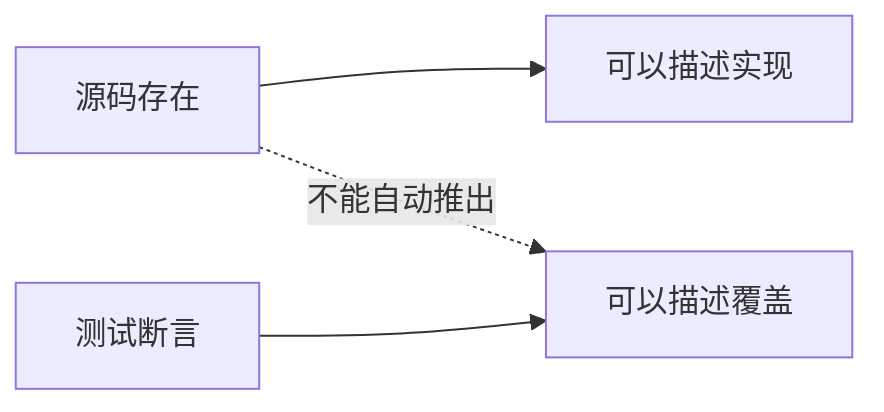

---

## 12. 本周禁止提前展开的主题

| 主题 | 本周只允许怎样提及 | 正式展开日 |
| --- | --- | --- |
| Runtime Hooks / Lease | Day 11、13 只说明直接调用和 ContextVar 绑定边界 | Day 18 |
| SSE Quality 语义事实 | 只说明不在本周展开 | Day 20 |
| PoolExecutionResult | Day 15 只作为下一课边界 | Day 16 |
| pytest 退出码归并 | 不解释决策表 | Day 16 |
| Allure/JUnit 生命周期 | 只把参数视为执行参数 | Day 17 |
| Quality 开关与 Provider | 不展开安装和清理生命周期 | Day 19 |
| Artifact Hash 与 Manifest | 不提前解释可信消费 | Day 26 |
| Pipeline Reporting 与 CI | 不提前解释发布编排 | Day 27～28 |

本周也不扩大为：

- Python 通用并发课程。
- 完整 SSE 标准课程。
- pytest 插件开发课程。
- Runner 执行结果课程。
- CI/CD 或 Artifact 信任课程。

---

## 13. 第三周完整因果链

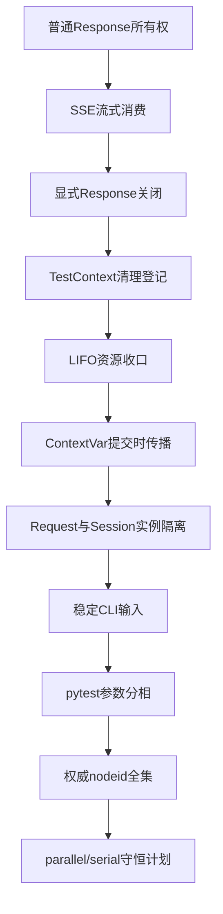

这条链包含三次关键分离：

1. 逻辑终态与资源关闭分离。
2. 逻辑上下文传播与实例资源隔离分离。
3. 计划事实与执行结果分离。

---

## 14. 向 Day 16 的桥梁

第三周结束时，框架已经知道：

```text
准备执行什么
怎样分池
以什么顺序进入执行阶段
```

但仍不知道：

```text
池是否真正运行
池运行是完成、未运行还是执行器错误
原始pytest退出码如何解释
多个池如何形成最终退出码
```

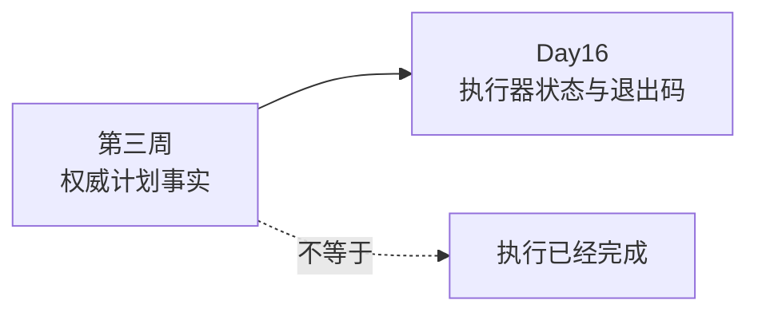

Day 16 将从 `PoolExecutionResult` 开始，把本周形成的计划转换成可归并的执行事实。
