# 第二周课程导航：从单次 attempt 到总 deadline
> **适用范围**：第 06～10 天  
> **课程形式**：纯讲解、重所有权、重预算边界、重 Mermaid 图解  
> **Module 作者主线**：先说明 Request/Task 应怎样使用公开能力，再解释足以理解合同的 common 内部事实；不要求在 module 中复制实现  
> **导航职责**：说明每天读取什么、只新增什么、向下一课交付什么，不重复各天正文  

---

## 1. 第二周的唯一目标
第二周只建立一个可持续扩展的 module 使用模型：
> 把一个看似简单的 HTTP 调用，拆成单次 attempt、attempt 内协作者、跨 attempt 的 Retry，以及跨查询轮次的 Polling，并为每层标清状态、预算、副作用和资源所有权。
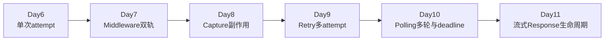
这五天不是五套平行功能。
它们是在同一请求模型上逐层增加新的时间跨度：
```text
一次发送
→ 一次发送前后的协作
→ 一次发送附带的资源副作用
→ 同一逻辑请求的多次发送
→ 同一业务目标的多轮查询
```
只要粒度没有分清，后续所有术语都会互相替代。

---

## 2. 第一性原理：本周真正要解除的约束
HTTP 语法不是本周瓶颈。
真正的瓶颈是：多个时间尺度共用“请求”一个词，导致责任边界消失。
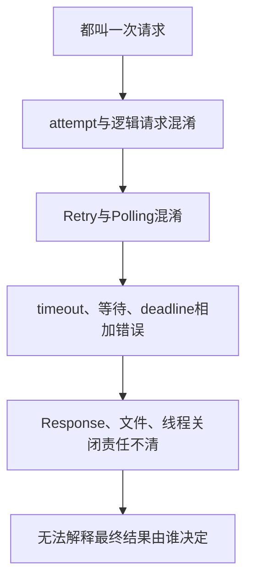
从 TOC 约束理论看，主约束是“粒度混淆”，不是知识点不足。
因果链可以写成：
```text
粒度名称不清
→ 状态被放错层
→ 预算被重复计算或漏算
→ 副作用被误认为主结果
→ 资源关闭缺少明确所有者
→ 证据无法映射到准确结论
```
因此第二周的学习顺序不能颠倒。
必须先建立单次 attempt，才能解释谁在 attempt 内观察；必须先分离附加副作用，才能解释为什么 Retry 可以重新 attempt；必须先理解 Retry，才能解释 Polling 如何管理更大的总时间边界。

---

## 3. 每天只增加一个主要模型

| 天数 | 读取前课模型 | 本日只新增 | 交付下一课 |
| --- | --- | --- | --- |
| Day 6 | 第一周的 Request 业务角色与分层证据 | 单次 attempt、`RequestContext`、八阶段、Response 关闭边界 | 一个可被 Middleware 观察的 attempt 事实对象 |
| Day 7 | attempt 的 Context、真实 kwargs、结果与异常分叉 | Middleware 三钩子、真实轨与诊断轨、脱敏输出边界 | 一个可在发送前触发附加副作用的协作位置 |
| Day 8 | 默认 Middleware 顺序与资源触发点 | 输入/输出 Capture、下载事务、取消与完成事实 | 已分离业务结果与附加资源事实的请求模型 |
| Day 9 | attempt 主干、协作者边界与 Capture 旁路 | Retry 资格、幂等边界、等待预算、最终异常 | 一个由多个 attempt 组成的逻辑请求 |
| Day 10 | Retry 的多 attempt 逻辑请求 | Polling 状态机、统一 deadline、四类终态 | 可进入流式资源审计的完整请求可靠性模型 |
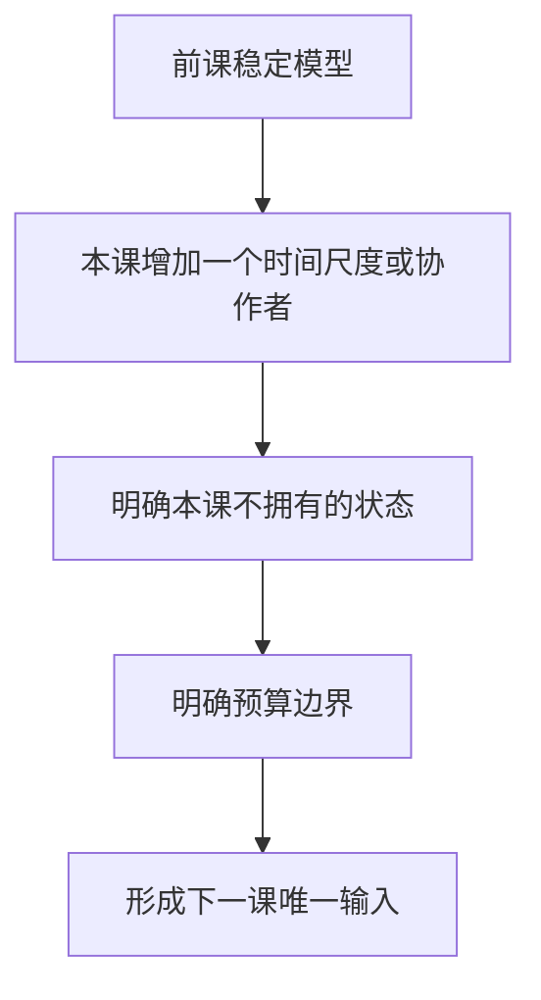
这里的“交付”只表示概念交接。

---

## 4. Day 6：基础请求与请求上下文
### 4.1 从第一周读取
- Test 组织场景，Task 编排业务动作。
- Request 是业务调用角色，Response 是事实载体。
- Assertions 解释业务结论，不替代传输事实。
- 分类证据与组合证据不能互相扩大。
### 4.2 本课回答
> 一次真正进入 `Session.request(...)` 的 HTTP attempt，输入、默认配置、标准化参数、响应与诊断扩展分别由谁持有？
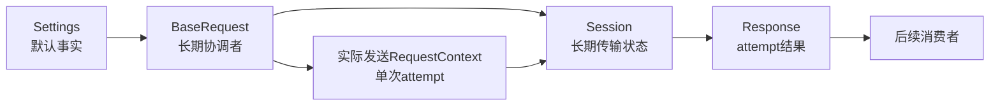
### 4.3 本课新增
- `attempt` 是一次实际发送尝试，不是整个业务调用。
- 实际发送的 `RequestContext` 按单次 attempt 隔离，不属于整个 Retry 或 Polling 生命周期。
- Retry 路径还会预构造一个不发送的 `first_context`，所以不能把每个 Context 实例都等同为 attempt。
- `BaseRequest` 协调长期对象，`Session` 保存可复用传输状态。
- 最终返回的 `Response` 越过 BaseRequest 边界继续存活。
- `BaseRequest.close()` 关闭 Session，不等于关闭所有已返回 Response。
### 4.4 向 Day 7 交付
Day 6 把真实发送参数稳定在 `context.kwargs`，并把 Middleware 放在 Session 前后的明确钩子位置。
Day 7 从这里解决一个矛盾：诊断需要可观察，业务发送又不能被脱敏处理污染。

---

## 5. Day 7：请求中间件、脱敏与诊断日志
### 5.1 从 Day 6 读取
- 一个实际发送的 attempt 对应一个独立 `RequestContext`。
- `context.kwargs` 是真实标准化发送轨。
- Response 与异常进入不同结果分支。
- Middleware 是 BaseRequest 的协作者，不是新的请求层级。
### 5.2 本课回答
> 真实业务参数与脱敏诊断副本如何并行存在，三个 Middleware 钩子又分别处于什么事实时刻？
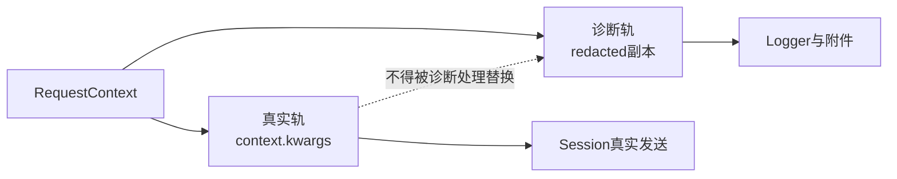
### 5.3 本课新增
- `before_request` 看到 Context，但还没有 Response。
- `after_response` 看到 Context 与 Response。
- `on_exception` 看到 Context 与原传输异常。
- 三阶段都按注册顺序正向遍历。
- 真实参数负责业务，脱敏副本负责诊断，两条轨道用途不同。
- 日志、cURL 与附件是输出边界，不是自动安全边界。
### 5.4 向 Day 8 交付
Day 7 只把 `MediaResourceMiddleware` 交付为一个发送前触发点。
它读取业务轨中的真实 JSON，触发附加资源入口，但不替换真实请求参数，也不替换最终 Response。

---

## 6. Day 8：资源捕获、下载与原子落盘
### 6.1 从 Day 7 读取
- Middleware 顺序决定副作用何时被触发。
- 业务轨与诊断轨已经分离。
- 输入资源入口位于 POST 发送前。
- 业务 Response 仍是调用主线的结果对象。
### 6.2 本课回答
> 输入与输出资源如何作为附加副作用被捕获，下载事务如何发布文件，取消、完成和线程结束又分别证明什么？
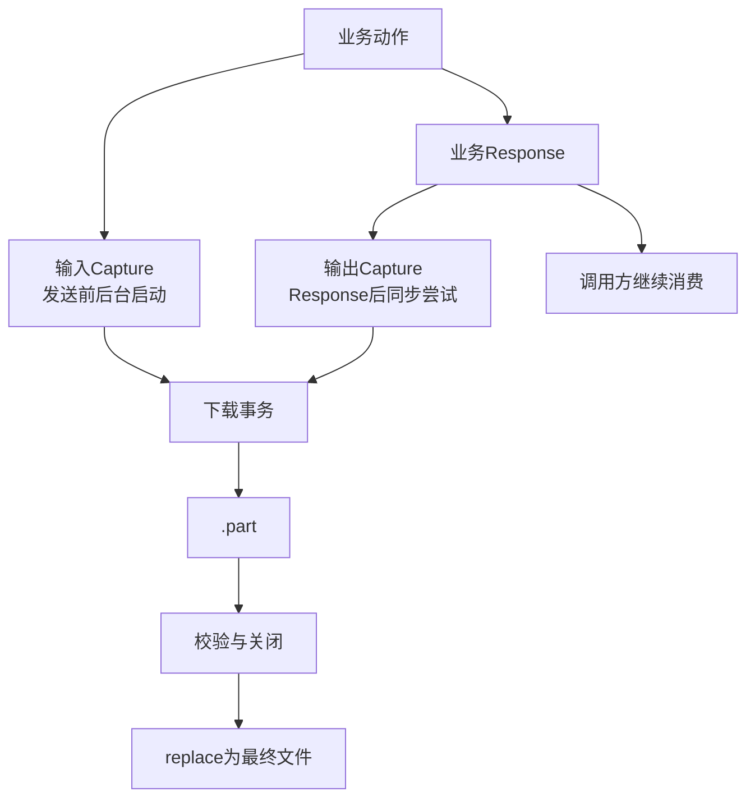
### 6.3 本课新增
- Capture 是附加副作用，不是业务成功判定者。
- 输入 Capture 与输出 Capture 的时间位置和执行方式不同。
- `CapturePolicy` 表达策略，不表达下载已经完成。
- `.part → 校验 → 关闭 → replace` 是单个资源的发布事务。
- 取消请求、worker 观察取消、`done_event` 与线程结束不能互换。
- 当前没有线程句柄与 `join()` 证据，不能同步证明完全收口。
### 6.4 向 Day 9 交付
Day 8 完成了业务 Response 与附加资源事实的分离。
Day 9 不再讨论文件如何落盘，而是解释同一逻辑动作为什么、何时以及以什么代价重新 attempt。

---

## 7. Day 9：请求重试策略
### 7.1 从 Day 8 读取
- attempt 是最小实际发送单位。
- 每个实际发送的 attempt 有自己的 Context、结果或异常。
- Middleware 与 Capture 都不能把失败 attempt 自动变成成功。
- 附加资源失败不应替换已经成立的业务 Response。
### 7.2 本课回答
> Retry 如何判断某次失败是否可恢复，如何守住幂等边界，如何安排等待，并在停止时保留准确的最终异常或结果？
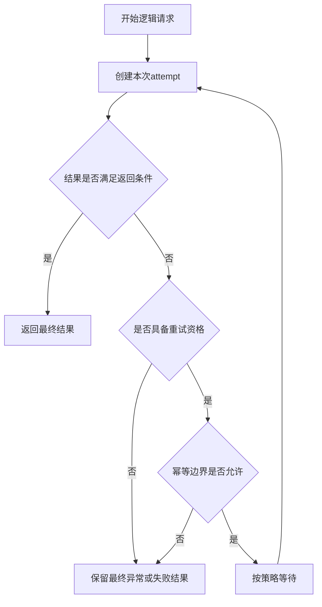
### 7.3 本课新增
- Retry 拥有的是“一个逻辑请求中的 attempt 序列”。
- 可恢复条件决定是否值得再试，幂等边界决定是否允许再试。
- 等待发生在 attempt 之间，不属于某个 attempt 的传输 timeout。
- 停止原因必须能回到最终结果或最终异常，不能只剩“重试失败”。
- Day 9 按大纲合同建立决策表、幂等边界与等待预算账本。
### 7.4 向 Day 10 交付
Day 9 交付一个可能包含多个 attempt、但仍只代表一个逻辑请求的 Retry 模型。
Day 10 在更外层询问：即使单个逻辑请求成功返回，业务状态是否已经到达终态？

---

## 8. Day 10：轮询状态机与总截止时间
### 8.1 从 Day 9 读取
- Retry 管理一个逻辑请求内部的多次 attempt。
- attempt timeout 与 attempt 间等待已经分开。
- Retry 停止不等于业务对象已经达到最终状态。
- 最终 Response 仍需被解释为某一轮查询得到的事实。
### 8.2 本课回答
> Polling 如何把多轮请求结果解释为状态迁移，并用统一 deadline 约束请求、等待和继续条件？
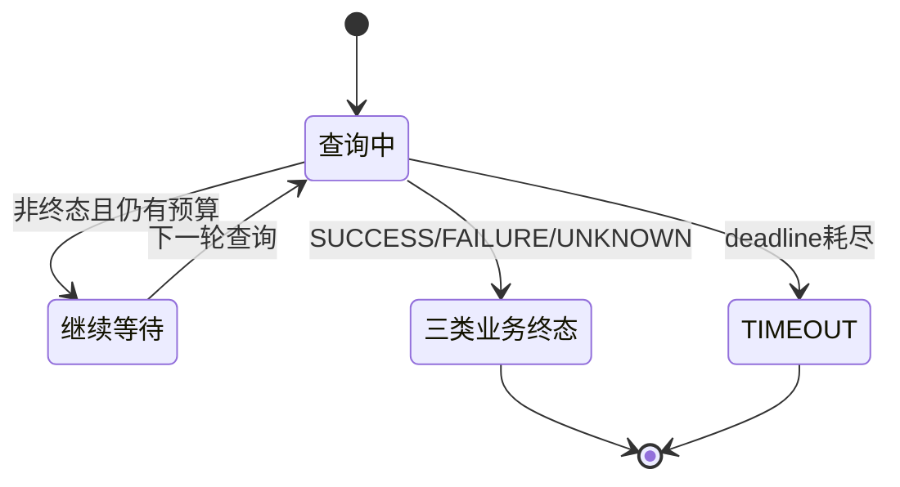
### 8.3 本课新增
- Polling 拥有多轮查询的业务状态机，不拥有单次 HTTP 发送细节。
- 统一 deadline 是 Polling 内核的外层总时间边界，不是新的单次 timeout。
- 每轮请求与轮次间等待都必须服从剩余总预算。
- Retry 可以服务于某一轮请求，但不能把自己的等待预算伪装成新的 Polling 总预算。
- `SUCCESS / FAILURE / UNKNOWN / TIMEOUT` 四类终态的准确分类与迁移由 Day 10 正文展开，导航只固定“状态机必须终止”的合同。
### 8.4 向 Day 11 交付
Day 10 交付第二周完整模型：外层 Polling 管状态与内核 deadline，内层 Retry 管 attempt 序列；实际 attempt 由 Context、Middleware 与 Session 协作，输入 Capture 可在发送前触发，输出 Capture 则在 Polling 内核成功返回后由外层装饰器触发。
Day 11 将把注意力转向 Response 不立即消费完时，连接、正文读取与关闭边界如何变化。

---

## 9. 术语首次引入矩阵

| 术语 | 首次深入日 | 本周内的稳定含义 | 后续怎样使用 |
| --- | --- | --- | --- |
| `attempt` | Day 6 | 一次实际进入 Session 的发送尝试 | 成为 Retry 的最小重复单位 |
| `RequestContext` | Day 6 | 实际发送时承载单次 attempt 的标准化共享事实；Retry 还存在未发送的 `first_context` | 被 Middleware 读取和扩展 |
| `Middleware` | Day 7 | attempt 前后按顺序运行的协作者 | 触发诊断与输入 Capture |
| 真实轨 / 诊断轨 | Day 7 | 业务发送数据与安全观察副本 | 限定日志与附件输出边界 |
| `Capture` | Day 8 | 业务请求附带的资源副作用 | 与业务 Response 分开审计 |
| 下载事务 | Day 8 | `.part` 到最终文件的发布生命周期 | 为资源关闭与清理提供边界 |
| `Retry` | Day 9 | 一个逻辑请求中的多 attempt 决策 | 作为 Polling 单轮请求的内层协作者 |
| 幂等边界 | Day 9 | 是否允许重复执行同一逻辑动作 | 限制可恢复条件的实际使用 |
| Retry 等待预算 | Day 9 | attempt 之间由策略安排的等待 | 与 timeout、deadline 分账 |
| `Polling` | Day 10 | 多轮查询与业务状态迁移 | 向后连接流式与资源生命周期 |
| 总 `deadline` | Day 10 | Polling 内核中的请求、Retry、评估与等待共享的截止点 | 不约束成功返回后的同步输出 Capture |
同一术语在首次深入前可以被提及，但不能提前把后续所有权讲完。

---

## 10. 六类模型的所有权对照

| 模型 | 它拥有 | 它不拥有 | 结束标志 |
| --- | --- | --- | --- |
| attempt | 一次真实发送及其直接结果分支 | 多次重试决策、业务状态机 | 返回一个 Response 或抛出一次异常 |
| `RequestContext` | 实际发送时承载单次 attempt 的标准化输入、控制字段与扩展事实；也可作为 Retry 的未发送规划对象 | Session 寿命、Retry 循环、最终 Response 关闭 | 实际 attempt Context 在本次协作后不复用于下一 attempt；`first_context` 不进入 Session |
| Middleware | attempt 前后的观察、诊断与有限副作用 | Retry 资格、Polling 终态、业务断言 | 对应钩子按顺序执行完或按失败语义中止 |
| Capture | 输入/输出资源下载事务与相关任务状态 | 业务 Response 的成功含义、逻辑请求重试决策 | 文件发布、失败清理，或留下准确的未收口边界 |
| Retry | 一个逻辑请求内的 attempt 选择、等待与停止原因 | 多轮业务状态迁移、Polling 总 deadline | 返回最终结果或保留最终异常/失败结果 |
| Polling | 多轮查询、状态迁移与统一 deadline | 单次发送细节、文件下载事务 | 命中 SUCCESS、FAILURE、UNKNOWN 或 TIMEOUT |
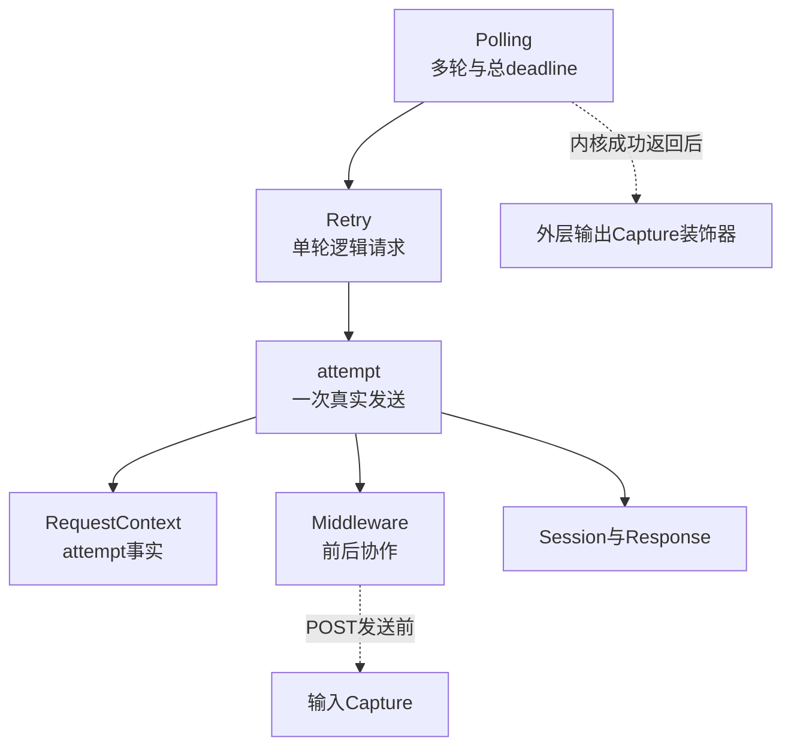
所有权判断的核心句式是：
```text
谁创建状态
→ 谁决定状态迁移
→ 谁承担副作用
→ 谁确认结束
→ 谁只能观察而不能替代
```

---

## 11. 三类预算必须分账

| 预算 | 所属层级 | 约束对象 | 不能解释成 |
| --- | --- | --- | --- |
| 单 attempt 预算 | Day 6 | 一次 Session 发送的传输等待边界 | 整个 Retry 或 Polling 的总耗时 |
| Retry 等待预算 | Day 9 | attempt 之间的策略等待累计 | 某次 attempt 的 timeout，或新的 Polling deadline |
| Polling 总 deadline | Day 10 | Polling 内核中多轮请求、Retry、状态评估与轮次等待的外层剩余时间 | 每轮都可重新获得的一整份预算，或公开方法连同输出 Capture 的绝对墙钟上限 |
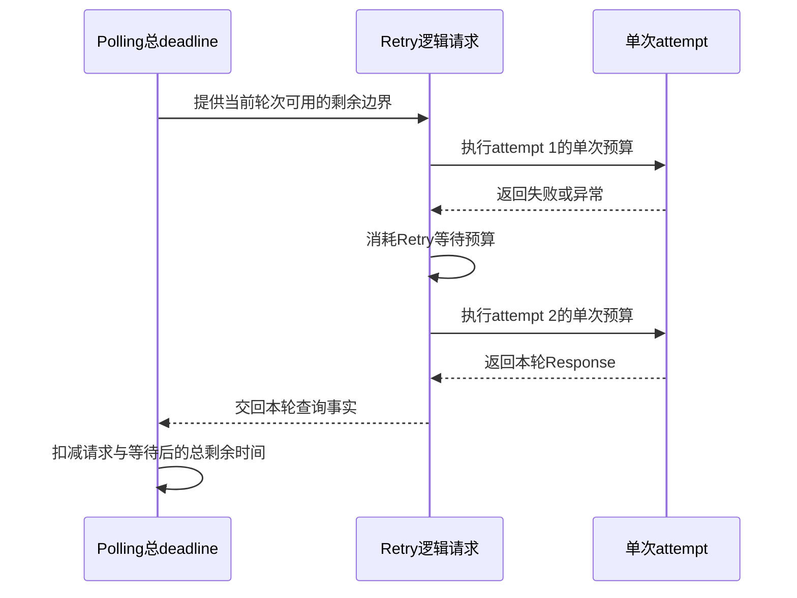
预算关系不是简单加法。
正确阅读顺序是先找外层 deadline，再看当前层允许的剩余时间，最后看单次 attempt 如何被限制。
如果把三类预算合并成一个 timeout，会产生三种误判：
- 把单次网络等待误认为整个业务最多耗时。
- 忽略 Retry 退避等待对总时长的影响。
- 让 Polling 每轮重新获得完整预算，从而失去真正截止点。

---

## 12. 资源生命周期边界

| 资源或事实 | 当前所有者 | 可以确认的结束 | 不能越界声称 |
| --- | --- | --- | --- |
| Session | `BaseRequest` | `BaseRequest.close()` 关闭会话 | 已返回 Response 都随之关闭 |
| 最终业务 Response | 返回后的消费者 | 消费者在明确位置关闭 | BaseRequest 在成功返回前已关闭 |
| Capture 下载 Response | 下载事务 | 响应上下文退出 | 业务 Response 也被同一上下文关闭 |
| `.part` 文件句柄 | 下载事务 | 文件上下文退出 | 最终文件已经成功发布 |
| 最终文件 | 下载事务发布，后续消费者读取 | `replace` 成功后路径成立 | 文件内容已经获得更高层信任 |
| `cancel_event` | 取消请求发起方与 worker 协作 | worker 在检查点观察到取消 | 线程已经终止 |
| `done_event` | worker 的 `finally` | worker 到达完成通知点 | 已存在 `join()` 同步事实 |
| Retry 中间 Response | Day 9 逐路径审计 | 以 Retry 实现的明确处理为准 | 仅凭“最终返回一个 Response”推断全部中间对象已关闭 |
| Polling 中间 Response | Day 10 逐轮审计 | 以状态迁移与实现路径为准 | 命中终态自动证明所有历史 Response 已关闭 |
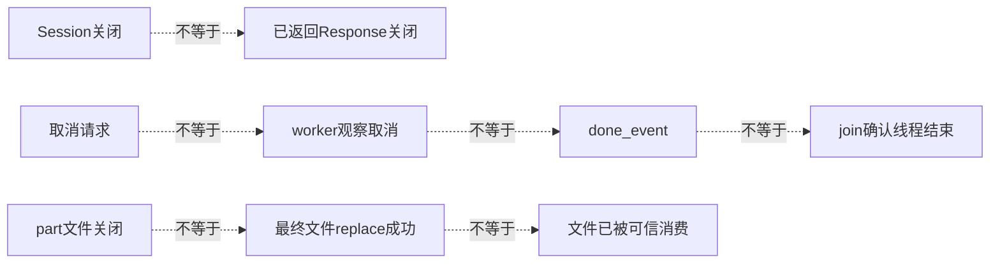
第二周只建立“资源由谁关闭、何时能证明关闭”的边界。
它不把安全落盘扩大成可信消费，也不把一个完成事件扩大成整个并发生命周期已经收口。

---

## 13. 本周明确不提前进入的主题

| 主题 | 第二周允许讲到哪里 | 留给后续课程 |
| --- | --- | --- |
| Artifact 信任 | 只保留“安全落盘不等于可信消费”的边界 | 不解释任何信任机制 |
| SSE | 本周不建立该协议模型 | 留给后续正式课程合同 |
| 流式 Response | 只保留“最终消费者负责关闭”的基础边界 | Day 11 展开读取、连接占用与关闭时机 |
| TestContext | 不把它与 `RequestContext` 混用 | 后续学习跨步骤提取、清理与上下文传播 |
| 并发隔离 | Day 8 只说明 Capture 任务与取消事实 | 后续学习 ContextVar、线程与会话隔离 |
提前展开这些主题会破坏本周单模型递进：学员会在 attempt、资源文件和流式连接尚未分清时，同时承担新的信任或协议概念。

---

## 14. 向 Day 11 的桥梁
Day 10 结束时，应当得到一张完整但仍有边界的请求可靠性地图：
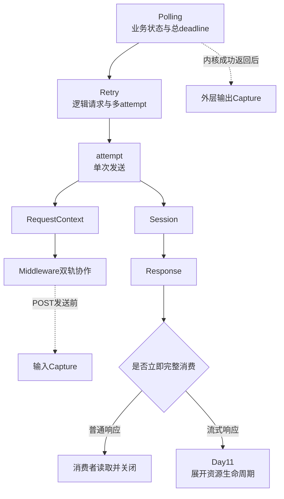
Day 11 不需要重新发明 Retry 或 Polling。
它读取第二周已经建立的三个前提：
1. Response 是某个 attempt 的结果对象，但可能越过多层边界继续存活。
2. 最终消费者负责明确关闭点，Session 关闭不能替代 Response 关闭。
3. 外层可靠性机制会产生中间 Response，资源审计必须逐路径进行。
第二周最终形成的判断顺序是：
```text
先确定当前讨论的时间粒度
→ 再找到状态与预算所有者
→ 再区分主结果与附加副作用
→ 再确认资源何时真正结束
→ 最后判断证据能够支持到哪一层
```
这条顺序将直接成为 Day 11 阅读流式响应与资源生命周期的入口。
