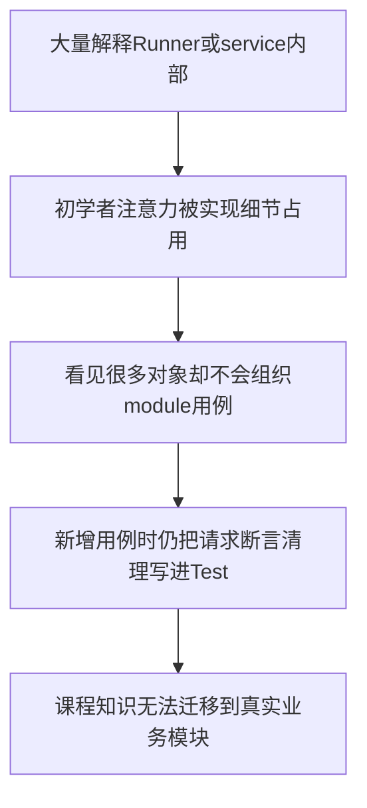
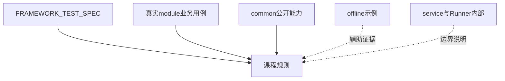
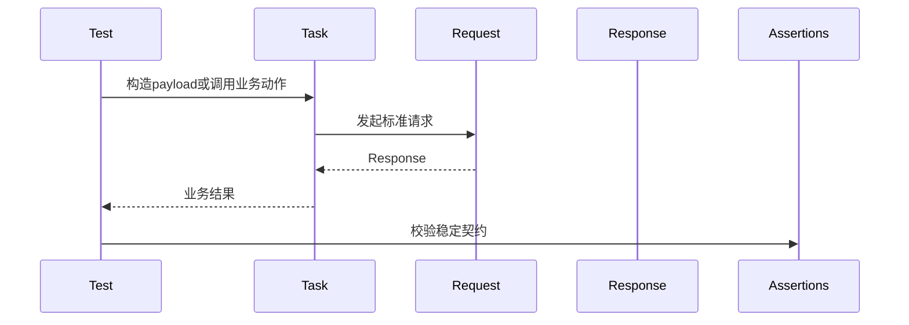
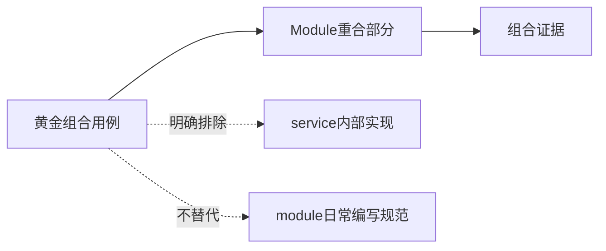
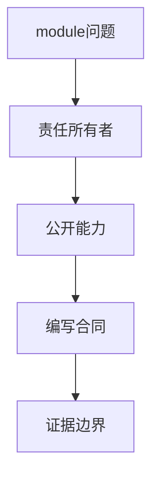

# 课程内容审查：以 Module 用例编写为主线

> **审查对象**：当前已生成的 Day 1～Day 15 初学者课程  
> **审查依据**：`FRAMEWORK_TEST_SPEC.md`、`module/` 中的真实业务用例与根目录 `README.md`  
> **审查目标**：让课程回答“如何在 module 层编写可靠用例”；黄金用例可以作为组合案例，但只讲与 module 规范重合的部分，不进入 service 内部实现

---

## 1. 第一性原理：课程最终要形成什么能力

课程不是为了让初学者记住仓库里每个类的实现。

课程最终要形成的是一种可迁移能力：

```text
拿到一个接口需求
→ 判断用例属于哪个 module
→ 把业务动作放进 Task
→ 把传输合同放进 Request
→ 把稳定结论放进 Assertions
→ 在 Test 中组织场景与资源生命周期
→ 通过 pytest 稳定收集和执行
```


因此，课程的主角必须是 **module 用例作者**。

`common/`、Runner、离线服务和质量系统可以出现，但只能回答一个问题：

> module 用例作者需要遵守什么使用合同？

---

## 2. TOC：当前课程的核心约束

当前最强约束不是内容不够多，而是注意力流向错误。



约束的解法不是继续增加内部实现，而是重新安排信息优先级：

1. 先讲 module 作者必须做出的决策。
2. 再讲这些决策对应的框架公开能力。
3. 最后才解释足以理解边界的内部事实。
4. service 只作为 HTTP 边界对端，不讲其状态机和实现过程。
5. 组合用例只用于说明证据范围，不作为逐行教学主线。

---

## 3. 权威来源优先级

课程事实按以下顺序取证：

| 优先级 | 来源 | 课程用途 |
| --- | --- | --- |
| 1 | `FRAMEWORK_TEST_SPEC.md` | module 用例编写规范和禁止事项 |
| 2 | `module/video_model/`、`module/image_model/`、`module/protocol_testing/`、`module/material_library/` | 真实业务用例组织方式 |
| 3 | `module/conftest.py` | 公共 fixture、资源清理和报告接入 |
| 4 | `common/` 的公开 API | 解释 module 层如何复用能力 |
| 5 | `module/offline_framework_example/` | 可作为黄金组合案例，但只读取 Test、Task、Request、Assertions、fixture、Context 与公开能力使用方式 |
| 6 | service、Runner 内部实现 | 只在解释公开合同边界时少量出现 |



---

## 4. Module 用例课程必须覆盖的规范

### 4.1 标准目录

```text
module/example_model/
├─ __init__.py
├─ request.py
├─ task.py
├─ assertions.py
├─ decorators.py
├─ test_generation.py
├─ response_schemas.py   # 推荐
└─ payloads.py           # 场景较多时按需增加
```

### 4.2 分层职责

| 文件 | 主要职责 | 不应承担 |
| --- | --- | --- |
| `test_*.py` | 场景编排、调用、断言、资源登记 | 拼装底层 HTTP 细节、实现重试循环 |
| `task.py` | 业务动作、payload 组织、复合流程 | 管理 Session、复制公共算法 |
| `request.py` | 路径、方法、Header、传输参数 | 判断业务是否成功 |
| `assertions.py` | 状态码、Schema、关键业务字段 | 发请求、改变服务端状态 |
| `decorators.py` | 模块步骤语义和装饰器身份 | 保存业务状态 |
| `response_schemas.py` | 稳定响应契约 | 过度限制快速变化字段 |
| `__init__.py` | 模块公开导出 | 暴露所有内部辅助对象 |

### 4.3 测试方法的最小闭环



### 4.4 生命周期

- 测试类不定义 `__init__`。
- `setup_method` 创建的 Request，由 `teardown_method` 关闭。
- fixture 创建的资源，由同一 fixture 的 `yield` 收尾。
- 跨步骤值进入 `test_context`，不进入模块全局变量。
- 业务资源通过 `test_context.add_cleanup()` 登记。

### 4.5 用例设计

- 一个测试方法表达一个清晰业务结论。
- payload builder 每次返回新对象。
- 状态码、Schema 和关键业务字段分层断言。
- 余额、账单、共享账号和相互影响的场景标记为 `serial`。
- Retry、Polling、SSE 和并发优先使用框架公开能力，不在测试方法中重复实现。

---

## 5. Day 1～Day 15 审查矩阵

| 课程 | 原有偏移 | 严重度 | 修订方向 | 状态 |
| --- | --- | --- | --- | --- |
| Day 1 | Runner、collect-only 和权威收集展开过深 | 高 | 只保留执行地图，主线改为 module 用例如何进入框架 | 已重写 |
| Day 2 | 黄金路径、Echo 和离线 service 成为主角 | 高 | 改为 module 用例最小闭环与四角色 | 已重写并更名 |
| Day 3 | module 结构正确，但 Capability/MRO 和离线支持文件过深 | 中 | 按标准文件模板解释职责和公开导入 | 已重写 |
| Day 4 | 生命周期正确，但大量围绕离线 service fixture | 高 | 改用通用 module Request、fixture、TestContext 和 Assertions | 已重写 |
| Day 5 | 框架离线自测分层多于业务用例设计 | 高 | 改为正向、契约、边界、鉴权、清理、串行分类 | 已重写并更名 |
| Day 6 | Request 内部链路较重 | 中 | 先说明 module Request 应配置什么，再解释公开合同 | 已补 Module 落点 |
| Day 7 | 中间件内部顺序较重 | 中 | 聚焦 module 作者的脱敏、Header 和日志责任 | 已补 Module 落点 |
| Day 8 | Capture 内部生命周期较重 | 中 | 聚焦 CapturePolicy、资源登记和断言边界 | 已补 Module 落点 |
| Day 9 | Retry 决策内部细节较重 | 中 | 聚焦 Task 如何选择 RetryPolicy，禁止手写重试循环 | 已补 Module 落点 |
| Day 10 | Polling 实现细节较重 | 中 | 聚焦 PollingPolicy、总 deadline 和状态分类 | 已补 Module 落点 |
| Day 11 | 流式解析内部事实较重 | 中 | 聚焦 module Request/Task 如何消费并关闭 Response | 已补 Module 落点 |
| Day 12 | 与 module 用例最接近 | 低 | 强化 test_context 与 add_cleanup 的编写规范 | 已补 Module 落点 |
| Day 13 | 并发实现证据较重 | 中 | 强化 serial 标记、submit_with_context 和独立 Request | 已补 Module 落点 |
| Day 14 | CLI/Runner 内部参数路由较重 | 中 | 聚焦 module 用例可收集性和稳定入口使用边界 | 已补 Module 落点 |
| Day 15 | 调度内部集合模型较重 | 中 | 聚焦 nodeid、marker 和 module 作者能控制的分类输入 | 已补 Module 落点 |

---

## 6. 黄金组合用例的课程定位

黄金组合用例可以讲述，并可作为跨天贯穿案例：

```text
读取Test怎样编排
→ 读取Task怎样表达业务动作
→ 读取Request怎样调用公开传输能力
→ 读取Assertions怎样形成业务结论
→ 读取fixture、TestContext与清理责任
→ 读取Retry、Polling、SSE等公开能力怎样被module使用
```

它还可以说明多个公开能力在一个受控场景中如何协作。

但课程不解释黄金用例依赖的 service 部分：

- 离线 service 如何保存状态。
- 故障场景如何在 service 内切换。
- 完整组合 nodeid 的每一次 HTTP 往返。
- service fixture 如何批量管理实例。
- 黄金用例怎样覆盖每个框架内部能力。



---

## 7. Service 的课程边界

对 module 用例作者而言，service 是外部边界：

```text
输入：HTTP方法、路径、Header、payload
输出：状态码、Header、响应体、流式事件
```

课程只讨论这些可观察合同。

除非课程主题本身是服务端测试基础设施，否则不解释 service 的：

- 内部数据结构。
- 状态存储方式。
- 线程模型。
- 故障注入实现。
- 路由处理函数。
- 启停和端口分配算法。

---

## 8. 后续课程统一写法

每一天统一回答五个问题：

1. module 用例作者今天要解决什么问题？
2. 这个问题应由 Test、Task、Request 还是 Assertions 拥有？
3. 框架已经提供什么公开能力？
4. module 层必须遵守什么合同和禁止事项？
5. 当前证据能证明什么，不能证明什么？



这五个问题将作为后续课程审查和生成的统一门槛。
