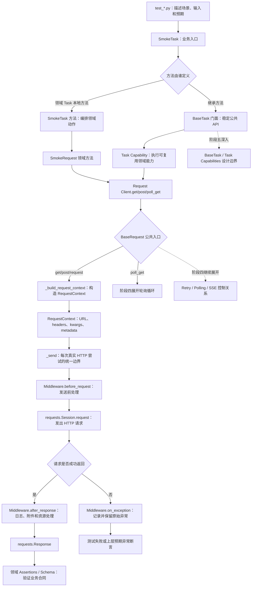
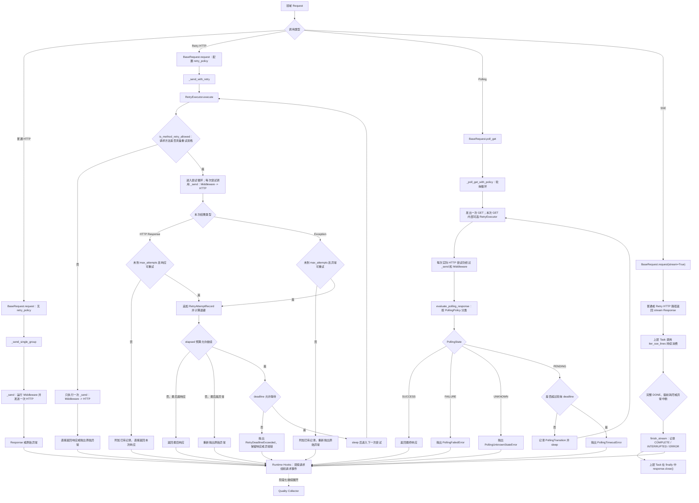
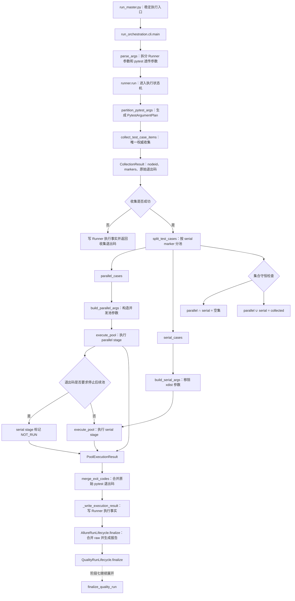
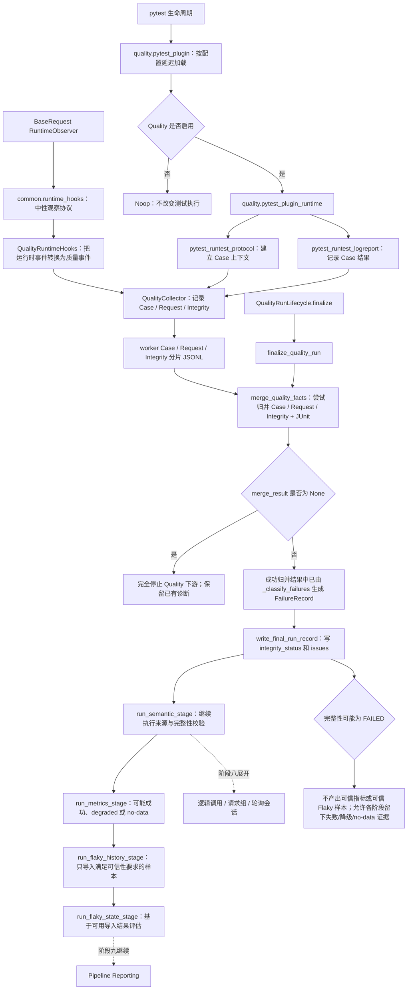
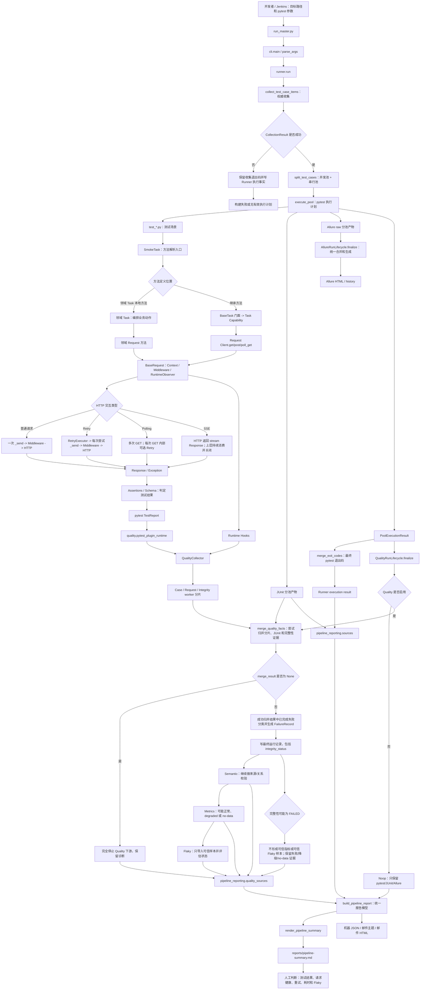

# LLM API 测试框架学习建议

本指南只基于当前工作区实际存在的代码与测试，不引用历史版本或不存在的文件。

## 1. 学习目标

学习目标不是记住所有类和函数，而是建立一套能够解释、调试和扩展项目的心智模型。完成后应能回答：

1. 一个业务测试如何经过 Task、Request 和 BaseRequest 发出请求。
2. Middleware、Retry、Polling、SSE 和 TestContext 分别解决什么问题。
3. Runner 为什么要先权威收集，再划分并发池和串行池。
4. pytest 事实如何进入 Quality、Semantic、Metrics 和 Flaky。
5. 新增接口或框架能力时，代码应该放在哪一层。

## 2. 第一性原理

LLM 和媒体 API 测试的困难不在于发送 HTTP 请求，而在于：

- 一次业务调用可能包含创建任务、重试、轮询和多个 HTTP 请求。
- POST 请求可能产生费用，不能无条件重试。
- SSE 响应需要持续消费，不能只观察响应头。
- 并发执行后，用例、请求、逻辑调用和产物必须保持正确归属。
- 负向用例和轮询中间状态可能产生失败请求，但测试仍然可以通过。
- 事实不完整时，Metrics、Flaky 和报告结论都不可信。

因此，这个项目的本质是：

> 把不稳定、异步、可计费、可并发的 API 交互，转换成可执行、可归属、可审计、可治理的测试事实。

## 3. 三条核心主线

### 3.1 业务执行链

```text
Test -> Task ->（领域 Request 方法或 Request Client）-> BaseRequest

BaseRequest.request
  ├─ 普通请求 -> _send -> Middleware -> HTTP
  └─ 配置 Retry -> RetryExecutor
                   ├─ 方法不具备重试资格 -> 只执行一次 _send
                   └─ 方法具备重试资格 -> 每次尝试执行 _send -> Middleware -> HTTP

BaseRequest.poll_get
  └─ 多次 GET；每次 GET 内部可选 Retry

SSE
  └─ HTTP 返回 Response 后，由上层调用 iter_sse_lines 持续消费，并由上层 Task 在 finally 中关闭 Response

Response -> Assertions
```

- `module/`：真实业务用例、领域 Request、Task 和 Assertions。
- `common/`：请求、策略、上下文、断言和公共领域能力。
- `util/`：日志、脱敏、下载和配置校验。

### 3.2 运行编排链

```text
run_master.py -> CLI 参数解析 -> pytest 权威收集
              -> 并发/串行分池 -> 分池执行 -> 退出码与产物合并
```

- `run_orchestration/`：收集、调度、执行和产物生命周期。
- `master_service.py`：收集与分池的稳定兼容入口。
- `run_master.py`：本地与 CI 共用入口。

### 3.3 质量治理链

```text
pytest / Runtime Hooks
  -> worker Case / Request / Integrity 分片
  -> 分片归并 + JUnit 证据 + 完整性校验
  -> 失败分类生成 FailureRecord
  -> Semantic -> Metrics -> Flaky -> Pipeline Summary
```

- `quality/`：事实采集、归并、语义、指标和 Flaky。
- `pipeline_reporting/`：加载机器事实并生成流水线摘要。
- `module/conftest.py`：fixture、资源附件和 pytest 生命周期接入。

## 4. TOC 学习策略

### 4.1 当前约束

项目横跨业务测试、请求框架、执行编排、质量治理和 CI。如果同时展开所有目录，认知负荷会迅速增加，最终只能记住文件名，无法解释调用链。

### 4.2 聚焦顺序

1. 用一个 `smoke` 用例建立业务执行链。
2. 用离线单元测试掌握请求框架机制。
3. 用集合守恒理解 Runner。
4. 用事实可信性理解 Quality。
5. 最后学习 Pipeline Reporting 和 Jenkins。

不要从 `Jenkinsfile`、Flaky 数据库或完整 Metrics 模型开始，它们属于下游能力，依赖前面的执行模型。

### 4.3 课后链路总图规则

每个阶段结束后维护一张累积式 Mermaid 总图。总图不是章节摘要，而是用来验证自己是否真正理解对象流转、函数调用和异常分支。

绘图规则：

1. 保留前一阶段已经掌握的主链，只展开本阶段新增节点。
2. 函数节点使用“函数名：职责”，避免只写抽象概念。
3. 对象节点写明输入、输出或产物，例如 `RequestContext`、`CollectionResult`、Quality JSONL。
4. 条件判断使用菱形节点，必须画出正常、失败、跳过或降级分支。
5. 尚未学习的下一阶段使用虚线连接，形成明确的学习接口。
6. 每张图后写一段三分钟复述，禁止逐行照读代码。

课程总览图：

```mermaid
flowchart LR
    A["阶段一：项目地图"] --> B["阶段二：业务 Test / Task / Request + BaseTask 门面"]
    B --> C["阶段三：BaseRequest 与 Middleware"]
    C --> D["阶段四：Retry / Polling / SSE / Context"]
    D --> E["阶段五：BaseTask 兼容门面与窄 Capability"]
    E --> F["阶段六：Runner 权威收集与分池"]
    F --> G["阶段七：Quality 原始事实"]
    G --> H["阶段八：Semantic / Metrics / Flaky"]
    H --> I["阶段九：Pipeline Reporting / Jenkins"]
```



## 5. 学习环境

始终使用项目虚拟环境：

```powershell
.\.venv\Scripts\python.exe --version
.\.venv\Scripts\python.exe -m pytest --version
```

不要直接使用系统 `python` 或 `pytest`，系统环境中的第三方 pytest 插件可能影响收集结果。

只收集业务用例，不发送真实请求：

```powershell
.\.venv\Scripts\python.exe -m pytest module/smoke --collect-only -q
```

`module/` 中部分测试可能调用真实接口、产生费用或修改共享状态。没有明确账号、环境和成本边界时，不运行完整业务回归。

## 6. 第一阶段：建立项目地图

### 阅读顺序

1. `README.md`：目录结构、架构边界、分层规范和执行入口。
2. `FRAMEWORK_TEST_SPEC.md`：执行链、分层职责和新模块结构。
3. `requirements.txt` 和 `pytest.ini`。
4. `config.py`、`run_master.py` 和 `master_service.py`。

### 阶段产出

画一张架构图，至少包含：

- `common/`、`module/`、`run_orchestration/`、`quality/`、`pipeline_reporting/`、`tests/`。
- 三条核心主线和主要依赖方向。
- pytest、Allure、JUnit 和 Quality 的位置。

### 验收问题

- 项目真正解决什么问题？
- 为什么它不只是 pytest 和 requests 的简单封装？
- `common` 为什么不应直接依赖具体 Quality 实现？

## 7. 第二阶段：走通业务切片

从当前存在的 `module/smoke` 开始：

1. `module/smoke/test_key_api.py`
2. `module/smoke/task.py`
3. `common/base_task.py` 中本次调用命中的继承方法
4. `module/smoke/request.py`
5. `module/smoke/assertions.py`
6. `module/smoke/response_schemas.py`

先补一个最小继承/MRO 认知：`SmokeTask` 继承 `BaseTask`。`test_key_api.py` 中调用的 `create_chat_completion()` 和 `create_image_generation()` 并不定义在 `SmokeTask`，而是经由 MRO 命中 `BaseTask`，再委托 `MediaGenerationCapability`，最终使用传入的 `SmokeRequest` 实例调用 `post()`。

第二阶段只需要理解这条“继承门面 → 能力委托 → Request Client”桥接，不展开 `task_capabilities` 的全部实现；其设计边界放到第五阶段深入学习。可用以下命令观察方法解析顺序：

```powershell
.\.venv\Scripts\python.exe -c "from module.smoke import SmokeTask; print(SmokeTask.__mro__)"
```

选取一个测试方法，记录完整调用链：

```text
测试方法
  -> SmokeTask 方法解析：本地方法或继承自 BaseTask
  -> 可选的 Task Capability 委托
  -> 领域 Request 方法，或直接通过 Request Client 调用 get/post/poll_get
  -> BaseRequest 请求处理
  -> 领域断言和响应 Schema
```

理解各层职责：

- Test：场景、输入组合和预期。
- Task：业务动作、流程和 payload；方法可能定义在领域 Task，也可能继承自 BaseTask 门面。
- Request：端点、HTTP 方法、参数和质量语义。
- Assertions：可复用的领域判断。
- Schema：响应结构合同。

完成 `smoke` 后横向比较：

- `module/image_model/`
- `module/video_model/`
- `module/material_library/`
- `module/protocol_testing/`

收集验证：

```powershell
.\.venv\Scripts\python.exe -m pytest module/smoke --collect-only -q
.\.venv\Scripts\python.exe -m pytest module/video_model --collect-only -q
.\.venv\Scripts\python.exe -m pytest module/protocol_testing --collect-only -q
```

### 课后链路总图：业务分层



课后复述目标：不用打开源码，说明一个测试如何经过 Task、Request、RequestContext 和 Middleware 得到响应，并指出业务异常与框架异常分别在哪里暴露。

## 8. 第三阶段：请求基础设施

### 阅读顺序

1. `common/request_context.py`
2. `common/request_middleware.py`
3. `common/base_request.py`
4. `util/api_call_logger.py`
5. `util/curl_builder.py`
6. `util/redaction.py`

### 重点问题

- URL、默认请求头和临时请求头如何合并？
- 请求参数为什么需要复制？
- Middleware 的 before、after、exception 阶段如何工作？
- 日志和 cURL 如何脱敏？
- Runtime Hooks 如何观察请求但不改变业务结果？

### 配套测试

```powershell
.\.venv\Scripts\python.exe -m pytest `
  tests/test_request_middleware.py `
  tests/test_base_request_middleware.py `
  tests/test_api_call_logger.py `
  tests/test_curl_builder.py `
  tests/test_config_validation.py -q
```

调试时优先在 `BaseRequest.request()`、`_build_request_context()` 和 `_send()` 设置断点，并从单元测试进入。

## 9. 第四阶段：Retry、Polling、SSE 与 Context

### Retry

阅读 `common/retry.py`、`common/retry_executor.py`、`tests/test_retry_policy.py` 和 `tests/test_retry_executor.py`。

重点理解重试资格、POST 幂等约束、退避算法、deadline 和最终异常保留。

### Polling

阅读 `common/polling.py`、`common/base_request.py` 中轮询相关方法、`tests/test_polling_state_machine.py` 和 `tests/test_base_request_retry_polling.py`。

重点理解 success、failure、pending、unknown 的状态分类，以及单次请求重试和整体轮询超时的关系。

### SSE

阅读 `common/streaming.py`、`module/smoke/task.py` 中流式处理代码和 `tests/test_stream_fault_simulation.py`。

重点理解数据行解析、正常结束、中断处理和响应资源关闭。

### TestContext 与并发传播

阅读 `common/test_context.py`、`common/context_executor.py`、`common/runtime_hooks/` 和 `tests/test_test_context.py`。

重点理解变量提取、LIFO cleanup、`ContextVar` 传播和并发归属隔离。

统一验证：

```powershell
.\.venv\Scripts\python.exe -m pytest `
  tests/test_retry_policy.py `
  tests/test_retry_executor.py `
  tests/test_polling_state_machine.py `
  tests/test_base_request_retry_polling.py `
  tests/test_stream_fault_simulation.py `
  tests/test_test_context.py -q
```

阶段产出：分别为 Retry、Polling 和 SSE 绘制状态图，标出成功出口、失败出口和可观测事实。

### 课后链路总图：请求运行时分支



课后复述目标：从一次请求入口开始，讲清 Middleware 位于每次 `_send` 内部、Retry 包裹多次 `_send`、Polling 包裹多次可选 Retry 的 GET，而 SSE 在 HTTP 返回 Response 后由上层持续消费；同时说明最后一次可重试响应会被返回、最后一次异常会按原异常重新抛出，并不存在统一的 RetryExhausted 出口。

## 10. 第五阶段：BaseTask 兼容门面与窄 Capability

### 阅读顺序

1. `common/base_task.py`
2. `common/task_capabilities/media_generation.py`
3. `common/task_capabilities/billing.py`
4. `module/smoke/task.py`
5. `module/video_model/task.py`
6. `module/material_library/task.py`

### 判断问题

- 为什么 `BaseTask` 只保留现有入口作为兼容门面，而不再接受新领域逻辑？
- 新领域逻辑为什么必须进入对应模块 Task？
- 什么条件真正满足跨模块复用，值得建立新的窄 Capability？
- 为什么 Capability 应保持职责单一，而不是形成新的万能对象？
- 工作流量和控制流量为什么需要区分？

新增逻辑的默认落点是领域 Task；只有确实跨模块复用时才建立窄 Capability。`BaseTask` 不作为新增逻辑的候选位置。

### 配套测试

```powershell
.\.venv\Scripts\python.exe -m pytest `
  tests/test_base_task.py `
  tests/test_smoke_billing_assertions.py `
  tests/test_smoke_billing_interval.py `
  tests/quality/test_smoke_billing_settlement.py -q
```

## 11. 第六阶段：Runner

### 阅读顺序

1. `run_master.py`
2. `run_orchestration/cli.py`
3. `run_orchestration/runner.py`
4. `run_orchestration/pytest_execution.py`
5. `run_orchestration/scheduling.py`
6. `run_orchestration/artifacts.py`
7. `run_orchestration/allure_lifecycle.py`
8. `master_service.py`

Runner 的本质不是调用 pytest，而是保证：

> 收集得到的确定用例集合，经过并发池和串行池后不丢失、不重复，并保留真实退出状态和执行证据。

重点理解：

- 为什么只允许一次权威收集。
- `-k`、`-m` 和 `--ignore` 在哪里生效。
- serial marker 如何影响分池。
- pytest 原始退出码如何合并。
- Runner 为什么单独写执行事实。
- Allure 为什么分池写入、最终统一合并。

验证：

```powershell
.\.venv\Scripts\python.exe -m pytest `
  tests/test_master_service_parallel_serial.py `
  tests/test_run_orchestration_boundaries.py `
  tests/test_run_orchestration_public_contract.py `
  tests/test_allure_run_lifecycle.py -q
```

必须能够解释集合守恒：

```text
Collected Cases = Parallel Cases ∪ Serial Cases
Parallel Cases ∩ Serial Cases = ∅
Executed Cases 应与 Planned Cases 保持一致
```

### 课后链路总图：Runner 集合守恒



课后复述目标：从 CLI 参数进入 Runner，讲清为什么选择条件只能参与一次权威收集、两个执行池如何消费不可变 nodeid 计划，以及原始 pytest 退出码和执行事实如何被保留。

## 12. 第七阶段：Quality 事实链

### 阅读顺序

1. `common/runtime_hooks/`
2. `quality/pytest_plugin.py`
3. `quality/pytest_plugin_runtime.py`
4. `quality/runtime_context.py`
5. `quality/runtime_adapter.py`
6. `quality/collector.py`
7. `quality/storage.py`
8. `quality/aggregator.py`
9. `quality/classifier.py`

核心因果链：

```text
common 不依赖具体 Quality 实现
  -> 定义中性 Runtime Hooks
  -> Quality 开启时注入观察器
  -> Quality 关闭时使用 Noop
  -> 观察失败不覆盖业务响应和原始异常
```

重点理解：

- Quality 为什么必须可选。
- worker 为什么只采集 Case、Request 和 Integrity 分片。
- FailureRecord 为什么必须在归并阶段结合 Case、JUnit、Request 和 Integrity 证据分类生成。
- worker 为什么先写分片，再由主流程归并。
- run ID、用例数量和文件哈希为什么属于可信性校验。
- `merge_quality_facts()` 返回 `None` 与返回完整性为 FAILED 的结果有什么区别。
- 完整性为 FAILED 时，为什么不能产出可信指标或导入可信 Flaky 样本，但下游阶段仍可继续自校验并生成失败、降级或 no-data 证据。

验证：

```powershell
.\.venv\Scripts\python.exe -m pytest `
  tests/quality/test_common_runtime_hooks.py `
  tests/quality/test_quality_pytest_plugin.py `
  tests/quality/test_quality_collector.py `
  tests/quality/test_quality_aggregator.py `
  tests/quality/test_quality_classifier.py `
  tests/quality/test_runtime_adapter.py -q
```

### 课后链路总图：Quality 可信事实



课后复述目标：说明 Quality 如何在不形成 `common -> quality` 反向依赖的前提下采集 Case、Request 和 Integrity 分片，FailureRecord 又如何在归并阶段派生；同时区分 `merge_result is None` 的完全中止与完整性 FAILED 时“阶段继续自校验但不形成可信指标或可信 Flaky 样本”的降级语义。

## 13. 第八阶段：Semantic、Metrics 与 Flaky

### Semantic

阅读 `quality/semantic_models.py`、`quality/semantic_context.py`、`quality/semantic_collector.py` 和 `quality/semantic_aggregator.py`。

理解一个逻辑调用为什么可能包含多个请求组，Retry 多次尝试为何仍属于一个请求组，以及 Polling 为什么需要单独的会话事实。

### Metrics

阅读 `quality/metrics_models.py`、`quality/request_metrics.py` 和 `quality/metrics/`。

理解：

- 用例通过率不等于请求成功率。
- 逻辑调用耗时不等于单个 HTTP 请求耗时。
- usage 缺失不能按零处理。
- complete、partial、no_data、not_applicable 的区别。

### Flaky

阅读 `quality/flaky.py`、`quality/flaky_models.py`、`quality/flaky_importer.py` 和 `quality/flaky_store/`。

理解稳定用例标识、历史可比较性、状态迁移、SQLite 存储和治理动作。

验证：

```powershell
.\.venv\Scripts\python.exe -m pytest `
  tests/quality/test_semantic_context.py `
  tests/quality/test_semantic_aggregator.py `
  tests/quality/test_metrics_models.py `
  tests/quality/test_metrics_sources.py `
  tests/quality/test_flaky_state_machine.py `
  tests/quality/test_flaky_store.py -q
```

必须能够解释三个“不等于”：

- HTTP 请求失败不等于测试失败。
- 测试失败不等于 Flaky。
- 缺少 usage 不等于 usage 为零。

## 14. 第九阶段：Pipeline Reporting 与 Jenkins

### 阅读顺序

1. `pipeline_reporting/contracts.py`
2. `pipeline_reporting/sources.py`
3. `pipeline_reporting/quality_sources.py`
4. `pipeline_reporting/builder.py`
5. `pipeline_reporting/renderer.py`
6. `pipeline_reporting/service.py`
7. `Jenkinsfile`

重点理解：

- 报告读取哪些机器事实。
- JUnit、Runner 产物和 Quality 事实的关系。
- 缺失数据如何明确表达，而不是伪造正常结果。
- Pipeline Conclusion 如何形成。
- Jenkins 参数如何控制收集、执行、Quality 和报告阶段。

验证：

```powershell
.\.venv\Scripts\python.exe -m pytest `
  tests/quality/test_pipeline_reporting.py `
  tests/quality/test_pipeline_reporting_dependency_boundaries.py `
  tests/quality/test_quality_jenkinsfile.py -q
```

阶段练习：选择 Pipeline Summary 中一个字段，反向追踪到 Source Loader、原始机器事实和事实产生代码。

### 课后全链路总图：从业务用例到流水线报告



### 全链路复述模板

1. **入口**：本轮由谁提供目标路径和 pytest 参数。
2. **计划**：Runner 如何完成一次权威收集并形成并发、串行计划。
3. **执行**：一个测试如何经过 Task、Request 和 BaseRequest 完成 HTTP 交互。
4. **判定**：Assertions、pytest 和退出码分别如何表达结果。
5. **证据**：JUnit、Allure、Runner 事实和 Quality 分片分别记录什么。
  6. **可信性**：区分 merge 返回 `None` 的完全中止，与完整性 FAILED 时各阶段继续自校验并输出失败、降级或 no-data 证据。
7. **治理**：Semantic、Metrics 和 Flaky 如何在可信事实之上继续加工。
8. **交付**：Pipeline Reporting 如何把机器事实转换为摘要和邮件产物。

最终验收方式：关闭文档和源码，按照上述八步完整复述一次；任何无法说明输入对象、输出对象或失败分支的位置，都是下一轮需要回到代码和测试补齐的知识断点。

## 15. 推荐四周安排

### 第一周：业务链与请求链

- 第 1 天：项目地图和三条主线。
- 第 2 天：`smoke` 分层与完整调用链。
- 第 3 天：RequestContext 与 BaseRequest。
- 第 4 天：Middleware、日志和脱敏。
- 第 5 天：Retry。
- 第 6 天：Polling 与 SSE。
- 第 7 天：绘制执行时序图并复述。

### 第二周：领域能力与 Runner

- 第 8 天：TestContext 与清理生命周期。
- 第 9 天：ContextVar 与并发传播。
- 第 10 天：BaseTask 兼容门面与窄 Capability。
- 第 11 天：pytest 权威收集。
- 第 12 天：并发池和串行池。
- 第 13 天：退出码、JUnit 和 Runner 产物。
- 第 14 天：Allure 生命周期和综合复盘。

### 第三周：质量事实与治理

- 第 15 天：Runtime Hooks。
- 第 16 天：pytest Quality 插件。
- 第 17 天：Collector 与 Storage。
- 第 18 天：Aggregator 与完整性。
- 第 19 天：Semantic。
- 第 20 天：Metrics。
- 第 21 天：Flaky。

### 第四周：报告与实践

- 第 22 天：Pipeline Reporting。
- 第 23 天：Jenkins 参数和阶段。
- 第 24 天：补充一个纯离线断言测试。
- 第 25 天：补充一个纯离线 Middleware 测试。
- 第 26 天：设计一个新业务模块。
- 第 27 天：模拟故障定位。
- 第 28 天：完整项目讲解与答辩。

## 16. 每日学习闭环

每次学习一个能力时固定执行：

1. 提问：它解决什么不确定性？
2. 找入口：外部调用者从哪里进入？
3. 跟主路径：成功路径经过哪些对象？
4. 跟失败路径：异常在哪里产生、转换和记录？
5. 读测试：测试冻结了什么公共行为？
6. 先预测再运行测试。
7. 更新累积式课后链路总图，只展开当天新增节点，并保留下一阶段虚线接口。
8. 不看代码，按“输入对象、核心函数、输出对象、失败分支、下一阶段”完成三分钟复述。

## 17. 实践任务

### 一级：只读追踪

- 追踪一个 `smoke` 用例的完整调用链。
- 追踪一个 Retry 测试的状态变化。
- 追踪一个 Pipeline Summary 字段的数据来源。

### 二级：补充离线测试

- 为 `RetryPolicy` 增加边界测试。
- 为 `PollingPolicy` 增加未知状态测试。
- 为脱敏逻辑增加嵌套数据测试。
- 为 TestContext 增加 cleanup 异常测试。

### 三级：小范围扩展

- 新增一个不改变公共接口的 Middleware。
- 为现有领域 Assertions 增加复用断言。
- 为 Pipeline Reporting 增加一个来自既有事实的字段。

### 四级：业务模块设计

根据 `FRAMEWORK_TEST_SPEC.md` 设计一个模块，包括：

- `request.py`
- `task.py`
- `assertions.py`
- `decorators.py`
- `response_schemas.py`
- `test_*.py`

先设计职责和离线测试，再考虑真实接口执行。

## 18. 故障定位顺序

### 用例无法收集

```text
项目 .venv -> 模块导入 -> fixture -> 参数化数据 -> pytest 路径和命名
```

### 请求行为异常

```text
Task payload -> Request path / kwargs -> RequestContext
             -> 普通请求或 Retry 编排
             -> 每次尝试的 _send -> Middleware -> Session.request
             -> 响应、原始异常与日志
```

### 并发结果异常

```text
权威收集 -> 分池 -> planned nodeids -> worker 结果
         -> 退出码 -> JUnit / Runner 产物
```

### Quality 数据异常

```text
Quality 配置 -> Runtime Hooks -> worker 分片 -> run ID
             -> 事实归并 -> Semantic -> Metrics / Flaky
```

## 19. 最终验收问题

1. 为什么 `common` 不直接依赖 `quality`？
2. Request、Task、Assertions 的职责边界是什么？
3. POST 重试需要满足什么条件？
4. Polling 的总超时和单次重试如何配合？
5. SSE 中断和正常结束如何区分？
6. Runner 为什么只能进行一次权威收集？
7. 并发池与串行池如何证明集合守恒？
8. 请求失败率为什么不能直接代表测试质量？
9. `merge_quality_facts()` 返回 `None` 与完整性为 FAILED 时，下游行为有什么区别？
10. Semantic 如何把多个请求恢复为一个逻辑调用？
11. 一次测试失败为什么不能直接判定为 Flaky？
12. Pipeline Summary 的事实来源有哪些？

## 20. 完成标准

满足以下条件，可以认为已经理解项目主干：

- 能独立画出三条核心主线。
- 能从一个测试追踪到 HTTP 请求和断言。
- 能解释 Retry、Polling、SSE 和 TestContext 的边界。
- 能说明 Runner 的集合守恒和退出码原则。
- 能从 Runtime Hooks 追踪到 Quality 归并产物。
- 能区分用例结果、请求指标、Semantic 和 Flaky。
- 能设计一个符合当前架构的新业务模块。
- 能使用离线测试定位框架问题，不依赖真实接口反复试错。

最终衡量标准不是读过多少文件，而是：

> 面对一个新需求或失败现象，能够迅速判断它属于哪条主链、哪一层职责，以及应该使用什么测试证明修改正确。
