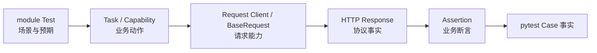
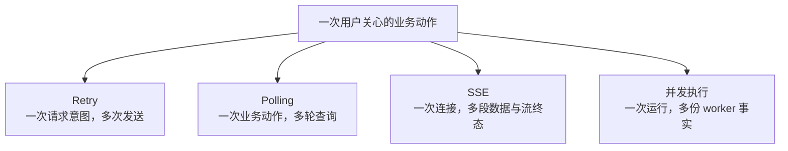
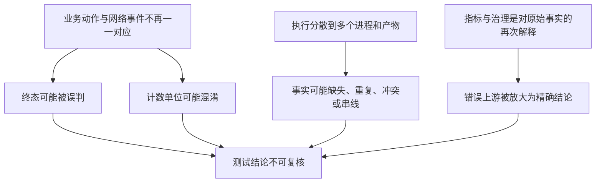
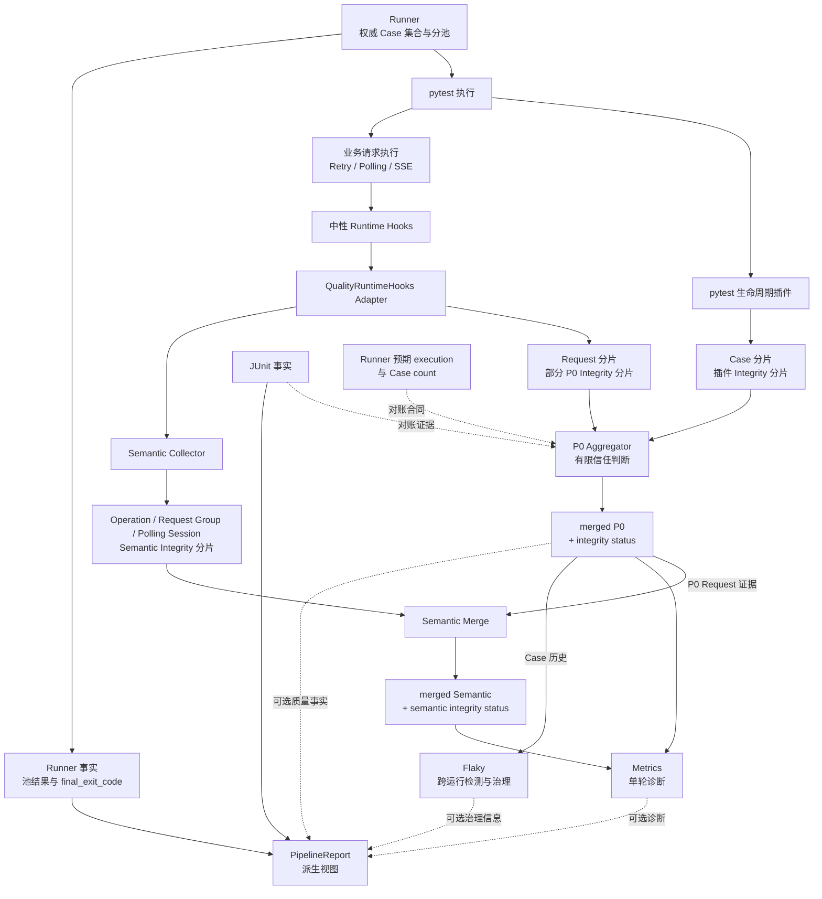
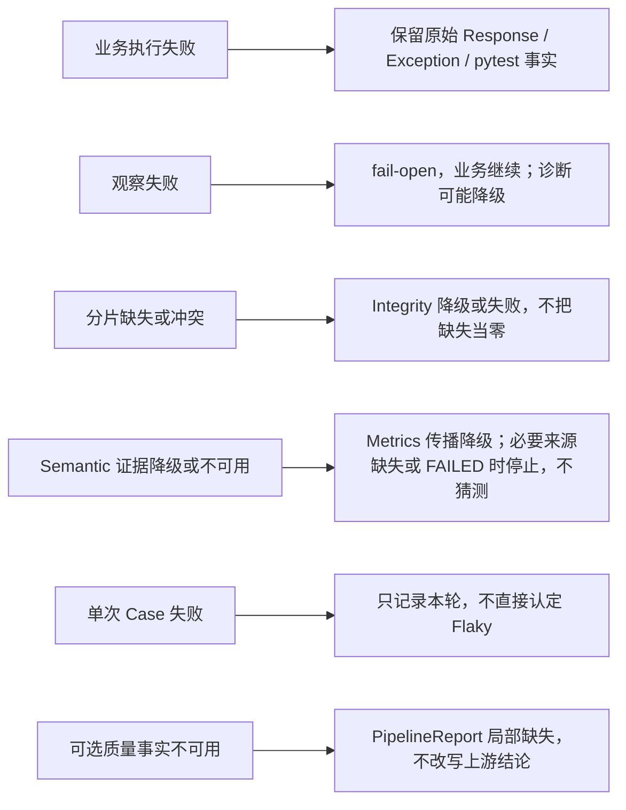

# 第 01 课：复杂 LLM 调用为什么需要可信事实链

> 本课只建立后续六项亮点共享的问题模型，不展开完整源码链。核心结论是：HTTP 请求成功只是一条局部协议事实，不能直接推出业务已经完成、Case（一次测试用例调用的最终事实）已通过、账本可信或构建成功。

## 1. 课程信息

| 项目 | 内容 |
| --- | --- |
| 建议时长 | 75 分钟 |
| 核心问题 | 为什么“请求成功”不能直接推出“测试结论可信”？ |
| 课程位置 | 八课中的总览课，为第 2～7 课建立共同问题模型 |
| 前置要求 | 无，不要求预先理解 pytest（Python 测试工具）的插件、并发 worker（独立执行进程）、JUnit（标准机器可读测试结果）或质量模块 |
| 本课主线 | 业务场景 → 复杂性带来的事实错位 → 第一性原理（从不可再简化的目标倒推必要条件）与 TOC（优先解除最大约束）→ 可信事实链 → 所有权与边界 |
| 最终结论 | 可信不是一个报告字段，而是一条从执行边界到事实来源的因果链 |

### 1.1 本课学习结果

本课结束后，学习者应能：

1. 区分请求成功、业务完成、Case（一次 pytest 用例调用及其最终测试事实）通过、账本可信和构建成功。
2. 解释 Retry（失败后按规则重试）、Polling（轮询异步状态）、SSE（持续接收服务端事件的流式响应）和并发为什么会破坏“一次请求等于一个结论”的简单模型。
3. 复述“明确终态与稳定身份 → 原始事实 → 可信归并 → 业务解释 → 指标与治理”的依赖顺序。
4. 说明框架能力、业务模块启用情况、类中已有方法和当前用例真实调用之间的区别。
5. 说出六项亮点分别在可信事实链中解决什么约束，以及它们不能保证什么。

### 1.2 本课刻意不展开

- 不按源码目录逐文件讲解。
- 不追踪完整函数调用链。
- 不讲 Retry、Polling、SSE 的具体算法和参数计算。
- 不讲 pytest 插件、上下文传播、状态机或历史持久化的内部实现。
- 不计算成功率、耗时、用量或跨运行不稳定性规则。
- 不把请求中间件或报告汇总扩展成独立主题。

这些内容不是不重要，而是尚未成为本课的主要约束。第一课若同时展开所有实现对象，学习者会记住许多名词，却仍然无法判断一个结论为什么可信。

### 1.3 75 分钟讲授路线

| 时间 | 内容 | 本段要形成的认识 |
| ---: | --- | --- |
| 0～5 分钟 | 先给结论，拆开五层事实判断 | HTTP 响应对象不是最终测试结论 |
| 5～15 分钟 | 普通 Chat 最小基线 | 看懂简单调用为什么容易形成一一对应的错觉 |
| 15～30 分钟 | 依次加入 Retry、Polling、SSE、并发 | 每增加一种复杂性，就增加一种事实错位风险 |
| 30～40 分钟 | 第一性原理与 TOC | 真正约束是事实可信度，不是请求能否发送 |
| 40～50 分钟 | 一页术语图 | 建立描述事实层级所需的最小词汇 |
| 50～65 分钟 | 可信事实链与六项亮点总览 | 理解真实依赖顺序，不提前进入实现细节 |
| 65～72 分钟 | 事实所有权、失败与降级 | 可信来自不越权、不猜测、不掩盖 |
| 72～75 分钟 | 总线收束 | 为第 2 课的复杂调用终态建立入口 |

---

## 2. 先说结论：HTTP 响应对象是证据，不是全部结论

接口测试最终要交付的不是一个 `Response`（HTTP 客户端返回的响应对象），而是一个可复核的事实判定。

`Response` 可以证明客户端收到了某个 HTTP 响应。它不能单独证明：

- 异步任务已经完成，而不是仍处于 pending。
- SSE 流已经收到业务内容并以规定终态结束。
- pytest 用例的全部断言均已通过。
- 并发 worker 产生的事实没有缺失、重复或串到别的运行。
- 统计分母来自哪些事实，以及这些事实是否完整。
- Jenkins（CI 流水线系统）构建最终成功。

本课中的 **Case**，指“一次 pytest 用例调用及其最终测试事实”；pytest 负责收集和执行 Python 测试，并给出原始测试结果。

### 2.1 五层容易被混成一件事的结论

| 层次 | 事实来源 | 它能回答什么 | 它不能单独回答什么 |
| --- | --- | --- | --- |
| 请求成功 | HTTP Response 或原始网络异常 | 客户端是否得到协议层响应 | 业务是否已经完成 |
| 业务完成 | Polling 状态或 SSE 终态等业务合同 | 复杂调用是否到达明确终态 | 用例所有断言是否通过 |
| Case 通过 | pytest 的执行、断言和异常事实 | 当前用例调用是否通过 | 本轮所有事实是否完整归并 |
| 账本完整性 | 归并器（Aggregator，对多份原始事实进行对账的组件）的判断 | 已检测到哪些问题，以及当前是 COMPLETE（完整）、DEGRADED（降级）还是 FAILED（失败） | 是否发现了每个 worker 的全部缺失，或 Jenkins 构建是否成功 |
| 构建成功 | Jenkins 的构建与阶段状态 | CI 流水线结果是什么 | 不能反向证明每项质量诊断都完整 |

Runner（项目的运行编排者）还会保存权威计划、各执行池结果，并形成项目级 `final_exit_code`。它与 pytest 的职责不同：pytest 拥有收集、执行和原始退出码；Runner 不能把这些原始事实改写成另一个版本。

### 2.2 错误推理为什么看起来合理

在最简单的同步接口里，下面几件事经常连续发生：

```text
发送一次请求
-> 收到一次 200 Response
-> 对 Response 做断言
-> pytest 给出通过
```

因为它们靠得很近，人很容易把它们压缩成一句“请求成功，所以测试成功”。问题不在于这句话永远错误，而在于它省略了成立条件。

当调用变复杂后，错误推理会变成：

```text
看见一个成功 Response
-> 假定整个业务动作已经结束
-> 假定相关网络事件全部属于同一个 Case
-> 假定所有 worker 事实都已收齐
-> 直接计算指标并生成报告
```

任何一个“假定”不成立，后面的数字都可能精确地描述一个错误样本。

---

## 3. 10 分钟基线：普通 Chat 为什么显得简单

先看当前业务模块中的普通 Chat。这里只保留理解问题所需的最小职责，不展开兼容门面、同名方法或内部函数。

在这条基线里：

- **Test** 定义测试场景与预期。
- **Task / Capability** 把场景表达成一次业务动作。
- **Request Client / BaseRequest** 负责实际请求能力。
- **HTTP Response** 是协议层返回事实。
- **Assertion** 根据预期判断 Response。

最小链路是：



如果一次 Chat 只有一次同步请求，Response 到达后立即断言，那么“一个业务动作、一次网络发送、一个最终 Response”看上去接近一一对应。这个模型适合作为基线，但不适合解释复杂 LLM 调用。

### 3.1 当前调用事实不能靠名字猜

当前普通 Chat 用例从 module Test 进入 Task，再经 BaseTask 的兼容入口委托给 Capability，最终对实际 Request Client 使用继承自 BaseRequest 的请求能力。

这条事实必须与两个容易混淆的判断分开：

| 判断 | 能否仅凭代码中存在某对象得出 |
| --- | --- |
| 框架具备 Retry 能力 | 可以通过公共实现证明 |
| 当前普通 Chat 已启用 Retry | 不可以，必须核对当前调用参数和实际链路 |
| `SmokeRequest`（当前 smoke 模块的请求客户端）中存在同名领域方法 | 可以通过类定义证明 |
| 当前用例调用了这个同名方法 | 不可以，必须由真实调用关系证明 |

因此，本课程始终区分四层事实：

```text
框架具备的能力
≠ 当前业务模块实际启用的能力
≠ 类中存在的方法
≠ 当前用例真正调用的方法
```

这四层有时会重合，但不能在没有源码证据时假定它们相同。

本课的基线与反例只保留三个最小锚点：`TestResponseBodyValidation.test_chat_completions_response_body` 证明普通 Chat 的真实业务入口；`BaseTask.create_chat_completion → MediaGenerationCapability.create_chat_completion → BaseRequest.post` 证明当前兼容调用路径；`test_stream_chat_completions_chunk_fields → iter_sse_lines` 证明 SSE 在 Response 到达后仍继续消费流。它们不用于推断其他用例也经过相同路径。

---

## 4. 加入复杂性：一一对应怎样被逐步打破

普通 Chat 的简单不是因为 LLM API 天生简单，而是因为许多复杂性尚未进入基线。下面四种情形彼此独立；某次调用可能只涉及其中一种，也可能组合出现。



图中的四条分支不是固定调用顺序，而是四种打破简单模型的原因。

### 4.1 Retry：一次请求意图不再等于一次网络发送

Retry 的直觉是“失败后再试”，但它改变了计数单位。这里的 Attempt 指一次真实网络发送：

```text
一次请求意图
-> Attempt 1：超时
-> Attempt 2：503
-> Attempt 3：200
```

这里有一个业务请求意图，却有三次真实网络发送。如果只数最终 Response，会丢失前两次成本和失败；如果把三次发送都当成三个独立业务动作，又会把分母放大。

Retry 首先要回答的不是“怎样写循环”，而是：哪些方法与结果有资格重试、还剩多少次数和时间预算、停止时保留哪个原始 Response 或异常。

必须提前保留一条边界：POST 位于 `allowed_methods`、设置 `allow_post=True`，或带有 `Idempotency-Key`，都可以获得客户端重试资格；这只说明客户端允许再次发送，不能证明服务端一定幂等。幂等是指同一请求意图重复执行时，不产生额外业务效果；它由服务端合同决定，客户端也不能保证绝不重复计费。

### 4.2 Polling：HTTP 200 可能只是“仍在处理中”

异步图片或视频生成通常先创建任务，再多次查询状态：

```text
创建任务 POST
-> 查询 GET：200 + pending
-> 等待
-> 查询 GET：200 + pending
-> 等待
-> 查询 GET：200 + success
```

三次 GET 都可能返回 HTTP 200，但前两次不是业务成功。Polling 的正确性取决于业务状态和总时间边界，而不是单看状态码。

当前 `poll_get` 的总预算覆盖各轮 GET、GET 内部 Retry 和轮询等待；创建任务的 POST 发生在进入 `poll_get` 之前，不属于这个 deadline（总截止时间）。这个边界将在第 2 课展开，本课只用它说明“一个业务动作可能存在多个不同时间范围”。

### 4.3 SSE：收到 Response 后，业务可能才刚开始

SSE 是服务器在一个 HTTP 连接上持续发送数据的流式方式。对于普通同步请求，收到完整 Response 往往接近调用结束；对于 SSE，收到 HTTP headers（响应头）只说明连接已经建立。

```text
收到 HTTP headers
-> 收到第一条非空 data
-> 收到第一个业务内容
-> 持续收到数据
-> 收到 [DONE]，或发生中断 / error
```

HTTP 200 不能单独证明已经收到任何 data、业务内容、用量字段（usage）或 `[DONE]`。自然耗尽但没有约定终态，也不能自动解释为完整成功。

当前实现没有为 SSE 提供一个与 Polling 相同的统一总 deadline。`iter_sse_lines` 依赖底层 HTTP read timeout 处理长时间收不到数据的情况，并根据 `[DONE]`、自然耗尽或异常记录流终态；`interrupt_stream_chat_completion` 的时长判断只会在下一行数据到达后执行，不能在完全静默时主动硬中断连接。因此，本课所说的“SSE 时间边界”只包括底层读取超时与消费阶段检查，不能描述成统一总预算。

### 4.4 并发 worker：一次运行不再只有一份事实

worker 是并发执行测试的独立进程。多个 worker 同时运行时，同一进程内也存在不同事实生产者：pytest 生命周期产生 Case 分片；Runtime Hooks（中性运行时观察接口）的质量适配器产生 Request 与部分 Integrity（完整性）分片；Semantic Collector（业务语义分片采集器）产生独立的业务语义分片。它们可以共享 worker 身份，但所有权不能混成一个来源。

```text
同一轮运行
├─ worker A：Case / Request / Semantic 等独立分片
├─ worker B：Case / Request / Semantic 等独立分片
└─ worker C：Case / Request / Semantic 等独立分片
```

此时“文件存在”不等于“事实齐全”。还必须回答：

- 每条事实属于哪一轮运行、哪个执行池、哪个 worker、哪个稳定 Case，以及本轮哪次具体调用？
- 同一事实是否被重复记录？
- 两条相同身份的事实是否互相冲突？
- 预期执行集合是否有 Case 分片？
- Case 数量和标准测试结果能否对上？

当前实现用五级身份回答归属问题：

```text
run_id → execution_id → worker_id → case_id → invocation_id
```

| 身份 | 本课只需掌握的含义 |
| --- | --- |
| `run_id` | 事实属于哪一轮运行 |
| `execution_id` | 事实来自哪个执行池或阶段 |
| `worker_id` | 事实由哪个 pytest worker 产生 |
| `case_id` | 跨运行比较时使用的稳定用例身份 |
| `invocation_id` | 本轮具体参数化调用的身份 |

### 4.5 四种复杂性共同制造什么问题

| 复杂性 | 被打破的一一对应 | 直接风险 | 真正需要解决的问题 |
| --- | --- | --- | --- |
| Retry | 请求意图 ≠ 网络发送 | 重复计数、重复提交、异常被掩盖 | 识别 Attempt 归属与最终出口 |
| Polling | 业务动作 ≠ 单次查询 | 把 pending 当成功、无界等待 | 定义业务终态和总预算 |
| SSE | Response 到达 ≠ 流完成 | 把连接成功当内容完整 | 区分 headers、data、内容与流终态 |
| 并发 worker | 一轮运行 ≠ 一份产物 | 缺失、重复、冲突、串线 | 建立稳定身份并进行有限归并判断 |

共同因果链是：

```text
一次业务动作被拆成多次请求和多份产物
-> 请求成功、业务成功、Case 通过和构建成功不再等价
-> 若终态、身份或来源不清，事实就可能缺失、重复或串线
-> 统计分母被污染
-> 指标越精细，错误结论反而越像真的
```

---

## 5. 第一性原理：框架真正要生产什么

从第一性原理出发，接口测试的最终产物不是 HTTP Response，而是：

> 对一次测试运行给出可复核、可归属、可追溯，并且不越权改写上游事实的判定。

要让这个判定成立，至少需要五个条件：

1. **执行有明确终点**：知道何时继续、何时成功、何时失败或超时。
2. **事实有稳定身份**：知道每条记录属于哪次运行、执行、worker、稳定 Case 和本轮具体 invocation。
3. **原始事实被保留**：Response、原始异常、pytest 退出事实不能被诊断层替换。
4. **事实来源可核对**：原始账页要经过有边界的完整性与冲突判断。
5. **派生结论不靠猜测**：业务分组、指标和历史治理只能建立在足够可信的事实之上。

所以真正的问题不是“怎样封装更多请求方法”，而是：

```text
复杂调用怎样正确结束
-> 并发执行后的事实怎样稳定归属
-> 观察能力怎样接入而不控制业务
-> 原始账页怎样形成有边界的可信基础
-> 多次网络发送怎样还原为业务动作
-> 单轮事实怎样进入跨运行治理
```

### 5.1 根因不是模块多，而是事实之间不再一一对应



因此，稳定身份、完整性状态和事实所有权不是附加装饰，而是派生结论成立的前提。

### 5.2 TOC：当前最大的约束是什么

约束理论（TOC）的核心做法，是先找到限制整体目标的最大约束，而不是平均用力。

| 层面 | 目标 | 当前最大约束 | 本课决策 |
| --- | --- | --- | --- |
| 框架设计 | 形成可信测试结论 | 复杂执行后事实能否继续被正确归属和核对 | 先保证终态、身份和基础事实，再做指标 |
| 课程理解 | 让初学者理解六项亮点为何存在 | 覆盖面过大，容易在理解可信账本前耗尽注意力 | 只引入解除当前约束所需对象，算法细节后移 |

如果从单轮指标或跨运行治理开始，学习者会先看到结论形式，却不知道分母来自哪里；如果按源码目录从头讲，会先消耗大量注意力，却没有共同问题模型。

所以本课采用的 TOC 顺序是：

```text
先拆开不同层次的事实
-> 再看复杂性怎样制造错位
-> 再建立最小术语
-> 最后放入可信事实链
```

---

## 6. 一页术语图：只保留六个必要对象

| 术语 | 本课程中的准确含义 | 它避免的混淆 |
| --- | --- | --- |
| Case | 一次 pytest 用例调用及其最终测试事实 | 不把一次网络请求当成一次用例 |
| Operation | 用户关心的一次逻辑业务动作 | 不把创建、轮询或 Retry 拆成多个业务目标 |
| Request Group | 一次请求意图及其全部 Retry Attempt | 不把每次重试都算成独立请求意图 |
| Request Event | 一次真实网络发送，也可称一次 Attempt | 不丢失每次发送的耗时、Response 或异常 |
| Polling Session | 为等待异步任务终态而形成的多轮查询过程 | 不把每轮查询误当成完整异步业务 |
| P0 | Aggregator 归并后的 Case、Request（请求）、Failure（失败）与 Integrity（完整性证据）基础事实层 | 不让派生指标绕过基础事实可信度 |

它们之间的最小关系是：

```text
Case
└─ Operation
   ├─ Request Group
   │  └─ Request Event / Attempt 1..N
   └─ Polling Session
      └─ Request Group 1..N
```

需要注意两点：

1. 图表达的是业务归属，不是说每个 Operation 必须同时拥有 Retry 和 Polling。
2. P0 是经过归并判断的基础事实层，不是“所有数据必然完整”的同义词；它仍带有完整性状态。

---

## 7. 核心实现思路：先形成可信基础，再允许下游解释

当前实现不能描述成“Runner 依次调用 Hooks、worker、Aggregator、Semantic”的单线流水线。更准确的实现摘要是：Runner 先形成权威 Case 计划并交给 pytest 执行；执行期间，pytest 生命周期、Runtime Hooks（中性运行时观察接口）及其 Quality Adapter（质量适配器）、Semantic Collector（业务语义分片采集器）分别产生不同所有权的事实分片；P0 归并与语义归并再按各自证据合同处理这些来源。

本节只新增三个下游概念：

- **Semantic Merge**：同时读取 Semantic 分片与 P0 Request 证据，形成合并后的业务分组事实。
- **Metrics**：读取 P0 和合并后的 Semantic，形成单轮诊断指标。
- **Flaky**：读取可信 P0 Case 历史，形成跨运行检测与治理信息。

PipelineReport 是汇总 Runner、JUnit 和可选质量事实的派生视图，不是新的事实所有者。

因此，下游依赖是：Semantic Merge 同时读取 Semantic 分片与 P0 Request 证据；Metrics 同时读取 P0 与 merged Semantic；Flaky 独立读取 P0 Case 历史；最终报告只汇总已有事实，不反向修改 pytest、Runner 或 Jenkins 的结论。

### 7.1 真实依赖图



这张图表达事实来源、所有权与数据依赖。必须读准五条关系：

1. pytest 生命周期独立产生 Case 分片；它不是 Runtime Hooks 的下游。
2. Runtime Hooks 经 Quality Adapter 产生 Request 与部分 P0 Integrity 事实，同时把业务生命周期交给 Semantic Collector。
3. Semantic Collector 独立写出 Operation、Request Group、Polling Session 与 Semantic Integrity 分片；Semantic Merge 同时读取这些分片和 P0 Request 证据。
4. Metrics 同时依赖 P0 与合并后的 Semantic；DEGRADED 来源仍可能进入 Metrics，状态和证据必须随结果保留。
5. Flaky 直接消费 P0 Case 历史，不依赖 Metrics。

Semantic 主要作为 Metrics 的上游业务分组与证据层，经 Metrics 间接进入 Pipeline Reporting，不应被描述成与 Metrics 并列的直接报告结论来源。

### 7.2 六项亮点路线预告与最小证据

本节只回答“约束—当前机制—不能保证什么”，不替代后续课程的详细讲解。每项只保留一至三个符号级锚点，用于闭合当前实现证据，不做源码导航。

| 约束与适用场景 | 当前机制、事实出口与最小源码锚点 | 降级、代价与不能保证 |
| --- | --- | --- |
| **Retry / Polling / SSE**：三种循环不能共用一个“成功返回”定义 | Retry 用次数、`max_elapsed`（单组重试总耗时边界）和可选外层 deadline 控制尝试；Polling 用总 deadline 约束各轮 GET、内部 Retry 与 sleep；SSE 依赖 read timeout、`[DONE]` 和消费终态。锚点：`RetryExecutor.execute`、`BaseRequest.poll_get`、`iter_sse_lines` | 客户端重试不保证服务端幂等；SSE 当前没有统一总 deadline，按行检查的持续时间也不是静默期硬中断 |
| **Runner 与稳定身份**：混合并发执行需要唯一计划和可归属事实 | Runner 先权威收集再分池；pytest 插件写出五级身份的 Case 事实。锚点：`run_orchestration.runner.run`、`quality.pytest_plugin_runtime.pytest_runtest_logreport` | pytest 仍拥有收集、执行和原始退出码；身份与集合合同需要长期稳定，质量诊断不能改写原始事实 |
| **Runtime Hooks**：可选观察不能成为业务硬依赖 | `common`（业务公共层）只认识中性协议；关闭 Quality 时使用 Noop（不采集质量事实的空实现），开启时由 Adapter 映射到质量采集。锚点：`RuntimeHooks`、`NoopRuntimeHooks`、`QualityRuntimeHooks` | fail-open（观察失败时保留业务事实）只保证观察故障不覆盖业务结果；通用安全层仍可能静默吞掉异常，不能保证所有 Hook 故障都有可见证据 |
| **Aggregator**：多份 worker 账页必须先经过有限对账 | P0 Aggregator 检查 run、Schema（记录结构规则）、冲突、数量、JUnit 身份及预期 execution 的 Case 分片，并记录来源与输出哈希（按文件内容生成的摘要）。锚点：`quality.aggregator.merge_quality_run` | 已检测到的问题不会无证据进入下游；DEGRADED P0 仍可进入 Metrics。分母有可追溯来源和完整性状态，但不能保证发现每个 worker 的所有缺失 |
| **Semantic / Metrics**：网络发送必须先还原为业务动作 | Semantic Collector 独立写语义分片；Semantic Merge 结合语义分片与 P0 Request 证据；Metrics 再读取 P0 和 merged Semantic。锚点：`SemanticCollector`、`merge_semantic_run`、`aggregate_run_metrics` | 缺失必须表达为 unknown（未知）、no_data（无样本）或 not_applicable（不适用），不能猜成 0；Semantic 不是与 Metrics 并列的直接报告结论来源 |
| **Flaky**：单次失败不能直接形成跨运行定性 | Flaky 直接导入 P0 Case 与 Failure 历史；结果签名是 `pass` 或 `fail:{failure_id}`，用于比较同一 Case 的跨运行结果。锚点：`prepare_flaky_import`、`import_flaky_history` | 自动检测、人工治理和执行行为必须分层；`QUARANTINED` 当前不会自动跳过 Case，历史维护也有持久化成本 |

---

## 8. 事实所有权：可信首先意味着不越权

当多个模块都能产生“状态”或“结论”时，最危险的设计不是缺少一个总控制器，而是没有明确谁拥有哪类事实。

| 事实 | 所有者 | 下游可以做什么 | 下游不能做什么 |
| --- | --- | --- | --- |
| 收集、执行、Case 原始结果与原始退出码 | pytest | 读取、保存、展示 | 用质量诊断覆盖原始结果 |
| 权威计划、分池、池结果和项目级 `final_exit_code` | Runner | 向报告提供项目执行事实 | 改写 pytest 的池级原始退出码 |
| Case 数量、状态和错误证据 | JUnit 产物 | 用于对账和展示 | 取代 pytest 或 Runner 的退出事实 |
| P0 与 integrity status | Aggregator | 携带来源证据和完整性状态供下游判断；FAILED 阻断 Metrics，DEGRADED 可带状态继续 | 把流程提交成功等同于数据完整，或声称已发现所有缺失 |
| 单轮业务指标 | Metrics | 提供诊断 | 覆盖 Case、Runner 或 Jenkins 结论 |
| 跨运行检测与治理 | Flaky | 解释历史不稳定性、保存治理信息 | 因一次失败直接定性，或自动改变当前选例 |
| build 与 stage status | Jenkins | 作为 CI 原始事实被读取 | 由 PipelineReport 反向改写 |
| 汇总视图 | PipelineReport | 统一呈现已有事实 | 制造第二套测试结论 |

### 8.1 观察失败时，为什么业务事实必须优先

Runtime Hooks 的 fail-open 含义是：观察失败时，不用观察异常替换业务 Response、原始异常或 pytest 结果。

这条设计避免了下面的因果倒置：

```text
业务请求本来成功
-> 质量回调异常
-> 若异常逃出并替换业务结果
-> 观察系统反而成为业务失败原因
```

但 fail-open 不等于“所有诊断都成功”，也不等于“所有观察故障都可见”。当前通用 Hook 安全层会静默吞掉逃逸异常；Quality 的 Request 与 Semantic 路径会对多类已知采集失败尽力记录 Integrity，但不能保证每个 Hook 异常都有可见证据。

因此，准确结论是：

- 当前保证：观察故障不覆盖业务事实。
- 当前边界：部分诊断可能静默降级。
- 未来改进方向：让更多观察故障留下明确 Integrity 证据；这不是当前已经完全实现的保证。

### 8.2 数据缺失时，为什么不能自动补零

假设一次流式调用没有采集到 Token：

- 写成 known zero，表示“已确认数值为 0”。
- 写成 unknown，表示“应该有值，但当前不知道”。
- 写成 no_data，表示“没有可用样本”。
- 写成 not_applicable，表示“这个指标对当前对象不适用”。

四种语义不同。把缺失写成 0 会让均值、总量和趋势同时失真，所以 Metrics 必须同时表达样本数与 completeness，而不是只给一个看似完整的数字。

### 8.3 manifest（归并清单）提交成功为什么不等于账本可信

Aggregator 的两个状态回答不同问题：

- `manifest.status=complete`：归并流程已经完成并提交输出。
- `integrity_status`：归并后的事实被判断为 COMPLETE、DEGRADED 或 FAILED。

流程可以正常结束，同时判断输入账本不可信。源分片哈希在扫描时被记录；merged 输出全部完成后，才生成 output SHA256。SHA256 是根据文件内容计算的摘要，可用于检查下游读取的产物是否与清单记录一致。记录源哈希不能被夸大成“归并前已经拿预期哈希验证全部来源”。

当前 Metrics 会拒绝 integrity 为 FAILED 的 P0，但 DEGRADED P0 仍可能被读取并形成带降级状态的指标。因此，Aggregator 的价值是让已检测到的问题带着证据进入判断，而不是保证所有错误都已被发现。

### 8.4 当可信链某一段失败时



可信并不意味着系统永远没有失败，而是失败发生时仍能分清：什么已经知道、什么尚且未知、什么结论不能继续推导。

---

## 9. 设计收益、工程代价与适用场景

### 9.1 主要收益

| 收益 | 原因 |
| --- | --- |
| 复杂调用具有可解释终态 | Retry、Polling、SSE 不再共用模糊的“成功返回” |
| 并发事实可归属、可对账 | 权威集合和稳定身份保护 Case 与请求事实 |
| Quality 可以保持可选 | common 只依赖中性 Hooks，关闭时使用 Noop |
| 指标分母来源可追溯 | Aggregator 提供来源证据和完整性状态；这不等于保证发现所有 worker 缺失 |
| 网络事实可以被解释为业务动作 | Semantic 先分组，Metrics 再计算 |
| 单轮失败可以进入长期治理 | Flaky 使用可信 Case 历史，而不是一次结果下结论 |

### 9.2 必须支付的代价

- Retry 的尝试预算、Polling 的总 deadline，以及 SSE 的读取超时和消费终态必须分别维护。
- Runner 的权威集合与五级身份需要稳定合同。
- Hooks、Noop、Adapter、生命周期责任和上下文传播增加抽象成本。
- worker 分片、Schema、manifest、哈希和完整性状态需要长期兼容。
- Semantic 与 Metrics 依赖标准入口和足够完整的上下文。
- Flaky 只有积累可比较历史后才真正有价值，并带来持久化与规则维护成本。

这些代价不是越多越好。它们只在解除“复杂执行后的事实可信度”这一约束时有价值。

### 9.3 适用边界

| 判断 | 典型场景 |
| --- | --- |
| 适合 | 流式或异步 API、存在重试和计费风险、并发执行、需要机器证据审计或跨运行治理 |
| 可能过重 | 少量同步 CRUD、一次性接口脚本、无并发且不需要历史质量治理 |

框架的价值不在于对所有项目都使用最多层次，而在于让复杂度出现时，每一层都能回答一个不可替代的问题。

---

## 10. 本课收束：可信是一条因果链

本课只需要记住这一条设计总线。它表达教学上的因果顺序，不代表运行时按箭头串行调用；当前实现的并行事实源以 7.1 节为准。

```text
复杂调用先获得明确终态
-> Runner 权威集合与稳定身份保护执行事实
-> Runtime Hooks 非侵入地产生旁路观察
-> worker 原始账页进入 Aggregator 有限信任判断
-> 可信 P0 与 Semantic 形成单轮 Metrics
-> 可信 P0 Case 历史独立进入 Flaky 治理
-> 事实所有权约束最终派生视图
```

它回答了开头的问题：

> “请求成功”不能直接推出“测试结论可信”，因为请求只提供局部协议事实；可信结论还依赖明确业务终态、权威执行事实、稳定身份、完整性判断、正确业务分组和不越权的派生关系。

下一课将只处理这条链的第一个约束：Retry、Polling 和 SSE 为什么看起来都在“循环”，却必须拥有不同的循环单位、正常终态与失败出口，并分别理解 Retry 尝试预算、Polling 总 deadline 和 SSE 读取/消费边界。
