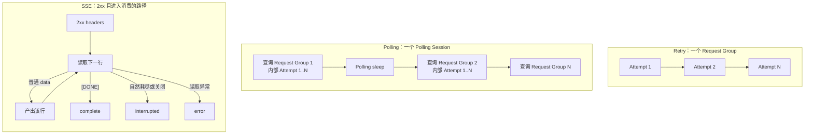
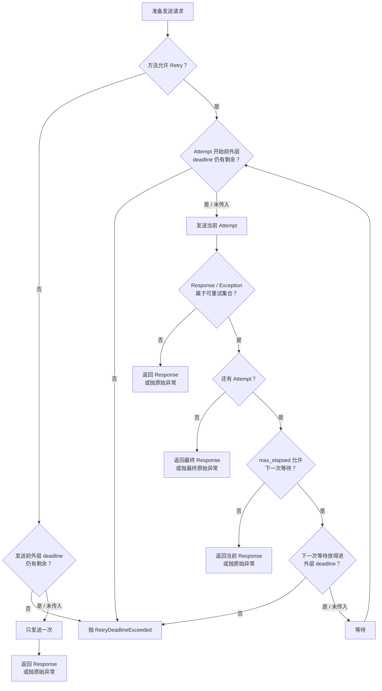
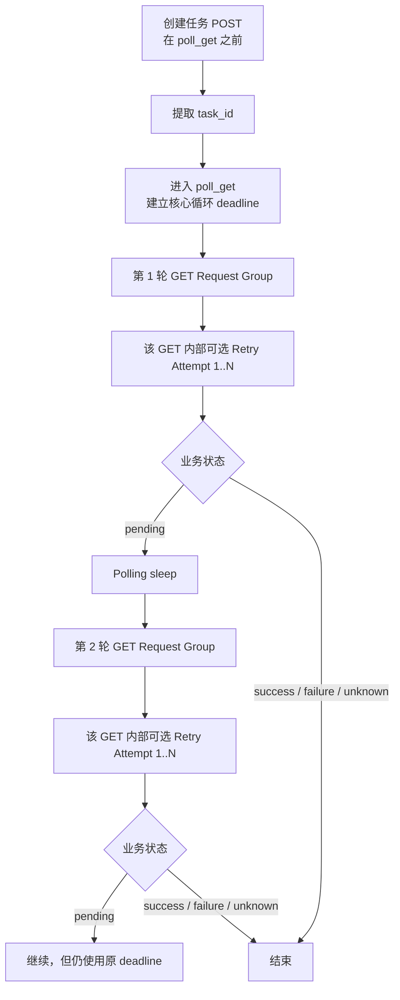
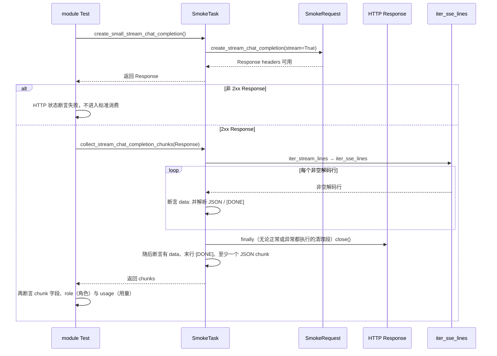

# 第 02 课：Retry、Polling、SSE 的正确性边界

> 本课只解决一个问题：三种看起来都在“重复”的复杂调用，为什么不能共用一个“成功返回”定义。Retry（重试）决定同一请求是否再发送一次；Polling（轮询）重复查询异步任务状态；SSE（服务器事件流）在一个连接上持续接收数据。当前实现中，Retry 只有进入下一次尝试与等待的准入判断，Polling 有覆盖状态查询核心循环的 deadline（截止时间）；SSE 的非 2xx（状态码不在 200～299）Response 不进入标准消费，2xx 消费则依赖底层 read timeout（单次读取超时）和消费终态。

## 阅读本课前的极短基线

- HTTP 是客户端与服务端交换请求和响应的协议。Response 是服务端返回的响应对象。
- GET 通常用于读取状态，POST 通常用于提交数据或创建任务；是否真的没有副作用仍由接口合同决定。
- HTTP 200 只表示服务端在 HTTP 协议层返回成功响应，不自动代表异步任务完成或流式内容完整。
- headers 是先到达的响应元信息，body 是响应内容；SSE 会在 body 中持续发送以 `data:` 开头的数据行。
- JSON 是用键和值表达结构化数据的文本格式；chunk 指流中逐块到达的数据片段。
- Attempt 指一次真实网络发送；`max_elapsed` 只判断能否进入下一次 Retry 等待与 Attempt，不是硬总时限。
- transition 指一次成功完成状态分类后形成的 Polling 状态记录；单调时钟只向前计时，不受系统时间校准影响，适合计算 deadline。
- 本课中的 module 指仓库里的真实业务用例模块；smoke 指用少量关键调用快速验证基本能力的冒烟用例集合。

## 1. 课程信息

| 项目 | 内容 |
| --- | --- |
| 建议时长 | 75 分钟 |
| 核心问题 | Retry、Polling、SSE 为什么必须分别定义继续条件和结束条件？ |
| 本课位置 | 可信事实链的第一项基础约束：先让复杂调用正确结束 |
| 前置要求 | 无；上面的极短基线已经解释本课首先会用到的协议词 |
| 第一性原理 | 循环正确性来自“重复单位、继续证据、终态和资源边界”四件事明确，而不是来自一个通用 `while` |
| TOC 约束 | TOC 表示优先解除最大约束；本课先防止两种强度误判：把软准入写成硬总时限，把协议 complete 写成业务成功 |
| 核心边界 | 客户端允许重试不等于服务端幂等；幂等指同一请求意图重复执行不产生额外业务效果；HTTP 200 不等于 Polling 或 SSE 已完成 |

### 1.1 本课学习结果

本课结束后，学习者应能：

1. 区分 Retry、Polling 和 SSE 各自重复的对象。
2. 说明 Retry 的方法资格、结果资格、尝试次数、`max_elapsed` 与外层 deadline 分别限制什么，并解释后两者为什么都不是当前 Attempt 的硬中断器。
3. 解释 Polling 为什么由多轮独立查询构成，以及创建任务 POST 为什么不属于状态查询核心循环的 deadline。
4. 说明 Polling 的四类业务状态出口，以及解析、请求和传输异常为什么不能都改写成 timeout。
5. 区分 SSE 的响应 headers、首条 data、首个已识别文本内容和流终态。
6. 准确说明当前 smoke 用例真正启用了哪些能力，哪些只是框架具备但当前调用没有启用。

### 1.2 本课刻意不展开

- 不讲 RequestContext、Header 合并、脱敏或 Middleware 内部过程。
- 不展开运行时观察、生命周期责任或业务语义采集的内部实现。
- 不计算 Metrics，也不讲下游报告如何展示这些事实。
- 不追踪完整函数调用链，不按源码文件顺序讲解。

本课只保留理解正确性边界所需的代码对象。观察事实怎样非侵入地产生，留到第 4 课展开。

### 1.3 75 分钟讲授路线

| 时间 | 内容 | 本段结论 |
| ---: | --- | --- |
| 0～8 分钟 | 业务困境与核心结论 | 三种机制重复的对象不同 |
| 8～18 分钟 | 第一性原理与 TOC | 先问“重复什么”，再问“何时结束” |
| 18～35 分钟 | Retry | 同一请求意图内决定是否再发送一次 |
| 35～53 分钟 | Polling | 多轮独立查询共享状态查询核心循环的 deadline |
| 53～68 分钟 | SSE | HTTP 响应对象到达后仍需消费内容并识别流终态 |
| 68～73 分钟 | 当前 module 接入与工程取舍 | 能力存在不等于当前调用已经启用 |
| 73～75 分钟 | 本课收束 | 用三种不同出口保护后续事实可信度 |

---

## 2. 先说结论：三个循环重复的不是同一件事

先看三个业务场景：

```text
场景 A：一次 GET 遇到 503（服务暂时不可用），等待后再次发送同一请求意图
场景 B：创建图片任务后，反复查询任务是否完成
场景 C：建立 SSE 连接后，持续读取服务器发来的数据段
```

它们表面上都有“继续还是结束”的判断，但内部单位不同：

- **Retry** 重复同一请求意图中的网络发送。
- **Polling** 重复一次业务等待过程中的独立状态查询。
- **SSE** 的消费循环不重复 HTTP 请求，而是在一个连接上持续消费数据；初始 HTTP 请求仍可配置 Retry。

本课使用四个最小对象；下文的 `Response` 指 HTTP 客户端返回的响应对象：

| 对象 | 含义 |
| --- | --- |
| Attempt | 一次真实网络发送 |
| Request Group | 一次请求意图及其全部 Retry Attempt |
| Polling Session | 为等待异步终态而形成的多轮查询过程 |
| SSE | Server-Sent Events，服务器在一个 HTTP 连接上持续发送事件的数据流；当前协议用 `data: [DONE]` 表示完成标记 |

因此，三者的基本关系是：



这三组是并列模型，不表示一次调用必然同时经过全部机制。Polling 的某一轮 GET 可以内部 Retry；框架也允许 SSE 的初始 HTTP 请求按策略 Retry，但当前 smoke 路径没有启用。SSE 的每个数据段都不是新的 Request Group。

### 2.1 错误抽象怎样制造错误结论

如果把三者都压成“失败就循环”，会出现三类错误：

```text
Retry 不区分方法资格
-> 对有副作用的 POST 重复提交
-> 可能创建多个任务或重复计费

Polling 只看 HTTP 状态码
-> 200 + pending（仍在处理）被当作业务成功
-> 尚未完成的任务被提前返回

SSE 把 Response 到达当作结束
-> 只证明连接建立
-> 未证明收到 data、内容或 [DONE]
```

真正需要解决的问题不是“怎样写一个更通用的循环”，而是为每种循环分别回答：

1. 重复的最小单位是什么？
2. 什么证据允许继续？
3. 什么事实构成正常终态？
4. 失败时返回 Response，还是抛出异常？
5. 什么资源边界阻止它无限继续？

---

## 3. 第一性原理与 TOC：先确定循环合同

第一性原理是从不可再简化的目标倒推必要条件。复杂调用的最小目标不是“循环执行成功”，而是：

> 在有限资源内，依据明确证据到达一个不会被误解的客户端终态，并保留最后的原始 Response 或异常。

这个目标至少要求四部分合同：

| 合同 | 必须回答的问题 |
| --- | --- |
| 循环单位 | 每次继续时，究竟重新发送请求、重新查询状态，还是读取下一段数据？ |
| 继续条件 | 当前方法、结果或业务状态为什么允许继续？ |
| 终态 | success（成功）、failure（失败）、unknown（未知）、timeout（超时）、interrupted（中断）、error（错误）中哪一种已经发生？ |
| 资源边界 | 哪个次数、等待时间、deadline 或底层读取超时限制继续？ |

### 3.1 TOC：当前最大的理解约束

约束理论（TOC）要求先解除限制整体理解的最大瓶颈。本课的瓶颈不是参数太多，而是事实强度容易被写大：学习者既可能把三种重复行为都理解为 Retry，也可能把离散预算检查当成硬计时器、把协议 complete 当成用例成功。

一旦强度写大，就会形成错误因果链：

```text
软准入被写成硬上限，或协议终态被写成业务结论
-> 学习者误判超时与失败由谁产生
-> 排障时把下载耗时、业务断言或收尾诊断归给错误机制
-> 后续事实所有权失真
```

解除顺序应当是：

```text
先问重复什么
-> 再问依据什么继续
-> 再标明检查是软准入还是硬中断
-> 再分开协议、观察、业务断言和收尾诊断
-> 最后说明各层如何正常结束或失败
```

如果顺序反过来，直接记忆 `max_attempts`、`poll_timeout` 或 `[DONE]`，学习者会记住参数，却不知道参数保护的是哪一层业务事实。

### 3.2 三种循环合同总览

| 机制 | 循环单位 | 继续条件 | 当前正常出口 | 当前失败或异常出口 | 时间边界 |
| --- | --- | --- | --- | --- | --- |
| Retry | 同一 Request Group 中的 Attempt | 方法允许、结果可重试、还有尝试与等待空间 | 返回不再重试的最终 Response | 抛出最终原始异常；仅在进入 Attempt 前已无外层剩余时间，或下一次 Retry 等待放不进外层 deadline 时抛 `RetryDeadlineExceeded` | `max_attempts`；`max_elapsed` 与外层 deadline 都只在特定准入点检查 |
| Polling | 多个独立 GET Request Group | 业务状态为 pending 且核心循环 deadline 未耗尽 | success 时返回最终 Response | failure、unknown、timeout、解析异常；普通请求或传输异常原样透传 | 各轮 GET、GET 内 Retry 与 Polling sleep 共用核心循环 deadline；成功后的可选结果下载不在其中 |
| SSE | 一个连接中的数据段 | 连接仍可读取且消费者继续迭代 | 2xx 标准消费看到 `[DONE]` 可记为 complete | 非 2xx 不进入标准消费；协议结果、业务断言与可选收尾诊断属于不同事实层 | 底层 read timeout；可选消费方法可在数据到达后检查时长，但当前没有统一总 deadline |

---

## 4. Retry：同一请求意图内的再次发送

**核心实现思路摘要**：Retry 先判断当前 HTTP 方法是否有客户端重试资格，再判断 Response 或异常是否值得重试，最后在特定准入点检查次数、`max_elapsed` 与可选外层 deadline 是否允许下一次 Attempt。Response 路径保留最终 Response，异常路径保留原始异常；这些检查不是当前请求的硬中断器，Retry 也不拥有服务端幂等事实。

### 4.1 设计目标与因果链

Retry 适用于瞬时网络错误、限流或暂时性服务故障。它要解决的是“偶发失败是否值得再尝试一次”，而不是把所有失败自动变成成功。

```text
一次请求可能遇到瞬时故障
-> 立即失败会损失可恢复机会
-> 无条件重试又可能放大副作用与计费
-> 必须同时检查方法资格、结果资格和剩余预算
-> 才能决定是否创建下一次 Attempt
```

Retry 的事实所有权也必须清楚：

- Retry 决定客户端是否再次发送。
- HTTP 服务端决定同一业务意图是否真正幂等。
- 调用方断言决定最终 Response 是否满足业务预期。
- Retry 不能把 503 伪装成 200，也不能把 Timeout 伪造成 Response。

### 4.2 三道决策门



第一道门是方法资格，第二道门是结果资格，第三道门是预算。缺少任何一道，Retry 都可能从恢复机制变成风险放大器。

### 4.3 POST 的三条客户端资格路径

`RetryPolicy` 是保存方法、结果、次数和等待规则的策略快照，`RetryExecutor` 是执行循环的对象。当前 `is_method_retry_allowed` 按以下顺序判断：

1. 方法已经显式位于 `RetryPolicy.allowed_methods`。
2. 如果方法是 POST，`allow_post=True`。
3. 如果方法是 POST，请求 Header（请求头）中存在配置的 `Idempotency-Key`。

默认 `allowed_methods` 只有 GET 和 HEAD，POST 默认没有资格。非 POST 的其他方法若不在 `allowed_methods` 中，也没有资格。

这里的幂等，是指同一请求意图重复执行时不产生额外业务效果。三条路径只授权客户端再次发送，不证明服务端会识别 Key、复用原结果或避免再次扣费。

如果方法没有 Retry 资格，当前执行器并不会因此拒绝业务请求；在外层 deadline 仍有剩余时间时，它正常发送一次，不进入多次 Attempt。

### 4.4 结果资格与当前默认规则

| 规则 | 当前默认值或行为 | 设计含义 |
| --- | --- | --- |
| 最大 Attempt | `max_attempts=3` | 最多进行三次真实发送 |
| 可重试状态码 | 429、500、502、503、504 | 只对配置的暂时性响应再次尝试 |
| 可重试异常 | `ConnectionError`、`Timeout` | 网络连接或超时可以再次尝试 |
| 明确排除 | `SSLError`、`TooManyRedirects` | 即使属于连接异常体系，也不自动重试 |
| 等待策略 | 默认 exponential（指数增长），可选 fixed（固定等待） | 控制下一次 Attempt 前的等待 |
| 等待扰动 | 默认启用 jitter（随机扰动） | 减少多个客户端同时再次请求 |
| 服务端提示 | 可读取 `Retry-After`（服务端建议等待时长） | 尊重服务端建议，但仍受 `max_delay`（单次等待上限）限制 |
| Retry 准入判断 | 默认 `max_elapsed=30` 秒 | 判断是否还允许进入下一次等待与 Attempt；不是单组墙钟时间（实际经过时间）的硬上限 |

jitter 是在等待时间内加入随机扰动；backoff 是随着尝试次数调整等待时长。它们改变发送节奏，不改变最终业务事实。

### 4.5 Response 路径和 Exception 路径不能混为一谈

| 最后得到的事实 | 当前退出行为 | 为什么 |
| --- | --- | --- |
| 非可重试 Response | 直接返回该 Response | 服务端已经给出协议层结果 |
| 可重试 Response，但已达最大次数 | 返回最后一个 Response | 由调用方继续断言，例如最终仍是 503 |
| 可重试 Response，但下一次等待会超过 `max_elapsed` | 返回最后一个 Response | 不伪造新的异常覆盖现有协议事实 |
| 非可重试异常或已达最大次数 | 重新抛出原始异常 | 客户端没有可用 Response |
| 异常路径下一次等待会超过 `max_elapsed` | 重新抛出原始异常 | 保留真正失败原因 |
| 进入 Attempt 前外层 deadline 已无剩余时间 | 抛 `RetryDeadlineExceeded` | 当前 Attempt 不再开始 |
| 结果仍可重试，但下一次等待放不进外层 deadline | 抛 `RetryDeadlineExceeded` | 不进入下一次等待与 Attempt |

这条边界让上层能够区分：服务端明确返回了失败响应，还是客户端根本没有得到协议层响应。

### 4.6 三种预算分别限制什么

| 边界 | 限制对象 | 当前不会保证什么 |
| --- | --- | --- |
| `max_attempts` | 真实发送次数 | 不限制每次网络调用自身耗时 |
| `max_elapsed` | 当前结果仍可重试时，是否还能进入下一次 Retry 等待与 Attempt | 不硬中断当前网络调用，也不对最终或不可重试 Response 做统一的事后超时判定 |
| 外层 deadline | Attempt 开始前是否仍有剩余时间，以及下一次 Retry 等待是否放得下 | 只有调用方传入时才存在；同样不主动中断已经执行的请求 |

当外层 deadline 存在时，当前实现会在构造每次请求时把底层请求 timeout 压缩到当时的剩余时间，并拒绝放不进剩余时间的 Retry sleep。它仍是离散检查点，不是后台计时器：请求已经发出后，不会由 RetryExecutor 主动硬中断；最终或不可重试 Response 也会直接返回。Polling 正是把这组软准入检查嵌入自己的核心循环。

### 4.7 当前 module 的真实接入边界

当前框架已经具备 `RetryPolicy` 和 `RetryExecutor`，`BaseRequest.request` 也只会在调用方显式传入 `retry_policy` 时进入 Retry。

当前 smoke 路径的事实是：

- `BaseTask.poll_media_generation_result` 和 `create_and_poll_media_generation` 暴露可选 `retry_policy`。
- 当前异步图片用例只传入 `poll_interval` 与 `poll_timeout`，没有传入 `retry_policy`，实际值为 `None`。
- 创建任务 POST 通过 `create_media_generation` 完成，不接收这个 Polling Retry 参数。
- 当前 smoke 代码中没有构造或显式传入 `RetryPolicy` 的业务用例。

因此，准确结论是：框架支持 Retry；当前这些 smoke 用例真实启用了 Polling，但没有启用 Polling 内部 GET Retry，也没有让创建 POST 随轮询一起 Retry。

### 4.8 收益、代价与降级行为

- 收益：瞬时错误拥有有限恢复机会；Response 路径保留最终 Response，普通异常路径重抛原异常，但 `RetryDeadlineExceeded` 是明确的外层 deadline 出口。
- 代价：策略选择、等待计算和业务入口接入增加复杂度。
- 降级：没有传入 `retry_policy` 时正常单发，不把“未启用 Retry”当成业务失败。
- 边界：错误配置 POST 资格仍可能造成重复副作用；客户端无法替服务端承诺幂等。

---

## 5. Polling：多轮独立查询共享一个核心循环 deadline

**核心实现思路摘要**：Polling 进入状态查询核心循环时创建一个 deadline；每轮发起新的 GET Request Group，该 GET 可以在同一剩余预算内 Retry；Response 再由 PollingPolicy（业务状态映射规则）映射为 pending、success、failure 或 unknown。只有 pending 允许等待并进入下一轮。创建任务 POST、核心循环成功后的可选结果下载都不属于这个 deadline；普通请求或传输异常除 `RetryDeadlineExceeded` 外原样透传。

### 5.1 设计目标与因果链

当前工作流不把创建 Response 直接当作最终结果。它提取任务标识后继续查询，因此 Polling 要解决的不是网络重发，而是业务状态随时间变化：

```text
创建请求返回，且能提取任务标识
-> 响应至少提供可提取的任务标识
-> 当前工作流仍以查询到的业务终态为准
-> 客户端需要多次独立查询
-> 每轮 HTTP 200 仍可能只是 pending
-> 必须按业务状态决定继续或结束
```

因此，一次 Polling Session 包含多个 Request Group；某一轮 GET 如果启用 Retry，又可以包含多个 Attempt。

### 5.2 创建与轮询的真实嵌套关系



创建 POST 在进入 `poll_get` 前已经完成，所以不属于状态查询核心循环的 deadline。`retry_policy` 只传给各轮查询 GET，也不会自动应用到创建 POST。

### 5.3 PollingPolicy 怎样形成业务状态

状态机是“根据当前状态和输入决定下一状态或出口”的规则。本课只需要理解当前分类优先级：

1. Response body 必须能解析为 JSON，随后先从 `status_json_path` 提取原始状态。
2. 如果 `error_json_path` 提取到的值不是 `None`（Python 中表示“没有值”），判定 failure。
3. 如果 `result_json_path` 提取到的值不是 `None`，判定 success。
4. 否则用已经提取的原始状态依次匹配 pending、success、failure 集合。
5. 未识别状态由 `unknown` 策略处理。

源码先提取原始状态，再检查 error 和 result；上面的先后描述的是最终分类优先级，不表示到第 4 步才读取状态字段。

当前默认媒体策略包括：

| 状态类别 | 典型当前值 | 客户端行为 |
| --- | --- | --- |
| pending | queued、running、pending、processing | 继续等待并查询 |
| success | succeeded、success、completed，或结果路径的值不是 `None` | 返回最终 Response |
| failure | failed、cancelled、canceled，或错误路径的值不是 `None` | 抛 `PollingFailedError` |
| unknown | 不属于以上集合 | 默认抛 `PollingUnknownStateError` |

`PollingPolicy.unknown` 还可以配置为 `pending` 或 `ignore`；当前两者都会把未识别状态按 pending 继续处理。这可以提高兼容性，也可能把错误状态拖到最终 timeout，因此是明确的策略代价。

HTTP 状态和业务状态属于不同层。若某轮 GET 启用了 Retry，配置中的 429、503 等响应会先经过 Retry 决策；Retry 停止后留下的最终 Response 才进入 PollingPolicy。若未启用 Retry，返回的 Response 会直接进入业务状态解析，HTTP 状态码本身只作为 transition 证据，不自动等同于 Polling success 或 failure。

空字符串、`0` 和 `False` 都不是 `None`，因此也会触发对应的 error 或 result 路径判断。这里判断的是“路径是否给出了值”，不是 Python 意义上的真假。

### 5.4 业务状态四类出口与其他异常出口

当前实现只会在 Response 成功解析并完成状态分类后，把 transition 追加到函数内的累计列表。若解析或请求异常原样逸出，本轮不会新增 transition，已有累计列表也不会自动附着到异常或其他持久证据上。

| 出口 | 触发事实 | 当前行为 | 保留的证据 |
| --- | --- | --- | --- |
| success | 结果路径的值不是 `None`，或状态属于 success | 返回最终 Response | 全部已记录 transition |
| failure | 错误路径的值不是 `None`，或状态属于 failure | 抛 `PollingFailedError` | 最后状态、Response、error 与 transitions |
| unknown | 默认策略下状态无法识别 | 抛 `PollingUnknownStateError` | 原始状态、Response 与 transitions |
| timeout | 状态分类完成时 deadline 已耗尽，或构造下一轮 GET（即使 `retry_policy=None`）、内部 Retry 时产生 `RetryDeadlineExceeded` | 抛 `PollingTimeoutError` | timeout、可获得的最后状态、最后 Response 与累计 transitions |
| 解析异常 | Response 不是有效 JSON，或状态分类过程异常 | 当前异常向上抛出 | 当前 Response；本轮不新增 transition，已有累计 transitions 不会自动附着 |
| 请求或传输异常 | 单发 GET 异常、非可重试异常，或 Retry 达到次数后的最终异常 | 原异常向上抛出 | 原异常；本轮不新增 transition，已有累计 transitions 不会自动附着 |

如果 Response 不是有效 JSON，当前实现抛出 `AssertionError`（断言错误）；它不是 pending，也不能被静默解释为 unknown。业务状态合同无法读取，本轮就没有继续轮询的可靠证据。只有 `RetryDeadlineExceeded` 会在核心循环中转换成 `PollingTimeoutError`，其他请求或传输异常保持原始类型。

### 5.5 核心循环 deadline 怎样约束嵌套 Retry

`poll_get` 开始时只创建一次：

```text
deadline = monotonic_now + poll_timeout
```

每轮 Response 完成状态映射后，当前代码先检查剩余时间，再处理 success、failure 或 unknown 分支。因此，即使某个 Response 映射为 success，只要它被观察时核心循环 deadline 已耗尽，当前出口仍是 timeout。

在状态查询核心循环内，以下部分共同消耗同一预算：

1. 每轮 GET 的网络耗时。
2. 该 GET 内部 Retry 的多个 Attempt。
3. Retry backoff sleep。
4. 两轮查询之间的 Polling sleep。

当前实现还做了三项收口：

- 每次构造 GET 时，把请求 timeout 压缩到 deadline 剩余时间。
- Retry 等待若放不进剩余时间，停止内部 Retry；在 Polling 中转换为 `PollingTimeoutError`。
- Polling sleep 使用 `min(poll_interval, remaining)`，不会重新获得一份完整预算。

每轮 GET 的 `max_elapsed` 仍只判断该 Request Group 是否允许进入下一次 Retry 等待与 Attempt；它外面还有同一个 Polling deadline。新一轮 GET 可以开始新的 Request Group，不能借此重置核心循环的 deadline。

因此，下面这种理解是错误的：

```text
每轮 GET 都有一份完整 poll_timeout
或
每次 Retry 都重新开始 Polling 计时
```

核心循环的 deadline 只创建一次。某一轮查询消耗越多，后面能使用的时间越少。

### 5.6 deadline 不等于公开调用的端到端墙钟上限

公开的 `poll_get` 在核心循环成功后，还可能由结果下载装饰器下载 URL；该下载使用独立的 600 秒请求 timeout，失败时尽力附加诊断后仍返回 Polling Response。创建 POST 与可选下载都不在 Polling deadline 内，因此公开调用的端到端墙钟时间可以超过 `poll_timeout`。

### 5.7 当前 module 的真实调用

当前异步图片用例 `test_f8_09_async_image_generation_task_succeeds_with_result` 真实调用：

```text
SmokeTask.create_and_poll_media_generation
-> 创建任务并提取 task_id
-> BaseTask.poll_media_generation_result
-> MediaGenerationCapability.poll_media_generation_result
-> BaseRequest.poll_get
```

用例显式传入 Polling interval 和 timeout，说明 Polling 当前真实启用；它没有传入 RetryPolicy，所以各轮 GET 当前按单次发送执行。

另一个边界是：类中还存在 `SmokeRequest.poll_media_generation_result`，但当前上述用例经过的是 BaseTask/Capability 路径。不能因为同名方法存在，就把它写成当前用例的真实调用链。

### 5.8 收益、代价与能力边界

- 收益：HTTP 200 与业务完成被分开，pending 不会被提前返回。
- 收益：状态查询核心循环内的 GET、内部 Retry 和 sleep 共享同一 deadline，不会层层重置预算。
- 代价：业务必须提供稳定的状态字段、状态集合和结果/错误路径。
- 降级：未知状态可配置成继续，但可能最终 timeout；无效 JSON 直接失败，不猜测状态。
- 边界：该 deadline 不含创建 POST 与成功后的可选结果下载；客户端也只能根据接口返回判断观察到的状态，不能证明服务端内部任务绝对没有竞态。

---

## 6. SSE：一个连接上的持续消费

**核心实现思路摘要**：非 2xx 不进入当前标准消费；2xx 的协议终态、业务断言与可选收尾诊断不能互相替代。观察关闭时不产生诊断产物，但业务消费与断言照常执行。具体观察接入和诊断形成机制留到第 4 课。

### 6.1 设计目标与因果链

普通同步请求往往在 Response body 完整到达后返回。SSE 使用 `stream=True`，请求方法先返回 Response。下面只是“收到业务内容并以明确标记结束”的典型完整内容路径，不代表所有 SSE 都会依次收到这些数据：

```text
HTTP 连接建立并收到 2xx headers
-> Response 对象返回
-> 消费第一条 data
-> 消费业务内容
-> 持续读取
-> [DONE] / interrupted / error
```

这里的 Operation 指一次用户关心的逻辑业务动作。如果在 Response 返回时就结束 Operation，会形成错误因果链：

```text
HTTP 200
-> 被记录为业务完成
-> 实际尚未读取任何 data
-> 中途断流或缺少 [DONE] 无法解释
```

所以，对 2xx Response，流终态属于消费阶段；对非 2xx Response，失败可以在 headers 阶段形成。不能把其中一条规则扩大成所有 SSE Response 的统一结论。

### 6.2 当前真实路径：先获得 Response，再单独消费



这张图就是当前 module 的真实两阶段调用：测试先经过 `SmokeTask.create_small_stream_chat_completion → SmokeRequest` 取得 Response，再显式调用 `SmokeTask.collect_stream_chat_completion_chunks → iter_stream_lines → iter_sse_lines` 消费同一个 Response。创建方法并没有在内部调用消费器。

当前职责分为三步：

- `iter_sse_lines` 负责解码非空行，并根据自己观察到的事实形成流结果。
- `collect_stream_chat_completion_chunks` 要求行以 `data:` 开头、普通 data 能解析成 JSON、至少有一个 JSON chunk，且最后一条 data 是 `[DONE]`。
- 测试获得 chunks 后再验证字段、首块 role（角色）和末块 usage（用量）；当前并没有断言一定存在非空文本业务内容。

对于已进入标准消费的 2xx 路径，生成器的自然耗尽、关闭和 `finally` 形成协议消费终态；`Response.close()` 只负责释放网络资源，不能单独证明 complete、interrupted 或 error。非 2xx 已在 headers 阶段退出当前标准路径。

### 6.3 三个事实层不能混成一个“流成功”

当前 module 在消费前先断言 HTTP 状态，因此非 2xx 不进入标准消费。对进入消费的 2xx Response，只需分清三层事实：

| 事实层 | 当前触发与结果 | 它不能证明什么 |
| --- | --- | --- |
| 协议消费结果 | 看到 `data: [DONE]` 可形成 complete；未见 `[DONE]` 就自然耗尽或提前停止为 interrupted；底层行迭代异常为 error | complete 只证明看到了协议完成标记，不证明 JSON chunk 或业务字段满足用例 |
| 业务消费与测试断言 | 消费器检查 `data:`、JSON、至少一个 chunk 和末行 `[DONE]`；测试随后检查 chunk 字段、role 与 usage | 业务断言失败不等于协议消费结果必然是 error；它直接决定用例是否通过 |
| 可选收尾诊断 | 2xx Response 到用例结束仍未完整消费或收口时，可以产生诊断 | 诊断不是消费循环出口；具体形成机制留到第 4 课 |

两个反例最能说明所有权：

```text
只收到 data: [DONE]
-> 协议消费结果可以是 complete
-> 消费器因没有任何 JSON chunk 而失败

收到 data: {非法 JSON}
-> 消费器抛业务解析 AssertionError
-> 异常发生在消费者拿到行之后
-> 当前流辅助函数通常按 interrupted 收口，而不是把业务异常记成流 error
```

因此，complete 不能推出用例成功；业务断言失败也不能反向改写协议消费过程中实际发生的事实。

### 6.4 三个概念时间点为什么不能互相替代

本课只建立时间概念；具体怎样采集留到第 4 课，怎样进入指标留到第 6 课。

| 时间点 | 当前含义 | 它不能证明什么 |
| --- | --- | --- |
| 响应 headers 可用 | 流式请求已经得到 HTTP Response 元信息 | 不能证明收到任何 data |
| 首条 data 到达 | 已看到首个非空 `data:` 内容，包括可能直接出现的 `[DONE]` | 不能证明已经出现业务内容 |
| 首个已识别文本内容出现 | `choices[].delta.content` 或 `choices[].message.content` 首次出现非空文本 | 其他有效业务字段不会触发这个时间点，也不能证明整个流已经完成 |

如果只收到 `[DONE]`，首条 data 时间可以存在，首个已识别文本内容时间仍可能缺失。缺失不是 0，也不能写成“首内容立即到达”。

### 6.5 当前时间边界：没有统一总 deadline

当前 `BaseRequest` 会把配置的 timeout 传给底层 HTTP 请求。对于流式读取，read timeout 用于限制等待下一批数据的底层读取，但 `iter_sse_lines` 本身没有创建覆盖整个流的总 deadline。

`SmokeTask.interrupt_stream_chat_completion` 是类中存在的另一种可选消费方法，当前 module 的真实流式校验用例没有调用它；该用例调用的是 `collect_stream_chat_completion_chunks`。可选方法虽有 `max_duration_seconds`，但它是在下一行已经到达后才检查累计时长：

```text
等待下一行
-> 行到达
-> 计算累计耗时
-> 达到上限时 break
```

如果服务端保持连接却一直不发送下一行，这个检查不能主动唤醒并硬中断静默期；是否退出取决于底层 read timeout 或外部关闭。

因此必须准确区分：

- Retry：尝试次数、`max_elapsed` 和可选外层 deadline。
- Polling：状态查询核心循环内的 GET、内部 Retry 和 sleep 共享一个 deadline。
- SSE：底层 read timeout、协议终态和消费阶段检查；当前没有统一总预算。

---

## 7. 一张表收束终态、预算、所有权与证据

| 机制 | 循环单位 | 终态与异常 | 预算 | 所有权边界 | 主要代价 | 最小代码锚点 |
| --- | --- | --- | --- | --- | --- | --- |
| Retry | 同一 Request Group 的 Attempt | 返回最终或不可重试 Response；异常路径保留原异常；`RetryDeadlineExceeded` 只在两个外层 deadline 准入点产生 | `max_attempts` 限次数；`max_elapsed` 判断能否进入下一次 Retry；外层 deadline 在 Attempt 前和 Retry 等待前检查，都不硬中断当前请求 | 决定客户端是否再发送，不拥有服务端幂等与业务断言 | 要维护方法资格、结果集合、等待算法和软预算检查 | `RetryExecutor.execute → is_method_retry_allowed` |
| Polling | 多个独立 GET Request Group | success、failure、unknown、timeout；解析及普通请求异常原样向上，只有 `RetryDeadlineExceeded` 转为 `PollingTimeoutError` | 核心循环中的 GET、可选 Retry 和 sleep 共用 deadline；创建 POST 与成功后的可选下载不在其中 | 决定如何映射观察到的业务状态，不拥有服务端内部真实进度 | 要维护状态合同、transition、嵌套 Retry 与阶段边界 | `BaseRequest.poll_get → _poll_get_with_policy` |
| SSE | 一个连接中的数据段 | 非 2xx 不进入标准消费；2xx 的协议消费结果可为 complete、interrupted 或 error；业务断言与可选诊断分层 | 底层 read timeout；可选消费方法只在行到达后检查时长；无统一总 deadline | 协议消费结果不拥有业务断言，complete 不等于用例通过 | 要维护标准消费入口、生成器收口和网络资源释放责任 | `collect_stream_chat_completion_chunks → iter_stream_lines → iter_sse_lines` |

这些锚点只证明当前设计边界，不承担源码导航。调用方向也必须保持准确：执行器调用方法资格判断，业务消费器通过 `iter_stream_lines` 调用通用 SSE 辅助函数。

三者是并列机制，不是固定流水线。Polling 的某轮 GET 可以按配置使用 Retry；框架也允许 SSE 初始 HTTP 请求传入 RetryPolicy，但当前 `SmokeRequest.create_stream_chat_completion` 路径未启用。SSE 数据段本身不是 Retry Attempt 或 Polling Request Group。

---

## 8. 本课收束：正确性来自三个不同的结束合同

本课主线可以压缩为：

```text
先识别重复单位
├─ Retry：在同一 Request Group 内控制 Attempt
├─ Polling：用多个 Request Group 等待业务终态
│  └─ 每轮 GET 可以按配置嵌套 Retry
└─ SSE：在一个连接上持续消费 data
   └─ 初始 HTTP 请求具备可选 Retry 能力，当前 smoke 未启用

三条并列分支分别形成可解释的客户端事实
-> 原始 Response、异常、业务断言与诊断各自保持所有权
-> 后续执行身份与质量事实才有可信起点
```

最后保留五条不能越过的边界：

1. 客户端 Retry 资格不等于服务端幂等。
2. `max_elapsed` 与外层 deadline 都不会主动硬中断正在执行的 Attempt。
3. 创建任务 POST 和成功后的可选结果下载都不属于状态查询核心循环的 deadline。
4. HTTP 200 不等于 Polling success；SSE complete 也不等于业务断言通过。
5. SSE 当前没有统一总 deadline；用例收尾诊断不是消费循环出口。

下一课将进入第二项约束：复杂调用能够正确结束之后，Runner 怎样用权威 Case 集合、并行/串行集合守恒和五级身份，保证执行事实没有丢、没有重复，也没有串到别的运行。
