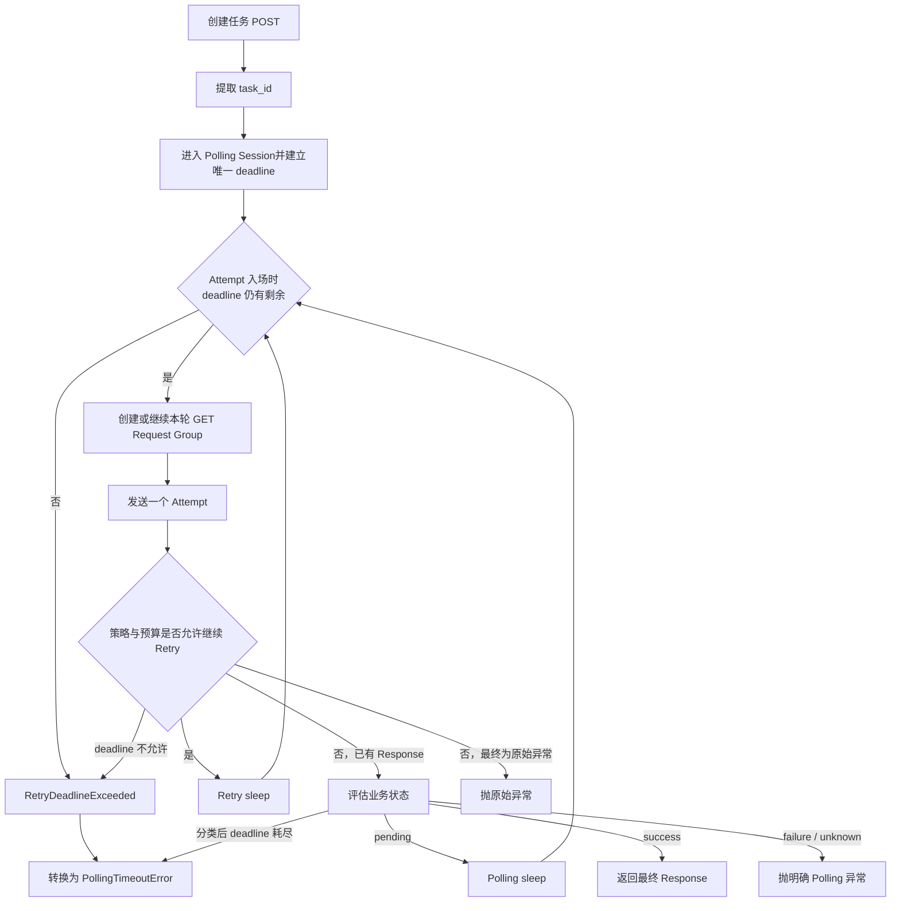

# 第 02 课：Retry 与 Polling 的正确性边界

> 本课只解决一个问题：Retry（重试）和 Polling（轮询）都会再次发送请求，为什么不能共用一套继续条件和成功定义？Retry 管理同一个请求意图中的多次发送；Polling 管理为等待异步终态而准备的查询过程。正常入场后会形成一轮或多轮查询，但首轮发送前失败时也可能没有 Request Group。二者可以嵌套，但事实所有权不同。

## 阅读本课前的极短基线

- Response 是服务端返回的 HTTP 响应对象。
- GET 通常用于读取数据，POST 通常用于提交数据或创建任务；是否有副作用仍由接口合同决定。
- HTTP 200 只表示协议层返回成功，不自动表示异步任务已经完成。
- Attempt 表示客户端发起的一次发送尝试；前置 Middleware 可能在真正联网前失败，因此 Attempt 不必然等于一次已完成的网络发送。
- Request Group 表示一次请求意图及其全部 Retry Attempt。
- Polling Session 表示为等待异步任务终态建立的查询生命周期；正常入场后包含一轮或多轮 Request Group，首轮发送前失败时可以为零。
- deadline 表示某段流程不能继续越过的截止时刻。
- `max_elapsed` 表示 Retry 在得到可重试结果后，是否还允许进入下一次等待的组内时间准入条件；它不是硬中断器。
- 单调时钟只向前计时，适合计算 deadline。
- Smoke 表示用少量关键业务调用快速验证核心能力的冒烟用例集合。
- 幂等表示同一个请求意图重复执行时不产生额外业务效果；客户端只能决定是否再次发送，不能替服务端承诺幂等。

## 1. 课程信息

| 项目 | 内容 |
| --- | --- |
| 建议时长 | 75 分钟 |
| 核心问题 | Retry 与 Polling 为什么必须分别定义重复单位、继续证据、终态和预算？ |
| 本课位置 | 可信事实链的第一项约束：先让复杂调用正确结束 |
| 第一性原理 | 循环正确性来自明确合同，不来自一个通用 `while` |
| TOC 约束 | 先解除“所有再次请求都是 Retry”的层级混淆，再讲参数与异常 |
| 核心边界 | 客户端重试资格不等于服务端幂等；HTTP 200 不等于异步任务成功；软准入不等于硬中断 |

### 1.1 本课学习结果

本课结束后，学习者应能：

1. 区分 Polling Session、Request Group 和 Attempt。
2. 解释 Retry 的方法资格、结果资格与预算资格。
3. 说明 `max_elapsed` 与外层 deadline 的判断顺序及不同出口。
4. 解释 POST 获得客户端重试资格的三条路径，以及客户端为什么不能保证服务端幂等。
5. 说明 Polling 的 pending、success、failure、unknown、timeout 与原始异常出口。
6. 解释为什么各轮 GET、GET 内 Retry 和 Polling sleep 共用一个 deadline，而创建 POST 不在其中。
7. 区分框架能力、业务入口参数和当前 Smoke 用例真正启用的能力。

### 1.2 本课刻意不展开

- 不讲 RequestContext、Header 合并、脱敏和 Middleware 内部过程。
- 不展开 Runtime Hooks、质量采集和指标计算。
- 不追踪完整源码目录或逐函数导航。
- 不把测试命令、练习或作业作为课程目标。

### 1.3 75 分钟讲授路线

| 时间 | 内容 | 本段结论 |
| ---: | --- | --- |
| 0～10 分钟 | 业务困境与三层对象 | 再次请求不一定是同一层重复 |
| 10～18 分钟 | 第一性原理与 TOC | 先定义循环合同，再引入参数 |
| 18～33 分钟 | 模块级精简教学代码 | 看懂输入、两层主流程与出口 |
| 33～48 分钟 | Retry 边界 | 同一请求意图内决定是否再次发送 |
| 48～63 分钟 | Polling 边界 | 一轮或多轮查询共享一个核心 deadline |
| 63～71 分钟 | 嵌套案例与当前接入 | 能力存在不等于当前调用已启用 |
| 71～75 分钟 | 取舍与收束 | 两份合同共同形成可解释终态 |

---

## 2. 先说结论：两层循环重复的对象不同

先看两个业务场景：

```text
场景 A：一次 GET 返回 503，等待后再次发送同一个 GET
场景 B：创建图片任务后，定期查询任务是否已经完成
```

- 场景 A 是 Retry：同一个请求意图包含多个 Attempt。
- 场景 B 是 Polling：同一个等待过程包含一个或多个查询 Request Group。

### 2.1 三个必要对象

| 对象 | 含义 | 回答的问题 |
| --- | --- | --- |
| Attempt | 一次客户端发送尝试 | 客户端进入了几次发送边界？ |
| Request Group | 一次请求意图及其全部 Retry Attempt | 哪些发送属于同一个请求意图？ |
| Polling Session | 为等待异步任务终态建立的生命周期 | 正常产生的查询是否共同等待同一个任务？ |

正常进入首轮 Request Group 后，对象关系如下：

```text
Polling Session
├─ 查询 Request Group 1
│  └─ Attempt 1..N
├─ Polling sleep
├─ 查询 Request Group 2
│  └─ Attempt 1..N
└─ ...直到终态或退出
```

首轮查询就可能得到 success，所以正常入场后的 Polling Session 包含**一个或多个** Request Group，不是必然包含多个。若首轮 Context 构造在 Request Group 创建前因 deadline 等原因失败，Session 可以包含零个 Request Group，并由下游完整性事实标记为不完整。

### 2.2 正确的循环结构



图中的 Retry 是 `Attempt 1..N` 循环，不固定为两次。进入下一轮 Polling 时会创建新的 Request Group，但仍使用原来的 Polling deadline。

### 2.3 混成一个循环会怎样

```text
不区分 Retry 和 Polling
-> 无法判断“再次发送”属于同一请求意图还是新一轮查询
-> max_attempts 与 poll_timeout 的所有权混乱
-> 503、pending 和 timeout 被归给错误机制
-> 后续统计次数、耗时和失败原因使用错误分母
```

真正要解决的问题不是“怎样写一个更通用的循环”，而是为两层循环分别回答：

1. 重复的最小单位是什么？
2. 什么证据允许继续？
3. 正常终态是什么？
4. 失败时返回 Response，还是抛异常？
5. 哪个预算阻止流程无限继续？

---

## 3. 第一性原理与 TOC：先定义循环合同

复杂调用的最小目标不是“最终拿到 200”，而是：

> 在有限资源内，依据明确证据到达一个不会被误解的客户端终态，并保留最后的原始 Response 或异常。

| 合同 | Retry | Polling |
| --- | --- | --- |
| 循环单位 | 同一 Request Group 中的 Attempt | 同一 Polling Session 中的 GET Request Group |
| 继续证据 | 方法允许、结果可重试、次数和时间仍允许 | 业务状态为 pending，核心 deadline 仍允许 |
| 正常出口 | 返回不再重试的最终 Response | success 时返回最终 Response |
| 失败出口 | 最终原始异常，或外层 deadline 异常 | failure、unknown、timeout、解析异常或请求异常 |
| 预算 | `max_attempts`、`max_elapsed`、可选外层 deadline | GET、GET 内 Retry 与 Polling sleep 共用一个 deadline |

TOC 的解除顺序是：

```text
先建立 Session → Group → Attempt 三层模型
-> 再说明每层依据什么继续
-> 再说明 Response 与异常为什么拥有不同出口
-> 最后引入 max_attempts、max_elapsed 和 poll_timeout
```

---

## 4. 模块级精简教学代码：输入怎样变成可信出口

下面是**教学重构代码**，不是仓库源码的逐行复制。它以当前 `RetryExecutor`、`PollingPolicy`、`evaluate_polling_response()` 和 `BaseRequest._poll_get_with_policy()` 为原型，集中保留两层循环的主控制关系。

它省略 RequestContext、Middleware、日志、Runtime Hooks、Pydantic 校验、等待计算细节和结果下载。省略是为了突出转换过程，不表示真实实现没有这些职责。

```python
# 教学重构：保留当前核心语义，不是仓库完整源码。

# 阶段一：声明通用 Polling 策略与媒体业务覆盖
class PollingPolicy:
    status_json_path = "$.status"
    pending = {"queued", "running"}
    success = {"succeeded"}
    failure = {"failed", "cancelled"}
    result_json_path = None          # 通用默认值
    error_json_path = "$.error"
    unknown = "fail"

MEDIA_POLICY = override_policy(
    PollingPolicy(),
    pending={"queued", "running", "pending", "processing"},
    success={"succeeded", "success", "completed"},
    failure={"failed", "cancelled", "canceled"},
    result_json_path="$.result.urls",  # 仅媒体策略
)


# 阶段二：在一个 Request Group 内执行一次或多次 Retry Attempt
def run_request_group(method, kwargs, retry_policy, deadline):
    if retry_policy is None or not method_allows_retry(method, kwargs, retry_policy):
        return send_once(method, clamp_timeout(kwargs, deadline))

    started_at = monotonic()
    last_response = None
    for attempt_index in range(1, retry_policy.max_attempts + 1):
        require_remaining(deadline, last_response)  # Attempt 入场先检查 deadline
        try:
            response = send_once(method, clamp_timeout(kwargs, deadline))
        except Exception as error:
            if attempt_index == retry_policy.max_attempts or not retryable(error, retry_policy):
                raise                         # 最终原始异常
            wait = retry_delay(retry_policy, attempt_index)
            if not within_max_elapsed(started_at, wait, retry_policy):
                raise                         # max_elapsed 先阻断：仍抛原异常
            if not wait_fits_deadline(wait, deadline):
                raise RetryDeadlineExceeded(last_response) from error
            sleep(wait)
            continue
        last_response = response
        if attempt_index == retry_policy.max_attempts or not retryable(response, retry_policy):
            return response
        wait = retry_delay(retry_policy, attempt_index, response)
        if not within_max_elapsed(started_at, wait, retry_policy):
            return response                   # max_elapsed 先阻断：保留 Response
        if not wait_fits_deadline(wait, deadline):
            raise RetryDeadlineExceeded(response)
        sleep(wait)


# 阶段三：把最终 Response 解释为 Polling 状态
def evaluate(response, policy):
    try:
        body = response.json()
    except ValueError as error:
        raise AssertionError(f"polling response body is not valid JSON: {redact(response)}") from error
    raw_status = extract(body, policy.status_json_path)
    error_value = (None if policy.error_json_path is None
                   else extract(body, policy.error_json_path))
    if error_value is not None:
        status_evidence = raw_status if raw_status is not None else error_value
        return FAILURE, status_evidence, error_value
    result_value = (None if policy.result_json_path is None
                    else extract(body, policy.result_json_path))
    if result_value is not None:
        return SUCCESS, raw_status, None
    return classify_status(raw_status, policy)


# 阶段四：让多轮 GET Request Group 共用一个 deadline
def poll_get(path, polling_policy, retry_policy=None, poll_interval=2, poll_timeout=None):
    timeout = config.timeout if poll_timeout is None else poll_timeout
    require_positive(poll_interval, timeout)
    started_at = monotonic()
    deadline = started_at + timeout           # 整个核心循环只创建一次
    transitions = []
    last_response = None
    last_status = None
    polling_round = 0
    while True:
        polling_round += 1
        try:
            last_response = run_request_group("GET", {"path": path},
                                              retry_policy, deadline)
        except RetryDeadlineExceeded as error:
            timeout_response = error.last_response if error.last_response is not None else last_response
            raise PollingTimeoutError(timeout_response, last_status, transitions) from error
        state, last_status, error_value = evaluate(last_response, polling_policy)
        observed_at = monotonic()
        # 真实字段名是 attempt_index；这里记录的是 Polling 轮次，不是 Retry 序号。
        transitions.append(PollingTransition(
            attempt_index=polling_round, elapsed_seconds=round(observed_at - started_at, 3),
            state=state, raw_status=last_status, response_status_code=last_response.status_code))
        remaining = deadline - observed_at
        if remaining <= 0:
            raise PollingTimeoutError(last_response, last_status, transitions)
        if state is SUCCESS:
            return last_response
        if state is FAILURE:
            raise PollingFailedError(last_response, last_status, error_value, transitions)
        if state is UNKNOWN:
            raise PollingUnknownStateError(last_response, last_status, transitions)
        sleep(min(poll_interval, remaining))   # 只有 pending 才进入下一轮
```

`override_policy()` 表示从通用策略复制并覆盖媒体字段；`retryable()` 与 `retry_delay()` 都显式接收 `retry_policy`，说明结果资格和等待算法归策略所有。`classify_status()` 按 pending、success、failure、unknown 顺序匹配策略集合；`redact()`、`clamp_timeout()` 和异常构造也是教学辅助函数。真实职责分别由策略模型、Retry 计算、统一脱敏、请求构造和 Polling 异常对象承担。

后续代码块优先从主骨架抽取；对于骨架中抽象掉的关键判断和真实接入边界，使用保持相同核心语义的最小源码摘录补充证明。为便于就地对照，部分片段会省略外围函数与缩进上下文，但不构成第二套实现，也不要求单独运行。

### 4.1 代码保留了什么

```text
输入：请求方法、RetryPolicy、PollingPolicy、poll_timeout
-> Polling 建立唯一 deadline
-> 发起一轮 GET Request Group
-> Request Group 执行 1..N 个 Attempt
-> 最终 Response 进入业务状态分类
-> pending 继续；success 返回；其他出口保留原始事实
```

代码中最重要的是三个检查点：

1. 每个 Retry Attempt 入场前先检查外层 deadline；没有剩余时间就不开始本次 Attempt。
2. 已经得到可重试结果且还有 Attempt 时，才先判断 `max_elapsed`，再判断下一次等待能否放进外层 deadline。
3. Polling 完成状态分类和 transition 后，先检查剩余时间，再处理 success、failure、unknown。

---

## 5. Retry：同一请求意图内是否再次发送

**核心实现思路**：方法无 Retry 资格时只发送一次；方法有资格时，每个 Attempt 入场前先检查外层 deadline。已有可重试结果且还有 Attempt 后，才按 `max_elapsed → 外层 deadline` 判断能否等待并继续。

### 5.1 三道资格门

| 决策门 | 核心问题 | 当前规则 |
| --- | --- | --- |
| 方法资格 | 这个方法是否适合自动再次发送？ | 默认 GET、HEAD；POST 需要显式依据 |
| 结果资格 | 当前结果是否值得再次尝试？ | `retry_statuses` 中策略配置的状态码（整组可替换；默认 429、500、502、503、504），或异常属于配置集合 |
| 预算资格 | 是否还能进入或继续？ | Attempt 入场先检查 deadline；可重试结果后再检查次数、`max_elapsed` 与 deadline |

回看第 4 节代码，方法资格位于循环外。主骨架中的 `method_allows_retry()` 对应真实的 `is_method_retry_allowed()`；统一写法 `retryable()` 在真实源码中拆成 Response 与异常两个函数。下面直接展开这三个真实判断，不另造一套规则：

```python
def is_method_retry_allowed(method, kwargs, policy):
    normalized_method = method.upper()
    if normalized_method in {name.upper() for name in policy.allowed_methods}:
        return True
    if normalized_method != "POST":
        return False
    if policy.allow_post:
        return True

    headers = kwargs.get("headers") or {}
    header_names = {str(name).lower() for name in dict(headers).keys()}
    return policy.idempotency_header.lower() in header_names


def should_retry_response(response, policy):
    return response.status_code in policy.retry_statuses


def should_retry_exception(error, policy):
    excluded = (
        requests.exceptions.SSLError,
        requests.exceptions.TooManyRedirects,
    )
    if isinstance(error, excluded):
        return False
    return isinstance(error, policy.retry_exceptions)
```

这些条件进入主循环的位置如下：

```python
if retry_policy is None or not is_method_retry_allowed(method, kwargs, retry_policy):
    return send_once(method, clamp_timeout(kwargs, deadline))

for attempt_index in range(1, retry_policy.max_attempts + 1):
    try:
        response = send_once(method, clamp_timeout(kwargs, deadline))
    except Exception as error:
        if attempt_index == retry_policy.max_attempts or not should_retry_exception(error, retry_policy):
            raise
    else:
        if attempt_index == retry_policy.max_attempts or not should_retry_response(response, retry_policy):
            return response
```

POST 有三条客户端资格路径：

1. `allowed_methods` 显式包含 POST。
2. `allow_post=True`。
3. 请求 Header 中存在策略配置的 `Idempotency-Key`。

三条路径只允许客户端再次发送，不能证明服务端一定去重、只创建一个任务或避免重复计费。

### 5.2 默认策略旁注

| 项目 | 当前默认值或行为 |
| --- | --- |
| 最大发送次数 | `max_attempts=3` |
| 可重试状态码 | 429、500、502、503、504 |
| 可重试异常 | `ConnectionError`、`Timeout` |
| 明确排除 | `SSLError`、`TooManyRedirects` |
| 等待 | 默认指数退避，可选固定等待；默认启用 jitter |
| 服务端建议 | 默认读取 `Retry-After`，仍受 `max_delay` 限制 |
| 软时间准入 | `max_elapsed=30` 秒 |

这些默认值只描述框架策略，不表示每个业务调用都启用了 Retry。

### 5.3 deadline 的两个检查点

第一个检查点发生在每个 Attempt 入场前。`require_remaining()` 在 `send_once()` 之前，因此失败时本次 Attempt 尚未开始：

```python
for attempt_index in range(1, retry_policy.max_attempts + 1):
    require_remaining(deadline, last_response)
    try:
        response = send_once(method, clamp_timeout(kwargs, deadline))
```

这个检查不要求前一刻已经得到可重试结果，也不以 `max_elapsed` 为前提。

第二个检查点发生在已经得到可重试结果且还有 Attempt 后。下面先看 Response 路径：

```python
wait = retry_delay(retry_policy, attempt_index, response)
elapsed = monotonic() - started_at
if (retry_policy.max_elapsed is not None
        and elapsed + wait > retry_policy.max_elapsed):
    return response

remaining = None if deadline is None else deadline - monotonic()
if remaining is not None and wait >= remaining:
    raise RetryDeadlineExceeded(response)
sleep(wait)
```

异常路径使用同一准入顺序，但 `max_elapsed` 阻断时保留原异常：

```python
except Exception as error:
    if attempt_index == retry_policy.max_attempts or not should_retry_exception(error, retry_policy):
        raise
    wait = retry_delay(retry_policy, attempt_index)
    elapsed = monotonic() - started_at
    if (retry_policy.max_elapsed is not None
            and elapsed + wait > retry_policy.max_elapsed):
        raise

    remaining = None if deadline is None else deadline - monotonic()
    if remaining is not None and wait >= remaining:
        raise RetryDeadlineExceeded(last_response) from error
```

两个边界的等号方向不同：`elapsed + wait <= max_elapsed` 时仍允许继续；等待只有在 `wait < remaining` 时才允许，`wait == remaining` 已由外层 deadline 阻断。

因此，同一个连接异常可能有三种相关出口：

- Attempt 入场时 deadline 已耗尽：抛 `RetryDeadlineExceeded`，当前 Attempt 不开始。
- `max_elapsed` 先阻断：仍抛原连接异常。
- `max_elapsed` 允许、外层 deadline 不允许：抛 `RetryDeadlineExceeded`；若发生在 Polling 内，再转换为 `PollingTimeoutError`。

不能把 `max_elapsed → deadline` 描述成全局顺序。它只属于“已有可重试结果后的继续准入”；Attempt 入场检查 deadline 是更早、独立的检查点。

### 5.4 Response 与异常出口

| 当前事实 | Retry 出口 |
| --- | --- |
| 非可重试 Response | 返回该 Response |
| 最后一次仍是可重试 Response | 返回最后 Response |
| Response 路径被 `max_elapsed` 阻断 | 返回当前 Response |
| 非可重试异常或最后一次异常 | 抛当前原始异常 |
| 异常路径被 `max_elapsed` 阻断 | 抛当前原始异常 |
| `max_elapsed` 允许，但外层 deadline 不允许 | 抛 `RetryDeadlineExceeded` |

`max_attempts` 只限制发送次数；`max_elapsed` 只判断能否进入下一次等待；外层 deadline 在 Attempt 与等待前提供剩余预算。三者都不是 RetryExecutor 的后台硬中断器。

---

## 6. Polling：一轮或多轮查询共享一个 deadline

**核心实现思路**：`poll_get` 建立唯一 deadline；每轮 GET 形成新的 Request Group，并可选嵌套 Retry；最终 Response 由 `PollingPolicy` 分类。只有 pending 允许等待后进入下一轮。

### 6.1 通用默认与媒体策略必须分开

通用 `PollingPolicy` 的关键默认值直接对应第 4 节中的策略对象：

```python
class PollingPolicy:
    status_json_path = "$.status"
    pending = {"queued", "running"}
    success = {"succeeded"}
    failure = {"failed", "cancelled"}
    result_json_path = None
    error_json_path = "$.error"
    unknown = "fail"
```

`$.result.urls` 不属于通用默认值。它只出现在媒体策略中，用于媒体任务结果判断：

```python
MEDIA_POLICY = override_policy(
    PollingPolicy(),
    pending={"queued", "running", "pending", "processing"},
    success={"succeeded", "success", "completed"},
    failure={"failed", "cancelled", "canceled"},
    result_json_path="$.result.urls",
)
```

课程必须区分“框架通用默认”和“媒体业务配置”。

### 6.2 状态分类顺序

```python
body = response.json()
raw_status = extract(body, policy.status_json_path)
error_value = (None if policy.error_json_path is None
               else extract(body, policy.error_json_path))
if error_value is not None:
    status_evidence = raw_status if raw_status is not None else error_value
    return FAILURE, status_evidence, error_value

result_value = (None if policy.result_json_path is None
                else extract(body, policy.result_json_path))
if result_value is not None:
    return SUCCESS, raw_status, None

if raw_status in policy.pending:
    return PENDING, raw_status, None
if raw_status in policy.success:
    return SUCCESS, raw_status, None
if raw_status in policy.failure:
    return FAILURE, raw_status, None
if policy.unknown in {"pending", "ignore"}:
    return PENDING, raw_status, None
return UNKNOWN, raw_status, None
```

error-only 响应的回填很重要：如果没有 status，但存在 error，`raw_status` 会使用 `error_value`。真实实现随后把同一证据依次写入本轮变量和 transition：

```python
evaluation = evaluate_polling_response(last_response, polling_policy)
last_status = evaluation.raw_status
transitions.append(PollingTransition(
    state=evaluation.state,
    raw_status=evaluation.raw_status,
    response_status_code=last_response.status_code,
    # ...轮次与耗时字段省略...
))
```

因此证据链是 `evaluation.raw_status → last_status`，同时 `evaluation.raw_status → PollingTransition.raw_status`：`last_status` 进入最终异常，transition 字段保留每轮历史。

空字符串、`0` 和 `False` 都不是 `None`。作为 error 或 result 的提取结果时，当前实现仍认为“给出了值”；这里判断提取结果是否为 `None`，不判断真假。

状态集合判断没有兜底类型转换。若 `raw_status` 是 `dict`、`list`，或 JSONPath 多值结果形成的列表，第一次执行 `raw_status in policy.pending` 就会因不可哈希而抛 `TypeError`；它不会落入 `UNKNOWN`。

### 6.3 Polling 出口

| 出口 | 触发事实 | 当前行为 |
| --- | --- | --- |
| success | result 路径提取值非 `None`，或状态属于 success | 返回最终 Response |
| failure | error 路径提取值非 `None`，或状态属于 failure | 抛 `PollingFailedError` |
| unknown | 默认策略下状态无法识别 | 抛 `PollingUnknownStateError` |
| timeout | 分类后 deadline 已耗尽，或内部出现 `RetryDeadlineExceeded` | 抛 `PollingTimeoutError` |
| 无效 JSON | `response.json()` 抛 `ValueError` | 转换为包含脱敏响应文本的 `AssertionError` |
| JSONPath 解析或求值异常 | 状态、错误或结果路径无法正常解析/求值 | 原解析器异常传播，异常对象未必包含响应文本 |
| 普通请求异常 | 单发 GET 异常，或 Retry 最终保留原异常 | 原异常向上抛出 |

这些异常出口在真实控制流中的位置如下。只有 `RetryDeadlineExceeded` 被 Polling 转换；普通请求异常没有被这个 `except` 捕获。JSON 解析失败在评估函数内转换，JSONPath 异常没有被转换，并在记录当前 Response 后原样抛出：

```python
# evaluate_polling_response 内
try:
    body = response.json()
except ValueError as error:
    raise AssertionError(
        f"polling response body is not valid JSON: {_redact_response_text(response)}"
    ) from error

raw_status = _extract_json_path_value(
    body, policy.status_json_path
)  # JSONPath 异常原样传播


# poll_get 循环内
try:
    last_response, last_logger = self._request_without_attach(
        "GET",
        path,
        retry_policy=retry_policy,
        deadline=deadline,
    )
except RetryDeadlineExceeded as error:
    timeout_response = error.last_response if error.last_response is not None else last_response
    raise PollingTimeoutError(timeout_response, last_status, transitions) from error

try:
    evaluation = evaluate_polling_response(last_response, polling_policy)
except Exception:
    last_logger.attach_success(last_response)  # 只保留诊断附件
    raise                                      # 无效 JSON 或 JSONPath 异常继续向外
```

业务状态和剩余预算在同一轮中按下面顺序收口：

```python
remaining = deadline - observed_at
if remaining <= 0:
    raise PollingTimeoutError(last_response, last_status, transitions)
if state is SUCCESS:
    return last_response
if state is FAILURE:
    raise PollingFailedError(last_response, last_status, error_value, transitions)
if state is UNKNOWN:
    raise PollingUnknownStateError(last_response, last_status, transitions)
sleep(min(poll_interval, remaining))
```

两类解析异常都发生在本轮 transition 追加之前。`poll_get` 的日志路径会把当前 Response 作为附件保留；但无效 JSON 的异常对象只包含脱敏响应文本，JSONPath 异常则保留解析器原异常，未必包含响应文本。两者都不携带完整 Response 对象或已有 transitions。

### 6.4 `poll_timeout` 与唯一 deadline

`poll_timeout=None` 时，公开入口会回退到 `config.timeout`。确定 timeout 后，核心循环只建立一次：

```python
timeout = config.timeout if poll_timeout is None else poll_timeout
require_positive(poll_interval, timeout)
started_at = monotonic()
deadline = started_at + timeout
```

共同消费该预算的是：

1. 各轮 GET 网络耗时。
2. GET 内部 Retry Attempt。
3. Retry backoff sleep。
4. Polling sleep。

创建任务 POST 在进入 `poll_get` 前完成，不属于该 deadline；成功 Response 返回后的可选结果下载也在核心循环之外。因此，公开调用的端到端时间可能超过 `poll_timeout`。

### 6.5 Polling timeout 的两条转换路径

第一条发生在 Attempt 入场检查点，不要求已经得到可重试结果：

```python
# run_request_group 内：发送前可能抛 RetryDeadlineExceeded
require_remaining(deadline, last_response)

# poll_get 内：统一转换为 PollingTimeoutError
try:
    last_response = run_request_group("GET", {"path": path}, retry_policy, deadline)
except RetryDeadlineExceeded as error:
    timeout_response = error.last_response if error.last_response is not None else last_response
    raise PollingTimeoutError(timeout_response, last_status, transitions) from error
```

第二条发生在已有可重试结果后的继续准入：

```python
# run_request_group 的 Response 路径：max_elapsed 允许等号
wait = retry_delay(retry_policy, attempt_index, response)
elapsed = monotonic() - started_at
if (retry_policy.max_elapsed is not None
        and elapsed + wait > retry_policy.max_elapsed):
    return response
remaining = deadline - monotonic()
if wait >= remaining:                          # deadline 不允许等号
    raise RetryDeadlineExceeded(response)       # 再由上面的 except 转换

# run_request_group 的异常分支：以下片段位于 except Exception as error 内
if attempt_index == retry_policy.max_attempts or not should_retry_exception(error, retry_policy):
    raise
wait = retry_delay(retry_policy, attempt_index)
elapsed = monotonic() - started_at
if (retry_policy.max_elapsed is not None
        and elapsed + wait > retry_policy.max_elapsed):
    raise                                       # 保留原异常
remaining = deadline - monotonic()
if wait >= remaining:
    raise RetryDeadlineExceeded(last_response) from error
```

如果第二条路径中的 `max_elapsed` 先阻断，Response 路径会返回当前 Response 供 Polling 解析，异常路径会保留原异常，不产生 `RetryDeadlineExceeded`。

转换时的 Response 证据也有优先级：`poll_get` 先使用 `error.last_response`，仅当它为 `None` 时才回退到上一轮 `last_response`。因此，本轮得到 503 后因等待放不进 deadline 而退出时，`PollingTimeoutError` 保留的是本轮 503，而不是上一轮 Response。

---

## 7. 一个嵌套案例

下面是教学场景，不表示当前 Smoke 已启用同样的 Retry 参数：

```text
创建任务 POST -> task_id=task-001

Polling 第 1 轮
-> GET Attempt 1：200 + pending
-> Polling sleep

Polling 第 2 轮
-> GET Attempt 1：503
-> Retry sleep
-> GET Attempt 2：200 + running
-> Polling sleep

Polling 第 3 轮
-> GET Attempt 1：200 + completed
-> 返回最终 Response
```

| 层级 | 数量 | 原因 |
| --- | ---: | --- |
| Polling Session | 1 | 共同等待 `task-001` |
| 查询 Request Group | 3 | 三轮独立状态查询 |
| 查询 Attempt | 4 | 第二轮因 503 发送两次 |

```text
Retry 修复第二轮的瞬时 503
-> 只说明该 Request Group 得到最终 Response
-> running 仍要求 Polling 继续
-> completed 才构成 Polling success
-> 调用方继续断言具体结果字段
```

---

## 8. 当前仓库的真实接入边界

### 8.1 框架能力与业务参数

- `RetryPolicy` 和 `RetryExecutor` 提供显式 Retry。
- `BaseRequest.request()` 只有收到 `retry_policy` 才进入 Retry 分支。
- `BaseRequest.poll_get()` 管理状态分类和唯一 deadline。
- `BaseTask` 与媒体 Capability 暴露 `poll_interval`、`poll_timeout`、`polling_policy` 和可选 `retry_policy`。

“框架支持但调用方可不启用”可从参数传递直接看出：

```python
# 媒体 Capability 的精简摘录；只省略 operation_scope
def poll_media_generation_result(
    self,
    request_client,
    task_id,
    *,
    poll_interval=2,
    poll_timeout=None,
    polling_policy=DEFAULT_MEDIA_POLLING_POLICY,
    retry_policy=None,
):
    return request_client.poll_get(
        self.media_task_path_template.format(task_id=task_id),
        poll_interval=poll_interval,
        poll_timeout=poll_timeout,
        polling_policy=polling_policy,
        retry_policy=retry_policy,
    )
```

### 8.2 当前异步图片 Smoke 的真实链路

```text
TestAsyncImageGeneration
-> SmokeTask 继承的 BaseTask 入口
-> MediaGenerationCapability
-> 创建任务并提取 task_id
-> BaseRequest.poll_get
```

当前 Smoke 调用传入了 Polling 的间隔和总预算，但没有传 `retry_policy`：

```python
result_response = self.smoke_task.create_and_poll_media_generation(
    self.smoke_request,
    self.smoke_task.build_async_image_generation_payload(),
    poll_interval=ASYNC_IMAGE_POLL_INTERVAL_SECONDS,
    poll_timeout=ASYNC_IMAGE_POLL_TIMEOUT_SECONDS,
)
```

当前相关用例显式传入 `poll_interval` 和 `poll_timeout`，因此真实启用了 Polling；没有传入 `retry_policy`，所以各轮 GET 当前按单次发送执行。创建 POST 在进入 `poll_get` 前完成，也不会因为 Polling 暴露了 Retry 参数而自动重试。

准确结论是：

```text
框架支持 Retry
业务入口允许为 Polling GET 传入 RetryPolicy
当前异步图片 Smoke 真实启用了 Polling
当前这些用例没有启用 Polling 内部 GET Retry
```

---

## 9. 设计取舍与三个关键误解

| 设计 | 收益 | 代价或边界 |
| --- | --- | --- |
| Retry 独立管理 Attempt | 瞬时故障可有限恢复 | 需要显式治理方法资格和幂等风险 |
| Polling 独立管理查询轮次 | HTTP 成功与业务终态分离 | 需要稳定状态合同和明确异常 |
| Polling 内可选 Retry | 单轮查询也可恢复瞬时故障 | 两层预算必须按真实顺序解释 |
| 单一 Polling deadline | 后续轮次不能重置总预算 | 不包含创建 POST 和结果下载 |

三个最容易破坏心智模型的误解是：

1. **配置 RetryPolicy 就一定多次发送。**错误。方法无资格或首个结果不可重试时只发送一次。
2. **Polling 就是一直 Retry 同一个 GET。**错误。每轮查询是新的 Request Group，轮内多次发送才是 Retry。
3. **Retry backoff 等待放不进 deadline 一定变成 PollingTimeoutError。**错误。结果后继续路径必须先通过 `max_elapsed`，并且发生在 Polling 内部，才会完成该转换；Attempt 入场还有独立的 deadline 检查点。

---

## 10. 本课收束

```text
创建任务并取得 task_id
-> Polling 建立唯一 deadline
-> 正常入场后发起一个或多个 GET Request Group；首轮 Group 前失败时可为零并标记不完整
-> 每个 Request Group 可执行 1..N 个 Retry Attempt
-> Retry 在 Attempt 入场前检查 deadline；可重试结果后再检查 max_elapsed 与 deadline
-> Polling 按业务状态与剩余预算决定是否进入下一轮
-> success 返回 Response
-> failure、unknown、timeout、解析异常和传输异常保持各自出口
```

最后保留六条边界：

1. Retry 重复 Attempt，Polling 重复 Request Group。
2. 客户端 Retry 资格不等于服务端幂等。
3. Attempt 入场先检查 deadline；只有已有可重试结果后的继续准入才按 `max_elapsed → deadline` 判断。
4. HTTP 200 不等于 Polling success。
5. `poll_get` 的 deadline 只覆盖 GET、GET 内 Retry 和 Polling sleep。
6. 创建任务 POST 与成功后的结果下载不属于该 deadline。

下一课进入第二项约束：复杂调用正确结束后，Runner 怎样用权威 Case 集合、并行/串行集合守恒和稳定身份，保证执行事实没有丢失、重复或串线。
