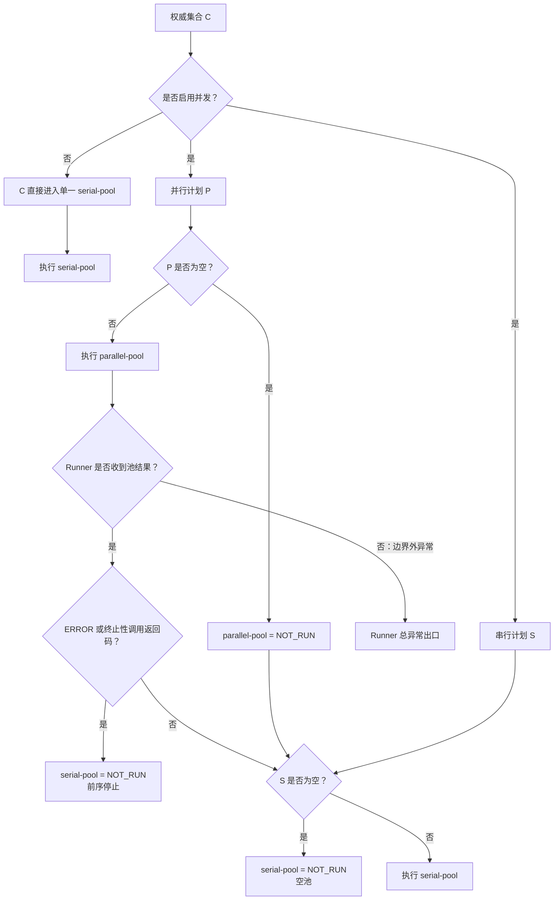
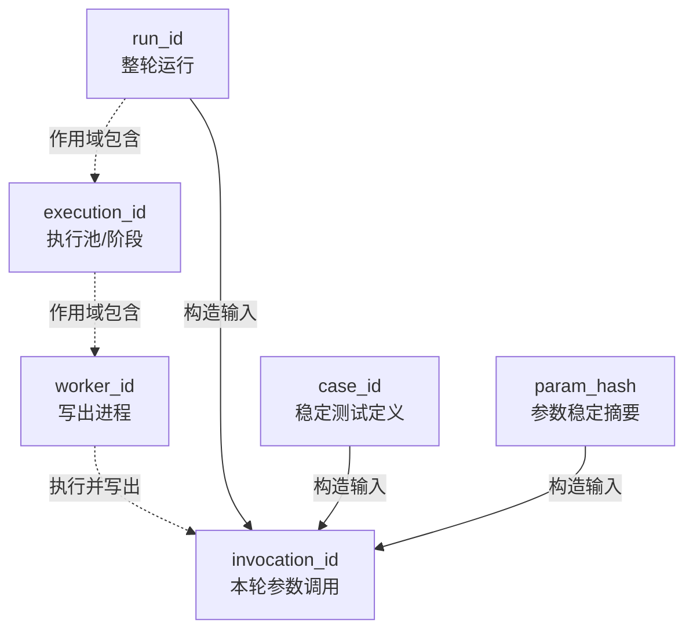

# 第 03 课：Runner 权威执行与稳定身份

> 本课只解决一个问题：当一轮测试被拆成并行池、串行池和多个 pytest（Python 测试工具）worker（独立执行进程）后，怎样证明计划分池没有丢失或重复，并为判断“哪些池留下了结果、Case（一次 pytest 用例调用）/Request（Case 中一次接口调用的请求事实）属于哪次调用、Runner 最终怎样返回”提供可复核依据。核心结论是：Runner（项目的测试运行编排者）的权威集合保护计划范围，五级身份（从整轮运行到本次 Case 调用的分层标识）为 Case/Request 提供归属键；账页是否完整留到后续课程判断。

## 1. 课程信息

| 项目 | 内容 |
| --- | --- |
| 建议时长 | 75 分钟 |
| 核心问题 | 并行与串行混合执行时，怎样证明计划集合没有丢失或重复，并为后续发现事实串线提供稳定归属键？ |
| 课程位置 | 第 2 课先解决复杂调用怎样正确结束；本课开始解决这些调用并发执行后怎样保持事实归属 |
| 前置要求 | 理解 Case 是一次 pytest（Python 测试工具）用例调用及其最终测试事实；不要求预先理解 pytest 插件（扩展 pytest 生命周期的组件）或 pytest-xdist（pytest 的并发执行插件） |
| 本课主线 | pytest 权威收集 → C（权威 Case 集合）/P（并行计划集合）/S（串行计划集合）守恒 → pytest 返回码与 Runner 池结果 → 五级身份归属 |
| 最终结论 | “应该执行谁”由权威集合回答；“执行怎样结束”由 pytest 返回码和 Runner 池结果回答；“事实属于谁”由五级身份回答 |

### 1.1 本课学习结果

本课结束后，学习者应能：

1. 解释为什么执行前必须先形成唯一的权威 `nodeid`（pytest 为已收集用例调用生成的文本标识）集合。
2. 使用集合关系说明并行池与串行池的计划守恒，而不是只比较数量。
3. 区分 `pytest.main()`（pytest 的同进程调用入口）原始调用返回码、执行池结果和 Runner 项目级 `final_exit_code`（Runner 归并各池后形成的最终退出码）。
4. 说明五级身份字段分别解决什么归属问题。
5. 解释参数化 Case 为什么需要同时保留稳定定义身份与本轮调用身份。
6. 说明未运行、池内错误和 Runner 外层异常三类出口分别还能保留什么事实。

### 1.2 本课刻意不展开

- 不讲 pytest-xdist 的调度算法、进程通信或负载均衡。
- 不展开 pytest 全部 Hook（生命周期回调）机制。
- 不讲 Allure（测试报告工具）合并和历史报告内部实现。
- 不展开 JSONL（一行一个 JSON 对象的文本格式）Schema（记录结构约束）；本课只说明身份怎样进入原始账页。
- 不讲 Aggregator（后续归并并检查多份原始账页的组件）如何对账；那是第 5 课的约束。
- 不把“计划集合守恒”夸大为“每个 Case 必然成功执行”。

### 1.3 75 分钟讲授路线

| 时间 | 内容 | 本段要形成的认识 |
| ---: | --- | --- |
| 0～6 分钟 | 先给结论，区分计划完整与执行成功 | 分池正确不能由最终数量猜测 |
| 6～14 分钟 | 第一性原理与 TOC（约束理论：用当前瓶颈决定分析顺序） | 先解除计划基准约束，再追随瓶颈到事实归属 |
| 14～28 分钟 | pytest 权威收集与 C/P/S 集合守恒 | `nodeid` 集合是 Runner 显式收集计划的事实来源 |
| 28～44 分钟 | pytest 返回码、池结果与 `final_exit_code` | 分清原始调用事实、Runner 编排事实和持久化文件 |
| 44～61 分钟 | 五级身份与两个最小写出证据 | 从运行、阶段、worker、Case 到本次调用逐级定位 |
| 61～70 分钟 | 三层失败出口 | 只区分未运行、池内错误和 Runner 外层异常 |
| 70～75 分钟 | 设计边界与收束 | 用三条核心链连接下一课 |

### 1.4 核心实现思路摘要

Runner 先清空 pytest 配置中的 `addopts`（pytest 从配置自动追加的命令行选项）并调用权威收集：正常返回非 0 且非 `collect-only`（只收集、不执行测试的模式）时尝试写空池结果文件；返回 0 时才形成权威 Case 集合并进入分池。执行池结果先追加到内存，执行路径只有走到写入点且写入成功才持久化。Quality（可选质量采集扩展）只在启用且 worker 采集上下文建立成功时，才把 `execution_id`（执行池或阶段身份）作为五级身份的一部分写入 Case/Request。设计合同要求执行池只消费权威 `nodeid`；当前实现仍会接收共享的未知或插件参数并重新读取 `addopts`，两者都可能改变实际集合。当前 `addopts` 未启用 `-k/-m`，Jenkins 主路径（`Jenkinsfile` 中 Real Smoke 的标准调用路径）也没有传入扩大收集范围的未知参数，因此当前业务尚未触发；但这仍是未兑现的实现合同，不是正常能力边界。该设计适合并发/串行混合执行和需要机器对账的测试运行；对单进程、无历史审计的一次性脚本可能偏重。

---

## 2. 先说结论：先固定执行集合，再谈并发

并行执行最危险的错误，不是“跑得慢”，而是没有一个可复核的基准说明到底应该跑谁。

如果先启动多个执行进程，再从各自结果倒推计划，就会形成循环证明：

```text
各 worker 写出了若干结果
-> 用这些结果推断本轮应该执行哪些 Case
-> 再用推断出的集合证明结果完整
```

这条链无法发现“从一开始就没有被分配的 Case”，也无法证明两个池没有重复执行同一个 Case。

当前实现反过来做：

```text
pytest 清空配置 addopts，按 Runner 显式收集参数完成一次返回码为 0 的权威收集
-> 得到唯一、无重复的 nodeid 集合 C
-> 从 C 派生并行集合 P 与串行集合 S
-> 把明确的 nodeid 列表作为各执行池的主要输入
-> 成功形成并追加的池结果先留在内存；正常路径才尝试写入文件
```

这里的 `nodeid` 是 pytest 对一个已收集用例调用的文本标识，例如测试文件、类、方法和参数标识的组合。它是本课比较集合时的基本单位。

“先有 C，再有 P 和 S”确立了 Runner 的计划基准，但不能推出 pytest 的最终执行集合只含对应池成员。执行池以权威计划中的明确 `nodeid` 为主要输入；执行阶段的 `addopts`，以及同时进入收集和执行的未知或插件参数，仍可能重新筛选或扩大实际集合。因此，C/P/S 守恒只证明 Runner 计划正确，不保证 pytest 最终只执行对应池成员。这是当前实现偏离“执行池只消费权威 nodeid”设计合同的地方，不是有意开放的能力。

---

## 3. 第一性原理与 TOC：约束怎样从唯一基准转移到事实归属

### 3.1 从最终目标倒推必要条件

我们希望最终能够复核：

1. 哪些 Case 应该执行。
2. 哪些 Case 被分到并行池，哪些被分到串行池。
3. 哪个池实际运行、未运行或发生执行错误。
4. 每条 Case/Request 事实属于哪轮、哪个池、哪个 worker、哪个调用。
5. pytest 的原始退出事实有没有被质量模块覆盖。

要得到这些答案，至少需要两个不可替代的条件：

```text
唯一计划基准
+
稳定归属身份
=
可对账的并发执行事实
```

只有计划，没有身份，会看到数量却无法把事实放回正确 Case。只有身份，没有权威计划，会知道一条记录来自谁，却不知道是否少执行了谁。

### 3.2 障碍到设计的因果链

```text
一轮运行被拆成多个执行池和 worker
-> 结果文件与进程不再只有一份
-> 文件存在不能证明计划完整，数量相同也不能证明集合相同
-> 必须先由 pytest 收集形成唯一 nodeid 集合
-> 分池必须满足不相交与并集守恒
-> Case/Request 执行事实还必须带稳定身份
-> Aggregator 才可能在后续按身份对账
```

### 3.3 TOC：先解除计划基准，再追随瓶颈到事实归属

本课开始时最大的理解约束不是 xdist 如何分发任务，而是学习者容易把“并发输出的结果集合”当成“原始计划集合”。建立唯一计划基准后，瓶颈不会消失，而会转移到“分散事实怎样稳定归属”。

因此本课按以下顺序引入对象：

1. 先引入 pytest 收集和 `nodeid`，建立 C，解除“没有唯一计划基准”的约束。
2. 再引入 marker（用例标记）、P 与 S，证明计划分池守恒。
3. 基准固定后，瓶颈转移到“多个池和 worker 的事实属于谁”，于是引入执行状态与五级身份。
4. 最后只确认五级身份怎样进入 worker 质量事实和 JUnit（pytest 输出的标准机器可读测试结果），不提前展开后续归并逻辑。

教学层面的当前约束是认知吞吐：异常点继续逐条增加，学习者反而无法记住边界。因此后半段只保留“未运行、池内错误、Runner 外层异常”三层出口，不按内部组件展开失败清单。

如果一开始就讲插件 Hook、ContextVar（随当前执行上下文保存值的 Python 机制）和 JSONL，注意力会被实现名词消耗，仍然看不见真正的约束。

---

## 4. 权威集合：pytest 收集拥有 Runner 显式计划的“有哪些 Case”事实

### 4.1 为什么 Runner 不自己解析测试文件

pytest 的收集结果受多种条件影响：测试发现规则、`-k` 表达式、`-m` marker 选择、忽略项、取消选择项和插件行为。Runner 若重新实现一套文件扫描规则，就会出现两套“应该执行谁”的定义。不过，本课的“权威”有明确输入边界：它针对 Runner 显式传给收集阶段的参数，不等于 pytest 配置中所有可能生效的选择条件。

当前 `partition_pytest_args` 将参数分成：

- 收集参数：会影响选择集合的参数。
- 执行参数：并发数、JUnit 路径、Allure 目录等只影响执行方式的参数。
- 选择参数：需要保存在 Runner 执行事实中的选择条件。

未知或插件参数不会被 Runner 自作聪明地解释，而是同时传给收集与执行，以保留 pytest 已有行为。执行时，这些参数与池内明确 `nodeid` 一起交给 pytest；若参数自身具有选择语义，或表示额外测试路径，就可能重新筛选或扩大该池的实际执行集合。这个处理不是证明所有插件参数都安全，而是避免 Runner 假装完整复刻 pytest 参数系统。

### 4.2 权威收集的当前实现事实

`collect_test_case_items` 调用 pytest 的 `--collect-only`，由一个最小收集插件读取 `session.items`，记录每项的 `nodeid` 与 marker。

调用收集时，Runner 额外传入 `-o addopts=`，显式清空上述配置选项。这样得到的 C 服从 Runner 显式收集参数，而不会把配置中的 `addopts` 混入计划基准。

但执行池再次调用 pytest 时没有清空 `addopts`。pytest 会重新读取配置；如果其中含有 `-k`、`-m` 等选择条件，即使 Runner 已把明确 `nodeid` 交给执行池，实际执行仍可能再次被筛选。因此：

这里必须把合同、实现和当前业务分开：

| 层级 | 事实判断 |
| --- | --- |
| 设计合同 | 正式执行只消费权威 `nodeid`，每个 `nodeid` 最多执行一次 |
| 当前实现 | 执行阶段没有清空 `addopts`，共享的未知或插件参数也与池内 `nodeid` 一起传给 pytest，仍可能筛选或扩大实际集合 |
| 当前业务 | `pytest.ini` 的 `addopts` 只有 Allure 输出目录；Jenkins Real Smoke 主路径传入同一个 `SMOKE_TARGET`，另外只增加可选并发参数和 JUnit 输出参数，尚未触发集合扩大 |
| 结论 | 这是未兑现的实现合同，不是正常能力边界；C/P/S 守恒只能证明 Runner 计划正确 |

收集阶段同时保存：

- `raw_pytest_exit_code`：同进程 `pytest.main()` 收集调用的原始返回码；字段沿用 exit code 命名，但不是独立操作系统进程退出码。
- `cases`：权威 `CollectedTestCase`（Runner 保存单个已收集用例及其 marker 的数据对象）元组。
- `stdout`（标准输出流）与 `stderr`（标准错误流）：收集失败时的原始上下文。

如果 pytest 产生重复 `nodeid`，当前 `_CaseCollector` 会记录重复 `nodeid` 并跳过重复 item，随后由 `collect_test_case_items` 直接报错，不让一个含歧义的计划进入分池。这只证明当前权威收集拒绝重复身份，不代表 pytest 永远不会因插件或参数产生重复项。这里保留为实现事实说明，不作为本课独立代码锚点。

### 4.3 收集终态不能被执行阶段改写

当前 Runner 必须同时判断“调用怎样结束”和“是否为 `collect-only`（只收集、不执行）”：

| 收集路径 | 能否进入分池执行 | 是否尝试写新的 `execution-result.json` |
| --- | --- | --- |
| 参数解析异常、收集调用抛异常或重复 `nodeid` 触发异常 | 不可以 | 不写新的文件 |
| 收集调用正常返回非 0，且不是 `collect-only` | 不可以 | 写；`pool_results=[]`，保留收集返回码 |
| `collect-only` 下收集调用正常返回 | 不执行 Case | 不写新的文件；返回收集码或展示分池数量 |
| 收集调用返回 0，且不是 `collect-only` | 可以 | 进入执行；只有后续写入路径成功才形成当前文件 |

“没有收集到测试”的返回码 5 属于“正常返回非 0”：非 `collect-only` 时仍会写空池结果的 Runner 执行文件，但绝不能解释为全部测试通过。

---

## 5. 集合守恒：比较成员，不比较看起来相等的数量

### 5.1 三个集合

设：

- C：权威收集得到的 `nodeid` 集合。
- P：没有串行 marker、计划进入并行池的集合。
- S：带指定串行 marker、计划进入串行池的集合。

正确分池必须满足：

```text
P ∩ S = ∅
P ∪ S = C
```

当前 `split_test_cases` 逐项检查重复 `nodeid`，再按 marker 放入两个集合，最后直接比较集合交集与并集：

```python
if set(parallel) & set(serial):
    raise ValueError("parallel and serial execution pools overlap")
if set(parallel) | set(serial) != seen:
    raise ValueError("execution pool union differs from the authoritative plan")
```

这是本课第一个最小代码锚点。它证明的是**计划分池守恒**。

### 5.2 为什么数量相等不够

假设权威集合为 C，但某个错误分池过程使用列表保存池成员：

```text
C = {A, B, C, D}
P_list = [A, B]
S_list = [C, C]
```

如果只看列表长度，`len(P_list) + len(S_list) = len(C) = 4`。但 D 丢了，C 重了。把列表转换成集合后，`P={A,B}`、`S={C}`，立即可以看出 `P ∪ S ≠ C`。数量相等掩盖了成员错误，集合关系才能检查成员。

集合检查能够发现：

- 同一个 `nodeid` 同时进入两个池。
- 某个权威 Case 没进入任何池。
- 非权威 Case 被意外加入。

它不能证明：

- 每个计划 Case 最终都执行完成。
- worker 一定写出了全部质量分片。
- 串行池没有因并行池的终止性错误而被跳过。

### 5.3 无并发参数时的准确边界

权威收集成功后，Runner 始终先计算 P 和 S。随后怎样使用它们，取决于是否为 `collect-only` 以及是否启用并发。

因此要区分：

| 模式 | P/S 的实际用途与执行方式 |
| --- | --- |
| `collect-only` | 展示 P/S 数量后结束，不进入执行 |
| 正常执行且未启用并发 | 已计算的 P/S 被忽略；Runner 直接把 C 整体交给单一 `serial-pool` |
| 启用并发 | P 进入 `parallel-pool`，S 在允许继续时进入 `serial-pool` |

“框架具备并行/串行分池能力”不等于“本轮一定启用了并行执行”。真实启用情况由 Runner 入参和本轮实际形成的池结果证明；若依据文件判断，还必须先确认文件属于当前轮。

---

## 6. 从计划到执行：池结果必须保留原始调用事实

### 6.1 执行池不是一个布尔值

当前 `PoolExecutionResult` 至少保留：

- `stage_id`：Runner 保存在池结果中的阶段键。
- `planned_nodeids`：该池收到的计划成员。
- `status`：`NOT_RUN`（计划池未进入 pytest 调用）、`COMPLETED`（pytest 调用正常返回）或 `ERROR`（保护区捕获执行异常）。
- `raw_pytest_exit_code`：同进程 `pytest.main()` 执行调用的原始返回码；未运行或执行器异常时可以为空。
- 开始与结束时间。
- 执行器异常类型。
- Runner 从可识别的执行参数中解析出的 JUnit 路径；它不读取执行阶段重新生效的配置 `addopts`。

`ERROR` 的形成范围必须按代码保护边界理解：只有 `execute_pool` 内部保护区捕获到的普通 `Exception` 才会构造 `PoolExecutionResult(status=ERROR)`。保护区之前的异常，或真正逃出清理调用边界的异常，不会自动变成该池的 `ERROR`。默认 Allure 实现会自行捕获常规池合并异常并告警，所以普通 Allure 合并告警不等于 Runner 中断；本课不展开其内部生命周期。

这几个字段不能压缩为“成功/失败”，因为下面三件事不同：

```text
pytest 正常运行并发现用例断言失败
≠ 执行 pytest 本身抛出异常
≠ 因前序终止条件而根本没有运行
```

这里必须区分三个层级：Runner 的阶段键、阶段环境变量和 worker 质量事实不是同一时点形成的。

```text
Runner 确定阶段键 stage_id
-> Quality 启用且阶段环境成功进入时，写入 QUALITY_EXECUTION_ID
-> 非 xdist 控制器的执行进程成功建立 QualityRunContext（worker 的质量身份上下文）
-> execution_id 才作为 worker 质量事实的身份字段存在
```

xdist 控制器只调度 worker、自身不执行 Case；这里的执行进程是 xdist worker，或非并发模式下的 master 主进程。当前 Runner 把同一个阶段字符串传给池结果和阶段环境，所以成功路径上 `PoolExecutionResult.stage_id` 与 `QualityRunContext.execution_id` 的值相同；这是调用点约定，不是类型系统强制。`NOT_RUN` 池也有 Runner `stage_id`，但没有进入阶段环境，更不会形成对应的 worker 质量身份。

### 6.2 并行池为什么可能阻止串行池

Runner 收到并行池结果后，如果其状态是 `ERROR`，或 pytest 返回中断、内部错误、用法错误、无测试等终止性调用返回码，Runner 会把串行池记录为 `NOT_RUN`。

这不是集合守恒失效。计划仍然满足 `P ∪ S = C`，但执行在中途终止：



未启用并发时，C 不经过 P/S 执行分支，而是整体进入单一 `serial-pool`。启用并发时，空 P 直接得到 `NOT_RUN`；只有 Runner 收到并行池结果后，才根据停止条件决定是否执行 S。任一实际执行调用若有异常逃出边界，仍进入 Runner 总异常合同，不能凭计划补造池结果。

### 6.3 谁拥有哪种退出码

| 事实 | 所有者 | 当前处理 |
| --- | --- | --- |
| 单次 pytest 收集调用返回码 | `pytest.main()` 调用 | Runner 原样读取到 `CollectionResult`（收集结果对象） |
| 执行池的 pytest 调用返回码 | `pytest.main()` 调用 | Runner 记录为池结果的 `raw_pytest_exit_code` |
| 池是否未运行、已完成或执行器出错 | Runner | 记录为池状态 |
| 项目级 `final_exit_code` | Runner | 根据池错误和原始调用返回码归并 |
| Case 质量诊断 | Quality | 不得覆盖上述退出事实 |

字段名沿用 exit code，但当前收集和执行都通过同进程 `pytest.main()` 完成，因此本课把它解释为 pytest 调用返回码，不把它误称为独立 pytest 进程退出码。Runner 的返回码归并优先保留终止性 pytest 调用返回码；存在用例失败时返回失败，其他非零也归并为失败。若 Runner 自己写 `execution-result.json` 失败，并且原 `final_exit_code` 不是终止性返回码，当前实现会把项目级结果提升为失败。

这说明 Runner 可以为**自身拥有的项目级编排结果**负责，但不能改写每次 `pytest.main()` 调用实际返回过什么。

### 6.4 内存池结果不等于持久化执行事实

`execution-result.json` 有两条合法写入路径：

```text
收集调用正常返回非 0 + 非 collect-only
-> 尝试写入 pool_results=[] 后结束

收集调用返回 0 + 非 collect-only + 执行编排走到写入点
-> 尝试写入本轮已追加的 pool_results
```

参数解析异常、收集调用抛错、重复 `nodeid` 触发异常和 `collect-only` 都不会走这两条写入路径。对于第二条执行路径，还必须区分三个层级：

```text
形成 PoolExecutionResult 对象
-> 成功追加到 pool_results 内存列表
-> Runner 正常走到写入点，并通过原子替换（先完整写临时文件，再一次性替换目标文件）生成 execution-result.json
```

三者不等价。若执行阶段的外层普通异常先进入 Runner 总异常出口，该分支会选择测试失败类返回码并转入 `finally` 收尾，但不会到达第二条写入路径；已经追加的池结果仍只在本轮内存中。Runner 开始时也不会先删除旧文件，因此旧 JSON 可能继续存在；仅凭文件存在不能证明它属于当前运行。

成功写入的 `execution-result.json` 包含：

- 权威 `planned_nodeids` 与 `planned_case_count`。
- 收集调用返回码。
- 已追加池结果中的计划成员、池状态和原始 pytest 调用返回码。
- 项目级 `final_exit_code`。

原子写入只保证成功替换时，读者不会把写到一半的目标文件当成完整 JSON；它不保证本轮一定走到写入点。写入本身失败时，Runner 保留已有终止性退出码，否则把项目结果提升为测试失败；旧目标文件仍可能保留。它也不等于执行成功或质量分片齐全。

---

## 7. 五级身份：从“哪轮运行”定位到“哪次参数调用”

分池只回答执行计划，仍不能唯一定位每条请求或 Case 事实。当前设计使用五级身份：

| 身份 | 直观问题 | 当前形成方式与边界 |
| --- | --- | --- |
| `run_id` | 事实属于哪一轮运行？ | 优先沿用显式配置的 `QUALITY_RUN_ID`；未配置时才根据 Jenkins job/build 生成，或在本地使用 UTC（协调世界时，跨时区统一的时间标准）时间与随机片段生成；一轮 Runner 共享 |
| `execution_id` | 来自哪个执行池或阶段？ | Runner 先确定阶段键；Quality 启用时阶段环境再把它写入配置，只有 worker 采集上下文建立成功后，它才成为质量事实字段 |
| `worker_id` | 由哪个 pytest worker 写出？ | xdist worker 使用 worker id；非 xdist 进程为 `master` |
| `case_id` | 跨运行比较时是哪一个稳定测试定义？ | 从规范化 `nodeid` 去掉参数部分得到 |
| `invocation_id` | 本轮这个具体参数化调用是哪一次？ | 由 `run_id + case_id + param_hash` 形成确定性摘要；`param_hash` 是参数内容的稳定摘要 |

### 7.1 为什么 `case_id` 与 `invocation_id` 不能合并

假设一个测试方法有三个参数组合：

```text
test_chat[model-a]
test_chat[model-b]
test_chat[model-c]
```

跨运行治理希望知道它们来自同一个稳定测试定义，因此需要 `case_id`。但本轮对账又必须区分三个具体调用，因此需要参数摘要参与 `invocation_id`。

```text
稳定测试定义 -> case_id
稳定测试定义 + 本轮参数 + run_id -> invocation_id
```

若只保留 `nodeid`，参数显示格式变化可能污染长期身份；若只保留 `case_id`，本轮多个参数调用会冲突。

### 7.2 区分运行时作用域与 ID 构造依赖



虚线表示运行时作用域，不是 ID 构造公式；实线只表示 `invocation_id` 的三个构造输入。`case_id` 由规范化 `nodeid` 形成，不由 `run_id` 构造。`worker_id` 不是 Case 的长期身份，相同 Case 下次运行可能被另一个 worker 执行；`invocation_id` 也不是跨运行身份，因为它包含 `run_id`。

### 7.3 当前插件怎样建立上下文

Quality 启用后，pytest 插件在非 xdist 控制器进程（负责协调 worker、自己不执行测试项的主控进程）中：

1. 从配置或控制器下发信息取得 `run_id` 与 `execution_id`。
2. 读取当前 `worker_id`，形成 `QualityRunContext`（本执行进程的运行身份上下文）。
3. 每次 `pytest_runtest_protocol` 前根据 `nodeid` 和参数形成 `QualityCaseContext`（当前 Case 调用的身份上下文）。
4. 用已经解释过的 ContextVar 绑定运行与 Case 身份。
5. 在用例生命周期结束时复位 Case 上下文。

ContextVar 只隔离并传播当前执行上下文；裸线程不会因此自动继承身份，跨线程仍要由调用方显式传播。本课只保留这条能力边界，不展开下一课的观察机制。

关键构造是：参数值先规范化为前述 `param_hash`，再与 `run_id`、`case_id` 共同形成本轮调用身份。

```python
case_id = build_case_id(item.nodeid)
return QualityCaseContext(
    case_id=case_id,
    invocation_id=build_invocation_id(run_id, case_id, param_hash),
    nodeid=item.nodeid,
    param_hash=param_hash,
)
```

这是本课第二个最小代码锚点。它证明稳定 Case 身份与本轮调用身份是分开形成的。

### 7.4 稳定算法仍依赖调用方提供稳定语义

身份函数只能对输入做确定性计算，不能自动保证输入长期代表同一业务语义。为了让跨运行比较成立，用例编写者还必须保持：

- 不随意重命名测试文件、测试类和测试方法；这些内容会影响 `nodeid` 与 `case_id`。
- 参数化 ID 稳定、可读且不包含密钥，避免显示变化或敏感值污染历史身份。
- 同一 `nodeid` 不在不同提交中代表完全不同的业务语义；语义明确改变时不能假装历史仍然可比。

因此，“算法输出稳定”只是必要条件，“调用方输入语义稳定”是另一项不可替代的前提。

---

## 8. 五级身份怎样进入质量事实与 JUnit

### 8.1 只保留身份边界

本课不展开三类 JSONL 分片及其 Schema，只保留与稳定归属直接相关的事实：Case 与 Request 质量记录携带 `run_id / execution_id / worker_id / case_id / invocation_id`；IntegrityIssue（完整性问题记录）只强制保存 `run_id`，局部关联依赖 `related_id`（关联局部对象的可选标识）。因此，五级身份能证明记录归属，不能仅凭文件存在证明事实完整。

### 8.2 JUnit 的最小身份证据

JUnit 是 pytest 生成的标准机器可读测试结果。只有质量采集器与当前 `QualityCaseContext`（当前用例调用的身份上下文）建立成功，并且 JUnit 写出链路实际工作时，当前插件才有条件把 `quality_case_id` 与 `quality_invocation_id` 写入最终 XML 属性：

```python
properties = list(getattr(report, "user_properties", ()))
existing_names = {name for name, _value in properties}
if QUALITY_CASE_ID_PROPERTY not in existing_names:
    properties.append((QUALITY_CASE_ID_PROPERTY, case_id))
if QUALITY_INVOCATION_ID_PROPERTY not in existing_names:
    properties.append((QUALITY_INVOCATION_ID_PROPERTY, invocation_id))
report.user_properties = properties
```

这是本课第三个最小代码锚点。两个 `if` 保留已有属性并避免重复追加。CaseResult（单个 pytest 阶段的 Case 质量记录）与 JUnit 都派生自同一组 pytest 阶段报告流，因此不是两次独立观测；本课只确认两条写出通道共享身份键，不展开后续对账。

当前 Jenkins Real Smoke 配置了 JUnit。启用并发后，只有相应池非空、实际进入 pytest 且 JUnit 写出成功时，该池才生成独立 XML；空池或因前序终止而成为 `NOT_RUN` 的池不会生成本轮对应文件。两个池的 XML 不做物理合并，Jenkins 通过 `reports/smoke-tests*.xml` 只发布和汇总实际存在的文件。共享身份键用于后续核对，不代表两个 XML 已被改写为同一产物。

### 8.3 与后续归并的边界

实际执行阶段键将作为后续归并的预期输入，但不能证明分片完整。

---

## 9. 三层失败出口：失败发生后还能相信什么

本课不记异常清单，只回答三个问题：执行有没有发生、原始 pytest 返回事实是否存在、Runner 是否形成了池结果。

| 出口层级 | 当前事实 | 不能推出什么 |
| --- | --- | --- |
| 未运行 | 参数或收集失败会阻止分池；空池或前序终止使计划池成为 `NOT_RUN`。收集正常返回非 0 且非 `collect-only` 时，Runner 可尝试写 `pool_results=[]` | `NOT_RUN` 不是测试失败，也不表示计划成员从 C 中消失；返回码 5“无测试”不能解释为通过 |
| 池内错误 | `pytest.main()` 正常返回时，池为 `COMPLETED` 并保留原始返回码；池内保护区捕获普通异常时，池为 `ERROR` | `COMPLETED` 不等于返回码 0；保护区外异常不能补写成池 `ERROR` |
| Runner 外层异常 | 调用前、阶段环境进入或恢复、以及逃出池边界的异常进入 Runner 总异常出口；普通异常形成失败类项目结果，进程中断则重新抛出 | 不保证当前池有结果，也不保证内存结果已写入 `execution-result.json` |

Quality 关闭时使用 Noop（不执行质量动作的空实现），不创建新的质量身份和质量产物；按执行配置生成的 JUnit 与 Allure 不受 Quality 开关影响，pytest 和 Runner 已经拥有的原始事实也保持不变。

---

## 10. 设计决策卡：何时值得，不能推出什么

| 决策项 | 结论 |
| --- | --- |
| 核心收益 | 显式计划可做集合校验，Case/Request 可按五级身份归属，同源派生通道可发现不同写出故障 |
| 工程代价 | 必须维护收集/执行参数边界、稳定身份规则、worker 配置传播、上下文传播和文件新鲜度 |
| 适合 | 启用 pytest-xdist、存在串行 Case、需要按 worker 审计或进入跨运行治理 |
| 可能过重 | 单进程顺序执行、Case 很少且不保存机器事实的一次性验证 |

最后只保留四条不能混淆的边界：

1. 设计合同要求执行池只消费权威 `nodeid`，但当前实现仍重新读取 `addopts`，也把共享的未知或插件参数与池内 `nodeid` 一起交给 pytest，实际集合可能被筛选或扩大。当前配置与 Jenkins 主路径尚未触发，不改变“实现合同尚未兑现”的结论；P/S 守恒只证明 Runner 计划正确。
2. 池结果先是内存事实，只有执行路径成功写入才成为持久化池事实；Runner 文件也可能来自“收集正常返回非 0、空池结果”的另一条路径。`COMPLETED` 只表示 pytest 调用正常返回，不表示测试通过。
3. Runner 的 `stage_id` 可以独立存在；Quality 启用并进入阶段环境后才写入 `QUALITY_EXECUTION_ID`；只有非 xdist 控制器的执行进程成功建立 QualityRunContext 后，`execution_id` 才成为 worker 质量事实字段。成功路径上的值相同仍只是调用点约定。
4. CaseResult 与 JUnit 来自同一组 pytest 阶段报告流，是两条派生写出通道而非独立观测；JUnit 身份属性和 Quality 诊断都不拥有 pytest 调用或 Runner 返回码。

---

## 11. 本课收束：集合回答“谁”，身份回答“属于谁”

本课主线只保留三条链：

```text
计划链：权威集合 C -> 并行集合 P / 串行集合 S -> P ∩ S = ∅，P ∪ S = C

退出链：pytest 调用返回码 -> PoolExecutionResult -> Runner final_exit_code

运行作用域：run_id -> execution_id -> worker_id
定义身份：nodeid -> case_id
调用身份：run_id + case_id + param_hash -> invocation_id
记录归属：上述五个身份字段共同进入 Case / Request 质量事实
```

最后保留三个判断：

- **计划正确（仅计划层）**：P 与 S 对 C 满足集合守恒；当前实现合同缺口意味着这还不能保证 pytest 实际集合只含对应池成员或每个 `nodeid` 最多执行一次。
- **执行事实明确**：pytest 原始调用返回码、池结果与 Runner 项目级 `final_exit_code` 分层拥有；未运行、池内错误和外层异常分别表达。
- **事实归属稳定**：只有 worker 采集上下文建立成功后，上述五个身份字段才共同进入 Case/Request 质量事实；共同记录不代表它们互相构造。

这三者不能互相替代。下一课再处理业务请求、轮询和流式生命周期怎样被旁路观察；本课到稳定归属键为止。
