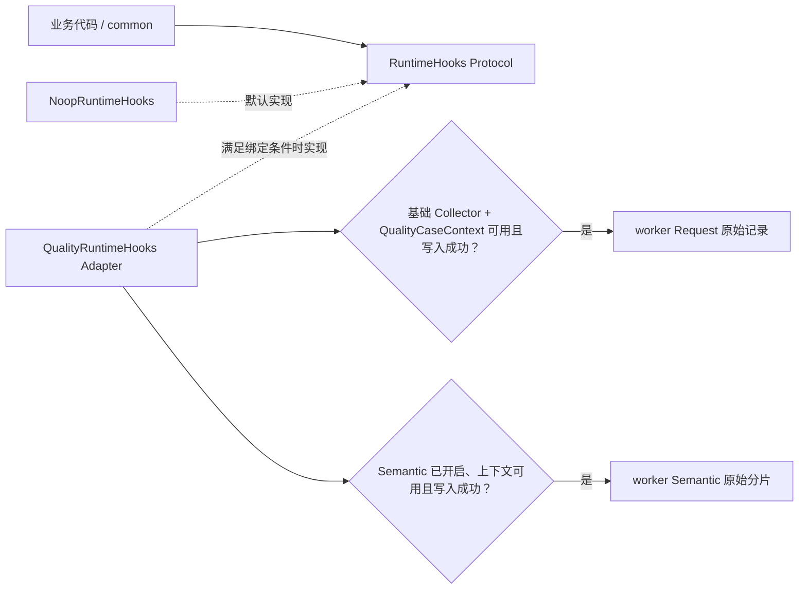
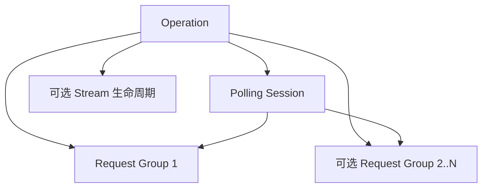
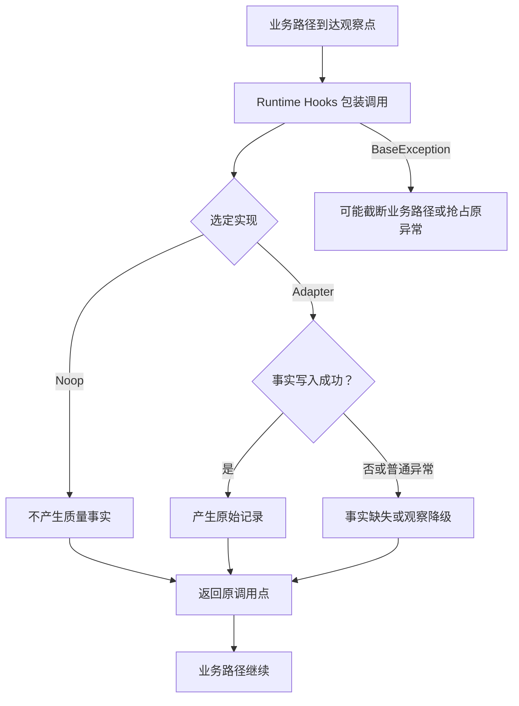

# 第 04 课：Runtime Hooks 的非侵入观察

## 先看一个真实矛盾

一个 pytest（测试执行框架）Case（一次用例调用）的业务请求已收到 HTTP 200，并假设响应内容满足业务断言。这里把承载状态码、响应头和响应内容的业务响应对象称为 Response。此时旁路统计文件写入失败，这个 Case 应不应该从成功变成失败？

不应该。请求是否成功属于业务路径；Quality 是可选的质量观察模块，只能记录诊断事实。如果 common（框架的通用业务层）必须等 Quality 成功才能返回，观察者就会变成业务控制器。

真正要解决的问题因此不是“怎样多记一些日志”，而是：

```text
业务必须独立成立
+ Quality 需要看见请求、轮询和流式消费
+ 普通观察失败不能改判业务结果
-> 需要一个可关闭、可替换的旁路观察合同
```

框架把这组中性回调称为 Runtime Hooks。业务层只依赖 Protocol，也就是接口约定；默认实现是 Noop，接受调用但不产生外部效果；Quality 接入时使用 Adapter，把中性回调翻译成具体采集调用。经过安全包装的观察回调抛出普通 Python `Exception` 时，异常不从包装层逃逸，这称为 fail-open。

跨函数生命周期还带来第二个约束：开始和结束必须由同一个观察者负责。后文解决这一问题时，再引入保存观察者与传播当前上下文的具体机制。

> 核心结论：common 只依赖中性的 Runtime Hooks Protocol，默认实现是 Noop；满足运行时接入条件时，Quality 才通过 Adapter 接入。fail-open 只覆盖普通 `Exception`；Hook 没有向外抛异常，也不等于质量事实已经产生。

## 1. 课程信息

| 项目 | 内容 |
| --- | --- |
| 建议时长 | 75 分钟 |
| 核心问题 | Quality 怎样观察复杂调用生命周期，却不控制业务请求？ |
| 课程位置 | 承接执行身份主题；本课自行回顾必要的 run（一次测试运行）、Case 与稳定归属含义，再说明旁路观察怎样接入 |
| 前置要求 | 无。不要求预先学习第 3 课；本课会简要回顾：run 表示一次测试运行，Case 表示一次用例调用，稳定身份用于把观察事实归入正确执行 |
| 本课主线 | 依赖倒置（common 依赖抽象 Protocol，而不是具体 quality 实现）→ Protocol → Noop → Adapter → 生命周期闭合 → fail-open 与可见性边界 |
| 最终结论 | 代码锚点只证明包装层拦住普通 `Exception`；结合当前标准调用点，可进一步确认普通 Hook 异常不覆盖业务 Response、原始异常或 pytest 事实，`BaseException`（如 `KeyboardInterrupt`、`SystemExit`）不在保证内 |

### 1.1 本课学习结果

本课结束后，学习者应能：

1. 解释为什么 common 不能直接导入 quality。
2. 区分 Runtime Hooks 协议、Noop 实现和 Quality Adapter 的职责。
3. 说明 Quality 关闭时为什么不会创建新的质量身份和产物。
4. 解释跨函数生命周期为什么必须由开始时的观察者结束。
5. 说明当前执行上下文为什么需要显式传播到线程池任务。
6. 准确描述当前 fail-open 的保证与不足。
7. 区分业务正常终态、观察降级和观察生命周期未闭合。

### 1.2 本课刻意不展开

- 不展开单次请求上下文、请求头、脱敏和请求体复制。
- 不讲完整 Middleware（真实发送前后插入处理的中间层）生命周期；Middleware 只作为中性接入点出现。
- 不展开后续业务归属记录的内部字段。
- 不展开服务端事件流（SSE）数据解析算法和轮询（Polling）策略；这些业务正确性边界不属于本课范围。
- 不讲执行进程原始分片的归并；第 5 课再处理。
- 不把未来“所有观察异常都有诊断证据”写成当前已实现事实。

### 1.3 75 分钟讲授路线

| 时间 | 内容 | 本段要形成的认识 |
| ---: | --- | --- |
| 0～8 分钟 | 先说结论与反例 | 观察不能成为业务成功的前置条件 |
| 8～18 分钟 | 第一性原理与 TOC（约束理论，即优先识别当前最大的理解瓶颈） | 先解除硬依赖，再识别生命周期闭合的新瓶颈 |
| 18～30 分钟 | Protocol、Noop、Adapter | 三者分别解决稳定接口、关闭能力和具体接入 |
| 30～43 分钟 | 业务动作与 Request 生命周期 | 中性 Hook 覆盖哪些观察点 |
| 43～56 分钟 | 生命周期责任与上下文保存 | 生命周期必须由开始时的观察者闭合 |
| 56～66 分钟 | fail-open 与诊断证据边界 | 普通异常不从包装层逃逸，不等于观察一定可见 |
| 66～72 分钟 | 正常、异常、降级和工程代价 | 看清当前保证与未来目标 |
| 72～75 分钟 | 收束并连接下一课 | 旁路观察先产出原始账页，之后再判断可信度 |

### 1.4 核心实现思路摘要

common 只调用中性的 Runtime Hooks Protocol，默认实现是 Noop。只有运行模式、Quality 开关和进程角色满足条件且初始化成功，pytest 插件（pytest 在配置和运行阶段加载的扩展组件）才绑定 Adapter；之后还要具备相应采集器、Case 上下文并写入成功，才会形成实际执行进程的原始事实。跨函数生命周期保存开始时的观察者供结束阶段复用。包装函数阻止普通 `Exception` 逃逸；结合当前标准调用点，普通 Hook 异常不会覆盖业务 Response、原始异常或 pytest 事实，但 `BaseException` 不在保证内。

---

## 2. 先说结论：观察者应当旁听，当前保证有边界

业务代码要完成的是发送请求、等待终态、消费流和向调用者返回 Response 或原始异常。Quality 要完成的是记录请求、业务分组、时间点和完整性问题。

两者目标不同：

| 路径 | 拥有的事实 | 失败时应怎样处理 |
| --- | --- | --- |
| 业务路径 | Response、原始异常、Polling 终态、SSE 消费结果 | 按业务合同返回或抛出 |
| 观察路径 | 请求事件、语义分组、时间与完整性诊断 | 调用经过安全包装时，普通 `Exception` 在包装层降级；`KeyboardInterrupt`、`SystemExit` 等更高层控制异常属于 `BaseException`，不在普通 `Exception` 捕获范围内 |

如果 common 直接调用 Quality 的具体采集器，就会形成错误依赖：

```text
业务请求要成立
-> Quality 包必须存在
-> Quality 初始化必须成功
-> 每次采集必须成功
-> 业务才能返回
```

这样 Quality 就从“观察者”变成了“业务控制器”。一个统计文件写入失败，可能把原本成功的 API 请求改成测试失败；这违反事实所有权。

当前实现使用相反的关系：

```text
common -> 中性的 RuntimeHooks 协议
             ^
             |
quality -> QualityRuntimeHooks Adapter

Quality 关闭 -> NoopRuntimeHooks
```

准确的依赖表达是：

```text
quality -> common.runtime_hooks
common -X-> quality
```

---

## 3. 第一性原理与 TOC：先保护业务事实所有权

### 3.1 不可再简化的目标

先补足本段必需的两个词：Operation 是用户关心的一次逻辑业务动作；Stream 是响应返回后仍需继续消费的数据过程。

观察能力要同时满足四个条件：

1. **可接入**：能够看到 Operation、一次请求意图及其中每次真实发送、Polling 和 Stream 的关键时点。
2. **可关闭**：不启用 Quality 时，原业务调用仍然成立。
3. **不越权**：包装层阻止普通 `Exception` 逃逸；当前标准调用点进一步保持 Response、原始异常或 pytest 结果。
4. **可归属**：开始与结束属于同一观察者和同一业务生命周期。

这四个条件分别推动了当前设计：

| 条件 | 设计 |
| --- | --- |
| 可接入 | 中性 Runtime Hooks 协议与统一观察点 |
| 可关闭 | 默认 Noop |
| 不越权 | `_safe_call` / `_safe_result` 对普通 `Exception` 的 fail-open |
| 可归属 | 开始时固定观察者，并把结束责任随生命周期保存 |

### 3.2 障碍到设计的因果链

```text
Quality 需要观察多个跨函数生命周期
-> common 若直接依赖 quality，业务会被可选模块反向控制
-> 只在每次结束时重新选择观察者又可能换人
-> 必须用中性 Protocol 隔离实现，并用 Noop 保持关闭路径成立
-> 开始时取得的 Hooks 实例必须随该生命周期保存
-> 通用回调通过只捕获普通 Exception 的 fail-open 安全层调用
-> 普通观察异常不从包装层逃逸；当前标准调用点不让它覆盖业务事实
```

### 3.3 TOC：约束会从依赖方向转移到生命周期闭合

Runtime Hooks 有很多方法。逐个背诵方法名不会解释设计价值。最初的最大约束是 common 对可选 Quality 的硬依赖和事实越权；Protocol 与 Noop 移除硬依赖，fail-open 先阻止普通 `Exception` 从包装层逃逸，当前标准调用点再保护业务事实。做到这些之后，新的瓶颈才暴露出来：跨函数生命周期怎样由同一个观察者闭合。

这是一条约束转移，而不是两个“最大约束”同时成立：

```text
“观察是可选的”
≠
“观察生命周期不需要正确闭合”
```

即使 Quality 是可选能力，一旦本轮已由某个观察者开始记录 Operation，结束、detach（把流式生命周期的后续收口责任移交给响应对象）或 Stream 收口仍应回到同一实例。第 6 节再说明保存这项责任的具体机制。

---

## 4. 三个设计支点：Protocol、Noop、Adapter

### 4.1 Protocol：common 只认识中性合同

Protocol 可以先理解为“一组对象只要实现这些方法，就能被当作 Runtime Hooks 使用的接口约定”。它描述能力，不创建具体质量事实。

当前 `RuntimeHooks` 覆盖四组生命周期：

其中 Request Group 表示一次请求意图，Request Event 表示其中一次真实网络发送。

| 生命周期 | 代表性观察点 | 回答的问题 |
| --- | --- | --- |
| Operation | begin、finish、detach | 一次用户业务动作何时开始、怎样结束 |
| Request Group / Request Event | start group、bind context、request started/succeeded/failed、finish group | 一次请求意图包含哪些真实发送 |
| Polling | begin、observe state、add sleep、finish | 多轮查询观察到什么状态，怎样结束 |
| Stream | bind response、observe line、finish | Response 之后的流是否完整消费 |

合同参数使用中性模型，例如 `RuntimeOperationOutcome`、`RuntimePollingOutcome` 和 `RuntimeStreamOutcome`。common 不需要知道 Quality 内部记录对象或具体写入器。

例如，合同声明 `begin_operation(...)`、`request_succeeded(...)` 和 `finish_stream(...)`，而不导入任何 Quality 具体采集器。这组代表性签名足以说明 common 依赖中性合同，不需要展开完整方法清单。

### 4.2 Noop：关闭 Quality 时调用合同仍成立

Noop 的意思是“接受同样调用，但不产生外部效果”。`NoopRuntimeHooks` 对 begin 返回空开始结果，对其他方法返回 `None`。

当前 Hooks 选择机制以单例 Noop 为默认值：没有绑定 Quality Adapter 时，调用方仍能取得一个 Hooks 实现，不必先判断 Quality 开关。第 7 节再展示它怎样保存当前实现。

默认值这一事实不能独立证明“不创建身份和产物”。这个结论还依赖另外两项当前实现事实：`NoopRuntimeHooks` 的方法只返回中性值，Quality 关闭路径也不初始化质量上下文与采集器。综合调用链才能得出：Noop 不是“记录一份空质量报告”，而是不创建新的质量身份和产物。

### 4.3 Adapter：Quality 把中性合同翻译为具体采集

“Quality 开关开启”不是 Adapter 与质量事实同时出现的充分条件。当前绑定链还包含这些门：

这里的 Collector 是把观察事件写成 worker 原始记录的采集器；worker 是实际执行用例的 pytest 工作进程；runtime 模块是承载这些运行期采集逻辑的插件模块。

```text
pytest 不是 collect-only（只收集用例而不执行的模式）
+ Quality 开关有效
-> 外层插件导入并注册 runtime 模块
-> runtime 插件进入内部配置
+ 当前进程不是 xdist controller（只调度并行 worker 的控制进程）
+ 当前进程是实际执行用例的 worker
+ 基础 Collector 与 Adapter 内部初始化成功
-> 创建并绑定 QualityRuntimeHooks Adapter
```

Semantic 是可选的业务归属记录，Semantic Collector 是写入这类记录的语义采集器；Semantic 有独立开关且默认关闭。

runtime 接入存在四类不同失败行为，不能概括为“初始化失败后统一警告并清理”：

- 外层 runtime 模块导入或注册失败：当前没有异常捕获，可能直接导致 pytest 配置失败。
- runtime 配置解析失败：记录警告后直接返回，不进入 worker 初始化。
- Semantic Collector 初始化失败：复位 Semantic、记录警告，但继续创建并绑定 Runtime Hooks Adapter。
- worker 主初始化块的其他步骤抛出普通 `Exception`：复位 Runtime Hooks、run 上下文和基础 Collector；已经建立的 Semantic Collector 不会在该分支立即复位。

当前 Jenkins Real Smoke（CI 中访问真实服务的冒烟阶段）显式开启 Quality、Semantic 和 Metrics（单轮指标计算）；这是该入口的当前配置事实，不能推广为所有运行模式。

而且当前 Real Smoke 的覆盖并不完整：异步和同步图片 Smoke 在取得最终图片 URL 后，仍分别直接调用 `requests.get()` 校验图片可访问性。这两次下载绕过 common 的标准请求入口与 Runtime Hooks，因此“开关已开启”也不能推出“本阶段所有网络发送都已观察”。

Adapter 的职责是翻译。`RuntimeOperationMetadata` 是 Operation 的中性元数据对象，其他回调也只接收中性参数：

```text
RuntimeOperationMetadata
-> semantic_context.begin_operation

Runtime request callback
-> request_metrics 采集

RuntimePollingOutcome
-> Semantic PollingOutcome

RuntimeStreamOutcome
-> Semantic StreamOutcome
```

Adapter 依赖 common 的协议和 quality 的具体实现，因此依赖箭头方向正确。图中的 `QualityCaseContext` 是当前 pytest Case 的稳定身份上下文：



虚线表示“实现这个合同”，不是运行时的强制串行调用。缺少 Collector、`QualityCaseContext`、Semantic 前提或写入失败时，Hook 即使正常返回，也可能没有对应事实；“没有抛异常”不能作为“事实已产生”的证据。

---

## 5. 从业务动作到观察点：不是所有事件都属于同一层

### 5.1 Operation 是用户关心的业务动作

Operation 可能是：

- 一次普通 HTTP 调用。
- 一次 SSE 对话。
- 一次异步任务创建并等待完成。
- 一次明确标记的轮询业务动作。

Operation 开始时，common 只传中性的 kind、name、role 和可选 model id。Quality Adapter 可以把它映射为 Semantic Operation；Noop 则返回没有所有权的空开始结果。

### 5.2 Request Group 与 Request Event 的层次

Request Group 表示一次请求意图，Request Event 表示其中一次真实网络发送。标准请求入口会在真实发送开始、取得 Response 或捕获发送异常时尝试调用相应 Hook。Middleware 提前失败或自定义顺序阻断观察点时，Request Event 可能缺失或未闭合；这属于当前能力边界，本课不展开 RequestContext 和完整 Middleware 调用链。

### 5.3 Polling 与 Stream 是独立生命周期

Polling Session 跨越一次或多次独立 GET Request Group：首轮已经达到终态时一次即可，未达到时才继续下一轮。Stream 则在一个 Response 建立后继续消费数据。



这张图用多轮查询展示扩展情况，第二轮并非必然发生；它也不表示每个 Operation 同时拥有 Polling 和 Stream。普通 HTTP、异步 Polling 与 SSE 是不同业务类型。

---

## 6. 开始和结束必须属于同一观察者

### 6.1 只在结束时重新选择观察者会发生什么

假设 Operation 开始时选择观察者 A，运行中当前观察者切换为 B。如果结束时重新选择，就可能得到：

```text
A 创建了 Operation 生命周期标识
-> B 收到来自 A 的标识并尝试结束
-> B 不认识该标识，生命周期无法闭合
```

这不是理论上的小瑕疵。Operation、Polling 和 Stream 都可能跨越多个函数；SSE 甚至在返回 Response 后由调用者继续消费。这里把当前选中的 Hooks 实例称为 provider；把具体实现用于识别某段生命周期对象的引用称为句柄；把保存开始时 Hooks、句柄和结束责任的凭证称为 lease。

### 6.2 lease 保存什么

lease 可以理解为“某段生命周期的责任凭证”。当前模型包括：

- `RuntimeOperationLease`
- `RuntimeRequestGroupLease`
- `RuntimePollingLease`
- `RuntimeStreamLease`

它们至少保存：

- 开始时取得的 `hooks` 实例。
- 对具体观察实现有意义的 `native_handle`（具体实现返回的生命周期句柄）。
- Operation 还保存是否拥有结束责任的 `owned`。

外层 Operation 在没有 active Operation（当前正在进行的 Operation）时，从当前 provider 取得 Hooks。`RuntimeOperationStart()` 是 begin 失败时由安全包装返回的默认空开始结果。以下锚点只展示外层 Operation 路径，证明外层开始时把 Hooks 写入 lease，结束时取回同一实例，并且只有 owner 收口：

```python
hooks = get_runtime_hooks()
started = _safe_result(hooks.begin_operation, RuntimeOperationStart(), metadata)
lease = RuntimeOperationLease(
    hooks=hooks,
    native_handle=started.native_handle,
    owned=started.owned,
)

# finish_operation 函数内
if not lease.owned:
    return
try:
    _safe_call(lease.hooks.finish_operation, lease.native_handle, outcome)
finally:
    _reset_operation(lease)
```

这是本课关于外层 Operation 的最小代码锚点。它不独立证明嵌套路径怎样选择 Hooks。

### 6.3 嵌套（nested）Operation 为什么有 `owned`

如果当前上下文已经有 active Operation，再调用 `begin_operation` 会继承 active Operation 的 Hooks，复用已有 handle，并返回 `owned=False` 的 lease。这是当前实现事实，不由上面的外层代码锚点独立证明。

直觉上，相当于：

```text
外层创建并拥有业务动作
-> 内层发现已有动作，只加入同一归属
-> 内层不能抢先结束外层 Operation
```

只有 `owned=True` 的 lease 才负责 finish 或 detach。这样可以避免同一 Operation 被嵌套调用重复关闭。

### 6.4 Request 与 Stream 怎样保留开始时观察者

Request 开始时，当前 Hooks 实例被放入 RequestContext 的属性。成功或失败回调优先从该属性取回，而不是盲目使用结束时的 provider。

Stream 更特殊，但 lease 并非对所有 Response 无条件附着。只有 Operation 的 `owned=True`、本次被标记为流式请求且响应状态为 2xx 时，标准观察入口才生成 `RuntimeStreamLease` 并附着到 Response；后续 `iter_sse_lines` 消费行和收口时，再从 Response 取回同一个 lease。

```text
owned Operation + 流式标记 + 2xx Response
-> 将 Stream lease 附着到 Response
-> 调用者稍后消费数据
-> 每行观察与最终 finish 使用相同 Hooks
```

因此“Response 已返回给上层”不等于观察责任已经结束。

---

## 7. ContextVar：保存当前上下文，不是全能的并发传播器

### 7.1 它解决什么问题

ContextVar 是 Python 用来保存“当前执行上下文中的值”的机制。相比一个全局变量，它可以让不同并发上下文拥有不同的：

- 当前 Runtime Hooks provider。
- 当前 active Operation lease。
- Quality 运行身份和 Case 身份。

provider 使用 ContextVar 保存当前 Hooks，默认值就是单例 Noop：

```python
_NOOP_RUNTIME_HOOKS = NoopRuntimeHooks()

_RUNTIME_HOOKS: ContextVar[RuntimeHooks] = ContextVar(
    "common_runtime_hooks",
    default=_NOOP_RUNTIME_HOOKS,
)

def get_runtime_hooks() -> RuntimeHooks:
    return _RUNTIME_HOOKS.get()
```

这是本课关于默认 provider 的最小代码锚点。它只证明：没有其他绑定时，provider 返回 Noop 单例，调用方仍能取得一个 Hooks 实现；它不独立证明是否创建质量身份或产物。

ContextVar 保存当前上下文值。调用 `set()` 返回的 token 不代表当前身份或业务状态，只保存恢复旧值所需的信息，其中可能包含旧上下文值。`pytest_unconfigure` 是 pytest 会话卸载阶段调用的插件回调。本课主线需要区分以下四类 token；这不是框架全部内部 token 的完整清单：

| token | 何时建立 | 何时复位 | 实际边界 |
| --- | --- | --- | --- |
| Runtime Hooks provider token | 实际 worker 配置并成功绑定 Adapter 时 | 正常路径在同一 worker 的 `pytest_unconfigure` | Runtime Hooks ContextVar 保存 Adapter；token 只恢复旧 provider，同一 worker 内多个 Case 不会逐个重绑 |
| Run token | worker 配置时建立 `QualityRunContext`（Quality 运行身份上下文）后 | 主初始化后续失败时立即复位；正常路径在同一 worker 的 `pytest_unconfigure` 复位 | `QualityRunContext` 保存 run、execution（一次执行阶段）、worker 和输出目录身份；token 只恢复旧 Run Context，不等同于 Case token |
| Case token | 基础 Collector 可用且当前 Case 的 `QualityCaseContext` 构建成功时 | 正常路径在 Case 协议结束时复位；若此前 Semantic 收口意外抛出异常，当前实现可能无法执行到复位 | `QualityCaseContext` 保存 Case 身份；构建失败或 Collector 缺失时不建立 token |
| Operation token | 拥有结束责任的 Operation 开始时 | 该 Operation `finish` 或 `detach` 时 | active Operation ContextVar 保存当前 lease；token 只负责复位，不负责 worker provider 或 Case |

### 7.2 为什么还要 lease

ContextVar 回答“当前上下文是什么”；lease 回答“这段已开始的生命周期归谁结束”。两者用途不同：

| 机制 | 解决的问题 |
| --- | --- |
| ContextVar | 在当前执行上下文中找到默认 provider 或 active Operation |
| lease | 固定某个具体生命周期开始时的 Hooks 与 handle |

只使用 ContextVar，运行中 provider 切换仍可能让生命周期换人；只使用 lease，又无法方便地让嵌套请求找到当前 Operation。

### 7.3 线程池的标准传播方式

`ThreadPoolExecutor`（Python 线程池执行器）的直接 `executor.submit()` 不会自动复制调用方的 run、Case、Operation 和 Runtime Hooks ContextVar。若任务在线程中发送请求，可能出现：

- 找不到当前 Case 身份。
- 退回默认 Noop。
- 请求事实无法归入原 Operation。

`submit_with_context()` 是提交线程池任务时复制当前 ContextVar 上下文的辅助函数。框架在 `common.submit_with_context(executor, function, ...)` 中调用 `copy_context()`，再让任务在复制的上下文中运行；用例规范强制使用这一 ContextVar 传播解法。

它不解决共享 `requests.Session`（HTTP 连接会话对象）的线程安全问题。规范还要求每个线程独立创建并关闭自己的 Request Client，也就是封装 Session 的请求客户端；不能因为改用 `submit_with_context()`，就并发共享同一个客户端。ContextVar 与 lease 本身也不会让直接 `executor.submit()` 自动安全。

---

## 8. fail-open：阻止普通异常从包装层逃逸

### 8.1 当前安全层怎样工作

通用生命周期通过两个包装调用观察者：

```python
def _safe_call(function, *args, **kwargs):
    try:
        function(*args, **kwargs)
    except Exception:
        return


def _safe_result(function, default, *args, **kwargs):
    try:
        return function(*args, **kwargs)
    except Exception:
        return default
```

这是本课第三个最小代码锚点。它证明当前包装层的精确行为：

> 当观察调用确实经过 `_safe_call` 或 `_safe_result` 时，普通 `Exception` 不会从包装层逃逸；无返回值路径直接结束，需要返回值的路径返回调用方提供的默认值。业务 Response、原始异常和 pytest 结果是否完整保留，还需要结合具体调用点判断。

### 8.2 为什么“吞异常”既有价值也有代价

以下价值来自当前标准 Request 调用点，而不是仅由包装函数单独证明：

```text
请求已经成功
-> 质量记录写入抛普通 Exception
-> 业务 Response 仍返回
```

代价：

```text
观察回调发生未知的普通 Exception
-> 通用安全层静默吞掉
-> 可能没有对应 Integrity（质量事实缺失、冲突或采集异常的诊断记录）
-> 下游只能看到诊断缺失，甚至难以定位原因
```

因此必须准确区分两个结论层次：

- **代码锚点结论**：调用确实经过 `_safe_call` 或 `_safe_result` 时，普通 `Exception` 不从包装层逃逸；锚点本身不证明业务事实完整保留。
- **当前架构结论**：结合 Operation、Request、Polling、Stream 等标准调用点，普通 Hook 异常不会覆盖业务 Response、原始异常或 pytest 事实；`BaseException` 不在保证内。
- **当前不足**：通用安全层不保证所有逃逸异常都有可见证据。
- **改进目标**：让所有观察故障都有 Integrity 证据。

最后一项是未来改进方向，不是当前已经落地的保证。

### 8.3 哪些已知路径会尽力记录 Integrity

`QualityRuntimeHooks` 对 Request 采集调用增加了一层捕获。如果 `start_request_capture`、`record_response` 或 `record_exception` 失败，并且 Collector 可用，会尝试记录 `request_capture_failed` Integrity；这次诊断写入本身仍可能失败。

Semantic Context 的多类已知采集失败也会尽力调用内部 `_capture` 形成 Integrity。

但外层通用 `_safe_call` 仍会吞掉从 Adapter 逃逸的未知异常。因此不能由“部分路径记录 Integrity”推导“所有 Hook 异常都有 Integrity”。

### 8.4 更高层控制异常与普通 `Exception` 的边界

Python 的 `BaseException` 是普通 `Exception` 之上的异常基类，`KeyboardInterrupt`、`SystemExit` 等控制异常直接继承或归入这一层。`_safe_call` 只捕获 `Exception`，不会吞掉这些更高层控制异常。`operation_scope` 是负责自动结束 Operation 的上下文管理入口；它在业务异常路径中先尝试记录 outcome，再重新抛出原异常。

这里不能继续推出“观察层绝不会替换业务异常”。因果链是：

```text
业务路径已经捕获一个 BaseException
-> operation_scope 先调用 finish Hook
-> finish Hook 若正常返回或抛普通 Exception，原异常随后重新抛出
-> finish Hook 若抛 KeyboardInterrupt、SystemExit 等 BaseException，安全层不会捕获
-> 新的控制异常可能先于原异常逃逸，甚至抢占原业务异常
```

所以当前标准 `operation_scope` 保留原业务异常的保证只覆盖 Hook 正常返回或抛普通 `Exception`；`BaseException` 是明确的未保护边界。

---

## 9. 生命周期终态、失败出口与降级矩阵

### 9.1 各生命周期的中性终态

| 生命周期 | 代表性终态 | 准确含义 |
| --- | --- | --- |
| Operation | success、failed、timeout、interrupted、incomplete、unknown | 用户业务动作观察到的结果 |
| Polling | success、failure、timeout、unknown、interrupted | Polling Session 的结束原因 |
| Stream | complete、interrupted、error、not_consumed | 流消费是否完整、被中断、出错或未消费 |
| Request | succeeded 或 failed 回调 | 单次真实网络发送返回 Response 或异常 |

这些是观察合同的终态，不拥有业务断言。比如 Stream complete 只代表标准消费者观察到完整协议收口，不代表 Case 所有断言通过。

### 9.2 降级行为

| 情形 | 当前行为 | 不应得出的结论 |
| --- | --- | --- |
| Quality 未启用 | 使用 Noop，业务继续，不创建质量身份/产物 | 不能说本轮有完整质量事实 |
| runtime 模块导入或注册失败 | 外层插件没有捕获该异常；普通 `Exception` 也可能直接导致 pytest 配置失败 | 不能套用 Runtime Hooks 的 fail-open，也不能说一定只警告后继续 |
| runtime 配置解析失败 | 记录警告后直接返回，不进入 worker 初始化 | 此时还没有建立 worker 的运行上下文、Collector 或 Adapter |
| Semantic Collector 初始化失败 | 复位 Semantic 并记录警告，随后继续创建和绑定 Runtime Hooks Adapter | 不能据此认定基础 Request 观察也被关闭，更不能假装 Semantic 事实已经产生 |
| worker 主初始化块的其他步骤抛普通 `Exception` | 复位 Runtime Hooks、run 上下文和基础 Collector，并记录警告 | 已经建立的 Semantic Collector 不会在该分支立即复位，不能声称当场清理全部状态 |
| begin Hook 抛普通 `Exception` | 返回默认空开始结果，业务继续 | 不能假装 Operation 已被记录；`BaseException` 不在此保证内 |
| finish Hook 抛普通 `Exception` | 在当前标准调用点被安全层吞掉，业务结果保留 | 不能保证存在 Integrity；`BaseException` 仍可能逃逸并抢占原异常 |
| Request 已知采集失败 | 尽力记录 `request_capture_failed` | 不能保证记录一定写入成功 |
| Semantic 已知采集失败 | 尽力记录 Semantic Integrity | 不能推断所有语义关系完整 |
| provider 在运行中切换 | 已创建 lease 仍使用开始时 Hooks | 只覆盖持有 lease 的标准生命周期 |
| 线程池直接使用 `executor.submit()` | 可能退回 Noop 或失去 run、Case、Operation 归属 | 必须改用 `common.submit_with_context()`；不能把缺失记录解释为零次请求 |
| Stream Response 未经标准消费者 | 可能保持 `not_consumed` 或缺失完整收口证据 | HTTP 200 不等于流完整 |

### 9.3 观察失败时的所有权顺序

标准生命周期沿开始时选定的 Hooks 收口，而不在结束时重新选择。下图只保留观察调用的失败回流关系：



Noop、Adapter 写入成功和普通观察降级三条分支都返回原调用点，业务路径继续；`BaseException` 可能直接逃逸并截断业务路径或抢占原异常。Hook 调用正常返回仍不能替代对实际记录的检查。

---

## 10. 设计收益、缺点与工程代价

### 10.1 主要收益

| 收益 | 原因 |
| --- | --- |
| common 与 quality 可以独立演进 | common 只依赖中性 Protocol |
| Quality 可关闭 | 默认 Noop 保持调用合同成立 |
| 普通 Hook 异常不覆盖业务事实 | 包装层阻止普通 `Exception` 逃逸，当前标准调用点保持业务 Response、原始异常和 pytest 事实 |
| 跨函数生命周期可闭合 | lease 保存开始时 Hooks 与 native handle |
| 嵌套调用不会重复结束外层 Operation | `owned` 区分责任 |
| Request 与 Stream 不因延迟结束而换观察者 | 观察者保存在 context 或 Response lease 中 |

### 10.2 缺点与代价

- Protocol、Noop、Adapter 三层增加了抽象和维护成本。
- 中性枚举与 Quality 枚举之间需要准确映射。
- lease、ContextVar token、owned 和 detach 增加生命周期状态。
- fail-open 阻止普通观察异常从包装层逃逸；它与当前标准调用点共同保护业务事实，但也可能降低观察故障的可见性。
- 直接 `executor.submit()`、非标准请求入口和非标准流消费者仍可能绕过上下文或收口。
- 新增观察点必须同时考虑 Noop、Adapter、生命周期责任和异常路径。

### 10.3 能力边界

1. Runtime Hooks 存在，不等于当前业务模块已经走过标准观察入口。
2. Quality 启用，不等于 Adapter 一定绑定；Adapter 已绑定，也不等于 Collector、Case 上下文和写入都成功。
3. 代码锚点只证明包装后的普通 `Exception` 不逃逸；结合当前标准调用点，才能确认普通 Hook 异常不覆盖业务事实。诊断完整性不受保证，`BaseException` 也不在保证内。
4. lease 固定标准生命周期的观察者，不自动修复所有自定义并发传播。
5. Noop 保持业务成立，但不会创建“空的可信质量账本”。
6. Middleware 只提供接入点，不拥有 Operation、Case 或 pytest 结论。

### 10.4 适用场景

- 适合：同一请求框架既要支持无 Quality 的轻量运行，又要在 CI 中旁路采集 Retry、Polling 和 SSE 生命周期。
- 可能过重：只有少量同步调用、观察逻辑与业务同生共死且不需要可插拔诊断的程序。

---

## 11. 最小代码锚点与事实结论

| 锚点 | 能证明的事实 | 不能证明的事实 |
| --- | --- | --- |
| `provider._RUNTIME_HOOKS`、Noop 单例与 `get_runtime_hooks` | 未绑定时读取 provider 会返回该 Noop 单例 | Noop 是否创建身份或产物，以及本轮是否通过其他方式启用 Quality |
| `begin_operation`、`RuntimeOperationLease` 与 `finish_operation` | 外层 Operation 开始时把 Hooks 写入 lease，finish 取回同一实例，且只由 owner 收口 | 嵌套路径怎样继承 Hooks，或任意自定义线程是否正确传播 context |
| `_safe_call` / `_safe_result` | 调用确实经过包装层时，普通 `Exception` 不逃逸；无返回值路径结束，有返回值路径返回调用方默认值 | 具体业务 Response、原始异常和 pytest 结果必然完整保留，或所有异常都有 Integrity 证据 |

这些锚点只证明设计边界，不承担源码导航。真实业务是否走到某个观察点，仍要由实际调用链证明，不能只因类中存在相应方法就推断。

---

## 12. 本课收束：非侵入来自依赖、责任和失败语义

本课主线可以压缩为：

```text
common 只认识中性 RuntimeHooks Protocol
-> 未启用 Quality 时使用 Noop，不创建质量身份和产物
-> 满足插件与 worker 条件时才绑定 Quality Adapter
-> ContextVar 提供当前上下文
-> lease 固定开始时的观察者和结束责任
-> 相应开关、Collector、Case 上下文与写入都成立时，才产生 worker 原始记录
-> 包装层阻止普通 Exception 逃逸，当前标准调用点保护业务事实
-> 基础事实分片进入 P0（第一阶段基础事实归并），Semantic 与 Metrics 再分层消费可信证据
```

最后必须同时记住两个结论：

> 代码锚点只证明“包装后的普通 `Exception` 不逃逸”；结合当前标准调用点，可进一步确认普通 Hook 异常不覆盖业务 Response、原始异常或 pytest 事实。它不保证质量事实一定产生，`BaseException` 也不在保证内。

到这里，框架已经能在满足采集前提时旁路地产生 worker 原始事实。在基础事实和 Semantic 两类 worker 分片中，只有基础事实分片作为 P0 记录输入；P0 归并还使用 Runner 权威执行信息、预期数量和 JUnit 进行对账。P0 可信后，Semantic 再引用并校验 P0 证据，Metrics（指标层）最后消费可信 P0 与 Semantic。Semantic 原始分片不会直接成为 P0。
