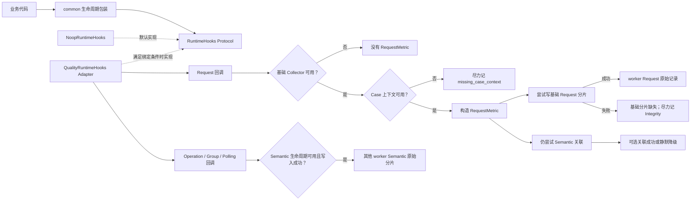

# 第 04 课：Runtime Hooks 的非侵入观察

## 先看一个真实矛盾

一个 pytest（测试执行框架）Case（一次用例调用）的业务请求已收到 HTTP 200，并假设响应内容满足业务断言。这里把承载状态码、响应头和响应内容的业务响应对象称为 Response。此时旁路统计文件写入失败，这个 Case 应不应该从成功变成失败？

不应该。请求是否成功属于业务路径；Quality 是可选的质量观察模块，只能记录诊断事实。如果 common（框架的通用业务层）必须等 Quality 成功才能返回，观察者就会变成业务控制器。

真正要解决的问题因此不是“怎样多记一些日志”，而是：

```text
业务必须独立成立
+ Quality 需要看见请求与轮询生命周期
+ 普通观察失败不能改判业务结果
-> 需要一个可关闭、可替换的旁路观察合同
```

框架把这组中性回调称为 Runtime Hooks。业务层只依赖 Protocol，也就是接口约定；默认实现是 Noop，接受调用但不产生外部效果；Quality 接入时使用 Adapter，把中性回调翻译成具体采集调用。经过安全包装的观察回调抛出普通 Python `Exception` 时，异常不从包装层逃逸，这称为 fail-open。

跨函数生命周期还带来第二个约束：开始和结束必须由同一个观察者负责。后文解决这一问题时，再引入保存观察者与传播当前上下文的具体机制。

> 核心结论：common 只依赖中性的 Runtime Hooks Protocol，默认实现是 Noop；满足运行时接入条件时，Quality 才通过 Adapter 接入。fail-open 只覆盖普通 `Exception`；Hook 没有向外抛异常，也不等于质量事实已经产生。

## 1. 课程信息

| 项目 | 内容 |
| --- | --- |
| 建议时长 | 75 分钟 |
| 核心问题 | Quality 怎样观察复杂调用生命周期，却不控制业务请求？ |
| 课程位置 | 承接执行身份主题；本课自行回顾必要的 run（一次测试运行）、Case 与稳定归属含义，再说明旁路观察怎样接入 |
| 前置要求 | 无。不要求预先学习第 3 课；本课会简要回顾：run 表示一次测试运行，Case 表示一次用例调用，稳定身份用于把观察事实归入正确执行 |
| 本课主线 | 依赖倒置（common 依赖抽象 Protocol，而不是具体 quality 实现）→ Protocol → Noop → Adapter → 生命周期闭合 → fail-open 与可见性边界 |
| 最终结论 | 代码锚点只证明包装层拦住普通 `Exception`；结合当前标准调用点，可进一步确认普通 Hook 异常不覆盖业务 Response、原始异常或 pytest 事实，`BaseException`（如 `KeyboardInterrupt`、`SystemExit`）不在保证内 |

### 1.1 先读懂这张极简术语图

```text
Operation（一次逻辑业务动作）
├─ Request Group（一次请求意图，可包含重试）
│  └─ Request Event（其中一次客户端发送尝试）
└─ Polling Session（多轮状态查询的观察生命周期）

worker（实际执行用例的 pytest 工作进程；每个执行进程独立写出原始文件）
├─ 基础 Collector → Request 原始记录
└─ 可选 Semantic Collector → 业务归属原始分片
```

Provider 是当前提供给业务层的 Hooks 实例；句柄是具体观察实现用来定位生命周期对象的引用；`lease` 保存开始时 Provider、句柄和结束责任，`owned` 表示当前 lease 是否拥有结束责任。`ContextVar` 是 Python 保存当前执行上下文值的机制。RequestMetric 是内存中构造的单次请求事实。Semantic 是可选的业务归属记录。Integrity 是对缺失、冲突或采集异常的诊断事实，但当前只保证部分已知路径会尽力记录。P0 是下一课进行的第一阶段基础事实归并；本课只负责说明它的 worker 原始输入怎样旁路产生。

### 1.2 本课学习结果

本课结束后，学习者应能：

1. 解释为什么 common 不能直接导入 quality。
2. 区分 Runtime Hooks 协议、Noop 实现和 Quality Adapter 的职责。
3. 说明未进入 Collector 初始化的路径为何不创建新 worker 分片，以及 Provider 为 Noop 时为何仍可能已有空分片。
4. 解释跨函数生命周期为什么必须由开始时的观察者结束。
5. 说明当前执行上下文为什么需要显式传播到线程池任务。
6. 准确描述当前 fail-open 的保证与不足。
7. 区分业务正常终态、观察降级和观察生命周期未闭合。

### 1.3 本课刻意不展开

- 不展开单次请求上下文、请求头、脱敏和请求体复制。
- 不讲完整 Middleware（真实发送前后插入处理的中间层）生命周期；Middleware 只作为中性接入点出现。
- 不展开后续业务归属记录的内部字段。
- 不展开轮询（Polling）策略；业务正确性边界不属于本课范围。SSE 由独立扩展课“扩展课：SSE 流式调用的终态与时间边界”承接，本课不展开其调用链、算法或指标。
- 不讲执行进程原始分片的归并；第 5 课再处理。
- 不把未来“所有观察异常都有诊断证据”写成当前已实现事实。

### 1.4 75 分钟讲授路线

| 时间 | 内容 | 本段要形成的认识 |
| ---: | --- | --- |
| 0～8 分钟 | 先说结论与反例 | 观察不能成为业务成功的前置条件 |
| 8～28 分钟 | 模块级精简教学代码 | 先看 Provider 到原始产物或降级的关键转换 |
| 28～38 分钟 | 第一性原理与 TOC（约束理论，即优先识别当前最大的理解瓶颈） | 先解除硬依赖，再识别生命周期闭合的新瓶颈 |
| 38～47 分钟 | Protocol、Noop、Adapter | 三者分别解决稳定接口、关闭能力和具体接入 |
| 47～57 分钟 | 业务动作与生命周期责任 | 开始时固定的观察者必须负责结束 |
| 57～66 分钟 | ContextVar 与 fail-open | 上下文定位和普通异常隔离解决不同问题 |
| 66～72 分钟 | 正常、异常、降级和工程代价 | 看清当前保证与未来目标 |
| 72～75 分钟 | 收束并连接下一课 | 旁路观察先产出原始账页，之后再判断可信度 |

### 1.5 核心实现思路摘要

common 只调用中性的 Runtime Hooks Protocol，默认实现是 Noop。只有运行模式、Quality 开关和进程角色满足条件且初始化成功，pytest 插件（pytest 在配置和运行阶段加载的扩展组件）才绑定 Adapter。Case、Request 与 Semantic 主记录各有自己的生成前提；Integrity 反而可能在上下文缺失或采集失败时产生。跨函数生命周期保存开始时的观察者供结束阶段复用。包装函数阻止普通 `Exception` 逃逸，但 `BaseException` 不在保证内。

### 1.6 模块级精简教学代码：普通请求主线与 Polling 分支

原实现必须同时解决六个约束：common 不能导入 quality；关闭 Quality 时合同仍成立；只有合格 worker 才绑定 Adapter；Request 基础记录不能依赖 Semantic；开始和结束必须使用同一个观察者；普通 Hook 异常不能逃出安全包装。

下面是**教学伪代码**，不是仓库文件的逐行复制。`RuntimeOperationStart` 是 begin Hook 返回的“句柄 + owned”结果，`RuntimeOperationObservation` 是持有 Operation lease 并负责一次性收口的包装对象，provider token 是绑定 Hooks 后用于恢复旧 Provider 的凭证。代码只保留从业务调用到原始记录或降级的主干；安全包装的具体实现移到第 8 节。

```python
# 教学伪代码中的函数名表达职责，不复制仓库签名。
# common：Provider 与 lease 生命周期。
def begin_operation_lease(metadata):
    active = current_operation()
    if active is not None:
        return RuntimeOperationLease(active.hooks, active.native_handle, owned=False)
    hooks = get_runtime_hooks()                       # 从 ContextVar 读取 Provider
    started = _safe_result(hooks.begin_operation, RuntimeOperationStart(), metadata)
    lease = RuntimeOperationLease(hooks, started.native_handle, started.owned)
    return activate_if_owned(lease)

# quality Adapter：三个 Request 回调先进入可见诊断层。
def adapter_capture_request_call(context, function, *args):
    try:
        function(*args)
    except Exception as capture_error:
        collector = get_base_collector()
        if collector is None:
            return
        collector.capture_integrity(
            source="request_metrics",
            code="request_capture_failed",
            message=describe(capture_error),
            related_id=request_event_id(context),
        )
        # 诊断过程若仍抛普通 Exception，由外层 common._safe_call 最终静默兜底。

# quality request_metrics：构造并尝试写入 RequestMetric。
def record_request_outcome(context, response_or_error):
    collector = get_base_collector()
    if collector is None or _already_written(context):
        return                                      # 同一 Request Event 至多记录一次
    _mark_written(context)                          # 在后续构造和写入之前抢占终态
    if current_case_context() is None:
        try_capture_integrity("missing_case_context")
        return

    metric = build_request_metric(context, response_or_error)
    collector.record_request(metric)                # 布尔结果不作为 Semantic 门槛
    try:
        optional_semantic_observe(context, metric)
    except Exception:
        pass

# quality pytest runtime 插件：合格 worker 才绑定 Adapter，并保存复位 token。
def configure_worker():
    if not (quality_enabled and is_worker and base_collector_ready):
        return None
    return bind_runtime_hooks(QualityRuntimeHooks())

def unconfigure_worker(provider_token):
    if provider_token is not None:
        reset_runtime_hooks(provider_token)

# common / 业务请求路径：调用中性 Hook，并保持业务返回合同。
def send_with_event_hooks(context):
    observe_request_started(context)                 # common._safe_call -> Adapter 诊断层
    try:
        response = business_send(context)
    except Exception as send_error:
        observe_request_failed(context, send_error) # common._safe_call -> Adapter 诊断层
        raise
    else:
        observe_request_succeeded(context, response)# common._safe_call -> Adapter 诊断层
        return response

# 普通请求：返回 Response；收尾 Hook 未抛 BaseException 时重抛原业务异常。
def execute_request(metadata, request_spec):
    operation = begin_operation_lease(metadata)
    try:
        context = new_request_context()              # 无 Retry 基线：先有 Context
        group = start_request_group(**request_spec)  # 内部 _safe_result 并保存 Hooks
        bind_request_context(context, group)         # 位于发送的 try/finally 之外
        try:
            response = send_with_event_hooks(context)
        finally:
            finish_request_group(group)              # finally 只覆盖发送过程
    except BaseException as business_error:
        finish_operation(operation, outcome_for_error(business_error))
        raise
    else:
        finish_operation(operation, outcome_for_response(response))
        return response

# Polling：一个观察对象同时持有 Operation lease 与 Polling lease。
def execute_polling(metadata):
    operation = RuntimeOperationObservation(begin_operation_lease(metadata))
    polling_lease = begin_polling_session()          # active Operation 优先，否则取当前 Provider
    polling = RuntimePollingObservation(operation, polling_lease)
    try:
        response = query_until_terminal(polling)     # 每轮仍产生 Group / Event
    except BaseException as business_error:
        polling.finish_error(business_error)         # 依次收口 Polling 与 Operation
        raise
    else:
        polling.finish_success()                     # 依次收口 Polling 与 Operation
        return response
```

Request 回调先检查 `_already_written`，并在 Case 校验、模型构造和落盘之前执行 `_mark_written`；因此同一 Request Event 即使首个终态处理随后降级，也不会被第二次回调重复记录。该回调不向调用者暴露 `record_request()` 的布尔结果，正常结束时隐式返回 `None`。

后续代码块优先从这份主骨架抽取；对于骨架中抽象掉的关键判断和真实接入边界，使用保持相同核心语义的最小源码摘录补充证明。局部片段不替代模块级骨架，也不构成第二套实现。

主线因此是：

```text
业务调用
-> Operation -> Request Group -> Request Event
-> common 安全包装调用 Adapter 的可见诊断层
   ├─ 采集正常：构造内存中的 RequestMetric
   │  ├─ 尝试写基础 Request 分片，可能失败
   │  └─ 仍尝试建立 Semantic 原始关联
   └─ 采集抛普通 Exception：尽力记录 request_capture_failed
      └─ 诊断过程仍抛普通 Exception：common 安全包装最终静默兜底
-> 正常路径闭合后返回 Response；异常路径在收尾 Hook 未抛 BaseException 时，闭合后重抛原业务异常
```

Polling 是并列分支，不是普通 Request 主线之后的串行步骤：

```text
业务调用 -> Operation + Polling Session
-> 零个或多个 Request Group / Request Event
-> 成功或异常路径依次收口 Polling 与 Operation
-> 返回终态 Response，或在收尾未抛 BaseException 时重抛原业务异常
```

这段骨架不把一种终态规则推广到所有 Operation。`BaseRequest` 是框架的标准请求基类；它自建并拥有的非流式 Operation 按 HTTP 状态码映射，其中 2xx 指 200～299。`operation_scope` 是用 Python 上下文管理器包裹一段业务代码的 Operation 入口，按代码块是否抛出异常映射。Semantic 在具备 RequestMetric 时还可能校正 Semantic `OperationRecord.outcome` 的观察终态，但不改变业务 Response 或 pytest 事实。嵌套调用取得 `owned=False` 的 lease，不自行结束外层 Operation。

输出也有三种边界：Noop 回调自身不创建质量事实；未进入 Collector 初始化的路径不会创建新的 worker 分片。Provider 为 Noop 本身不能证明磁盘上没有既有或初始化遗留分片，因为 Collector 会在 Adapter 绑定前创建分片文件，后续绑定失败仍可能留下空分片。RequestMetric 构造后，基础落盘结果不阻断 Semantic 尝试，因此可能出现 Semantic 引用了缺失 P0 Request 的情况。普通 `Exception` 被安全层处理时业务继续而观察事实可能缺失，是否可信留给下一课做有限信任归并；`BaseException` 不在该保证内。

---

## 2. 先说结论：观察者应当旁听，当前保证有边界

业务代码要完成的是发送请求、等待终态并向调用者返回 Response 或原始异常。Quality 要完成的是记录请求、业务分组、时间点和完整性问题。

两者目标不同：

| 路径 | 拥有的事实 | 失败时应怎样处理 |
| --- | --- | --- |
| 业务路径 | Response、原始异常与 Polling 终态 | 按业务合同返回或抛出 |
| 观察路径 | 请求事件、语义分组、时间与完整性诊断 | 调用经过安全包装时，普通 `Exception` 在包装层降级；`KeyboardInterrupt`、`SystemExit` 等更高层控制异常属于 `BaseException`，不在普通 `Exception` 捕获范围内 |

如果 common 直接调用 Quality 的具体采集器，就会形成错误依赖：

```text
业务请求要成立
-> Quality 包必须存在
-> Quality 初始化必须成功
-> 每次采集必须成功
-> 业务才能返回
```

这样 Quality 就从“观察者”变成了“业务控制器”。一个统计文件写入失败，可能把原本成功的 API 请求改成测试失败；这违反事实所有权。

当前实现使用相反的关系：

```text
common -> 中性的 RuntimeHooks 协议
             ^
             |
quality -> QualityRuntimeHooks Adapter

Quality 关闭 -> NoopRuntimeHooks
```

准确的依赖表达是：

```text
quality -> common.runtime_hooks
common -X-> quality
```

---

## 3. 第一性原理与 TOC：先保护业务事实所有权

### 3.1 不可再简化的目标

先补足本段必需的两个词：Operation 是用户关心的一次逻辑业务动作；Request Group 是一次请求意图及其全部发送尝试。

观察能力要同时满足四个条件：

1. **可接入**：能够看到 Operation、一次请求意图及其中每次发送尝试、Polling 的关键时点。
2. **可关闭**：不启用 Quality 时，原业务调用仍然成立。
3. **不越权**：包装层阻止普通 `Exception` 逃逸；当前标准调用点进一步保持 Response、原始异常或 pytest 结果。
4. **可归属**：开始与结束属于同一观察者和同一业务生命周期。

这四个条件分别推动了当前设计：

| 条件 | 设计 |
| --- | --- |
| 可接入 | 中性 Runtime Hooks 协议与统一观察点 |
| 可关闭 | 默认 Noop |
| 不越权 | `_safe_call` / `_safe_result` 对普通 `Exception` 的 fail-open |
| 可归属 | 开始时固定观察者，并把结束责任随生命周期保存 |

### 3.2 障碍到设计的因果链

```text
Quality 需要观察多个跨函数生命周期
-> common 若直接依赖 quality，业务会被可选模块反向控制
-> 只在每次结束时重新选择观察者又可能换人
-> 必须用中性 Protocol 隔离实现，并用 Noop 保持关闭路径成立
-> 开始时取得的 Hooks 实例必须随该生命周期保存
-> 通用回调通过只捕获普通 Exception 的 fail-open 安全层调用
-> 普通观察异常不从包装层逃逸；当前标准调用点不让它覆盖业务事实
```

### 3.3 TOC：约束会从依赖方向转移到生命周期闭合

Runtime Hooks 有很多方法。逐个背诵方法名不会解释设计价值。最初的最大约束是 common 对可选 Quality 的硬依赖和事实越权；Protocol 与 Noop 移除硬依赖，fail-open 先阻止普通 `Exception` 从包装层逃逸，当前标准调用点再保护业务事实。做到这些之后，新的瓶颈才暴露出来：跨函数生命周期怎样由同一个观察者闭合。

这是一条约束转移，而不是两个“最大约束”同时成立：

```text
“观察是可选的”
≠
“观察生命周期不需要正确闭合”
```

即使 Quality 是可选能力，一旦本轮已由某个观察者开始记录 Operation 或 Polling，结束阶段仍应回到同一实例。第 6 节再说明保存这项责任的具体机制。

---

## 4. 三个设计支点：Protocol、Noop、Adapter

### 4.1 Protocol：common 只认识中性合同

Protocol 可以理解为“实现同一组方法即可替换的接口约定”。它只描述能力，不创建质量事实。本课只展开三组生命周期：

| 生命周期 | 代表性观察点 | 回答的问题 |
| --- | --- | --- |
| Operation | begin、finish | 一次用户业务动作何时开始、怎样结束 |
| Request Group / Request Event | start group、bind context、request started/succeeded/failed、finish group | 一次请求意图包含哪些发送尝试 |
| Polling | begin、observe state、add sleep、finish | 多轮查询观察到什么状态，怎样结束 |

合同通过 `begin_operation(...)`、`request_succeeded(...)`、`finish_polling_session(...)` 等中性签名传递结果，common 无需知道 Quality 的记录对象和写入器。

下面只摘出本课三类生命周期的最小合同；`native_handle` 保持为 `object | None`，正是为了不让 common 依赖 Quality 的具体句柄类型：

```python
class RuntimeHooks(Protocol):
    def begin_operation(
        self, metadata: RuntimeOperationMetadata
    ) -> RuntimeOperationStart: ...

    def finish_operation(
        self, native_handle: object | None, outcome: RuntimeOperationOutcome
    ) -> None: ...

    def start_request_group(
        self, *, method: str, path: str, protocol: str,
        configured_max_attempts: int,
    ) -> object | None: ...

    def bind_request_context(
        self, context: Any, native_handle: object | None
    ) -> None: ...

    def finish_request_group(
        self, native_handle: object | None, *, retry_wait_seconds: float = 0.0
    ) -> None: ...

    def request_started(self, context: Any) -> None: ...
    def request_succeeded(self, context: Any, response: Any) -> None: ...
    def request_failed(self, context: Any, error: BaseException) -> None: ...

    def begin_polling_session(self) -> object | None: ...
    def observe_polling_state(
        self, native_handle: object | None, state: str
    ) -> None: ...
    def add_polling_sleep(
        self, native_handle: object | None, seconds: float
    ) -> None: ...
    def finish_polling_session(
        self, native_handle: object | None, outcome: RuntimePollingOutcome
    ) -> None: ...
```

流式回调也属于真实 Protocol，但不进入本课主线，因此没有在这个最小摘录中展开。

### 4.2 Noop：关闭 Quality 时调用合同仍成立

Noop 接受同样调用但自身不产生质量事实：begin 返回空开始结果，其余方法返回 `None`。collect-only、xdist controller（负责调度 worker 的控制进程）、配置解析失败或 Quality 未启用等未进入 Collector 初始化的路径，不会创建新的 worker 分片；仅看到当前 Provider 是 Noop，不能排除既有分片或初始化失败留下的空分片。

它不是调用方的条件分支，而是一个满足同一合同的对象；以下代表性方法显示 begin 与无返回值回调的默认结果：

```python
class NoopRuntimeHooks:
    def begin_operation(self, metadata):
        return RuntimeOperationStart()

    def start_request_group(
        self, *, method, path, protocol, configured_max_attempts
    ):
        return None

    def request_succeeded(self, context, response):
        return None

    def begin_polling_session(self):
        return None

    def finish_polling_session(self, native_handle, outcome):
        return None
```

其余 Noop 回调遵循同一规则：不创建外部事实，返回合同允许的空结果。调用方因此不需要到处分叉判断“Quality 是否开启”。

### 4.3 Adapter：Quality 把中性合同翻译为具体采集

框架“具备 Hook”不等于业务已经接入。当前 module 测试入口先通过 `pytest_plugins = ("quality.pytest_plugin",)` 注册轻量插件；没有这一步，后面的开关不会自行让 pytest 加载插件。注册完成后，Adapter 与质量事实之间仍有这些门：

```text
pytest 不是 collect-only（只收集用例而不执行的模式）
+ Quality 开关有效
-> 外层插件导入并注册 runtime 模块
-> runtime 插件进入内部配置
+ 当前进程不是 xdist controller（只调度并行 worker 的控制进程）
+ 当前进程是实际执行用例的 worker
+ 基础 Collector 与 Adapter 内部初始化成功
-> 创建并绑定 QualityRuntimeHooks Adapter
```

当前 CI（持续集成）中的 Jenkins Real Smoke（访问真实服务的冒烟阶段）会显式开启 Quality、Semantic 和 Metrics（单轮指标），这是“当前业务实际启用”的证据，不代表所有入口默认开启。覆盖范围也不是全量：同步、异步图片 Smoke 取得最终图片 URL 后，仍直接调用 `requests.get()` 校验 URL，这两次下载绕过 Runtime Hooks。

Semantic Collector 负责写入可选的业务归属记录；Semantic 有独立开关且默认关闭。

runtime 接入存在不同失败行为，不能概括为“初始化失败后统一警告并清理”：

- 轻量插件的 `_quality_enabled()` 配置解析失败：记录警告后返回，runtime 模块尚未导入。
- 外层 runtime 模块导入或注册失败：当前没有异常捕获，可能直接导致 pytest 配置失败。
- `_resolve_runtime_config` 抛出异常：记录警告后直接返回，不进入 worker 初始化；Semantic 子开关非法只会关闭 Semantic，基础观察仍可继续。
- Semantic Collector 初始化失败：复位 Semantic、记录警告，但继续创建并绑定 Runtime Hooks Adapter。
- worker 主初始化块的其他步骤抛出普通 `Exception`：复位 Runtime Hooks、run 上下文和基础 Collector；已经建立的 Semantic Collector 不会在该分支立即复位。

这些门和不对称失败边界来自两层插件配置，而不是一个笼统的 `enabled` 判断：

```python
# 轻量插件：配置解析失败被捕获；runtime 导入与注册位于该 try 之外。
if config.option.collectonly:
    return
try:
    enabled = _quality_enabled(config)
except Exception as error:
    _write_warning(config, f"quality collection disabled: {error}")
    return
if not enabled:
    return
runtime = import_module("quality.pytest_plugin_runtime")
if not config.pluginmanager.has_plugin("quality-runtime"):
    config.pluginmanager.register(runtime, "quality-runtime")

# runtime 插件：controller 保留配置用于转发，但不创建 worker Collector。
try:
    runtime_config = _resolve_runtime_config(config)
except Exception as error:
    _write_warning(config, f"quality collection disabled: {error}")
    return
state = _PluginState(config=runtime_config)
config._quality_plugin_state = state
if not runtime_config.enabled or _is_xdist_controller(config):
    return

run_context = QualityRunContext(
    run_id=_required(runtime_config.run_id, "run_id"),
    execution_id=_required(runtime_config.execution_id, "execution_id"),
    worker_id=_worker_id(config),
    output_dir=runtime_config.output_dir,
)
try:
    state.run_context = run_context
    state.run_token = set_run_context(run_context)
    state.collector = configure_collector(run_context)
    if runtime_config.semantic_enabled:
        try:
            state.semantic_collector = configure_semantic_collector(run_context)
        except Exception as error:
            reset_semantic_collector()
            state.semantic_collector = None
            _write_warning(config, f"semantic collector disabled: {error}")
    state.runtime_hooks = QualityRuntimeHooks()
    state.runtime_hooks_token = bind_runtime_hooks(state.runtime_hooks)
except Exception as error:
    if state.runtime_hooks_token is not None:
        reset_runtime_hooks(state.runtime_hooks_token)
        state.runtime_hooks_token = None
    state.runtime_hooks = None
    if state.run_token is not None:
        reset_run_context(state.run_token)
        state.run_token = None
    reset_collector()
    state.run_context = state.collector = None
    _write_warning(config, f"quality collector initialization failed: {error}")
```

这段最小摘录保留了 `QualityRunContext(...)` 的四个身份字段、分支顺序和真实回滚范围，只省略 warning sink、状态属性名等外围细节。特别要注意：runtime 模块的导入或注册不在轻量插件的配置解析 `try` 中；而 worker 主初始化失败时，代码没有在该分支同步复位已经成功建立的 Semantic Collector。

Adapter 把中性 Operation、Request 和 Polling 回调翻译为 Quality 采集调用，因此依赖方向仍是 quality → common。下面把基础 Request 与 Semantic 生命周期分开画出：



虚线表示“实现这个合同”，不是运行时的强制串行调用。基础写入在代码顺序上先发生，但其布尔结果不控制 Semantic 分支；两者共同依赖已经构造的 RequestMetric。Operation、Request Group 与 Polling 则有自己的 Semantic 生命周期回调。任一前提缺失或写入失败时，Hook 即使正常返回，也可能没有对应事实。

“基础写入不控制 Semantic”可以直接从两个相邻调用看出；`record_request()` 的返回值没有被用作下一行的门：

```python
# QualityRuntimeHooks 中的 Request 回调。
def request_succeeded(self, context, response):
    self._capture_request_call(
        context, request_metrics.record_response, context, response
    )

@staticmethod
def _capture_request_call(context, function, *args):
    try:
        function(*args)
    except Exception as error:
        collector = get_collector()
        if collector is not None:
            collector.capture_integrity(
                source="request_metrics",
                code="request_capture_failed",
                message=f"{type(error).__name__}: {error}",
                related_id=context.attributes.get(
                    request_metrics.REQUEST_EVENT_ID_ATTR
                ),
            )

# request_metrics.record_response / record_exception 的共同尾部。
metric = RequestMetric(...)
collector.record_request(metric)
_observe_semantic(context, metric)

def _observe_semantic(context, metric):
    try:
        observe_request_metric(context, metric)
    except Exception:
        return
```

---

## 5. 从业务动作到观察点：不是所有事件都属于同一层

| 对象 | 观察什么 | 当前边界 |
| --- | --- | --- |
| Operation | 一次普通 HTTP、异步任务或轮询业务动作 | common 只传 kind（类型）、name（名称）、role（流量角色）和可选 model id（模型标识） |
| Request Group / Event | 一次请求意图及其中每次客户端发送尝试 | 普通发送异常可触发 failed 回调；`BaseException`、前置 Middleware 失败或自定义顺序可能使 Event 缺失或未闭合 |
| Polling Session | 零个或多个独立 GET Request Group | 正常进入查询后通常至少一个；首轮 Group 创建前失败时可以为零 |

这些对象属于不同层次：Polling Session 与各轮 Request Group 都归于同一 Operation，但任何观察终态都不能替代 Case 的业务断言。

Request Event 的观察点由 Middleware 放在发送前、返回后和异常出口；`BaseRequest._send()` 仍拥有真正的业务调用与原异常：

```python
class RuntimeObservationMiddleware:
    def before_request(self, context):
        observe_request_started(context)

    def after_response(self, context, response):
        observe_request_succeeded(context, response)

    def on_exception(self, context, error):
        observe_request_failed(context, error)


def _send(self, context):
    self._run_before_middlewares(context)
    try:
        response = self.session.request(
            method=context.method, url=context.url, **context.kwargs
        )
    except Exception as error:
        self._run_exception_middlewares(context, error)
        raise
    self._run_after_middlewares(context, response)
    return response
```

一次无 Retry 请求的 Group 则在发送前绑定 Context，并只用 `finally` 覆盖实际发送过程：

```python
group = self._runtime_observer.start_request_group(
    method=context.method,
    path=context.path,
    protocol=context.protocol,
    configured_max_attempts=1,
)
group.bind(context)          # 位于 try/finally 之外
try:
    return self._send(context)
finally:
    group.finish()
```

因此，`group.bind()` 自身若抛出未被内部安全层处理的 `BaseException`，这个 `finally` 尚未建立；普通 Hook `Exception` 则由生命周期安全层处理。

---

## 6. 开始和结束必须属于同一观察者

### 6.1 只在结束时重新选择观察者会发生什么

假设 Operation 开始时选择观察者 A，运行中当前观察者切换为 B。如果结束时重新选择，就可能得到：

```text
A 创建了 Operation 生命周期标识
-> B 收到来自 A 的标识并尝试结束
-> B 不认识该标识，生命周期无法闭合
```

Operation 和 Polling 都可能跨越多个函数。lease 保存开始时的 Hooks、`native_handle` 和结束责任，避免结束阶段换人。

### 6.2 lease 保存什么

非流式主线使用 Operation、Request Group 和 Polling 三类 lease；Operation 还以 `owned` 标明是否拥有结束责任。流式调用存在后续责任移交，其细节由 SSE 扩展课说明。

外层 Operation 在没有 active Operation（当前正在进行的 Operation）时，从当前 provider 取得 Hooks；已有 active Operation 时则复用它。以下锚点同时展示嵌套复用、外层激活和 owner 收口：

```python
active = _ACTIVE_OPERATION.get()
if active is not None:
    return RuntimeOperationLease(
        hooks=active.hooks,
        native_handle=active.native_handle,
        owned=False,
    )

hooks = get_runtime_hooks()
started = _safe_result(hooks.begin_operation, RuntimeOperationStart(), metadata)
lease = RuntimeOperationLease(
    hooks=hooks,
    native_handle=started.native_handle,
    owned=started.owned,
)
if not lease.owned:
    return lease
token = _ACTIVE_OPERATION.set(lease)
return replace(lease, context_token=token)

# finish_operation 函数内
if not lease.owned:
    return
try:
    _safe_call(lease.hooks.finish_operation, lease.native_handle, outcome)
finally:
    _reset_operation(lease)
```

这段代码同时证明两条路径：外层 Operation 固定当前 Hooks，并在 `owned=True` 时把 lease 绑定为 active；嵌套 Operation 直接复用 active 的 Hooks 与 handle，但取得 `owned=False`，因此不会重复 finish。

### 6.3 嵌套（nested）Operation 为什么有 `owned`

当前上下文已有 active Operation 时，内层会继承其 Hooks 与 handle，并取得 `owned=False` 的 lease；只有外层 owner 负责 finish，避免重复关闭。

### 6.4 Request 怎样保留开始时观察者

Request 开始时，当前 Hooks 实例被放入 RequestContext 的属性。成功或失败回调优先从该属性取回，而不是盲目使用结束时的 provider。

```python
def observe_request_started(context):
    hooks = get_active_runtime_hooks()
    context.attributes[RUNTIME_REQUEST_HOOKS_ATTR] = hooks
    _safe_call(hooks.request_started, context)


def _request_hooks(context):
    hooks = context.attributes.get(RUNTIME_REQUEST_HOOKS_ATTR)
    return hooks if hooks is not None else get_active_runtime_hooks()


def observe_request_succeeded(context, response):
    hooks = _request_hooks(context)
    _safe_call(hooks.request_succeeded, context, response)


def observe_request_failed(context, error):
    hooks = _request_hooks(context)
    _safe_call(hooks.request_failed, context, error)
```

保存的是 Hooks 实例，不是只保存一个句柄；这保证同一 Request Event 的 started 与 succeeded/failed 不会因中途切换 Provider 而落到两个观察者。

---

## 7. ContextVar：保存当前上下文，不是全能的并发传播器

### 7.1 它解决什么问题

ContextVar 让不同执行上下文分别保存当前 Provider、active Operation lease、Quality 运行身份和 Case 身份，而不是共享一个全局值。

provider 使用 ContextVar 保存当前 Hooks，默认值就是单例 Noop：

```python
_NOOP_RUNTIME_HOOKS = NoopRuntimeHooks()

_RUNTIME_HOOKS: ContextVar[RuntimeHooks] = ContextVar(
    "common_runtime_hooks",
    default=_NOOP_RUNTIME_HOOKS,
)

def get_runtime_hooks() -> RuntimeHooks:
    return _RUNTIME_HOOKS.get()
```

这是本课关于默认 provider 的最小代码锚点。它只证明：没有其他绑定时，provider 返回 Noop 单例，调用方仍能取得一个 Hooks 实现；它不独立证明是否创建质量身份或产物。

调用 `ContextVar.set()` 返回的 token 只用于恢复旧值，不代表业务状态。Provider 与 run token 通常在 worker 卸载时复位，Case token 在用例协议结束时复位，Operation token 由其拥有者清理；四者不能互相替代。

这里还有一个重要的 fail-open 外边界：pytest 的 hookwrapper（包裹一次 pytest 生命周期的插件回调）在收尾时先执行 Semantic 的 `finalize_pending`，再复位 Case token。若前者抛出未预期异常，异常可能逸出、阻止 token 复位并影响测试执行。`_safe_call` / `_safe_result` 只保护经过它们的 Runtime Hook 回调，不保护所有 Quality pytest 生命周期代码。

```python
try:
    yield  # pytest 执行 Case
finally:
    semantic_collector = get_semantic_collector()
    if semantic_collector is not None:
        semantic_collector.finalize_pending(
            case_context.invocation_id if "case_context" in locals() else None
        )
    if token is not None:
        reset_case_context(token)
```

这里没有包住 `finalize_pending()` 的 `_safe_call`。所以“Runtime Hook 回调 fail-open”不能扩大解释成“整个 pytest 插件都 fail-open”。

### 7.2 为什么还要 lease

ContextVar 回答“当前上下文是什么”；lease 回答“这段已开始的生命周期归谁结束”。两者用途不同：

| 机制 | 解决的问题 |
| --- | --- |
| ContextVar | 在当前执行上下文中找到默认 provider 或 active Operation |
| lease | 固定某个具体生命周期开始时的 Hooks 与 handle |

只使用 ContextVar，运行中 provider 切换仍可能让生命周期换人；只使用 lease，又无法方便地让嵌套请求找到当前 Operation。

### 7.3 线程池的标准传播方式

`ThreadPoolExecutor`（Python 线程池执行器）的直接 `executor.submit()` 不会自动复制调用方的 ContextVar，线程任务可能找不到 Case、退回 Noop 或失去 Operation 归属。框架要求用 `common.submit_with_context(...)` 通过 `copy_context()` 传播上下文；这仍不解决共享 `requests.Session`（复用 HTTP 连接和状态的会话对象）的线程安全，每个线程还需独立创建并关闭 Request Client（封装 Session 的请求客户端）。

```python
def submit_with_context(executor, function, /, *args, **kwargs):
    context = copy_context()
    return executor.submit(context.run, function, *args, **kwargs)
```

复制发生在 `submit_with_context()` 被调用时，任务随后在这份副本中运行；这不是“所有线程自动继承 ContextVar”的全局保证。

---

## 8. fail-open：阻止普通异常从包装层逃逸

### 8.1 当前安全层怎样工作

通用生命周期通过两个包装调用观察者：

```python
def _safe_call(function, *args, **kwargs):
    try:
        function(*args, **kwargs)
    except Exception:
        return


def _safe_result(function, default, *args, **kwargs):
    try:
        return function(*args, **kwargs)
    except Exception:
        return default
```

这是本课第三个最小代码锚点。它证明当前包装层的精确行为：

> 当观察调用确实经过 `_safe_call` 或 `_safe_result` 时，普通 `Exception` 不会从包装层逃逸；无返回值路径直接结束，需要返回值的路径返回调用方提供的默认值。业务 Response、原始异常和 pytest 结果是否完整保留，还需要结合具体调用点判断。

### 8.2 收益、可见性代价与异常上界

结合当前标准 Request 调用点，Request 已成功后即使质量写入抛普通 `Exception`，业务 Response 仍返回。但外层安全层可能静默吞掉未知观察异常：对应事实和 Integrity 都可能缺失。Request 与 Semantic 的部分已知采集失败会尽力记录 Integrity，诊断写入本身仍可能失败。因此“普通 Hook 异常不越权”不等于“所有观察故障都可见”。

Python 的 `BaseException` 位于普通 `Exception` 之上，`KeyboardInterrupt`、`SystemExit` 等控制异常不被这两个包装函数捕获。`operation_scope` 在业务异常路径中会先尝试 finish，再重新抛出原异常；若 finish Hook 又抛出 `BaseException`，新控制异常仍可能先逃逸甚至抢占原异常。保证的上界只是：Hook 正常返回或抛普通 `Exception` 时，当前标准调用点保持原业务事实。

```python
lease = begin_operation(kind, name=name, role=role, model_id=model_id)
try:
    yield lease
except BaseException as error:
    finish_operation(lease, operation_outcome_for_error(error))
    raise
else:
    finish_operation(lease, RuntimeOperationOutcome.SUCCESS)
```

`finish_operation()` 内部对普通 `Exception` 使用 `_safe_call`，所以原业务异常仍会重抛；若 Hook 抛的是 `BaseException`，安全层不会捕获，新异常可能先于原异常离开。

---

## 9. 生命周期终态、失败出口与降级矩阵

### 9.1 各生命周期的中性终态

| 生命周期 | 代表性终态 | 准确含义 |
| --- | --- | --- |
| Operation | success、failed、timeout、interrupted、incomplete、unknown | 用户业务动作观察到的结果 |
| Polling | success、failure、timeout、unknown、interrupted | Polling Session 的结束原因 |
| Request | succeeded 或 failed 回调 | 单次客户端发送事件返回 Response 或异常；前置失败时可能没有真正联网 |

这些是观察合同的终态，不拥有业务断言。例如 Polling success 只代表观察到轮询成功收口，不代表 Case 的其他断言全部通过。

普通 Operation 与 Polling 的终态不是同一套枚举，也不是同一个判断函数。标准请求先按 HTTP 状态决定 Operation 结果；异常和 Polling 再分别映射：

```python
# RuntimeOperationObservation.finish_response 的非流式分支
if self._finished:
    return
self._finished = True
successful = 200 <= int(response.status_code) < 300
finish_operation(
    self.lease,
    RuntimeOperationOutcome.SUCCESS
    if successful else RuntimeOperationOutcome.FAILED,
)

def operation_outcome_for_error(error):
    if isinstance(error, (KeyboardInterrupt, SystemExit)):
        return RuntimeOperationOutcome.INTERRUPTED
    if isinstance(error, (requests.Timeout, TimeoutError)):
        return RuntimeOperationOutcome.TIMEOUT
    return RuntimeOperationOutcome.FAILED

# RuntimeOperationObservation.finish_error
def finish_error(self, error):
    if self._finished:
        return
    self._finished = True
    finish_operation(self.lease, operation_outcome_for_error(error))

# RuntimePollingObservation
def finish_success(self):
    self._finish(
        RuntimePollingOutcome.SUCCESS,
        RuntimeOperationOutcome.SUCCESS,
    )

def finish_error(self, error):
    if isinstance(error, PollingFailedError):
        polling_outcome = RuntimePollingOutcome.FAILURE
        operation_outcome = RuntimeOperationOutcome.FAILED
    elif isinstance(error, PollingUnknownStateError):
        polling_outcome = RuntimePollingOutcome.UNKNOWN
        operation_outcome = RuntimeOperationOutcome.UNKNOWN
    elif isinstance(error, PollingTimeoutError):
        polling_outcome = RuntimePollingOutcome.TIMEOUT
        operation_outcome = RuntimeOperationOutcome.TIMEOUT
    elif isinstance(error, (KeyboardInterrupt, SystemExit)):
        polling_outcome = RuntimePollingOutcome.INTERRUPTED
        operation_outcome = RuntimeOperationOutcome.INTERRUPTED
    else:
        polling_outcome = RuntimePollingOutcome.FAILURE
        operation_outcome = operation_outcome_for_error(error)
    self._finish(polling_outcome, operation_outcome)

def _finish(self, polling_outcome, operation_outcome):
    if self._finished:
        return
    self._finished = True
    finish_polling_session(self.polling_lease, polling_outcome)
    self.operation.finish(operation_outcome)
```

`_finish()` 先把 `_finished` 设为真，再依次结束 Polling 和 Operation；重复 finish 会直接返回。若第一个 finish 抛出未被安全层捕获的 `BaseException`，第二个 finish 不会执行，这也是 fail-open 上界的一部分。

Operation 仍遵循 1.6 节的分入口规则，不能合并成“所有 Operation 都按 HTTP 状态码结束”。

### 9.2 降级行为

| 情形 | 当前行为 | 不应得出的结论 |
| --- | --- | --- |
| 未进入 Collector 初始化，如 Quality 未启用、collect-only 或 xdist controller | Provider 保持 Noop，业务或对应 pytest 阶段继续，不创建新的 worker 分片 | 不能据此断言磁盘上没有既有分片，也不能说本轮有完整质量事实 |
| begin Hook 抛普通 `Exception` | 返回默认空开始结果，业务继续 | 不能假装 Operation 已被记录；`BaseException` 不在此保证内 |
| finish Hook 抛普通 `Exception` | 在当前标准调用点被安全层吞掉，业务结果保留 | 不能保证存在 Integrity；`BaseException` 仍可能逃逸并抢占原异常 |
| Adapter 的 Request 回调有普通异常逃出内部采集函数 | 尽力记录 `request_capture_failed` | 其他已知失败分别使用 `request_write_failed`、`missing_case_context`、`polling_metric_evaluation_failed` 等 code；任何 Integrity 都不能保证写入成功 |
| Semantic 已知采集失败 | 尽力记录 Semantic Integrity | 不能推断所有语义关系完整 |
| provider 在运行中切换 | 已创建 lease 仍使用开始时 Hooks | 只覆盖持有 lease 的标准生命周期 |
| 线程池直接使用 `executor.submit()` | 可能退回 Noop 或失去 run、Case、Operation 归属 | 必须改用 `common.submit_with_context()`；不能把缺失记录解释为零次请求 |

初始化失败的差异见 4.3 节，pytest hookwrapper 的边界见第 7 节。标准生命周期沿开始时选定的 Hooks 收口；Noop、Adapter 写入成功和普通 Hook 降级都返回原调用点，`BaseException` 或安全层之外的插件异常仍可能影响执行。

---

## 10. 设计取舍与适用边界

| 机制 | 收益 | 代价或不能保证 |
| --- | --- | --- |
| Protocol + Adapter | common 与 quality 可独立演进 | 中性模型与 Quality 模型需要准确映射 |
| Noop | 回调无副作用，关闭路径合同仍成立 | Provider 为 Noop 不能单独证明磁盘上没有空分片 |
| lease + owned | 固定观察者，避免嵌套调用重复收口 | 增加生命周期状态，只覆盖标准入口 |
| ContextVar | 当前上下文可定位 | 直接线程池提交不会自动传播，也不解决客户端线程安全 |
| fail-open | 普通 Hook 异常不从包装层逃逸 | 可能降低故障可见性，不覆盖 `BaseException` 和所有 pytest 插件代码 |

Runtime Hooks 适合既要支持无 Quality 轻量运行、又要在 CI 中旁路观察 Request 与 Polling 的框架；对少量同步调用且观察与业务同生共死的程序可能过重。无论是否启用，Middleware 都只提供中性接入点，不拥有 Operation、Case 或 pytest 结论。

---

## 11. 最小代码锚点与事实结论

| 锚点 | 能证明的事实 | 不能证明的事实 |
| --- | --- | --- |
| module 入口的 `pytest_plugins`、Provider 的 Noop 默认值，以及 Operation / Polling 的 lease | 轻量插件已由当前业务注册；未绑定时取得 Noop；标准生命周期沿开始时 Hooks 收口 | Adapter 必然绑定、事实必然产生，或任意自定义线程正确传播 context |
| Adapter 的 Request 回调与 `request_metrics.record_response` / `record_exception` | RequestMetric 构造后先尝试基础落盘，但不检查返回值，随后仍尝试 Semantic 关联；Polling 也有独立 begin / finish | 基础分片或 Semantic 分片必然产生 |
| `_safe_call` / `_safe_result` | 调用确实经过包装层时，普通 `Exception` 不逃逸；无返回值路径结束，有返回值路径返回调用方默认值 | 具体业务 Response、原始异常和 pytest 结果必然完整保留，或所有异常都有 Integrity 证据 |

这些锚点只证明设计边界，不承担源码导航。真实业务是否走到某个观察点，仍要由实际调用链证明，不能只因类中存在相应方法就推断。

---

## 12. 本课收束：非侵入来自依赖、责任和失败语义

本课主线可以压缩为：

```text
common 只认识中性 RuntimeHooks Protocol
-> 未进入 Collector 初始化的路径保持 Noop，且不创建新的 worker 分片
-> 满足插件与 worker 条件时才绑定 Quality Adapter
-> ContextVar 提供当前上下文
-> lease 固定开始时的观察者和结束责任
-> 各类主记录按自己的前提尝试写入；前提缺失时也可能产生 Integrity
-> 包装层阻止普通 Exception 逃逸，当前标准调用点保护业务事实
-> worker 原始账页交给下一课做有限信任归并
```

最后必须同时记住两个结论：

> 代码锚点只证明“包装后的普通 `Exception` 不逃逸”；结合当前标准调用点，可进一步确认普通 Hook 异常不覆盖业务 Response、原始异常或 pytest 事实。它不保证质量事实一定产生，`BaseException` 也不在保证内。

到这里，框架只完成了旁路原始账页的产生；这些账页交给下一课做有限信任归并。
