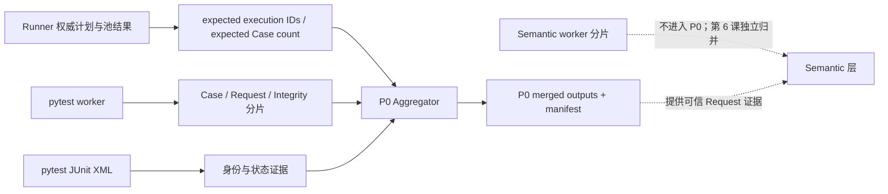
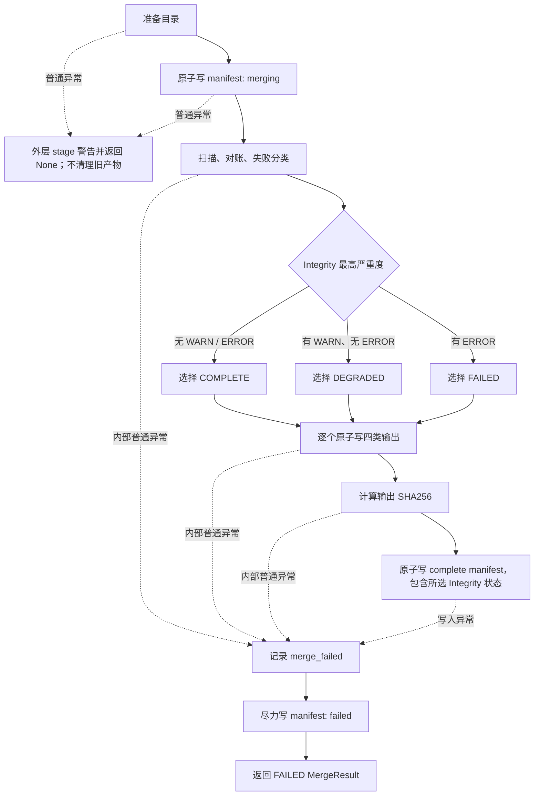

# 第 05 课：Aggregator 与可信账本

> 课时：75 分钟  
> 核心问题：pytest（Python 测试框架）的执行进程 worker（实际执行用例并写原始文件的进程）已经写出文件，为什么还不能直接计算成功率？

> 先看一个具体失真：Runner（框架执行编排器）计划执行 10 个 Case（一次测试用例调用），worker 只留下 9 个且全部通过。直接按现有记录计算会得到 9/9=100%，但第 10 个 Case 没有事实，分母并不可信。

## 0. 先说结论

Aggregator 是“有限信任归并器”，不是文件拼接器，也不是新的测试裁判。

它接收当前运行的身份与期望、多个执行进程写出的原始文件，以及可选的 JUnit（结构化测试报告）证据；然后过滤不属于本轮的数据，校验记录结构，处理重复与冲突，对照预期 Case（一次测试用例调用）数量和 JUnit 身份，派生失败记录，最后提交带完整性状态和哈希证据的 P0（第一阶段归并）基础事实。

这里的关键词是**有限信任**：

```text
文件存在
≠ 文件内容都合法
≠ 文件都属于当前运行
≠ 每个预期执行阶段都留下了事实
≠ Case 数量与 Runner 计划一致
≠ 可以直接作为指标分母
```

Aggregator 能暴露当前实现明确检查到的问题，但不能证明所有 worker、所有 Request 或所有外部文件都没有缺失。因此，准确结论不是“归并后一定可信”，而是：

> P0 输出具有可追溯来源、提交状态和完整性判断；下游必须继续读取这些证据，不能只看文件是否存在。

---

## 1. 先建立最小词汇表

本课不要求预先理解数据工程。下面这些词在第一次进入主流程前统一说明。

| 术语 | 本课含义 |
| --- | --- |
| Aggregator | 汇集并核对多份原始记录的归并器 |
| Runner | 本框架的执行编排器；拥有权威收集计划、执行阶段和最终退出事实 |
| worker | 实际执行 pytest 用例的进程；每个执行进程独立写原始文件 |
| Quality Collector | 把 worker 中观察到的 Case、Request 和 Integrity 追加到原始分片的采集器 |
| JSONL | 一行一个 JSON 对象的文本格式；单行损坏时，其余行仍可能恢复 |
| shard（分片） | 一个 worker 独立写出的 Case、Request 或 Integrity 原始文件 |
| Schema | 一条记录必须满足的字段、类型、枚举和版本合同 |
| JUnit | pytest 可生成的 XML 测试报告；这里用作 Case 身份与状态的外部对账证据 |
| P0 | Aggregator 归并后的 Case、Request、Failure 与 Integrity 基础事实层 |
| manifest | 描述归并版本、来源、数量、状态和哈希的清单文件 |
| Integrity / IntegrityIssue | 对缺失、冲突或不一致的诊断，以及承载该诊断的“完整性问题记录”；严重度分为 info、warn 和 error |
| SHA256 | 根据文件内容计算的摘要；后续重新计算并比较时，可以发现内容变化 |
| 原子写入 | 先完整写临时文件，再一次性替换目标文件，避免读到半行或半个文件 |
| QualityMergeRequest | Aggregator 的输入对象，携带本轮身份、输出目录和可选对账期望 |
| MergeResult | Aggregator 返回给 Pipeline（流水线编排层）的归并摘要；下游阶段不会把它当作事实文件继续传递 |

`run_id` 标识一轮质量运行；`execution_id` 标识 Runner 划分的执行阶段；`case_id` 是稳定用例身份；`invocation_id` 是该用例在本轮的一次具体调用身份；`request_event_id` 标识一次客户端发送事件。

进入代码前再认识三个记录对象：CaseResult 是一次用例调用在某个 pytest 阶段的结果；RequestMetric 是一次客户端发送事件的基础事实；FailureRecord 是由失败 Case 及相关证据派生的失败分类记录，不是第二套测试结论。CaseResult 的 `raw_status` 表示直接观察到的阶段状态，`final_status` 表示供后续折叠使用的有效状态；当前 Collector 创建记录时先把两者写成同一值。

完整性标签也先给出：没有 WARN 或 ERROR 是 COMPLETE；至少有一个 WARN 且没有 ERROR 是 DEGRADED；只要存在 ERROR 就是 FAILED。

### 1.1 本课学习结果

本课结束后，学习者应能：

1. 解释为什么多份 JSONL 不能直接拼接后统计。
2. 说清 Runner 期望、worker 分片和 JUnit 是三类并行输入。
3. 区分 run 过滤、Schema 校验、完全重复与身份冲突。
4. 说明当前实现真正检查了哪些缺失，又没有检查哪些缺失。
5. 区分 `manifest.status` 与 `integrity_status`。
6. 准确描述源分片哈希和输出哈希的生成时点。
7. 解释原子文件写入与整组产物提交为什么不是同一件事。

### 1.2 本课刻意不展开

- 不展开 Semantic（业务归属层）的 Operation、Request Group 和 Polling Session 归并；第 6 课处理。
- 不进入 Metrics（指标层）计算成功率、耗时、Token 或成本；本课先保护指标的事实来源。
- 不展开 Flaky（跨运行不稳定性治理）状态机、SQLite（轻量关系数据库）或跨运行导入；第 7 课处理。
- 不逐字段讲解 CaseResult、RequestMetric 和 FailureRecord。
- 不把 Aggregator 没有实现的 worker 全量检查或源文件预期哈希比对写成现有能力。

### 1.3 75 分钟讲授路线

| 时间 | 内容 | 本段要形成的认识 |
| ---: | --- | --- |
| 0～7 分钟 | 场景与最小词汇 | 原始文件不是可信账本 |
| 7～23 分钟 | 模块级精简教学代码 | 看懂输入如何变成 P0 输出或失败状态 |
| 23～31 分钟 | 第一性原理与约束理论（TOC） | 当前瓶颈从“有没有记录”变成“记录能否被信任” |
| 31～41 分钟 | 扫描、过滤与 Schema | 单行恢复不等于来源完整 |
| 41～51 分钟 | 去重、冲突与预期数量 | 相同记录和相同身份的不同记录必须区别处理 |
| 51～60 分钟 | JUnit 对账与 Failure 派生 | 外部证据用于核对，不覆盖 pytest 事实 |
| 60～72 分钟 | manifest、哈希与双状态 | 提交完成和内容完整是不同维度 |
| 72～75 分钟 | 核心边界与收束 | P0 先可信，业务语义随后建立 |

8.4 节的下游边界代码索引和第 9 节的完整失败矩阵用于课后查阅，不占 75 分钟现场讲授时间。
后文嵌入代码用于在对应结论处回看关键判断，现场只读条件、状态变化和出口；消息拼装与数据字段不逐行讲授。

---

## 2. 模块级精简教学代码：原始账页怎样变成 P0

原实现必须同时解决七个约束：混入其他 run 的记录、单行损坏、Schema 漂移、重复与冲突、执行集合缺失、JUnit 不一致，以及多文件写到一半时的提交可见性。

下面是**教学伪代码**，不是仓库源码的逐行复制。`MergeState` 表示归并期间的内存状态，`SourceStats` 表示一个已发现分片的扫描统计。外层采用 fail-open，即 Quality 归并的普通异常不改写 Runner 的业务执行结论。代码保留真实控制顺序、关键状态和失败出口；省略具体数据类字段、JUnit XML 解析、失败分类规则和文件路径拼装，以免实现细节遮住主线。

```python
# quality Aggregator：从并行输入建立一个有限信任的 P0 账本。
def merge_p0(request):
    state = MergeState(run_id=request.run_id)
    paths = ensure_quality_directories(request.output_dir)
    write_manifest_atomic(state, status="merging", output_hashes={})
    try:
        specs = (
            ("cases", "cases-*.jsonl", CaseResult),
            ("requests", "requests-*.jsonl", RequestMetric),
            ("integrity", "integrity-*.jsonl", IntegrityIssue),
        )
        for kind, pattern, model in specs:
            for shard in sorted(paths.shards.glob(pattern)):
                stats = SourceStats(path=shard, kind=kind, sha256=sha256(shard))
                for line_number, line in non_empty_lines(shard):
                    payload = recover_json_object_or_warn(state, stats, line_number, line)
                    if payload is None:
                        continue
                    if payload.get("run_id") != request.run_id:
                        stats.foreign_run_records += 1
                        continue
                    record = validate_schema_or_warn(state, stats, model, payload)
                    if record is not None:
                        add_by_identity_or_report_conflict(state, stats, record)
                state.sources.append(stats)          # 整个分片扫描返回后才登记
        # 当前只按 Case 分片文件名检查预期 execution，不检查每个 worker 的全部分片。
        for execution_id in request.expected_execution_ids:
            if not has_case_shard_for_execution(state.sources, execution_id):
                state.error("missing_case_shard", execution_id)
        junit = read_junit(request.junit_files, request.run_start_time, state)
        reconcile_cases(state, request.expected_case_count, junit)
        derive_failure_records_or_unknown(state, junit)
        issues = sort_issues((*state.integrity.values(), *state.issues))
        integrity_status = integrity_from_severity(issues)
        outputs = {
            "case-results": sort_cases(state.cases.values()),
            "request-metrics": sort_requests(state.requests.values()),
            "failures": sort_failures(state.failures.values()),
            "integrity-issues": issues,
        }
        for name, records in outputs.items():
            write_jsonl_atomic(paths.merged / f"{name}.jsonl", records)
        # 输出全部写完后才计算输出哈希，再以 complete manifest 提交。
        output_hashes = {
            name: sha256(paths.merged / f"{name}.jsonl")
            for name in outputs
        }
        write_manifest_atomic(state, status="complete", output_hashes=output_hashes)
        return merge_result(state, integrity_status)
    except Exception as error:
        state.error("merge_failed", error)
        try:
            write_manifest_atomic(state, status="failed", output_hashes={})
        except Exception:
            pass
        return merge_result(state, integrity_status=IntegrityStatus.FAILED)
```

Runner 外层 merge stage 以 `try/except Exception` 调用这段主流程：目录准备或初始 `merging` manifest 写入失败时，它打印警告并返回 `None`。骨架有意省略字段级校验、JUnit XML 解析、失败分类规则和路径拼装，但保留了输入、校验、状态、输出与失败出口。

后续代码块优先从这份主骨架抽取；对于骨架中抽象掉的扫描、去重、对账和提交边界，使用保持相同核心语义的最小源码摘录补充证明。局部片段不替代模块级骨架，也不形成第二套实现。

---

## 3. 第一性原理：为什么“文件都在”仍不够

### 3.1 不可再简化的目标

成功率的分母必须回答一个朴素问题：本轮应该出现的 Case，是否都以唯一且可解释的身份进入了统计？

并发执行后，文件数量和用例数量不再等价：

```text
同一轮由多个进程写文件
-> 文件可能缺失、为空、混入旧 run 或只写到一半
-> 同一身份可能重复出现，也可能出现不同内容
-> 单纯拼接无法判断应该保留、忽略还是降级
-> 成功率可能拥有精确小数，却没有可信分母
```

所以 Aggregator 的第一职责不是“算”，而是“建立可审计的输入边界”。

### 3.2 TOC：本课真正的约束是什么

第 3 课已经解决 Runner 的权威集合，第 4 课已经解决旁路采集。此时系统的瓶颈不再是“能否生成记录”，而是：

> 如何把多个只具备局部真实性的账页，转换成带有来源、冲突和缺失状态的统一账本？

如果先做指标，任何后续计算都会继承不明分母；如果先做有限信任判断，即使结果是 DEGRADED 或 FAILED，下游也能知道自己面对的证据上界。

---

## 4. 三类输入并行到达，不是串行加工

### 4.1 真实输入关系



三类输入的所有权不同：

| 输入 | 所有者 | Aggregator 怎样使用 | 不能推出什么 |
| --- | --- | --- | --- |
| `run_id`、预期 execution、预期 Case 数量 | Runner 集成层 | 确定本轮过滤与对账基准 | Aggregator 不因此拥有 pytest 退出码 |
| Case、Request、Integrity 分片 | 各 worker 的 Quality Collector | 恢复当前 run 的基础记录 | 文件存在不等于内容完整 |
| JUnit 文件 | pytest JUnit 产物 | 核对调用身份、折叠后的 Case 状态，并补充失败证据 | JUnit 不覆盖 Runner 或 Case 原始事实 |

### 4.2 框架能力与当前 Runner 接入要分开

`QualityMergeRequest` 这个归并输入对象允许不提供预期 execution、预期 Case 数量或 JUnit 文件。直接调用时若保留默认值，对应检查就不会发生。`@dataclass(frozen=True)` 表示这是不可变的数据类输入合同；`Path` 是文件系统路径，`datetime` 是带时间信息的对象。

```python
@dataclass(frozen=True)
class QualityMergeRequest:
    run_id: str
    output_dir: Path
    expected_execution_ids: tuple[str, ...] = ()
    expected_case_count: int | None = None
    junit_files: tuple[Path, ...] = ()
    run_start_time: datetime | None = None
```

只有权威收集成功且不是 collect-only（只收集、不执行）时，Runner 才创建 Quality 生命周期；随后进入收尾阶段时才会传入：

- 权威收集结果的 Case 数量，即 pytest 收集到的用例标识列表长度；
- 状态不是 `NOT_RUN`（该执行阶段未运行）的执行阶段 ID；
- 这些已执行阶段各自的 JUnit 路径；
- 本轮开始时间，用于识别早于本轮的 JUnit 文件。

pytest 未收集到用例时返回 `PYTEST_EXIT_NO_TESTS_COLLECTED`，它不等于成功；Runner 在创建 Quality 生命周期前就返回，因此不会用 `expected_case_count=0` 调用 Aggregator。参数桥的关键代码如下。在这条参数桥中，`NOT_RUN` 在形成 `executed` 时被排除；`None` JUnit 路径在构造归并请求时过滤。`final_status` 初始为 `FINISHED`；任一池为 ERROR 或 Runner 发生普通异常时改为 `PARTIAL`，收到 `KeyboardInterrupt` / `SystemExit` 时改为 `INTERRUPTED`，随后 `finally` 才把该值交给 Quality 生命周期。`RunStatus` 只是把这个 Runner 生命周期状态转入质量运行记录，不参与 P0 对账判断。最外层捕获还说明：归并异常不会改写 Runner 已经形成的执行结论。

```python
# runner：收集失败和 collect-only 都早于 Quality 生命周期。
if collection.raw_pytest_exit_code != pytest_execution.PYTEST_EXIT_OK:
    final_exit_code = collection.raw_pytest_exit_code
    if not argument_plan.collect_only:
        final_exit_code = _write_execution_result(
            test_path=test_path,
            argument_plan=argument_plan,
            collection=collection,
            pool_results=(),
            final_exit_code=final_exit_code,
        )
    return final_exit_code

cases = collection.cases
case_nodeids = tuple(case.nodeid for case in cases)
if argument_plan.collect_only:
    return pytest_execution.PYTEST_EXIT_OK

quality_run_lifecycle = quality_lifecycle.create_quality_run_lifecycle()
quality_start_time = datetime.now(UTC)
quality_run_lifecycle.prepare(quality_start_time)
pool_results: list[pytest_execution.PoolExecutionResult] = []
final_status = quality_lifecycle.RunLifecycleStatus.FINISHED
try:
    ...  # 真实并行/串行分支把每个池的 PoolExecutionResult 追加到 pool_results。
    if any(
        result.status is pytest_execution.PoolExecutionStatus.ERROR
        for result in pool_results
    ):
        final_status = quality_lifecycle.RunLifecycleStatus.PARTIAL
    ...  # 写 execution-result，并返回合并后的 pytest 退出码。
except (KeyboardInterrupt, SystemExit):
    final_status = quality_lifecycle.RunLifecycleStatus.INTERRUPTED
    raise
except Exception:
    final_status = quality_lifecycle.RunLifecycleStatus.PARTIAL
    return pytest_execution.PYTEST_EXIT_TESTS_FAILED
finally:
    allure_lifecycle.finalize()
    quality_run_lifecycle.finalize(
        start_time=quality_start_time,
        expected_case_count=len(case_nodeids),
        pool_results=tuple(pool_results),
        status=final_status,
    )

# EnabledQualityRunLifecycle.finalize
executed = tuple(
    result
    for result in pool_results
    if getattr(getattr(result, "status", None), "value", None) != "NOT_RUN"
)
finalize_quality_run(
    self._config,
    start_time=start_time,
    expected_execution_ids=tuple(result.stage_id for result in executed),
    expected_case_count=expected_case_count,
    junit_files=tuple(result.junit_path for result in executed),
    status=RunStatus(status.value),
)

# quality_fact_merge_stage.merge_quality_facts
try:
    return merge_quality_run(QualityMergeRequest(
        run_id=str(quality_config.run_id),
        output_dir=quality_config.output_dir,
        expected_execution_ids=expected_execution_ids,
        expected_case_count=expected_case_count,
        junit_files=tuple(path for path in junit_files if path is not None),
        run_start_time=start_time,
    ))
except Exception as error:
    print(f"Quality merge failed open: {type(error).__name__}: {error}")
    return None
```

因此，“Aggregator 具备某项检查”仍不等于“任意调用都提供了该检查所需的期望值”。

---

## 5. 扫描不是全盘相信，而是逐层缩小可信集合

### 5.1 当前只扫描三种基础分片

P0 扫描固定文件模式：

| 类型 | 文件模式 | 合法记录模型 |
| --- | --- | --- |
| Case | `cases-*.jsonl` | CaseResult |
| Request | `requests-*.jsonl` | RequestMetric |
| Integrity | `integrity-*.jsonl` | IntegrityIssue（完整性问题记录） |

Semantic 的 Operation、Request Group 和 Polling Session 分片不在这里扫描。它们有独立归并器，并在下一课使用 P0 Request 作为证据。

### 5.2 每个非空行的真实处理顺序

| 顺序 | 判断 | 当前行为 | 对完整性的影响 |
| ---: | --- | --- | --- |
| 1 | 能否按 UTF-8 JSON 解码 | 失败则记录 `invalid_jsonl_line`，继续下一行 | WARN，通常使结果 DEGRADED |
| 2 | 顶层是否为对象 | 不是对象则记录 `invalid_jsonl_schema` | WARN |
| 3 | `run_id` 是否属于本轮 | 不属于则计入 `foreign_run_records` 并忽略 | 只计数，不自动产生 Integrity |
| 4 | 是否符合对应 Schema | 失败则记录 `invalid_quality_schema` | WARN |
| 5 | 身份是否首次出现 | 首次出现则进入内存账本 | 尚不代表整轮完整 |

JSONL 的价值在这里很具体：一行损坏不会迫使 Aggregator 放弃同一文件中的其他合法行。但“恢复了合法行”不等于“缺失的那一行可以被推断回来”，所以结果必须降级而不能补零。

`ValidationError` 是 Pydantic 模型发现字段、类型或枚举不符合 Schema 时抛出的校验异常。下面的最小源码摘录保留五级判断、计数和 `continue` 的真实顺序；重复的 Integrity 参数改为紧凑排版：

```python
stats = _SourceStats(path=path, kind=kind, sha256=_file_sha256(path))
with path.open("rb") as handle:
    for line_number, raw_line in enumerate(handle, start=1):
        line = raw_line.strip()
        if not line:
            continue
        stats.physical_non_empty_lines += 1
        try:
            payload = json.loads(line.decode("utf-8"))
        except (UnicodeDecodeError, json.JSONDecodeError) as error:
            stats.invalid_json += 1
            state.issue(severity=IssueSeverity.WARN, source="aggregator",
                        code="invalid_jsonl_line", related_id=path.name,
                        message=f"{path.name}:{line_number}: {type(error).__name__}: {error}")
            continue
        if not isinstance(payload, dict):
            stats.invalid_schema += 1
            state.issue(severity=IssueSeverity.WARN, source="aggregator",
                        code="invalid_jsonl_schema", related_id=path.name,
                        message=f"{path.name}:{line_number}: record is not an object")
            continue
        if payload.get("run_id") != state.request.run_id:
            stats.foreign_run_records += 1
            continue
        try:
            record = model.model_validate(payload)
        except ValidationError as error:
            stats.invalid_schema += 1
            state.issue(severity=IssueSeverity.WARN, source="aggregator",
                        code="invalid_quality_schema", related_id=path.name,
                        message=f"{path.name}:{line_number}: {_validation_summary(error)}")
            continue
        stats.current_run_records += 1
        _add_record(state, stats, record)
return stats
```

注意顺序带来的边界：外部 run 在 Schema 校验前被过滤，因此其字段即使不符合当前模型，也只增加 `foreign_run_records`；它不会生成 `invalid_quality_schema`。

### 5.3 source stats 是审计信息，不是完整性证明

每个实际扫描到的分片会在 manifest 中记录：路径、类型、当前 SHA256、非空物理行数、当前 run 记录数、外部 run 记录数、坏 JSON、坏 Schema、完全重复和冲突重复数量。

这里有三个边界：

1. SHA256 在扫描该源文件时按其**当前内容**计算，输入中没有一个预期源哈希与之比较。
2. Aggregator 不锁定所有生产者，也不在读取结束后重新比较源哈希；正常流程假设 worker 已经停止写入。
3. 未被文件模式发现的分片不会拥有 source stats；“清单中没有异常”不能证明未知文件从未缺失。

---

## 6. 去重必须先回答“什么算同一个事实”

### 6.1 三类身份键

| 记录 | 去重键 | 原因 |
| --- | --- | --- |
| CaseResult | `(invocation_id, phase)` | 同一次用例调用可分别拥有 setup、call、teardown 等阶段事实 |
| RequestMetric | `request_event_id` | 一次客户端发送事件只应有一条基础记录 |
| IntegrityIssue | `(source, code, related_id, message)` | 同一来源、问题、关联对象和消息视为同一诊断身份 |

这里的 `phase` 是 pytest 生命周期阶段，例如 setup（准备）、call（测试主体）和 teardown（清理）。

### 6.2 相同重复与冲突重复不是一回事

Aggregator 先把记录转成键排序稳定的规范 JSON，再比较内容：

```text
同一身份第一次出现
-> 保留

同一身份再次出现，规范内容完全相同
-> 折叠，不新增记录
-> exact_duplicates + 1

同一身份再次出现，但内容不同
-> 保留按排序后文件与行顺序先读到的记录
-> conflict_duplicates + 1
-> 产生 ERROR Integrity
```

完全重复可能来自重复汇集，折叠后不必自动降低完整性；冲突重复则意味着同一事实出现两个版本，Aggregator 不能猜哪一个正确，因此输出仍可写完，但 `integrity_status` 会变成 FAILED。

身份键选择和 first-wins（按稳定扫描顺序保留首条）在同一个分支中完成：

```python
if isinstance(record, CaseResult):
    key = (record.invocation_id, record.phase.value)
    target = state.cases
    conflict_code = "case_result_conflict"
elif isinstance(record, RequestMetric):
    key = record.request_event_id
    target = state.requests
    conflict_code = "request_metric_conflict"
else:
    key = (record.source, record.code, record.related_id, record.message)
    target = state.integrity
    conflict_code = "integrity_issue_conflict"

existing = target.get(key)
if existing is None:
    target[key] = record
    return
if _canonical_record(existing) == _canonical_record(record):
    stats.exact_duplicates += 1
    return
stats.conflict_duplicates += 1
state.issue(severity=IssueSeverity.ERROR, source="aggregator",
            code=conflict_code, related_id=str(key),
            message=f"conflicting duplicate record for key {key!r}")

def _canonical_record(record):
    payload = record.model_dump(mode="json") if hasattr(record, "model_dump") else record
    return json.dumps(
        payload, allow_nan=False, ensure_ascii=False,
        sort_keys=True, separators=(",", ":"),
    )
```

代码没有在冲突分支覆盖 `target[key]`，所以首条仍留在账本；ERROR 只把“无法判断真值”显式写入完整性事实。

代码锚点：`quality.aggregator._scan_shard` 证明解码、run 过滤和 Schema 校验顺序；`_add_record` 证明三类身份键及完全重复、冲突重复的分支。它们不证明未发现的 worker 或分片一定不存在。

---

## 7. 对账：把“已收到”与“本应收到”放在一起

### 7.1 预期 execution 检查的真实上界

对每个 `expected_execution_id`，当前实现只检查 source stats 中是否存在文件名包含 `cases-{execution_id}-` 的 Case 分片。不存在时产生 ERROR `missing_case_shard`。

这里检查的是“是否扫描到匹配文件名的 Case source stats”，没有继续检查该分片是否非空或含有本轮合法记录：

```python
for execution_id in state.request.expected_execution_ids:
    if not any(
        stats.kind == "cases"
        and f"cases-{execution_id}-" in stats.path.name
        for stats in state.source_stats
    ):
        state.issue(severity=IssueSeverity.ERROR, source="aggregator",
                    code="missing_case_shard", related_id=execution_id,
                    message=f"no case shard found for expected execution {execution_id}")
```

这个检查能发现“某个预期执行阶段完全没有 Case 文件”，但不能推出：

- 该 execution 的每个 worker 都写出了 Case 分片；
- Case 文件不是空文件；
- 该文件中的记录都合法或都属于当前 run；
- Request 和 Integrity 分片也都存在；
- 每个 execution 内部的 Case 数量分别正确。

这就是“只明确检查预期 execution 的 Case 分片”的准确含义。

### 7.2 Case 数量按 invocation 去重后核对

一个用例调用可能产生多个阶段记录，因此不能直接数 CaseResult 行。Aggregator 取合法、当前 run、去重后的 `invocation_id` 集合，再与 Runner 提供的 `expected_case_count` 比较：

```text
多个阶段记录
-> 按 invocation_id 折叠为本轮调用集合
-> 与 Runner 权威收集数量比较
-> 不一致则产生 ERROR expected_case_count_mismatch
```

如果当前 run 完全没有 CaseResult，还会产生 ERROR `no_case_results`。这两类 ERROR 都会使完整性判断为 FAILED，但不会改写 Runner 的执行结果或 pytest 退出码。

数量对账使用唯一 `invocation_id`，不是 CaseResult 行数：

```python
invocation_ids = {case.invocation_id for case in state.cases.values()}
if not state.cases:
    state.issue(severity=IssueSeverity.ERROR, source="aggregator",
                code="no_case_results", related_id=state.request.run_id,
                message="no CaseResult records found for current run")
if (
    state.request.expected_case_count is not None
    and len(invocation_ids) != state.request.expected_case_count
):
    state.issue(severity=IssueSeverity.ERROR, source="aggregator",
                code="expected_case_count_mismatch", related_id=state.request.run_id,
                message=(f"expected {state.request.expected_case_count} invocations, "
                         f"merged {len(invocation_ids)}"))
```

### 7.3 JUnit 是可选对账证据

只有请求中提供了 JUnit 路径，JUnit 对账才会发生。每个 XML testcase 需要包含 `quality_case_id` 与 `quality_invocation_id` 属性；缺少身份的条目会被警告并跳过。

读取过程还会处理这些情况：

| 情况 | 当前结果 |
| --- | --- |
| 文件不存在 | WARN `junit_file_missing` |
| 文件修改时间早于本轮开始 | WARN `junit_file_stale`，不继续解析该文件 |
| XML 解析失败 | WARN `junit_parse_failed` |
| 缺少质量身份 | WARN `junit_missing_quality_identity` |
| 同一 invocation 对应不同 JUnit 证据记录 | ERROR `junit_identity_conflict` |
| JUnit 身份数与 P0 invocation 数不同 | WARN `junit_case_count_mismatch` |
| JUnit invocation 找不到 CaseResult | WARN `junit_invocation_missing_case_result` |
| 折叠 Case 状态与 JUnit 不兼容 | WARN `junit_status_mismatch` |

以下最小源码摘录保留文件门、身份门、`continue` 位置和实际诊断字段：

```python
file_info = {
    "path": _relative_path(path, state.request.output_dir),
    "exists": path.exists(),
    "cases": 0,
}
if not path.exists():
    state.issue(severity=IssueSeverity.WARN, source="junit",
                code="junit_file_missing", related_id=path.name,
                message=f"JUnit file does not exist: {path}")
    state.junit_files.append(file_info)
    continue

if state.request.run_start_time is not None:
    mtime = datetime.fromtimestamp(path.stat().st_mtime, tz=UTC)
    if mtime < state.request.run_start_time:
        state.issue(severity=IssueSeverity.WARN, source="junit",
                    code="junit_file_stale", related_id=path.name,
                    message=f"JUnit file is older than current run: {path}")
        state.junit_files.append(file_info)
        continue

try:
    cases = parse_junit_file(path)
except Exception as error:
    state.issue(severity=IssueSeverity.WARN, source="junit",
                code="junit_parse_failed", related_id=path.name,
                message=f"{type(error).__name__}: {error}")
    state.junit_files.append(file_info)
    continue

file_info["cases"] = len(cases)
state.junit_files.append(file_info)
for evidence in cases:
    if not evidence.invocation_id or not evidence.case_id:
        state.issue(severity=IssueSeverity.WARN, source="junit",
                    code="junit_missing_quality_identity",
                    message="JUnit testcase is missing quality identity properties",
                    related_id=f"{evidence.classname}.{evidence.name}")
        continue
    existing = state.junit_evidence.get(evidence.invocation_id)
    if existing is not None and existing != evidence:
        state.issue(severity=IssueSeverity.ERROR, source="junit",
                    code="junit_identity_conflict",
                    message=f"multiple JUnit testcases use invocation_id {evidence.invocation_id}",
                    related_id=evidence.invocation_id)
        continue
    state.junit_evidence[evidence.invocation_id] = evidence
```

状态兼容不是字符串完全相等：

- P0 的 failed 或 error 与 JUnit 的 failed 或 error 互相兼容；
- P0 的 skipped 或 xfailed（预期失败）对应 JUnit skipped；
- 其他 P0 状态要求 JUnit passed。

只有请求中至少提供一个 JUnit 路径时，数量和逐 invocation 状态对账才运行；兼容规则也直接体现在代码中：

```python
if state.request.junit_files:
    if len(state.junit_evidence) != len(invocation_ids):
        state.issue(severity=IssueSeverity.WARN, source="junit",
                    code="junit_case_count_mismatch", related_id=state.request.run_id,
                    message=f"JUnit identities={len(state.junit_evidence)}, merged invocations={len(invocation_ids)}")
    for invocation_id, evidence in sorted(state.junit_evidence.items()):
        cases = [
            case for case in state.cases.values()
            if case.invocation_id == invocation_id
        ]
        if not cases:
            state.issue(severity=IssueSeverity.WARN, source="junit",
                        code="junit_invocation_missing_case_result",
                        message=f"JUnit invocation has no CaseResult: {invocation_id}",
                        related_id=invocation_id)
            continue
        expected_status = fold_case_status(cases)
        if not _compatible_status(expected_status, evidence.status):
            state.issue(severity=IssueSeverity.WARN, source="junit",
                        code="junit_status_mismatch", related_id=invocation_id,
                        message=f"CaseResult status {expected_status.value} differs from JUnit {evidence.status.value}")

def _compatible_status(case_status, junit_status):
    if case_status in {CaseStatus.FAILED, CaseStatus.ERROR}:
        return junit_status in {CaseStatus.FAILED, CaseStatus.ERROR}
    if case_status in {CaseStatus.SKIPPED, CaseStatus.XFAILED}:
        return junit_status is CaseStatus.SKIPPED
    return junit_status is CaseStatus.PASSED

def fold_case_status(cases, *, raw=False):
    statuses = {
        case.raw_status if raw else case.final_status
        for case in cases
    }
    if CaseStatus.ERROR in statuses:
        return CaseStatus.ERROR
    if CaseStatus.FAILED in statuses:
        return CaseStatus.FAILED
    if statuses & {CaseStatus.SKIPPED, CaseStatus.XFAILED}:
        return CaseStatus.SKIPPED
    return CaseStatus.PASSED
```

当前实现用 `invocation_id` 找到 CaseResult 并核对状态；虽然要求 JUnit 同时提供 `case_id`，但不会再单独断言该 `case_id` 与已找到的 CaseResult 完全相等。因此，不能把现有 JUnit 对账描述成所有身份字段的一一证明。

代码锚点：`quality.aggregator._read_junit` 证明 JUnit 文件、身份和冲突处理；`_reconcile` 证明去重后的 invocation 数量与兼容状态的实际对账范围。

### 7.4 FailureRecord 是派生证据，不是第二套测试结论

对于 raw 或 final 状态为 failed / error 的 Case 阶段，Aggregator 组合以下证据进行失败分类：

- Case 身份和阶段；
- 可用的 JUnit 错误类型、消息与断言位置；
- 同一 invocation 下的 RequestMetric；
- `related_id` 等于该 `invocation_id` 的 Integrity code。

分类成功后生成 FailureRecord，并把 `failure_id` 写回归并后的 CaseResult 副本。分类器本身抛普通异常时，会产生 WARN `classification_failed`，再生成 UNKNOWN（无法可靠分类）失败记录。

失败派生只处理 raw 或 final 已经是 failed/error 的阶段；分类异常回退 UNKNOWN，但不会删除原 Case 失败事实：

```python
updated_cases: dict[tuple[str, str], CaseResult] = {}
for key, case in state.cases.items():
    if (
        case.raw_status not in {CaseStatus.FAILED, CaseStatus.ERROR}
        and case.final_status not in {CaseStatus.FAILED, CaseStatus.ERROR}
    ):
        updated_cases[key] = case
        continue

    junit = state.junit_evidence.get(case.invocation_id)
    evidence = FailureEvidence(
        run_id=case.run_id,
        case_id=case.case_id,
        invocation_id=case.invocation_id,
        phase=case.phase,
        error_type=junit.error_type if junit is not None else None,
        message=junit.message if junit is not None else case.raw_status.value,
        assert_location=junit.assert_location if junit is not None else None,
        junit_status=junit.status.value if junit is not None else None,
        request_metrics=tuple(sorted(
            requests_by_invocation.get(case.invocation_id, []),
            key=lambda metric: (metric.attempt_index, metric.request_event_id),
        )),
        related_integrity_codes=tuple(
            integrity_codes_by_related.get(case.invocation_id, [])
        ),
    )
    try:
        failure = classify_failure(evidence)
    except Exception as error:
        state.issue(severity=IssueSeverity.WARN, source="classifier",
                    code="classification_failed", related_id=case.invocation_id,
                    message=f"{type(error).__name__}: {error}")
        failure = unknown_failure(evidence, "classification failed")

    failure_key = (failure.failure_id, failure.invocation_id, failure.phase.value)
    existing = state.failures.get(failure_key)
    if existing is None:
        state.failures[failure_key] = failure
    elif _canonical_record(existing) != _canonical_record(failure):
        state.issue(severity=IssueSeverity.ERROR, source="classifier",
                    code="failure_record_conflict", related_id=case.invocation_id,
                    message=f"conflicting FailureRecord for key {failure_key!r}")
    updated_cases[key] = case.model_copy(update={"failure_id": failure.failure_id})
state.cases = updated_cases
```

这个过程没有权力把 pytest 的失败改成通过，也不会改变 Runner 的 `final_exit_code`。它只为后续解释和 Flaky 历史提供稳定的失败证据。

---

## 8. 提交协议：原子文件、输出哈希与 manifest

### 8.1 四类 P0 输出

| 输出 | 内容 | 主要下游用途 |
| --- | --- | --- |
| `case-results.jsonl` | 去重并补充 failure_id 的 CaseResult | 本轮 Case 事实与后续历史 |
| `request-metrics.jsonl` | 去重后的 RequestMetric | Semantic 关联与 Metrics 输入 |
| `failures.jsonl` | 派生的 FailureRecord | 失败解释与 Flaky 结果签名 |
| `integrity-issues.jsonl` | worker 原始 Integrity 与归并生成的诊断 | 判断本轮证据上界 |

每个文件内部先排序，再通过临时文件、刷新磁盘和替换目标路径完成原子写入。这样可以避免读到某一个文件的半成品，但四个文件并不是一个文件系统事务。

单文件原子性来自“同目录临时文件 → flush → `fsync`（请求操作系统把文件内容刷新到存储设备）→ replace”；异常时只清理尚未替换的临时文件：

```python
temporary_path = None
try:
    with tempfile.NamedTemporaryFile(
        mode="w",
        encoding="utf-8",
        newline="\n",
        prefix=f".{target_path.name}.",
        suffix=".tmp",
        dir=target_path.parent,
        delete=False,
    ) as temporary_file:
        temporary_path = Path(temporary_file.name)
        for record in records:
            serialized = json.dumps(
                _to_jsonable(record),
                allow_nan=False,
                ensure_ascii=False,
                separators=(",", ":"),
                sort_keys=True,
            )
            temporary_file.write(serialized)
            temporary_file.write("\n")
        temporary_file.flush()
        os.fsync(temporary_file.fileno())

    os.replace(temporary_path, target_path)
    temporary_path = None
finally:
    if temporary_path is not None:
        temporary_path.unlink(missing_ok=True)
```

函数每次只接收一个 `target_path`，所以不能由这段代码推出四个目标文件共同提交或共同回滚。

### 8.2 manifest 承担整组提交标记

最早的目录准备和 `merging` manifest 写入位于 Aggregator 内层 `try` 之前。目录函数只执行 `mkdir(..., exist_ok=True)`，不会删除上一次留下的 manifest 或 merged 输出：

```python
def ensure_quality_dirs(output_dir):
    root = Path(output_dir)
    shards, merged = root / "shards", root / "merged"
    for directory in (root, shards, merged):
        directory.mkdir(parents=True, exist_ok=True)  # 不清理已有文件
    return QualityDirectoryLayout(root=root, shards=shards, merged=merged)

layout = ensure_quality_dirs(request.output_dir)
manifest_path = layout.merged / "manifest.json"
state = _MergeState(request=request)
_write_manifest(state, manifest_path, status="merging", output_hashes={})

try:                                                # 内层捕获从这里才开始
    _scan_shards(state, layout.shards)
    # 后续 JUnit、对账、分类和写出也位于这个 try 内。
except Exception as error:
    state.issue(severity=IssueSeverity.ERROR, source="aggregator",
                code="merge_failed", related_id=request.run_id,
                message=f"{type(error).__name__}: {error}")
```

一张图同时看清正常提交、内部失败和双状态：



`manifest.status` 回答“整组输出是否已提交”，`integrity_status` 回答“已提交内容可信到什么程度”。所以 `complete + FAILED` 合法：流程成功完成了“发现并报告账本不可信”。最早期 I/O 失败返回 `None`，不会进入内部 `merge_failed` 分支，也不会主动清理已有文件：旧的 `complete` manifest 和旧输出可能继续留盘，初始 `merging` 已成功替换后才发生的更晚失败则可能留下 `merging`。因此 `None` 只说明本次归并没有结果，不能据此断言磁盘为空或现存产物属于本轮。内层失败返回 FAILED MergeResult，failed manifest 仍是尽力写入。

两种状态来自两段独立判断。完整性先按最高问题严重度选择；四个输出写完并计算哈希后，才提交 `complete` manifest。内层异常则追加 `merge_failed`，尽力改写为 `failed`：

```python
def _integrity_status(issues):
    severities = {issue.severity for issue in issues}
    if IssueSeverity.ERROR in severities:
        return IntegrityStatus.FAILED
    if IssueSeverity.WARN in severities:
        return IntegrityStatus.DEGRADED
    return IntegrityStatus.COMPLETE

try:
    all_issues = _sorted_issues((*state.integrity.values(), *state.issues))
    integrity_status = _integrity_status(all_issues)
    outputs = {
        "case-results": _sorted_cases(state.cases.values()),
        "request-metrics": _sorted_requests(state.requests.values()),
        "failures": _sorted_failures(state.failures.values()),
        "integrity-issues": all_issues,
    }
    for name, records in outputs.items():
        write_jsonl_atomic(output_paths[name], records)
    output_hashes = {
        name: _file_sha256(path) for name, path in output_paths.items()
    }
    _write_manifest(
        state, manifest_path, status="complete", output_hashes=output_hashes
    )
    return merge_result(state, integrity_status)
except Exception as error:
    state.issue(severity=IssueSeverity.ERROR, source="aggregator",
                code="merge_failed", related_id=request.run_id,
                message=f"{type(error).__name__}: {error}")
    try:
        _write_manifest(state, manifest_path, status="failed", output_hashes={})
    except Exception:
        pass
    return merge_result(state, integrity_status=IntegrityStatus.FAILED)

# _write_manifest 内：每次写入都重新汇总，故刚追加的 merge_failed 也会进入 failed manifest。
issues = _sorted_issues((*state.integrity.values(), *state.issues))
manifest = {
    "status": status,
    "output_hashes": output_hashes,
    "integrity_status": _integrity_status(issues).value,
    # manifest_version、run_id、来源与计数字段省略。
}
write_json_atomic(manifest_path, manifest)
```

局部摘录复用主骨架的 `merge_result(...)` 教学辅助函数，并只省略 manifest 的版本、来源与计数字段；状态选择、返回分支、输出顺序、哈希时点和异常出口未省略。

### 8.3 哈希证明什么，不证明什么

源分片与输出哈希有不同职责：

| 哈希 | 生成时点 | 当前用途 | 不能证明 |
| --- | --- | --- | --- |
| 源分片 SHA256 | 开始扫描每个已发现分片时 | 在 manifest 中记录当时看到的来源内容摘要 | 没有预期值可比，不能证明来源本来就正确或完整 |
| merged 输出 SHA256 | 四类输出写完之后 | 下游重新计算并比较，发现提交后内容变化 | 不证明数据语义正确，也不是来源认证签名 |
| JUnit 内容 SHA256 | 当前不生成 | manifest 只记录路径、是否存在和解析出的 Case 数 | 无法凭 manifest 复验派生 FailureRecord 时使用的确切 JUnit 内容 |

SHA256 只有在“保存的预期摘要”与“后来重新计算的实际摘要”比较时，才形成防篡改或防意外修改的证据。只计算一个值而不比较，不等于验证。

实际摘要来自重新读取文件字节，而不是复用 manifest 中的字符串：

```python
def file_sha256(path):
    digest = hashlib.sha256()
    with Path(path).open("rb") as handle:
        for chunk in iter(lambda: handle.read(1024 * 1024), b""):
            digest.update(chunk)
    return digest.hexdigest()
```

代码锚点：`quality.aggregator.merge_quality_run` 证明四类输出全部写完后才生成输出哈希并提交 `complete` manifest；`quality.storage.write_jsonl_atomic` 与 `write_json_atomic` 证明的是单文件原子替换，不是四文件事务。

### 8.4 课后查阅：MergeResult 与三个下游不是同一条数据管道

> 本节用于复查真实消费边界，不纳入现场讲授。

这一节是边界索引，不复刻第 6、7 课的消费者实现。判断一个下游是否可信，只追踪四件事：是否进入、验了什么、内部异常怎样结果化、外层怎样 fail-open（失败不阻断主执行）。

| 消费者 | 进入与短路 | 当前来源合同 | 内部失败与外层出口 | 详细课程 |
| --- | --- | --- | --- | --- |
| Pipeline | Quality 开启且有 `run_id`；`MergeResult is None` 时全部停止 | `run.json` 写失败不改变 `MergeResult`，后续入口仍被调用 | `write_final_run_record()` 自己吞掉异常；各阶段另有 wrapper | 本课第 4.2、8.2 节 |
| Semantic | `semantic_enabled` 开启才调用 | 对 P0 只核对 manifest 可解析、run 相同且已提交，以及 Request 文件哈希和逐行模型；另验自身分片与关系 | 目录或初始 manifest 失败落到 wrapper、没有 FAILED 结果；内部失败才返回 FAILED | 第 6 课第 5 节 |
| Metrics | `metrics_enabled` 开启，且 `run_id` 非空 | P0 验 manifest/schema 版本，Semantic 还验 merge 版本；两者只拒绝精确的 `failed`，再验哈希、模型、证据引用和关系 | loader/构建异常返回 FAILED；初始 manifest 等外层异常由 wrapper 记录 | 第 6 课第 6 节 |
| Flaky history/state | history 关闭返回 `None`；state 关闭不写报告 | history 严格核对 P0 Case、Failure、Integrity，再折叠候选；state 只接受 IMPORTED、NOOP、DEGRADED | importer 捕获的错误结果化；未捕获异常使 history 返回 `None`；state 异常只记录 | 第 7 课第 4、8 节 |

Pipeline 只负责编排，不把“调用入口”提升成“下游已经读取 P0”。`MergeResult is None` 闸门与完整参数桥已在第 4.2 节的主链代码中展示，这里不再重复。

Semantic 最关键的是两层异常窗口。目录创建和初始 `merging` manifest 在内部 `try` 之前；四类输出写完后才计算 `output_hashes`：

```python
def merge_semantic_run(request):
    output_dir = Path(request.output_dir)
    merged_dir = output_dir / "semantic" / "merged"
    merged_dir.mkdir(parents=True, exist_ok=True)
    manifest_path = merged_dir / "manifest.json"
    state = _MergeState(request=request)
    _write_manifest(state, manifest_path, status="merging", output_hashes={})

    try:
        _scan_semantic_shards(state, output_dir / "semantic" / "shards")
        _load_p0_evidence(state, output_dir)
        _validate_relationships(state)
        output_paths = semantic_output_paths(merged_dir)
        write_four_semantic_outputs(state, output_paths)
        output_hashes = {
            name: file_sha256(path) for name, path in output_paths.items()
        }
        _write_manifest(
            state,
            manifest_path,
            status="complete",
            output_hashes=output_hashes,
        )
        return _result(state, manifest_path)
    except Exception as error:
        state.issue(
            severity=IssueSeverity.ERROR,
            source="semantic_aggregator",
            code="semantic_merge_failed",
            message=f"{type(error).__name__}: {error}",
            related_id=request.run_id,
        )
        try:
            _write_manifest(
                state,
                manifest_path,
                status="failed",
                output_hashes={},
            )
        except Exception:
            pass
        return _result(state, manifest_path, forced=IntegrityStatus.FAILED)
```

`semantic_output_paths()` 与 `write_four_semantic_outputs()` 只压缩四个固定路径和四次原子写入，不改变分支。`run_semantic_stage()` 在更外层捕获整个调用，因此前置的 `mkdir` 或初始 manifest 写入失败时只记录警告，不会生成 Semantic FAILED 结果。普通完整性问题仍可提交 `status="complete"`，同时由问题集合得到 FAILED 的 `integrity_status`；Semantic 的 P0 子集门不检查 P0 版本或整体完整性状态。

Metrics 的关键不是“又算了一遍哈希”，而是把实际验得的内容、路径和版本一起固化为 `SourceEvidence`。下列片段从两个 manifest 门通过后开始；`requests` 与 `parsed` 均来自逐行模型校验，`p0_request_hash` 和各 `digest` 均来自文件存在性检查、重新计算及 manifest 比较：

```python
p0_manifest_path = output_dir / "merged" / "manifest.json"
request_metrics_path = output_dir / "merged" / "request-metrics.jsonl"
semantic_dir = output_dir / "semantic" / "merged"
semantic_manifest_path = semantic_dir / "manifest.json"
p0_request_hash = validated_source_output_hash(
    request_metrics_path,
    (p0_manifest.get("output_hashes") or {}).get("request-metrics"),
    "p0_request_metrics",
)
requests = tuple(
    read_jsonl_models(
        request_metrics_path,
        RequestMetric,
        "p0_request_metric_invalid",
    )
)
p0_manifest_hash = source_file_sha256(p0_manifest_path)

parsed = {}
semantic_evidence = {}
for name, model in _SEMANTIC_OUTPUT_MODELS.items():
    path = semantic_dir / f"{name}.jsonl"
    digest = validated_source_output_hash(
        path,
        (semantic_manifest.get("output_hashes") or {}).get(name),
        f"semantic_{name.replace('-', '_')}",
    )
    parsed[name] = tuple(
        read_jsonl_models(
            path,
            model,
            f"semantic_{name.replace('-', '_')}_invalid",
        )
    )
    semantic_evidence[name] = ArtifactEvidence(
        path=relative_artifact_path(path, output_dir),
        sha256=digest,
        schema_version=SEMANTIC_SCHEMA_VERSION,
    )

evidence = SourceEvidence(
    p0_manifest=ArtifactEvidence(
        path=relative_artifact_path(p0_manifest_path, output_dir),
        sha256=p0_manifest_hash,
        schema_version=SCHEMA_VERSION,
        manifest_version=P0_MANIFEST_VERSION,
        merge_version=str(p0_manifest.get("merge_version") or "unknown"),
    ),
    p0_request_metrics=ArtifactEvidence(
        path=relative_artifact_path(request_metrics_path, output_dir),
        sha256=p0_request_hash,
        schema_version=SCHEMA_VERSION,
    ),
    semantic_manifest=ArtifactEvidence(
        path=relative_artifact_path(semantic_manifest_path, output_dir),
        sha256=source_file_sha256(semantic_manifest_path),
        schema_version=SEMANTIC_SCHEMA_VERSION,
        manifest_version=SEMANTIC_MANIFEST_VERSION,
        merge_version=SEMANTIC_MERGE_VERSION,
    ),
    semantic_outputs=semantic_evidence,
)
def only(items, model):
    return tuple(item for item in items if isinstance(item, model))

sources = MetricsSources(
    run=run,
    requests=only(requests, RequestMetric),
    groups=only(parsed["request-groups"], RequestGroupRecord),
    sessions=only(parsed["polling-sessions"], PollingSessionRecord),
    operations=only(parsed["operations"], OperationRecord),
    semantic_issues=only(
        parsed["integrity-issues"],
        SemanticIntegrityIssue,
    ),
    p0_integrity_status=p0_integrity_status,
    semantic_integrity_status=semantic_integrity_status,
    evidence=evidence,
)
validate_source_relationships(run_id, sources)
```

`only()` 只压缩源码中的同类 `isinstance` 过滤。P0 的 `merge_version` 来自 manifest，Semantic 的三个版本来自当前消费者常量；所有路径都是相对 `output_dir` 的产物路径。完整门禁、JSONL Schema 与关系规则在第 6 课展开。

Flaky 在本课也只保留边界索引：严格导入链是 P0 run/manifest/哈希/问题集合门 → Case 与 Failure 逐行校验 → 折叠候选并要求 `end_time` → 数据库导入。其正常状态优先级、报告写失败降级和 state wrapper 的 fail-open 见第 7 课；history 或 state 功能关闭时直接返回，不生成对应报告。

---

## 9. 课后查阅：完整失败矩阵

> 本节用于定位具体异常，不纳入现场讲授；现场只保留第 8 节状态图中的三类出口。

| 观察到的情况 | 当前处理 | 完整性影响 | 仍不能保证 |
| --- | --- | --- | --- |
| 外部 run 或完全相同重复 | 忽略外部记录；折叠相同重复并计数 | 本身不降级 | 来源分片整体完整 |
| 坏 JSON 或坏 Schema | 跳过该行并记录 WARN | DEGRADED，除非另有 ERROR | 丢失内容可以还原 |
| 同一身份内容冲突 | 保留先读记录并记录 ERROR | FAILED | 判断哪个版本是真值 |
| execution Case 分片缺失，或 invocation 总数不符 | 记录 ERROR | FAILED | 每个 worker、Request 和 Integrity 分片都完整 |
| JUnit 缺失、陈旧、解析失败或状态不符 | 多数记录 WARN；身份冲突记录 ERROR | DEGRADED 或 FAILED | 所有身份字段都一一匹配，或 JUnit 内容可由哈希复验 |
| 失败分类器异常 | 记录 WARN，并回退 UNKNOWN | DEGRADED | 失败类别已经准确判定 |
| 目录准备或初始 `merging` manifest 写入异常 | 外层记录警告并返回 `None`；不执行清理 | 本次没有 MergeResult | 旧 `complete` manifest 或旧 merged 输出已经消失 |
| 主归并流程未预期异常 | 记录 `merge_failed`，尽力写 failed manifest | FAILED | failed manifest 必然写入成功 |

“跳过坏行继续处理”是可恢复性，不是把错误当成成功。收益是合法事实可保留、冲突与缺失可见、下游能按证据选择；代价是 Schema、manifest、身份键和版本需要长期维护，单文件原子替换也不能提供四文件事务。

Aggregator 适合并行执行、产物需要跨进程汇集并进入指标或历史治理的框架。对于单进程、无派生统计的小型脚本，这套协议可能过重。fail-open 保护 Runner 结论；MergeResult 与后续阶段的准确关系以 8.4 节为准。

---

## 10. 本课收束：可信来自可见边界，不来自“看起来齐全”

本课主线可以压缩为：

```text
Runner 权威期望 ──────────────┐
worker 基础原始分片 ──────────┼─> P0 Aggregator
JUnit 身份与状态证据 ─────────┘

P0 Aggregator
-> 当前 run 过滤与 Schema 校验
-> 相同重复折叠、冲突显式失败
-> execution、Case 数量与 JUnit 有限对账
-> FailureRecord 派生
-> 四类原子输出 + 输出哈希
-> manifest 提交状态 + integrity status
```

最后必须同时记住三句话：

1. 检测到的问题不会无证据进入下游，但 Aggregator 不能保证发现所有 worker 缺失。
2. `manifest.status=complete` 说明归并完成，不说明 `integrity_status` 必然是 COMPLETE。
3. 源哈希是扫描时的记录；merged 输出写完后的哈希，才由下游复算验证。

到这里，框架才拥有带证据边界的 P0 基础账本。下一课将在 P0 Request 事实与独立 Semantic 分片之上恢复 Operation、Request Group 和 Polling Session，再讨论指标为什么必须选择正确的业务粒度。
