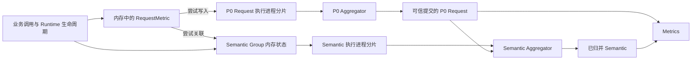
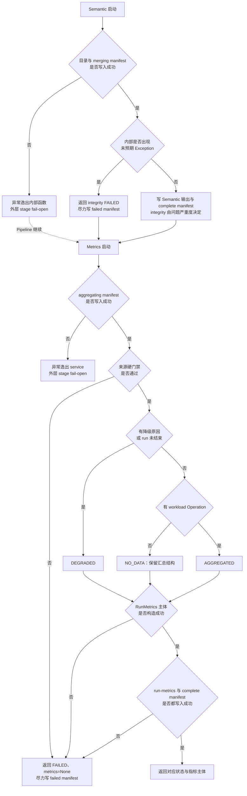

# 第 06 课：Semantic 与业务指标

> 课时：75 分钟  
> 核心问题：为什么统计 HTTP（客户端与服务端交换请求和响应的协议）请求次数，不能回答一次异步图片生成真实花了多久？

> 先看具体场景：用户发起一次异步图片生成。框架先提交创建任务的请求，再连续查询三次状态；第三次查询如果还重试了一次，底层共留下 5 次客户端发送尝试。只说“发送了 5 次”，既不能回答用户等待了多久，也不能区分创建、连续查询和重试分别付出了什么代价。

## 0. 从场景回到最小词汇

| 术语 | 本课含义 |
| --- | --- |
| P0 | 经校验合并后提交的第一阶段基础事实层；本课主要使用其中的 Request 记录 |
| Request Event | 一次客户端发送尝试的 P0 事实，源码记录对象叫 `RequestMetric`；可能得到服务端响应，也可能在发送前后异常 |
| Request Group | 一次逻辑请求意图及其全部 Retry Attempt（重试尝试） |
| Polling Session | 一轮轮询会话，保存多次状态查询、状态序列、睡眠与终态 |
| Operation | 用户关心的一次业务动作，例如一次异步图片生成 |
| Semantic | 恢复业务归属的派生层；每个执行进程先写 Semantic shard（原始分片） |
| Metrics | 在已验证来源上计算出的单轮指标，不是新的业务裁判 |
| Case Invocation | 一个稳定测试用例在本轮的一次具体调用，由 `case_id + invocation_id` 标识 |

## 1. 先说结论

P0 中的 Request Event 是一次客户端发送边界事实；前置处理失败时，它甚至不保证已经真正联网。用户关心的却是“一次图片生成是否完成、总共等了多久、Retry 增加了多少请求和用量”。两者不是同一种事实。

因此，本课有两次必要转换：

```text
可信 P0 Request 事实 + Semantic 执行进程分片
-> Semantic 归并并校验引用关系
-> Operation / Request Group / Polling Session

可信 P0 + 已归并 Semantic
-> Metrics 重新验源
-> Case Invocation / Operation / Request Group / Request Event 四类指标输出
```

Semantic 回答“这些请求属于哪次业务动作”；Metrics 回答“在明确统计层级和分母后，能计算出什么”。Semantic 不是给日志换名字，而是 Metrics 获得正确业务归属的前提。

本课最重要的边界是：

> 没有归属，次数只是流量；没有完整性，平均值只是一个看似精确的数字。

### 1.1 本课学习结果

本课结束后，学习者应能：

1. 解释为什么 Request Event 数量不能代替 Operation 指标。
2. 画出 Operation、Request Group、Polling Session 与 P0 Request Event 的真实关系。
3. 说明 Semantic 如何同时消费自己的分片和 P0 Request 证据。
4. 区分 Metrics 的 Case Invocation、Operation、Request Group、Request Event 四种统计粒度。
5. 区分已确认值为零（known zero）、事实未知（unknown）、无可用样本（no_data）与当前指标不适用（not_applicable）。
6. 说明 Semantic 和 Metrics 在来源失败、降级与无数据时分别怎样收口。

### 1.2 本课刻意不展开

- 不展开 SSE（服务端持续推送事件）的协议终态、消费时序或指标字段；它属于独立扩展课。
- 不进入 Flaky（跨运行不稳定性）历史治理；第 7 课处理。
- 不展开 Reporting（最终报告汇总）或把 Semantic 写成直接报告结论来源。
- 不逐字段复述所有数据模型，也不按源码目录逐文件讲解。
- 不把“框架有字段”写成“当前每条业务路径都一定产生完整值”。

### 1.3 75 分钟讲授路线

| 时间 | 内容 | 本段要形成的认识 |
| ---: | --- | --- |
| 0～6 分钟 | 异步图片场景与词汇 | 请求次数不是业务动作 |
| 6～18 分钟 | 模块级精简教学代码 | 看懂 Semantic 与 Metrics 的连续转换 |
| 18～25 分钟 | 第一性原理与 TOC（约束理论） | 当前约束是归属和分母，不是公式 |
| 25～40 分钟 | Semantic 关系与归并 | P0 和 Semantic 缺一不可 |
| 40～55 分钟 | Metrics 输入门禁与状态 | 可读取不等于可统计 |
| 55～65 分钟 | 四种统计粒度 | 每种粒度回答不同问题 |
| 65～71 分钟 | 零、未知、无数据、不适用 | 缺失绝不能自动变成零 |
| 71～75 分钟 | 所有权、取舍与收束 | 指标必须能回到事实和状态 |

第 5、6 节代码只现场追踪“记录关系问题 → 计算完整性”和“重新验源 → 硬拒绝 → 保存降级原因”两条路径；错误码逐项对照用于课后复核。第 9.1 节的完整失败表与第 9.3 节的启用范围也不占现场讲授时间。

---

## 2. 模块级精简教学代码：从请求事实到业务指标

原实现要同时解决五个约束：Semantic 分片可能损坏或冲突、关系可能悬空、P0 可能被替换、Metrics 可能混入不可统计流量、缺失值可能污染分母。

下面是**教学伪代码**，不是仓库源码的逐行复制。它保留真实依赖、两阶段来源核验、主状态分支、四类指标输出和提交顺序；其中 Semantic 对已知问题记录完整性问题（Integrity）后继续，只有 Metrics 执行硬输入门禁。代码省略 JSONL（每行一个 JSON 对象）解析、字段与类型合同（Schema）的校验细节、排序和路径拼装。

先看 Semantic 阶段：`run_id` 标识一轮运行；`SemanticState` 保存本阶段待归并记录、P0 Request/哈希、问题和来源分片扫描统计（`source_stats`）。Semantic 产物清单（`manifest`）的提交状态区分 `merging`（正在合并）、`complete`（完整提交）和 `failed`（提交失败）；内容完整性状态 `integrity_status` 表示已发现问题的严重度，是另一条独立状态轴。

```python
# 第一阶段：Semantic 同时读取自己的分片和可信提交的 P0 Request 证据。
def merge_semantic(run_id, output_dir):
    state = SemanticState(run_id)
    prepare_semantic_output_dir(output_dir)       # 位于内部 try 之外
    write_semantic_manifest("merging", state, output_hashes={})  # 正在合并
    try:
        scan_semantic_shards(state)              # Group、Session、Operation、诊断
        # 已知的 P0 缺失、坏 manifest、状态或哈希问题：记录 ERROR；
        # Request 集合保持空，已经算出的部分哈希仍可保留。
        load_p0_evidence_or_record_error(state, output_dir)
        # 不把 P0 integrity_status 当门禁；缺失引用会继续成为关系错误。
        validate_semantic_relationships(state, state.p0_requests)
        severities = {issue.severity for issue in state.all_issues}
        if IssueSeverity.ERROR in severities:
            integrity = IntegrityStatus.FAILED
        elif IssueSeverity.WARN in severities:
            integrity = IntegrityStatus.DEGRADED
        else:
            integrity = IntegrityStatus.COMPLETE
        # atomic：单文件完整写入临时文件后替换目标，不代表多文件事务。
        outputs = write_each_semantic_output_atomic(state)
        # complete 表示本阶段输出已完整提交。
        write_semantic_manifest(
            "complete", state, integrity=integrity,
            # SHA256 是用于复核文件内容是否变化的摘要。
            p0_evidence=state.p0_hashes,
            source_shards=source_shard_evidence(state.source_stats, output_dir),
            output_counts=semantic_counts(state, outputs),
            output_hashes=sha256_each(outputs),
        )
        # SemanticResult 保存完整性、各类数量和问题。
        return SemanticResult(integrity, count_by_kind(outputs), tuple(state.all_issues))
    except Exception as error:
        state.error("semantic_merge_failed", error)
        # 尽力把清单标为 failed（提交失败）。
        best_effort_failed_semantic_manifest(error)
        return SemanticResult("failed", current_counts(state), tuple(state.all_issues))
```

再看 Metrics 阶段：`workload` 是真正被测的业务流量，`bucket` 是相同维度对象的指标分桶。Metrics manifest 的提交状态区分 `aggregating`（正在聚合）、`complete`（完整提交）和 `failed`（提交失败）；独立的 `metrics_status` 区分 `aggregated`（正常聚合）、`degraded`（带已知降级）、`no_data`（无业务动作样本）和 `failed`（指标失败）。

```python
# 第二阶段：Metrics 重新读取磁盘证据，不接收内存归并结果。
def aggregate_metrics(run_id, output_dir):
    run_id = run_id.strip()
    if not run_id:
        # 真实 service 在首次写 manifest 前拒绝空身份；异常交给外层 stage。
        raise ValueError("run_id must not be empty")
    # 首次 aggregating（正在聚合）manifest 也在内部 try 之外。
    write_metrics_manifest("aggregating", metrics_status=None)
    try:
        run = require_run_record(run_id)
        p0 = require_p0(commit="complete", versions=("manifest", "schema"),
                        integrity_not="failed", request_hash_matches=True)
        semantic = require_semantic(
            commit="complete", versions=("manifest", "schema", "merge"),
            integrity_not="failed", output_hashes_match=True,
        )
        require_semantic_points_to_current_p0(semantic, p0)
        require_relationship_contract(p0.requests, semantic.records)
        workload = select_workload(semantic.operations, semantic.groups, p0.requests)
        issues, reasons = explain_exclusions_and_gaps(run, p0, semantic)
        status = metrics_status(run.status, len(workload.operations), reasons)
        integrity = MetricsIntegrity(
            p0_integrity_status=p0.integrity_status,
            semantic_integrity_status=semantic.integrity_status,
            issue_count=len(issues),
            error_count=count_severity(issues, "error"),
            warning_count=count_severity(issues, "warn"),
            degraded_reasons=tuple(reasons),
        )
        result = RunMetricsResult(
            run_id=run_id, status=status, generated_at=now(), run_status=run.status,
            source_evidence=current_source_hashes(p0, semantic),
            integrity=integrity, exclusions=workload.exclusions,
            run_metrics=build_run_summary(workload),
            case_invocations=group_by_case_and_invocation(workload),
            operation_buckets=group_operations(workload),
            request_group_buckets=group_request_groups(workload),
            request_event_buckets=group_request_events(workload),
            issues=tuple(issues),
        )
        digest = write_run_metrics_atomic(result)
        write_metrics_manifest(
            "complete", metrics_status=result.status,
            source_evidence=result.source_evidence,
            output_hashes={"run_metrics": digest},
            output_counts=metrics_output_counts(result),
            issues=result.issues,
        )
        # MetricsResult 保存状态、可选指标主体和问题。
        return MetricsResult(status=status, metrics=result, issues=tuple(issues))
    except Exception as error:
        issue = source_or_aggregation_issue(error)
        best_effort_failed_metrics_manifest(issue)
        return MetricsResult(status="failed", metrics=None, issues=(issue,))
```

`metrics_output_counts()` 对四类输出项、workload Operation/Group/Event 和 issues 分别计数；主骨架没有省略这些计数的提交，只压缩了重复的字典字段。

最后看外层 `fail-open`（故障开放）包装：它隔离普通观察异常，不反向改变业务、pytest（Python 测试框架）或 Jenkins（持续集成流水线）结论。

```python
def finalize_quality_semantics(run_id, output_dir):
    # 外层 stage 对两个模块分别 fail-open；Semantic 失败不阻止 Metrics 自行验源。
    for stage in (merge_semantic, aggregate_metrics):
        try:
            stage(run_id, output_dir)
        except Exception as error:
            warn_without_changing_business_result(stage, error)
```

后续代码块分为两类：一类从主骨架抽取，另一类是保持真实核心语义的**教学重构代码**。跨真实函数拼接、压缩重复字段或使用教学 helper 时，会注明真实宿主函数；它们不是仓库源码的逐行摘录。

为避免把教学 helper 误认成生产接口，后文代码按宿主模块分组：第 4 节对应 `quality.request_metrics`；第 5 节对应 `quality.semantic_aggregator` 与 `quality.semantic_collector`；第 6 节对应 `quality.metrics.sources/validation/builder/service`；第 7～8 节除 Operation 原始计时来自 `quality.semantic_collector` 外，其余对应 `quality.metrics` 下的 `case`、`operation`、`request_group`、`request_event` 与 `primitives`。除明确写明“真实调用片段”的地方外，均按教学重构理解。

这段代码最值得记住的不是函数名，而是三个设计动作：

1. Semantic 先恢复关系，但不凭空创造 Request 事实。
2. Metrics 再次验证来源，而不是把上一步返回值当成可信通行证。
3. 指标同时保存状态、排除项和来源证据，不能只留下一个平均值。

---

## 3. 第一性原理：指标首先是一条可解释的映射

### 3.1 不可再简化的目标

一个指标至少需要四样东西：

```text
指标 = 明确对象 + 可信观察 + 合法分母 + 缺失语义
```

只保留 HTTP 次数时，“明确对象”已经丢失。一次创建、三轮 Polling（轮询）和一次 Retry 都表现为请求，但它们承担的业务责任不同。

以本课场景为例：

```text
异步图片 Operation
├─ 创建任务 Request Group
│  └─ Request Event：POST
└─ Polling Session
   ├─ 查询 Request Group 1
   │  └─ Request Event：GET
   ├─ 查询 Request Group 2
   │  └─ Request Event：GET
   └─ 查询 Request Group 3
      ├─ Request Event：GET，首次失败
      └─ Request Event：GET，Retry 后成功
```

因此，5 个 Event、4 个 Group、1 个 Polling Session 和 1 个 Operation 都正确，但回答的是四类不同问题。

### 3.2 因果链：为什么简单计数会失真

```text
把每次 HTTP 发送当成同一种样本
-> 创建、轮询、Retry 的责任被抹平
-> 用户等待时间被拆成互不相干的请求耗时
-> Retry 次数进入业务动作分母
-> 成功率、平均耗时和用量无法解释
```

修复顺序也必须反过来：先恢复归属，再校验来源，最后计算指标。

### 3.3 TOC：本课真正的约束是什么

TOC（约束理论）要求先找限制系统目标的最窄环节。P0 已经解决“请求事实是否可追溯”，此时最大的约束不再是缺少更多计数器，而是：

> 一次发送事实尚未稳定映射到一次业务动作，分母没有业务含义。

如果越过这个约束直接增加公式，只会更快地产生更多错误结论。因此本课先讲 Semantic，再讲 Metrics；不能倒置。

---

## 4. 事实来源：P0 与 Semantic 分片是并行原料

### 4.1 真实依赖图



基础 Request 写入与 Semantic 关联都从已经构造的内存 `RequestMetric` 出发。它们不是“先成功写 P0，再允许 Semantic 观察”的串行链。

这会产生一个重要边界：基础 Request 分片写入失败后，Semantic 分片仍可能留下对该 Event 的引用。运行时不伪造成功；Semantic 归并随后会把“引用指向缺失 P0 Request”记录为完整性错误。

`quality.request_metrics.record_response()` 与 `record_exception()` 的真实尾部调用没有用 P0 写入的布尔返回值控制 Semantic 观察；两条写入各自 fail-open：

```python
# record_response() 与 record_exception() 构造出同一个 metric 后：
collector.record_request(metric)  # 写失败返回 False，但这里不作门禁
_observe_semantic(context, metric)

def _observe_semantic(context, metric):
    try:
        observe_request_metric(context, metric)
    except Exception:
        return
```

因此叙事上可以先讲 P0、再讲 Semantic，依赖上却不能画成“P0 写成功 → 才允许 Semantic 写”。

### 4.2 为什么 Semantic 不能只读自己的分片

Semantic 分片保存关系声明，例如“这个 Group 包含 Event A、B”。P0 Request 保存发送边界事实，例如状态码、耗时、业务状态和用量。

```text
只有 Semantic：知道 A、B 属于同一组，但无法证明 A、B 真实存在
只有 P0：知道 A、B 发生过，但不知道它们属于哪次 Retry 或业务动作
两者一致：才有可解释的业务归属
```

---

## 5. Semantic：恢复关系，不改写上游事实

### 5.1 三个对象各自拥有哪段语义

| 对象 | 当前记录的核心事实 | 它不拥有的事实 |
| --- | --- | --- |
| Request Group | Attempt Event 列表、次数、首尾传输结果、首尾状态码、Retry 等待、完整性 | pytest Case 结论 |
| Polling Session | 查询 Group 列表、轮数、状态序列、睡眠、轮询终态、完整性 | 创建任务 POST 的成功结论 |
| Operation | 所属 Group 与 Session、业务终态、总耗时、用量、证据引用、完整性 | 原始 HTTP 响应或 pytest 退出码 |

Retry Attempt 归入同一个 Request Group；每轮 Polling 查询形成一个 Group；创建 Group 与 Polling Session 再归入同一个异步 Operation。Polling Session 是必要关系对象，但当前 Metrics 不单独生成 Polling Session 指标：它参与来源关系校验，已写入 Operation 的轮询耗时再由 Operation 指标聚合。

### 5.2 归并怎样验证“关系是真的”

Semantic Aggregator 先扫描 Group、Session、Operation 和 Integrity（完整性问题）四类分片，过滤其他 run，做 Schema（字段与类型合同）校验，并区分完全重复和身份冲突。随后它加载 P0 Request，再检查：

- 对每个 Group：它指向的 Operation 是否存在、Operation 是否列出该 Group，以及双方 `invocation_id` 是否一致。
- 对 Group 列出的每个 Event：P0 Event 是否存在、`invocation_id` 是否一致。
- 同一个 Event 是否被多个 Group 占有，Attempt 序号是否连续。
- 对每个 Session：Operation 是否存在并列出该 Session；Session 列出的 Group 是否存在，且 Group 的 Session、Operation 与 invocation 引用是否一致。
- 对 Operation 列出的每个 Group/Session：目标是否存在，Operation 与 invocation 引用是否一致；一个 Group 不能被多个 Operation 占有。
- 对 `usage.source_request_event_ids`：Event 是否属于该 Operation，且没有被多个 Operation 占有。
- 异步 Operation 是否至少同时具有 Group 和 Polling Session 引用。

下面是对真实宿主函数 `quality.semantic_aggregator._validate_relationships()` 的教学重构。`record_error()` 在条件为假时追加 ERROR 后继续；`claim_once()` 用 `setdefault` 记录首个 owner，遇到不同 owner 时记录 ERROR。代码保留四类关系的决定性条件，压缩重复的 source/message 字段：

```python
event_owner = {}
for group in state.request_groups.values():
    operation = state.operations.get(group.operation_id)
    record_error(operation is not None, "group_operation_missing", group.operation_id)
    check_group_operation_backref(group, operation, record_error)
    metrics = []
    for event_id in group.attempt_event_ids:
        claim_once(event_owner, event_id, group.request_group_id,
                   "request_event_multiple_groups")
        metric = state.p0_requests.get(event_id)
        record_error(metric is not None, "request_event_missing", event_id)
        if metric is not None:
            metrics.append(metric)
            record_error(metric.invocation_id == group.invocation_id,
                         "group_event_invocation_mismatch", group.request_group_id)
    indexes = [metric.attempt_index for metric in metrics]
    record_error(
        not indexes or indexes == list(range(1, len(metrics) + 1)),
        "attempt_index_sequence_invalid",
        group.request_group_id,
    )
    record_error(
        group.final_request_event_id in group.attempt_event_ids,
        "final_request_event_invalid",
        group.request_group_id,
    )

for session in state.polling_sessions.values():
    operation = state.operations.get(session.operation_id)
    record_error(operation is not None, "polling_operation_missing", session.operation_id)
    check_session_operation_backref(session, operation, record_error)
    for group_id in session.request_group_ids:
        check_session_group_link(session, state.request_groups.get(group_id), record_error)

group_owner, usage_owner = {}, {}
for operation in state.operations.values():
    operation_event_ids = event_ids_from_existing_groups(operation, state.request_groups)
    for group_id in operation.request_group_ids:
        claim_once(group_owner, group_id, operation.operation_id,
                   "request_group_multiple_operations")
        check_operation_group_link(operation, state.request_groups.get(group_id), record_error)
    for session_id in operation.polling_session_ids:
        session = state.polling_sessions.get(session_id)
        check_operation_session_link(operation, session, record_error)
    if operation.operation_kind is OperationKind.ASYNC_TASK:
        has_both = bool(operation.request_group_ids and operation.polling_session_ids)
        record_error(has_both, "async_operation_incomplete", operation.operation_id)
    if operation.completeness is RecordCompleteness.INCOMPLETE:
        record_warn("operation_incomplete", operation.operation_id)
    for event_id in operation.usage.source_request_event_ids:
        record_error(event_id in operation_event_ids, "usage_event_outside_operation", event_id)
        claim_once(usage_owner, event_id, operation.operation_id,
                   "usage_event_multiple_operations")
```

这里的 `metrics` 只收集实际找到的 P0 Event，因此 Attempt 连续性也只在这些 Event 上检查。Semantic 当前只要求 final Event 属于 Attempt 列表，并不要求它是列表最后一项。其余教学 helper 的合同如下，名字不替代条件：

| helper | 精确判断范围 |
| --- | --- |
| `check_group_operation_backref` | Operation 存在时，它必须反向列出该 Group，且双方 `invocation_id` 相同 |
| `check_session_operation_backref` | Operation 存在时，它必须反向列出该 Session，且双方 `invocation_id` 相同 |
| `check_session_group_link` | Group 必须存在；其 `polling_session_id`、`operation_id`、`invocation_id` 必须分别匹配当前 Session |
| `event_ids_from_existing_groups` | 只合并 Operation 所引用且实际存在的 Group 的全部 Attempt Event ID |
| `check_operation_group_link` | Group 必须存在；其 `operation_id`、`invocation_id` 必须匹配当前 Operation |
| `check_operation_session_link` | Session 必须存在；其 `operation_id`、`invocation_id` 必须匹配当前 Operation |

这里特意没有把 Semantic 写成硬门：这些分支记录问题并继续归并，最终由问题严重度决定内容完整性。SSE 完成证据另有专用校验，但其算法留给扩展课；本课不展开。当前实现也不额外补做下段所述的 `Group.polling_session_id → Session` 全量反查。

这不是任意字段的全量双向等价检查。当前 Semantic 归并不会专门反查“某个 Group 只要填写了非空 `polling_session_id`，该 Session 就必须存在并反向列出它”，也没有比较所有关联记录的每个身份字段。它还不检查 `usage.missing_request_event_ids`；后续 Metrics 才把已知和缺失两类 usage Event ID 一起核验是否存在于 P0、是否属于该 Operation，以及是否被多个 Operation 占有。

关系错误生成 `SemanticIntegrityIssue`（Semantic 完整性问题记录），但“发现错误”不等于“文件提交失败”。只要输出写入成功，Semantic manifest 仍可以是：

```text
status = complete
integrity_status = FAILED
```

前者表示整组 Semantic 输出已经提交，后者表示提交的内容包含不可忽略的关系错误。

真实宿主函数 `_integrity_status()` 的三个分支已经在主骨架展开：ERROR 优先得到 FAILED，其次 WARN 得到 DEGRADED，无问题才是 COMPLETE。`_SourceStats.as_manifest()` 则把每个来源分片转成以下证据；主骨架再把它与四类输出计数、P0 evidence 和输出哈希一起交给 `_write_manifest()`：

| 分片证据 | 写入内容 |
| --- | --- |
| 身份与内容 | 相对路径、分片类型、实际 SHA256 |
| 扫描范围 | 非空物理行、去重前通过解析与 Schema 校验的本轮记录、其他 run 记录 |
| 无效数据 | 非法 JSON、Schema 不合法 |
| 重复数据 | 完全重复、同身份内容冲突 |

于是 COMPLETE、DEGRADED 或 FAILED 不只是一个标签，还能追溯到读过哪些分片、识别多少条去重前的有效本轮记录，以及发现多少坏行或冲突。

### 5.3 Semantic 对 P0 的信任上界

当前 Semantic 归并明确核验：P0 manifest 存在且可解析、`run_id` 相同、提交状态为 `complete`、Request 输出存在且 SHA256 匹配，以及每条 RequestMetric 满足 Schema。

这里的“核验”不是统一的异常门禁：上述多数已知失败会向 state 记录 ERROR 后返回，主流程仍继续关系校验和输出提交；单条坏 RequestMetric 也会记录错误后继续读取其他行。

这组“记录后继续”的分支不能只藏在 `load_p0_evidence_or_record_error()` 名字里。下面先显式判断文件存在，再在解析前保存实际哈希；教学 helper `read_json_or_record()` 捕获 JSON 读取或解析失败，`model_validate_or_record()` 捕获单行 JSON/Schema 错误，二者都记录 ERROR 并返回 `None`：

```python
if not manifest_path.exists():
    p0_error("p0_manifest_missing")
    return
state.p0_manifest_sha256 = _file_sha256(manifest_path)
manifest = read_json_or_record(
    manifest_path, invalid="p0_manifest_invalid"
)
if manifest is None:
    return
wrong_identity = manifest.get("run_id") != state.request.run_id
if wrong_identity or manifest.get("status") != "complete":
    p0_error("p0_manifest_untrusted")
    return
if not requests_path.exists():
    p0_error("p0_request_metrics_missing")
    return

actual_hash = _file_sha256(requests_path)
state.p0_request_metrics_sha256 = actual_hash
expected_hash = (manifest.get("output_hashes") or {}).get("request-metrics")
if expected_hash != actual_hash:
    p0_error("p0_request_metrics_hash_mismatch")
    return

with requests_path.open("r", encoding="utf-8") as handle:
    for line in handle:
        if not line.strip():
            continue
        metric = model_validate_or_record(
            RequestMetric, line, "p0_request_metric_invalid"
        )
        if metric is None:
            continue
        if metric.run_id == state.request.run_id:
            keep_or_record_conflict(state.p0_requests, metric)
```

`p0_error()` 只追加 Semantic ERROR；`keep_or_record_conflict()` 保留首条相同身份记录，并在内容冲突时记录 ERROR。它们都不抛出“停止整个归并”的门禁异常。

它**不读取 P0 的 `integrity_status` 作为门禁**。因此不能把 Semantic 描述成“只接受 P0 COMPLETE”。Semantic manifest 会记录它实际读取的 P0 manifest 哈希和 Request 输出哈希，供 Metrics 再次核对。

上面的教学重构对应 `quality.semantic_aggregator._load_p0_evidence()` 与 `_validate_relationships()`；完整提交顺序仍以第 2 节模块骨架为主线。

### 5.4 完整与准确不是同一个词

这里的 completeness 指“完整程度”。Semantic Collector（在执行进程内收集业务关系并写原始分片的采集器）的 Record completeness 只有 `complete` 与 `incomplete`；Usage completeness 还区分 `complete`、`partial`、`missing`、`not_applicable`；Timing completeness 区分 `complete`、`partial`、`missing`。

例如异步 Operation 只有同时取得创建请求耗时和 Polling 总耗时，当前 timing 才是 complete。缺一项时应是 partial，而不是把缺失项补成 0。

Operation 的 Semantic 终态也只属于观察层：当前实现有 RequestMetric 证据时，可以把原先的成功观察校正为 FAILED；它只修改 `OperationRecord.outcome`，不改业务响应、pytest 结果或 P0 Request。

下面的教学重构来自两个真实宿主：终态校正在 `quality.semantic_collector.SemanticCollector.finish_operation()` 中完成；异步 timing 的完整性由 `quality.semantic_collector._build_operation_timing()` 判断。终态校正只发生在构造派生的 `OperationRecord` 之前。

```python
if outcome is OperationOutcome.SUCCESS and operation.metrics:
    final_metric = operation.metrics[-1]
    if (
        final_metric.status_code is None
        or not 200 <= final_metric.status_code < 300
        or final_metric.business_status is BusinessStatus.FAILED
    ):
        outcome = OperationOutcome.FAILED

if operation.kind is OperationKind.ASYNC_TASK:
    timing_complete = (
        operation.create_request_ms is not None
        and operation.polling_total_ms is not None
    )
```

第二个条件说明异步 timing 的 complete 需要创建请求与 Polling 两段都存在；缺一段是 partial，不会补零。

---

## 6. Metrics：重新验源后才允许计算

### 6.1 为什么不能直接接收内存归并结果

Pipeline（运行结束后的质量处理链）依次调用 Semantic 和 Metrics，但 Metrics 不接收前一步的内存结果。它重新读取磁盘产物，因为真正要信任的是已提交证据，而不是“某个函数曾经执行过”。

Metrics 的输入门禁包括：

1. `run.json` 属于当前 run。
2. P0 已提交，`manifest_version` 与 `schema_version` 受支持，完整性不是 FAILED，Request 输出哈希一致；P0 `merge_version` 只进入证据记录，不是当前门禁。
3. Semantic 已提交，`manifest_version`、`schema_version` 与 `merge_version` 都受支持，完整性不是 FAILED；四类输出哈希一致，且其中保存的两个 P0 哈希仍指向当前 P0。
4. 所有记录满足 Schema，Event、Group、Session、Operation 的引用再次满足 Metrics 来源合同。

下面是对真实宿主函数 `quality.metrics.sources.load_sources()` 的教学重构。`require_fields()` 逐项比较预期字段并按首个不匹配字段拒绝；P0 预期 `run_id + complete + manifest/schema version`，Semantic 还要求 merge version。`verified_output()` 先要求路径存在且为普通文件，再计算实际 SHA256；预期值不是字符串或与实际值不同时拒绝，否则返回实际哈希。上述已知合同失败会映射为 `MetricsSourceError`；但哈希读取发生 `OSError` 时不会在这里包装，而会越过来源加载并由 Metrics service 归为 `metrics_aggregation_failed`：

```python
run = read_model(run_path, RunRecord, "run_record_invalid")
require(run.run_id == run_id, "run_id_mismatch")
p0_manifest = read_json_object(p0_manifest_path, "p0_manifest_invalid")
require_fields(p0_manifest, p0_contract(run_id), "p0")
p0_integrity = str(p0_manifest.get("integrity_status") or "unknown")
require(p0_integrity != IntegrityStatus.FAILED.value, "p0_integrity_failed")
p0_hashes = p0_manifest.get("output_hashes") or {}
p0_request_hash = verified_output(request_metrics_path,
                                  p0_hashes.get("request-metrics"),
                                  "p0_request_metrics")
requests = tuple(read_jsonl_models(
    request_metrics_path, RequestMetric, "p0_request_metric_invalid"
))

semantic_manifest = read_json_object(semantic_manifest_path, "semantic_manifest_invalid")
require_fields(semantic_manifest, semantic_contract(run_id), "semantic")
semantic_integrity = str(semantic_manifest.get("integrity_status") or "unknown")
require(semantic_integrity != IntegrityStatus.FAILED.value, "semantic_integrity_failed")
p0_manifest_hash = source_file_sha256(p0_manifest_path)
semantic_p0 = semantic_manifest.get("p0_evidence") or {}
require(semantic_p0.get("manifest_sha256") == p0_manifest_hash,
        "semantic_p0_manifest_evidence_mismatch")
require(semantic_p0.get("request_metrics_sha256") == p0_request_hash,
        "semantic_p0_request_evidence_mismatch")
```

`p0_contract()` 展开为 `run_id + complete + manifest/schema version`；`semantic_contract()` 还增加 merge version。`FAILED.value` 对应 JSON 字面值 `"failed"`：当前实现只拒绝这个精确值，缺失或未知值会继续并成为降级原因。P0 的动态 `merge_version` 不参与门禁，但进入证据。

四类 Semantic 输出逐文件走同一个 `verified_output()`，随后逐行按各自模型解析。已验证的实际值不能丢失，必须进入 `MetricsSources`：

```python
parsed, semantic_hashes = {}, {}
for name, model in _SEMANTIC_OUTPUT_MODELS.items():
    path = semantic_dir / f"{name}.jsonl"
    expected = (semantic_manifest.get("output_hashes") or {}).get(name)
    prefix = f"semantic_{name.replace('-', '_')}"
    semantic_hashes[name] = verified_output(path, expected, prefix)
    code = f"semantic_{name.replace('-', '_')}_invalid"
    parsed[name] = tuple(read_jsonl_models(path, model, code))

evidence = build_source_evidence(
    p0_manifest=(p0_manifest_path, p0_manifest_hash, p0_manifest),
    p0_requests=(request_metrics_path, p0_request_hash),
    semantic_manifest=(semantic_manifest_path, semantic_manifest),
    semantic_outputs=(semantic_dir, semantic_hashes))
sources = assemble_typed_metrics_sources(
    run, requests, parsed,
    p0_integrity_status=p0_integrity, semantic_integrity_status=semantic_integrity,
    evidence=evidence)
```

这里的 `build_source_evidence()` 是教学 helper：真实 `SourceEvidence` 对 P0 manifest 保存相对路径、实际哈希、schema/manifest 版本和动态 merge version；对 P0 Request 保存路径、哈希和 schema；对 Semantic manifest 保存路径、实际哈希及三种固定版本；对四类 Semantic 输出分别保存路径、实际哈希和 schema。四类 JSONL 任一坏行都会抛来源错误，不会像 Semantic 那样跳过后继续。

Metrics 的关系合同比 Semantic 当前归并更严格。下面是对真实宿主函数 `quality.metrics.validation.validate_source_relationships()` 的教学重构；`require()` 条件失败便立即抛 `MetricsSourceError`。`unique_index()` 逐项建索引并拒绝重复身份，不会像普通字典那样覆盖旧值：

```python
events = unique_index(
    sources.requests, lambda item: item.request_event_id, "request_event_duplicate"
)
groups = unique_index(
    sources.groups, lambda item: item.request_group_id, "request_group_duplicate"
)
sessions = unique_index(
    sources.sessions, lambda item: item.polling_session_id, "polling_session_duplicate"
)
operations = unique_index(
    sources.operations, lambda item: item.operation_id, "operation_duplicate"
)
records = (*sources.requests, *sources.groups, *sources.sessions, *sources.operations)
for record in records:
    require(record.run_id == run_id, "foreign_run_record")

event_owner, group_owner, session_owner, usage_owner = {}, {}, {}, {}
for group in sources.groups:
    validate_group_and_events(group, events, operations, event_owner)
for operation in sources.operations:
    validate_operation_links_and_usage(
        operation, events, groups, sessions,
        group_owner, session_owner, usage_owner,
    )
require(set(groups) == set(group_owner), "request_group_unassigned")
for session in sources.sessions:
    validate_session_links_and_owner(session, groups, operations)
```

三个教学 helper 的判断范围不是黑盒：

| helper | 必须成立的源码条件 |
| --- | --- |
| `validate_group_and_events` | Group 的 Operation 存在并反向列出 Group；final Event 是 Attempt 列表末项；Event 存在且只有一个 Group owner；Attempt 序号连续；run、Case、invocation、接口四字段一致；Group 首尾传输结果和状态码等于 Event 证据 |
| `validate_operation_links_and_usage` | Operation 引用的 Group/Session 存在且双向身份一致；Group/Session owner 唯一；known 与 missing usage ID 不重叠；usage Event 存在、位于该 Operation 且 owner 唯一 |
| `validate_session_links_and_owner` | Session 有且仅有一个反向列出它的 Operation；其 Group 存在，且 Session、Operation、run、Case、invocation 身份一致 |

表中任一条件失败都会立即拒绝整个 Metrics 来源；这与 Semantic 的“记录问题后继续归并”不同。重复异常消息和 `related_id` 构造未展开。

任何一项硬门禁失败，本轮返回的 MetricsResult 为 FAILED，且 `metrics=None`。这不保证磁盘上没有旧文件，或没有本轮已完整写出但尚未由 `complete` manifest 提交的新文件；只有 `complete` manifest 及其匹配哈希才能证明指标主体已可信提交。

上面的教学重构对应 `quality.metrics.sources.load_sources()` 与 `quality.metrics.validation.validate_source_relationships()`；它们补充第 2 节骨架中的来源门，不另建一条执行主线。

### 6.2 FAILED、DEGRADED、NO_DATA、AGGREGATED



图中的 FAILED 描述返回结果和可信提交，不描述磁盘物理文件一定不存在。来源门禁失败不会主动删除旧指标；若新 `run-metrics.json` 已写入而最终 complete manifest 提交失败，新文件也可能残留。下游必须同时看到 complete manifest 和匹配哈希，才能消费该文件。

提交顺序不再重复一遍代码，直接回看第 2 节 `aggregate_metrics()`：初始 `aggregating` manifest 位于内部 `try` 之前；内部依次加载来源、构造主体、原子写主体、最后写 `complete` manifest。内部任一步失败都尽力写 `failed` manifest，并返回 `metrics=None`；`complete` manifest 尚未提交时，磁盘上的主体不能被视为可信结果。

P0 manifest 缺失、不可解析、状态不可信，或 Request 文件缺失/哈希不符，属于 Semantic 已知问题路径：记录 ERROR、保持空的 P0 Request 集合并保留已取得的部分哈希，然后继续关系校验，最终通常是 `complete + FAILED`，而不是图中的内部异常分支。

状态判断先看 degraded，再看是否有 workload Operation。因此“运行未结束且没有 Operation”是 DEGRADED，不是 NO_DATA。

这一优先级直接来自 `quality.metrics.builder.metrics_status()`，而不是图示自行约定：

```python
def metrics_status(run_status, workload_operation_count, degraded_reasons):
    if degraded_reasons or run_status is not RunStatus.FINISHED:
        return RunMetricsStatus.DEGRADED
    if workload_operation_count == 0:
        return RunMetricsStatus.NO_DATA
    return RunMetricsStatus.AGGREGATED
```

`degraded_reasons` 不是状态判断后的临时变量。第 2 节主骨架把 P0/Semantic 完整性状态、问题总数、ERROR/WARN 数量和完整的 `degraded_reasons` 一并写入 `MetricsIntegrity`，再放入指标主体；因此仅由“run 未结束”或上游 DEGRADED 引起的降级，也不会失去解释证据。

P0 或 Semantic 为 DEGRADED 时，Metrics 可以继续读取，但最终 Metrics 会记录相应降级原因。P0 或 Semantic 为 FAILED 时则被门禁拒绝。这正是“有限信任”而不是“一刀切相信”或“一律丢弃”。

NO_DATA 只断言“没有 workload Operation 且没有更优先的降级原因”。Operation 与 Group 分别按自身 `traffic_role` 筛选，Event 没有该字段，而是跟随所属 Group；来源合同不比较 Operation 与 Group 的角色是否一致。所以在角色异常但仍通过门禁的数据中，NO_DATA 仍可能带有 Group/Event 汇总。只有角色一致的正常数据才通常表现为三者都空。

### 6.3 什么会被排除，什么会触发降级

Metrics 只把 `workload` Operation、Group 及其 Event 放入业务指标。当前还会显式保存这些排除项：

- `control`：辅助检查流量，不进入 workload 分母。
- `unknown`：无法可靠判断流量角色，排除并触发降级。
- unassigned Event：有 P0 Request，但没有 Semantic Group 归属，排除并触发降级。
- usage not_applicable：该 Operation 的用量指标不适用，单独列出。

Operation 不完整、workload Operation 用量 partial/missing、P0 或 Semantic 降级，也会形成降级原因。相关对象仍可能进入聚合，但 Metrics 会把整体标为 DEGRADED 并保留 completeness；它不会静默把它们说成完整样本。

下面的教学重构对应 `quality.metrics.builder.build_run_metrics()` 与 `build_exclusions()`：workload Event 没有独立角色字段，必须跟随所属 Group；没有 owner 的 Event 进入排除项。

```python
event_owner = {current_id: group for group in sources.groups
               for current_id in group.attempt_event_ids}
workload_operations = select_role(sources.operations, TrafficRole.WORKLOAD)
workload_groups = select_role(sources.groups, TrafficRole.WORKLOAD)
workload_events = tuple(event for event in sources.requests
                        if (owner := event_owner.get(event.request_event_id)) is not None
                        and owner.traffic_role is TrafficRole.WORKLOAD)
unassigned_event_ids = tuple(event.request_event_id for event in sources.requests
                             if event.request_event_id not in event_owner)
```

`select_role()` 只展开为 `item.traffic_role is role` 的筛选。`control` 与 `unknown` 的 Operation、Group、Event 使用同样条件进入对应排除集合；只有 unknown 和 unassigned 会添加降级原因，control 只是明确排除。

---

## 7. 四种粒度：同一批事实回答四种问题

### 7.1 总览

这里开始使用 grain（粒度）：它规定样本单位，不等于“为每个样本输出一份指标”。Case Invocation 是按一次 invocation 输出；Operation、Request Group 和 Request Event 则把同维度的多个对象聚合成 bucket。

| 粒度 | 当前输出形态或分桶维度 | 主要回答的问题 |
| --- | --- | --- |
| Case Invocation | 每个 `case_id + invocation_id` 一项 | 这次用例调用包含多少 workload Operation，它们的结果、耗时和用量怎样 |
| Operation | bucket：kind、name、role、model | 一类业务动作的成功率、耗时分布和用量怎样 |
| Request Group | bucket：interface、protocol、role | 一类逻辑请求有多少发生 Retry，首尾结果怎样，Retry 花了什么代价 |
| Request Event | bucket：interface、protocol、role | 一类客户端发送的传输、状态码区间、耗时聚合和用量覆盖怎样 |

当前还会生成整轮 run summary（运行汇总），但它是对 workload 的总览，不替代上面四种粒度。若要查看单个 Event、Group 或 Operation，需根据 bucket 的 evidence（成员 ID 与来源引用）回查 P0 或 Semantic 原始记录。

表中的分区键分别来自 `quality.metrics.case.case_metrics()`、`operation.operation_buckets()`、`request_group.request_group_buckets()` 与 `request_event.request_event_buckets()`；四类输出的构造已经在第 2 节主骨架集中展示，这里不重复代码。Case Invocation 只从已有 workload Operation 建分区；没有 Operation 的 invocation 不会自动生成零值项。

### 7.2 Request Event：观察一次发送边界

Event bucket 能看见：发送事件数量、timeout（超时）、HTTP 2xx～5xx 分类、429 次数、业务状态分布、Event 耗时聚合，以及 Token（模型处理文本的计量单位）或媒体数量的覆盖。

下面直接展开 `quality.metrics.request_event.transport_category()` 的核心分支：传输分类先看 timeout，再区分“无响应”和状态码区间。

```python
def transport_category(event):
    if event.timeout:
        return "timeout"
    if event.status_code is None:
        return "transport_error"
    if 200 <= event.status_code < 300:
        return "http_2xx"
    if 300 <= event.status_code < 400:
        return "http_3xx"
    if 400 <= event.status_code < 500:
        return "http_4xx"
    if 500 <= event.status_code < 600:
        return "http_5xx"
    return "http_other"
```

它适合回答“底层传输发生了什么”，不适合直接回答“一次图片生成是否成功”。一次成功图片生成完全可能包含多个非成功的中间 Event。

### 7.3 Request Group：观察一次逻辑请求及其 Retry

Group 先把同一请求意图的 Attempt 放在一起；Metrics 再以 Group 为样本构建同维度 bucket，因而可以计算：

- Attempt 数量和 Retry 率。
- 首次与最终传输结果、HTTP 成功率、业务成功率。
- 只在真正发生 Retry 的 Group 中计算 HTTP/业务挽救率。
- Group 总耗时、Retry 等待、首次 Attempt 耗时和额外 Attempt 耗时。
- 首次与 Retry 额外产生的已知用量。

下面的教学重构对应 `quality.metrics.request_group.request_group_stability()`：Retry 挽救率的分母只包含真正重试过的 Group，并分别比较首个与最终 Event。

```python
retried = tuple(group for group in groups if group.attempt_count > 1)
http_retry_rescue_rate = ratio_aggregate(
    not http_success(events[group.attempt_event_ids[0]])
    and http_success(events[group.final_request_event_id])
    for group in retried
)
business_retry_rescue_rate = ratio_aggregate(
    None if first is None or final is None else (not first and final)
    for first, final in business_success_pairs(retried, events)
)
```

`business_success_pairs()` 只把每个重试 Group 的首尾 Event 映射为 `True`、`False` 或 `None`；任一端未知时，该组增加 unknown count，不进入已知挽救率分母。

“最终成功率高”与“首次成功率高”含义不同。前者可能隐藏大量由 Retry 挽救的请求，后者更接近接口初始稳定性。

### 7.4 Operation：观察一次业务动作

Semantic 的单个 Operation 保存业务动作的 outcome（观察终态）、总耗时、用量和记录完整性。Metrics 以 Operation 为样本形成同维度 bucket；对异步任务，可分别聚合创建请求耗时、Polling 总耗时与 Polling sleep（轮询等待）耗时。

这才适合回答：

> 这一类异步图片生成的 Operation 总耗时和轮询等待分布怎样？

单次 Operation 的实际耗时需回查 Semantic 记录。它也不是所有 Event 耗时的简单相加，因为还可能包含 Polling sleep、状态解析和业务代码开销；Event 相加可能重复或遗漏这些等待。

Operation 总耗时来自业务动作自身的单调时钟区间，异步子阶段再作为独立字段保存。下面是 `quality.semantic_collector.SemanticCollector.finish_operation()` 调用 `_build_operation_timing()` 前的最小教学重构；异步完整性条件已在第 5.4 节展示，这里不再重复：

```python
ended_perf = operation.terminal_perf or self._monotonic()
total_duration_ms = _elapsed_ms(operation.started_perf, ended_perf)
timing = _build_operation_timing(operation, total_duration_ms)
```

因此 Metrics 聚合的是 Operation 已记录的计时，而不是重新把 Event duration 相加。

### 7.5 Case Invocation：汇总本次用例里的业务动作

Case Invocation 粒度按 `case_id + invocation_id` 汇总 workload Operation，保存 Operation 数量、终态分布、成功率、用量、耗时、模型和 Operation 类型。

它**不是 pytest Case（测试用例）的通过率**。当前 Metrics 来源只读取 P0 Request、Semantic 和 run 记录，不读取 P0 CaseResult（用例结果记录）来填这个对象。因此负向测试可以 pytest 通过，同时它验证的 Operation 仍是 FAILED；两者不能互相覆盖。

Case Invocation 项也只从已经存在的 workload Operation 建分区。某次 invocation 没有 Operation 时，它会完全缺席，不会生成 `operation_count=0` 的 Case Invocation 项；这种缺席不能解释为 known zero。

---

## 8. known zero、unknown、no_data 与 not_applicable

这四种状态看起来都可能“没有正数”，但统计含义完全不同。

本节的 sample size 是真正进入计算的已知样本数；Metrics completeness 则说明这些样本对候选观察的覆盖程度。

| 语义 | 准确定义 | 例子 | 数值应怎样表达 |
| --- | --- | --- | --- |
| known zero | 已经观察并确认值为 0 | Retry 等待确认为 0 ms | `0`，计入 sample size |
| unknown | 本应判断，但当前事实不足 | business status 或 Operation outcome 是 UNKNOWN | 是否进入分母取决于具体指标映射，不能一概而论 |
| no_data | 没有任何可用样本 | 应统计用量，但所有值都未知 | 数值为 `null`，状态为 `no_data` |
| not_applicable | 对当前对象根本不适用 | 没有 Retry Attempt 时的额外 Attempt 耗时 | 数值为 `null`，状态为 `not_applicable` |

当前实现有两种不同处理：`quality.metrics.request_event.business_success` 先把 `BusinessStatus.UNKNOWN` 映射为 `None`，因此它不进入已知分母，并增加 `unknown_count`；`operation.operation_stability` 和 `case.case_metrics` 则直接判断 outcome 是否为 SUCCESS，UNKNOWN 会得到 `False`，作为“非成功”进入分母并降低成功率。Operation 的 `incomplete_or_unknown_count` 和结果分布仍会暴露这类样本。这是当前实现边界，不能把“unknown 不进入分母”写成全局规则。

### 8.1 数值聚合必须带覆盖字段

当前 `NumericAggregate` 同时保存：

```text
eligible_count = 传入聚合器的候选观察数量
sample_size    = 已知数量
missing_count  = 缺失数量
total / mean / minimum / maximum
completeness   = complete / partial / no_data / not_applicable
```

例如传入 `[0, None]` 时，结果是 `sample_size=1`、`missing_count=1`、`total=0`、`completeness=partial`。但 `eligible_count` 只描述调用方真正传给 primitive（基础聚合函数）的候选值；当前部分用量构建器会先过滤 `None`，更高层缺口还要结合 usage completeness 分布和 source event 计数读取，不能只看一个 NumericAggregate。

下面的教学重构分别对应 `quality.metrics.primitives.numeric_aggregate()`、`quality.metrics.operation.known_field_aggregate()` 与 `quality.metrics.primitives.ratio_aggregate()`：零值不会被过滤，只有 `None` 被排除出已知样本；没有已知样本时数值保持 `None`。

```python
# numeric_aggregate() 的核心分母与状态分支
observations = tuple(values)
known = tuple(value for value in observations if value is not None)
eligible_count, sample_size = len(observations), len(known)
missing_count = len(observations) - len(known)
if sample_size == 0:
    total = mean = minimum = maximum = None
    completeness = (MetricCompleteness.NOT_APPLICABLE
                    if not_applicable and eligible_count == 0
                    else MetricCompleteness.NO_DATA)
else:
    total, mean, minimum, maximum = aggregate_known_numbers(known)
    completeness = (MetricCompleteness.COMPLETE if missing_count == 0
                    else MetricCompleteness.PARTIAL)

# 部分 usage 构建器会在调用 primitive 前先过滤 None。
known_values = tuple(value for item in items if (value := getter(item)) is not None)
usage_metric = numeric_aggregate(known_values, not_applicable=not items)

# ratio_aggregate() 的已知分母
observations = tuple(values)
known = tuple(value for value in observations if value is not None)
numerator = sum(value is True for value in known)
sample_size, unknown_count = len(known), len(observations) - len(known)
if sample_size == 0:
    value = None
    completeness = MetricCompleteness.NO_DATA
else:
    value = round(numerator / sample_size, 6)
    completeness = (MetricCompleteness.PARTIAL if unknown_count
                    else MetricCompleteness.COMPLETE)
```

`aggregate_known_numbers()` 只压缩源码中的非负有限数校验、排序和舍入。比率的 completeness 在无已知值时为 no_data，有未知值时为 partial，否则为 complete。

比率也必须保留 numerator（分子）、sample size 和 unknown count。`[True, False, None]` 的已知成功率是 `1/2=0.5`，不是 `1/3`；同时 completeness 为 partial，提醒读者还有一个未知观察。

下面的教学重构对应 `quality.metrics.request_event.business_success()`，以及 `operation.operation_stability()`、`case.case_metrics()` 对 outcome 的判断。不同指标对 unknown 的映射确实不同，而不是统一规则：

```python
def business_success(event):
    if event.business_status is BusinessStatus.UNKNOWN:
        return None
    return event.business_status is BusinessStatus.SUCCESS

event_business_rate = ratio_aggregate(
    business_success(event) for event in events
)
operation_success_rate = ratio_aggregate(
    operation.outcome is OperationOutcome.SUCCESS
    for operation in operations
)
```

前者把 UNKNOWN 留在已知分母之外；后者的布尔表达式会把 UNKNOWN 变成 `False`，但 Operation 结果分布和 `incomplete_or_unknown_count` 仍保留其存在。

### 8.2 两种 no_data 不要混淆

- `MetricCompleteness.NO_DATA`：某一项聚合没有已知样本。
- `RunMetricsStatus.NO_DATA`：整轮没有 workload Operation，且没有更优先的降级原因。

一个已经 AGGREGATED 的 run 内，某个具体字段仍可以是 no_data 或 not_applicable。整体状态不能替代字段覆盖状态。

上面的局部代码分别来自 Metrics builder 与聚合 primitive；它们证明 workload 选择、四类输出及缺失分母语义，但不证明每个上游字段一定有值。

---

## 9. 失败、降级与事实所有权

### 9.1 课后查阅：关键出口

| 发生位置 | 例子 | 当前收口 |
| --- | --- | --- |
| Semantic 扫描 | 坏 JSON、坏 Schema、冲突重复 | 记录问题；可继续处理其他记录 |
| Semantic 关系 | Group 引用缺失 Event、身份不一致 | Semantic integrity FAILED；输出仍可能 `status=complete` |
| Semantic 启动提交 | 创建目录或首次写 `merging` manifest 失败 | 异常逸出内部函数，由外层 fail-open；不保证有 failed manifest |
| Semantic 内部处理 | 进入内部 `try` 后发生未预期普通异常 | 返回 integrity FAILED，尽力写 `status=failed` manifest |
| Metrics 启动提交 | 首次写 `aggregating` manifest 失败 | 异常逸出 service，由外层 fail-open；不保证返回结果或 failed manifest |
| Metrics 来源门禁 | P0/Semantic FAILED、哈希或版本不符 | 返回 FAILED、`metrics=None`；磁盘旧文件不自动删除 |
| Metrics 内部处理 | 指标构建、run-metrics 写入或最终 complete manifest 提交失败 | 返回 Metrics FAILED，尽力改写 failed manifest |
| Metrics 可降级来源 | 上游 DEGRADED、Operation/usage 不完整 | 继续构建，Metrics 状态 DEGRADED |
| Metrics 无 workload | 无降级原因且 workload Operation 数为 0 | Metrics 状态 NO_DATA；保留汇总结构，Group/Event 不保证为空 |
| Metrics 写入成功 | 来源和聚合均满足合同 | 先写 run metrics，再以 complete manifest 提交其哈希 |

这些机制仍不能证明未被观察到的业务动作一定存在、UNKNOWN 可被自动猜成 workload，或所有缺失字段都能恢复。Semantic 也没有把 P0 integrity status 纳入自己的门禁；这是已明确的能力边界。

### 9.2 谁拥有什么事实

- P0 Request 拥有客户端发送边界事实。
- Semantic 拥有业务归属、观察终态和关系完整性，不拥有 pytest 结论。
- Metrics 拥有按明确粒度计算的单轮派生指标，不拥有业务响应。
- pytest 拥有用例执行事实；Jenkins（持续集成流水线）拥有阶段编排和流水线结论。
- Semantic 主要作为 Metrics 的上游业务分组与证据层，再由 Metrics 间接进入后续报告，不是并列的直接报告结论来源。

### 9.3 课后查阅：框架能力与当前启用范围

框架具备 Semantic 和 Metrics 能力，不等于所有本地运行都启用。当前配置只有在 Quality、Semantic 和 Metrics 三个开关同时有效时才启用 Metrics；本地示例默认关闭。当前 Jenkins Real Smoke（连接真实服务的最小冒烟阶段）会显式开启三者。

即使质量阶段 FAILED，它也只提供诊断。普通质量异常不能反向把通过的 pytest 改成失败，也不能把失败的业务调用改成成功。

### 9.4 收益、代价与边界

收益：一次业务动作可以跨多个请求解释；Retry 与 Polling 不再污染同一个分母；缺失、排除和降级保持可见；指标能够追溯到带哈希的来源。

代价：需要维护稳定身份、关系模型、版本、重复校验和更多产物；业务若绕过标准 Runtime Hooks（第 4 课介绍的旁路观察接口），Semantic 归属就可能缺失；完整性标签增加了读取指标时的认知成本。

正确取舍不是追求“永远有数字”，而是：

> 当事实不足时，宁可输出 unknown、no_data、not_applicable 或 FAILED，也不制造一个无法解释的 0。

---

## 10. 本课收束：先恢复业务动作，再谈指标

本课主线可以压缩为：

```text
Request Event 只说明一次客户端发送边界
-> Semantic 用 Group、Session、Operation 恢复业务归属
-> Semantic 归并用 P0 Request 核验引用，不改写上游事实
-> Metrics 重新验证 P0、Semantic、哈希、版本和关系
-> 只选择 workload，并显式记录排除与降级
-> 在 Case Invocation、Operation、Request Group、Request Event 四种粒度计算
-> 通过样本量、unknown/missing、completeness、排除项和整体状态共同解释指标
```

回到开场：5 个 HTTP Event 并不是“5 次图片生成”。它们属于 4 个逻辑请求、1 轮 Polling 和 1 次异步图片 Operation。只有这个关系成立，“总耗时、Retry 代价、轮询等待和用量”才具有正确分母。

下一课进入 Flaky：它不会把本课的一次失败直接命名为不稳定，而是独立消费可信的 P0 CaseResult（用例结果记录）历史，在跨运行证据上区分自动检测、人工治理和执行行为。
