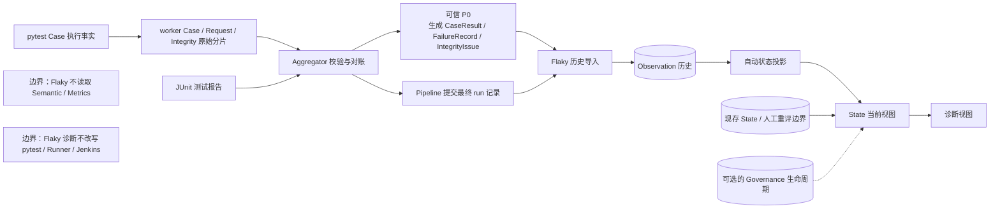
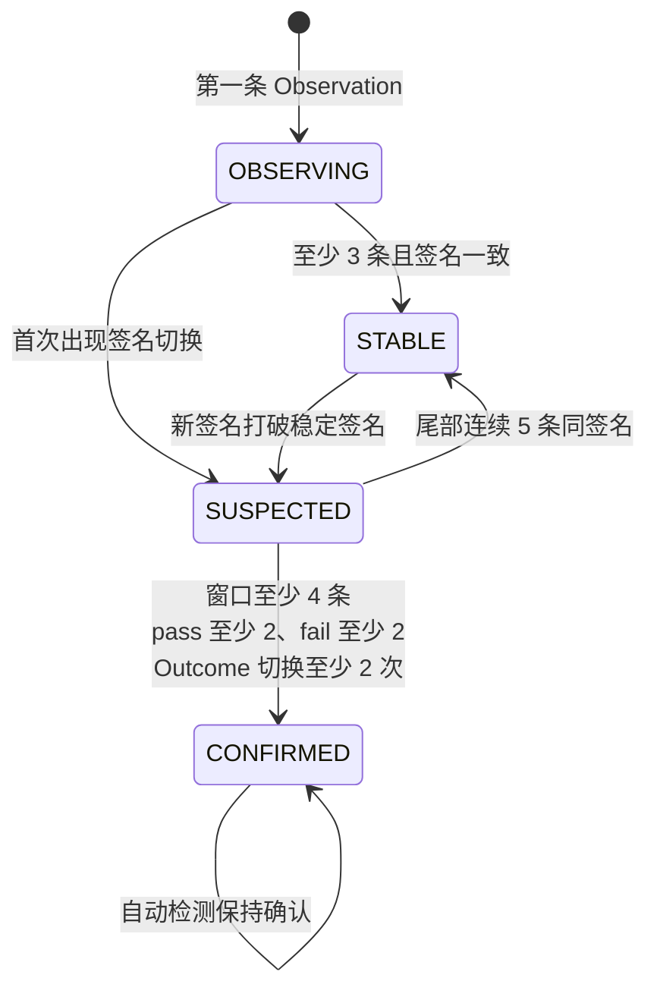
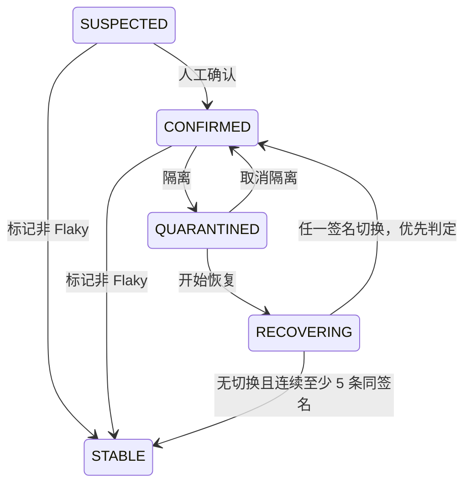

# 第 07 课：Flaky 检测和治理

> 课时：75 分钟  
> 核心问题：一个 Case（pytest 收集并执行的测试用例）今天失败，为什么不能马上标记为 Flaky？

## 0. 先看一个容易误判的场景

同一个图片生成用例连续运行三天。以下比较都假设稳定用例、参数、环境、串并行方式和人工划分的历史区间（比较纪元）完全相同；任一项不同，都不能直接放进同一条 Flaky 历史：

```text
第 1 天：fail:A
第 2 天：fail:A
第 3 天：fail:A
```

这里的 `A` 表示同一种失败指纹，例如同一断言位置和同类异常形成的稳定标识。三次都失败当然很严重，但结果始终一致。它更像一个可重复的产品缺陷，而不是时好时坏的 Flaky。

再看另一组历史：

```text
第 1 天：pass
第 2 天：fail:A
```

结果发生了切换，但样本只有两次。它值得怀疑，却还不足以证明长期不稳定。

因此，本课所说的 Flaky 是：**同一个可比较对象在跨运行历史中出现有证据的结果切换**。一次失败只证明本轮失败，不能同时证明失败不可重复。

先认识六个本课对象：

| 对象 | 最小含义 |
| --- | --- |
| Observation（观察） | 某个可比较 Case 在一轮运行中的一次合格 pass/fail 事实 |
| Result Signature（结果签名） | 把一次观察压缩成 `pass` 或 `fail:{failure_id}`；`failure_id` 是 P0（经校验合并后提交的基础事实层）已有的失败指纹标识 |
| Automatic Projection（自动投影） | 只重放 Observation 得到的自动状态与证据 |
| State / Current View（状态记录 / 当前视图） | 自动投影结合现存人工状态、重评边界和治理生命周期后形成的持久化视图 |
| Transition（迁移记录） | 状态为何从 A 变成 B，以及当时用了哪些证据 |
| Manual Control（人工控制） | 人工决策的概念总称；实际分为 Override（人工覆盖记录）与 Governance（隔离、恢复生命周期记录） |

pytest 是 Python 测试框架。Aggregator（聚合器）校验并合并各执行进程的原始记录，形成上表所说的 P0。

---

## 1. 先说结论

先明确输入：`CaseResult` 是一次用例调用某个阶段的结果记录；`FailureRecord` 是失败类别、指纹和关联身份组成的失败证据。Flaky 的判断不是“看见失败”，而是完成下面这条证据链：

```text
可信 P0 CaseResult 与 FailureRecord
-> 折叠为每轮 pass/fail Observation
-> 按稳定可比身份积累跨运行历史
-> 计算结果签名、切换次数与连续同签名次数
-> 形成自动 Projection 与可追溯 Transition
-> 如需干预，人工控制决定是否确认、否定、隔离或进入恢复观察
```

Semantic 是把底层请求归属到业务操作、请求组等对象的证据层；Metrics 同时依赖可信 P0 与 Semantic，据此生成比率、耗时等聚合指标。Flaky 直接读取可信 P0，不读取 Metrics，也不要求 Semantic 先成功。worker 是 pytest 并行执行时的工作进程，每个进程独立写原始分片；Request 是一次客户端发送尝试的记录类型；JUnit 是 pytest 可输出的标准测试报告；IntegrityIssue 是完整性问题记录。Runner 是负责权威计划、分池和项目级执行结果的编排器；Jenkins 是运行流水线并拥有构建状态的持续集成系统。

真实依赖如下：



worker 不直接生产 FailureRecord；Aggregator 在校验 worker 原始分片并结合 JUnit 对账后生成它。流水线当前会在 Semantic 和 Metrics 阶段之后调用 Flaky，但调用先后不等于数据依赖。Flaky 会重新读取 P0 Case 历史；Semantic 或 Metrics 的诊断结果不是它的输入。

### 1.1 本课学习结果

本课结束后，学习者应能：

1. 解释单次失败、稳定失败和 Flaky 的区别。
2. 说明哪些 P0 Case 事实可以进入历史，哪些必须排除。
3. 解释结果签名、可比身份、证据窗口（默认取用于判断的最近最多 20 条观察）与四个自动状态。
4. 区分自动检测、人工治理和 pytest 执行行为。
5. 说明 Observation、自动 Projection、State、Transition、人工控制各自保存什么。
6. 说清导入失败、无数据、重复导入和数据库异常时怎样收口。

### 1.2 本课刻意不展开

- 不按 SQLite（单文件关系数据库）表逐张讲解。
- 不展开 repository（数据库读写封装）、SQL 迁移脚本或命令行参数。
- 不把 Flaky 状态接成自动跳过、自动重试或自动修改 Jenkins 构建结果。
- 不复述 Semantic 与 Metrics 的计算过程；它们不是本课输入。
- 不把固定阈值解释成统计学上的概率证明。

### 1.3 75 分钟讲授路线

| 时间 | 内容 | 本段要形成的认识 |
| ---: | --- | --- |
| 0～6 分钟 | 稳定失败与结果切换场景 | 失败不等于 Flaky |
| 6～11 分钟 | 结论与真实依赖 | Flaky 只消费可信 P0 Case 历史 |
| 11～16 分钟 | 可比身份与约束理论（TOC）最大约束 | 先保证比较对象相同 |
| 16～34 分钟 | 必要词典与模块骨架的六个决策 | 建立“候选事实→稳定身份→投影→当前视图”路径 |
| 34～44 分钟 | 可信导入与结果签名 | 历史不能接收猜测事实 |
| 44～54 分钟 | 证据窗口与状态迁移规则 | 状态变化必须有阈值和证据 |
| 54～65 分钟 | 人工治理与四类持久化事实 | 检测、治理、执行互不越权 |
| 65～70 分钟 | 三类主要失败出口与历史比较边界 | 历史不可比时停止推断 |
| 70～75 分钟 | 取舍与因果链收束 | 诊断结论不能改写执行事实 |

“学习结果”和“刻意不展开”是讲师备课提示，不逐条占用现场时间。代码首遍只跟踪六个决策点：单次调用隔离、阶段折叠优先级、候选观察（Candidate）到稳定身份与 Observation 的物化、run 存在性、自动状态迁移、治理覆盖与同事务收口；人工写入口留到第 6 节回看。包装入口、报告字段组装、数据库适配和中间变量均为讲师备注，不逐行讲解。人工动作表只对比门禁和写入差异，紧凑状态图只讲迁移拓扑，不逐格重复。Transition ID 冲突、重建限制、完整失败矩阵和当前启用配置用于课后查阅；SQLite repository 与迁移实现不进入本课。

## 2. 第一性原理与 TOC：先锁定同一个比较对象

Flaky 判断至少需要：

```text
Flaky 证据 = 同一可比对象 + 有序历史 + 可区分结果 + 可解释切换
```

同一条历史必须同时锁定：稳定用例标识（`case_id`）、参数摘要（`param_hash`）、归一化环境（`environment`）、归一化执行方式（`execution_profile`）和比较纪元（`state_epoch`）。它们共同生成跨运行稳定键 `flaky_key`。

```text
flaky_key = SHA256(case_id, param_hash, environment, execution_profile, state_epoch)
```

SHA256 在这里用于生成固定长度摘要，不代表加密。`invocation_id` 只定位本轮具体调用，`run_id` 只定位一轮运行，二者都不能单独充当跨运行稳定键。

```text
身份混杂
-> 结果切换可能只是参数、环境、执行方式或纪元不同
-> 状态规则把输入差异误判为随机波动
-> 后续治理对象错误
```

因此模块主线必须先经过：候选观察（Candidate）→ 解析或创建比较纪元范围（Epoch scope）→ 生成 `flaky_key` → 生成持久化 Observation。TOC 要求先解除这个最窄约束，再讨论样本阈值和治理状态。

---

## 3. 模块级精简教学代码：从本轮 P0 到跨运行治理

原实现同时处理 P0 验源、用例阶段折叠、重复导入判定、历史投影、人工控制和报告降级。下面是**教学伪代码**：它先串起两个真实流水线阶段，保留输入、核心转换、事务写入、正常与失败出口，省略配置告警、数据库查询和报告字段组装。最外层 `finalize()` 与真实总收口一样不返回业务结果；内部 `history_result` 只用于决定能否继续评估。首遍只读六个决策，人工写入口到第 6 节再展开；`finalize` 包装、报告写出和数据库适配行作为讲师备注快速带过。

无需在开场背完下面的词典。现场沿代码主线首次遇到时就地查阅，只解释解除当前理解约束所需的一行：

| 代码中的词 | 本段最小含义 |
| --- | --- |
| stage（流水线阶段） | 一段有独立开关、输入和失败收口的处理过程 |
| Transaction（事务） | 一组持久化写入要么全部成功，要么全部回滚 |
| Invocation（一次调用） | 同一 Case 在一轮运行中的一次具体执行，由若干阶段记录组成 |
| Idempotent Import（幂等导入） | 同一 run 与相同来源重复处理时不重复增加 Observation |
| `FlakyImportError` | 导入校验异常；invocation 内产生时只排除该条，来源级异常则由外层转成报告 |
| `execution_profile`（执行方式） | 归一化后的串行或并行方式，是跨运行可比身份的一部分；不支持时排除该 invocation |
| `nodeid`（用例标识） | pytest 收集到的原始用例标识；归一化后的稳定部分应与 `case_id` 一致 |
| Epoch（比较纪元） | 人工切开的历史比较区间；新纪元不与旧纪元共同投影 |
| 导入报告状态 | IMPORTED、NOOP、DEGRADED、FAILED、NO_DATA：说明本轮历史导入结果 |
| 评估报告状态 | EVALUATED、NOOP、DEGRADED、FAILED、NO_DATA：说明本轮状态评估结果 |
| `rule_version` / `projection_version` | 状态规则版本 / 投影语义版本；既有 State 必须与当前配置兼容 |
| `last_transition_id` | State 指向最近一次有效 Transition 的回链标识；本轮无新迁移时沿用旧值 |

`run_id` 标识一轮运行；`flaky_key` 是跨运行比较序列的稳定键，第 2 节已经给出组成，第 3 节只展示它在主控制流中的物化位置。`runtime_config` 是 `QualityRuntimeConfig` 运行配置，拥有 run_id、Flaky 数据库路径和阶段开关；`rule_config` 是 `FlakyRuleConfig` 规则配置，只携带窗口、阈值及规则/投影版本。当前自动 Pipeline 固定使用默认规则配置；只有直接调用底层 FlakyStore API 时才能另传规则配置。`import_with_report()` 与 `evaluate_with_report()` 是教学包装名，其内部精确的错误状态映射与报告写失败降级在第 8 节展开；两个 `*_stage_fail_open` 包装负责检查开关，并捕获整个 stage 逃出的普通异常。历史 stage 在 run 未结束时写 NO_DATA；状态 stage 在导入结果不可评估时写 NO_DATA。

```python
class FlakyHistoryModule:
    def finalize(self, run_status, runtime_config):
        rule_config = DEFAULT_FLAKY_RULE_CONFIG  # 当前自动 Pipeline 的固定入口
        import_history = lambda: import_with_report(runtime_config, self._import_history)
        history_result = run_history_stage_fail_open(run_status, runtime_config, import_history)
        evaluate = lambda: evaluate_with_report(
            runtime_config, rule_config, self._evaluate_current_run
        )
        run_state_stage_fail_open(runtime_config, history_result, evaluate)
        # 不返回业务结果；pytest、Runner、Jenkins 的事实均不被改写。

    def _import_history(self, runtime_config):
        source = load_and_verify_required_p0(runtime_config)
        source_issues = [
            FlakyImportIssue(
                severity=item.severity, code=item.code,
                summary=safe_summary(item.message), related_id=item.related_id,
            )
            for item in source.integrity_issues
        ]
        candidates, excluded, fold_issues = [], {}, []
        for invocation_id, phases in group_by_invocation(source.case_results):
            try:
                candidates.append(fold_invocation_to_candidate(phases, source.failures))
            except FlakyImportError as error:
                increase_count(excluded, error.code)
                fold_issues.append(warn_issue(error.code, invocation_id))
        metadata = build_import_metadata(
            source,
            eligible_count=len(candidates),
            excluded_count=sum(excluded.values()),
        )
        database = initialize_persistent_store(runtime_config.flaky_database_path)
        with database.transaction():
            outcome = database.import_idempotently(
                metadata, candidates, materialize=self._materialize_observation
            )
        issues = (*source_issues, *fold_issues)
        status = import_status(outcome, candidates, metadata.p0_integrity_status)
        return build_import_result(status, outcome, metadata, excluded, issues)

    def _materialize_observation(self, database, candidate):
        scope_key = build_epoch_scope_key(candidate.case_id, candidate.environment, candidate.execution_profile)
        scope = database.get_or_create_epoch_scope(scope_key, candidate)
        require_compatible_epoch_rules(scope, candidate)
        flaky_key = build_flaky_key(candidate, state_epoch=scope.current_epoch)
        observation_id = build_observation_id(candidate.run_id, flaky_key)
        database.require_no_observation_identity_conflict(observation_id, candidate.run_id, flaky_key)
        return observation_from_candidate(candidate, scope_key, flaky_key, observation_id)

    def _evaluate_current_run(self, runtime_config, rule_config):
        database = open_existing_store(runtime_config.flaky_database_path)
        with database.transaction():
            database.require_imported_run(runtime_config.run_id)  # 不存在则 FAILED
            keys = database.flaky_keys_for_run(runtime_config.run_id)
            if not keys:
                return build_evaluation_no_data("run has no observations")
            plans = []
            for key in keys:
                history = database.ordered_observations(key)
                existing = database.current_state_or_none(key)
                require_compatible_projection_versions(existing, rule_config)
                automatic = replay_observations(history, rule_config)
                open_governance = database.open_governance(key)
                current, reason_code, close_id, resolution, evaluation_anchor = (
                    apply_existing_controls_once(
                        automatic, existing, open_governance, history, rule_config
                    )
                )
                transitions = bootstrap_or_state_change_transitions(
                    existing, current, automatic, reason_code,
                    history=history, trigger_run_id=runtime_config.run_id, rule_config=rule_config)
                transitions = remove_already_persisted_transitions(database, transitions)
                last_transition_id = newest_or_existing_transition_id(transitions, existing)
                state_record = materialize_state_record(
                    current, history, last_transition_id, evaluation_anchor, rule_config
                )
                changed = state_changed_except_updated_at(existing, state_record)
                plan = ProjectionPlan(state=state_record, transitions=transitions, changed=changed,
                    close_governance_id=close_id, governance_resolution=resolution)
                database.write_projection_plan(plan)
                plans.append(plan)
            status = "EVALUATED" if any(plan.changed for plan in plans) else "NOOP"
            return build_evaluation_result(status, plans)

```

后续代码块优先从这份主骨架抽取；骨架中抽象掉的关键判断和真实接入边界，则用保持相同核心语义的最小源码摘录补证。跨多个真实函数压缩时会明确标为教学重构，并写出宿主；局部代码只证明当前条件，不形成第二套实现。现场每块只追踪正文正在解释的分支，其余错误码和字段留作课后核对，不再逐行讲一遍。

骨架只保留六个核心决策：逐 Invocation 隔离坏证据；折叠为 Candidate；经 Epoch 与稳定身份物化 Observation；验证 run 与 State 版本；由自动投影和既有人工控制形成当前视图；最后按“Transition 去重 → `last_transition_id` → State → 同事务写入”的顺序提交。折叠规则、完整重放和人工合同分别在第 4、5、6 节展开。

恢复收口意图、Transition、State 与 Governance 关闭动作进入同一计划；任一步失败都会一起回滚。迟到或积压的 Observation 可能使系统重新解释历史；只有状态确实改变时才新增 Transition。精确的审计触发类型判定见课后查阅。

`flaky-import.json` 记录本轮是否完成历史导入；`flaky-evaluation.json` 记录本轮评估结果及持久化 State 是否更新。EVALUATED 不等于发生状态枚举迁移：新增观察只要改变样本数、pass/fail 计数或最新观察，State 就会更新；真正的状态迁移由 `transitioned_count` 和 `transitions` 表示。

---

## 4. 可信导入：不是每个 CaseResult 都能成为历史

### 4.1 Flaky 直接消费哪些事实

导入器读取当前 run 记录、P0 manifest（产物清单）、CaseResult、FailureRecord 和 IntegrityIssue（完整性问题记录）。它不读取 Request、Semantic 或 Metrics 来判断 Case 是否 Flaky。

进入折叠前，当前实现至少要求：

| 校验 | 目的 | 失败时的含义 |
| --- | --- | --- |
| run 状态为 FINISHED，且折叠后确认 `end_time` 存在 | 不把半轮执行写进长期历史 | 本轮不可导入 |
| manifest 已 complete，run_id、manifest_version 和 schema_version 匹配 | 确认读取的是当前已提交 P0；merge_version 与 fingerprint_version 还必须存在 | 来源不可信 |
| Case、Failure、Integrity 输出哈希匹配 | 防止提交后文件被替换 | 来源不可信 |
| run 与 manifest 的完整性状态一致且不是 FAILED | 防止双状态矛盾 | 来源不可信 |
| Integrity 没有 ERROR，也没有影响 Case 信任的 WARN | 只让可用于历史判断的 Case 进入 | 阻断导入 |
| JSONL（每行一个 JSON 对象）记录满足 Schema（字段与类型合同）且属于当前 run | 防止坏行或外来记录混入 | 阻断导入 |

以下完整白名单供课后查阅，现场只讲“只有不损害 Case 信任的明确 WARN 才能放行”：`classification_failed`（失败分类失败），JUnit 文件缺失、过期或解析失败（`junit_file_missing`、`junit_file_stale`、`junit_parse_failed`），以及仅关联 Request 分片的 JSONL/Schema 解析告警。JUnit 数量、invocation 身份或状态不一致不在白名单内，会阻断 Flaky 导入。于是 P0 可以是 DEGRADED，Flaky 导入也标记 DEGRADED，但合格 Case 仍可进入历史；不能概括成“部分 JUnit 对账告警都可接受”。

下面是对 `quality.flaky_importer.prepare_flaky_import()` 的教学重构。前表就是 `_validate_run_and_manifest()` 与 `_validate_output_hashes()` 的精确合同；其中完整性字段必须是已知枚举值，环境也必须能归一化。`require(condition, code)` 在条件为假时抛出 `FlakyImportError`；`_read_jsonl_models()` 逐行做 JSON、Schema 和 `run_id` 校验，任何坏行或外来记录都会拒绝整个来源：

```python
for path in required_p0_paths.values():
    require(path.is_file(), "artifact_missing")
source_hashes = {name: _file_sha256(path)
                 for name, path in required_p0_paths.items()}
run = _read_model(required_p0_paths["run_record"], RunRecord)
manifest = _read_json_object(required_p0_paths["manifest"])
_validate_run_and_manifest(requested_run_id, run, manifest)
_validate_output_hashes(manifest, source_hashes)
cases = _read_jsonl_models(required_p0_paths["case_results"], CaseResult, requested_run_id)
failures = _read_jsonl_models(required_p0_paths["failures"], FailureRecord, requested_run_id)
issues = _read_jsonl_models(required_p0_paths["integrity_issues"], IntegrityIssue, requested_run_id)
_validate_run_integrity_issues(run, issues)
_validate_integrity_issues(issues)
fold = fold_case_observations(
    cases, failures,
    environment=normalize_flaky_environment(run.environment),
    fingerprint_version=_manifest_text(manifest, "fingerprint_version"),
)
require(run.end_time is not None, "run_not_finished")
```

`required_p0_paths` 就是前文五项文件；两个来源验证 helper 不增加表外门禁。`_validate_run_integrity_issues()` 把两边问题按规范化 JSON 分别排序后比较，不是只比数量；`_validate_integrity_issues()` 拒绝 ERROR，并按前文完整白名单判断 WARN，其中三类分片解析告警只有 `related_id` 以 `requests-` 开头才安全。注意 `end_time` 与源码一样在折叠后检查，不能用 FINISHED 枚举替它补值。

### 4.2 从阶段记录折叠成一次观察

pytest 一次用例调用通常包含 setup、call、teardown 三个阶段。`raw_status` 是直接观察到的阶段状态，`final_status` 是供后续折叠使用的有效状态。现场只跟踪“身份与生命周期校验 → ERROR → FAILED → PASSED call → 预期结果排除”的优先级；下面十级决策表供课后查阅，命中一行后不再检查后续分支：

| 优先级 | 条件 | 当前处理 |
| ---: | --- | --- |
| 1 | 身份或稳定 nodeid 不一致 | 以 `identity_conflict` 排除 |
| 2 | 执行方式不能归一化 | 以 `execution_profile_unsupported` 排除 |
| 3 | 同一阶段重复 | 以 `duplicate_phase` 排除 |
| 4 | 包含 collection 阶段 | 以 `collection_phase` 排除 |
| 5 | 既不是 setup/call/teardown 完整生命周期，也不是 setup 提前 ERROR/SKIPPED 后带 teardown | 以 `incomplete_phase` 排除 |
| 6 | 任一阶段 ERROR | 立即校验唯一失败指纹及匹配 FailureRecord；合格则形成 fail，否则按具体指纹错误排除，不再判断 SKIPPED |
| 7 | 无 ERROR，但存在 FAILED | 立即执行同样的指纹校验；合格则形成 fail，否则排除 |
| 8 | 无 ERROR/FAILED，且 call 的 raw/final 状态都为 PASSED | 形成 pass Observation；其他阶段即使 SKIPPED 也不再改变该结果 |
| 9 | 前面均未命中，且存在 SKIPPED、XFAILED（符合预期的失败）或 XPASSED（预期失败却通过） | 以 `expected_outcome_excluded` 排除 |
| 10 | 其他状态 | 以 `unsupported_status` 排除 |

这些状态具有测试策略语义，当前实现不把它们强行压成普通 pass/fail。

表中的身份、执行方式、重复阶段和生命周期门先执行；通过后，`quality.flaky_importer._fold_invocation()` 按下面的真实优先级决定 Observation 候选。`reject(code)` 表示抛出带该错误码的 `FlakyImportError`：

```python
error_phases = [item for item in phases if item.final_status is CaseStatus.ERROR]
failed_phases = [item for item in phases if item.final_status is CaseStatus.FAILED]
if error_phases or failed_phases:
    relevant = error_phases or failed_phases  # ERROR 优先于 FAILED
    failure_id = require_single_failure_id((*error_phases, *failed_phases))
    decisive = earliest_matching_phase(relevant, failure_id)
    failure = require_unique_failure_record(
        failure_lookup, failure_id, first.invocation_id, first.case_id, decisive.phase
    )
    outcome, failure_category = ObservationOutcome.FAIL, failure.category.value
    final_status = CaseStatus.ERROR if error_phases else CaseStatus.FAILED
elif (call := by_phase.get(CasePhase.CALL)) is not None \
        and call.final_status is CaseStatus.PASSED:
    if call.raw_status is not CaseStatus.PASSED:
        reject("unsupported_status")
    decisive, outcome, failure_id = call, ObservationOutcome.PASS, None
    final_status, failure_category = CaseStatus.PASSED, None
elif any(item.final_status in {
    CaseStatus.SKIPPED, CaseStatus.XFAILED, CaseStatus.XPASSED,
} for item in phases):
    reject("expected_outcome_excluded")
else:
    reject("unsupported_status")

return CaseObservationCandidate(
    run_id=first.run_id,
    invocation_id=first.invocation_id,
    case_id=first.case_id,
    param_hash=first.param_hash,
    environment=environment,
    execution_profile=profile,
    decisive_phase=decisive.phase,
    raw_status=decisive.raw_status,
    final_status=final_status,
    observation_outcome=outcome,
    failure_id=failure_id,
    failure_category=failure_category,
    observed_at=decisive.end_time,
    fingerprint_version=fingerprint_version,
)
```

`require_single_failure_id()` 从所有 ERROR/FAILED 阶段收集非空 ID：没有时给出 `missing_failure_fingerprint`，多于一个时给出 `multiple_failure_fingerprints`。`earliest_matching_phase()` 只在优先集合中按 setup、call、teardown 顺序选同一 ID；`require_unique_failure_record()` 再要求 `failure_id + invocation_id + case_id + phase` 恰好匹配一条 FailureRecord。三个 helper 只压缩这三条已明确的条件。Candidate 的 `observed_at` 明确取决定性阶段的 `end_time`；后续历史排序使用的观察时间由此闭合，而不是在数据库导入时另取当前时间。

缺少合格观察是 missing data（缺失数据），不是 pass，也不是数值 0。

### 4.3 结果签名为什么需要失败指纹

当前结果签名只有两种形态：

```text
pass
fail:{failure_id}
```

这样可以同时区分两种变化：

- Outcome 切换：`pass -> fail:A`，通过与失败互换。
- Signature 切换：`fail:A -> fail:B`，都失败，但失败指纹发生变化。

连续 `fail:A` 没有签名切换，因此可以成为“稳定失败”。这不是降低失败严重性，而是把“功能正确性”和“结果稳定性”分开。

结果签名没有第二套推断逻辑，直接来自 `quality.flaky.build_result_signature()`：

```python
def build_result_signature(observation):
    if observation.observation_outcome is ObservationOutcome.PASS:
        return "pass"
    if not observation.failure_id:
        raise ValueError("fail observation must include failure_id")
    return f"fail:{observation.failure_id}"
```

本节代码共同证明：P0 验源与源哈希检查先于折叠；阶段记录只有通过明确优先级后才形成合格 Observation，缺失或冲突不会被猜测填补。

---

## 5. 自动检测：状态来自历史切换，不来自单次情绪

### 5.1 证据窗口保存什么

观察先按 `observed_at`、run 结束时间、`run_id` 和 `observation_id` 稳定排序，再取最近最多 20 条作为默认证据窗口。窗口保存：

- 样本数、pass 数和 fail 数。
- Outcome 切换次数。
- Signature 切换次数。
- 不同失败指纹数量。
- 尾部连续相同签名数量。
- 最近签名，以及最多 20 个 Observation/run 证据引用。

“最多 20 条”是当前规则的有限窗口，不是“20 条以后旧事实被删除”。完整 Observation 历史仍在数据库中，状态投影只用规则窗口计算当前证据。

下面抽取 `quality.flaky.derive_evidence_window()` 的核心计算。排序键与切换口径不能省略，否则同一批迟到观察可能得到不同状态：

```python
ordered = sorted(observations, key=lambda item: (
    item.observed_at, item.run_end_time, item.run_id, item.observation_id
))
if not ordered:
    raise ValueError("at least one observation is required")
window = ordered[-config.evidence_window_size:]
signatures = [build_result_signature(item) for item in window]
outcomes = [item.observation_outcome for item in window]
pass_count = sum(item is ObservationOutcome.PASS for item in outcomes)
fail_count = len(outcomes) - pass_count
outcome_switch_count = sum(a is not b for a, b in zip(outcomes, outcomes[1:]))
signature_switch_count = sum(a != b for a, b in zip(signatures, signatures[1:]))
failure_ids = {item.failure_id for item in window
               if item.observation_outcome is ObservationOutcome.FAIL and item.failure_id}
distinct_failure_fingerprint_count = len(failure_ids)
trailing_same_signature_count = 1
for signature in reversed(signatures[:-1]):
    if signature != signatures[-1]:
        break
    trailing_same_signature_count += 1
evidence_refs = window[-config.max_transition_evidence_refs:]
```

这些计算值与最近签名会写入 `FlakyEvidence`；`evidence_refs` 再提供 Observation ID 和去重后保持顺序的 run ID。空历史在切片前就被拒绝，因此尾部计数从 1 开始。

### 5.2 四个自动状态

自动检测使用四个状态：

- `OBSERVING`（观察中）：样本还不足，且尚未出现签名切换。
- `STABLE`（稳定）：连续证据保持同一结果签名；可以是稳定通过，也可以是稳定失败。
- `SUSPECTED`（疑似 Flaky）：观察到签名变化，但确认阈值尚未满足。
- `CONFIRMED`（已确认 Flaky）：通过/失败反复切换的证据达到当前阈值。

当前默认规则如下：



阈值顺序很重要：在 `SUSPECTED` 中先判断是否满足确认条件，再判断是否可由连续同签名清除。

`quality.flaky.replay_observations()` 会对每个历史前缀重新计算上述 Evidence。下面的最小教学重构完整保留四个状态分支；`remember_transition()` 只把前态、后态、原因、触发 Observation 和 Evidence 保存成内存中的迁移决定：

```python
ordered = sort_observations(observations)
state, stable_signature = None, None
for index, observation in enumerate(ordered, start=1):
    evidence = derive_evidence_window(ordered[:index], config)
    previous, reason = state, None
    if state is None:
        state, reason = FlakyState.OBSERVING, "first_observation"
    elif state is FlakyState.OBSERVING:
        if evidence.signature_switch_count > 0:
            state = FlakyState.SUSPECTED
            reason = ("outcome_changed" if evidence.outcome_switch_count > 0
                      else "failure_fingerprint_changed")
        elif evidence.sample_size >= config.stable_min_samples:
            state, stable_signature = FlakyState.STABLE, evidence.latest_signature
            reason = "consistent_signature_threshold_met"
    elif state is FlakyState.STABLE:
        stable_signature = stable_signature or evidence.latest_signature
        if build_result_signature(observation) != stable_signature:
            state, reason = FlakyState.SUSPECTED, "stable_signature_broken"
    elif state is FlakyState.SUSPECTED:
        confirmed = (
            evidence.sample_size >= config.confirmed_min_samples
            and evidence.pass_count >= config.confirmed_min_pass_count
            and evidence.fail_count >= config.confirmed_min_fail_count
            and evidence.outcome_switch_count >= config.confirmed_min_outcome_switches
        )
        if confirmed:
            state, reason = FlakyState.CONFIRMED, "confirmation_threshold_met"
        elif (evidence.trailing_same_signature_count
              >= config.suspected_clear_signature_streak):
            state, stable_signature = FlakyState.STABLE, evidence.latest_signature
            reason = "suspected_cleared_by_streak"
    elif state is FlakyState.CONFIRMED:
        pass
    if reason is not None:
        remember_transition(previous, state, reason, observation, evidence)
```

### 5.3 六组历史的准确解释

| 历史 | 当前自动结论 | 原因 |
| --- | --- | --- |
| `pass` | OBSERVING | 只有一条观察 |
| `fail:A, fail:A, fail:A` | STABLE | 三条签名一致，是稳定失败 |
| `pass, fail:A` | SUSPECTED | 已切换，但确认样本不足 |
| `pass, fail:A, fail:A, pass` | CONFIRMED | 4 条中有 2 pass、2 fail，Outcome 切换 2 次 |
| `fail:A, fail:B, fail:A, fail:B` | SUSPECTED | Signature 在切换，但没有 pass，当前确认条件不成立 |
| `pass, fail:A, pass, pass, pass, pass, pass` | STABLE | 疑似后尾部连续 5 条 `pass`，恢复为稳定 |

一旦自动进入 CONFIRMED，继续出现相同结果不会自动清除。恢复必须进入显式治理流程，防止历史波动被短期安静期悄悄抹掉。

本节代码共同证明：窗口明确计算两类切换与尾部连续签名，状态重放再按固定顺序使用这些证据和默认阈值。

---

## 6. 人工治理：检测结论不等于执行命令

### 6.1 三层职责必须分开

| 层次 | 当前职责 | 无权做的事 |
| --- | --- | --- |
| 自动检测 | 根据历史形成自动 Projection 与证据 | 不决定是否跳过 Case |
| 人工控制 | 确认、否定等写 Override；隔离、恢复写 Governance 生命周期记录 | 不直接改写执行计划 |
| 执行行为 | pytest 按 Runner 的权威计划执行 | 不因治理标签自行改变计划 |

状态记录同时保存 `detected_state`（检测判断轴）和 `current_state`（当前呈现状态）。`detected_state` 只取 OBSERVING、STABLE、SUSPECTED、CONFIRMED 四个检测值，却也不是不可变的“纯自动档案”：人工确认或标记非 Flaky 会同时重设两个字段，取消隔离也会把二者设回 CONFIRMED；隔离和开始恢复则主要改变 `current_state`，使其可取 QUARANTINED 或 RECOVERING。人工与自动的区别要联合查看 Override、Transition、评估锚点（evaluation anchor，后续重评包含该 Observation）和 Governance 生命周期记录，不能只靠这两个状态字段推断。

主骨架中的 `apply_existing_controls_once()` 只压缩下面这段固定优先级。代码是对 `quality.flaky_store.projection.build_projection_plan()` 的最小教学重构；分支命中后不再落到后项，若全不命中才保留 `automatic`：

```python
current_state = automatic.current_state
detected_state = automatic.detected_state
latest = history[-1]
evaluation_anchor = (existing.evaluation_anchor_observation_id
                     if existing is not None else None)

if (open_governance is not None
        and open_governance.status is GovernanceStatus.RECOVERING):
    after_anchor = observations_after_anchor(
        history, open_governance.recovery_anchor_observation_id
    )
    recovery = evaluate_recovery(after_anchor, rule_config)
    if recovery.target_state is None:
        current_state = FlakyState.RECOVERING
        detected_state = (existing.detected_state if existing is not None
                          else FlakyState.CONFIRMED)
    else:
        current_state = detected_state = recovery.target_state
        evaluation_anchor = (
            latest.observation_id
            if recovery.target_state is FlakyState.STABLE
            else existing.evaluation_anchor_observation_id
            if existing is not None else None
        )
        close_id = open_governance.governance_id
        resolution = (GovernanceResolution.RECOVERED
                      if recovery.target_state is FlakyState.STABLE
                      else GovernanceResolution.REGRESSED)
elif open_governance is not None:
    current_state = FlakyState.QUARANTINED
    detected_state = (FlakyState.CONFIRMED
                      if existing is not None
                      and existing.detected_state is FlakyState.CONFIRMED
                      else automatic.detected_state)
elif existing is not None and existing.current_state is FlakyState.CONFIRMED:
    current_state = detected_state = FlakyState.CONFIRMED
elif existing is not None and existing.evaluation_anchor_observation_id is not None:
    current_state, detected_state = evaluate_from_manual_anchor(
        existing, history, rule_config
    )[:2]
```

完整实现还在同一命中分支内同步 evidence、稳定签名、原因码和治理收口字段；这里不重复第 6.3 节的字段计算，只证明决定最终 State 视图的顺序：恢复治理 → 其他开放治理 → 既有 CONFIRMED → 人工评估锚点 → 自动投影。

### 6.2 人工入口先校验，再同事务写入

FlakyStore Facade（Flaky 持久化模块的对外操作入口）接收人工动作；`actor` 是操作者身份，`reason` 是操作原因。隔离请求还要求非空的 `owner`（治理负责人），以及带时区且晚于当前时间的 `expires_at`（计划到期时间）。它不是“收到命令就改一个状态字段”，而是先按动作校验，再把相关审计事实放进同一事务。下面是 `quality.flaky_store.facade.FlakyStore._governance_write()` 的真实结构；具体动作抛出异常时，事务会回滚：

```python
def _governance_write(self, operation, request):
    with self.repository.connection(require_existing=True) as connection:
        initialize_store(connection, self.repository, self.migrations_directory)
        with self.repository.transaction(connection):
            return operation(connection, self.repository, request)
```

`GovernanceStatus` 是治理记录自己的生命周期状态：ACTIVE、RECOVERING、CLOSED。它与 `current_state` 分属不同轴，即使都出现 RECOVERING 也不能等同。

| 人工动作 | 关键前置条件 | 同一事务内的主要写入 |
| --- | --- | --- |
| 确认 Flaky | SUSPECTED；没有开放治理 | Transition + Override + State |
| 标记非 Flaky | SUSPECTED 或 CONFIRMED；没有开放治理 | Transition + Override + State，并设置评估锚点 |
| 隔离 | CONFIRMED；没有开放治理；隔离请求满足上述字段合同 | Governance + Transition + State |
| 开始恢复 | QUARANTINED；存在 ACTIVE Governance | 更新 Governance + Transition + State |
| 取消隔离 | QUARANTINED；存在 ACTIVE Governance | 关闭 Governance + Transition + Override + State |
| Epoch reset | Epoch scope 已存在；没有 ACTIVE 或 RECOVERING Governance | Epoch scope + Override；不写 State 或 Transition |

隔离是最容易越权的动作，下面用跨 `FlakyQuarantineRequest` 模型与 `quality.flaky_store.governance.quarantine()` 的最小教学重构展开其门禁和写入。`require_text()` 也用于基类中的 `flaky_key`、`actor` 和 `reason`；长度上限等外围字段约束省略：

```python
owner = require_text(request.owner)
if request.expires_at.tzinfo is None or request.expires_at.utcoffset() is None:
    raise ValueError("expires_at must include timezone information")
now = datetime.now(UTC)
if request.expires_at.astimezone(UTC) <= now:
    raise FlakyStoreError("invalid_expiry", "expires_at must be in the future")

state = repository.require_state(connection, request.flaky_key)
if state.current_state is not FlakyState.CONFIRMED:
    raise FlakyStoreError(
        "invalid_state_transition", "quarantine requires current_state=CONFIRMED"
    )
repository.require_no_open_governance(connection, request.flaky_key)
governance_id = new_governance_id()
repository.insert_governance(
    connection, governance_id=governance_id, flaky_key=request.flaky_key,
    owner=owner, reason=request.reason, actor=request.actor,
    created_at=now, expires_at=request.expires_at,
)
transition = manual_transition(
    connection, repository, state, to_state=FlakyState.QUARANTINED,
    reason_code="manual_quarantine", actor=request.actor, now=now,
)
repository.update_state_transition(
    connection, request.flaky_key, state=FlakyState.QUARANTINED,
    transition_id=transition.transition_id, updated_at=now,
)
```

`new_governance_id()` 只压缩源码中的随机 Governance ID 构造。Transition、Governance 与 State 写入都处于上一个 Facade 事务内；代码中没有 pytest、Runner 或 Jenkins 调用。

表格回答“能否执行、写入什么”；下图只补足 `current_state` 的生命周期，不重复存储合同：



### 6.3 两类锚点与恢复判断

`expires_at` 到期只会让治理记录进入 overdue（逾期）查询结果；当前实现不会自动关闭治理、自动恢复 Case 或自动修改执行计划。

恢复锚点（recovery anchor）表示“从这条 Observation 之后重新观察”。按当前默认配置，恢复证据窗口取锚点后最近最多 20 条观察，并按固定优先级判断：只要窗口内发生过签名切换，就回到 CONFIRMED，并以 regressed（回退）关闭本次治理记录；只有窗口内完全没有切换且尾部连续至少 5 条同签名，才进入 STABLE。这里的稳定签名也可能是 `fail:A`，所以“恢复为稳定”仍不等于“功能已经通过”。

人工标记非 Flaky 时，当前最新 Observation 会成为评估锚点，`current_state` 与 `detected_state` 同时写为 STABLE。后续评估截取包含该锚点的范围并计算一次 Evidence（证据汇总），不逐条重放积压观察；STABLE 只在范围内最新签名不同于锚点稳定签名时进入 SUSPECTED，锚点之前的旧历史不会立刻推翻这次人工决定。例如锚点是 A，尚未评估时依次积压 B、A，最新签名仍为 A，当前实现可能保持 STABLE；它不会先因 B 迁移为 SUSPECTED，再因 A 迁回。

两个锚点的切片方向不同。下面对 `quality.flaky_store.governance.manual_override()`、`start_recovery()`、`quality.flaky.evaluate_recovery()`，以及 `quality.flaky_store.projection.observations_after_anchor()`、`build_projection_plan()` / `evaluate_from_manual_anchor()` 做最小教学重构，只保留锚点与状态条件：

```python
# 标记非 Flaky：把当前最新观察同时保存为稳定签名来源和评估锚点。
latest = repository.observations_for_key(connection, state.flaky_key)[-1]
stable_outcome, stable_failure_id = latest.observation_outcome.value, latest.failure_id
evaluation_anchor_id = latest.observation_id

# 开始恢复：保存当时的最新观察；后续只看它之后的新观察。
recovery_anchor_id = state.latest_observation_id
recovery_anchor_index = index_of(observations, recovery_anchor_id)
# 恢复锚点之后，不包含锚点本身。
after_anchor = observations[recovery_anchor_index + 1:]
if after_anchor:
    recovery_evidence = derive_evidence_window(after_anchor, config)
    if recovery_evidence.signature_switch_count > 0:
        target, resolution = FlakyState.CONFIRMED, GovernanceResolution.REGRESSED
    elif (recovery_evidence.trailing_same_signature_count
          >= config.recovery_signature_streak):
        target, resolution = FlakyState.STABLE, GovernanceResolution.RECOVERED
        # 恢复成功后从当前最新观察建立新的人工评估范围。
        latest = observations[-1]
        evaluation_anchor = latest.observation_id

# 人工评估锚点范围包含锚点；STABLE 只比较范围内的最新签名。
evaluation_anchor_index = index_of(
    observations, existing.evaluation_anchor_observation_id
)
scoped = observations[evaluation_anchor_index:]
evidence = derive_evidence_window(scoped, config)
if existing.current_state is FlakyState.STABLE:
    anchored_stable_signature = stored_signature_or_raise(existing)
    if evidence.latest_signature != anchored_stable_signature:
        current_state = FlakyState.SUSPECTED
        stable_outcome = stable_failure_id = None
        reason = "stable_signature_broken"
elif existing.current_state is FlakyState.SUSPECTED:
    confirmation_met = (
        evidence.sample_size >= config.confirmed_min_samples
        and evidence.pass_count >= config.confirmed_min_pass_count
        and evidence.fail_count >= config.confirmed_min_fail_count
        and evidence.outcome_switch_count >= config.confirmed_min_outcome_switches
    )
    if confirmation_met:
        current_state = FlakyState.CONFIRMED
        stable_outcome = stable_failure_id = None
        reason = "confirmation_threshold_met"
    elif (evidence.trailing_same_signature_count
          >= config.suspected_clear_signature_streak):
        current_state = FlakyState.STABLE
        stable_outcome, stable_failure_id = signature_values(
            evidence.latest_signature
        )
        reason = "suspected_cleared_by_streak"
```

`start_recovery()` 会把 `recovery_anchor_id` 写入 Governance。`index_of()` 只压缩源码的顺序查找；任一锚点不在当前 Epoch 历史中都会抛出专用错误，而不是退回全量历史。`stored_signature_or_raise()` 精确映射 PASS → `pass`、带 ID 的 FAIL → `fail:{failure_id}`，其余情况以 `stable_signature_missing` 拒绝。若恢复锚点后没有观察，或已有观察但两项条件都不满足，治理继续保持 RECOVERING，不会伪造一次迁移。恢复到 STABLE 时还会从最新签名恢复 `stable_outcome` 与 `stable_failure_id`，并把最新 Observation 设为新的评估锚点；回退到 CONFIRMED 时不保存稳定签名。锚定后的 SUSPECTED 不做全历史逐前缀重放，而是继续使用从人工锚点开始的一次 Evidence：先判断确认阈值，再判断连续同签名清除阈值。

### 6.4 `QUARANTINED` 当前不会自动跳过 Case

这是本课最重要的执行边界：

```text
Flaky current_state = QUARANTINED
!= pytest skip
!= Runner 从计划中删除 Case
!= Jenkins 构建改为成功
```

当前 Runner 仍按自己的权威 Case 集合执行。若未来要让隔离影响执行，必须增加一个显式、可审计的策略入口，并由执行所有者决定如何处理；不能让诊断数据库暗中改写计划。

主骨架与本节局部代码共同证明：自动投影和治理覆盖一起形成 `current_state`；隔离只记录 owner、reason、expires_at、Transition 与 State，不调用 pytest 跳过接口。

---

## 7. 为什么必须持久化四类事实

### 7.1 只保存当前状态为什么不够

假设数据库里只剩一句：

```text
test_create_image = CONFIRMED
```

它无法回答：用了哪几轮历史、何时从稳定变为疑似、谁确认、为什么隔离、规则与投影版本是什么。长期治理需要四类信息：

| 持久化对象 | 回答的问题 | 更新方式 |
| --- | --- | --- |
| Observation | 每轮实际观察到了什么 | 新运行追加 |
| State | 当前持久化视图是什么 | 保存自动重放与人工控制合成后的当前视图及锚点 |
| Transition | 状态为何改变，证据有哪些 | 迁移时尝试追加；确定性 ID 重复会被忽略，不能保证每次人工迁移一条 |
| 人工控制 | 谁做了什么决定，以及隔离、恢复如何收口 | Override 记录确认、否定、取消隔离和 Epoch reset；Governance 记录隔离与恢复生命周期 |

#### 课后查阅：重投影触发、Transition 冲突与重建限制

`latest_observation_id` 是 State 中指向最近 Observation 的必填字段，`current_state` 是 State 保存的当前视图。OBSERVATION 和 REPROJECTION 是 `TransitionTrigger`（迁移触发类型）枚举值，前者不要与 Observation 事实对象混为一谈。

重投影 Transition 同时要求 Observation 数量增加、重算后的 `current_state` 确实改变，并且旧 `latest_observation_id` 满足以下位置条件之一：在当前排序历史中找不到；仍位于历史末尾；它后面至少已有两条 Observation。若旧 latest 恰好位于倒数第二位，则本次状态迁移仍按普通 OBSERVATION 触发类型记录，即使本轮还插入了更早的迟到 Observation。

当前 `transition_id` 由 `flaky_key`、迁移前后状态、触发类型、原因码、触发 Observation、`rule_version` 和 `projection_version` 共同生成；它不包含 actor、操作时间或 Governance ID。因此 `CONFIRMED → 隔离 → 取消 → 在没有新 Observation 时再次隔离` 会两次生成相同的隔离 ID，第二次 Transition 被 `INSERT OR IGNORE` 去重，State 仍会回指第一次隔离 Transition。Governance 仍有两条记录，但 Transition 不能完整代表每次人工动作，这是当前审计边界。

Automatic Projection 不是第五类持久化事实，而是由 Observation 重算的中间结果；持久化 State 还可能依赖现存人工状态和评估锚点。Override、Transition 与 Governance 生命周期记录让人工操作可审计，但当前 `rebuild_states`（根据 Observation 历史重新计算 State 的内置函数）不会从头重放全部 Override 历史，因此“可审计”不等于“人工决策可完整重建”。这里把人工控制视为一类教学概念，但磁盘中的 Override 和 Governance 不是同一种记录。

### 7.2 Epoch：切断不可比较的历史

Epoch（纪元）用于显式切断不可继续比较的历史。例如身份规则或失败指纹规则发生不兼容变化时，当前实现拒绝把新观察混入旧纪元，要求人工重置；旧历史仍保留。存在 ACTIVE 或 RECOVERING 治理时，重置会被阻止。

Epoch 解决的是“Observation 的比较规则已变，旧样本还能否与新样本放在一起”，不是删除历史，也不是把旧失败改成通过。State 版本门解决的是另一个问题：既有 State 的规则与投影语义能否由当前配置继续解释。`rule_version` 或 `projection_version` 不兼容时，当前实现只会拒绝评估并保留已提交的 Observation；内置 `rebuild_states` 也会经过同一版本门，不能跨版本重建。跨版本恢复需要另行实现或执行专门的版本迁移流程，本课不展开。

### 7.3 幂等与事务边界

`run_id` 与本轮实际导入源文件的五项哈希共同形成 `source_digest`（来源摘要）：`run.json`、manifest、`case-results`、`failures`、`integrity-issues`。它不覆盖 Request 输出。

- 同一 `run_id` 与相同来源摘要再次导入，返回 NOOP，不重复增加观察。
- 同一 `run_id` 对应不同来源摘要，拒绝覆盖旧历史；同一来源摘要也不能换一个 `run_id` 重复使用。
- 一轮 run 元数据与全部 Observation 在同一事务写入；状态评估中的 State、Transition 和治理收口也按事务提交。

下面跨 `quality.flaky_store.facade.FlakyStore.import_run()` 与 `quality.flaky_store.import_service` 做最小教学重构：Facade 先验证候选数与元数据守恒，再打开事务；内部导入则在物化 Observation 前完成幂等判断。

```python
def facade_import_run(store, metadata, candidates):
    validate_import_candidates(metadata, candidates)
    with store.repository.connection(require_existing=False) as connection:
        initialization = initialize_store(connection)
        with store.repository.transaction(connection):
            return import_run(
                connection, store.repository, metadata, candidates,
                initialization=initialization,
            )

def validate_import_candidates(metadata, candidates):
    if len(candidates) != metadata.eligible_count:
        raise FlakyStoreError(
            "eligible_count_mismatch", "candidate count differs from metadata"
        )

def import_run(connection, repository, metadata, candidates, *, initialization):
    existing = repository.source_digest_for_run(connection, metadata.run_id)
    if existing == metadata.source_digest:
        return StoreImportOutcome(imported=False, inserted_count=0,
                                  initialization=initialization)
    if existing is not None:
        raise FlakyStoreError("run_source_conflict", "run already has another source")
    owner = repository.run_id_for_source_digest(connection, metadata.source_digest)
    if owner is not None:
        raise FlakyStoreError("source_digest_conflict", "source belongs to another run")
    imported_at = datetime.now(UTC)
    observations = [materialize_observation(connection, repository, item, imported_at)
                    for item in sorted_candidates(candidates)]
    repository.insert_import_run(connection, metadata, imported_at)
    for observation in observations:
        repository.insert_observation(connection, observation)
    inserted = repository.observation_count_for_run(connection, metadata.run_id)
    if inserted != len(observations):
        raise FlakyStoreError("observation_count_mismatch", "count would not balance")
    return StoreImportOutcome(
        imported=True,
        inserted_count=inserted,
        initialization=initialization,
    )
```

`facade_import_run()` 对应真实的 `FlakyStore.import_run()`；`initialize_store()` 只省略 repository 与迁移目录参数。候选数守恒在连接和事务之前失败，不能先按错误数量写入。`sorted_candidates()` 只压缩源码按 Case、参数、执行方式和 Invocation 的稳定排序，不参与幂等身份；最后的数量守恒失败也会回滚 run 元数据和全部 Observation。成功出口显式返回 `imported=True` 与实际插入数，主骨架才能据此区分 IMPORTED、NO_DATA 或 DEGRADED；重复来源的早退则返回 `imported=False`，形成 NOOP。

---

## 8. 失败、无数据和降级怎样收口

现场只需记住三类主要出口：

1. 来源不可信：导入 FAILED，不向历史追加观察。
2. 流水线发现 run 未完成，或已完成 run 没有合格观察：NO_DATA，不能解释成零失败或通过。
3. 诊断模块异常：内部尽量写失败报告，外层仍 fail-open，不改写 pytest、Runner 或 Jenkins 事实。

主骨架中的两个 stage 包装按真实入口重构为以下决策。代码只保留开关、可评估状态和异常出口；配置告警文本与日志文本省略：

```python
if not quality_config.flaky_history_enabled:
    history_result = None
else:
    try:
        reason = ("run_not_finished" if run_status is not RunStatus.FINISHED
                  else "invalid_flaky_history_configuration"
                  if quality_config.flaky_history_warning
                  else "flaky_database_path_missing"
                  if quality_config.flaky_database_path is None else None)
        history_result = (write_history_no_data(reason) if reason
                          else import_flaky_history(build_import_request(quality_config)))
    except Exception as error:
        warn_without_changing_business_result(error)
        history_result = None

if quality_config.flaky_state_enabled:
    try:
        evaluable = history_result is not None and history_result.status in {
            FlakyImportStatus.IMPORTED, FlakyImportStatus.NOOP,
            FlakyImportStatus.DEGRADED,
        }
        reason = ("flaky_database_path_missing"
                  if quality_config.flaky_database_path is None
                  else "flaky_history_import_not_ready" if not evaluable else None)
        result = (write_state_no_data(reason) if reason else evaluate_flaky_state())
    except Exception as error:
        warn_without_changing_business_result(error)
```

`build_import_request()` 只把运行配置中的 `run_id`、输出目录和数据库路径装入真实请求对象；`write_history_no_data(code)` 与 `write_state_no_data(code)` 是教学适配名，分别把 `run_id`、输出目录、错误码和摘要转发给真实的两个 NO_DATA 报告函数；`evaluate_flaky_state()` 的真实调用还会传数据库路径、`run_id` 和输出目录。代码已经保留配置告警、路径缺失和导入不可评估三类 NO_DATA 分支，只省略重复参数与日志文本。功能关闭则直接返回，不生成对应报告。

外层 fail-open 之前，导入器与评估器会先把预期内异常结果化。主骨架中的 `import_with_report()` 与 `evaluate_with_report()` 精确展开为下面这些决策；代码对 `quality.flaky_importer.import_flaky_history()`、`evaluate_flaky_state()`、`_write_import_report()` 和 `_write_evaluation_report()` 做最小教学重构。`error_issue()` 只构造同一错误码的 ERROR issue，不参与状态选择：

```python
NO_DATA_CODES = {"db_busy", "database_not_found", "invalid_database_path"}

try:
    import_result = prepare_and_import(request)
except (FlakyImportError, FlakyStoreError, ValidationError,
        OSError, ValueError) as error:
    code = getattr(error, "code", "flaky_import_failed")
    import_result = FlakyImportResult(
        run_id=request.run_id,
        status=(FlakyImportStatus.NO_DATA if code in NO_DATA_CODES
                else FlakyImportStatus.FAILED),
        issues=(error_issue(code, error),),
    )

try:
    evaluation_result = store.evaluate_run(run_id)
except (FlakyStoreError, ValidationError, OSError, ValueError) as error:
    code = getattr(error, "code", "flaky_state_evaluation_failed")
    evaluation_result = FlakyEvaluationResult(
        run_id=run_id,
        status=(FlakyEvaluationStatus.NO_DATA if code in NO_DATA_CODES
                else FlakyEvaluationStatus.FAILED),
        evaluated_at=now(), stale_count=1,
        issues=(error_issue(code, error),),
    )

def write_report_or_degrade(path, result, successful, degraded, error_code):
    try:
        write_json_atomic(path, result)
        return result
    except Exception as error:
        status = degraded if result.status in successful else result.status
        return result.model_copy(update={
            "status": status,
            "issues": (*result.issues, error_issue(error_code, error)),
        })

import_result = write_report_or_degrade(
    import_report_path, import_result,
    {FlakyImportStatus.IMPORTED, FlakyImportStatus.NOOP,
     FlakyImportStatus.DEGRADED},
    FlakyImportStatus.DEGRADED, "import_report_write_failed",
)
evaluation_result = write_report_or_degrade(
    evaluation_report_path, evaluation_result,
    {FlakyEvaluationStatus.EVALUATED, FlakyEvaluationStatus.NOOP,
     FlakyEvaluationStatus.DEGRADED},
    FlakyEvaluationStatus.DEGRADED, "evaluation_report_write_failed",
)
```

因此只有三个数据库环境错误码映射为 NO_DATA；其他已知异常映射为 FAILED。报告写失败不会再逃到 stage 包装：原结果为 IMPORTED/EVALUATED、NOOP 或 DEGRADED 时降为 DEGRADED；原结果已经是 FAILED 或 NO_DATA 时保持状态，只追加写报告失败的问题。真实导入错误结果还会尽量保留 `prepared` 中已经取得的来源摘要、计数和问题证据，这里省略这些不改变出口选择的重复字段。

### 8.1 完整失败矩阵（课后查阅）

本表只列导入报告和评估报告的出口。读码词典中的六类状态或收口字段分属不同轴，不能相互等同，但它们的有效组合受导入、评估与治理生命周期约束：pytest 阶段状态、导入报告状态、评估报告状态、FlakyState、GovernanceStatus 与 Governance resolution。尤其要注意，`current_state=RECOVERING` 与 `GovernanceStatus=RECOVERING` 虽然同名，却分别属于 Case 当前视图和治理生命周期记录。

| 场景 | 导入或评估收口 | 是否改写测试事实 |
| --- | --- | --- |
| Flaky 未启用 | 不运行对应阶段 | 否 |
| 流水线入口发现 run 未 FINISHED | stage 写 NO_DATA，不调用导入器 | 否 |
| 直接调用导入器并读到未结束的 run | 导入器返回 FAILED | 否 |
| 直接评估尚未导入的 run | `run_not_found`，评估报告 FAILED | 否 |
| run 已导入但没有 Observation | `run_has_no_observations`，评估报告 NO_DATA | 否 |
| 既有 State 的规则或投影版本与当前配置不兼容 | `incompatible_projection_version`，评估报告 FAILED；已提交 Observation 不回滚，当前没有自动跨版本重建通道 | 否 |
| 配置缺少可用持久化数据库路径 | 写 NO_DATA 或在外层告警 | 否 |
| P0 缺失、哈希不符、完整性 FAILED 或 Case 信任受损 | 导入 FAILED，不增加历史 | 否 |
| P0 DEGRADED，但告警不影响 Case 信任 | 导入合格观察，报告 DEGRADED | 否 |
| 没有合格 Observation | 导入报告 NO_DATA；状态阶段不评估本轮 | 否 |
| 相同 run 和相同来源再次导入 | 导入 NOOP；允许重新评估已有历史 | 否 |
| 状态未迁移但样本计数等 State 字段变化 | 评估报告仍可为 EVALUATED | 否 |
| 完整 State 记录除 `updated_at` 外没有变化 | 评估报告 NOOP | 否 |
| 数据库忙、缺失或路径无效 | 当前多映射为 NO_DATA，并记录问题 | 否 |
| 已知导入、评估或写入错误 | 返回 FAILED；报告写失败还可能使成功结果降为 DEGRADED | 否 |
| 未被内部捕获的普通异常 | 外层 stage fail-open，打印告警并继续流水线 | 否 |

NO_DATA 表示当前阶段没有可用输入，不表示“观察到零次失败”。状态枚举未迁移仍可能 EVALUATED；只有完整 State 记录不变才 NOOP。真正的状态枚举迁移由 `transitioned_count` 和 `transitions` 表示。

### 8.2 当前业务是否真的启用（课后查阅）

框架具备 Flaky 历史与状态能力，但默认配置关闭。当前 Jenkins Real Smoke（真实冒烟测试）先把两个开关设为关闭；只有读取到非空的外部数据库路径配置后，才请求同时开启历史导入和状态评估。运行时还会要求该路径是可用的绝对持久化路径；状态评估也依赖历史导入开关已启用。

这一区分很重要：

```text
仓库中存在 Flaky 类和方法
!= 每次本地 pytest 都写历史
!= 每次 Jenkins Real Smoke 都启用
!= QUARANTINED 已接入执行过滤
```

---

## 9. 设计收益、代价与能力边界

| 设计选择 | 主要收益 | 代价或不能保证的事 |
| --- | --- | --- |
| 可信 P0、稳定身份和结果签名 | 区分稳定失败与结果切换 | 上游缺失时宁可无数据；历史被拆细后需要更久积累 |
| Observation、State、Transition、人工控制分离 | 自动投影可重算，人工操作可审计 | 当前重建仍依赖现存 State 与锚点，不会完整重放 Override 历史 |
| `QUARANTINED` 不自动影响执行 | 诊断层不越权修改 Runner/pytest | 真正隔离仍需显式执行策略 |

能力上界也压缩为三条：Flaky 能发现切换但不能证明根因；固定窗口和阈值不是概率证明，STABLE 也可能是稳定失败；缺失观察不能算 pass，CONFIRMED、QUARANTINED 和 overdue 也不拥有 Jenkins 构建状态。

---

## 10. 本课收束

把整课压缩成一条因果链：

```text
单次失败只描述本轮
-> 可信 P0 CaseResult 与 FailureRecord 形成 Observation
-> 稳定身份保证跨运行比较对象一致
-> pass / fail:{failure_id} 保留结果切换
-> 有限证据窗口形成自动 Projection 与 Transition
-> Override 与 Governance 生命周期记录承载人工控制
-> 幂等导入、事务与 Epoch 保护长期审计
-> Flaky 只提供诊断，不改写 pytest、Runner 或 Jenkins
```

最重要的结论是：

> Flaky 不是失败的别名，而是跨运行、同身份、可追溯的结果不稳定证据。检测可以自动化，治理必须显式，执行权仍属于 pytest、Runner 与 Jenkins。

下一课将收束整套框架：当 pytest、Runner、JUnit、P0、Metrics、Flaky 和 Jenkins 同时给出事实时，谁拥有哪一种结论，下游又有哪些明确不能越过的边界。
