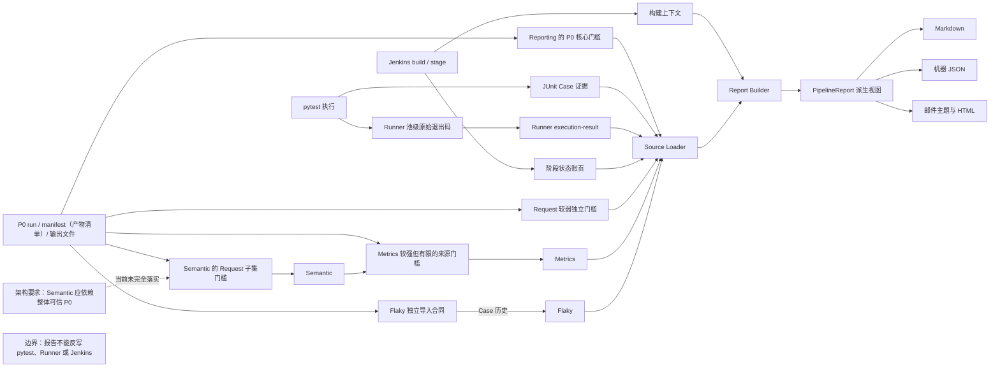
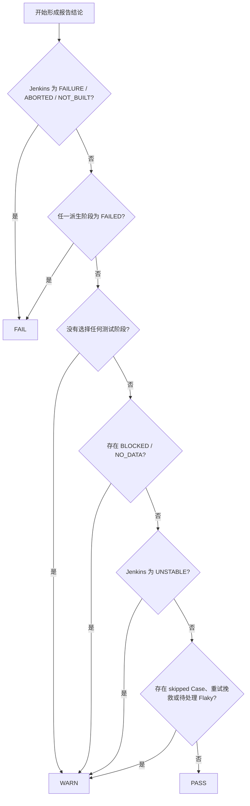

# 第 08 课：事实所有权、能力边界与设计取舍

> 课时：75 分钟  
> 核心问题：当 Jenkins、Runner、JUnit、Quality、Metrics 和 Flaky 同时给出信息时，谁有权回答什么，最终报告又能做什么？

## 0. 先看一组不能“投票表决”的结果

先认识场景中的对象：Jenkins 是运行持续集成流水线并保存构建状态的系统；pytest 是 Python 测试框架；Runner 是本项目的测试编排器；JUnit 是 pytest 输出的结构化测试报告；Quality 子系统负责旁路采集、归并及质量派生；Metrics 是单轮业务指标；Flaky 是跨运行稳定性评估。后文还会区分 Quality 子系统、参与决定是否加载质量产物的开关，以及名为“质量观测”的展示阶段；三者职责不同，也不是同一个事实所有者。

某轮流水线结束后出现下面几条信息：

| 来源 | 看到的信息 |
| --- | --- |
| Jenkins | 构建结果为 FAILURE |
| Runner | 项目级 `final_exit_code=4` |
| JUnit | 文件中的 10 个 Case（测试用例）全部通过 |
| 质量观测展示阶段 | P0（归并后的基础事实层）核心事实可用，但 Metrics 文件缺失 |
| Flaky | 本轮没有评估产物 |

不能用“三条看起来正常、两条异常”做多数表决。每条信息回答的问题不同：

- Jenkins 的 FAILURE 是构建事实，报告不能改成成功。
- Runner 的退出码 4 表示 pytest 用法错误；它比“已写入 JUnit 的部分 Case 都通过”覆盖的执行范围更大。
- JUnit 只能证明文件中成功记录了哪些用例结果，不能证明整个 Runner 正常结束。
- Metrics 缺失只能说明相应指标不可用，不能写成重试次数为 0。
- Flaky 缺失不能推出“没有 Flaky”，只能说本轮没有可用评估。

这节课的第一性原理结论是：

```text
可信汇总
= 明确问题
+ 为原始事实找到所有者
+ 为派生结论声明生成者、输入集合与优先级
+ 保留缺失与冲突
+ 禁止派生视图反向改写来源
```

真正的难点不是把更多字段放进一份 Markdown（面向阅读的文本摘要），而是防止一个方便阅读的汇总页面冒充新的事实所有者。

---

## 1. 本课结论、边界与时间安排

### 1.1 先说结论

`PipelineReport` 是把多个已存在事实整理到一起的结构化派生视图。派生视图是为了阅读和决策重新组织事实的对象，不是新的执行记录。它可以给出 PASS、WARN 或 FAIL 的展示结论，但无权：

- 修改 pytest 已产生的原始退出码；
- 修改 Runner 保存的权威计划、池结果或 `final_exit_code`；
- 修改 Jenkins 已形成的 build 或 stage 结果；
- 把缺失的 JUnit、Metrics 或 Flaky 解释成测得的零或“没有异常”；当前 Markdown、邮件主题和邮件 HTML 都没有完整守住 JUnit 的这条边界，属于后文会明确标出的实现缺陷；
- 让 `QUARANTINED`（Flaky 的人工隔离状态）自动变成 pytest skip。

### 1.2 本课要形成的能力

本课结束后，学习者应能：

1. 区分 pytest、Runner、Jenkins、Aggregator（质量归并器）等事实所有者，JUnit 事实载体、Quality 子系统/开关/展示阶段，以及 PipelineReport 派生视图各自的责任。
2. 根据优先级解释阶段状态与报告结论，而不是混用多个状态轴。
3. 说明为什么可选质量来源要局部降级，缺失不能按零解释。
4. 说明 Markdown（面向阅读的文本摘要）、机器 JSON（结构化数据文件）和邮件怎样共享同一个报告模型。
5. 识别六项框架设计各自的最小前提、主要收益和当前边界。

### 1.3 本课刻意不展开

- 不重新讲传输重试（Retry）、业务轮询（Polling）、质量归并器（Aggregator）、Metrics 或 Flaky 的内部算法。
- 不展开 Allure（步骤与附件诊断报告）生命周期、邮件插件配置或 Jenkins Groovy 语法。
- 不把报告字段逐项做源码导航。
- 不设计新的质量门禁，也不把未来策略写成当前能力。

### 1.4 75 分钟讲授路线

| 时间 | 内容 | 本段要形成的认识 |
| ---: | --- | --- |
| 0～7 分钟 | 冲突场景 | 不同来源不能多数表决 |
| 7～18 分钟 | 所有权与最大约束 | 汇总者不是事实所有者 |
| 18～34 分钟 | 六项设计的共同取舍 | 识别约束、前提、收益和代价 |
| 34～49 分钟 | Reporting 精简代码案例 | 看懂“加载→判定→派生→渲染” |
| 49～54 分钟 | 阶段状态 | 未见失败不等于完整成功证据 |
| 54～60 分钟 | Quality 独立门槛 | 校验更强不等于校验完整 |
| 60～66 分钟 | 总览结论 | 展示结论不替代来源事实 |
| 66～70 分钟 | 输出与失败开放（fail-open） | 把握原子边界和兜底主线 |
| 70～73 分钟 | 边界回看与机动缓冲 | 回到“未知不能按零解释” |
| 73～75 分钟 | 最终总线 | 可信来自边界，而非字段数量 |

代码首遍只跟踪六个决策：是否生成、是否读取 Quality、P0 核心与 Request（一次客户端发送尝试）/Metrics/Flaky 各过什么门槛、阶段事实优先级、总览结论优先级、Python 失败后怎样进入 Jenkins 兜底。解析器细节、字段格式和渲染样式不逐行讲解。

---

## 2. 第一性原理与约束理论：先问“谁有资格回答”

事实所有者是对某类原始事实负责并能写下该事实的组件。消费者可以校验、筛选和派生，但不能因此取得上游所有权。`StageStatus`（单阶段展示状态）和 `PipelineConclusion`（总览展示结论）这类派生结论可以同时消费多个来源；对它们要问的不是“唯一原始来源是谁”，而是“谁生成、读取哪些输入、按什么优先级生成”。

如果不先分所有权，会出现下面的因果链：

```text
多个组件都输出状态
-> 把相似状态当成同一个问题的答案
-> 报告用后生成的值覆盖先发生的事实
-> 故障被美化，或缺失被伪装成零
-> 报告越完整，错误结论越有迷惑性
```

约束理论（TOC）要求先处理限制整体可信度的最窄环节。本课的最大约束不是渲染格式，而是：**原始事实有没有明确所有者，派生结论有没有明确生成合同**。

| 原始事实或派生结论 | 所有者或生成者 | 回答的问题 | Reporting 的权限 |
| --- | --- | --- | --- |
| 收集、执行及池级原始退出码 | pytest | pytest 实际怎样执行和退出 | 读取，不改写 |
| 权威计划、分池、池结果和项目级 `final_exit_code` | Runner | 本轮计划如何被编排并收口 | 校验并展示，不重算原始池退出码 |
| Case 状态与错误证据 | pytest；JUnit 只是有限覆盖范围的事实载体 | 哪些结果已经进入这份 XML（结构化标记文件） | 解析；重复项只保留首条；汇总但不扩大覆盖范围 |
| build、stage 和通知条件 | Jenkins | CI 构建与阶段最终处于什么状态 | 作为上下文读取，不反写 Jenkins |
| P0（经校验归并后提交的基础事实）与完整性 | Aggregator（质量归并器） | 本轮 Case、Request（一次客户端发送尝试）等账页是否可用 | 验证门槛后选取报告字段 |
| 业务指标 | Metrics | 本轮业务粒度的比率、重试和耗时 | 读取已提交结果，不重新计算 Semantic（业务归属证据） |
| 跨运行稳定性 | Flaky | 历史状态与本轮变化是什么 | 展示变化，不改变执行计划 |
| 阶段状态、汇总模型与展示结论 | Pipeline Reporting（派生结论生成者） | 多个输入按既定优先级应怎样展示 | 生成派生视图，不制造第二套测试事实 |

“Quality”本身不占据一个统一的所有者席位：Quality 子系统包含 worker（执行进程）原始采集、Aggregator、Semantic、Metrics、Flaky 等不同职责；Quality 加载开关参与控制 Reporting 是否读质量目录；“质量观测”展示阶段先处理真实接口开关、阻断和 Quality 开关，之后才根据 P0 核心可用性展示为通过或无可用数据。必须继续追问具体是哪一个组件、开关或阶段。

JUnit 的“去重”也不是冲突合并：当前实现只把先到的重复项保留在视图中，后到项不做内容比较，也不产生冲突告警。因此它只能说明“当前汇总保留了哪条”，不能证明重复来源彼此一致；身份规则与精确反例放在附录。

Semantic 是把请求归属到业务对象的证据层。架构要求它依赖整体可信 P0；当前实现尚未完整落实这条边界，只对所需 Request 子集建立有限信任。Metrics 随后执行自身更强、但仍有限的 P0 与 Semantic 来源合同，并间接把业务指标带入报告。两者精确检查什么放在附录。Pipeline Reporting 当前不直接读取 Semantic 产物。Allure 是供人下钻步骤和附件的报告，当前汇总器也不解析它，只提供 Jenkins 中的访问入口。

Source Loader（来源加载器）负责读取并校验报告输入。整体依赖必须保持单向：



图中的实线表示当前数据流：Semantic 只经过 Request 子集门槛；Metrics 按自身更强但仍有限的合同核验 P0 与 Semantic；Flaky 从 P0 独立分叉，按自己的导入合同消费 Case 历史，不读取 Semantic 或 Metrics。指向 Semantic 的虚线表示尚未完整落实的架构要求，不能当作当前保证。Reporting 的 P0 核心门槛是报告侧可用性判断，不等于 Request 分支实际使用了该门槛；独立边界框说明报告没有反向写入权。

---

## 3. 六项设计如何连续解除约束

六项设计不是并列功能清单，也不是一条从头串到尾的依赖链。教学顺序按约束逐步展开；形成 P0 后，业务指标与跨运行治理立即分叉：

```text
调用没有明确终态
-> Retry / Polling 分开传输重试与业务等待
-> 并发后身份与退出事实可能丢失
-> Runner 建立权威集合与稳定身份
-> 直接埋点会污染业务控制流
-> 运行时观察钩子（Runtime Hooks）隔离观察职责
-> 原始分片存在但尚不可信
-> Aggregator 在有限边界内形成 P0

P0 Request ───────────→ Metrics
       └─→ Semantic ─→ Metrics
P0 Case 历史 ───────────────────→ Flaky
```

上图的上下排列是两条并行消费路径：Metrics 同时需要 P0 Request 与 Semantic，Flaky 则直接读取 P0 Case 历史，不读取 Semantic 或 Metrics。叙事后讲 Flaky，不代表它在依赖上位于 Metrics 之后。

| 设计 | 最小前提 | 主要收益 | 当前代价或边界 |
| --- | --- | --- | --- |
| Retry / Polling | 能区分传输失败与业务未就绪，并明确各自预算 | 各自拥有循环单位、终态和预算 | 正确性依赖业务入口选择正确策略；客户端不能保证服务端幂等（重复请求不重复产生副作用） |
| Runner 与稳定身份 | 有权威用例集合和跨进程稳定标识 | 分池、退出事实和跨层记录可对账 | 身份规则与分池合同需要长期稳定 |
| 运行时观察钩子（Runtime Hooks） | 生命周期边界清楚，观察失败可与业务调用隔离 | Quality 可选，Hook 的普通 Exception 不覆盖业务事实 | BaseException（系统退出、中断等非普通 Exception 的基类）不在该保证内；通用安全层还可能静默兜底 |
| Aggregator | 原始分片携带可校验身份、版本与完整性线索 | 在明确边界内形成 P0 可信账本 | 只明确检查预期 execution 的 Case 分片；源哈希主要是记录而非预期比对 |
| Semantic / Metrics | 标准入口能留下业务归属与请求证据 | 恢复业务归属并形成四类统计粒度：稳定用例一次调用的 Case Invocation 项，以及按业务操作、发送组、单次发送聚合的 Operation、Group、Event 桶 | Semantic 当前只对所需 Request 子集建立有限信任；Metrics 执行自身更强、但仍有限的来源合同 |
| Flaky | 多轮数据具有可比身份、Epoch（比较规则纪元）和持久存储 | 自动检测、人工治理和执行行为分层 | 需要可比历史；QUARANTINED 当前不会自动跳过 Case |

这些成本适合异步 LLM API、存在重试计费风险、并发执行、多份机器证据和跨运行治理的场景；对少量同步增删改查（CRUD）、一次性脚本或无需审计的流程可能过重。判断标准不是“设计是否高级”，而是收益能否覆盖身份、字段结构合同（Schema）、manifest、版本、存储和运维成本。

Pipeline Reporting 不成为第七项独立设计。下面只把它作为综合案例，检验前七课形成的事实边界能否在最终展示中继续成立。

---

## 4. Reporting 综合案例：只读汇总怎样形成

读码前按产生方式分四组认识对象。

| 输入与开关 | 最小含义 |
| --- | --- |
| `PipelineContext` | 从流水线环境取得的构建与开关快照 |
| `framework_tests_enabled`、`smoke_collect_enabled`、`real_smoke_enabled` | 是否选择框架单测、用例收集和真实接口测试 |
| `quality_enabled` | 是否启用 Quality 加载；它与 `real_smoke_enabled` 同时为真才读取质量目录 |
| Jenkins 本轮构建结果 | SUCCESS=成功，FAILURE=失败，ABORTED=被中止，NOT_BUILT=未构建，UNSTABLE=不稳定但未失败 |

| 来源 | 最小含义 |
| --- | --- |
| `LoadedPipelineSources` | 保存各来源成功加载的事实及 warning（报告生成提示） |
| unavailable（不可用） | 不能安全展示该来源的值，不代表数值为零 |
| Request Health | 请求技术健康摘要 |

| 加载结果与决策信号 | 最小含义 |
| --- | --- |
| `run_id` / `facts_available` | 质量来源加载得到的本轮标识 / P0 核心门槛结果，不是开关 |
| `has_skipped_cases` | JUnit 摘要中是否存在跳过用例 |
| `has_rescued_request_groups` / `has_actionable_flaky` | 是否存在被重试挽救的请求组 / 待处理的 Flaky 事项 |

| 派生结果 | 最小含义 |
| --- | --- |
| `StageStatus` | 单阶段展示状态：NOT_RUN（未启用）、BLOCKED（被阻断）、NO_DATA（无可用结果）、FAILED（失败）、PASSED（通过） |
| `PipelineConclusion` | 总览判断：FAIL（失败）、WARN（需关注）、PASS（通过） |
| `conclusion_text` | 独立派生的总览说明文字 |
| `actions` | 独立派生的建议列表 |
| `PipelineReport` | 供所有渲染器共同使用的派生模型 |
| 邮件通知标签 FIXED | 上轮为 FAILURE/UNSTABLE、本轮构建结果为 SUCCESS 时表示“已恢复”；不是本轮构建状态 |

第 5、7 节再解释阶段状态与总览结论的优先级。

下面是**跨语言教学重构伪代码**。主体以当前 Python `pipeline_reporting` 为原型，末尾 `jenkins_report_step` 则用 Python 写法重述真实 Jenkinsfile/Groovy 的 `post`（流水线结束后的收尾区）外层，不是仓库中的 Python 函数；`currentBuild` 是 Jenkins 保存当前构建结果的对象。代码保留开关、独立门槛、阶段与结论优先级、正常输出及两级失败出口；省略具体 XML（结构化标记文件）/JSON 字段解析、机械字段复制、文案拼接和样式代码。`first_matching_stage/conclusion` 表示按书写顺序返回第一个条件为真的结果，用有序条件表压缩重复的 `if/return`，而不隐藏优先级。

```python
class PipelineReporting:
    def generate(self, workspace, environment, outputs):
        config = load_report_config(environment)
        if not config.enabled:
            remove_requested_outputs(outputs)
            return None

        context = pipeline_context_from(environment, config)
        include_quality = context.real_smoke_enabled and context.quality_enabled
        sources = self._load_sources(workspace, include_quality)
        stages = self._stages(context, sources)
        conclusion = self._conclusion(context, sources, stages)
        text = derive_conclusion_text_separately(context, sources, stages, conclusion)
        actions = derive_actions_independently(context, sources, stages)
        report = assemble_pipeline_report(context, sources, stages, conclusion, text, actions)

        write_outputs_one_by_one_atomically(report, outputs)  # 整组不是事务
        return report

    def _load_sources(self, workspace, include_quality):
        warnings = []
        base = load_stage_junit_collect_and_runner(workspace, warnings)
        quality = empty_quality_sources()
        if include_quality:
            try:
                quality = self._load_quality(workspace, warnings)
            except Exception as error:
                warnings.append(quality_adapter_unavailable(error))
        return assemble_loaded_sources(base, quality, warnings)

    def _load_quality(self, workspace, warnings):
        run_id, manifest, facts_available = load_p0_identity_and_core_gate(workspace, warnings)
        request_health = load_request_with_manifest_hash(workspace, run_id, manifest, warnings) if run_id and manifest else empty_request_health()
        metrics = load_metrics_with_own_manifest(workspace, run_id, warnings) if run_id else empty_metrics()
        flaky = load_flaky_with_own_contract(workspace, run_id, warnings) if run_id else empty_flaky()
        return assemble_quality_sources(facts_available, run_id, request_health, metrics, flaky)

    def _stages(self, context, sources):
        framework = self._test_stage("框架单测", "framework_tests", context.framework_tests_enabled, sources.unit_tests, sources)
        collect_status = sources.stage_statuses.get("smoke_collect")
        collect = first_matching_stage("用例收集", (
            (not context.smoke_collect_enabled, "NOT_RUN"),
            (collect_status == "FAILED", "FAILED"),
            (collect_status in {"BLOCKED", "NOT_RUN"}, "BLOCKED"),
            (sources.smoke_collect.available, "PASSED"),
            (True, "NO_DATA"),
        ))
        smoke = self._test_stage("接口测试", "real_smoke", context.real_smoke_enabled, sources.smoke_tests, sources)
        quality = self._quality_stage(context, sources, smoke.status)
        return framework, collect, smoke, quality

    def _test_stage(self, name, stage_name, enabled, junit, sources):
        explicit = sources.stage_statuses.get(stage_name)
        runner_failed = (stage_name == "real_smoke" and sources.execution.available
                         and sources.execution.final_exit_code not in {None, 0})
        return first_matching_stage(name, (
            (not enabled, "NOT_RUN"),
            (explicit == "FAILED", "FAILED"),
            (explicit in {"BLOCKED", "NOT_RUN"}, "BLOCKED"),
            (runner_failed, "FAILED"),
            (junit.available and bool(junit.failed or junit.errors), "FAILED"),
            (junit.available, "PASSED"),
            (True, "NO_DATA"),
        ))

    def _quality_stage(self, context, sources, smoke_status):
        return first_matching_stage("质量观测", (
            (not context.real_smoke_enabled, "NOT_RUN"),
            (smoke_status == "BLOCKED", "BLOCKED"),
            (not context.quality_enabled, "NOT_RUN"),
            (sources.quality_facts_available, "PASSED"),
            (True, "NO_DATA"),
        ))

    def _conclusion(self, context, sources, stages):
        attention = (has_skipped_cases(sources) or has_rescued_request_groups(sources)
                     or has_actionable_flaky(sources))
        return first_matching_conclusion((
            (context.build_result in {"FAILURE", "ABORTED", "NOT_BUILT"}, "FAIL"),
            (any(item.status == "FAILED" for item in stages), "FAIL"),
            (no_test_stage_selected(context), "WARN"),
            (any(item.status in {"BLOCKED", "NO_DATA"} for item in stages), "WARN"),
            (context.build_result == "UNSTABLE", "WARN"),
            (attention, "WARN"),
            (True, "PASS"),
        ))

def jenkins_report_step(workspace, environment, outputs):
    if not pipeline_summary_enabled():
        return
    try:
        PipelineReporting().generate(workspace, environment, outputs)
    except Exception as error:
        log_report_failure(error)
        try:
            write_fallback_markdown(workspace)
        except Exception as fallback_error:
            log_fallback_failure(fallback_error)
    # 两次失败都只记日志；这里不修改 Jenkins currentBuild 的结果。
```

最外层早退表示当前 Jenkins 在摘要开关关闭时不会调用 Python，因此也不会触发旧输出清理；`generate()` 内部的关闭分支只描述 Python 服务被直接调用时的行为。其余主线是：各来源按自己的合同加载，局部捕获之外仍有扩大降级范围的出口；报告可以派生结论，Python 失败可由 Jenkins 写兜底，但两者都不能回写 pytest、Runner 或 Jenkins 事实。阶段和总览的具体优先级分别放到第 5、7 节展开。

伪代码没有传入“预期的本轮 run/build 身份”，因为真实 Source Loader 也没有这项共同绑定：阶段账页与 Runner execution-result 没有共同运行身份，Quality 中的 job/build 也不与 `PipelineContext` 比较。因此即使每个文件单独可解析，也不能据此证明 JUnit、Runner、阶段账页和 Quality 必属同一次构建；工作区清理只能降低陈旧文件风险。

---

## 5. 阶段状态不是把几个文件简单相加

### 5.1 五种阶段状态先回答“发生了什么”

`StageStatus` 是报告中每个阶段的展示状态：

| 状态 | 最小含义 |
| --- | --- |
| PASSED | 当前 Builder 从已加载输入中未发现失败；不等于已取得完整成功证据 |
| FAILED | 阶段明确失败，或 Runner/测试证据表明失败 |
| NOT_RUN | 本轮参数没有选择该阶段 |
| BLOCKED | 本轮选择了，但被前序失败或中断阻止 |
| NO_DATA | 本轮选择了，当前却没有可用结果产物 |

NOT_RUN、BLOCKED 和 NO_DATA 不能统一写成“0 个测试”：未选择、未能执行、执行后无可用证据是三种不同事实。

### 5.2 Jenkins 阶段账页为什么需要初始化状态

只有 `GENERATE_PIPELINE_SUMMARY`（生成流水线摘要开关）开启时，Jenkins 才尝试初始化和更新 `pipeline-stage-status.json`；关闭时直接跳过。开启后，选中的阶段先写 BLOCKED，未选择的阶段写 NOT_RUN；阶段真正开始时尝试写 NO_DATA，结束后再由 Jenkins post 分支尝试写 PASSED 或 FAILED。下面是每次写入均成功时的理想路径：

```text
阶段被选择
-> 初始 BLOCKED
-> 真正进入阶段时写 NO_DATA
-> 成功结束写 PASSED
-> failure / unstable / aborted 写 FAILED
```

初始化和更新都采用失败开放：写账页失败只记日志，不阻断流水线。因此，账页可在成功写入时帮助区分“未开始”和“已开始但无产物”，却不能保证精确区分；文件可能缺失，也可能停留在较早的 BLOCKED 或 NO_DATA。Source Loader 必须把账页当成一项输入，而不是把它的存在与时效当作必然条件。

### 5.3 普通测试阶段的判定优先级

对于框架单测和真实接口测试，当前 Builder 按下面顺序判断，命中后停止：

```text
本轮未启用                     -> NOT_RUN
显式阶段状态 FAILED            -> FAILED
显式阶段状态 BLOCKED / NOT_RUN -> BLOCKED
真实接口 Runner final_exit_code 非零 -> FAILED
JUnit 可用且含失败或错误        -> FAILED
JUnit 可用且无失败或错误        -> PASSED
其余                            -> NO_DATA
```

这解释了开场反例：Runner 已记录非零 `final_exit_code` 时，即使 JUnit 中已有的 Case 全部通过，接口阶段仍为 FAILED。JUnit 没有被否定；它只是不能证明尚未进入文件的执行过程也成功。

反方向却存在当前实现缺口：`build=SUCCESS`、已选择真实接口、Runner execution-result 与阶段账页都缺失、JUnit 只有 1 条通过记录且 Quality 关闭时，Builder 会把接口阶段判为 PASSED，最终还可能形成总览 PASS。这里的 PASSED 只表示算法没有从现有输入命中失败条件，不能解释为“已有完整权威证据证明本轮成功”。

Runner 文件存在也不等于其内部事实已经对账。当前 Loader 只做结构与局部字段校验，不检查总计划与各池计划是否集合守恒、池间是否重复，也不核对池状态、池退出码和项目级 `final_exit_code`；Builder 又只使用项目级退出码。因此，内部矛盾但 `final_exit_code=0` 的 Runner 文件配合无失败 JUnit，仍可能得到阶段 PASSED 和总览 PASS。最小反例放在附录。

用例收集阶段不读取 JUnit，而是读取 Jenkins 写下的阶段状态及收集文本。Quality 阶段也有自己的可用性判断：真实接口未启用时为 NOT_RUN，被阻断时为 BLOCKED，Quality 未启用时为 NOT_RUN；其余情况下，P0 核心来源可用便为 PASSED，否则为 NO_DATA。它回答“质量核心事实是否可用”，不是“接口测试是否通过”，所以接口阶段 FAILED 时，Quality 若成功留下可用 P0，仍可能独立显示 PASSED；P0 完整性为枚举成员 `IntegrityStatus.DEGRADED`（落盘值为 `"degraded"`）也不等同于该阶段 FAILED。当前 PASSED 摘要文字是“运行身份与归并事实完整”，但实际门槛允许落盘值 `"degraded"`，因此不能把这句展示文字反推成 `IntegrityStatus.COMPLETE` 或落盘值 `"complete"`。反过来，Quality 阶段为 NO_DATA 时，较弱的 Request 分支仍可能展示数据，不能从阶段状态反推所有质量章节都不可用。

代码锚点一：`pipeline_reporting.sources.load_execution_summary` 验证 Runner 结果结构；`pipeline_reporting.builder._test_stage` 证明显式阶段失败和 Runner 非零退出码优先于 JUnit 通过记录。

---

## 6. Quality 来源采用“局部信任、局部降级”

### 6.1 为什么不是一个总开关读完所有旧文件

只有真实接口测试与 Quality 加载开关同时启用时，Source Loader 才加载 `reports/quality`。否则使用不可用的空对象，也不读取上轮可能遗留的质量文件。基础报告的加载不依赖 Quality 是否启用，也不依赖质量产物；但这不表示它与 `quality` Python 包完全隔绝，解析 JUnit 时仍会按需导入 `quality.junit`。

```text
real_smoke_enabled AND quality_enabled
├─ false：不读取 Quality，质量阶段为 NOT_RUN
└─ true ：按来源分别验证并加载
```

Jenkins 当前真实接口阶段显式开启 Quality、Semantic 和 Metrics。P0 归并返回后，Flaky 的历史与状态包装入口（wrapper）都会被调用；每个包装入口在自己的开关关闭时直接返回，不产生报告。历史开关开启后，本轮已完成且数据库路径有效才实际导入；状态开关开启且导入结果可供评估才实际评估。前提不足时会尝试写 NO_DATA，异常路径还可能产生 FAILED 或没有产物，不能统一概括成 NO_DATA。手工参数的 `RUN_REAL_SMOKE` 默认关闭，但每日参数化定时任务显式设置为 true。因此，“手工默认不执行”不等于当前没有自动执行真实接口的业务路径。数据库路径的精确校验范围放在课后边界查阅。

### 6.2 报告中的质量字段来自哪里

| 报告内容 | 直接来源 | 当前读取门槛 | 不可用时 |
| --- | --- | --- | --- |
| Quality 阶段可用性 | P0 的 `run.json` 与 merged manifest（归并产物清单） | run_id、Schema（字段与类型合同）及版本匹配；manifest complete；`integrity_status`（内容完整性状态）不是小写 `"failed"`；存在 output hashes（输出文件内容摘要）映射 | 质量阶段 NO_DATA |
| 请求总数、报告口径的请求成功率、5xx、超时 | P0 逐行 JSON 文件（JSONL）`request-metrics.jsonl` | 取得 run_id 与 manifest 对象；Request 文件通过 manifest 哈希且每行可作为 JSON 对象读取；只纳入匹配 run_id 的对象，其他 run_id 被忽略并提示；**不检查** `facts_available` | 请求章节仍保留并显示“不可用”；未覆盖异常可能使全部 Quality 来源不可用 |
| 重试挽救与接口耗时 | Metrics manifest 与 `run-metrics.json` | 取得 P0 run_id 后，独立检查 run/schema/aggregation version、complete、可用 Metrics 状态及输出哈希 | 任一所需文件缺失时静默不可用；其他已处理错误通常提示 |
| Flaky 本轮变化 | `flaky-evaluation.json` | 取得 P0 run_id 后，独立检查 run/schema 匹配、评估状态为 EVALUATED（已评估）、NOOP（投影未变化）或 DEGRADED（降级），且所需字段是列表；当前不验证列表成员都是对象 | 文件缺失时静默不可用；非对象成员可能被静默过滤成零计数，详见附录 |

Semantic 不在这张直接来源表中，因为 Reporting 不读取它。Metrics 在自己的上游按自身更强、但仍有限的合同核验 P0 与 Semantic；这不构成“完整可信”的证明。

`IntegrityStatus.FAILED` 是 Python 枚举成员，序列化后的 JSON 值是小写 `"failed"`。Reporting 只拒绝精确字符串 `"failed"`，不检查该字段是否存在，也不验证它是否属于已知枚举；字段缺失、值为 `"ALIEN"`，甚至误写成大写 `"FAILED"` 时，仍可能没有 warning 地得到 `facts_available=True`、质量观测 PASSED，乃至总览 PASS。这是当前门槛缺口，不是可信完整性的证明。

当前 Request Health 的门槛弱于 P0 核心门槛：即使 P0 manifest 未完成、版本不匹配或 `integrity_status="failed"`，只要上述 Request 条件成立，它仍可能展示，而 Quality 阶段同时显示 NO_DATA。这是当前实现事实，不是推荐的信任设计；若希望 Request 也受核心门槛约束，应先修改源码。Flaky 评估文件也没有像 Metrics 那样通过独立 manifest 提供内容哈希。不能把这些来源描述成经过相同强度的验证。

### 6.3 局部降级是目标，但当前捕获范围并不完备

在已经覆盖的错误路径中，如果 P0 Request 输出哈希不匹配，Request Health（请求健康摘要）不可用，但已经独立验证通过的 Metrics 与 Flaky 仍可展示。反过来，Metrics manifest 无效时，请求摘要和 Flaky 仍可保留。不过，“文件缺失”“已捕获的格式错误”和“未捕获异常”必须分开讨论：

```text
Metrics / Flaky 文件不存在
-> 对应来源静默 unavailable，不一定产生 warning

某来源命中已覆盖的校验或解析错误
-> 通常只有该来源 unavailable，并记录 warning

Quality 适配器出现未被局部捕获的异常
-> 外层把 Request、Metrics、Flaky 整体退回 unavailable，并记一条总 warning

JUnit XML 损坏且解析异常未被当前捕获
-> Python 报告生成失败
-> Jenkins 尝试写 fallback Markdown
```

因此，“局部信任、局部降级”是架构目标，不是对任意坏输入的无条件保证。这里的 warning（报告生成提示）也不会自动把 `PipelineConclusion` 升为 WARN。当前结论算法只检查它明确列出的条件，因此可能出现“报告结论 PASS，同时某个可选章节不可用并带 warning”。这不是说缺失不重要，而是当前实现把“总览结论规则”和“来源诊断提示”设计成两个不同通道。

### 6.4 报告口径也必须有名字

报告直接从 P0 Request 记录计算“请求成功”：状态码存在、不是 429、小于 500、没有 timeout，且没有 `error_type`。因此这里的请求成功率不是“HTTP 2xx 比率”，也不是“pytest Case 通过率”。例如预期内的 HTTP 400 可能计入该报告口径的技术成功样本，但是否满足业务断言仍由 pytest Case 决定。

Metrics 提供的重试挽救率和耗时又属于另一套业务聚合口径。字段名称相似时，仍要回到来源和分母，不能由报告标题猜定义。

代码锚点二：`pipeline_reporting.quality_sources.load_quality_sources` 展示 Request、Metrics 与 Flaky 的独立门槛；`pipeline_reporting.sources.load_pipeline_sources` 展示 Quality 适配器未覆盖异常的整体兜底。模块没有直接读取 Semantic 输出。

---

## 7. PipelineConclusion 是展示判断，不是 Jenkins 判决

`PipelineConclusion` 是报告总览使用的派生状态。枚举定义了 PASS、WARN、FAIL 和 NO_DATA，但当前 Builder 的实际分支只产生 PASS、WARN、FAIL；不要因为类中存在 NO_DATA 就声称当前流程会返回它。

当前优先级从上到下为：



`conclusion_text` 由另一套条件顺序独立生成，并不总能准确解释结论枚举。`actions` 又是第三条独立派生链：它不读取 Jenkins 构建结果、`PipelineConclusion`，也不处理 FAILED 阶段。因此开场场景可能同时得到结论 FAIL、说明“本轮流水线执行失败”，以及建议“本轮未发现需要立即处理的问题”。这是当前生成合同的缺陷，具体错位组合放在附录。

上面的 `PipelineConclusion` 枚举顺序带来三个重要边界：

1. 在报告生成时，输入中的 Jenkins 状态已经是 FAILURE、ABORTED 或 NOT_BUILT，Builder 就不会返回 PASS。摘要先于 Allure、归档和通知步骤生成；若后续步骤才使最终构建失败，已有摘要不会自动重新生成。
2. 跳过用例、重试挽救和待治理 Flaky 可以让展示结论变成 WARN，但不会反向修改 Jenkins build result。
3. 普通 warning 列表、单个可选指标缺失或某个请求成功率偏低，不在当前结论升级规则中。

`PipelineConclusion.FAIL` 也只是“报告根据输入形成 FAIL 视图”。生成器没有给 `currentBuild.result` 或 `currentBuild.currentResult` 赋值。事实所有权仍在 Jenkins。

同理，`PipelineConclusion.PASS` 只是当前优先级没有命中 FAIL 或 WARN；它会继承第 5.3 节“Runner 事实缺失而 JUnit 无失败仍可 PASSED”的实现缺口，不能单独充当完整执行成功证明。

---

## 8. 一份模型，多种输出；局部原子，不是整体事务

### 8.1 为什么 Markdown、JSON 和邮件必须共享模型

当前实现先构造一次 `PipelineReport`，再派生：

- `pipeline-summary.md`：默认人工阅读入口；
- `pipeline-summary.json`：机器可读的同源摘要；
- `pipeline-email-subject.txt`：邮件主题素材；
- `pipeline-email.html`：邮件正文。

在一次 Pipeline Reporting 来源加载流程中，框架单测与接口测试会分别发现自己的 JUnit XML，每份发现的 XML 各解析一次；四种自定义输出复用加载结果，不重复解析。Jenkins 的两个 JUnit 发布器（publisher）仍会为各自职责另外解析 XML，不在上述范围内。共享模型不表示四种输出包含完全相同的字段；邮件只选取摘要，但其值仍来自同一个 `PipelineReport`。

当前 Markdown、邮件主题和邮件 HTML 没有一致地先检查 `TestSummary.available`（JUnit 摘要可用标志），可能把不可用 JUnit 的默认空集合或零值渲染成“无异常”或不完整总数。这是现存缺陷，不是可信能力；这些输出不能证明“执行了零个 Case”“没有失败”或“没有跳过”。三个出口的精确表现放在课后边界查阅。

邮件真正发送前，Jenkins 仍会选择 FAILED、UNSTABLE、SUCCESS 或 FIXED 通知分支并替换主题前缀；其中 FIXED 表示跨构建比较后的恢复通知，不是本轮构建结果。邮件可以复用报告内容，但通知标签仍由 Jenkins 决定。

### 8.2 原子文件不等于原子产物组

Python 正常生成路径中的四个文本文件都采用“写临时文件，再 `os.replace`”的方式原子替换，因此读者不会看到半截目标文件。但四个文件按顺序逐个写出，不在同一个事务中：

```text
Markdown 已完整替换
-> JSON 写入失败
-> 本轮可能只留下已经完成的 Markdown
-> 不能把四个文件视为一次共同提交
```

### 8.3 两层 fail-open 的准确边界

失败开放（fail-open）表示报告故障时保留上游结果并继续流水线收尾，而不是用报告异常覆盖测试或构建事实。各 Source Loader 会把它明确覆盖的多类缺失、解析或校验错误转为 unavailable，有些路径会追加 warning，并尽量继续生成其余章节；这不是对任意异常的保证。Quality 适配器的未覆盖异常会让全部 Quality 来源退回不可用；某些 JUnit 解析异常、配置解析、Builder、渲染或输出写入异常则会使 Python 生成调用失败。此时 Jenkins 外层捕获并尝试写最小 fallback Markdown。

兜底摘要只保留构建身份、Jenkins 结果和“详细摘要生成失败”，不猜测 Case 数量。它由 Jenkins `writeFile` 写入，不属于上一节 Python 四文件的原子替换保证。兜底写入若再次失败，Jenkins 只记录日志。邮件发送异常也被捕获。以上路径都不会改写已经形成的 Jenkins 构建结果。

关闭 `GENERATE_PIPELINE_SUMMARY` 时，Python 服务会删除传入路径上的旧摘要并返回 None；当前 Jenkins 在调用前也会检查同一开关。Jenkins 的环境准备阶段还会清理本轮 `reports` 目录，但这只是降低陈旧产物被误读的风险，不能弥补 Source Loader 缺少共同 run/build 身份绑定的边界。

代码锚点三：`pipeline_reporting.service.generate_pipeline_summary` 证明一个模型派生多种输出；Jenkins 的 `generatePipelineSummary` 与 `writeFallbackPipelineSummary` 证明生成失败只写兜底摘要，不修改构建结果。

---

## 9. 最终总线：可信来自不越权

```text
复杂调用先获得明确终态
-> Runner 用权威集合与稳定身份保护执行事实
-> Runtime Hooks 在不控制业务的前提下产生旁路观察
-> worker 原始账页由 Aggregator 做有限信任判断
-> Aggregator 形成 P0 后出现并行消费路径：
   ├─ P0 Request ───────────> Metrics 的较强但有限门槛
   │          └─> Semantic ─> Metrics
   └─ P0 Case 历史 ───────────────────────> Flaky
-> PipelineReport 再按各来源合同形成只读派生视图
-> Markdown、JSON 和邮件共享该视图，但不反写 pytest、Runner 或 Jenkins
```

最后只记住四句话：

1. **先问问题，再找事实所有者。** 相似状态不等于同一事实。
2. **按各自合同判断来源可用，再计算和展示。** 缺失不是零；未覆盖异常仍可能扩大降级范围。
3. **派生结论只能解释，不能篡改。** 报告的 PASS、WARN、FAIL 不替代 Jenkins 或 pytest。
4. **设计价值来自边界。** 终态、身份、非侵入观察、有限信任、业务粒度和历史治理共同构成可信事实链。

本课程的终点不是记住更多类名，而是面对一个新结论时，能够继续追问：它回答什么问题，来自哪份事实，缺失时怎样表达，又有什么权力边界。

---

## 附录：边界查阅（不计入 75 分钟现场讲授）

下面八组细节用于源码核对，不在主线中逐项讲授。

### A.1 JUnit 不可用时的三个渲染缺陷

- Markdown 用例明细直接合并默认空的失败与跳过集合；没有其他相应记录时，会写“无失败用例”“无跳过用例”。
- 邮件主题直接相加两份 JUnit 计数；只有一份不可用时，会把缺失来源的默认零并入总数，把部分数据呈现成整体总数。两份都不可用时，主题会写“测试报告未生成”。
- 邮件 HTML 也直接相加；两份都不可用时可显示“0 总计”，只有一份不可用时则显示不完整汇总。

三者的共同错误不是默认值本身，而是渲染前没有先按 `available` 保留“未知”语义。

### A.2 JUnit 重复身份的 first-wins 边界

当前加载器依次用 `invocation_id`、`case_id`、`classname::name` 作为可用的身份键，并通过 `setdefault` 只保留第一条。若同一身份先出现 PASS、后出现 FAIL，后者会被静默丢弃；当前既不比较两条内容，也不产生冲突 warning。这是现有实现边界，不是“保留冲突”的能力。

### A.3 Semantic 与 Metrics 的 P0 校验差异

- Semantic 检查 manifest 可解析、`run_id`、提交状态、Request 文件哈希和单条 `RequestMetric` 模型；它不读取 `run.json`，也不检查 P0 的 `manifest_version`、`schema_version`、`merge_version` 或 `integrity_status`。
- Metrics 对 P0 增加 `run.json`、`manifest_version`、`schema_version`、提交状态、Request 哈希等检查，并拒绝 `IntegrityStatus.FAILED` 对应的精确 JSON 值 `integrity_status="failed"`；但它不把 P0 `merge_version` 作为门禁，不验证完整性状态是否属于已知枚举，也不比较 manifest 与 `run.json` 的完整性状态。`merge_version` 仅被记录。

因此只能说 Metrics 的合同更强，不能说它完成了对 P0 的全部可能校验。

### A.4 Runner 内部矛盾仍可能得到 PASS

当前 Loader 不校验总计划与各池 `nodeid`（pytest 用例标识）的集合守恒、池间重复，也不核对池状态、池原始退出码与项目级 `final_exit_code`。因此下面这组结构合法但相互矛盾的数据仍会令 `execution.available=True`：

```text
总计划：case-A
池计划：case-B
池状态：ERROR
池原始退出码：4
项目级 final_exit_code：0
JUnit：PASS
-> 接口阶段 PASSED
-> 总览 PASS
```

### A.5 结论、说明文字与建议的错位

`PipelineConclusion`、`conclusion_text` 和 `actions` 分别由三个函数派生，条件并不共享：

| 输入组合 | 结论枚举 | 当前说明文字 | 当前建议 |
| --- | --- | --- | --- |
| Jenkins 为 UNSTABLE，其余条件正常 | WARN | 可能仍为“本轮按配置执行完成” | 按其他独立条件生成 |
| 同时存在 skipped Case 与 NO_DATA 阶段 | WARN；枚举先命中 NO_DATA | 先命中 skipped，显示“存在未覆盖用例” | 分别给出跳过与无数据建议 |
| Runner `final_exit_code=4`、JUnit 10 条通过、Jenkins FAILURE，且没有其他建议条件 | FAIL | “本轮流水线执行失败” | “本轮未发现需要立即处理的问题” |

因此不能把说明文字或建议反推成结论枚举的触发原因。

### A.6 一个会扩大 Quality 降级范围的输入

Request 文件必须先通过 manifest 哈希检查；此后，JSONL 中若出现语法合法的 JSON 标量或数组，逐行读取能够成功，但后续把该值当对象调用 `.get()` 会抛出未被 Request 局部捕获的异常。异常随后到达 Quality 适配器外层，导致本次 Request、Metrics、Flaky 一起退回 unavailable，并增加总 warning。

### A.7 Flaky 列表成员损坏会被静默计为零

Flaky Loader 会先确认 `newly_suspected`、`newly_confirmed`、`recovered`、`overdue` 和 `transitions` 是列表，却在后续转换时静默过滤其中不是对象的成员。若列表只含字符串或数字，来源仍可保持 available，相关计数变成 0，不产生 warning，也不会据此把总览升级为 WARN，最终可能显示 PASS。这是把未知或损坏证据表达成零的当前缺陷。

### A.8 Flaky 数据库路径的当前校验范围

当前配置要求绝对路径、父目录已经存在且可写，已有目标必须是普通文件；UNC（Windows 网络共享）路径会被拒绝。源码不强制路径位于工作区外，也无法单凭路径证明其跨构建持久性，后者仍是部署责任。
