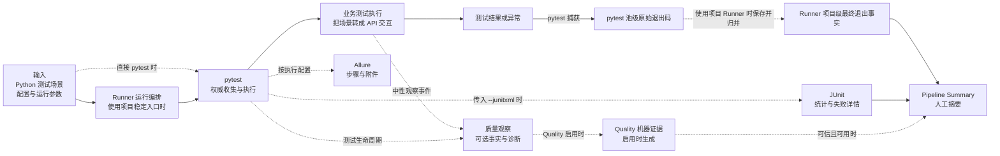
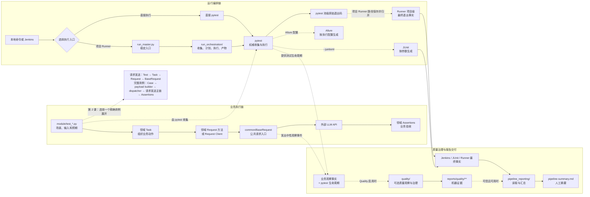

# 第 01 课：项目是一座什么样的工厂

> 本课只建立系统地图，不拆解具体请求实现。学习者的主要任务是听懂、判断和复述，不编写代码，也不执行真实测试。

## 1. 课程信息

| 项目 | 内容 |
| --- | --- |
| 建议时长 | 60～90 分钟 |
| 核心问题 | 项目目录很多，应该先看哪里？ |
| 讲解重点 | 项目本质、六个核心目录、三条主线、测试与报告证据的位置 |
| 课堂活动 | 教师只读演示、职责判断、累积总图讲解 |
| 学习者实践 | 纸面分类与三分钟复述，不运行 pytest |
| 安全边界 | 不执行真实接口，不修改代码，不操作质量数据库 |
| 课后产出 | 第一版项目地图与目录职责说明 |

### 1.1 学完本课，你应该能够

1. 用一句话说明这个项目真正生产什么。
2. 区分业务执行链、运行编排链和质量治理链。
3. 解释六个核心目录分别承担哪一种变化。
4. 说明 pytest、JUnit、Allure、Quality 和 Pipeline Summary 的不同位置。
5. 面对一个需求或故障，先判断应该进入哪条主线、哪个目录。
6. 解释为什么这个项目不只是 pytest 和 requests 的简单封装。

### 1.2 本课刻意不展开

- 不追踪任何具体测试方法。
- 不进入 `BaseRequest.request()` 内部。
- 不解释公共请求机制的内部算法。
- 不学习 Runner 分池细节或 Quality 内部模型。
- 不执行 collect-only；精确收集验证留到第 2 课。
- 不讨论如何新增代码，只讨论应该去哪里理解问题。

本课如果提前进入实现细节，学习者会在没有地图的情况下拆机器，反而失去主线。

### 1.3 课堂必讲路径

课堂只讲五件事：

1. 项目生产什么；
2. 三条主线分别回答什么问题；
3. 六个核心目录的一句话职责；
4. pytest、JUnit、Allure、Quality 和 Summary 的证据边界；
5. 第一版累积总图。

其余文件清单、内部机制和依赖规则均作为讲义扩展阅读，不要求在第一课记忆。

---

## 2. 问题场景：为什么一打开项目就容易迷路

第一次进入项目根目录时，会同时看到：

- 业务测试；
- 请求公共能力；
- pytest 配置；
- Runner；
- JUnit 和 Allure；
- 可选质量诊断；
- Pipeline Reporting；
- Jenkins；
- 大量框架回归测试与运行产物。

这些对象并不是同一层，也不是一条从上到下的线性流水线。

如果直接从某个大文件开始阅读，通常会出现三个结果：

1. 看懂了局部函数，却不知道它为什么存在。
2. 看到了调用关系，却分不清业务处理、执行控制和旁路观察。
3. 记住了很多文件名，遇到新问题时仍然不知道从哪里开始。

### 2.1 典型错误阅读顺序

```text
打开公共请求基类
-> 同时看到请求上下文、横切处理、重试和流式机制
-> 再跳到质量、Runner、报告和配置
-> 每个名词都依赖其他概念
-> 学习范围不断扩大
-> 最后无法复述一次完整因果链
```

### 2.2 因果链

```text
项目包含多种变化方向
-> 不同目录为不同变化建立边界
-> 如果忽略边界，按文件顺序阅读
-> 业务执行、运行调度、质量观察被混成一条链
-> 修改位置和证据来源无法判断
-> 学习者只能依赖全文搜索和猜测
```

### 2.3 TOC：本课真正要解除的约束

本课的约束不是 Python 语法，也不是代码数量，而是：

> **缺少一张能说明“谁负责生产、谁负责调度、谁负责记账、谁负责汇总”的项目地图。**

解除约束的顺序是：

```text
先确定项目输入与输出
-> 再划分三条主线
-> 再给六个目录定位
-> 最后选择一条最短业务切片进入第 2 课
```

本课不追求“读过多少文件”，只追求“能否准确指路”。

---

## 3. 第一性原理：这个项目到底在生产什么

从工具名称看，它使用 pytest、requests 和 Allure；但工具不是项目本质。

一个 LLM API 测试系统至少要回答四个问题：

1. **验证什么？**——业务场景、输入和预期是什么。
2. **怎样执行？**——请求怎样发送，多条用例怎样被收集和组织。
3. **怎样证明？**——通过、失败、请求过程和质量诊断留下什么证据。
4. **怎样交付？**——人怎样快速理解本轮结果，机器怎样继续消费事实。

因此，本项目的本质可以表述为：

> **把不稳定、异步、可计费、可并发的 API 交互，转换成可执行、可归属、可审计、可治理的测试事实。**

### 3.1 输入—处理—输出模型



这张图强调三个事实：

- 测试执行、证据生成和报告汇总不是同一件事。
- 业务代码产生测试结果，不直接生成退出码；pytest 产生池级原始退出码，Runner 在项目稳定入口中保存并形成最终退出事实。
- Quality 是可选观察能力，不是业务请求的固定下一步。

池级退出码怎样合并、Runner 怎样形成最终退出事实，留到第 13、14 课展开。

### 3.2 为什么不是“pytest + requests 封装”

pytest 和 requests 分别解决基础问题：

```text
pytest：发现测试、运行测试、生成退出状态
requests：发送 HTTP 请求并返回 Response
```

但当前项目还需要解决：

- 领域测试怎样组织为 Test、Task、Request 和 Assertions；
- 通用请求语义怎样统一；
- 公共请求与资源生命周期怎样统一；
- 用例怎样权威收集、分池和收口；
- 请求与测试事实怎样归属到一次运行；
- 可选质量诊断怎样与业务结果保持边界；
- Jenkins、JUnit、Allure 和人工摘要怎样协作。

所以它不是“多封装了几个函数”，而是建立了多个变化边界和事实边界。

---

## 4. 生活类比：把项目看成一座工厂

先用工厂建立直觉，再回到准确的代码目录。

| 项目对象 | 工厂类比 | 准确职责 |
| --- | --- | --- |
| `module/` | 业务车间 | 定义具体业务或协议的场景、动作和验收条件 |
| `common/` | 通用设备 | 提供跨业务复用的请求、断言、上下文和运行时能力 |
| `run_orchestration/` | 调度中心 | 组织 pytest 的收集、计划、执行和运行产物 |
| `quality/` | 质量账本与分析室 | 在启用时记录、归并、分析和治理质量事实 |
| `pipeline_reporting/` | 值班日报编辑部 | 汇总已有可信来源，生成人工流水线摘要 |
| `tests/` | 设备检验室 | 用离线回归验证框架公共能力和依赖边界 |

### 4.1 类比不能替代代码事实

“车间”“设备”“调度中心”只帮助建立直觉，最终仍要能说出：

- 具体目录名；
- 输入和输出对象；
- 它允许依赖谁；
- 它不应该承担什么职责。

如果只能记住类比，不能指出代码位置，说明地图仍然不完整。

---

## 5. 讲义扩展阅读：区分源码目录和运行产物

本节用于课后查阅，不纳入第一课课堂必讲。课堂只需知道“源码职责”和“运行产物”不是同一类对象。

阅读项目时，第一步不是打开文件，而是判断它属于源码还是运行产物。

### 5.1 扩展查阅的源码入口

```text
common/
module/
run_orchestration/
quality/
pipeline_reporting/
tests/
run_master.py
pytest.ini
requirements.txt
README.md
FRAMEWORK_TEST_SPEC.md
```

### 5.2 当前实际存在的业务模块

```text
module/
├─ image_model/
├─ material_library/
├─ protocol_testing/
├─ smoke/
└─ video_model/
```

这份列表以当前文件系统为准。文档用于理解设计意图，当前文件树和源码用于确认事实；不存在的历史路径不能进入课程地图。

### 5.3 常见运行产物目录

```text
allure-results/
allure-report/
history_report/
reports/
data/
.pytest_cache/
__pycache__/
```

这些目录保存执行结果、缓存、下载资源或报告，不是新增业务逻辑的默认落点。

### 5.4 为什么必须先做这一区分

```text
把产物当源码
-> 可能追踪陈旧或本轮生成的数据
-> 无法判断信息是否属于当前代码合同
-> 容易把机器证据误认为实现入口
```

反过来，把源码当产物也会导致重要设计被忽略。例如 `pipeline_reporting/` 是源码，而 `reports/pipeline-summary.md` 是它生成的产物。

---

## 6. 六个核心目录分别解决什么变化

判断目录职责时，不要问“里面有什么文件”，先问：

> **哪一类需求发生变化时，这个目录最可能变化？**

### 6.1 课堂必讲：六目录一句话职责

| 变化类型 | 第一定位目录 | 一句话职责 |
| --- | --- | --- |
| 新业务场景或领域断言 | `module/` | 描述要测试什么以及怎样验收 |
| 多模块共享的公共能力 | `common/` | 提供跨业务复用的稳定合同 |
| 一次测试运行的组织 | `run_orchestration/` | 组织收集、计划、执行和结果收口 |
| 可选质量事实与诊断 | `quality/` | 旁路记录、校验和治理质量事实 |
| 人工流水线摘要 | `pipeline_reporting/` | 读取已有事实并生成面向人的摘要 |
| 框架公共能力回归 | `tests/` | 离线验证框架自身的公共合同 |

第一课只要求能根据问题选择第一定位目录，不要求记住目录内部文件名。

<details>
<summary>讲义扩展阅读：目录内部文件、职责细节与依赖规则</summary>

#### `module/`：业务与协议变化

`module/` 负责表达具体业务测试。

它主要回答：

- 要验证哪个模型、协议或业务场景？
- 输入参数和预期是什么？
- 需要执行哪些领域动作？
- 最终怎样判断业务正确？

常见代码角色包括：

```text
test_*.py            场景、参数和预期
task.py              领域动作和业务流程
request.py           领域端点和请求语义
assertions.py        领域验收条件
response_schemas.py  响应结构合同
decorators.py        领域步骤或结果处理入口
```

边界判断：

- 新增一个模型场景，先看 `module/`。
- 某个业务断言发生变化，先看对应模块 Assertions。
- 通用 HTTP 机制发生变化，不应该只在某个模块复制一份实现。

本课只记住：

```text
module/ 描述“要测什么”，不负责重新实现整套测试框架。
```

#### `common/`：跨模块基础能力变化

`common/` 提供多个业务模块共同使用的基础能力，例如：

- `base_request.py`：公共请求入口；
- `request_context.py`：单次请求上下文；
- `request_middleware.py`：横切请求处理；
- `capture.py`：输入和输出资源捕获策略；
- `retry.py`、`retry_executor.py`：重试策略与执行；
- `polling.py`：轮询状态；
- `streaming.py`：流式消费辅助；
- `test_context.py`：用例级变量与清理；
- `base_assertions.py`：通用断言；
- `runtime_hooks/`：中性观察协议。

`common/` 不是“暂时不知道放哪里的代码”的集合。进入这里的能力应同时满足：

1. 多个业务模块确实需要复用。
2. 能使用中性语言描述，不依赖某个具体模型预期。
3. 有稳定公共合同和离线测试。

还要提前记住两个架构边界：

```text
quality -> common.runtime_hooks
common -X-> quality
```

以及：

> `BaseTask` 是兼容门面，不是继续添加新领域逻辑的默认扩展点。

本课不展开这些实现，只建立方向感。

#### `run_orchestration/`：一次运行怎样被组织

pytest 能直接收集和执行测试，但项目还需要组织一次完整运行：

- 参数怎样解析；
- 哪些 nodeid 被权威收集；
- 哪些用例并行、哪些串行；
- 每个执行池怎样调用 pytest；
- 原始退出码怎样保存；
- JUnit、Allure 和可选 Quality 生命周期怎样收口。

这些职责位于 `run_orchestration/`。

常见入口包括：

```text
cli.py
pytest_execution.py
scheduling.py
runner.py
artifacts.py
allure_lifecycle.py
quality_lifecycle.py
quality_pipeline.py
```

关键关系是：

```text
run_orchestration 组织 pytest
pytest 仍然拥有权威收集与测试执行
```

Runner 不是第二套 pytest，也不能自行猜测测试结果。

#### `quality/`：可选质量事实与治理变化

`quality/` 关注的不是“怎样发送业务请求”，而是：

- 本轮运行、执行池、worker 和 Case 怎样获得稳定身份；
- 测试和请求事实怎样被采集；
- 多 worker 分片怎样归并；
- 完整性是否可信；
- 失败怎样分类；
- 请求怎样形成语义和指标；
- 历史不稳定问题怎样进入 Flaky 治理。

第一课只需掌握三个边界：

1. Quality 默认是可选能力。
2. Quality 通过中性 Runtime Hooks 和 pytest 生命周期接入。
3. Quality 关闭或观察失败，不能覆盖业务响应和 pytest 原始结果。

不要把 Quality 画成：

```text
HTTP -> Quality -> Assertions
```

更准确的理解是：

```text
业务执行产生中性观察事件
pytest 提供测试生命周期
-> Quality 启用时在旁路记录与治理事实
```

#### `pipeline_reporting/`：多种事实怎样被人阅读

`pipeline_reporting/` 不执行测试，不重新发送请求，也不重新判断业务断言。

它读取已有来源，例如：

- Jenkins 阶段状态；
- JUnit 统计；
- Runner 执行事实；
- collect-only 输出；
- 启用且可信时的 Quality、Metrics 和 Flaky 诊断。

然后生成：

```text
reports/pipeline-summary.md
```

它的职责可以概括为：

> **从不同权威来源读取事实，整理成面向人的值班日报。**

它不能：

- 用摘要覆盖 pytest 失败；
- 把缺失的可选指标当成零；
- 读取陈旧产物冒充本轮事实；
- 创建第二份并行人工质量报告。

#### `tests/`：框架自身怎样被验证

`tests/` 主要验证公共框架能力，例如：

- Request 和 Middleware 合同；
- Retry、Polling 和 SSE 边界；
- ContextVar 与并发隔离；
- Runner 收集和集合守恒；
- Quality、Metrics、Flaky 和 Reporting；
- 依赖方向和公共导入合同。

它与 `module/` 的区别是：

```text
module/：验证业务 API 和协议行为
tests/：验证测试框架自身的公共行为
```

`pytest.ini` 当前配置：

```ini
testpaths = module
```

所以不带目标直接运行 pytest 时，默认收集业务模块。框架回归需要显式指定 `tests/`。

</details>

---

## 7. 三条主线不是一个线性大链条

项目可以先用三条变化主线理解。

### 7.1 业务执行链

业务执行链回答：

> 一个测试场景怎样变成一次 API 交互和业务判断？

第一课只区分两种范围。

**请求发送主链**回答 Test 怎样进入公共请求入口：

```text
Test
-> Task
->（领域 Request 方法或 Request Client）
-> BaseRequest
```

**完整用例链**还包括输入构造、分发和验收：

```text
Case
-> payload builder
-> dispatcher
-> 请求发送主链
-> Assertions
```

主要涉及：

```text
module/ -> common/ -> 外部 API
```

第 2 课会选择一个单请求协议用例，把这条链展开为真实函数名。

### 7.2 运行编排链

运行编排链回答：

> 本轮要运行哪些测试，pytest 怎样被组织，结果怎样收口？

需要区分两个入口。

#### 直接 pytest

```text
python -m pytest <target>
-> pytest 按配置和命令行收集
-> pytest 执行匹配 item
-> pytest 原始退出码
```

#### 项目稳定入口

```text
run_master.py
-> run_orchestration.cli
-> pytest_execution 权威收集
-> scheduling / runner 组织执行池
-> pytest 执行已分配 nodeid
-> 各执行池返回 pytest 原始退出码
-> Runner 保存并形成项目级最终退出事实
```

这条链主要涉及：

```text
run_master.py -> run_orchestration/ -> pytest
```

### 7.3 质量治理链

质量治理链回答：

> 除了通过和失败，怎样证明事实完整、识别问题类型并观察历史稳定性？

第一课只保留旁路关系：

```text
业务执行事实 + pytest 生命周期 + 标准结果证据
-. Quality 启用时 .-> quality/
-> 机器质量证据
-> 可选质量诊断与治理
```

质量治理链与业务执行链存在观察关系，不是同步处理的固定下一站。

### 7.4 报告交付是多条主线的汇合点

`pipeline_reporting/` 同时读取运行事实和可选质量事实：

```text
pytest / Jenkins / JUnit / Runner 事实
                    \
                     -> pipeline_reporting -> pipeline-summary.md
                    /
可信且可用的 Quality 诊断
```

所以 Reporting 更像汇合层，而不是业务链或 Quality 链中的普通函数节点。

---

## 8. pytest、JUnit、Allure、Quality 和 Summary 各自回答什么

| 对象 | 核心问题 | 典型用途 | 权威边界 |
| --- | --- | --- | --- |
| pytest | 测试进程怎样结束？ | 收集、执行、原始退出码 | 测试进程事实 |
| JUnit | 执行多少项，各种结果多少？ | 标准统计和失败详情 | 测试结果证据 |
| Allure | 某个用例经过哪些步骤？ | 请求响应、附件和步骤下钻 | 用例明细证据 |
| Quality | 事实是否可信，还需要哪些诊断？ | 机器证据与可选治理 | 可选诊断观察 |
| Pipeline Summary | 人最先应该关注什么？ | 构建参数、阶段、测试和诊断摘要 | 人工阅读入口 |

退出事实还要多区分一层：pytest 拥有单次测试进程或执行池的原始退出码；使用项目 Runner 时，Runner 保存这些原始值并形成项目级最终退出事实。具体合并规则留到第 13、14 课。

### 8.1 它们不能互相替代

错误理解：

```text
Allure 很详细，所以不需要 JUnit。
Quality 很全面，所以可以覆盖 pytest 失败。
Summary 很方便，所以原始证据不重要。
```

正确理解：

```text
pytest 决定测试进程事实
JUnit 提供标准结果统计
Allure 提供用例细节
Quality 提供可选诊断
Summary 汇总人需要先看的信息
```

### 8.2 讲义扩展阅读：`pytest.ini` 告诉了我们什么

本节用于课后验证证据边界，不要求在课堂记忆配置项。

当前关键配置是：

```ini
addopts =
    --alluredir=allure-results
testpaths = module
python_files = test_*.py
python_classes = Test*
python_functions = test_*
```

可以得出：

- Allure 原始结果目录默认是 `allure-results/`；
- 默认测试根目录是 `module/`；
- pytest 通过文件、类和函数命名规则发现测试。

但不能得出：

- 每次执行一定生成 JUnit；JUnit 需要 `--junitxml` 等执行参数。
- collect-only 已经执行测试体。
- Quality 默认一定开启。

---

## 9. 讲义扩展阅读：第一课可以查阅哪些入口

本节用于课后查阅。课堂不要求记忆文件名、依赖方向或入口实现。

本课不要求通读文件，只要求每个入口回答一个问题。

| 顺序 | 入口 | 只回答的问题 |
| --- | --- | --- |
| 1 | 当前根目录和六个核心目录 | 项目有哪些源码区域？ |
| 2 | `pytest.ini` | pytest 默认怎样发现测试和输出 Allure raw？ |
| 3 | `requirements.txt` | 项目依赖哪些基础工具？ |
| 4 | `run_master.py` | 稳定运行入口把工作委托给谁？ |
| 5 | `README.md` | 项目希望维持哪些架构边界和使用顺序？ |
| 6 | `FRAMEWORK_TEST_SPEC.md` | 业务模块应该遵守怎样的分层合同？ |

### 9.1 `requirements.txt` 只告诉我们工具，不告诉我们架构

当前核心依赖包括：

| 依赖 | 基础作用 |
| --- | --- |
| `pytest` | 测试收集和执行 |
| `pytest-xdist` | pytest item 并发执行 |
| `requests` | HTTP 客户端 |
| `allure-pytest` | Allure 原始结果 |
| `jsonpath-ng` | JSONPath 查询 |
| `pydantic` | 数据模型与校验 |
| `jsonschema` | JSON Schema 校验 |

依赖列表不能直接说明：

- 为什么要分 Task 和 Request；
- 为什么 Quality 不能被 common 静态依赖；
- 为什么 Runner 必须使用 pytest 权威收集；
- 为什么 Reporting 不能覆盖原始事实。

这些答案来自项目自身的代码边界。

### 9.2 `run_master.py` 为什么很薄

`run_master.py` 主要导入并暴露 `run_orchestration` 的稳定公共入口。

薄入口的价值是：

- 本地和 Jenkins 使用稳定命令；
- 具体实现可以在 `run_orchestration/` 内演进；
- 外部调用者不必了解内部文件拆分；
- 入口文件不成为新的业务逻辑中心。

因此，“文件代码很少”不等于“文件没有架构价值”。

### 9.3 文档和源码怎样配合阅读

推荐规则：

```text
README / SPEC：理解设计意图和约束
当前文件系统：确认路径是否仍存在
当前源码：确认真实调用和行为
现有测试：确认公共合同和边界
```

不要只相信其中一个来源，也不要把已经不存在的历史路径写入当前课程地图。

---

## 10. 可选教师演示：只读观察项目，不运行 pytest

本节只用于教师按需展示，不纳入课堂必讲和学习者验收。

以下命令由教师演示。学习者只需预测输出并解释其意义，不要求独立提交命令结果。

### 10.1 查看六个核心目录是否存在

```powershell
Get-ChildItem common,module,run_orchestration,quality,pipeline_reporting,tests
```

观察重点：

- 哪些目录以领域模块为主；
- 哪些目录以公共框架文件为主；
- 哪些目录包含大量机器模型或状态管理；
- `tests/` 与 `module/` 的文件命名有何相似和不同。

### 10.2 查看当前业务模块

```powershell
Get-ChildItem module -Directory |
  Where-Object Name -ne "__pycache__" |
  Select-Object -ExpandProperty Name
```

观察重点：输出应与本课第 5.2 节的当前模块列表一致。

### 10.3 查看 pytest 发现规则

```powershell
Get-Content pytest.ini
```

观察重点：

- 默认 test root；
- 文件、类和函数命名规则；
- Allure raw 目录；
- `serial` marker。

### 10.4 查看稳定入口

```powershell
Get-Content run_master.py
```

观察重点：它是否自己实现收集、分池和执行，还是把工作委托给 `run_orchestration`？

### 10.5 为什么第一课不运行 pytest

第一课的目标是建立地图。运行 pytest 会引入收集输出、参数化和 nodeid 等新概念，这些将在第 2 课围绕一个精确用例讲解。

```text
当前约束是缺少系统地图
-> 只读目录与配置已经提供足够证据
-> 运行测试不会增强目录职责理解
-> 因此本课不执行 pytest
```

---

## 11. 课堂纸面活动：问题应该先去哪里

请先独立判断，再说明理由。不要只写目录名。

| 问题 | 第一定位 | 你的理由 |
| --- | --- | --- |
| 新增一个视频模型业务场景 |  |  |
| 多个业务模块都需要新的公共请求头规则 |  |  |
| pytest 收集计划出现重复 nodeid |  |  |
| 可选质量证据的分类规则错误 |  |  |
| Pipeline Summary 某个字段来源错误 |  |  |
| 多个模块共享的公共请求机制需要补回归 |  |  |
| 某个 Smoke 领域断言不准确 |  |  |
| 可选质量诊断关闭后仍创建产物 |  |  |

<details>
<summary>完成后展开参考答案</summary>

| 问题 | 第一定位 | 理由 |
| --- | --- | --- |
| 新增一个视频模型业务场景 | `module/video_model/` | 属于具体领域场景变化 |
| 公共请求头规则 | `common/` | 多模块共享的请求语义 |
| 收集计划重复 nodeid | `run_orchestration/` | 属于权威收集和执行计划问题 |
| 可选质量证据分类规则 | `quality/` | 属于质量事实与诊断职责 |
| Summary 字段来源 | `pipeline_reporting/` | 属于已有事实读取与汇总 |
| 公共请求机制回归 | 实现看 `common/`，测试看 `tests/` | 公共能力和框架验证是两个落点 |
| Smoke 领域断言 | `module/smoke/` | 属于具体领域验收条件 |
| 可选质量诊断关闭仍产生产物 | `run_orchestration/` 与 `quality/` | 先判断运行组织与质量职责边界 |

</details>

---

## 12. 第一版课后链路总图

本图只展开目录、主线和产物，不提前展开任何具体函数算法。



### 12.1 怎样阅读这张图

1. 实线表示当前已经确认的主要职责或产物流向。
2. 虚线表示可选观察、配置条件或下一课接口。
3. 三个子图不是严格先后顺序，而是三个变化方向。
4. Quality 没有出现在 HTTP 和 Assertions 之间。
5. Reporting 位于多种事实的汇合点。
6. 第 2 课只展开业务执行链中的一个精确切片。
7. 业务执行只产生测试结果；pytest 产生池级原始退出码，Runner 形成项目级最终退出事实。

### 12.2 总图维护规则

后续每课都在同一张图上增加内容：

- 保留已经掌握的主链；
- 只展开本课新增节点；
- 函数节点写“函数名：职责”；
- 对象节点标明输入、输出或产物；
- 条件判断画出成功、失败、跳过或降级分支；
- 尚未学习的节点使用虚线；
- 每张图后完成三分钟复述。

---

## 13. 常见误区

### 误区一：目录就是调用顺序

目录表示职责边界，不表示 `module -> common -> run_orchestration -> quality -> reporting` 的固定线性调用。

### 误区二：`common/` 是所有共享代码的垃圾桶

进入 `common/` 的能力必须跨模块复用，并具有中性、稳定的公共合同。

### 误区三：Runner 替代 pytest

Runner 组织一次项目级运行，pytest 仍负责权威收集和执行 item。

### 误区四：Quality 是请求成功后的下一步

Quality 是可选旁路观察与治理能力，不是业务响应的同步处理节点。

### 误区五：JUnit、Allure 和 Summary 是同一种报告

JUnit 负责标准统计，Allure 负责步骤和附件，Summary 负责人工汇总。

### 误区六：`tests/` 是所有测试的默认入口

当前 `pytest.ini` 的默认 `testpaths` 是 `module`。框架回归需显式指定 `tests/`。

### 误区七：文档中出现的路径一定仍存在

项目会演进。文档表达意图，当前文件树和源码确认事实。

### 误区八：第一课应该把所有机制讲完

第一课只建立地图。细节过多会重新制造本课试图解除的认知约束。

---

## 14. 三分钟复述

请合上源码，按“项目本质—三条主线—六个目录—证据位置—下一课”复述。

### 14.1 复述模板

```text
这个项目不是简单的 pytest 和 requests 封装，而是把复杂 API 交互转化为可执行、可归属、可审计、可治理测试事实的系统。

项目先分成三条主线。业务执行链中，请求发送主链是 Test、Task、Request 到 BaseRequest；完整用例链还包括 Case、payload builder、dispatcher 和 Assertions。运行编排链由直接 pytest 或 run_master 进入，pytest 负责权威收集与执行并产生池级原始退出码；使用项目 Runner 时，Runner 保存并形成项目级最终退出事实。质量治理链在启用时旁路观察测试事实，不是业务请求的固定下一站。

六个核心目录中，module 负责业务，common 负责公共能力，run_orchestration 负责一次运行，quality 负责可选质量事实，pipeline_reporting 负责人工摘要，tests 负责框架离线回归。

pytest 提供测试进程事实，JUnit 提供标准统计，Allure 提供步骤与附件，Quality 提供可选诊断，Pipeline Summary 汇总本轮最值得人关注的信息。下一课会选择一个精确单请求用例，把业务执行链展开为真实函数调用。
```

### 14.2 复述自检

如果出现以下情况，需要重新阅读对应章节：

- 只能列目录名，不能说明变化类型；
- 把三条主线讲成一个固定线性顺序；
- 把 Quality 说成业务请求必经节点；
- 把 Runner 说成 pytest 替代品；
- 无法区分 `module/` 和 `tests/`；
- 无法说明 JUnit、Allure 和 Summary 的差异。

---

## 15. 课堂小测

### 题目 1

新增一个视频模型业务场景，第一落点通常是：

A. `quality/`  
B. `module/video_model/`  
C. `pipeline_reporting/`  
D. `run_orchestration/`

### 题目 2

修改 pytest 的权威收集和执行池计划，第一落点通常是：

A. `common/`  
B. `module/`  
C. `run_orchestration/`  
D. `pipeline_reporting/`

### 题目 3

查看某个用例的详细步骤、请求响应和附件，优先使用：

A. pytest 退出码  
B. JUnit 统计  
C. Allure  
D. `requirements.txt`

### 题目 4

下面哪项最准确描述 Quality 的位置？

A. HTTP 请求完成后必须先进入 Quality 才能断言  
B. Quality 是可选旁路观察，不覆盖业务结果  
C. Quality 负责生成 pytest 原始退出码  
D. Quality 负责重新执行失败用例

### 题目 5

为什么 `module/` 和 `tests/` 不能看成同一种测试目录？

### 题目 6

为什么 Pipeline Summary 不能覆盖 pytest 或 Jenkins 的明确失败？

<details>
<summary>展开答案</summary>

1. B。
2. C。
3. C。
4. B。
5. 因为 `module/` 验证业务 API 和协议行为，`tests/` 验证框架自身的公共合同。
6. Summary 是读取和整理已有事实的人工入口，不是测试进程或流水线阶段事实的所有者。

</details>

---

## 16. 课后作业：只做地图和解释，不写代码

### 16.1 必做内容

1. 为六个核心目录各写一句职责说明。
2. 为三条主线各写一句核心问题。
3. 复制并重画第 12 节 Mermaid 总图。
4. 从第 11 节问题中任选四个，写出“第一定位 + 理由”。
5. 完成一段 200～300 字三分钟复述。
6. 写出一个仍不理解的虚线节点，留到后续课程解决。

### 16.2 不要求完成

- 不运行 pytest。
- 不执行 collect-only。
- 不新增测试。
- 不修改任何代码。
- 不阅读公共请求、质量模型或 Jenkins 的内部细节。

### 16.3 作业模板

```text
1. 项目本质：一句话
2. 三条主线：各一句话
3. 六个目录：各一句话
4. pytest / JUnit / Allure / Quality / Summary：各一句话
5. 第一版累积总图
6. 四个问题的职责判断
7. 三分钟复述
8. 一个待解决问题
```

---

## 17. 验收标准

完成本课后，应能在 30 秒内为下列问题指出第一方向：

| 问题 | 第一方向 |
| --- | --- |
| 新业务测试 | `module/` |
| 通用请求机制 | `common/` |
| 收集、分池或退出码 | `run_orchestration/` |
| 可选质量事实或诊断 | `quality/` |
| 人工流水线摘要 | `pipeline_reporting/` |
| 框架公共能力回归 | `tests/` |

最终验收问题：

> **为什么这个项目不只是 pytest 和 requests 的简单封装？**

合格答案至少包含：

1. 业务分层和公共请求语义；
2. 项目级收集、执行与产物生命周期；
3. 可选质量观察与业务结果之间的边界；
4. JUnit、Allure 和人工摘要的证据分工；
5. 清晰的职责边界。

如果只能回答“因为文件很多、功能很多”，说明仍停留在数量层面；如果能回答“因为项目围绕不同变化方向建立了业务执行、运行编排和质量治理边界”，说明已经建立第一版系统地图。

---

## 18. 下一课接口

第 2 课会选择：

```text
openai_qwen_allow
```

第 2 课会明确区分两种链路范围。

请求发送主链：

```text
Test
-> Task
-> Request
-> BaseRequest
```

完整用例链：

```text
Case
-> payload builder
-> dispatcher
-> 请求发送主链
-> Assertions
```

下一课会首次执行精确 `collect-only`，并解释：

- Case 如何变成 nodeid；
- 收集为什么不等于执行；
- Test、Task、Request 和 Assertions 分别增加什么语义；
- 为什么要从一条最短单请求切片开始。

到这里，第 1 课完成。你已经知道工厂有哪些部门、每个部门负责什么，以及下一张订单应该从哪里进入。
