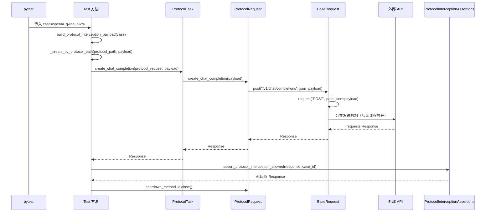
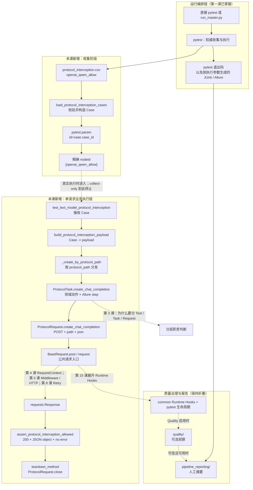

# 第 02 课：从一个单请求协议用例开始

> 本课只追踪参数分支 `openai_qwen_allow`，建立第一条真实函数调用链。不要执行真实用例，不提前学习 BaseTask、Capability、Retry、Polling、计费或 TestContext。

## 1. 课程信息

| 项目 | 内容 |
| --- | --- |
| 建议时长 | 60～90 分钟 |
| 核心问题 | 一个测试方法究竟调用了谁？ |
| 讲解重点 | 收集阶段与执行阶段、Test/Task/Request/Assertions 分工、对象流转 |
| 轻量验证 | 一个精确 nodeid 的 `collect-only` |
| 安全边界 | 不执行测试体，不发送真实 LLM API 请求 |
| 课后产出 | 第二版累积总图和一段三分钟调用链复述 |

### 1.1 学完本课，你应该能够

1. 从测试方法向下追踪真实调用，而不是从公共基类向上猜业务。
2. 说清 `openai_qwen_allow` 五个字段分别控制哪一个判断。
3. 区分 pytest 收集阶段和测试执行阶段。
4. 解释 Test、Task、领域 Request、BaseRequest 和 Assertions 在本切片中的实际职责。
5. 区分并复述本课的两种链路范围：

**请求发送主链**只回答 Test 怎样进入公共请求入口：

```text
Test
-> Task
-> Request
-> BaseRequest
```

**完整用例链**还要包含输入构造、分发与断言：

```text
Case
-> payload builder
-> dispatcher
-> 请求发送主链
-> Assertions
```

### 1.2 本课刻意不展开

- 不比较所有协议和模型参数。
- 不追踪 `anthropic_messages` 分支。
- 不学习 `BaseRequest.request()` 内部的 Middleware、Retry 和 Runtime Hooks。
- 不学习 Polling、SSE、TestContext 或并发执行。
- 不学习 BaseTask 或 Task Capability。
- 不执行真实接口，不验证模型实际返回内容。

看到这些节点时，只在总图中保留虚线接口，留到对应课程再展开。

---

## 2. 承接第一课：从工厂地图进入一张订单

第一课已经建立了工厂地图：

```text
module/：业务车间
common/：通用设备
run_orchestration/：调度中心
quality/：质量账本
pipeline_reporting/：日报编辑部
tests/：设备检验室
```

但地图只能回答“部门在哪里”，不能回答“这一张订单经过了谁”。

本课要把第一课中的抽象业务链：

```text
Test -> Task ->（领域 Request 方法或 Request Client）-> BaseRequest
```

收敛成一条可以逐函数核对的真实路径。

### 2.1 当前认知障碍

初次阅读业务用例时，最容易出现以下行为：

1. 先打开 `BaseRequest`，试图从公共代码猜所有业务。
2. 同时阅读全部参数、全部协议和全部模型。
3. 把 pytest 收集输出误认为测试已经执行。
4. 看见类名 `Task`，就猜它一定继承 BaseTask。
5. 把 Task、Request 和 Assertions 都理解成“另一层封装”。

### 2.2 因果链

```text
一次展开太多分支
-> 每个函数都可能跳向不同协议、模型和公共机制
-> 工作记忆同时保存过多对象
-> 无法判断当前数据由谁产生、由谁消费
-> 最终只能记住文件名，不能复述因果关系
```

### 2.3 TOC：本课的唯一约束

当前约束不是不会读 Python，而是：

> **还没有掌握“只选一条分支，跟随同一个对象向下追踪”的阅读方法。**

解除方法是固定四个边界：

```text
只选一个参数
-> 只选一个协议分支
-> 只看一个 HTTP 方法
-> 只看一个断言分支
```

本课固定为：

```text
参数：openai_qwen_allow
协议路径：openai_chat_completions
HTTP：POST /v1/chat/completions
预期：allow
```

---

## 3. 为什么选择 `openai_qwen_allow`

这一切片适合作为第一条调用链，因为它同时满足五个条件：

1. 只有一次聊天请求，不包含多步骤业务流程。
2. 使用 OpenAI Chat Completions 路径，不需要 Anthropic 特殊请求头。
3. 预期为 `allow`，断言分支比 block 分支短。
4. `ProtocolTask` 直接定义业务方法，没有隐藏的 BaseTask 继承依赖。
5. 可以使用 `collect-only` 安全观察 nodeid，不发送真实请求。

这不是因为它最重要，而是因为它最适合解除当前学习约束。

---

## 4. 先锁定参数：一张 Case 数据卡

参数来自当前文件：

```text
module/protocol_testing/text_model/protocol_interception.csv
```

选定行是：

```csv
case_id,protocol_path,body_protocol,model_id,expected
openai_qwen_allow,openai_chat_completions,openai,qwen3.5-flash,allow
```

它会被转换为不可变对象：

```python
ProtocolInterceptionCase(
    case_id="openai_qwen_allow",
    protocol_path="openai_chat_completions",
    body_protocol="openai",
    model_id="qwen3.5-flash",
    expected="allow",
)
```

### 4.1 五个字段分别控制什么

| 字段 | 当前值 | 在本课中的作用 |
| --- | --- | --- |
| `case_id` | `openai_qwen_allow` | 形成 pytest 参数 ID，也是失败信息中的业务标识 |
| `protocol_path` | `openai_chat_completions` | 决定 `_create_by_protocol_path()` 选择哪个 Task 方法 |
| `body_protocol` | `openai` | 决定使用哪个 payload builder |
| `model_id` | `qwen3.5-flash` | 写入请求体的 `model` 字段 |
| `expected` | `allow` | 决定执行 allowed 还是 blocked 断言 |

这张表是本课最重要的输入合同。后续每一步都可以反问：当前函数消费了哪一个字段？

### 4.2 不要同时追踪整张 CSV

其他行可能改变：

- 协议路径；
- body 协议；
- 模型 ID；
- allow/block 预期；
- payload 的特殊字段。

本课全部忽略。只有在当前字段影响下一次分支判断时，才继续向下阅读。

---

## 5. 两个阶段：收集不等于执行

理解本用例前，必须先把 pytest 的两个阶段分开。

### 5.1 收集阶段

收集阶段会发生：

```text
pytest 导入测试模块
-> 执行 protocol_interception_case_params()
-> load_protocol_interception_cases() 读取 CSV
-> 每行转换为 ProtocolInterceptionCase
-> pytest.param(case, id=case.case_id)
-> 形成参数化 nodeid
```

对于本课分支，最终 nodeid 是：

```text
module/protocol_testing/text_model/test_protocol_interception.py::TestTextModelProtocolInterception::test_text_model_protocol_interception[openai_qwen_allow]
```

### 5.2 执行阶段

只有真正执行这个 item 时，才会发生：

```text
setup_method
-> test_text_model_protocol_interception
-> Task
-> Request
-> BaseRequest
-> HTTP
-> Assertions
-> teardown_method
```

### 5.3 `collect-only` 到底执行了什么

| 动作 | `collect-only` 是否发生 |
| --- | --- |
| 导入测试模块 | 是 |
| 读取参数 CSV | 是 |
| 构造 `ProtocolInterceptionCase` | 是 |
| 生成参数化 nodeid | 是 |
| 执行 `setup_method()` | 否 |
| 构造 `ProtocolRequest` Session | 否 |
| 执行测试方法 | 否 |
| 调用 Task 和 Request | 否 |
| 发送 HTTP 请求 | 否 |
| 执行 Assertions | 否 |
| 执行 `teardown_method()` | 否 |

因此，`collect-only` 能证明“这条用例可被 pytest 正确发现和参数化”，不能证明“接口调用成功”。

---

## 6. 四个角色：不是四层重复封装

本切片包含四个主要业务角色。

| 角色 | 当前代码对象 | 本切片中的实际职责 | 不负责什么 |
| --- | --- | --- | --- |
| Test | `test_text_model_protocol_interception()` | 接收 Case、构造 payload、选择调用路径、选择预期断言 | 不定义 HTTP 端点和公共发送机制 |
| Task | `ProtocolTask.create_chat_completion()` | 用领域动作名组织调用，并提供 Allure step | 本方法不构造 payload，也不继承 BaseTask |
| Request | `ProtocolRequest.create_chat_completion()` | 固定端点、HTTP 方法和请求参数语义 | 不判断 allow/block，不写业务断言 |
| Assertions | `assert_protocol_interception_allowed()` | 校验状态码、JSON 类型以及不应存在 error | 不发送请求，不决定调用哪个端点 |

### 6.1 当前继承关系

```text
ProtocolTask -> object
ProtocolRequest -> BaseRequest -> object
ProtocolInterceptionAssertions -> BaseAssertions -> object
```

这一事实非常重要：

- 当前 Task 方法定义在 `ProtocolTask` 自己身上。
- 本课不需要进入 BaseTask，也不存在找不到方法后被迫追踪继承门面的隐藏依赖。
- Request 通过继承获得 `post()` 和 `request()`。
- Assertions 通过继承复用通用状态码断言。

---

## 7. 推荐的源码阅读顺序

不要按文件大小或继承层次阅读。按当前对象的流向阅读：

1. `protocol_interception.csv`：锁定输入字段。
2. `test_protocol_interception.py`：找到测试方法与当前分支。
3. `task.py`：确认领域动作调用谁。
4. `request.py`：确认端点、HTTP 方法和 kwargs。
5. `base_request.py`：只确认 `post() -> request()`，然后停止深入。
6. `assertions.py`：确认 `expected=allow` 对应哪些判断。

每进入一个函数，只回答五个问题：

```text
1. 输入对象是什么？
2. 当前函数读取了哪些字段？
3. 当前函数新增或改变了什么？
4. 下一次调用是谁？
5. 返回对象是什么？
```

---

## 8. 逐层追踪唯一执行链

下面假设 pytest 真正执行了 `openai_qwen_allow`。课堂不会实际发送请求，但我们可以通过源码准确还原调用关系。

### 8.1 准备阶段：三个协作者被创建

测试类的 `setup_method()` 创建：

```python
self.protocol_request = ProtocolRequest()
self.protocol_assertions = ProtocolInterceptionAssertions()
self.protocol_task = ProtocolTask()
```

这三个对象各自拥有独立职责：

- `protocol_request` 持有继承自 BaseRequest 的 Session 和请求能力。
- `protocol_assertions` 提供领域断言。
- `protocol_task` 提供领域动作入口。

注意：Task 没有在构造时持有 Request，而是在方法调用时显式接收 `protocol_request`。因此依赖关系直接出现在函数参数中。

### 8.2 Test：先把 Case 转换成 payload

测试方法首先执行：

```python
payload = build_protocol_interception_payload(case)
```

由于当前：

```text
case.body_protocol == "openai"
```

因此选择：

```python
build_text_v1_chat_completions_payload(case.model_id)
```

当前 payload 的关键结构是：

```python
{
    "model": "qwen3.5-flash",
    "messages": [...],
    "temperature": 0.7,
    "stream": False,
    "user": "demo-user-001",
}
```

本步骤完成的转换是：

```text
ProtocolInterceptionCase
-> dict[str, Any] payload
```

这里有一个容易混淆的事实：在这个具体切片中，payload 是测试文件中的 builder 构造的，不是 `ProtocolTask.create_chat_completion()` 构造的。课程后续会讨论不同模块为什么可能把 payload 组织放在不同位置；本课只描述当前事实。

### 8.3 Test 内部分发：根据 `protocol_path` 选择动作

接下来执行：

```python
response = self._create_by_protocol_path(case.protocol_path, payload)
```

当前字段：

```text
protocol_path = openai_chat_completions
```

因此进入唯一分支：

```python
return self.protocol_task.create_chat_completion(
    self.protocol_request,
    payload,
)
```

`_create_by_protocol_path()` 的职责是测试场景内部的协议路径分发。它没有：

- 拼接 URL；
- 调用 `requests`；
- 判断响应成功；
- 执行业务断言。

它只回答：

> 当前 Case 选择哪个领域动作？

### 8.4 Task：用领域动作名组织调用

当前进入：

```python
ProtocolTask.create_chat_completion(
    protocol_request,
    payload,
)
```

方法主体是：

```python
return protocol_request.create_chat_completion(payload, headers=headers)
```

这个 Task 方法完成两件事：

1. 用 `create_chat_completion` 表达领域动作。
2. 通过 `@allure_step("OpenAI POST /v1/chat/completions")` 为报告提供业务步骤。

它没有修改 payload，也没有决定最终断言。

#### 为什么一行委托仍然有价值

如果 Test 直接调用 Request，短期代码更少；保留 Task 入口的价值在于：

- 测试方法使用业务动作语言，而不是 HTTP 细节语言；
- Allure step 有稳定落点；
- 将来同一动作需要增加多个业务步骤时，不必把流程塞回测试方法；
- Task 与 Request 的职责可以分别变化。

但也要避免过度解释：当前方法就是一个很薄的领域入口，不应假装它已经承担复杂编排。

### 8.5 领域 Request：固定端点、方法和参数语义

Task 调用：

```python
ProtocolRequest.create_chat_completion(payload)
```

领域 Request 方法执行：

```python
return self.post(
    self.chat_completions_path,
    json=payload,
    **self._build_optional_headers_kwargs(headers),
)
```

当前关键值是：

```text
chat_completions_path = /v1/chat/completions
headers = None
```

所以当前调用可以简化理解为：

```python
self.post(
    "/v1/chat/completions",
    json=payload,
)
```

领域 Request 在这里固定了三个 HTTP 语义：

| 语义 | 当前值 |
| --- | --- |
| HTTP 方法 | POST |
| 相对路径 | `/v1/chat/completions` |
| 请求体传递方式 | `json=payload` |

它没有读取 `case.expected`，因此 Request 不知道本用例期望 allow 还是 block。

### 8.6 BaseRequest：进入统一公共请求入口

`ProtocolRequest` 继承 `BaseRequest`，所以 `self.post()` 实际调用公共方法：

```python
def post(self, path: str, **kwargs):
    return self.request("POST", path, **kwargs)
```

因此本课需要确认的公共边界是：

```text
ProtocolRequest.create_chat_completion
-> BaseRequest.post
-> BaseRequest.request
```

到这里停止深入。

`BaseRequest.request()` 内部还涉及 RequestContext、Middleware、Session、HTTP、可选 Retry 和 Runtime Hooks。它们分别属于后续不同课程：

- RequestContext：第 4 课；
- Middleware 与 HTTP：第 5 课；
- Retry：第 8 课；
- Runtime Hooks：第 15 课。

现在强行展开会破坏本课的请求发送主链。

可以在总图中这样保留接口：

```text
BaseRequest.request
├-. 第 4 课展开 .-> RequestContext
├-. 第 5 课展开 .-> Middleware / HTTP
├-. 第 8 课展开 .-> Retry
└-. 第 15 课展开 .-> Runtime Hooks
```

这些是 `BaseRequest.request()` 内部不同职责的课程接口，不表示四者按上述顺序线性执行。

### 8.7 Response：沿原调用方向逐层返回

公共请求入口最终返回一个：

```python
requests.Response
```

返回路径与调用方向相反：

```text
BaseRequest.request
-> BaseRequest.post
-> ProtocolRequest.create_chat_completion
-> ProtocolTask.create_chat_completion
-> _create_by_protocol_path
-> test_text_model_protocol_interception
```

每一层都直接返回同一个 Response，没有在本切片中转换成新的领域结果对象。

### 8.8 Test：根据 `expected` 选择断言

响应回到测试方法后，读取：

```text
case.expected = allow
```

因此执行：

```python
self.protocol_assertions.assert_protocol_interception_allowed(
    response,
    case_id=case.case_id,
)
```

allowed 断言依次确认：

1. HTTP 状态码等于 200。
2. 响应体可以解析为 JSON。
3. JSON 顶层是对象。
4. 顶层不包含 `error` 字段。

其中状态码检查复用 `BaseAssertions.assert_status_code()`，其余判断属于协议拦截领域规则。

这说明 Assertions 的价值不是“再包一层 assert”，而是把可以复用、可以命名的领域验收条件集中起来。

### 8.9 清理阶段：关闭 Request 持有的 Session

测试结束后执行：

```python
self.protocol_request.close()
```

`close()` 来自 BaseRequest，负责关闭 `requests.Session`。

本课只需记住：

```text
谁创建长期资源，谁负责在明确生命周期中关闭。
```

资源清理的系统化处理会在后续 TestContext 和 SSE 课程继续展开。

---

## 9. 链路范围与对象流不是同一件事

### 9.1 请求发送主链与完整用例链

请求发送主链只保留从 Test 到公共请求入口的核心委托关系：

```text
test_text_model_protocol_interception
-> ProtocolTask.create_chat_completion
-> ProtocolRequest.create_chat_completion
-> BaseRequest.post / request
```

其中 payload builder 和 dispatcher 都位于 Test 层内部。展开它们以后，得到完整用例调用链：

```text
test_text_model_protocol_interception
-> build_protocol_interception_payload
-> _create_by_protocol_path
-> ProtocolTask.create_chat_completion
-> ProtocolRequest.create_chat_completion
-> BaseRequest.post
-> BaseRequest.request
-> ProtocolInterceptionAssertions.assert_protocol_interception_allowed
```

### 9.2 对象流

对象流回答“什么数据发生了变化”：

```text
CSV row
-> ProtocolInterceptionCase
-> payload dict
-> requests.Response
```

断言不会再生成一个新的“allow 结果”对象。它产生的是控制结果：

```text
断言通过并返回原 Response
或
抛出 AssertionError
```

### 9.3 每层对对象做了什么

| 节点 | 输入 | 新增或选择 | 输出 |
| --- | --- | --- | --- |
| Case loader | CSV row | 校验字段并构造对象 | `ProtocolInterceptionCase` |
| Test payload builder | Case | 选择 OpenAI builder，写入 model | payload dict |
| Test dispatcher | protocol path + payload | 选择 Task 方法 | Response 调用结果 |
| Task | Request + payload | 增加领域动作与 Allure step | Response |
| Request | payload | 固定 POST、路径、`json=` | Response |
| BaseRequest | method、path、kwargs | 进入公共请求机制 | Response |
| Assertions | Response + case ID | 验证 allow 合同 | 原 Response |

如果只能画函数箭头，不能说明对象怎样变化，说明理解仍停留在“调用记忆”；如果能同时解释函数链和对象流，才真正掌握了这条切片。

---

## 10. 时序图：一张订单怎样往返



这张图只表达本课关心的接口。BaseRequest 内部仍被折叠为一个节点。

---

## 11. 轻量验证：只收集一个精确 nodeid

本课唯一需要学习者亲自执行的命令是：

```powershell
.\.venv\Scripts\python.exe -m pytest `
  "module/protocol_testing/text_model/test_protocol_interception.py::TestTextModelProtocolInterception::test_text_model_protocol_interception[openai_qwen_allow]" `
  --collect-only -q
```

### 11.1 运行前先预测

不要立刻运行。先回答：

1. CSV 会不会被读取？
2. `ProtocolInterceptionCase` 会不会被构造？
3. `setup_method()` 会不会创建 `ProtocolRequest`？
4. `ProtocolTask.create_chat_completion()` 会不会执行？
5. 是否会发送 HTTP 请求？

正确预测是：前两项会发生，后三项不会发生。

### 11.2 预期输出

应该看到一个精确 nodeid，以及一条 collected 汇总：

```text
module/protocol_testing/text_model/test_protocol_interception.py::TestTextModelProtocolInterception::test_text_model_protocol_interception[openai_qwen_allow]
```

这条输出证明：

- 测试模块可以导入；
- CSV 参数可以被读取和校验；
- `case_id` 成功成为 pytest 参数 ID；
- 精确 nodeid 可以被 pytest 定位。

它不能证明：

- payload 一定被外部 API 接受；
- HTTP 请求一定成功；
- allow 断言一定通过；
- Allure 一定产生业务步骤。

### 11.3 为什么不用真实执行验证调用链

```text
本课目标是理解函数与对象关系
-> 源码已经给出静态调用证据
-> collect-only 可以证明参数化入口存在
-> 真实执行会引入网络、费用、配置和外部状态
-> 这些变量不能帮助解决当前认知约束
-> 因此不执行真实用例
```

---

## 12. 教师演示：用现有离线测试补充证据

以下命令由教师演示或学习者选做，不作为提交要求：

```powershell
.\.venv\Scripts\python.exe -m pytest `
  tests/test_protocol_interception_cases.py `
  tests/test_protocol_interception_payloads.py `
  tests/test_protocol_request.py -q
```

演示时不要求理解所有测试，只观察三类证据：

| 测试文件 | 主要证明什么 |
| --- | --- |
| `test_protocol_interception_cases.py` | CSV 字段、默认矩阵和非法数据校验 |
| `test_protocol_interception_payloads.py` | 不同 Case 怎样影响 payload 字段 |
| `test_protocol_request.py` | 领域 Request 怎样传递路径、JSON 和协议请求头 |

学习者的任务不是复写这些测试，而是回答：

> 这条测试冻结的是 Case、payload 还是 Request 合同？

---

## 13. 课堂纸面练习：给每个箭头写理由

请在不修改代码的情况下补全下表。

| 当前节点 | 下一节点 | 为什么会走这条分支 | 传递的对象 |
| --- | --- | --- | --- |
| CSV row | `ProtocolInterceptionCase` |  |  |
| Case | OpenAI payload builder |  |  |
| Test | `_create_by_protocol_path` |  |  |
| dispatcher | `ProtocolTask.create_chat_completion` |  |  |
| Task | `ProtocolRequest.create_chat_completion` |  |  |
| Request | `BaseRequest.post` |  |  |
| Response | allowed assertion |  |  |

<details>
<summary>完成后展开参考答案</summary>

| 当前节点 | 下一节点 | 原因 | 传递对象 |
| --- | --- | --- | --- |
| CSV row | `ProtocolInterceptionCase` | loader 校验五个必填字段并构造 dataclass | 五个字符串字段 |
| Case | OpenAI payload builder | `body_protocol == "openai"` | `model_id` |
| Test | `_create_by_protocol_path` | payload 已构造，需要按协议路径选择动作 | `protocol_path`、payload |
| dispatcher | `ProtocolTask.create_chat_completion` | `protocol_path == "openai_chat_completions"` | Request 对象、payload |
| Task | `ProtocolRequest.create_chat_completion` | 当前领域动作对应聊天完成接口 | payload、可选 headers |
| Request | `BaseRequest.post` | 领域方法固定 POST 和 `/v1/chat/completions` | path、`json=payload` |
| Response | allowed assertion | `expected == "allow"` | Response、case ID |

</details>

---

## 14. 第二版课后链路总图

本图保留第一课的运行、质量和报告边界，只展开本课新增的业务节点。课堂实际只执行收集，真实执行链通过源码讲解掌握。



### 14.1 总图新增了什么

相比第一课，本课只增加：

- CSV Case 输入；
- 参数化 nodeid；
- Test 方法；
- payload builder；
- 测试内分发方法；
- `ProtocolTask.create_chat_completion()`；
- `ProtocolRequest.create_chat_completion()`；
- `BaseRequest.post/request`；
- allow 断言；
- Request Session 清理。

没有增加 BaseTask、Capability、Retry、Polling 或 TestContext，因为当前切片没有经过这些节点。

---

## 15. 常见误区

### 误区一：看到 nodeid 就说明请求执行成功

nodeid 只证明 pytest 能收集这个 item。`collect-only` 不执行测试体。

### 误区二：`openai_qwen_allow` 就是模型 ID

它是 `case_id`。当前模型 ID 是 `qwen3.5-flash`。

### 误区三：payload 一定由 Task 构造

在本切片中，payload builder 位于测试文件，Task 只做领域委托。必须描述当前代码，而不是套用抽象模板。

### 误区四：`ProtocolTask` 的方法来自 BaseTask

当前 `ProtocolTask` 直接继承 `object`，`create_chat_completion()` 定义在自身类中。

### 误区五：Request 决定 allow 还是 block

Request 只负责 HTTP 语义。`expected` 由 Test 读取，具体判断由 Assertions 完成。

### 误区六：Task、Request 都只是没有价值的转发

当前实现确实很薄，但两者分别稳定业务动作语言和 HTTP 端点语义。判断是否有价值应看变化边界，而不是只看代码行数。

### 误区七：本课应该继续深入 BaseRequest

本课只确认公共入口。过早展开 Middleware、Retry 和观察机制会重新引入多分支认知负荷。

---

## 16. 三分钟复述

请合上源码，按照“输入对象—函数调用—对象变化—返回与断言”的顺序复述。

### 16.1 复述模板

```text
本课选择 CSV 中的 openai_qwen_allow。它被加载为 ProtocolInterceptionCase，其中 protocol_path 决定调用 OpenAI Chat Completions，body_protocol 决定使用 OpenAI payload builder，model_id 写入 payload，expected 决定走 allow 断言，case_id 成为 pytest 参数 ID。

pytest 收集时会导入模块、读取 CSV、构造 Case 并生成 nodeid，但 collect-only 不执行 setup_method、测试体、Task、Request 或 HTTP。

真实执行时，测试方法先把 Case 转成 payload，再由 _create_by_protocol_path 选择 ProtocolTask.create_chat_completion。Task 用领域动作名和 Allure step 组织调用，然后委托 ProtocolRequest.create_chat_completion。Request 固定 POST、/v1/chat/completions 和 json=payload，再进入继承自 BaseRequest 的 post/request 公共入口。Response 按原路径返回测试方法，因为 expected 是 allow，所以 Assertions 检查状态码 200、JSON 顶层对象且没有 error。最后 teardown 关闭 ProtocolRequest 持有的 Session。

这条链没有经过 BaseTask 或 Capability，BaseRequest 内部机制留到后续课程。
```

### 16.2 复述自检

复述时应能回答：

- 哪个字段选择 payload builder？
- 哪个字段选择 Task 方法？
- 哪个字段选择断言分支？
- 当前 payload 在哪一层构造？
- 当前 Task 是否继承 BaseTask？
- `collect-only` 停在哪个位置？

---

## 17. 课堂小测

### 题目 1

哪个字段决定调用 `ProtocolTask.create_chat_completion()`？

A. `case_id`  
B. `protocol_path`  
C. `model_id`  
D. `expected`

### 题目 2

当前 payload 由谁构造？

A. `ProtocolTask.create_chat_completion()`  
B. `ProtocolRequest.create_chat_completion()`  
C. 测试文件中的 `build_protocol_interception_payload()`  
D. `BaseRequest.request()`

### 题目 3

`ProtocolRequest.create_chat_completion()` 主要固定什么？

A. allow/block 预期  
B. HTTP 方法、路径和 `json=payload`  
C. pytest nodeid  
D. JUnit 统计

### 题目 4

执行精确 `collect-only` 时，下面哪项会发生？

A. `setup_method()` 创建 Session  
B. 发送 POST 请求  
C. 读取 CSV 并生成参数化 nodeid  
D. 执行 allowed 断言

### 题目 5

当前 `ProtocolTask` 的继承关系是什么？

A. `ProtocolTask -> BaseTask`  
B. `ProtocolTask -> BaseRequest`  
C. `ProtocolTask -> object`  
D. `ProtocolTask -> ProtocolRequest`

### 题目 6

allowed 断言除了状态码 200，还检查什么？

A. 一定包含 usage  
B. JSON 顶层是对象且不存在 error  
C. 一定返回流式数据  
D. 一定发生重试

<details>
<summary>展开答案</summary>

1. B。
2. C。
3. B。
4. C。
5. C。
6. B。

</details>

---

## 18. 课后作业：不写代码，完成调用链说明

### 18.1 必做内容

1. 为 `openai_qwen_allow` 制作五字段数据卡。
2. 分别画出收集阶段和执行阶段，不能混成一条线。
3. 在执行链每个箭头上写出传递对象。
4. 写一段 200～300 字三分钟复述。
5. 用两句话解释为什么本课不需要学习 BaseTask。

### 18.2 不要求完成

- 不新增测试。
- 不修改业务代码。
- 不执行真实 API。
- 不追踪其他 CSV 参数。
- 不展开 BaseRequest 内部实现。

### 18.3 作业模板

```text
1. Case 数据卡
2. 收集阶段图
3. 执行阶段图
4. 函数调用链
5. 对象流
6. 四层职责说明
7. 三分钟复述
8. 一个仍未解决的问题
```

---

## 19. 验收标准

完成本课后，你应该能在不打开源码的情况下回答：

1. `openai_qwen_allow` 如何变成 pytest nodeid？
2. 为什么 `collect-only` 不会创建 `ProtocolRequest`？
3. payload 是在哪个函数中构造的？
4. `_create_by_protocol_path()` 读取哪个字段？
5. Task 为当前调用增加了什么语义？
6. Request 固定了哪三个 HTTP 要素？
7. BaseRequest 在本课追踪到哪里停止？
8. Response 怎样回到测试方法？
9. allowed 断言验证哪些条件？
10. 为什么这条链不包含 BaseTask 和 Capability？

### 19.1 合格复述

合格答案必须同时包含：

- 参数字段与分支的对应关系；
- 收集和执行的区别；
- Test、Task、Request、Assertions 的职责；
- `ProtocolRequest -> BaseRequest` 的继承关系；
- Response 的返回路径；
- 当前切片没有经过的节点。

如果只能背出文件名或箭头，不能说明对象变化和分支原因，说明还没有真正掌握本课。

---

## 20. 下一课接口

下一课将回答：

> 如果一条调用链已经能工作，为什么还要分 Test、Task、Request 和 Assertions？

下一课会对比：

```text
领域 Request 方法路径
ProtocolTask -> ProtocolRequest -> BaseRequest

兼容能力路径
Task -> Request Client -> BaseRequest
```

但仍然遵守当前架构边界：

- BaseTask 是兼容门面，不继续扩张。
- 新领域逻辑进入领域 Task。
- 只有跨模块复用时才建立窄 Capability。

到这里，第 2 课完成。你已经从“知道工厂有哪些部门”，走到了“能跟随一张订单说清每次交接”。
