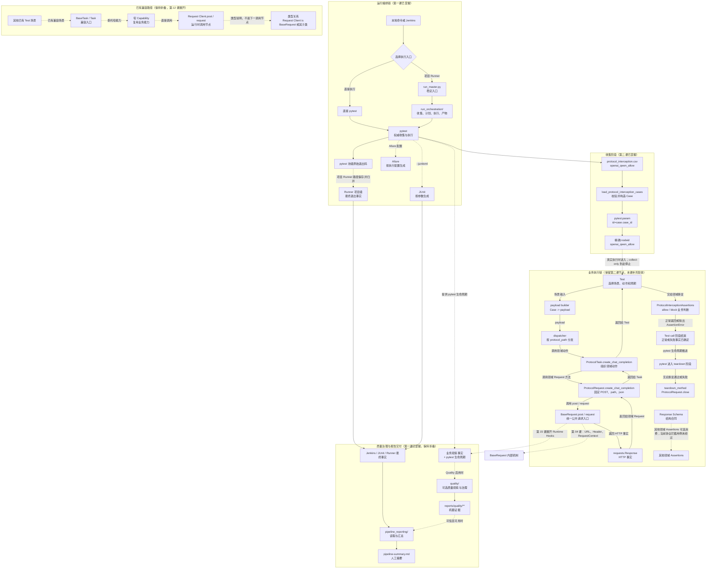

# 第 03 课：为什么要分 Test、Task 和 Request

> 本课不再增加新的协议分支，而是解释第 2 课已经看见的 Test、Task、Request、Assertions 为什么必须分开。课堂只比较职责和变化方向，不展开 BaseRequest 内部机制，也不把 Capability 讲成所有业务的必经层。

## 1. 课程信息

| 项目 | 内容 |
| --- | --- |
| 建议时长 | 60～90 分钟 |
| 核心问题 | 把所有代码写进测试方法不是更直接吗？ |
| 讲解重点 | Test、Task、Request、Assertions、Schema 的变化边界 |
| 代码阅读 | `ProtocolTask.create_chat_completion()` 与 `MediaGenerationCapability.create_chat_completion()` |
| 轻量验证 | 现有离线测试，验证 Request Client、Assertions 和 Schema 的公共合同 |
| 安全边界 | 不执行业务用例，不发送真实 LLM API 请求，不修改业务代码 |
| 课后产出 | 第三版累积总图、4 项职责判断和口头三分钟复述 |

### 1.1 学完本课，你应该能够

1. 从“这段代码因为什么变化”判断它应该放在 Test、Task、Request、Assertions 还是 Schema。
2. 解释为什么一行委托的方法也可能具有明确的架构价值。
3. 区分领域 Request 方法路径与 Request Client 路径，不把两者误认为同一种固定模板。
4. 说明为什么新领域逻辑默认进入领域 Task，而不是继续扩张 BaseTask。
5. 回答新增接口时，什么情况只需要扩展 Request，什么情况还需要新增或修改 Task。

### 1.2 本课刻意不展开

- 不进入 `BaseRequest.request()` 内部。
- 不讲 Middleware、Capture、Retry 和 Runtime Hooks。
- 不讲 Polling、SSE、TestContext 或并发执行。
- 不展开 `operation_scope()` 的质量观察语义。
- 不详细学习 BaseTask 的兼容门面设计；该主题留到第 12 课。
- 不要求新增测试或重构现有代码。

看到上述节点时，只确认它们存在，并在总图中保留虚线接口。

### 1.3 课堂必讲路径

| 环节 | 对应章节 | 建议时间 |
| --- | --- | ---: |
| 问题、约束与第一性原理 | 第 2～5 节 | 8～10 分钟 |
| 五层职责与真实代码 | 第 6～12 节 | 25～30 分钟 |
| 放置判断与新增接口决策 | 第 14～15 节 | 10～12 分钟 |
| 二选一课堂活动 | 第 19 或第 20 节 | 8～10 分钟 |
| 总图、小测与三分钟复述 | 第 21、23、24 节 | 12～15 分钟 |
| 过渡、提问与讨论缓冲 | 全课 | 5 分钟 |

总计约 68～82 分钟。第 19、20 节只能二选一，并分别替代第 12 节的代码复讲或第 14 节的逐项讲解，不得追加执行。第 13、16、17 节用于课后阅读或教师备课；第 18 节为可选离线演示，不计入必讲时间。

---

## 2. 承接第二课：调用链已经能工作，为什么还要分层

第 2 课已经追踪了这一条真实路径：

```text
ProtocolInterceptionCase
-> build_protocol_interception_payload()
-> Test._create_by_protocol_path()
-> ProtocolTask.create_chat_completion()
-> ProtocolRequest.create_chat_completion()
-> BaseRequest.post()
-> Response
-> ProtocolInterceptionAssertions
```

如果只看当前的成功路径，很容易产生一个直觉：

> 这些方法大多只有几行，为什么不直接写进测试方法？

例如，可以想象把代码压缩成下面的形式：

```python
def test_protocol_interception(case):
    payload = build_protocol_interception_payload(case)
    response = requests.post(
        f"{base_url}/v1/chat/completions",
        headers=default_headers,
        json=payload,
        timeout=timeout,
    )
    assert response.status_code == 200
    assert "error" not in response.json()
```

这段代码短期看起来更直接，但它同时把五类决定写进了一个函数：

1. 当前测试什么场景；
2. 怎样组织业务动作；
3. 怎样表达 HTTP 请求；
4. 怎样判断业务结果；
5. 怎样定义响应结构合同。

本课不是为了证明“代码层数越多越好”，而是要回答：

> **哪些变化必须被隔离，才能让修改只影响应该影响的地方？**

---

## 3. 当前认知障碍与因果链

### 3.1 典型认知障碍

初学者通常会用“代码长短”判断是否值得分层：

```text
只有一行委托
-> 看起来没有业务逻辑
-> 认为这一层多余
-> 想把它合并到测试方法或公共基类
```

问题在于，架构边界不是按行数划分，而是按变化原因划分。

### 3.2 如果全部写进 Test，会发生什么

```text
场景选择、payload、URL、请求头和断言写在同一处
-> 任意一种变化都要修改测试方法
-> 相同 HTTP 细节和业务判断被复制到多个用例
-> 同一个接口在不同文件中出现不同实现
-> 修复时需要同时修改多个副本
-> 用例之间逐渐产生不一致
-> 测试失败后无法快速判断是场景、业务动作、传输还是合同问题
```

真正的成本不是多写了几行，而是：

> **一个变化会穿透多少文件，多少调用方需要同时理解和修改。**

### 3.3 TOC：本课真正要解除的约束

当前约束不是“不会写测试”，而是：

> **还没有建立按变化来源放置代码的判断规则。**

如果没有这套规则，新增接口时会反复争论：

- payload 放 Test 还是 Task？
- URL 放 Task 还是 Request？
- 状态码断言放测试方法还是 Assertions？
- JSON 字段逐个断言还是建立 Schema？
- 共享能力继续塞进 BaseTask，还是建立领域 Task？

解除约束的方法不是记住文件名，而是固定一个判断顺序：

```text
先问代码因为什么变化
-> 再问谁拥有这项决定
-> 再确认输入和输出
-> 最后选择文件和方法
```

---

## 4. 第一性原理：分层的本质是隔离变化

### 4.1 从最小事实出发

一次 API 测试至少要完成五件事：

```text
选择场景
-> 发起业务动作
-> 表达 HTTP 交互
-> 判断业务结果
-> 校验响应结构
```

这五件事可能在最初只有几十行代码，但它们的变化来源不同：

| 变化来源 | 例子 |
| --- | --- |
| 产品场景变化 | 新增 allow/block 参数、增加边界条件 |
| 业务流程变化 | 一次调用变成创建后查询、需要提取 task_id |
| 接口协议变化 | 路径、HTTP 方法、header、query 或 body 形式改变 |
| 验收规则变化 | 成功条件、错误信息、安全字段要求改变 |
| 响应合同变化 | 必填字段、字段类型、枚举值或嵌套结构改变 |

如果不同变化来源混在同一个函数里，任何变化都会让这个函数承担额外职责。

### 4.2 分层不是为了“看起来高级”

分层只有在降低变化传播时才有价值。

```text
好的分层
= 一个变化主要落在一个职责所有者
+ 调用方只感知必要影响

坏的分层
= 只是把连续代码机械切成多个文件
+ 每次修改仍要同时改所有层
```

因此，本课不使用“每个接口必须固定五层”这种规则。

我们使用的是：

> **每个重要决定必须有清晰所有者，但不是每个方法都必须经过完全相同的类。**

### 4.3 衡量边界是否合理的三个问题

对任意一段代码，依次询问：

1. 谁最先知道它需要变化？
2. 变化后，哪些调用方应该保持不动？
3. 失败时，应该由哪一层提供最有意义的错误信息？

如果这三个问题的答案都指向同一角色，代码归属通常就清楚了。

---

## 5. 生活类比：点菜单、制作流程、下单和验收

可以把一次 API 测试看成一次餐厅订单：

| 代码角色 | 餐厅类比 | 负责的问题 |
| --- | --- | --- |
| Test | 顾客的订单场景 | 今天点什么、有什么前提、期望什么结果 |
| Task | 后厨制作流程 | 先做什么、后做什么、怎样组合原料 |
| Request | 服务员下单规则 | 送到哪个窗口、使用什么单据、携带哪些信息 |
| Assertions | 验收人员 | 成品是否满足本次业务要求 |
| Schema | 菜品规格书 | 成品必须有哪些组成部分、类型和结构 |

把所有内容写在测试方法里，相当于：

```text
顾客自己写菜单
+ 自己规定后厨步骤
+ 自己决定送餐窗口
+ 自己检查食品安全
+ 自己维护菜品规格书
```

一张订单时似乎可行，订单增加后就会出现：

- 每位顾客写出不同的下单格式；
- 同一道菜出现多个制作版本；
- 同一个验收规则被复制很多次；
- 窗口变化时所有订单都要重写。

### 5.1 类比的边界

类比只用于建立直觉，最终必须回到真实代码：

- Test 不一定亲自构造 payload；
- Task 不一定执行多步流程，一行委托也可能是完整业务动作；
- Request 不等于 `requests` 库，它是项目对端点和请求语义的领域表达；
- Assertions 不拥有请求发送逻辑；
- Schema 是数据合同，不是一个自动执行测试的角色。

---

## 6. 五个角色分别拥有哪一种决定

先建立本课最重要的职责表：

| 角色 | 主要输入 | 拥有的决定 | 正常返回或产物 | 不负责 |
| --- | --- | --- | --- | --- |
| Test | Case、fixture、测试参数 | 场景、前提、调用入口、预期分支 | 无固定数据输出；由 pytest 记录执行结果 | 统一 HTTP 细节、可复用业务流程 |
| Task | 场景参数、领域对象、Request Client | 业务动作、payload 组织、调用顺序、跨请求数据流 | Response 或领域结果 | Session、基础 URL、通用传输机制 |
| Request | payload、path 参数、header 参数 | HTTP 方法、相对路径、query/body/files/header 语义 | Response | 决定本用例为什么调用、结果是否满足业务 |
| Assertions | Response、期望值、Case 信息 | 可复用的业务判断和失败信息 | 正常时返回原 Response | 发请求、安排业务步骤 |
| Schema | 无运行流程；由 Assertions 读取 | 响应结构、必填字段、类型和固定值合同 | 结构校验规则 | 选择场景、发送请求、判断完整业务流程 |

这张表不是按文件名猜职责，而是按“谁拥有决定”划分。

Assertions 失败时会抛出 `AssertionError`。这是控制结果，不是 Assertions 输出的数据对象。

### 6.1 同一个对象可以穿过多层

分层不代表每层都必须创建新对象。

第 2 课中的 `payload` 和 `Response` 会原样穿过多层：

```text
payload
Test -> ProtocolTask -> ProtocolRequest -> BaseRequest

Response
BaseRequest -> ProtocolRequest -> ProtocolTask -> Test -> Assertions
```

层的价值不在于“改变对象”，而在于：

- 固定调用语义；
- 限制可做的决定；
- 为变化提供稳定落点；
- 让调用链能够使用领域语言复述。

---

## 7. Test：拥有场景和预期，不拥有所有实现细节

第 2 课使用的测试入口位于：

```text
module/protocol_testing/text_model/test_protocol_interception.py
```

核心测试方法是：

```python
@pytest.mark.parametrize("case", protocol_interception_case_params())
def test_text_model_protocol_interception(self, case: ProtocolInterceptionCase):
    payload = build_protocol_interception_payload(case)
    response = self._create_by_protocol_path(case.protocol_path, payload)

    if case.expected == "allow":
        self.protocol_assertions.assert_protocol_interception_allowed(
            response,
            case_id=case.case_id,
        )
        return

    self.protocol_assertions.assert_protocol_interception_blocked(
        response,
        case_id=case.case_id,
    )
```

### 7.1 Test 当前拥有的决定

这个方法明确拥有三项场景决定：

1. 使用哪一个 `case`；
2. 根据 `protocol_path` 发起哪种协议动作；
3. 根据 `expected` 选择 allow 或 block 验收。

这些决定属于 Test，因为它们回答：

> 本用例为什么存在，以及本次应该证明什么？

### 7.2 payload 为什么当前在 Test 侧构造

当前协议拦截用例先根据 Case 选择 body protocol，再调用 payload builder：

```python
def build_protocol_interception_payload(case: ProtocolInterceptionCase) -> dict[str, Any]:
    if case.body_protocol == "openai":
        payload = build_text_v1_chat_completions_payload(case.model_id)
    elif case.body_protocol == "anthropic":
        payload = build_text_anthropic_messages_payload(case.model_id)
    else:
        raise ValueError(...)

    if case.model_id == "kimi-k3":
        payload.pop("temperature", None)
    return payload
```

这是当前切片的实现事实，不应被误读成“所有 payload 都必须由 Test 构造”。

判断 payload 放置位置时，要问它为什么变化：

| payload 变化原因 | 更合适的位置 |
| --- | --- |
| 只为表达某个测试参数组合 | Test 或测试数据 builder |
| 是一个领域动作的稳定输入格式 | 领域 Task 或领域 payload builder |
| 被多个测试场景共同复用 | 独立 payload 模块，由 Task 或 Test 调用 |
| 与 HTTP 编码形式强绑定 | Request 接收明确参数后决定 `json`、`data`、`files` 等传输形式 |

因此，职责规则不是“payload 永远放 Task”，而是：

> **Task 对业务动作的输入组织负责，但具体 builder 可以根据复用范围位于领域 payload 模块。Test 只保留场景选择。**

### 7.3 Test 不应该逐步吸收哪些代码

以下变化不应直接复制进每个测试方法：

- 基础 URL 拼接；
- Session 与默认 header 管理；
- 相对路径和 HTTP 方法；
- 通用 Retry；
- 多个测试重复使用的业务动作；
- 多个用例重复使用的成功或失败判断；
- 大段 JSON 结构合同。

否则 Test 会从“可执行场景”退化成“所有实现细节的集合”。

---

## 8. Task：用领域动作组织调用

### 8.1 当前 `ProtocolTask` 做了什么

```python
class ProtocolTask:
    @allure_step("OpenAI POST /v1/chat/completions")
    def create_chat_completion(
        self,
        protocol_request: ProtocolRequest,
        payload: dict[str, Any],
        *,
        headers: dict[str, str] | None = None,
    ) -> requests.Response:
        return protocol_request.create_chat_completion(payload, headers=headers)
```

它只有一行委托，但仍然固定了四件事：

1. 对 Test 暴露领域动作名 `create_chat_completion`；
2. 指定当前动作需要 `ProtocolRequest`；
3. 让调用方不需要知道 Request 内部使用 `post()`；
4. 为 Allure 提供业务可读步骤。

### 8.2 一行委托为什么可能有价值

判断一层是否多余，不能只看当前行数，而要看它是否形成稳定变化边界。

今天的实现可能是：

```text
Task -> 一次 Request
```

未来业务动作可能变成：

```text
Task
-> 构造 payload
-> 创建资源
-> 提取资源 ID
-> 查询状态
-> 清理临时资源
-> 返回最终 Response
```

如果 Test 始终调用同一个领域 Task 方法，业务流程扩展时，测试场景不必同步吸收所有步骤。

### 8.3 Task 可以承担 payload 组织

项目中也存在由 Task 构造 payload 的真实例子：

```python
class SmokeTask(BaseTask):
    def create_chat_completion_for_billing(
        self,
        smoke_request: SmokeRequest,
    ) -> requests.Response:
        chat_response = self.create_chat_completion(
            smoke_request,
            self.build_chat_completions_payload(),
        )
        self.get_request_id_from_response(chat_response)
        return chat_response
```

这里只观察职责，不展开 BaseTask 内部：

- Test 请求“为计费创建一次聊天调用”；
- Task 选择聊天 payload；
- Task 发起业务动作；
- Task 从响应中确认 request ID 可用；
- 调用方得到最终 Response。

这说明 Task 的职责不是机械转发，而是：

> **把底层请求组合成测试场景可以理解的业务动作。**

### 8.4 Task 不负责什么

Task 不应该重新实现：

- Session 创建和关闭；
- `base_url + path` 拼接；
- 默认 header 合并；
- `requests.Session.request()` 调用细节；
- 通用 Retry 和 Middleware 链。

这些是第 4 课开始进入的 BaseRequest 公共请求职责。

---

## 9. Request：固定端点和 HTTP 语义

`ProtocolRequest.create_chat_completion()` 的实现是：

```python
class ProtocolRequest(BaseRequest):
    chat_completions_path = "/v1/chat/completions"

    def create_chat_completion(
        self,
        payload: dict[str, Any],
        *,
        headers: dict[str, str] | None = None,
    ) -> requests.Response:
        return self.post(
            self.chat_completions_path,
            json=payload,
            **self._build_optional_headers_kwargs(headers),
        )
```

### 9.1 Request 当前固定了什么

| 决定 | 当前值 |
| --- | --- |
| 领域动作 | 创建 Chat Completion |
| HTTP 方法 | POST |
| 相对路径 | `/v1/chat/completions` |
| body 传递方式 | `json=payload` |
| 可选调用级 header | 通过 `headers` 参数传入 |

因此，Test 和 Task 不需要重复知道：

```text
这个动作使用 POST
+ 目标是 /v1/chat/completions
+ payload 通过 json 参数发送
```

### 9.2 为什么路径应该集中

如果路径散落在多个测试方法中：

```text
接口路径变化
-> 搜索所有字符串副本
-> 判断哪些是业务代码、测试数据或文档
-> 修改多个位置
-> 某个遗漏副本继续请求旧路径
```

放入领域 Request 后：

```text
接口路径变化
-> 修改 Request 的领域方法或路径常量
-> Task 和 Test 保持领域动作名不变
```

### 9.3 Request 不是业务验收层

Request 可以知道怎样发送请求，但不应该决定：

- allow 用例是否应该返回 200；
- block 用例的错误文案应该包含什么；
- 视频任务最终是否满足成功条件；
- 当前 Case 为什么选择这个模型。

这些分别属于 Assertions、Schema 或 Test。

### 9.4 Request 与 BaseRequest 的边界

本课只追踪到：

```text
ProtocolRequest.create_chat_completion()
-> self.post(...)
```

这里的 `post()` 来自 BaseRequest，但本课不进入其内部。

当前只需要记住：

```text
领域 Request
= 固定具体端点和参数语义

BaseRequest
= 提供统一公共请求入口
```

第 4 课会继续解释 BaseRequest 怎样处理 URL、header、Context 和统一 `request()`。

---

## 10. Assertions：复用业务判断，不复制验收条件

协议拦截 allow 分支使用：

```python
class ProtocolInterceptionAssertions(BaseAssertions):
    def assert_protocol_interception_allowed(
        self,
        response: requests.Response,
        *,
        case_id: str,
    ) -> requests.Response:
        self.assert_status_code(response, 200)
        body = self._json_body(response, case_id)
        assert "error" not in body, (
            "协议拦截 allow 用例不应返回 error。"
            f"case_id={case_id!r}，响应内容：{response.text}"
        )
        return response
```

### 10.1 为什么不直接在每个 Test 中断言

如果 allow 判断复制到文本、图片和视频协议用例：

```text
相同业务规则复制三次
-> 错误信息逐渐不一致
-> 新增安全要求时修改多个文件
-> 某些分支更新，某些分支遗漏
```

集中到领域 Assertions 后：

```text
业务验收规则变化
-> 修改一个领域断言方法
-> 所有调用该方法的场景获得相同行为
```

### 10.2 BaseAssertions 与领域 Assertions 的关系

`BaseAssertions` 提供中性公共原语：

- `assert_status_code()`；
- `assert_json_value()`；
- `assert_json_path_exists()`；
- `assert_schema()`。

领域 Assertions 使用这些原语表达业务含义：

```text
公共原语：状态码等于 200
+ 领域规则：协议拦截 allow 用例不能包含 error
= 可复用的业务验收方法
```

### 10.3 Assertions 不应该做什么

- 不发送补偿请求；
- 不创建资源；
- 不决定调用哪个协议；
- 不偷偷修改 Response；
- 不把业务流程编排隐藏在断言方法中。

Assertions 的失败结果是 `AssertionError`，它表达“事实不符合预期”，不是创建一种新的响应对象。

---

## 11. Schema：把响应结构合同从断言代码中分离

当响应结构较复杂时，如果逐字段写在 Assertions 中，会出现大量重复的嵌套判断。

项目中的视频成功响应使用独立 Schema，当前结构合同如下：

```python
MINIMAX_H3_SUCCESS_RESPONSE_SCHEMA = {
    "type": "object",
    "required": ["task"],
    "properties": {
        "task": {
            "type": "object",
            "required": ["id", "model", "status", "content"],
            "properties": {
                "id": {"type": "string", "minLength": 1},
                "model": {"const": MINIMAX_H3_MODEL_ID},
                "status": {"const": "succeeded"},
                "content": {
                    "type": "object",
                    "required": ["url"],
                    "properties": {
                        "url": {"type": "string", "minLength": 1},
                    },
                },
            },
        }
    },
}
```

领域 Assertions 消费这个合同：

```python
class VideoAssertions(BaseAssertions):
    def assert_minimax_h3_generation_succeeded(
        self,
        response: requests.Response,
    ) -> requests.Response:
        self.assert_status_code(response, 200)
        self.assert_schema(response, MINIMAX_H3_SUCCESS_RESPONSE_SCHEMA)
        return response
```

### 11.1 Assertions 与 Schema 不是重复职责

| 角色 | 回答的问题 |
| --- | --- |
| Assertions | 本次业务结果是否满足预期？ |
| Schema | 响应 JSON 必须具有什么结构？ |

Assertions 可以组合多个条件：

```text
状态码正确
+ Schema 合法
+ 特定业务值满足条件
= 业务成功
```

Schema 只描述结构合同，不能单独说明完整业务是否成功。

### 11.2 什么时候值得独立 Schema

更适合建立独立 Schema 的情况：

- 响应存在多层嵌套结构；
- 多个测试共享相同响应合同；
- 需要校验必填字段、类型、枚举或固定值；
- 接口合同变化需要集中审阅；
- 逐字段断言已经遮蔽业务意图。

不必为只有一个简单字段的临时判断建立庞大 Schema。

---

## 12. 两条真实请求路径：共同目标，不同边界

本课大纲要求比较两个方法：

```text
ProtocolTask.create_chat_completion()
MediaGenerationCapability.create_chat_completion()
```

它们最终都进入 BaseRequest 提供的 `post()`，但路径不同。

### 12.1 路径 A：领域 Request 方法路径

```text
Test
-> ProtocolTask.create_chat_completion()
-> ProtocolRequest.create_chat_completion()
-> BaseRequest.post()
```

关键代码：

```python
def create_chat_completion(
    self,
    protocol_request: ProtocolRequest,
    payload: dict[str, Any],
    *,
    headers: dict[str, str] | None = None,
) -> requests.Response:
    return protocol_request.create_chat_completion(payload, headers=headers)
```

这条路径的特点是：

- Task 调用具有领域名称的 Request 方法；
- Request 方法集中维护路径、HTTP 方法和参数语义；
- `ProtocolRequest` 通过继承获得 BaseRequest 公共请求能力。

### 12.2 路径 B：Request Client 路径

`MediaGenerationCapability.create_chat_completion()` 的核心代码是：

```python
def create_chat_completion(
    self,
    request_client: BaseRequest,
    payload: dict[str, Any],
) -> requests.Response:
    with operation_scope(...):
        return request_client.post(
            self.chat_completions_path,
            json=payload,
        )
```

它不调用某个领域 Request 方法，而是直接使用 Request Client 的公共 `post()`：

```text
BaseTask 兼容门面
-> MediaGenerationCapability.create_chat_completion()
-> Request Client.post()
```

其中 Request Client 的类型是 BaseRequest 或其子类实例。

### 12.3 两条调用路径与类型关系必须分开

路径 A 是当前协议拦截用例真实经过的领域 Request 方法路径：

```text
Test
-> Task
-> ProtocolRequest.create_xxx()
-> BaseRequest.post() / request()
```

路径 B 是已有兼容能力使用的 Request Client 路径：

```text
Test
-> BaseTask / Task
-> Capability
-> Request Client.post() / request()
```

Request Client 与 BaseRequest 之间不是“下一跳”调用关系，而是类型关系：

```text
Request Client is BaseRequest 或其子类
```

因此必须保留三个边界：

1. 两条路径不能把 Request Client 的类型归属伪装成运行时下一跳；
2. Capability 是已有兼容与跨模块复用分支，不是所有请求的必经层；
3. 新领域逻辑默认进入领域 Task，只有确有跨模块复用时才建立窄 Capability。

### 12.4 为什么本课只比较，不展开 Capability

`MediaGenerationCapability` 内部还包含：

- `operation_scope()`；
- 异步任务创建；
- task ID 提取；
- Polling；
- RetryPolicy 参数。

这些机制需要新的前置知识。如果本课继续展开，会从“职责边界”跳到“运行机制”。

因此，本课只保留一句话：

> Capability 是可被 Task 或兼容门面复用的窄业务能力，它可以直接操作 Request Client；详细设计留到第 12 课。

---

## 13. 讲义扩展阅读：关系边界提醒

第 2 课已经区分函数调用链和对象流，本课只补充两个容易混淆的点：

```text
函数调用：ProtocolTask.create_chat_completion()
        -> ProtocolRequest.create_chat_completion()
        -> BaseRequest.post()

继承关系：ProtocolRequest -> BaseRequest

对象流：payload 向下传递，Response 沿原调用方向返回

控制结果：Assertions 通过，或抛出 AssertionError
```

继承关系不是运行步骤，Schema 也不是网络节点。总图必须使用不同边或文字明确关系含义。

---

## 14. “代码应该放哪一层”判断表

这是本课的核心产出。

| 需求或变化 | 首选位置 | 判断理由 |
| --- | --- | --- |
| 新增一个测试参数组合 | Test / Case 数据 | 变化来自测试场景 |
| 选择 allow 或 block 预期 | Test | Test 拥有本次预期分支 |
| 为业务动作构造稳定 payload | Task 或领域 payload builder | 变化来自业务输入组织 |
| 一次动作需要先创建再查询 | Task | 变化来自业务步骤和对象流 |
| 从上一步 Response 提取 ID 给下一步 | Task | Task 负责编排跨请求数据 |
| 修改相对路径 | Request | 变化来自接口端点 |
| GET 改为 POST | Request | 变化来自 HTTP 语义 |
| JSON 改为 multipart files | Request | 变化来自传输形式 |
| 增加接口专用 header | Request | 变化来自协议要求 |
| 多个用例共享状态码判断 | BaseAssertions 或领域 Assertions | 变化来自验收规则复用范围 |
| 判断协议拦截错误文案 | 领域 Assertions | 变化来自领域业务规则 |
| 增加响应必填字段 | response schema | 变化来自响应合同 |
| 增加通用 URL/header/session 处理 | BaseRequest | 变化来自跨领域公共请求机制 |
| 多个领域确实共享一个业务能力 | 窄 Capability | 变化来自跨模块复用；不是默认选择 |

### 14.1 判断顺序

面对一段新代码时，按以下顺序判断：

```text
它是在描述“测什么”吗？
-> 是：Test

它是在描述“业务动作怎样完成”吗？
-> 是：Task

它是在描述“HTTP 怎样发送”吗？
-> 是：Request

它是在描述“结果怎样算正确”吗？
-> 是：Assertions

它是在描述“响应必须长什么样”吗？
-> 是：Schema
```

如果答案仍然不清楚，再问：

> 这个变化发生时，我希望哪些上游调用方完全不用修改？

---

## 15. 新增接口时，什么时候只需要 Request，什么时候还需要 Task

这是本课的验收问题，不能用“看代码复杂不复杂”回答。

### 15.1 只扩展 Request 的情况

当以下条件同时成立时，可能只需要新增或修改 Request 方法：

1. 上层已经存在稳定的 Task 业务动作；
2. 业务步骤、payload 组织和返回语义没有变化；
3. 变化只涉及端点、HTTP 方法、header 或传输参数；
4. Task 仍可以使用原有领域动作名完成调用。

例如：

```text
业务动作仍然是 create_chat_completion
路径从旧端点迁移到新端点
body 仍然是相同 payload
验收规则不变
```

此时变化主要属于 Request。

### 15.2 必须新增或修改 Task 的情况

只要出现以下任一变化，通常就需要 Task：

- 出现新的领域动作名；
- payload 需要根据业务参数组合；
- 一次场景包含多个 Request；
- 需要从前一个 Response 提取数据；
- 需要创建后查询、轮询或清理；
- 需要在多个底层请求中选择一种执行策略；
- Test 如果直接实现会重复业务步骤。

例如：

```text
创建媒体任务
-> 提取 task_id
-> 查询任务状态
-> 返回最终结果
```

这不是单个 Request 的职责，而是 Task 的业务编排职责。

### 15.3 新接口通常不是“只选一层”

一个全新的领域接口经常需要同时增加：

```text
Request：表达新端点
+ Task：表达新业务动作
+ Assertions / Schema：表达新验收合同
+ Test：表达新场景
```

“只需要 Request”描述的是变化范围已经被现有上层动作吸收，而不是鼓励 Test 直接绕过 Task 调用 Request。

### 15.4 不要默认扩张 BaseTask

当前项目的统一边界是：

```text
BaseTask = 兼容门面
新领域逻辑 = 领域 Task
跨模块真实复用 = 窄 Capability
```

因此，新增业务动作时不要因为“很多 Task 都继承 BaseTask”，就直接把新方法放入 BaseTask。

否则会形成：

```text
所有领域都向 BaseTask 添加方法
-> BaseTask 同时知道图片、视频、计费、素材和协议细节
-> 任一领域变化都影响公共门面
-> 公共层逐渐变成新的业务垃圾桶
```

第 12 课会专门解释怎样从兼容门面迁移到窄 Capability。

---

## 16. 教师决策补充：TOC 优先减少变化传播

分层决策不以文件数量最少为目标，而以修改传播最小为目标：

```text
首次实现追求全部写进 Test
-> 相同决定产生多个副本
-> 后续修改需要同步多个位置
-> 评审与回归成本增加
-> 新需求吞吐量下降
```

因此，本课的 TOC 决策是：

> **让场景、业务动作、HTTP 语义、业务判断和结构合同分别拥有清晰的唯一责任落点。**

---

## 17. 教师备课索引：推荐的源码阅读顺序

本课不再沿请求完整下钻，而是横向比较职责。

### 17.1 必讲路径

按以下顺序阅读：

1. `module/protocol_testing/text_model/test_protocol_interception.py`
2. `module/protocol_testing/task.py`
3. `module/protocol_testing/request.py`
4. `module/protocol_testing/assertions.py`
5. `common/task_capabilities/media_generation.py`
6. `module/video_model/assertions.py`
7. `module/video_model/response_schemas.py`

### 17.2 每个文件只回答一个问题

| 文件 | 本课只回答 |
| --- | --- |
| 协议 Test | 场景和预期在哪里选择？ |
| `ProtocolTask` | 领域动作怎样命名并委托？ |
| `ProtocolRequest` | HTTP 方法、路径和 body 怎样固定？ |
| 协议 Assertions | allow/block 业务规则怎样复用？ |
| `MediaGenerationCapability` | 不经过领域 Request 方法时，怎样直接使用 Request Client？ |
| 视频 Assertions | 业务断言怎样组合状态码和 Schema？ |
| 视频 Schema | 复杂响应结构怎样独立表达？ |

### 17.3 本课不要继续追踪

阅读到以下位置立即停止：

```text
BaseRequest.post()
operation_scope(...)
PollingPolicy
RetryPolicy
CapturePolicy
```

停止不是遗漏，而是保持本课只解决一个认知约束。

---

## 18. 可选教师演示：使用现有离线测试观察边界

本课不需要真实 API。可以使用三个现有离线测试作为证据：

```powershell
.\.venv\Scripts\python.exe -m pytest `
  "tests/test_base_task.py::TestBaseTask::test_create_chat_completion_calls_request_client" `
  "tests/test_assertions_entrypoints.py::test_thin_domain_assertions_keep_real_class_identity_and_mro" `
  "tests/test_base_assertions_schema.py::test_chat_completion_success_schema_accepts_minimal_response" `
  -q
```

### 18.1 运行前先预测

| 测试 | 预测它证明什么 |
| --- | --- |
| BaseTask 测试 | 兼容路径最终使用 Request Client 的 `post()` |
| Assertions 入口测试 | 领域 Assertions 仍保留独立类型和继承关系 |
| Schema 测试 | 公共 `assert_schema()` 可以验证一个响应合同并返回原 Response |

### 18.2 这三个测试不能证明什么

它们不能证明：

- 真实 LLM 服务可访问；
- `/v1/chat/completions` 当前线上响应正确；
- 所有业务模块都使用相同调用链；
- BaseRequest 的 Middleware、Retry 或 Runtime Hooks 正确；
- Capability 应成为所有新业务的默认入口。

### 18.3 为什么这组证据适合本课

本课要验证的是职责公共合同，而不是网络成功：

```text
Request Client 接收 path 和 json
Assertions 保留领域身份
Schema 可以被公共断言消费
```

这些都可以完全离线证明。

---

## 19. 二选一课堂活动 A：比较两个 `create_chat_completion()`

本活动用于替代第 12 节的部分代码讲解。选择活动 A 后，第 12 节只讲结论，不再逐行重复比较。

将下面两段代码并排放置。

课堂从第 19.3 节选择 4 个问题讨论，其余问题用于课后自检。

### 19.1 `ProtocolTask`

```python
return protocol_request.create_chat_completion(
    payload,
    headers=headers,
)
```

### 19.2 `MediaGenerationCapability`

```python
return request_client.post(
    self.chat_completions_path,
    json=payload,
)
```

### 19.3 课堂问题

1. 哪个方法调用领域 Request 方法？
2. 哪个方法直接操作 Request Client？
3. 两个方法都接收什么核心对象？
4. 哪个方法自己持有 `chat_completions_path`？
5. 两条路径最终依赖的公共请求能力是什么？
6. 为什么不能据此得出“所有 Task 都应该直接调用 BaseRequest”？

### 19.4 参考结论

```text
ProtocolTask 使用领域 Request 方法，HTTP 语义集中在 ProtocolRequest。

MediaGenerationCapability 直接使用 Request Client，并在 Capability 内持有相对路径。这是现有兼容和复用路径，不是所有领域的新默认模板。

两者都把 payload 交给 BaseRequest 提供的公共 post 能力，但职责边界不同。
```

---

## 20. 二选一课堂活动 B：把变化放回正确层

本活动用于替代第 14 节判断表的逐项讲解。选择活动 B 后，教师只讲第 14 节的判断方法，再由学习者完成分类。

课堂从下表选择 4 个需求，判断首选位置并写一句原因；其余项目只作为参考题库。

| 需求 | Test | Task | Request | Assertions | Schema |
| --- | :---: | :---: | :---: | :---: | :---: |
| 新增 `expected=block` 参数 |  |  |  |  |  |
| 将聊天路径改为 `/v2/chat/completions` |  |  |  |  |  |
| 创建后提取 task_id 并查询结果 |  |  |  |  |  |
| block 响应不得包含 traceback |  |  |  |  |  |
| 成功响应必须包含非空 `task.content.url` |  |  |  |  |  |
| multipart 上传中的文件字段名变化 |  |  |  |  |  |
| 为一个业务动作组合模型 ID 和提示词 |  |  |  |  |  |

### 20.1 参考答案

| 需求 | 首选位置 | 原因 |
| --- | --- | --- |
| 新增 `expected=block` 参数 | Test / Case | 变化来自场景和预期 |
| 修改聊天路径 | Request | 变化来自端点 |
| 创建后查询 | Task | 变化来自多步业务编排 |
| 禁止 traceback | Assertions | 变化来自业务安全验收 |
| 必须包含 URL | Schema + Assertions | Schema 描述结构，Assertions 组合业务成功条件 |
| 文件字段名变化 | Request | 变化来自 multipart 请求语义 |
| 组合模型 ID 和提示词 | Task 或领域 payload builder | 变化来自业务输入组织 |

### 20.2 活动验收重点

答案不只看选择了哪一列，还要听理由是否使用了“变化来源”。

下面这种理由不合格：

```text
因为以前都这样写。
因为这个文件名字像 Request。
因为代码只有一行。
```

合格理由应该是：

```text
这个变化来自 HTTP 端点，因此由 Request 拥有；Task 的业务动作名可以保持不变。
```

---

## 21. 第三版课后链路总图

本图保留前两课已有的运行、收集、业务执行、质量和报告边界，只展开本课新增的职责判断与 Request Client 兼容分支。实线边通过标签分别说明调用、返回或合同输入；虚线表示可选能力、类型关系或后续课程接口。



### 21.1 本课新增了什么

相较第 2 课，新增的是：

1. 为 Test、Task、Request、Assertions 标注变化职责；
2. 增加其他领域 Assertions 可选消费 Response Schema 的虚线分支，并明确当前协议拦截用例未经过；
3. 明确 Response 按 `DomainRequest -> Task -> Test` 逐层返回，再由 Test 调用 Assertions；
4. 明确 Assertions 结束 Test call 阶段后，由 pytest 生命周期进入 teardown，而不是 Assertions 直接调用 teardown；
5. 增加折叠的 `BaseTask / Task -> Capability -> Request Client.post / request` 分支；
6. 将“Request Client is BaseRequest 或其子类”单独表示为类型关系；
7. 将 BaseRequest 内部继续保留为第 4 课虚线接口。

### 21.2 本课没有改变什么

- `openai_qwen_allow` 的真实调用链保持不变；
- 第一课的运行、质量与报告边界保持不变；
- 第二课的 CSV、Case、nodeid、payload builder、dispatcher 和 teardown 节点保持不变；
- 直接 pytest 只产生 pytest 池级原始退出码；Runner 路径才保存并形成项目级最终退出事实；
- `ProtocolTask` 仍未继承 BaseTask；
- `ProtocolRequest` 仍继承 BaseRequest；
- Assertions 仍在 Response 返回 Test 后执行；
- 当前协议拦截用例仍未消费独立 Response Schema；
- 无论断言通过或失败，pytest 都会进入 teardown 阶段执行 `teardown_method()`；
- Capability 仍不是协议拦截用例的实际经过节点。

---

## 22. 常见误区

### 误区一：方法只有一行，所以 Task 一定多余

行数不能说明变化所有权。领域动作名、调用边界和未来编排入口本身就有价值。

### 误区二：所有 payload 都必须放进 Task

Task 对业务输入组织负责，但 builder 可以位于独立 payload 模块。当前协议用例确实由 Test 侧根据 Case 选择 builder。

### 误区三：Request 就是对 `requests.post()` 的无意义包装

领域 Request 集中固定端点、HTTP 方法、header 和 body 语义，使这些变化不传播到 Test 和 Task。

### 误区四：Assertions 只是把 `assert` 搬到另一个文件

领域 Assertions 复用业务规则、统一失败信息，并组合 BaseAssertions 的公共原语。

### 误区五：有 Assertions 就不需要 Schema

Assertions 表达业务成功条件，Schema 表达响应结构合同，两者可以组合但不能互相完全替代。

### 误区六：Capability 是 Test 和 BaseRequest 之间的新固定层

Capability 是可选复用分支。协议拦截用例没有经过它，新领域逻辑也不应默认先创建 Capability。

### 误区七：所有 Task 都应该继承 BaseTask

`ProtocolTask` 当前就是普通类。BaseTask 是兼容门面，不是领域 Task 的强制父类。

### 误区八：新增接口只要增加 Request 方法

如果新增了领域动作、payload 组织或多步流程，还需要 Task；如果新增了验收合同，还需要 Assertions 或 Schema。

### 误区九：Schema 校验通过就等于业务一定成功

结构合法只说明数据形状满足合同，不一定说明业务状态、内容质量或安全要求全部满足。

### 误区十：分层越多越好

没有独立变化来源的机械分层只会增加跳转。目标是隔离变化，不是追求层数。

---

## 23. 三分钟复述

请合上源码，按照“核心问题—变化来源—角色边界—两条路径—新增接口判断”复述。

### 23.1 复述模板

```text
第 2 课已经证明协议拦截用例可以沿 Test、ProtocolTask、ProtocolRequest 和 BaseRequest 发出请求。本课要解决的问题是，为什么不把这些代码全部写进测试方法。

第一性原理上，一次 API 测试至少包含场景、业务动作、HTTP 交互、业务判断和响应结构五类决定。它们的变化来源不同。如果混在 Test 中，任意变化都会穿透测试方法，并在多个用例中产生重复副本。因此分层的目的不是增加文件，而是隔离变化。

Test 拥有场景和预期；Task 用领域动作组织 payload 和调用步骤；Request 固定 HTTP 方法、相对路径、header 与 body 语义；Assertions 复用业务判断；Schema 描述响应结构合同。当前协议 payload 由 Test 侧根据 Case 选择 builder，这是当前实现事实，不代表所有 payload 都必须放 Test。

ProtocolTask.create_chat_completion 调用 ProtocolRequest.create_chat_completion，再进入 BaseRequest.post。MediaGenerationCapability.create_chat_completion 则直接调用 Request Client.post。两条路径都依赖 BaseRequest 公共请求能力，但 Capability 是兼容和跨模块复用分支，不是所有业务的必经层。

新增接口时，如果已有 Task 业务动作不变，只是路径、HTTP 方法或传输参数变化，可能只扩展 Request。如果出现新的领域动作、payload 组合、多请求编排、ID 提取、查询或清理，就需要新增或修改 Task。新领域逻辑默认进入领域 Task，不继续扩张 BaseTask。
```

### 23.2 复述自检

复述时应能回答：

- 分层隔离的是哪五种变化？
- 当前协议 payload 为什么仍在 Test 侧构造？
- 一行 Task 委托的价值是什么？
- Request 固定哪些 HTTP 决定？
- Assertions 与 Schema 有什么区别？
- 两条请求路径分别经过什么节点？
- Capability 为什么不是必经层？
- 什么情况下只改 Request，什么情况下必须改 Task？

---

## 24. 课堂小测

课堂任选 3 题快速回答，其余题目用于课后自测，不要求全部占用课堂时间。

### 题目 1

接口相对路径从 `/v1/chat/completions` 改为 `/v2/chat/completions`，业务动作和 payload 不变，首选修改哪一层？

A. Test  
B. Task  
C. Request  
D. Assertions

### 题目 2

一次业务动作需要先创建任务，再从响应中提取 `task_id` 并查询结果，主要应该由谁编排？

A. Test  
B. Task  
C. Request  
D. Schema

### 题目 3

下面哪项最准确地描述 Assertions 与 Schema？

A. 两者都是发送 HTTP 请求的入口  
B. Assertions 表达业务判断，Schema 表达响应结构合同  
C. Schema 选择 pytest 参数，Assertions 选择 URL  
D. 两者只能保留一个

### 题目 4

当前 `ProtocolTask.create_chat_completion()` 调用谁？

A. `BaseRequest.request()`  
B. `MediaGenerationCapability.create_chat_completion()`  
C. `ProtocolRequest.create_chat_completion()`  
D. `ProtocolInterceptionAssertions`

### 题目 5

当前 `MediaGenerationCapability.create_chat_completion()` 的请求路径是什么？

A. 调用领域 `ProtocolRequest` 方法  
B. 直接调用 Request Client 的 `post()`  
C. 直接调用 Assertions  
D. 直接创建 pytest Case

### 题目 6

为什么不能因为 `ProtocolTask` 方法只有一行就直接删除它？

A. Python 不允许 Test 调用 Request  
B. 一行方法仍可能拥有领域动作名、调用边界和未来编排入口  
C. Allure 要求所有方法至少一行  
D. Request 不能返回 Response

<details>
<summary>展开答案</summary>

1. C。
2. B。
3. B。
4. C。
5. B。
6. B。

</details>

---

## 25. 课后作业：轻量职责判断，不写代码

### 25.1 必做内容

1. 更新第三版累积总图，只展开本课新增职责和 Request Client 分支。
2. 从第 20 节中选择 4 个变化场景，写出首选层和一句变化来源。
3. 完成一次口头三分钟复述，必须回答“只改 Request”和“还需要 Task”的区别；文字稿为选做。

### 25.2 不要求完成

- 不新增接口。
- 不重构现有 Test、Task 或 Request。
- 不把 ProtocolTask 改成继承 BaseTask。
- 不新增 Capability。
- 不执行真实 API。
- 不深入 BaseRequest 内部。
- 不强制提交三分钟复述文字稿。

### 25.3 作业模板

```text
1. 第三版累积总图

2. 四项职责判断
   - 变化内容
   - 变化来源
   - 首选层

3. 口头三分钟复述提纲
   - 为什么分层
   - 五个角色
   - 两条请求路径
   - Request 与 Task 的新增判断

选做：整理成文字稿，或记录一个仍未解决的问题
```

---

## 26. 验收标准

完成本课后，你应该能在不打开源码的情况下回答：

1. 为什么“全部写进 Test”会增加变化传播？
2. Test 拥有哪些决定，不拥有哪些决定？
3. Task 为什么可以只有一行委托？
4. 当前协议 payload 在哪里构造，这是否代表全项目规则？
5. Request 固定哪些 HTTP 语义？
6. Assertions 为什么不应该发送请求？
7. Schema 与业务断言是什么关系？
8. `ProtocolTask.create_chat_completion()` 的真实下一跳是谁？
9. `MediaGenerationCapability.create_chat_completion()` 怎样使用 Request Client？
10. Capability 为什么不是所有业务必经层？
11. 新增接口时，什么时候可能只改 Request？
12. 哪些信号说明必须新增或修改 Task？
13. 为什么新业务不应默认继续加入 BaseTask？
14. 第 4 课将从哪个节点继续下钻？

### 26.1 合格判断

合格答案必须同时包含：

- 使用“变化来源”而不是“代码长短”解释分层；
- 正确区分 Test、Task、Request、Assertions 和 Schema；
- 正确复述领域 Request 方法路径；
- 正确复述 Request Client 路径；
- 明确 Capability 是可选兼容或复用分支；
- 能用具体条件判断 Request 与 Task 的修改范围。

如果只能背出：

```text
Test -> Task -> Request -> Assertions
```

但不能说明每层隔离什么变化，说明还没有真正掌握本课。

---

## 27. 下一课接口

本课已经回答：

```text
为什么需要领域 Request
-> 它集中固定端点、HTTP 方法和参数语义
```

但还没有回答：

> `ProtocolRequest.create_chat_completion()` 调用 `self.post()` 后，URL、默认 header、临时 header、Session 和请求上下文究竟怎样被统一处理？

第 4 课将沿下面的实线继续下钻：

```text
领域 Request 方法
-> BaseRequest.post()
-> BaseRequest.request()
-> URL 与 header 合并
-> RequestContext
-> requests.Session
```

仍然不会一次展开所有后续机制：

- Middleware 在第 5 课；
- Retry 在第 8 课；
- Runtime Hooks 在第 15 课；
- Quality 事实链在第三周。

到这里，第 3 课完成。你已经从“能跟随一张订单说清每次交接”，走到了“能判断每一种变化应该由谁承担”。
